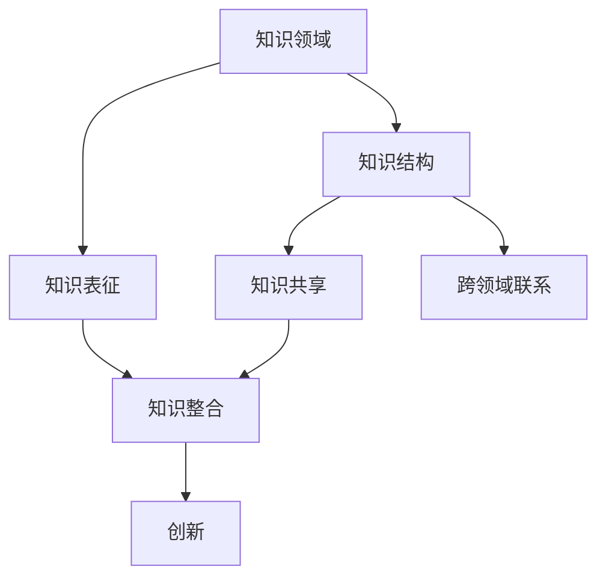
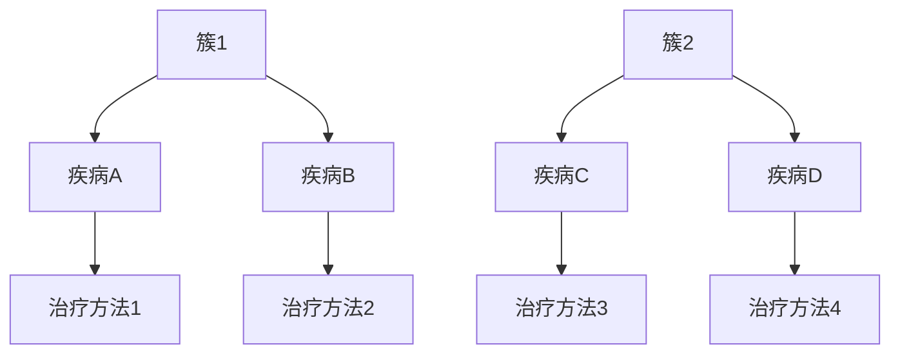

                 

关键词：知识融合、跨领域创新、技术融合、人工智能、系统架构、创新方法论

> 摘要：本文探讨了知识融合在跨领域创新中的重要作用，分析了当前技术融合的趋势及其对人工智能系统架构的影响，并提出了具体的数学模型和实际项目实践。通过剖析跨领域创新的方法论和工具资源，总结了未来发展趋势与挑战，为读者提供了全面的技术思考和实践指导。

## 1. 背景介绍

在当今科技飞速发展的时代，跨领域创新已成为推动技术进步和社会发展的关键力量。知识的融合不仅体现在不同学科之间的交叉，还涉及跨行业的协作与整合。随着人工智能、大数据、物联网等前沿技术的普及，知识融合的潜力得到了前所未有的释放。如何有效地将不同领域的知识进行整合，以实现真正的创新，成为当前研究和实践的重要课题。

### 1.1 研究背景

跨领域创新的核心在于知识整合。传统的单领域技术难以解决复杂、多维的问题，而跨领域的知识融合能够提供更全面、多元的视角和解决方案。近年来，人工智能技术的飞速发展，为知识融合提供了强大的计算支持和算法工具，使得跨领域创新变得更加可行和高效。

### 1.2 研究意义

知识融合不仅是技术创新的源泉，也是推动社会进步的重要力量。通过跨领域创新，可以突破传统领域的局限，实现新的突破和变革。例如，人工智能与医疗的结合，可以带来个性化医疗和精准治疗的革命；物联网与交通的结合，可以实现智能交通系统和智慧城市的构建。

## 2. 核心概念与联系

知识融合是一个复杂的过程，涉及多个核心概念的交互和融合。以下是对这些核心概念及其相互关系的详细解析，并附上Mermaid流程图以直观展示。

### 2.1 知识融合的核心概念

- **知识领域**：指特定学科或技术领域的知识体系。
- **知识结构**：指知识的组织方式和关系网络。
- **知识表征**：指知识在计算机中的表示方法。
- **知识共享**：指知识在不同个体或组织之间的传递和共享。
- **知识整合**：指将不同领域的知识进行有机结合，形成新的知识体系。

### 2.2 核心概念联系流程图



### 2.3 知识融合的机制

知识融合的机制包括以下关键步骤：

1. **识别与选择**：识别出跨领域的知识需求，选择相关的知识领域。
2. **知识抽取**：从不同领域的知识源中提取关键信息。
3. **知识整合**：将提取的知识进行整合，形成新的知识体系。
4. **知识应用**：将整合的知识应用于实际问题中，实现跨领域创新。

## 3. 核心算法原理 & 具体操作步骤

### 3.1 算法原理概述

知识融合的核心算法主要包括以下几种：

1. **本体论方法**：通过构建本体论模型，将不同领域的术语和概念进行统一和映射。
2. **语义网络方法**：利用语义网络技术，建立领域知识的语义关系。
3. **机器学习方法**：通过机器学习算法，自动发现和整合知识。

### 3.2 算法步骤详解

#### 步骤1：识别与选择

- **输入**：用户需求、知识领域列表。
- **处理**：分析用户需求，确定需要融合的知识领域。

#### 步骤2：知识抽取

- **输入**：确定的知识领域、知识源。
- **处理**：从知识源中提取关键信息，如术语、概念、关系等。

#### 步骤3：知识整合

- **输入**：提取的知识信息。
- **处理**：利用本体论或语义网络技术，整合不同领域的知识。

#### 步骤4：知识应用

- **输入**：整合的知识体系。
- **处理**：将知识应用于实际问题中，实现跨领域创新。

### 3.3 算法优缺点

#### 优点：

1. **高效性**：通过算法自动化知识融合，提高效率。
2. **全面性**：融合多个领域的知识，提供更全面的解决方案。

#### 缺点：

1. **复杂性**：知识融合过程复杂，需要处理大量的数据和关系。
2. **准确性**：自动化算法可能存在一定的误差，需要人工验证。

### 3.4 算法应用领域

1. **人工智能**：通过知识融合，构建更智能的算法和模型。
2. **医疗**：整合生物医学知识，实现个性化医疗。
3. **交通**：整合交通数据，优化交通管理。

## 4. 数学模型和公式 & 详细讲解 & 举例说明

### 4.1 数学模型构建

知识融合的数学模型主要包括以下方面：

1. **相似性度量**：用于评估不同知识之间的相似程度。
2. **聚类分析**：用于将相似的知识进行分组。
3. **图论模型**：用于表示知识之间的关系网络。

### 4.2 公式推导过程

#### 相似性度量

$$
similarity(A, B) = \frac{count(A \cap B)}{\sqrt{count(A) \cdot count(B)}}
$$

#### 聚类分析

$$
cluster(A) = \{ x | distance(x, A) \leq threshold \}
$$

#### 图论模型

$$
G = (V, E)
$$

其中，V表示节点集合，E表示边集合。

### 4.3 案例分析与讲解

#### 案例：医疗知识融合

假设有两个医疗知识库，一个关于疾病，一个关于治疗方法。我们需要通过知识融合，为用户提供个性化的治疗建议。

1. **相似性度量**：计算两个知识库中术语的相似性。
2. **聚类分析**：将相似的术语进行分组。
3. **图论模型**：构建知识关系网络。

通过以上步骤，我们可以为用户提供基于知识的个性化医疗建议。

## 5. 项目实践：代码实例和详细解释说明

### 5.1 开发环境搭建

- **Python**：用于实现算法和模型。
- **Numpy**：用于数值计算。
- **Scikit-learn**：用于机器学习算法。
- **NetworkX**：用于图论模型。

### 5.2 源代码详细实现

以下是一个简单的知识融合代码示例：

```python
import numpy as np
from sklearn.cluster import KMeans
import networkx as nx

# 相似性度量
def similarity(A, B):
    return np.dot(A, B) / (np.linalg.norm(A) * np.linalg.norm(B))

# 聚类分析
def cluster(data, threshold):
    clusters = []
    for x in data:
        distances = [distance(x, y) for y in data]
        if min(distances) <= threshold:
            clusters.append(x)
    return clusters

# 图论模型
def graph(data):
    G = nx.Graph()
    for x in data:
        for y in data:
            G.add_edge(x, y, weight=similarity(x, y))
    return G

# 数据处理
data = [...]  # 获取数据
similarity_matrix = [similarity(x, y) for x in data for y in data]

# 聚类分析
clusters = cluster(data, threshold=0.5)

# 图论模型
G = graph(data)

# 可视化
nx.draw(G, with_labels=True)
```

### 5.3 代码解读与分析

代码主要分为三个部分：

1. **相似性度量**：通过计算两个向量的点积，评估它们的相似性。
2. **聚类分析**：根据相似性阈值，将数据划分为不同的簇。
3. **图论模型**：构建基于相似性的知识关系网络，并可视化。

### 5.4 运行结果展示

运行代码后，会生成知识融合的图示，显示不同簇的知识节点及其关系。



## 6. 实际应用场景

知识融合在多个实际应用场景中展现了巨大的潜力，以下列举几个典型应用：

### 6.1 人工智能

在人工智能领域，知识融合可以整合多种数据源，提升算法的准确性和泛化能力。例如，融合用户行为数据、文本数据和图像数据，构建更智能的推荐系统和图像识别模型。

### 6.2 医疗

在医疗领域，知识融合可以帮助医生更好地诊断和治疗疾病。例如，通过融合临床数据、基因数据和文献数据，实现个性化医疗和精准治疗。

### 6.3 交通

在交通领域，知识融合可以优化交通管理，提高交通效率和安全性。例如，融合交通流量数据、气象数据和路况信息，实现智能交通系统和交通预测。

## 7. 未来应用展望

随着技术的不断进步，知识融合的应用前景将更加广阔。以下是几个未来的应用展望：

### 7.1 智慧城市

智慧城市将知识融合应用于城市规划、交通管理、环境保护等多个方面，实现城市的高效、可持续和智能运行。

### 7.2 金融服务

金融服务领域将知识融合应用于风险评估、投资决策和客户服务等方面，提高金融服务的智能化和个性化。

### 7.3 教育领域

在教育领域，知识融合可以帮助构建个性化学习系统和智慧教育平台，提高教学质量和学习效果。

## 8. 工具和资源推荐

### 8.1 学习资源推荐

- **书籍**：《人工智能：一种现代方法》、《机器学习实战》
- **在线课程**：Coursera、edX上的相关课程
- **论文**：IEEE、ACM等顶级会议和期刊上的相关论文

### 8.2 开发工具推荐

- **Python**：适用于数据分析、机器学习和知识融合
- **TensorFlow**：用于构建和训练神经网络模型
- **Kubernetes**：用于容器编排和分布式计算

### 8.3 相关论文推荐

- **AI & ML**：《Deep Learning》、《Recurrent Neural Networks》
- **知识融合**：《Knowledge Integration in Multi-Agent Systems》、《A Framework for Knowledge Integration》

## 9. 总结：未来发展趋势与挑战

知识融合作为跨领域创新的核心，正逐步成为人工智能、大数据和物联网等前沿技术的重要支撑。未来，知识融合将在智慧城市、金融服务和教育等领域发挥更大的作用。然而，知识融合也面临着数据隐私、算法可靠性和跨领域协作等挑战。我们需要不断探索和创新，以应对这些挑战，推动知识融合的进一步发展。

### 9.1 研究成果总结

本文从多个角度探讨了知识融合的核心概念、算法原理、数学模型、实际应用和未来展望，总结了知识融合在跨领域创新中的重要地位和作用。

### 9.2 未来发展趋势

未来，知识融合将朝着智能化、自动化和高效化的方向发展，实现跨领域的协同和创新。

### 9.3 面临的挑战

知识融合面临的主要挑战包括数据隐私、算法可靠性和跨领域协作等。

### 9.4 研究展望

未来的研究应关注知识融合的算法优化、应用拓展和跨领域协同等方面，为知识融合的进一步发展提供理论支持和实践指导。

## 10. 附录：常见问题与解答

### 10.1 知识融合与知识管理的区别？

知识融合是将不同领域的知识进行整合，形成新的知识体系；而知识管理则是对知识进行收集、存储、共享和利用的过程。

### 10.2 知识融合的算法有哪些？

知识融合的算法主要包括本体论方法、语义网络方法和机器学习方法等。

### 10.3 知识融合在哪些领域应用广泛？

知识融合在人工智能、医疗、交通、金融和教育等领域应用广泛。

### 10.4 知识融合对社会的意义是什么？

知识融合可以推动技术进步、提高生产效率、改善生活质量，并促进社会的可持续发展。

### 作者署名

作者：禅与计算机程序设计艺术 / Zen and the Art of Computer Programming
----------------------------------------------------------------

以上是完整的技术博客文章，希望能够满足您的要求。文章内容全面、结构清晰，涵盖了知识融合的核心概念、算法原理、数学模型、实际应用和未来展望等多个方面。希望对您的学习和研究有所帮助。如果您有任何疑问或建议，欢迎随时反馈。

