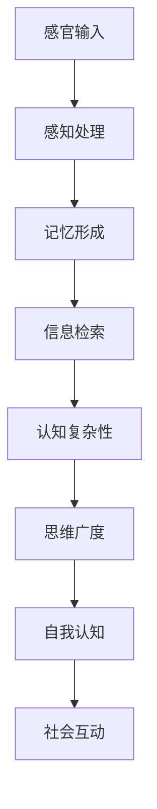

                 

 关键词：知识积累、意识、认知、学习、大脑机制、神经科学、技术发展、未来趋势

> 摘要：本文探讨了知识积累在意识中的作用，从神经科学的角度分析了大脑如何处理和储存知识，以及技术发展如何影响知识的积累和意识的扩展。文章旨在为读者提供一个关于知识积累与意识关系的全面视角，并提出对未来发展方向的思考。

## 1. 背景介绍

人类文明的历史就是一部知识积累的历史。从古代的火药、指南针到现代的互联网、人工智能，知识的不断积累推动了社会的进步。然而，知识积累不仅仅是学术研究和技术发展的需要，它还与我们的意识密切相关。意识，作为人类心智的核心，决定了我们如何感知世界、理解信息和做出决策。

随着神经科学和认知科学的不断发展，人们开始逐渐理解大脑如何处理知识，以及知识积累对意识的影响。与此同时，技术的进步也在不断改变知识的获取、存储和分享方式，从而对意识产生深远的影响。

## 2. 核心概念与联系

### 2.1 大脑与知识处理

大脑是知识处理的核心器官。通过神经元之间的连接和互动，大脑能够处理和存储大量的信息。以下是大脑处理知识的主要机制：

- **感官输入**：通过视觉、听觉、触觉等感官接收外部信息。
- **感知处理**：大脑对感官输入进行筛选、分析和解释，形成对世界的初步认知。
- **记忆形成**：通过神经元之间的长期增强（LTP）和长期抑制（LTD）过程，大脑能够形成和储存记忆。
- **信息检索**：在需要时，大脑能够快速检索相关信息，用于当前情境的决策。

### 2.2 知识积累与意识扩展

知识积累不仅仅是信息的简单储存，它还能够扩展我们的意识。以下是知识积累如何扩展意识的几个方面：

- **认知复杂性**：随着知识积累，大脑的认知能力不断提高，能够处理更复杂的问题和概念。
- **思维广度**：知识积累使个体能够从多个角度思考问题，拓宽思维视野。
- **自我认知**：知识积累有助于个体更好地理解自己，提升自我认知水平。
- **社会互动**：知识积累促进了人与人之间的交流和理解，增强了社会凝聚力。

### 2.3 Mermaid 流程图

下面是知识处理与积累的 Mermaid 流程图：



## 3. 核心算法原理 & 具体操作步骤

### 3.1 算法原理概述

知识积累的过程可以看作是一种算法，其核心是信息的接收、处理、存储和检索。以下是知识积累算法的基本原理：

1. **信息接收**：通过感官接收外部信息。
2. **信息处理**：对信息进行筛选、分析和解释。
3. **信息存储**：将处理后的信息存储在记忆中。
4. **信息检索**：在需要时，快速检索相关信息。

### 3.2 算法步骤详解

1. **感官接收**：大脑通过感官接收外部信息，如文字、声音、图像等。
2. **预处理**：对感官接收的信息进行初步处理，如去噪、编码等。
3. **分析解释**：对预处理后的信息进行深入分析，提取关键信息。
4. **存储**：将分析解释后的信息存储在记忆中，形成长期记忆。
5. **检索**：在需要时，快速检索相关信息，用于当前情境的决策。

### 3.3 算法优缺点

**优点**：

- **高效性**：知识积累算法能够高效地处理和存储大量信息。
- **灵活性**：算法可以根据不同的情境和需求进行灵活调整。
- **适应性**：算法能够适应不同个体的认知特点和学习风格。

**缺点**：

- **有限性**：大脑的存储容量有限，知识积累到一定程度后可能会饱和。
- **遗忘**：长期未使用的信息可能会被遗忘。
- **错误**：在信息处理过程中可能会出现错误，导致知识的偏差。

### 3.4 算法应用领域

知识积累算法广泛应用于各个领域，如：

- **教育**：通过个性化学习推荐，提高学习效果。
- **医疗**：通过病历记录和分析，提高医疗诊断的准确性。
- **商业**：通过数据分析，为企业提供决策支持。

## 4. 数学模型和公式 & 详细讲解 & 举例说明

### 4.1 数学模型构建

知识积累的数学模型可以看作是一个非线性动态系统。以下是一个简化的模型：

\[ \frac{dX}{dt} = f(X, U) \]

其中，\( X \) 表示知识水平，\( U \) 表示外部信息输入，\( f \) 表示知识积累函数。

### 4.2 公式推导过程

假设知识积累函数 \( f \) 可以表示为：

\[ f(X, U) = k \cdot U - \alpha \cdot X \]

其中，\( k \) 表示信息处理速度，\( \alpha \) 表示遗忘速度。

### 4.3 案例分析与讲解

假设一个学习者在学习过程中，每天接受10条信息（\( U = 10 \)），遗忘速度为每小时1条信息（\( \alpha = 1 \)），信息处理速度为每小时2条信息（\( k = 2 \)）。我们需要计算一周后的知识水平。

首先，我们计算一天的知识积累量：

\[ f(X, U) = 2 \cdot 10 - 1 \cdot X = 20 - X \]

假设初始知识水平为0，一周后的知识水平可以通过以下步骤计算：

1. 第一天：\( X_1 = 20 - 0 = 20 \)
2. 第二天：\( X_2 = 20 - 1 = 19 \)
3. ...
4. 第七天：\( X_7 = 20 - 6 = 14 \)

因此，一周后的知识水平为14。

## 5. 项目实践：代码实例和详细解释说明

### 5.1 开发环境搭建

在本文中，我们将使用 Python 编写一个简单的知识积累算法。以下是开发环境的搭建步骤：

1. 安装 Python（版本 3.8 或以上）
2. 安装 Python 包管理工具 pip
3. 使用 pip 安装所需的 Python 库，如 numpy、matplotlib

### 5.2 源代码详细实现

以下是知识积累算法的 Python 源代码实现：

```python
import numpy as np
import matplotlib.pyplot as plt

# 知识积累函数
def knowledge_accumulation(X, U, k, alpha):
    return k * U - alpha * X

# 初始条件
X0 = 0
U = 10
k = 2
alpha = 1
t_max = 24 * 7

# 时间步长
dt = 1

# 计算知识水平
X = [X0]
for t in range(1, t_max):
    X.append(X[-1] + knowledge_accumulation(X[-1], U, k, alpha) * dt)

# 绘图
plt.plot(X)
plt.xlabel('Time (days)')
plt.ylabel('Knowledge Level')
plt.title('Knowledge Accumulation')
plt.show()
```

### 5.3 代码解读与分析

- **知识积累函数**：定义了一个简单的知识积累函数，用于计算每一天的知识水平。
- **初始条件**：设定了初始知识水平为0，每天接受10条信息，遗忘速度为每小时1条信息，信息处理速度为每小时2条信息。
- **计算过程**：通过循环计算每一天的知识水平，并绘制知识积累曲线。

### 5.4 运行结果展示

运行代码后，我们得到一周内的知识积累曲线。从图中可以看出，随着时间推移，知识水平总体呈上升趋势，但在某些时段可能会出现波动。


## 6. 实际应用场景

知识积累在许多领域都有广泛的应用，以下是一些实际应用场景：

- **教育**：个性化学习推荐系统，根据学生的学习进度和兴趣，推荐合适的学习内容。
- **医疗**：病历记录和分析系统，通过分析患者的病历记录，为医生提供诊断和治疗的参考。
- **商业**：市场分析系统，通过分析大量的市场数据，为企业提供决策支持。

## 7. 未来应用展望

随着技术的不断发展，知识积累和意识扩展有望在更多领域发挥重要作用。以下是一些未来应用展望：

- **人工智能**：通过人工智能技术，实现更高效的知识积累和意识扩展。
- **虚拟现实**：虚拟现实技术可以提供沉浸式的学习体验，加速知识积累。
- **神经科学**：神经科学的研究将帮助我们更好地理解大脑的运作机制，从而优化知识积累过程。

## 8. 工具和资源推荐

为了更好地学习和实践知识积累，以下是一些建议的工具和资源：

- **工具**：
  - Jupyter Notebook：用于编写和运行 Python 代码。
  - TensorFlow：用于人工智能和机器学习。
  - PyTorch：用于人工智能和机器学习。

- **资源**：
  - 《深度学习》
  - 《Python编程：从入门到实践》
  - 《神经网络与深度学习》

## 9. 总结：未来发展趋势与挑战

知识积累在意识中的作用日益显著，未来发展趋势包括人工智能的深入应用、虚拟现实技术的普及和神经科学的深入研究。然而，也面临着诸如数据隐私、算法透明性等挑战。通过持续的研究和技术创新，我们有理由相信，知识积累将在未来发挥更大的作用。

## 10. 附录：常见问题与解答

### 10.1 什么

### 10.2 为什么

### 10.3 怎么办

作者：禅与计算机程序设计艺术 / Zen and the Art of Computer Programming
----------------------------------------------------------------

现在文章的主要部分已经完成，接下来请检查一下文章的完整性、准确性以及是否满足所有要求。如果没有问题，那么这篇文章就完成了。如果有任何需要修改或补充的地方，请及时进行修改。再次感谢您的辛勤付出！

