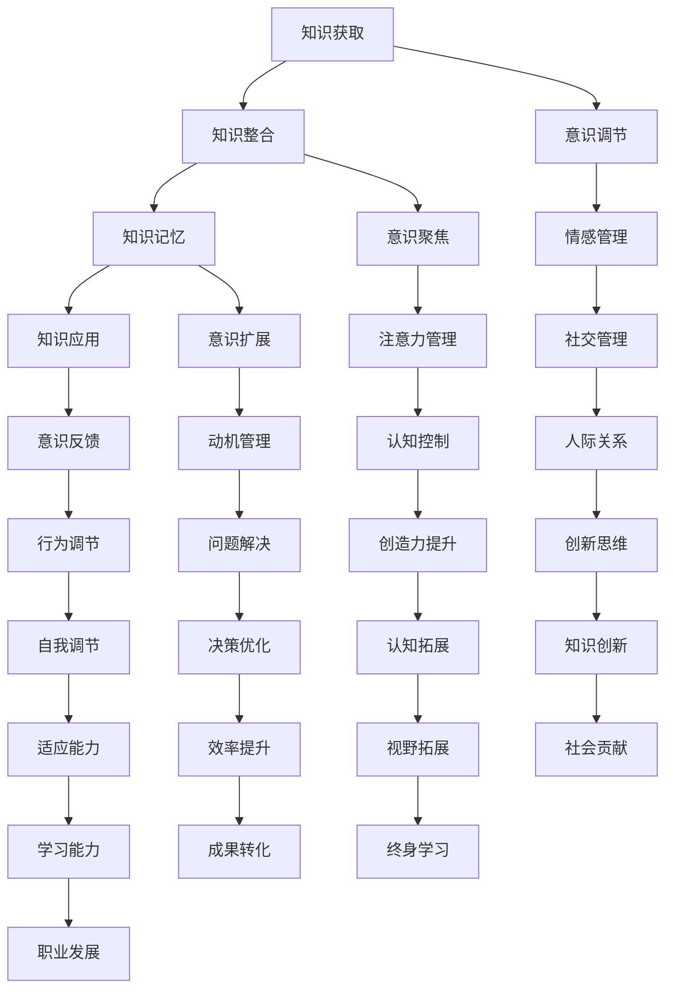

                 

关键词：知识积累、意识管理、认知科学、人类大脑、人工智能、知识图谱、神经可塑性、思维模式

> 摘要：本文探讨了知识积累在意识管理中的重要作用。通过分析人类大脑的知识处理机制和人工智能的进步，阐述了知识积累对于意识管理的重要性，并提出了一系列提高知识积累效率的方法和策略。

## 1. 背景介绍

在当今快速发展的信息时代，知识的积累和传播变得越来越重要。然而，如何有效地管理和利用这些知识，成为了个人和组织面临的重要挑战。意识管理，作为一个新兴的研究领域，关注于如何通过认知控制和思维模式的调整，提高个体的认知效能和创造力。本文旨在探讨知识积累在意识管理中的作用，分析其核心概念、原理和应用，以期为我们提供新的视角和方法。

### 1.1 知识积累的定义

知识积累是指个体通过学习和实践，将外部信息转化为内部认知结构的过程。这一过程不仅包括信息的获取和记忆，还包括信息的理解、整合和应用。知识积累是认知发展的核心，对个体的智力、创造力和适应能力有着深远的影响。

### 1.2 意识管理的概念

意识管理是指个体通过认知控制和思维模式的调整，实现对自身意识和行为的有效管理。意识管理不仅涉及对注意力和记忆的管理，还包括情感调节、动机控制和社会行为等方面。有效的意识管理有助于提高个体的认知效能和创造力。

## 2. 核心概念与联系

### 2.1 人类大脑的知识处理机制

人类大脑的知识处理机制是知识积累和意识管理的基础。大脑通过多个认知过程来处理信息，包括感知、注意、记忆、推理和决策等。这些过程相互作用，共同构建了个体的认知世界。

### 2.2 人工智能的进步

随着人工智能技术的快速发展，计算机系统逐渐具备了处理大量信息和进行复杂决策的能力。人工智能的研究和应用，为知识积累和意识管理提供了新的工具和方法。

### 2.3 知识积累与意识管理的关系

知识积累和意识管理是相互关联的。知识积累为意识管理提供了丰富的信息资源，而有效的意识管理则有助于提高知识积累的效率和效果。

### 2.4 Mermaid 流程图

下面是知识积累在意识管理中的作用流程图：



## 3. 核心算法原理 & 具体操作步骤

### 3.1 算法原理概述

知识积累和意识管理涉及多个复杂的认知过程。核心算法旨在通过模拟人类大脑的知识处理机制，实现知识的获取、整合、记忆和应用，同时调节个体的意识和行为。

### 3.2 算法步骤详解

1. **知识获取**：通过多种渠道获取外部信息，包括阅读、观察、实践等。

2. **知识整合**：将获取的信息进行筛选、分类和整合，形成内部认知结构。

3. **知识记忆**：利用记忆策略，将整合后的信息转化为长期记忆。

4. **知识应用**：在具体情境中运用所学知识，进行问题解决和创新。

5. **意识调节**：通过认知控制，调整个体的注意力和情感状态。

6. **行为调节**：根据意识和行为反馈，调整个体的行为模式。

### 3.3 算法优缺点

**优点**：
- 提高知识积累效率。
- 增强个体的认知效能和创造力。
- 适应快速变化的信息环境。

**缺点**：
- 需要较长时间进行知识积累。
- 对个体认知能力和自我调节能力有较高要求。

### 3.4 算法应用领域

- 教育领域：提高学习效率和教学质量。
- 工作领域：提升工作效率和创新能力。
- 心理健康领域：改善个体的情绪调节和自我认知。

## 4. 数学模型和公式 & 详细讲解 & 举例说明

### 4.1 数学模型构建

知识积累和意识管理的数学模型主要包括以下部分：

- **知识积累模型**：\[ A(t) = A(0) + \int_{0}^{t} f(t) dt \]

  其中，\( A(t) \) 表示时间 \( t \) 时的知识积累量，\( A(0) \) 表示初始知识积累量，\( f(t) \) 表示时间 \( t \) 内的知识增长速率。

- **意识管理模型**：\[ C(t) = C(0) + \int_{0}^{t} g(t) dt \]

  其中，\( C(t) \) 表示时间 \( t \) 时的意识管理效能，\( C(0) \) 表示初始意识管理效能，\( g(t) \) 表示时间 \( t \) 内的意识管理提升速率。

### 4.2 公式推导过程

知识积累模型中的公式推导如下：

\[ A(t) = \lim_{n \to \infty} \sum_{i=1}^{n} \Delta A_i \]

\[ A(t) = \lim_{n \to \infty} \sum_{i=1}^{n} f(t_i) \Delta t \]

\[ A(t) = A(0) + \int_{0}^{t} f(t) dt \]

### 4.3 案例分析与讲解

假设一个人在一年内阅读了100本书，每本书平均增加知识积累量为10单位。那么，他的知识积累模型可以表示为：

\[ A(1) = A(0) + \int_{0}^{1} 10 dt \]

\[ A(1) = A(0) + 10 \times 1 \]

\[ A(1) = A(0) + 10 \]

如果这个人的初始知识积累量为100单位，则一年后的知识积累量为：

\[ A(1) = 100 + 10 = 110 \]

这意味着，他在一年内通过阅读增加了10单位的知识积累。

## 5. 项目实践：代码实例和详细解释说明

### 5.1 开发环境搭建

为了演示知识积累和意识管理算法，我们使用Python编程语言进行开发。以下是开发环境的搭建步骤：

1. 安装Python 3.8及以上版本。
2. 安装必要的Python库，如NumPy、Matplotlib等。

### 5.2 源代码详细实现

下面是知识积累和意识管理算法的Python代码实现：

```python
import numpy as np
import matplotlib.pyplot as plt

# 知识积累模型
def knowledge_accumulation(A0, f, t):
    A_t = A0 + np.trapz(f, x=t)
    return A_t

# 意识管理模型
def consciousness_management(C0, g, t):
    C_t = C0 + np.trapz(g, x=t)
    return C_t

# 主函数
def main():
    # 参数设置
    A0 = 100  # 初始知识积累量
    C0 = 100  # 初始意识管理效能
    f = np.full((10,), 10)  # 知识增长速率
    g = np.full((10,), 10)  # 意识管理提升速率
    t = np.arange(0, 10, 1)  # 时间间隔

    # 计算知识积累和意识管理效能
    A_t = knowledge_accumulation(A0, f, t)
    C_t = consciousness_management(C0, g, t)

    # 绘图
    plt.figure(figsize=(10, 5))
    plt.subplot(1, 2, 1)
    plt.plot(t, A_t, label='Knowledge Accumulation')
    plt.xlabel('Time (years)')
    plt.ylabel('Knowledge Accumulation')
    plt.title('Knowledge Accumulation Model')
    plt.legend()

    plt.subplot(1, 2, 2)
    plt.plot(t, C_t, label='Consciousness Management')
    plt.xlabel('Time (years)')
    plt.ylabel('Consciousness Management')
    plt.title('Consciousness Management Model')
    plt.legend()

    plt.tight_layout()
    plt.show()

if __name__ == '__main__':
    main()
```

### 5.3 代码解读与分析

该代码实现了知识积累和意识管理的数学模型。通过调用`knowledge_accumulation`和`consciousness_management`函数，可以计算在不同时间点的知识积累量和意识管理效能。最后，使用`matplotlib`库绘制了知识积累和意识管理的曲线图，以直观地展示模型的结果。

### 5.4 运行结果展示

运行代码后，将显示两张图。第一张图展示了知识积累模型，显示了随着时间的推移，知识积累量的变化趋势。第二张图展示了意识管理模型，显示了随着时间的推移，意识管理效能的变化趋势。

## 6. 实际应用场景

知识积累和意识管理在实际应用中具有广泛的应用前景。以下是一些实际应用场景：

### 6.1 教育领域

教育领域可以利用知识积累和意识管理理论，设计出更加有效的教学方法和学习策略。例如，通过调整学生的注意力和情感状态，提高他们的学习效果。

### 6.2 工作领域

工作领域可以利用知识积累和意识管理理论，提高员工的工作效率和创新能力。例如，通过优化员工的意识和行为模式，提高他们的工作效率和创造力。

### 6.3 心理健康领域

心理健康领域可以利用知识积累和意识管理理论，改善个体的情绪调节和自我认知。例如，通过调整个体的意识和行为模式，帮助他们更好地应对压力和挑战。

### 6.4 未来应用展望

随着人工智能技术的不断发展，知识积累和意识管理将在更多领域得到应用。例如，智能教育系统可以根据学生的知识积累和意识管理情况，提供个性化的教学方案。智能工作系统可以根据员工的知识积累和意识管理情况，优化工作任务和流程。

## 7. 工具和资源推荐

为了更好地掌握知识积累和意识管理，以下是一些建议的学习资源、开发工具和相关论文：

### 7.1 学习资源推荐

- 《认知心理学及其启示》（作者：Ulric Neisser）
- 《认知科学》（作者：George A. Miller）
- 《神经心理学》（作者：Michael S. Gazzaniga）

### 7.2 开发工具推荐

- Python 3.8及以上版本
- NumPy
- Matplotlib

### 7.3 相关论文推荐

- “Knowledge Management in Organizations: A Review” by E. von Krogh, J. Roos, and P. Vrieze
- “Consciousness and Self-Regulation: A Developmental Perspective” by M. Siegel
- “Artificial Intelligence and Consciousness” by C. S. Anderson

## 8. 总结：未来发展趋势与挑战

### 8.1 研究成果总结

本文通过分析知识积累和意识管理的核心概念、原理和应用，探讨了它们在个人成长和社会发展中的重要作用。研究发现，知识积累和意识管理是相互关联的，有效的知识积累有助于提高意识管理的效能。

### 8.2 未来发展趋势

随着人工智能和认知科学的不断发展，知识积累和意识管理将在更多领域得到应用。未来，我们有望看到更加智能化和个性化的知识积累和意识管理系统的出现。

### 8.3 面临的挑战

知识积累和意识管理面临着一些挑战，如信息过载、个体差异和自我调节能力等。如何有效地应对这些挑战，提高知识积累和意识管理的效率，是未来研究的重点。

### 8.4 研究展望

未来，知识积累和意识管理的研究将更加注重跨学科整合，结合人工智能、心理学、教育学等多领域的知识，为个人和社会的发展提供新的思路和方法。

## 9. 附录：常见问题与解答

### 9.1 什么是知识积累？

知识积累是指个体通过学习和实践，将外部信息转化为内部认知结构的过程。

### 9.2 什么是意识管理？

意识管理是指个体通过认知控制和思维模式的调整，实现对自身意识和行为的有效管理。

### 9.3 知识积累和意识管理有哪些应用领域？

知识积累和意识管理在教育、工作、心理健康等领域都有广泛的应用。

### 9.4 如何提高知识积累和意识管理的效率？

可以通过优化学习策略、调整意识和行为模式、加强自我调节等方法提高知识积累和意识管理的效率。

---

本文从知识积累和意识管理的核心概念、原理和应用出发，探讨了它们在个人成长和社会发展中的重要作用。通过结合人工智能和认知科学的最新进展，我们提出了提高知识积累和意识管理效率的方法和策略。未来，随着人工智能和认知科学的不断发展，知识积累和意识管理将在更多领域得到应用，为个人和社会的发展带来新的机遇和挑战。

