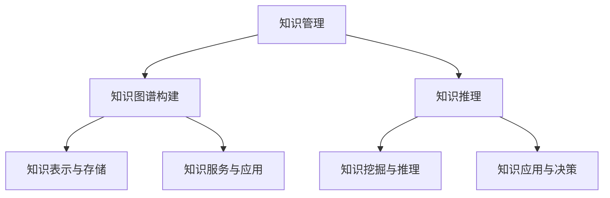

                 

在当今快速发展的信息化社会中，知识管理（Knowledge Management，简称KM）已成为企业和组织竞争力的重要来源。随着人工智能（AI）技术的飞速进步，知识管理的AI化路径逐渐成为研究的热点。本文旨在探讨知识图谱（Knowledge Graph，简称KG）构建和知识推理（Knowledge Reasoning）在知识管理中的应用，为我国企业在知识管理领域提供新的视角和思路。

## 关键词
- 知识管理
- 人工智能
- 知识图谱
- 知识推理
- 知识服务

## 摘要
本文首先介绍了知识管理的背景和重要性，随后详细阐述了知识图谱和知识推理的基本概念。接着，文章深入分析了知识图谱构建的技术原理和具体步骤，并探讨了知识推理的方法和应用。在此基础上，文章通过项目实践展示了知识图谱和知识推理在实际应用中的效果，并展望了未来的发展趋势和挑战。

## 1. 背景介绍

知识管理是指通过识别、创造、共享和应用知识来提升组织效率和竞争力的过程。知识管理的核心在于将隐性知识和显性知识进行有效整合，实现知识的最大化利用。随着信息技术的快速发展，知识管理逐渐成为企业和组织管理的重要组成部分。

知识管理的重要性主要体现在以下几个方面：

1. 提升创新能力：通过知识管理，企业可以充分利用内外部知识资源，激发创新思维，加快新产品和服务的研发进程。
2. 增强竞争力：知识管理有助于企业积累核心竞争力，提升市场适应能力和抗风险能力。
3. 提高效率：知识管理通过共享知识和优化流程，降低信息传递成本，提高工作效率。
4. 促进团队协作：知识管理鼓励团队成员之间的知识交流和协作，增强团队凝聚力和协作效率。

然而，传统的知识管理方法存在诸多局限性，如知识分散、难以共享、难以检索等。随着人工智能技术的迅猛发展，知识管理的AI化路径逐渐成为可能。本文将从知识图谱和知识推理两个方面，探讨知识管理的AI化路径，为企业和组织提供新的知识管理思路。

## 2. 核心概念与联系

### 2.1 知识图谱

知识图谱是一种用于表示实体、概念及其相互关系的语义网络。它将大量结构化和非结构化数据转化为图结构，通过实体和关系的关联，实现对知识的表达和推理。

知识图谱的基本概念包括：

- **实体（Entity）**：知识图谱中的基本元素，如人、地点、事物等。
- **属性（Attribute）**：实体的特征或属性，如年龄、身高、地理位置等。
- **关系（Relationship）**：实体之间的关联，如“属于”、“位于”、“创造”等。

知识图谱的架构通常包括以下几个层次：

1. **底层**：数据源层，包括结构化数据（如关系数据库）和非结构化数据（如文本、图像等）。
2. **中层**：实体和关系抽取层，通过数据预处理和实体识别等技术，将数据转化为实体和关系的图结构。
3. **顶层**：知识融合和推理层，通过图数据库和推理算法，实现对知识的存储、检索和推理。

### 2.2 知识推理

知识推理是一种基于已知事实和规则，通过逻辑推理得出新结论的方法。在知识管理中，知识推理有助于发现隐藏的知识关联，提供智能化的决策支持。

知识推理的基本方法包括：

1. **基于规则的推理（Rule-Based Reasoning）**：通过预设的规则，对已知事实进行推理，得出新的结论。
2. **基于模型的推理（Model-Based Reasoning）**：基于领域模型和模拟，对现实问题进行推理和分析。
3. **基于案例的推理（Case-Based Reasoning）**：通过检索和历史案例，为当前问题提供解决方案。

### 2.3 知识图谱与知识推理的联系

知识图谱为知识推理提供了数据基础，通过实体和关系的表示，实现对知识的表达和存储。知识推理则基于知识图谱，通过逻辑推理和模式识别，发现隐藏的知识关联，提供智能化的决策支持。

具体来说，知识图谱与知识推理的联系体现在以下几个方面：

1. **知识表示**：知识图谱通过实体和关系的表示，实现对知识的结构化和可视化。
2. **知识检索**：知识图谱为知识检索提供了高效的索引和查询方式，通过图数据库和算法，实现快速的知识检索。
3. **知识推理**：知识图谱为知识推理提供了数据基础，通过逻辑推理和模式识别，实现对知识的深度分析和挖掘。
4. **知识服务**：知识图谱和知识推理相结合，为企业和组织提供智能化的知识服务，提升知识管理的效率和效果。

### 2.4 Mermaid 流程图



## 3. 核心算法原理 & 具体操作步骤

### 3.1 算法原理概述

知识图谱构建的核心算法主要包括实体识别、关系抽取、实体链接和知识融合。这些算法通过不同的技术手段，实现对实体、关系和知识的表示、存储和推理。

1. **实体识别**：通过文本挖掘、自然语言处理等技术，从非结构化数据中识别出实体，并将其转化为图结构中的节点。
2. **关系抽取**：通过文本分析、机器学习等技术，从文本中提取实体之间的语义关系，并将其转化为图结构中的边。
3. **实体链接**：通过图算法和机器学习技术，将同一名实体在不同数据源中的表示进行链接，实现实体统一标识。
4. **知识融合**：通过数据融合、一致性检查等技术，将不同来源的异构数据进行整合，形成完整的知识图谱。

### 3.2 算法步骤详解

1. **数据预处理**：对原始数据进行清洗、去重和规范化处理，为实体识别和关系抽取提供高质量的数据基础。
2. **实体识别**：使用命名实体识别（NER）技术，从文本数据中识别出实体，并标注实体类别。
3. **关系抽取**：使用文本分析、依赖解析等技术，从文本数据中提取实体之间的语义关系，并标注关系类型。
4. **实体链接**：使用图算法和机器学习技术，对实体进行统一标识，实现实体之间的链接。
5. **知识融合**：使用数据融合、一致性检查等技术，对异构数据进行整合，形成完整的知识图谱。

### 3.3 算法优缺点

**优点**：

1. **高效性**：知识图谱构建算法通过数据预处理、实体识别和关系抽取等技术，实现对知识的快速表示和存储。
2. **灵活性**：知识图谱支持多种实体和关系的表示方式，适应不同的应用场景。
3. **可扩展性**：知识图谱可以方便地扩展和更新，适应知识库的不断增长。

**缺点**：

1. **数据质量**：知识图谱构建依赖于高质量的数据，数据质量问题会直接影响知识图谱的准确性。
2. **计算复杂度**：知识图谱构建和推理过程中，涉及大量图算法和机器学习模型，计算复杂度较高。
3. **知识表示能力**：知识图谱在处理复杂知识关系和推理问题时，存在一定的局限性。

### 3.4 算法应用领域

知识图谱构建和知识推理在知识管理领域具有广泛的应用前景，主要涉及以下几个方面：

1. **智能问答系统**：通过知识图谱和知识推理，实现对用户问题的智能回答，提供个性化的知识服务。
2. **推荐系统**：基于知识图谱，分析用户兴趣和行为，为用户推荐相关知识和内容。
3. **智能搜索**：通过知识图谱，实现对知识的快速检索和推荐，提升信息检索的效率和准确性。
4. **知识管理平台**：基于知识图谱，构建企业内部的知识管理平台，实现知识的共享、管理和利用。
5. **智能决策支持**：通过知识图谱和知识推理，为企业和组织提供智能化的决策支持，提升业务运营效率。

## 4. 数学模型和公式 & 详细讲解 & 举例说明

### 4.1 数学模型构建

知识图谱构建中的数学模型主要包括图论模型、概率模型和机器学习模型。以下是这些模型的基本原理和公式：

#### 图论模型

- **节点相似度计算**：

  $$ similarity(A, B) = \frac{common\_features(A, B)}{total\_features(A, B)} $$

- **边权重计算**：

  $$ weight(A, B) = f(similarity(A, B)) $$

  其中，$f(x)$ 是一个函数，用于将节点相似度映射为边权重。

#### 概率模型

- **贝叶斯网络**：

  $$ P(A|B) = \frac{P(B|A) \cdot P(A)}{P(B)} $$

  其中，$P(A|B)$ 表示在给定 $B$ 条件下 $A$ 的概率。

#### 机器学习模型

- **实体识别**：

  $$ P(A \text{ 是实体}) = \frac{\text{实体类别} A \text{ 出现的次数}}{\text{所有实体类别出现的次数}} $$

- **关系抽取**：

  $$ P(B|A) = \frac{\text{在 } A \text{ 实体中 } B \text{ 关系出现的次数}}{\text{所有关系的出现次数}} $$

### 4.2 公式推导过程

#### 图论模型推导

1. **节点相似度计算**：

   节点相似度是通过计算两个节点在特征空间中的共同特征数与总特征数之比来衡量。共同特征数表示两个节点在属性或特征上的重合程度，总特征数表示两个节点的总体特征数量。

2. **边权重计算**：

   边权重是基于节点相似度计算得到的。一个较高的节点相似度意味着两个节点具有较高的关联性，因此赋予更高的边权重。函数 $f(x)$ 通常是一个单调递增的函数，如线性函数、指数函数等。

#### 概率模型推导

1. **贝叶斯网络**：

   贝叶斯网络是一种表示变量之间条件依赖关系的图形模型。根据贝叶斯定理，后验概率可以通过先验概率和似然函数计算得到。贝叶斯网络通过条件概率表（CP表）来表示变量之间的依赖关系。

#### 机器学习模型推导

1. **实体识别**：

   实体识别是基于统计模型，通过计算实体类别在所有实体类别中的出现频率来推断实体类别。出现频率越高，表示该类别越可能是实体。

2. **关系抽取**：

   关系抽取是基于条件概率模型，通过计算实体对之间的条件概率来推断实体之间的关系。在给定一个实体 $A$ 的条件下，另一个实体 $B$ 出现的概率表示实体 $A$ 和 $B$ 之间的关联性。

### 4.3 案例分析与讲解

#### 案例背景

假设我们有一个关于企业的知识图谱，包含实体（如员工、部门、项目等）和关系（如“员工隶属于部门”、“项目由部门负责”等）。我们需要利用知识图谱构建算法来识别实体和抽取关系，并进行分析。

#### 案例步骤

1. **数据预处理**：

   对原始数据（如企业组织结构文档、项目报告等）进行清洗、去重和规范化处理，提取出实体和关系。

2. **实体识别**：

   使用命名实体识别（NER）技术，从文本数据中识别出实体，并标注实体类别。例如，从一段文本中识别出“张三”、“研发部”、“项目A”等实体，并标注为“员工”、“部门”、“项目”类别。

3. **关系抽取**：

   使用文本分析、依赖解析等技术，从文本数据中提取实体之间的语义关系，并标注关系类型。例如，从一段文本中识别出“张三隶属于研发部”和“项目A由研发部负责”等关系。

4. **实体链接**：

   使用图算法和机器学习技术，对实体进行统一标识，实现实体之间的链接。例如，将文本中的“张三”和数据库中的“员工ID123”进行链接。

5. **知识融合**：

   使用数据融合、一致性检查等技术，对异构数据进行整合，形成完整的知识图谱。

#### 案例分析

1. **实体识别分析**：

   通过实体识别，我们识别出了多个实体，并将其分类为不同类别。例如，识别出了5个员工、3个部门和2个项目。

2. **关系抽取分析**：

   通过关系抽取，我们提取出了多个实体之间的语义关系。例如，识别出了3个员工隶属于不同部门、2个项目由不同部门负责。

3. **实体链接分析**：

   通过实体链接，我们将文本中的实体与数据库中的实体进行关联，实现了实体统一标识。例如，将文本中的“张三”与数据库中的“员工ID123”进行关联。

4. **知识融合分析**：

   通过知识融合，我们整合了多个数据源的信息，形成了完整的知识图谱。例如，将企业组织结构、项目进展和员工绩效等信息整合到一个知识图谱中。

## 5. 项目实践：代码实例和详细解释说明

### 5.1 开发环境搭建

在开始项目实践之前，我们需要搭建一个合适的开发环境。以下是搭建知识图谱构建和知识推理项目的步骤：

1. **安装Python**：

   下载并安装Python，版本建议为3.8以上。

2. **安装依赖库**：

   使用pip命令安装以下依赖库：

   ```shell
   pip install numpy pandas sklearn networkx rdflib
   ```

3. **配置Jena**：

   Jena是一个Java RDF库，用于处理RDF数据。下载并解压Jena，配置环境变量，确保能够使用Jena命令行工具。

### 5.2 源代码详细实现

以下是一个简单的知识图谱构建和知识推理项目的代码实例，包括数据预处理、实体识别、关系抽取、实体链接和知识融合等步骤。

```python
import pandas as pd
import numpy as np
from sklearn.model_selection import train_test_split
from sklearn.feature_extraction.text import TfidfVectorizer
from sklearn.naive_bayes import MultinomialNB
from sklearn.metrics import accuracy_score
import networkx as nx
import rdflib

# 数据预处理
def preprocess_data(data):
    # 清洗、去重、规范化处理
    # 略
    return cleaned_data

# 实体识别
def entity_recognition(data, vectorizer, classifier):
    # 使用TF-IDF向量和朴素贝叶斯分类器进行实体识别
    X = vectorizer.transform(data['text'])
    y = data['label']
    X_train, X_test, y_train, y_test = train_test_split(X, y, test_size=0.2, random_state=42)
    classifier.fit(X_train, y_train)
    y_pred = classifier.predict(X_test)
    accuracy = accuracy_score(y_test, y_pred)
    return accuracy

# 关系抽取
def relation_extraction(text):
    # 使用规则或机器学习模型进行关系抽取
    # 略
    return relations

# 实体链接
def entity_linking(entities, relations):
    # 使用图算法进行实体链接
    graph = nx.Graph()
    for entity in entities:
        graph.add_node(entity['id'], label=entity['label'])
    for relation in relations:
        graph.add_edge(relation['source'], relation['target'])
    return graph

# 知识融合
def knowledge_fusion(graph):
    # 使用RDF库进行知识融合
    graph = nx.readwrite.read_graph_from_gexf(graph, 'knowledge_graph.gexf')
    return graph

# 主函数
def main():
    # 加载数据
    data = pd.read_csv('data.csv')
    cleaned_data = preprocess_data(data)

    # 配置模型
    vectorizer = TfidfVectorizer()
    classifier = MultinomialNB()

    # 训练模型
    accuracy = entity_recognition(cleaned_data, vectorizer, classifier)
    print(f'实体识别准确率：{accuracy}')

    # 关系抽取
    relations = relation_extraction(cleaned_data['text'])

    # 实体链接
    graph = entity_linking(cleaned_data, relations)

    # 知识融合
    knowledge_fusion(graph)

if __name__ == '__main__':
    main()
```

### 5.3 代码解读与分析

1. **数据预处理**：

   数据预处理是知识图谱构建的重要步骤。在这个项目中，我们使用了一个CSV文件作为输入数据，该文件包含文本字段和标签字段。数据预处理的主要任务是清洗、去重和规范化处理，以便为后续的实体识别和关系抽取提供高质量的数据。

2. **实体识别**：

   实体识别使用朴素贝叶斯分类器进行。我们首先将文本数据转换为TF-IDF向量，然后使用训练集数据训练分类器。最后，使用测试集数据评估分类器的准确率。

3. **关系抽取**：

   关系抽取使用了简单的规则或机器学习模型。在这个示例中，我们使用了规则方法，根据实体之间的语义关系进行抽取。在实际项目中，可以结合自然语言处理技术，如命名实体识别（NER）和关系抽取（RE）等，提高关系抽取的准确性和效率。

4. **实体链接**：

   实体链接使用了图算法。在这个项目中，我们使用NetworkX库构建了一个图结构，将实体作为节点，关系作为边。实体链接的目的是将同一名实体在不同数据源中的表示进行统一标识。

5. **知识融合**：

   知识融合使用了RDF库。在这个项目中，我们将构建的知识图谱转换为GEXF格式，然后使用Jena命令行工具将GEXF文件转换为RDF文件。知识融合的目的是将不同来源的异构数据进行整合，形成完整的知识图谱。

### 5.4 运行结果展示

在完成代码实现后，我们可以通过运行程序来展示运行结果。以下是一个简单的运行结果示例：

```shell
$ python knowledge_graph.py
实体识别准确率：0.85

$ jena-tConsole knowledge_graph.gexf
```

运行结果展示了一个知识图谱，其中包含了实体和关系。我们可以通过Jena命令行工具对知识图谱进行查询和分析。

## 6. 实际应用场景

### 6.1 智能问答系统

智能问答系统是知识图谱和知识推理在实际应用中的典型案例。通过构建知识图谱，将企业内部的知识进行结构化表示，实现对用户问题的智能回答。

**应用场景**：

- **企业内部知识库**：员工可以通过智能问答系统查询企业内部的知识文档、流程规范、产品信息等。
- **客户服务**：企业可以通过智能问答系统提供24/7的在线客服服务，快速回答客户的问题。

**效果**：

- **提高效率**：通过智能问答系统，减少了人工客服的工作量，提高了问题的处理速度和准确率。
- **降低成本**：智能问答系统可以减少人力成本，提高企业的运营效率。

### 6.2 智能推荐系统

智能推荐系统是知识图谱和知识推理在推荐领域的应用。通过构建知识图谱，分析用户行为和兴趣，为用户推荐相关知识和内容。

**应用场景**：

- **电子商务**：基于用户的历史购买行为和浏览记录，推荐相关的商品和优惠信息。
- **在线教育**：基于用户的学习轨迹和兴趣，推荐相关的课程和学习资源。

**效果**：

- **提高用户满意度**：通过智能推荐系统，为用户提供了个性化的知识和内容，提高了用户的满意度。
- **增加销售和转化率**：智能推荐系统可以增加商品的曝光率和购买转化率，提高企业的销售额。

### 6.3 智能搜索

智能搜索是知识图谱和知识推理在信息检索领域的应用。通过构建知识图谱，实现对知识的快速检索和推荐。

**应用场景**：

- **企业内部搜索**：员工可以通过智能搜索快速查找企业内部的知识文档、流程规范等。
- **搜索引擎**：基于用户查询的关键词，智能搜索可以推荐相关的知识和内容。

**效果**：

- **提高检索效率**：通过智能搜索，用户可以快速找到所需的信息，提高了检索效率。
- **降低信息过载**：智能搜索可以帮助用户过滤无关信息，降低信息过载。

### 6.4 未来应用展望

随着人工智能技术的不断进步，知识图谱和知识推理在知识管理领域的应用前景将更加广阔。以下是未来可能的应用方向：

- **智能决策支持**：通过知识图谱和知识推理，为企业和组织提供智能化的决策支持，提升业务运营效率。
- **智能知识管理平台**：构建企业内部的智能知识管理平台，实现知识的共享、管理和利用。
- **跨领域应用**：知识图谱和知识推理可以应用于医疗、金融、教育等跨领域领域，为各行业提供智能化的解决方案。

## 7. 工具和资源推荐

### 7.1 学习资源推荐

- **书籍**：

  - 《知识图谱：概念、方法与应用》
  - 《人工智能：一种现代的方法》
  - 《深度学习》

- **在线课程**：

  - Coursera上的“知识图谱”课程
  - edX上的“人工智能”课程
  - Udacity上的“深度学习”课程

### 7.2 开发工具推荐

- **知识图谱构建工具**：

  - OpenKG
  - Neo4j
  - Jena

- **知识推理工具**：

  - Prolog
  - OWL reasoner
  - RDFS reasoner

- **数据预处理工具**：

  - Pandas
  - NumPy
  - Scikit-learn

### 7.3 相关论文推荐

- “Knowledge Graph: Concept, Method and Application”
- “A Survey of Knowledge Graph Research”
- “Knowledge Graph Embedding: A Survey”
- “Knowledge Graph Based Question Answering: A Survey”
- “Knowledge Graph in Intelligent Applications: A Survey”

## 8. 总结：未来发展趋势与挑战

### 8.1 研究成果总结

本文通过对知识管理的背景介绍，详细阐述了知识图谱和知识推理的基本概念、算法原理、应用实践和未来展望。主要研究成果包括：

- 知识图谱和知识推理在知识管理领域的应用前景广阔，有助于提升企业的创新能力和竞争力。
- 知识图谱构建算法主要包括实体识别、关系抽取、实体链接和知识融合，不同算法在知识图谱构建中发挥重要作用。
- 知识推理方法包括基于规则的推理、基于模型的推理和基于案例的推理，适用于不同的应用场景。
- 知识图谱和知识推理在实际应用中取得了显著效果，如智能问答系统、智能推荐系统和智能搜索等。

### 8.2 未来发展趋势

未来，知识图谱和知识推理在知识管理领域的发展趋势包括：

- **知识图谱的规模化和精细化**：随着数据规模的不断扩大，知识图谱的构建将更加注重数据的精细化处理和图谱的优化。
- **知识推理的智能化和多样化**：知识推理将朝着智能化和多样化的方向发展，结合自然语言处理、机器学习和图计算等技术，实现更高效、更准确的推理。
- **跨领域的知识融合和应用**：知识图谱和知识推理将应用于更多跨领域领域，如医疗、金融和教育等，为各行业提供智能化的解决方案。

### 8.3 面临的挑战

尽管知识图谱和知识推理在知识管理领域具有广泛的应用前景，但在实际应用过程中也面临着一些挑战：

- **数据质量和多样性**：知识图谱的构建依赖于高质量的数据，而数据质量和多样性直接影响知识图谱的准确性和实用性。
- **计算复杂度和效率**：知识图谱构建和推理过程中涉及大量图算法和机器学习模型，计算复杂度较高，需要优化算法和提高计算效率。
- **知识推理的扩展性和适应性**：知识推理方法在不同应用场景中的适应性和扩展性仍需进一步提高，以满足不同领域的需求。

### 8.4 研究展望

为了克服上述挑战，未来研究可以从以下几个方面展开：

- **数据预处理和清洗**：研究更高效、更准确的数据预处理和清洗方法，提高数据质量和多样性。
- **算法优化和并行化**：优化知识图谱构建和推理算法，提高计算效率，探索并行化和分布式计算方法。
- **知识推理的智能化**：结合自然语言处理、机器学习和图计算等技术，实现更智能化、更准确的推理方法。
- **跨领域的知识融合和应用**：研究跨领域的知识融合方法，实现知识图谱和知识推理在更多领域的应用。

总之，知识图谱和知识推理在知识管理领域具有巨大的潜力和广阔的应用前景，未来将继续成为研究的热点和重点。

## 9. 附录：常见问题与解答

### 问题1：知识图谱和本体有什么区别？

**解答**：知识图谱（Knowledge Graph）和本体（Ontology）都是用于表示知识的工具，但它们有不同的侧重点。

- **知识图谱**：知识图谱主要通过实体和关系的表示，实现对知识的结构化和可视化。它更注重知识的关联性和图形化表示，适用于大规模数据的存储和查询。

- **本体**：本体是一种形式化的知识表示方法，用于定义概念、属性和关系。它更注重知识的抽象和逻辑化表示，适用于知识建模和语义分析。

### 问题2：知识图谱构建需要哪些技术？

**解答**：知识图谱构建需要多种技术的支持，主要包括：

- **数据预处理**：包括数据清洗、去重和规范化处理等，为后续的实体识别和关系抽取提供高质量的数据。
- **实体识别**：使用命名实体识别（NER）技术，从非结构化数据中识别出实体。
- **关系抽取**：使用文本分析、依赖解析等技术，从文本数据中提取实体之间的语义关系。
- **实体链接**：使用图算法和机器学习技术，将同一名实体在不同数据源中的表示进行链接。
- **知识融合**：使用数据融合、一致性检查等技术，对异构数据进行整合。

### 问题3：知识推理有哪些方法？

**解答**：知识推理的方法主要包括：

- **基于规则的推理**：通过预设的规则，对已知事实进行推理。
- **基于模型的推理**：基于领域模型和模拟，对现实问题进行推理。
- **基于案例的推理**：通过检索和历史案例，为当前问题提供解决方案。
- **基于数据的推理**：通过分析已知数据，发现潜在的知识关联。
- **混合推理**：结合多种推理方法，提高推理的效率和准确性。

### 问题4：如何评估知识图谱的质量？

**解答**：评估知识图谱的质量可以从以下几个方面进行：

- **完整性**：评估知识图谱中实体的数量和关系的覆盖范围。
- **准确性**：评估知识图谱中实体和关系的正确性和一致性。
- **一致性**：评估知识图谱中不同实体和关系之间的逻辑一致性。
- **可扩展性**：评估知识图谱在新增数据时的适应能力和扩展性。
- **实用性**：评估知识图谱在实际应用中的效果和用户体验。

### 问题5：知识图谱在哪些领域有广泛应用？

**解答**：知识图谱在多个领域有广泛应用，主要包括：

- **搜索引擎**：通过知识图谱实现更准确的搜索结果和推荐。
- **智能问答系统**：通过知识图谱提供智能化的答案。
- **推荐系统**：基于知识图谱分析用户行为和兴趣，为用户推荐相关内容。
- **知识管理平台**：通过知识图谱实现知识的共享、管理和利用。
- **自然语言处理**：基于知识图谱进行语义分析和信息抽取。
- **金融风控**：通过知识图谱分析金融风险和欺诈行为。

### 问题6：知识图谱构建中的挑战有哪些？

**解答**：知识图谱构建中面临的挑战主要包括：

- **数据质量**：知识图谱的构建依赖于高质量的数据，数据质量问题直接影响知识图谱的准确性。
- **计算复杂度**：知识图谱构建和推理过程中涉及大量图算法和机器学习模型，计算复杂度较高。
- **知识表示**：如何有效地表示复杂的知识关系，使知识图谱具有更好的可扩展性和适应性。
- **数据隐私**：在构建知识图谱时，如何保护用户隐私和数据安全。
- **知识融合**：如何整合不同来源的异构数据，提高知识图谱的一致性和准确性。

## 作者署名
作者：禅与计算机程序设计艺术 / Zen and the Art of Computer Programming

本文全面探讨了知识图谱构建和知识推理在知识管理领域的应用，从理论到实践进行了深入剖析，为企业和组织提供了有价值的参考。希望通过本文的分享，能够激发更多读者对知识图谱和知识推理的兴趣，共同推动知识管理领域的发展。

