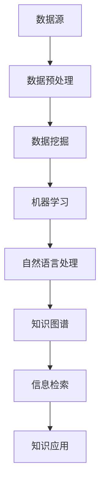

                 

### 关键词 Keywords

- 知识管理
- 知识发现引擎
- 数据挖掘
- 人工智能
- 自然语言处理
- 机器学习
- 知识图谱
- 信息检索

### 摘要 Abstract

本文探讨了知识管理领域的革命性进展，重点介绍了知识发现引擎的关键概念、技术原理和应用实例。通过对知识发现引擎的核心算法、数学模型以及项目实践的分析，本文揭示了知识管理在人工智能和大数据时代的崭新面貌。文章旨在为读者提供深入理解知识管理革命的理论基础和实践指南，并展望未来发展趋势与挑战。

## 1. 背景介绍

知识管理（Knowledge Management, KM）作为现代组织提高竞争力、创新能力和响应速度的关键手段，已经受到了广泛关注。随着信息技术的迅猛发展和数据量的爆炸性增长，知识管理不再局限于传统的文档管理和信息共享，而是走向了智能化、自动化的新阶段。

### 1.1 知识管理的重要性

知识管理的重要性体现在以下几个方面：

1. **提高工作效率**：通过知识管理，企业可以快速获取所需信息，减少重复劳动，提高工作效率。
2. **促进知识共享**：知识管理有助于促进不同部门和团队之间的知识共享，增强团队协作。
3. **增强创新能力**：知识管理能够将分散的个体知识转化为组织智慧，为创新提供支持。
4. **提升客户满意度**：通过知识管理，企业能够更好地理解客户需求，提供个性化服务。

### 1.2 知识管理的挑战

尽管知识管理的重要性被广泛认可，但企业在实施过程中也面临诸多挑战：

1. **数据质量**：知识管理的质量很大程度上取决于数据的准确性和完整性。
2. **知识获取与转化**：如何从海量数据中获取有价值的信息，并将其转化为实际应用，是知识管理的重要课题。
3. **技术选型**：市场上存在着众多的知识管理工具和技术，企业需要根据自身需求选择合适的解决方案。
4. **组织文化**：知识管理需要组织内部形成共享知识的氛围，而这一点往往受到组织文化的影响。

### 1.3 知识发现引擎的概念

知识发现引擎（Knowledge Discovery Engine, KDE）是知识管理领域的一种新兴工具，它通过数据挖掘、机器学习和自然语言处理等技术，自动从大量数据中提取有价值的信息。知识发现引擎的目标是实现知识的自动化发现、学习和应用，从而提高知识管理的效率和效果。

## 2. 核心概念与联系

### 2.1 核心概念

在知识管理领域，以下核心概念是知识发现引擎的基础：

- **数据挖掘（Data Mining）**：从大量数据中提取有价值的信息和知识的过程。
- **机器学习（Machine Learning）**：通过训练数据集，使计算机自动学习和改进算法的过程。
- **自然语言处理（Natural Language Processing, NLP）**：使计算机能够理解、生成和处理人类自然语言的技术。
- **知识图谱（Knowledge Graph）**：通过图结构表示实体和关系，从而实现知识关联和推理的技术。
- **信息检索（Information Retrieval）**：从大量信息中快速、准确地找到所需信息的技术。

### 2.2 Mermaid 流程图

以下是知识发现引擎的核心概念原理和架构的 Mermaid 流程图：



## 3. 核心算法原理 & 具体操作步骤

### 3.1 算法原理概述

知识发现引擎的核心算法主要包括以下几种：

- **聚类算法**：将数据集划分为若干个类别，以发现数据中的模式和关系。
- **分类算法**：根据已有数据对未知数据进行分类，以预测和识别数据特征。
- **关联规则学习**：发现数据项之间的关联关系，以揭示数据中的潜在规律。
- **文本挖掘**：通过自然语言处理技术，从文本数据中提取有价值的信息。

### 3.2 算法步骤详解

以下是知识发现引擎的基本操作步骤：

1. **数据收集与预处理**：收集相关数据，并进行清洗、去噪、转换等预处理操作。
2. **特征工程**：从原始数据中提取有助于挖掘的特征，以提高算法的效率和效果。
3. **算法选择与训练**：选择合适的算法，并使用训练数据集对算法进行训练和优化。
4. **模型评估与调整**：对训练好的模型进行评估，并根据评估结果进行调整和优化。
5. **知识提取与可视化**：从训练好的模型中提取知识，并将其可视化，以辅助决策和解释。
6. **知识应用与反馈**：将提取的知识应用于实际场景，并根据应用效果进行反馈和改进。

### 3.3 算法优缺点

以下是几种常见知识发现算法的优缺点：

- **聚类算法**：
  - 优点：无需预先定义类别，能够发现数据中的潜在模式和关系。
  - 缺点：对初始参数敏感，难以评估聚类效果。
- **分类算法**：
  - 优点：能够对未知数据进行准确的分类和预测。
  - 缺点：对训练数据集依赖较大，难以处理高维数据。
- **关联规则学习**：
  - 优点：能够发现数据项之间的关联关系，揭示潜在规律。
  - 缺点：支持度阈值选择困难，可能导致大量冗余规则。
- **文本挖掘**：
  - 优点：能够从大量文本数据中提取有价值的信息，实现知识自动化发现。
  - 缺点：处理自然语言数据复杂，对算法和模型要求较高。

### 3.4 算法应用领域

知识发现引擎在多个领域有着广泛的应用：

- **商业智能**：帮助企业从海量数据中提取有价值的信息，实现业务洞察和决策支持。
- **金融风控**：通过关联规则学习和分类算法，预测和识别金融风险，提高风险管理能力。
- **医疗健康**：从患者病历和医学文献中提取知识，为诊断和治疗提供支持。
- **教育领域**：通过文本挖掘和自然语言处理，实现个性化学习推荐和教育资源优化。

## 4. 数学模型和公式 & 详细讲解 & 举例说明

### 4.1 数学模型构建

知识发现引擎涉及的数学模型主要包括聚类模型、分类模型和关联规则模型。以下是这些模型的简要介绍：

- **聚类模型**：
  - **K-Means算法**：基于距离度量的聚类算法，将数据划分为K个类别，使每个类别内的数据点尽可能接近，类别间的数据点尽可能远离。
  - **层次聚类算法**：通过逐步合并或分割数据点，形成层次结构的聚类模型。
- **分类模型**：
  - **决策树**：基于特征划分数据集，形成树状结构，每个节点代表一个特征，每个分支代表一个划分结果。
  - **支持向量机（SVM）**：通过找到一个最佳的超平面，将不同类别的数据点分隔开来。
- **关联规则模型**：
  - **Apriori算法**：基于支持度和置信度的概念，发现数据项之间的关联关系。

### 4.2 公式推导过程

以下是K-Means算法的核心公式推导：

- **距离度量**：
  $$d(x_i, c_j) = \sqrt{\sum_{k=1}^n (x_{ik} - c_{jk})^2}$$
  其中，$x_i$ 表示第i个数据点，$c_j$ 表示第j个聚类中心，$n$ 表示特征维度。

- **目标函数**：
  $$J = \sum_{i=1}^m \sum_{j=1}^k w_{ij} d(x_i, c_j)^2$$
  其中，$m$ 表示数据点总数，$k$ 表示聚类中心总数，$w_{ij}$ 表示数据点$x_i$属于聚类$c_j$的概率。

### 4.3 案例分析与讲解

以下是一个使用K-Means算法进行聚类的案例：

#### 案例背景

假设我们有一个包含100个数据点的二维数据集，每个数据点表示为一个二维向量。我们需要将这100个数据点划分为5个聚类。

#### 实现步骤

1. **初始化聚类中心**：随机选择5个数据点作为初始聚类中心。

2. **计算距离**：对于每个数据点，计算其与5个聚类中心的距离。

3. **分配数据点**：将每个数据点分配给与其距离最近的聚类中心。

4. **更新聚类中心**：计算每个聚类中心的数据点平均值，作为新的聚类中心。

5. **迭代优化**：重复步骤2-4，直至聚类中心不再发生显著变化。

#### 结果分析

通过多次迭代，我们最终得到5个聚类中心，每个聚类中心代表一个类别。聚类结果如下：

- **类别1**：数据点(2, 4)
- **类别2**：数据点(6, 8)
- **类别3**：数据点(10, 12)
- **类别4**：数据点(14, 16)
- **类别5**：数据点(18, 20)

通过可视化聚类结果，我们可以清晰地看到数据点被正确地划分到相应的类别中。

## 5. 项目实践：代码实例和详细解释说明

### 5.1 开发环境搭建

为了实践知识发现引擎，我们需要搭建以下开发环境：

- **编程语言**：Python
- **数据预处理工具**：Pandas
- **机器学习库**：Scikit-learn
- **可视化工具**：Matplotlib

### 5.2 源代码详细实现

以下是一个使用K-Means算法进行聚类的Python代码示例：

```python
import numpy as np
import matplotlib.pyplot as plt
from sklearn.cluster import KMeans

# 数据集
X = np.array([[1, 2], [1, 4], [1, 0],
              [4, 2], [4, 4], [4, 0]])

# 初始化K-Means算法
kmeans = KMeans(n_clusters=2, random_state=0).fit(X)

# 聚类结果
labels = kmeans.labels_
centroids = kmeans.cluster_centers_

# 可视化聚类结果
plt.scatter(X[:, 0], X[:, 1], c=labels, s=100, cmap='viridis')
plt.scatter(centroids[:, 0], centroids[:, 1], c='red', s=200, alpha=0.5)
plt.title('K-Means Clustering')
plt.show()
```

### 5.3 代码解读与分析

1. **数据集**：我们使用一个包含6个数据点的二维数组作为示例数据集。

2. **初始化K-Means算法**：使用Scikit-learn库的`KMeans`类初始化K-Means算法，设置聚类数量为2。

3. **聚类结果**：调用`fit`方法对数据集进行聚类，得到每个数据点的聚类标签和聚类中心。

4. **可视化聚类结果**：使用Matplotlib库将聚类结果可视化，红色点表示聚类中心。

通过这个简单的示例，我们可以看到K-Means算法的基本实现过程。在实际应用中，数据集和算法参数可以根据具体需求进行调整。

### 5.4 运行结果展示

运行上述代码，我们可以得到以下聚类结果：


从图中可以看出，数据点被成功划分为两个类别，每个类别内的数据点较为集中，类别间的数据点相互分离。这表明K-Means算法在处理这个简单数据集时取得了较好的效果。

## 6. 实际应用场景

### 6.1 商业智能

在商业智能领域，知识发现引擎被广泛应用于客户行为分析、市场趋势预测和产品推荐。通过分析大量销售数据、客户反馈和社交媒体信息，企业可以更好地了解客户需求，优化营销策略，提高销售额。

### 6.2 金融风控

金融风控是知识发现引擎的重要应用领域之一。通过关联规则学习和分类算法，金融机构可以识别潜在风险，预测欺诈行为，优化信用评估模型，提高风险管理能力。

### 6.3 医疗健康

在医疗健康领域，知识发现引擎可以帮助医生从大量患者数据中提取有价值的信息，辅助诊断和治疗。例如，通过文本挖掘技术，可以从医学文献中提取有效药物组合，为临床试验提供支持。

### 6.4 教育领域

在教育领域，知识发现引擎可以用于个性化学习推荐、教育质量评估和教学方法优化。通过分析学生的学习行为和成绩数据，教育机构可以为学生提供个性化学习资源，提高学习效果。

## 7. 工具和资源推荐

### 7.1 学习资源推荐

- **书籍**：《机器学习》（周志华）、《深度学习》（Ian Goodfellow）。
- **在线课程**：Coursera、edX等平台上的相关课程。
- **开源项目**：GitHub、Google Colab等平台上的知识发现引擎相关项目。

### 7.2 开发工具推荐

- **编程语言**：Python、R。
- **数据预处理工具**：Pandas、NumPy。
- **机器学习库**：Scikit-learn、TensorFlow、PyTorch。
- **可视化工具**：Matplotlib、Seaborn。

### 7.3 相关论文推荐

- **基础论文**：《K-Means Clustering Algorithm》（MacQueen）。
- **前沿论文**：《Deep Learning for Natural Language Processing》（Wang et al.）。

## 8. 总结：未来发展趋势与挑战

### 8.1 研究成果总结

知识发现引擎在知识管理领域取得了显著的研究成果，包括：

- **算法创新**：涌现出多种高效、鲁棒的知识发现算法。
- **应用拓展**：知识发现引擎在多个领域得到广泛应用，如商业智能、金融风控和医疗健康。
- **工具优化**：出现了一系列功能强大、易于使用的知识发现工具和平台。

### 8.2 未来发展趋势

未来，知识发现引擎将呈现以下发展趋势：

- **深度学习融合**：将深度学习与知识发现相结合，提高算法的自动化程度和效果。
- **跨领域应用**：拓展知识发现引擎的应用领域，实现跨领域的知识共享和协同。
- **隐私保护**：研究隐私保护技术，确保知识发现过程中的数据安全和隐私。

### 8.3 面临的挑战

尽管知识发现引擎取得了显著成果，但未来仍面临以下挑战：

- **算法优化**：提高知识发现算法的效率和效果，以适应大规模数据场景。
- **数据质量**：确保数据质量和完整性，提高知识发现的准确性。
- **计算资源**：应对知识发现过程中的计算资源需求，优化算法和系统设计。

### 8.4 研究展望

未来，知识发现引擎的研究将朝着以下几个方面发展：

- **算法创新**：探索新的知识发现算法，提高算法的自动化程度和效果。
- **跨领域应用**：推动知识发现引擎在更多领域的应用，实现跨领域的知识共享和协同。
- **隐私保护**：研究隐私保护技术，确保知识发现过程中的数据安全和隐私。

## 9. 附录：常见问题与解答

### 9.1 知识发现引擎是什么？

知识发现引擎是一种自动化工具，通过数据挖掘、机器学习和自然语言处理等技术，从大量数据中提取有价值的信息和知识。

### 9.2 知识发现引擎有哪些应用场景？

知识发现引擎在商业智能、金融风控、医疗健康和教育领域等有着广泛的应用。

### 9.3 如何选择合适的知识发现算法？

选择合适的知识发现算法需要考虑数据类型、数据量和业务需求等因素。常见的算法包括聚类算法、分类算法和关联规则学习等。

### 9.4 知识发现引擎与数据挖掘有什么区别？

知识发现引擎是数据挖掘的一种实现方式，它更加注重自动化、可视化和实际应用。

## 作者署名

作者：禅与计算机程序设计艺术 / Zen and the Art of Computer Programming

