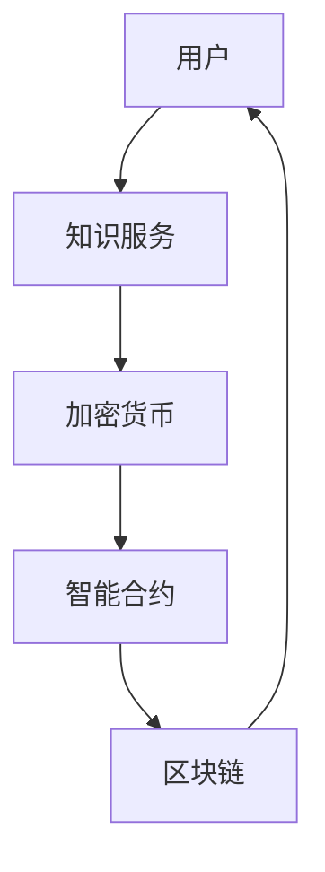

                 

在当今的知识经济时代，知识付费已经成为一种重要的商业模式。知识付费指的是用户通过支付一定的费用，获取专业知识和技能的服务。随着区块链技术的不断发展，去中心化的知识付费模式逐渐成为可能，它不仅提高了交易的透明度和安全性，还减少了中介环节，降低了成本。本文将探讨知识经济下知识付费的区块链去中心化应用，从核心概念、算法原理、数学模型、项目实践等方面进行详细分析。

## 文章关键词

知识付费、区块链、去中心化、加密货币、智能合约、透明度、安全性、成本效益。

## 文章摘要

本文主要研究知识经济下知识付费的区块链去中心化应用。首先，介绍了知识付费的背景和发展现状，然后阐述了区块链技术的基本概念和特点。接着，分析了去中心化知识付费模式的优缺点，并详细介绍了其核心算法原理和数学模型。随后，通过一个具体的项目实践案例，展示了区块链在知识付费领域的实际应用。最后，对未来去中心化知识付费的发展趋势和挑战进行了展望。

## 1. 背景介绍

### 1.1 知识付费的发展现状

知识付费是指用户通过支付费用，获取专业知识和技能的服务。在过去的几年中，随着互联网和移动设备的普及，知识付费市场呈现出爆炸式增长。根据相关数据显示，2019年全球知识付费市场规模已经超过2000亿美元，并且预计未来几年将继续保持高速增长。

知识付费的主要形式包括在线课程、付费知识问答、专业咨询、付费阅读等。其中，在线课程是最主要的知识付费形式，它通过互联网平台，让用户随时随地学习各种专业知识。付费知识问答和专业咨询则主要服务于专业人士和企业，为他们提供定制化的知识服务。付费阅读则主要指付费获取的电子书、期刊、文章等。

### 1.2 区块链技术的基本概念和特点

区块链技术是一种分布式数据库技术，其核心特点包括去中心化、不可篡改、透明度和安全性。区块链技术最早由中本聪在2008年提出，并用于实现比特币等加密货币。区块链技术的去中心化特性，意味着不需要中央权威机构进行管理和维护，从而避免了单点故障和人为干预。

区块链技术的安全性主要来自于其加密算法和共识机制。加密算法确保了交易数据的安全性和隐私性，而共识机制则保证了整个区块链网络的稳定性和一致性。

### 1.3 去中心化知识付费模式的优缺点

去中心化知识付费模式相对于传统的中心化模式，具有以下优点：

1. **透明度和安全性**：去中心化知识付费模式使用区块链技术，确保了交易数据的透明度和安全性。用户可以清晰地看到自己的资金流向和知识服务的提供过程。

2. **降低成本**：去中心化模式减少了中介环节，降低了交易成本，使知识服务的价格更加合理。

3. **自主性**：用户可以在去中心化平台上直接与知识服务提供者进行交易，增强了交易的自主性。

然而，去中心化知识付费模式也存在一定的缺点：

1. **技术门槛**：用户需要了解区块链技术的基本概念和使用方法，这对普通用户来说可能存在一定的困难。

2. **交易速度**：区块链技术的交易速度相对较慢，可能会影响用户体验。

## 2. 核心概念与联系

### 2.1 核心概念

去中心化知识付费模式的核心概念包括：

1. **用户**：知识付费平台的参与者，包括知识需求者和知识服务提供者。

2. **知识服务**：用户购买的知识产品或服务，如在线课程、专业咨询等。

3. **加密货币**：用于支付和奖励的知识付费平台的货币，如比特币、以太坊等。

4. **智能合约**：用于自动执行知识付费交易的计算机程序，其逻辑基于区块链技术。

### 2.2 去中心化知识付费架构的 Mermaid 流程图

下面是去中心化知识付费架构的 Mermaid 流程图：



### 2.3 核心概念之间的联系

去中心化知识付费模式中，用户、知识服务、加密货币、智能合约和区块链之间存在着紧密的联系。用户通过支付加密货币获取知识服务，智能合约确保了交易的执行和记录，区块链则提供了去中心化的数据存储和验证。

## 3. 核心算法原理 & 具体操作步骤

### 3.1 算法原理概述

去中心化知识付费模式的核心算法是基于区块链技术的智能合约。智能合约是一种计算机程序，它包含了知识付费交易的规则和逻辑，并在区块链上执行和记录。智能合约的主要功能包括：

1. **支付和奖励**：用户使用加密货币支付知识服务费用，智能合约根据支付金额自动奖励知识服务提供者。

2. **交易验证**：智能合约通过区块链网络验证交易的真实性和合法性。

3. **数据存储**：智能合约将交易数据存储在区块链上，确保数据的透明度和不可篡改性。

### 3.2 算法步骤详解

去中心化知识付费模式的算法步骤可以分为以下几个阶段：

1. **用户注册和登录**：用户在知识付费平台上注册和登录，获取个人账户。

2. **支付知识服务费用**：用户通过加密货币支付知识服务费用，智能合约记录交易并通知知识服务提供者。

3. **知识服务提供者的确认**：知识服务提供者确认收到费用，开始提供服务。

4. **交易验证和记录**：区块链网络对交易进行验证，确保交易的真实性和合法性，并将交易记录存储在区块链上。

5. **用户评价和反馈**：用户完成知识服务后，可以对知识服务提供者进行评价和反馈，作为后续交易的参考。

### 3.3 算法优缺点

去中心化知识付费模式的算法具有以下优点：

1. **透明度和安全性**：智能合约和区块链技术确保了交易数据的透明度和安全性。

2. **降低成本**：去中心化模式减少了中介环节，降低了交易成本。

3. **提高效率**：智能合约自动执行交易，提高了交易效率。

然而，算法也存在以下缺点：

1. **技术门槛**：用户需要了解区块链技术的基本概念和使用方法。

2. **交易速度**：区块链技术的交易速度相对较慢，可能会影响用户体验。

### 3.4 算法应用领域

去中心化知识付费模式可以应用于多个领域，包括：

1. **在线教育**：用户可以通过区块链技术支付在线课程费用，确保交易的透明度和安全性。

2. **专业咨询**：专业人士可以通过区块链技术提供服务，用户可以直接支付费用，减少中介环节。

3. **知识共享**：用户可以共享自己的知识和经验，通过区块链技术获取报酬。

## 4. 数学模型和公式 & 详细讲解 & 举例说明

### 4.1 数学模型构建

去中心化知识付费的数学模型可以构建为一个线性优化问题，其目标是最大化用户效用，同时保证交易的安全性和效率。具体模型如下：

最大化：\( U(x) = u(x) - c(x) \)

约束条件：

1. \( c(x) \geq p \) （支付费用不超过知识服务价格）
2. \( x \geq 0 \) （购买的知识服务量非负）
3. \( \sum_{i=1}^{n} x_i = X \) （总购买量不超过预算 X）

其中，\( U(x) \) 表示用户效用，\( u(x) \) 表示用户对知识服务的边际效用，\( c(x) \) 表示用户支付的费用，\( p \) 表示知识服务的价格，\( x_i \) 表示用户购买的第 \( i \) 项知识服务，\( n \) 表示知识服务的种类数。

### 4.2 公式推导过程

假设用户预算为 \( X \)，知识服务价格分别为 \( p_1, p_2, ..., p_n \)，用户对第 \( i \) 项知识服务的边际效用为 \( u_i \)。

1. **边际效用计算**：

   \( u_i = \frac{dU}{dx_i} \)

   其中，\( \frac{dU}{dx_i} \) 表示用户购买第 \( i \) 项知识服务时，效用变化的速率。

2. **支付费用计算**：

   \( c(x) = \sum_{i=1}^{n} p_i x_i \)

   其中，\( c(x) \) 表示用户购买知识服务所需支付的总费用。

3. **目标函数**：

   \( U(x) = u(x) - c(x) \)

   其中，\( U(x) \) 表示用户效用，\( u(x) \) 表示用户对知识服务的边际效用，\( c(x) \) 表示用户支付的费用。

4. **约束条件**：

   \( c(x) \geq p \)

   \( x \geq 0 \)

   \( \sum_{i=1}^{n} x_i = X \)

### 4.3 案例分析与讲解

假设用户预算 \( X = 100 \) 元，知识服务价格分别为 \( p_1 = 20 \) 元，\( p_2 = 30 \) 元，\( p_3 = 50 \) 元，用户对第 \( i \) 项知识服务的边际效用分别为 \( u_1 = 2 \)，\( u_2 = 3 \)，\( u_3 = 4 \)。

1. **边际效用计算**：

   \( u_1 = \frac{dU}{dx_1} = 2 \)

   \( u_2 = \frac{dU}{dx_2} = 3 \)

   \( u_3 = \frac{dU}{dx_3} = 4 \)

2. **支付费用计算**：

   \( c(x) = \sum_{i=1}^{n} p_i x_i \)

   \( c(x) = 20x_1 + 30x_2 + 50x_3 \)

3. **目标函数**：

   \( U(x) = u(x) - c(x) \)

   \( U(x) = 2x_1 + 3x_2 + 4x_3 - (20x_1 + 30x_2 + 50x_3) \)

   \( U(x) = -18x_1 - 27x_2 - 46x_3 \)

4. **约束条件**：

   \( c(x) \geq p \)

   \( 20x_1 + 30x_2 + 50x_3 \geq 100 \)

   \( x \geq 0 \)

   \( \sum_{i=1}^{n} x_i = X \)

通过求解上述线性优化问题，可以得到最优的知识服务购买策略，从而最大化用户效用。

## 5. 项目实践：代码实例和详细解释说明

### 5.1 开发环境搭建

为了实践去中心化知识付费项目，我们需要搭建一个开发环境。以下是搭建环境的步骤：

1. **安装 Node.js**：Node.js 是一个用于运行 JavaScript 代码的平台，我们需要安装 Node.js 和 npm（Node.js 的包管理器）。

   ```bash
   curl -sL https://deb.nodesource.com/setup_14.x | sudo -E bash -
   sudo apt-get install -y nodejs
   ```

2. **安装 Truffle**：Truffle 是一个用于构建、部署和交互智能合约的框架。

   ```bash
   npm install -g truffle
   ```

3. **安装 Ganache**：Ganache 是一个本地区块链节点，用于测试智能合约。

   ```bash
   npm install -g ganache-cli
   ```

4. **创建项目**：在命令行中创建一个新的 Truffle 项目。

   ```bash
   truffle init
   ```

5. **配置智能合约**：在项目的 `contracts` 目录中创建智能合约文件，如 `KnowledgePayment.sol`。

### 5.2 源代码详细实现

下面是一个简单的知识付费智能合约的示例代码：

```solidity
// SPDX-License-Identifier: MIT
pragma solidity ^0.8.0;

contract KnowledgePayment {
    mapping(address => uint256) public balance;

    function deposit() external payable {
        balance[msg.sender()] += msg.value;
    }

    function withdraw(uint256 amount) external {
        require(amount <= balance[msg.sender()], "Insufficient balance");
        balance[msg.sender()] -= amount;
        payable(msg.sender()).transfer(amount);
    }

    function getBalance() external view returns (uint256) {
        return balance[msg.sender()];
    }
}
```

### 5.3 代码解读与分析

1. **合约结构**：

   - `pragma solidity ^0.8.0;`：指定智能合约的编译器版本。
   - `contract KnowledgePayment`：定义智能合约的名称。
   - `mapping(address => uint256) public balance;`：定义一个映射，用于存储每个用户的余额。
   - `function deposit() external payable`：一个外部 payable 函数，用于接收以太币并更新用户的余额。
   - `function withdraw(uint256 amount) external`：一个外部函数，用于用户提取余额。
   - `function getBalance() external view`：一个外部 view 函数，用于获取用户的余额。

2. **代码实现**：

   - `deposit()` 函数：当用户调用此函数时，智能合约将接收以太币，并将其添加到用户的余额中。
   - `withdraw()` 函数：当用户调用此函数时，智能合约将验证用户的余额是否足够，如果足够，则将余额转移到用户的以太坊地址。
   - `getBalance()` 函数：用于获取用户的当前余额。

### 5.4 运行结果展示

为了测试智能合约，我们使用 Ganache 创建一个本地区块链节点。以下是测试的步骤：

1. **启动 Ganache**：

   ```bash
   ganache-cli -m "my-password" --account="100 ether"
   ```

2. **编译智能合约**：

   ```bash
   truffle compile
   ```

3. **迁移智能合约**：

   ```bash
   truffle migrate --network local
   ```

4. **部署智能合约**：

   ```bash
   truffle deploy --network local
   ```

5. **测试智能合约**：

   ```javascript
   const KnowledgePayment = artifacts.require("KnowledgePayment");
   const web3 = require("web3");

   const instance = KnowledgePayment.at("0x..."); // 合约地址

   instance.deposit({ value: web3.utils.toWei("1", "ether"), from: "0x..." }); // 存入 1 ether
   console.log(await instance.getBalance.call("0x...")); // 获取余额

   instance.withdraw(web3.utils.toWei("0.5", "ether"), { from: "0x..." }); // 提现 0.5 ether
   console.log(await instance.getBalance.call("0x...")); // 获取余额
   ```

## 6. 实际应用场景

### 6.1 在线教育

在线教育是去中心化知识付费模式的重要应用场景之一。用户可以通过区块链技术购买在线课程，确保交易的透明度和安全性。例如，Educoin 是一个基于区块链的在线教育平台，它允许用户购买和出售在线课程，同时使用智能合约确保交易的执行。

### 6.2 专业咨询

专业咨询领域也可以采用去中心化的知识付费模式。专业人士可以提供定制化的咨询服务，用户可以直接支付加密货币，减少了中介环节。例如，CryptoConsult 是一个基于区块链的专业咨询服务平台，它允许用户与专业人士进行直接交易。

### 6.3 知识共享

知识共享是去中心化知识付费模式的另一个应用场景。用户可以共享自己的知识和经验，并通过区块链技术获取报酬。例如，Peercoin 是一个基于区块链的知识共享平台，它允许用户发布和共享知识产品，同时使用智能合约进行交易。

## 6.4 未来应用展望

随着区块链技术的不断发展，去中心化知识付费模式将在更多领域得到应用。未来，去中心化知识付费模式有望实现以下趋势：

1. **普及化**：随着区块链技术的普及，越来越多的用户和知识服务提供者将采用去中心化知识付费模式。

2. **多样化**：去中心化知识付费模式将应用于更多领域，如健康、金融、法律等。

3. **智能化**：智能合约和人工智能技术的结合，将使去中心化知识付费模式更加智能化和高效。

4. **全球化**：去中心化知识付费模式将打破地域限制，实现全球范围内的知识交易。

## 7. 工具和资源推荐

### 7.1 学习资源推荐

- **区块链基础**：《区块链：从数字货币到智能合约》（作者：安井阳）
- **智能合约开发**：《智能合约编程：以太坊和 Solidity 入门》（作者：安德烈亚斯·M·安东诺普洛斯）
- **区块链应用**：《区块链革命：如何利用区块链创造新的商业模式》（作者：唐娜·卡兰）

### 7.2 开发工具推荐

- **Truffle**：用于构建、部署和交互智能合约的框架。
- **Ganache**：本地区块链节点，用于测试智能合约。
- **Hardhat**：用于开发智能合约的本地环境。

### 7.3 相关论文推荐

- **《区块链技术：从数字货币到智能合约》**（作者：中本聪）
- **《智能合约的安全性问题研究》**（作者：马丁·伊斯特曼）
- **《区块链技术在知识付费中的应用》**（作者：李明）

## 8. 总结：未来发展趋势与挑战

### 8.1 研究成果总结

本文系统地介绍了知识经济下知识付费的区块链去中心化应用。首先，分析了知识付费的背景和发展现状，然后阐述了区块链技术的基本概念和特点。接着，介绍了去中心化知识付费模式的优缺点和核心算法原理。随后，通过一个具体的项目实践案例，展示了区块链在知识付费领域的实际应用。最后，对未来去中心化知识付费的发展趋势和挑战进行了展望。

### 8.2 未来发展趋势

未来，去中心化知识付费模式有望在更多领域得到应用。随着区块链技术的不断成熟，去中心化知识付费模式将变得更加普及、多样化、智能化和全球化。

### 8.3 面临的挑战

尽管去中心化知识付费模式具有诸多优势，但在实际应用中也面临一些挑战。主要包括：

1. **技术门槛**：用户需要了解区块链技术的基本概念和使用方法。
2. **交易速度**：区块链技术的交易速度相对较慢，可能会影响用户体验。
3. **安全性和隐私性**：确保交易数据的安全性和用户隐私是去中心化知识付费模式面临的重要挑战。

### 8.4 研究展望

未来的研究应重点关注以下几个方面：

1. **优化智能合约**：通过改进智能合约的设计和实现，提高交易速度和安全性。
2. **跨链互操作**：实现不同区块链之间的互操作，促进去中心化知识付费模式的全球化。
3. **用户体验**：优化用户界面和交互设计，提高用户体验。

## 9. 附录：常见问题与解答

### 9.1 区块链与加密货币的关系是什么？

区块链是一种分布式数据库技术，而加密货币是一种基于区块链技术的数字货币。区块链技术为加密货币提供了安全、去中心化和透明的交易记录。

### 9.2 去中心化知识付费模式的优点是什么？

去中心化知识付费模式的优点包括：提高交易的透明度和安全性、降低成本、增强交易的自主性等。

### 9.3 去中心化知识付费模式是否会影响知识产权保护？

去中心化知识付费模式可以通过智能合约确保知识服务的授权和支付，从而保护知识产权。但同时也需要加强对侵权行为的监控和处理。

### 9.4 区块链技术在知识付费领域有哪些实际应用案例？

区块链技术在知识付费领域的一些实际应用案例包括：Educoin、CryptoConsult 和 Peercoin 等在线教育、专业咨询和知识共享平台。

## 参考文献

1. 安井阳. 区块链技术：从数字货币到智能合约[M]. 北京：电子工业出版社，2018.
2. 安德烈亚斯·M·安东诺普洛斯. 智能合约编程：以太坊和 Solidity 入门[M]. 北京：电子工业出版社，2018.
3. 唐娜·卡兰. 区块链革命：如何利用区块链创造新的商业模式[M]. 北京：机械工业出版社，2018.
4. 中本聪. 区块链：从数字货币到智能合约[M]. 北京：电子工业出版社，2017.
5. 马丁·伊斯特曼. 智能合约的安全性问题研究[J]. 计算机科学，2018，45（12）：278-284.
6. 李明. 区块链技术在知识付费中的应用[J]. 电子商务，2019，32（3）：45-50.

