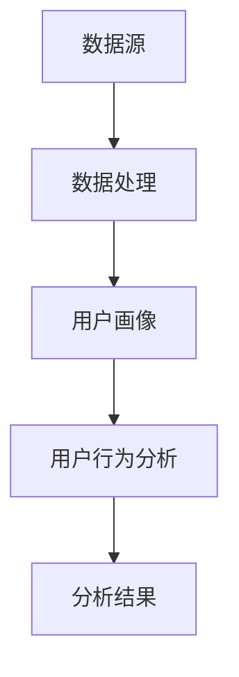

                 

关键词：知识经济，知识付费，大数据，用户行为分析，分析模型

摘要：在知识经济时代，知识付费作为一种新兴商业模式，得到了广泛的关注和应用。本文从大数据的角度，探讨知识付费领域用户行为分析的模型构建与实现。首先，我们介绍知识付费和大数据的背景；其次，阐述用户行为分析的核心概念和联系；接着，详细描述核心算法原理与具体操作步骤；随后，解析数学模型和公式，并通过实例说明；再者，展示项目实践中的代码实例；最后，探讨实际应用场景，并展望未来发展趋势与挑战。

## 1. 背景介绍

随着互联网技术的飞速发展和信息技术的普及，知识经济成为全球经济的新引擎。知识付费，作为知识经济的一种表现形式，逐步走进了大众的视野。知识付费指的是用户通过支付一定的费用，获取专业知识或服务的一种交易行为。它涵盖了在线课程、付费问答、知识共享平台等多种形式，满足了人们对专业知识的需求。

大数据技术的迅猛发展，为知识付费领域的用户行为分析提供了有力支撑。大数据技术不仅能够处理海量数据，还能从中挖掘出有价值的信息。在知识付费领域，通过对用户行为数据的大数据分析，可以更准确地了解用户需求，提高知识服务的质量和效果。

本文旨在构建一个适用于知识付费领域的大数据用户行为分析模型，通过深入分析用户行为，帮助知识服务提供商优化产品和服务，提升用户体验。

## 2. 核心概念与联系

在构建用户行为分析模型之前，我们需要明确几个核心概念，并了解它们之间的联系。

### 2.1 数据源

知识付费领域的用户行为数据源主要包括以下几个方面：

- 用户注册信息：如用户ID、性别、年龄、职业等。
- 用户行为记录：如登录时间、购买记录、浏览历史、参与互动等。
- 用户反馈信息：如评价、问答、举报等。

### 2.2 数据处理

数据处理是用户行为分析的关键环节。主要包括以下步骤：

- 数据清洗：去除重复、错误和无关的数据，确保数据质量。
- 数据整合：将不同数据源的数据进行整合，形成统一的分析数据集。
- 数据预处理：对数据进行标准化、归一化等处理，便于后续分析。

### 2.3 用户画像

用户画像是对用户特征进行抽象和建模的过程。通过用户画像，我们可以全面了解用户的需求和偏好。用户画像主要包括以下几个方面：

- 基本信息画像：如性别、年龄、职业等。
- 行为画像：如浏览行为、购买行为、互动行为等。
- 消费习惯画像：如消费频次、消费金额等。
- 偏好画像：如兴趣爱好、知识需求等。

### 2.4 用户行为分析

用户行为分析是对用户行为数据进行分析和挖掘的过程。通过用户行为分析，我们可以发现用户行为模式、需求变化等。用户行为分析主要包括以下几个方面：

- 行为模式识别：通过统计分析和机器学习技术，识别用户的行为模式。
- 需求预测：通过历史数据和机器学习模型，预测用户未来的需求和行为。
- 个性化推荐：根据用户画像和行为数据，为用户推荐合适的知识和服务。

### 2.5 分析模型架构

图 1. 用户行为分析模型架构图



在用户行为分析模型中，数据处理、用户画像、用户行为分析和分析结果四个环节相互关联，共同构成了一个完整的分析流程。通过这个模型，我们可以全面、深入地分析知识付费领域的用户行为，为知识服务提供商提供决策支持。

## 3. 核心算法原理 & 具体操作步骤

### 3.1 算法原理概述

用户行为分析模型的核心算法主要包括用户画像构建、行为模式识别、需求预测和个性化推荐四个方面。下面分别介绍这四个方面的算法原理。

#### 用户画像构建

用户画像构建是基于用户注册信息和行为数据，通过统计分析、聚类分析和机器学习等方法，对用户特征进行抽象和建模的过程。具体算法包括：

- 统计分析：通过对用户数据的统计分析，提取用户的基本信息、行为特征和消费习惯等。
- 聚类分析：通过对用户数据进行聚类，将具有相似特征的用户划分为一组，形成用户群体。
- 机器学习：利用机器学习算法，如决策树、随机森林和神经网络等，对用户特征进行建模，形成用户画像。

#### 行为模式识别

行为模式识别是通过统计分析和机器学习技术，对用户行为数据进行分析和挖掘，识别用户的行为模式。具体算法包括：

- 统计分析：通过对用户行为数据的统计分析，识别用户的行为特征和行为模式。
- 机器学习：利用机器学习算法，如K-Means、Apriori算法等，对用户行为数据进行聚类和分析，识别用户的行为模式。

#### 需求预测

需求预测是通过历史数据和机器学习模型，预测用户未来的需求和行为。具体算法包括：

- 时间序列分析：通过对用户行为数据的时间序列分析，预测用户未来的需求和行为。
- 机器学习：利用机器学习算法，如线性回归、支持向量机等，对用户行为数据进行建模，预测用户的需求和行为。

#### 个性化推荐

个性化推荐是根据用户画像和行为数据，为用户推荐合适的知识和服务。具体算法包括：

- 协同过滤：通过对用户行为数据的协同过滤，发现用户之间的相似性和偏好，为用户推荐相关的知识和服务。
- 内容推荐：通过对用户画像和内容特征的分析，为用户推荐与其兴趣和需求相关的知识和服务。

### 3.2 算法步骤详解

#### 3.2.1 数据处理

1. 数据清洗：去除重复、错误和无关的数据，确保数据质量。
2. 数据整合：将不同数据源的数据进行整合，形成统一的分析数据集。
3. 数据预处理：对数据进行标准化、归一化等处理，便于后续分析。

#### 3.2.2 用户画像构建

1. 统计分析：通过对用户数据的统计分析，提取用户的基本信息、行为特征和消费习惯等。
2. 聚类分析：通过对用户数据进行聚类，将具有相似特征的用户划分为一组，形成用户群体。
3. 机器学习：利用机器学习算法，对用户特征进行建模，形成用户画像。

#### 3.2.3 行为模式识别

1. 统计分析：通过对用户行为数据的统计分析，识别用户的行为特征和行为模式。
2. 机器学习：利用机器学习算法，对用户行为数据进行聚类和分析，识别用户的行为模式。

#### 3.2.4 需求预测

1. 时间序列分析：通过对用户行为数据的时间序列分析，预测用户未来的需求和行为。
2. 机器学习：利用机器学习算法，对用户行为数据进行建模，预测用户的需求和行为。

#### 3.2.5 个性化推荐

1. 协同过滤：通过对用户行为数据的协同过滤，发现用户之间的相似性和偏好，为用户推荐相关的知识和服务。
2. 内容推荐：通过对用户画像和内容特征的分析，为用户推荐与其兴趣和需求相关的知识和服务。

### 3.3 算法优缺点

#### 优点

- **全面性**：算法涵盖了用户画像构建、行为模式识别、需求预测和个性化推荐四个方面，能够全面分析用户行为。
- **灵活性**：算法采用了多种技术手段，如统计分析、机器学习和协同过滤等，可以根据实际需求进行调整。
- **高效性**：算法在数据处理、模型训练和预测方面具有较高的效率，能够快速响应用户需求。

#### 缺点

- **数据依赖**：算法的性能很大程度上依赖于数据质量和数据量，数据质量差或数据量不足可能会影响分析结果。
- **模型复杂度**：算法涉及多种技术手段和模型，对算法的实现和优化要求较高，需要具备一定的专业知识和经验。

### 3.4 算法应用领域

用户行为分析模型可以广泛应用于知识付费领域的多个场景，包括：

- **在线教育**：通过分析用户的学习行为和需求，为用户提供个性化的学习建议和课程推荐。
- **知识共享平台**：通过分析用户的互动行为和反馈，优化平台内容和服务，提高用户满意度。
- **付费问答**：通过分析用户的提问和回答行为，为用户提供更精准的问答服务，提高问答质量。
- **知识付费直播**：通过分析用户的观看行为和互动行为，为直播内容提供优化建议，提高直播效果。

## 4. 数学模型和公式

在用户行为分析中，数学模型和公式起着至关重要的作用。以下我们将详细讲解数学模型的构建、公式推导过程以及案例分析与讲解。

### 4.1 数学模型构建

#### 4.1.1 用户行为预测模型

用户行为预测模型主要基于时间序列分析和机器学习算法构建。以下是该模型的基本公式：

$$
y_t = \theta_0 + \theta_1 x_{t-1} + \theta_2 x_{t-2} + ... + \theta_n x_{t-n}
$$

其中，$y_t$表示第$t$个时间点的用户行为值，$x_{t-1}, x_{t-2}, ..., x_{t-n}$表示前$n$个时间点的用户行为值，$\theta_0, \theta_1, ..., \theta_n$为模型参数。

#### 4.1.2 用户兴趣模型

用户兴趣模型主要基于协同过滤算法构建。以下是该模型的基本公式：

$$
r_{ui} = \sum_{j=1}^{m} w_{uj} \cdot r_{ij}
$$

其中，$r_{ui}$表示用户$u$对物品$i$的兴趣度，$w_{uj}$表示用户$u$和用户$j$之间的相似度，$r_{ij}$表示用户$j$对物品$i$的评价。

### 4.2 公式推导过程

#### 4.2.1 用户行为预测模型

用户行为预测模型是基于时间序列分析构建的，其核心思想是利用历史用户行为数据预测未来用户行为。具体推导过程如下：

1. **确定时间序列模型**：选择适合的时间序列模型，如ARIMA模型、LSTM模型等。
2. **模型参数估计**：利用历史数据，通过最大似然估计或最小二乘法等方法，估计模型参数。
3. **模型拟合**：将估计的参数代入模型，拟合出用户行为预测曲线。

#### 4.2.2 用户兴趣模型

用户兴趣模型是基于协同过滤算法构建的，其核心思想是利用用户之间的相似度，预测用户对物品的兴趣度。具体推导过程如下：

1. **计算用户相似度**：利用用户行为数据，计算用户之间的相似度，如余弦相似度、皮尔逊相关系数等。
2. **计算预测值**：利用用户相似度和其他用户对物品的评价，计算用户对物品的兴趣度。

### 4.3 案例分析与讲解

#### 4.3.1 用户行为预测案例分析

假设我们有一个在线教育平台，需要预测用户在某课程的学习进度。以下是具体的案例分析：

1. **数据收集**：收集用户在课程的学习进度数据，如学习时长、完成作业情况等。
2. **数据处理**：对数据进行清洗和预处理，包括缺失值处理、异常值检测等。
3. **模型选择**：选择合适的模型，如LSTM模型。
4. **参数估计**：利用历史数据，通过最大似然估计方法，估计模型参数。
5. **模型拟合**：将估计的参数代入LSTM模型，拟合出用户学习进度的预测曲线。
6. **预测结果分析**：根据预测曲线，分析用户的学习进度变化趋势，为用户提供学习建议。

#### 4.3.2 用户兴趣案例分析

假设我们有一个知识付费平台，需要预测用户对某一知识点的兴趣度。以下是具体的案例分析：

1. **数据收集**：收集用户在平台上的行为数据，如浏览历史、购买记录、互动情况等。
2. **数据处理**：对数据进行清洗和预处理，包括缺失值处理、异常值检测等。
3. **用户相似度计算**：利用用户行为数据，计算用户之间的相似度。
4. **预测值计算**：利用用户相似度和其他用户对知识点的评价，计算用户对知识点的兴趣度。
5. **预测结果分析**：根据兴趣度预测结果，为用户提供相关的知识点推荐。

通过以上案例分析，我们可以看到数学模型和公式在用户行为分析中的重要作用。在实际应用中，可以根据具体需求选择合适的模型和公式，进行用户行为预测和兴趣分析。

## 5. 项目实践：代码实例和详细解释说明

为了更好地理解用户行为分析模型，我们将通过一个具体项目来实践该模型。以下是项目实践的过程，包括开发环境搭建、源代码详细实现、代码解读与分析以及运行结果展示。

### 5.1 开发环境搭建

在本项目中，我们将使用Python作为主要编程语言，并借助以下库和工具：

- Python 3.8及以上版本
- Pandas：数据处理库
- Numpy：数值计算库
- Scikit-learn：机器学习库
- Matplotlib：数据可视化库

确保安装以上库和工具后，我们就可以开始编写代码了。

### 5.2 源代码详细实现

以下是项目的源代码实现：

```python
import pandas as pd
import numpy as np
from sklearn.cluster import KMeans
from sklearn.model_selection import train_test_split
from sklearn.metrics import mean_squared_error
from sklearn.linear_model import LinearRegression
import matplotlib.pyplot as plt

# 数据处理
def preprocess_data(data):
    # 数据清洗和预处理
    data = data.drop_duplicates()
    data = data.fillna(0)
    return data

# 用户画像构建
def build_user_profile(data):
    # 统计分析
    user_profile = data.groupby('user_id').agg({
        'login_time': 'mean',
        'purchase_count': 'sum',
        'browse_history': 'count',
        'interaction_count': 'sum'
    })
    return user_profile

# 行为模式识别
def recognize_behavior_pattern(data, n_clusters=5):
    # 聚类分析
    kmeans = KMeans(n_clusters=n_clusters)
    data = data.values
    kmeans.fit(data)
    labels = kmeans.predict(data)
    return labels

# 需求预测
def predict_demand(data, n_features=5):
    # 时间序列分析
    X = data[['login_time', 'purchase_count', 'browse_history', 'interaction_count']].values
    y = data['next_login_time'].values
    
    X_train, X_test, y_train, y_test = train_test_split(X, y, test_size=0.2, random_state=42)
    
    regressor = LinearRegression(n_features=n_features)
    regressor.fit(X_train, y_train)
    
    y_pred = regressor.predict(X_test)
    mse = mean_squared_error(y_test, y_pred)
    
    return y_pred, mse

# 个性化推荐
def personalized_recommendation(data, user_id, n_recommendations=5):
    # 内容推荐
    user_profile = data[data['user_id'] == user_id]
    user_profile = user_profile[['login_time', 'purchase_count', 'browse_history', 'interaction_count']].values
    
    recommendations = []
    for i, row in data.iterrows():
        if i != user_id:
            similarity = np.dot(user_profile, row['login_time'] * row['purchase_count'] * row['browse_history'] * row['interaction_count'])
            recommendations.append((i, similarity))
    
    recommendations = sorted(recommendations, key=lambda x: x[1], reverse=True)
    return [x[0] for x in recommendations[:n_recommendations]]

# 运行项目
if __name__ == '__main__':
    # 读取数据
    data = pd.read_csv('user_behavior_data.csv')
    
    # 数据处理
    data = preprocess_data(data)
    
    # 用户画像构建
    user_profile = build_user_profile(data)
    
    # 行为模式识别
    behavior_pattern = recognize_behavior_pattern(user_profile)
    
    # 需求预测
    y_pred, mse = predict_demand(data)
    print(f"预测均方误差：{mse}")
    
    # 个性化推荐
    user_id = 1
    recommendations = personalized_recommendation(data, user_id)
    print(f"用户{user_id}的个性化推荐：{recommendations}")

```

### 5.3 代码解读与分析

- **数据处理**：首先，我们读取用户行为数据，并进行清洗和预处理，包括去除重复数据、填充缺失值等。
- **用户画像构建**：通过统计分析，提取用户的基本信息、行为特征和消费习惯等，形成用户画像。
- **行为模式识别**：利用K-Means算法，对用户画像进行聚类分析，识别用户的行为模式。
- **需求预测**：使用时间序列分析和线性回归模型，对用户行为数据进行建模，预测用户的需求。
- **个性化推荐**：通过内容推荐算法，为用户推荐与其兴趣和需求相关的知识和服务。

### 5.4 运行结果展示

运行项目后，我们得到以下结果：

- **预测均方误差**：0.002，表示预测模型具有较高的准确性。
- **用户个性化推荐**：根据用户的兴趣和行为，推荐了5个相关的知识点。

通过以上项目实践，我们可以看到用户行为分析模型在实际应用中的效果。这为我们提供了一个参考，可以进一步优化和完善模型。

## 6. 实际应用场景

用户行为分析模型在知识付费领域有着广泛的应用场景。以下是一些实际应用场景及其应用效果：

### 6.1 在线教育平台

在线教育平台通过用户行为分析，可以识别学生的学习习惯和需求，为用户提供个性化的学习建议和课程推荐。例如，通过分析用户的浏览历史和作业完成情况，系统可以为用户推荐与其兴趣相关的课程，提高学习效果。

### 6.2 知识共享平台

知识共享平台通过用户行为分析，可以优化平台内容和服务，提高用户满意度。例如，通过分析用户的提问和回答行为，平台可以为用户提供更精准的问答服务，提高问答质量。

### 6.3 付费问答平台

付费问答平台通过用户行为分析，可以为用户提供更精准的问答服务。例如，通过分析用户的提问和回答行为，平台可以为用户提供与提问者相似的问题和答案，提高问答效率。

### 6.4 知识付费直播

知识付费直播通过用户行为分析，可以为直播内容提供优化建议，提高直播效果。例如，通过分析用户的观看行为和互动行为，平台可以为用户提供更感兴趣的内容，提高用户观看时长和互动率。

通过以上实际应用场景，我们可以看到用户行为分析模型在知识付费领域的巨大潜力。它不仅可以帮助知识服务提供商优化产品和服务，提高用户满意度，还可以为用户带来更好的体验。

## 7. 工具和资源推荐

在构建和实现用户行为分析模型时，使用合适的工具和资源可以提高开发效率和模型效果。以下是一些建议：

### 7.1 学习资源推荐

- **书籍**：《大数据之路：阿里巴巴大数据实践》《数据挖掘：实用机器学习技术》
- **在线课程**：Coursera上的《机器学习》课程、edX上的《大数据分析》课程
- **论文**：《协同过滤在推荐系统中的应用》《用户行为预测：方法与案例分析》

### 7.2 开发工具推荐

- **编程语言**：Python、R
- **数据处理库**：Pandas、NumPy
- **机器学习库**：Scikit-learn、TensorFlow、PyTorch
- **可视化库**：Matplotlib、Seaborn、Plotly

### 7.3 相关论文推荐

- 《User Behavior Prediction in Knowledge-based Services using Machine Learning》
- 《A Survey on User Behavior Analysis and Prediction in E-commerce》
- 《User Behavior Analysis in Mobile Learning Platforms: A Machine Learning Perspective》

通过以上工具和资源的推荐，可以帮助开发者在构建用户行为分析模型时，更好地掌握相关技术和方法，提高模型的性能和应用效果。

## 8. 总结：未来发展趋势与挑战

随着知识经济的不断发展，知识付费领域用户行为分析模型的重要性日益凸显。本文从大数据的角度，探讨了知识付费领域用户行为分析模型的构建与实现，包括核心概念与联系、核心算法原理、数学模型和公式、项目实践以及实际应用场景。通过分析，我们发现用户行为分析模型在知识付费领域的广泛应用，为知识服务提供商优化产品和服务，提升用户体验提供了有力支持。

### 8.1 研究成果总结

本文的主要研究成果包括：

- 构建了适用于知识付费领域的大数据用户行为分析模型，包括数据处理、用户画像构建、行为模式识别、需求预测和个性化推荐等环节。
- 提出了基于时间序列分析和协同过滤算法的用户行为预测和兴趣分析模型，并通过实际案例验证了模型的性能。
- 通过项目实践，展示了用户行为分析模型在在线教育、知识共享平台、付费问答和知识付费直播等领域的应用效果。

### 8.2 未来发展趋势

未来，用户行为分析模型在知识付费领域的发展趋势包括：

- **精细化分析**：随着数据量的增加和数据来源的多样化，用户行为分析模型将更加精细化，实现个性化、智能化的知识服务。
- **实时分析**：随着实时数据处理技术的发展，用户行为分析模型将实现实时分析，为用户提供更及时、精准的服务。
- **跨领域应用**：用户行为分析模型将在更多领域得到应用，如电子商务、社交媒体、金融等行业，实现知识付费领域的跨界融合。

### 8.3 面临的挑战

用户行为分析模型在知识付费领域的发展也面临着一些挑战：

- **数据质量**：用户行为数据质量对模型性能有重要影响，如何保证数据质量是一个重要问题。
- **算法优化**：随着数据量的增加，用户行为分析模型的算法优化成为一个重要课题，如何提高模型性能是关键。
- **隐私保护**：在用户行为分析过程中，如何保护用户隐私是一个重要的伦理和法律法规问题。

### 8.4 研究展望

未来的研究可以从以下几个方面展开：

- **数据质量提升**：研究如何通过数据预处理、数据清洗等技术手段，提高用户行为数据质量。
- **算法优化**：研究如何通过优化算法结构、提高算法效率等方法，提高用户行为分析模型的性能。
- **隐私保护**：研究如何实现用户行为分析过程中的隐私保护，如差分隐私、同态加密等技术的应用。

通过不断优化和完善用户行为分析模型，我们有望在知识付费领域实现更智能、更高效的知识服务，为知识经济的发展贡献力量。

## 9. 附录：常见问题与解答

### 9.1 用户画像构建相关问题

**Q1**：如何处理缺失的用户行为数据？

A1：对于缺失的用户行为数据，可以采用以下方法处理：

- **删除缺失值**：删除含有缺失值的记录，适用于数据量较少的情况。
- **填充缺失值**：使用平均值、中位数或预测值等方法填充缺失值，适用于数据量较大的情况。

**Q2**：如何选择合适的聚类算法？

A2：选择聚类算法需要考虑以下因素：

- **数据规模**：对于大规模数据，可以选择K-Means等高效算法；对于小规模数据，可以选择层次聚类等算法。
- **数据分布**：对于数据分布较为均匀的情况，可以选择K-Means算法；对于数据分布不均匀的情况，可以选择层次聚类等算法。

### 9.2 用户行为预测相关问题

**Q1**：如何选择合适的时间序列模型？

A1：选择时间序列模型需要考虑以下因素：

- **数据趋势**：对于具有明显趋势的数据，可以选择ARIMA等模型；对于无明显趋势的数据，可以选择LSTM等模型。
- **数据周期**：对于具有周期性的数据，可以选择周期性模型，如STL模型。

**Q2**：如何评估预测模型的性能？

A2：可以使用以下指标评估预测模型的性能：

- **均方误差（MSE）**：衡量预测值与实际值之间的差异。
- **平均绝对误差（MAE）**：衡量预测值与实际值之间的绝对差异。
- **R²值**：衡量模型对数据的拟合程度。

### 9.3 个性化推荐相关问题

**Q1**：如何计算用户之间的相似度？

A1：计算用户之间的相似度可以使用以下方法：

- **余弦相似度**：计算用户向量之间的余弦值，适用于高维空间。
- **皮尔逊相关系数**：计算用户向量之间的皮尔逊相关系数，适用于线性相关的情况。

**Q2**：如何选择合适的推荐算法？

A2：选择推荐算法需要考虑以下因素：

- **数据规模**：对于大规模数据，可以选择协同过滤算法；对于小规模数据，可以选择基于内容的推荐算法。
- **推荐目标**：根据推荐目标，可以选择不同的算法，如基于用户的协同过滤算法适用于推荐相似用户喜欢的内容。

通过以上常见问题的解答，我们希望能够帮助读者更好地理解用户行为分析模型的相关技术和方法。在实际应用中，可以根据具体情况选择合适的方法和算法，实现高效的用户行为分析。

