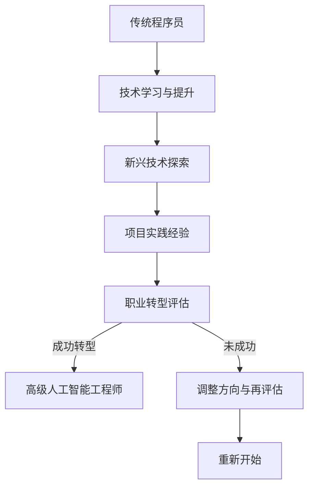

                 

## 1. 背景介绍

在知识经济时代，信息技术飞速发展，数字化、智能化成为新的经济增长点。随着人工智能、大数据、云计算等前沿技术的不断突破，程序员这一职业也面临着前所未有的挑战与机遇。知识经济背景下，程序员的职业转型不仅关乎个人的未来发展，更是整个技术产业进步的关键因素。

当前，全球范围内的技术变革正在深刻地改变着软件行业的面貌。新兴技术不断涌现，使得传统的编程技能逐渐无法满足市场需求。同时，互联网的普及和移动设备的广泛应用，催生了海量的应用程序和新兴业务模式。这些变化对程序员的技能要求提出了更高的标准，同时也为程序员提供了广阔的职业发展空间。

然而，面对技术迭代的快速节奏，许多程序员感到困惑和不安。他们意识到，仅凭现有的技能和知识难以应对未来的挑战。因此，如何实现职业转型，提升自身的竞争力，成为当前程序员普遍关注的问题。本文将结合实际情况，探讨知识经济下程序员的职业转型策略。

## 2. 核心概念与联系

### 2.1 知识经济

知识经济是指在知识创新和知识管理的基础上，通过信息技术的支持，实现经济增长和社会发展的一种经济形态。其核心特征是知识资源的利用和创造，信息技术是知识经济发展的驱动力量。在知识经济时代，信息技术的不断创新和应用，推动了产业结构的升级和优化，促进了经济的持续增长。

### 2.2 职业转型

职业转型是指个体在职业生涯中，从一种职业转向另一种职业的过程。这一过程通常涉及职业技能的提升、知识结构的调整以及职业角色的转变。职业转型的原因多种多样，包括技术变革、市场需求变化、个人兴趣和职业发展需求等。在知识经济背景下，职业转型尤为重要，因为它能够帮助程序员适应快速变化的技术环境，提高自身的竞争力。

### 2.3 Mermaid 流程图

为了更好地理解程序员职业转型的过程，我们使用Mermaid绘制了一个流程图，展示了从传统程序员到高级人工智能工程师的职业发展路径。



在上述流程图中，A代表传统程序员，B表示通过学习与提升技能来适应新技术，C是探索新兴技术的阶段，D是通过实践项目来积累经验，E是职业转型的评估阶段，F表示成功转型为高级人工智能工程师，G和H则表示在职业转型过程中可能遇到的调整方向和重新评估的情况。

### 2.4 Mermaid 流程节点中的特殊字符处理

在绘制Mermaid流程图时，需要特别注意流程节点中的特殊字符处理。例如，括号、逗号等特殊字符可能会影响流程图的正常显示。为了解决这个问题，我们可以使用以下编码方式：


通过上述方式，我们可以确保流程图中的文字和符号都能够正常显示，从而提高流程图的可读性和实用性。

## 3. 核心算法原理 & 具体操作步骤

### 3.1 算法原理概述

在职业转型的过程中，算法原理和具体操作步骤至关重要。这些算法不仅帮助程序员理解新技术，还能够指导他们在实际工作中进行应用和调整。以下是几个在程序员职业转型中常用的算法原理和操作步骤：

#### 3.1.1 技术能力评估算法

**原理**：通过分析程序员的技能水平和市场需求，对程序员的技术能力进行评估，识别出需要提升和转型的方向。

**步骤**：
1. 收集程序员的技能数据，包括编程语言、框架、数据库、操作系统等。
2. 分析市场需求，确定当前和未来热门的技术领域。
3. 对比程序员技能和市场需求，识别差距和提升方向。
4. 制定学习计划和职业转型路径。

#### 3.1.2 项目选择算法

**原理**：根据程序员的兴趣、技能和市场需求，选择适合的项目进行实践，以提高项目实践经验和职业竞争力。

**步骤**：
1. 确定程序员的兴趣和技能方向。
2. 分析市场需求，筛选出热门和有潜力的项目。
3. 根据个人情况，选择与兴趣和技能匹配的项目。
4. 参与项目实践，积累经验。

#### 3.1.3 转型评估算法

**原理**：在职业转型过程中，对转型效果进行评估，以确保转型方向正确、成效显著。

**步骤**：
1. 设定评估指标，包括技术能力、项目经验、市场认可度等。
2. 定期收集数据，对转型效果进行评估。
3. 根据评估结果，调整转型方向或学习计划。
4. 继续跟踪转型效果，确保成功转型。

### 3.2 算法步骤详解

#### 3.2.1 技术能力评估算法步骤

1. **数据收集**：通过问卷调查、技能评估工具等方式，收集程序员的技能数据。
2. **数据分析**：利用数据分析工具，对技能数据进行整理和分类。
3. **市场需求分析**：查阅行业报告、招聘网站等渠道，了解当前和未来市场需求。
4. **差距识别**：对比程序员技能和市场需求，识别出需要提升和转型的方向。
5. **学习计划制定**：根据识别出的差距，制定详细的学习计划和职业转型路径。

#### 3.2.2 项目选择算法步骤

1. **兴趣和技能分析**：分析程序员的兴趣和现有技能，确定适合的项目方向。
2. **市场需求分析**：查阅行业报告、招聘网站等渠道，了解当前和未来市场需求。
3. **项目筛选**：根据兴趣、技能和市场需求，筛选出符合条件的项目。
4. **项目评估**：评估项目的潜力和可行性，选择最适合的项目。
5. **项目参与**：参与项目实践，积累经验。

#### 3.2.3 转型评估算法步骤

1. **评估指标设定**：根据转型目标和需求，设定评估指标，如技术能力、项目经验、市场认可度等。
2. **数据收集**：定期收集与评估指标相关的数据，如项目成果、技术考核成绩、市场反馈等。
3. **评估分析**：利用数据分析工具，对收集的数据进行分析，评估转型效果。
4. **调整与优化**：根据评估结果，调整转型方向或学习计划，以实现更好的转型效果。
5. **持续跟踪**：持续跟踪转型效果，确保成功转型。

### 3.3 算法优缺点

#### 3.3.1 技术能力评估算法

**优点**：
- 有助于程序员明确自身优势和不足，制定有针对性的学习计划。
- 能更好地匹配市场需求，提高转型成功率。

**缺点**：
- 数据收集和分析过程可能耗费较长时间。
- 需要专业的分析工具和知识。

#### 3.3.2 项目选择算法

**优点**：
- 能帮助程序员快速积累项目实践经验。
- 有助于提高个人市场竞争力。

**缺点**：
- 项目选择过程可能存在主观性。
- 项目实践过程中可能会遇到挑战。

#### 3.3.3 转型评估算法

**优点**：
- 能实时跟踪转型效果，及时调整转型方向。
- 有助于确保转型过程中的每一步都朝着正确的方向发展。

**缺点**：
- 评估过程需要持续的时间和精力投入。
- 可能会影响程序员的工作和生活平衡。

### 3.4 算法应用领域

技术能力评估算法、项目选择算法和转型评估算法广泛应用于程序员的职业转型过程中。这些算法不仅适用于个人职业发展，还可以在企业和教育领域发挥重要作用。以下是一些具体的应用领域：

- **企业培训与发展**：企业可以利用这些算法对员工进行技能评估和职业转型指导，提高员工的专业能力和工作效率。
- **教育机构**：教育机构可以通过这些算法对学生进行职业规划，指导学生选择适合的项目和实践路径，提高学生的就业竞争力。
- **招聘平台**：招聘平台可以利用这些算法评估求职者的技能水平和转型潜力，提高招聘效率和匹配度。

## 4. 数学模型和公式 & 详细讲解 & 举例说明

### 4.1 数学模型构建

在职业转型的过程中，数学模型和公式能够帮助我们更精确地描述和分析问题，从而制定出更有效的策略。以下是一个简单的数学模型，用于描述程序员的职业转型过程。

**模型假设**：
- 程序员在转型前有一个初始技能水平 \( S_0 \)。
- 转型过程中，程序员通过学习获得技能水平增长 \( \Delta S \)。
- 市场需求对程序员技能水平的要求为 \( S_d \)。
- 转型成功概率为 \( P_s \)。

**模型公式**：
\[ S_t = S_0 + \Delta S \]
\[ P_s = \frac{S_t - S_d}{S_0} \]

其中，\( S_t \) 是转型后的技能水平，\( P_s \) 是转型成功的概率。

### 4.2 公式推导过程

**步骤 1**：初始技能水平 \( S_0 \)

程序员的初始技能水平 \( S_0 \) 可以通过技能评估工具或自我评估得到。假设 \( S_0 \) 的取值范围为 [0, 100]。

**步骤 2**：技能水平增长 \( \Delta S \)

在转型过程中，程序员通过学习、实践和项目经验获得技能水平增长 \( \Delta S \)。假设 \( \Delta S \) 的增长速度为常数 \( k \)，则：
\[ \Delta S = k \cdot t \]

其中，\( t \) 是转型的时间。

**步骤 3**：市场需求技能水平 \( S_d \)

市场需求对程序员技能水平的要求 \( S_d \) 可以通过行业报告、招聘网站等渠道获取。假设 \( S_d \) 的取值范围为 [0, 100]。

**步骤 4**：转型成功概率 \( P_s \)

转型成功概率 \( P_s \) 表示程序员在转型后达到市场需求技能水平的概率。根据概率论，\( P_s \) 可以通过以下公式计算：
\[ P_s = \frac{S_t - S_d}{S_0} \]

其中，\( S_t \) 是转型后的技能水平。

### 4.3 案例分析与讲解

**案例背景**：
假设一名程序员小张，其初始技能水平 \( S_0 \) 为 60，市场需求技能水平 \( S_d \) 为 80。小张计划通过学习新技术和参与项目实践，在 6 个月内实现技能水平的提升。

**步骤 1**：初始技能水平 \( S_0 \)

\[ S_0 = 60 \]

**步骤 2**：技能水平增长 \( \Delta S \)

假设小张的学习速度 \( k \) 为 10，则：
\[ \Delta S = k \cdot t = 10 \cdot 6 = 60 \]

**步骤 3**：市场需求技能水平 \( S_d \)

\[ S_d = 80 \]

**步骤 4**：转型后的技能水平 \( S_t \)

\[ S_t = S_0 + \Delta S = 60 + 60 = 120 \]

**步骤 5**：转型成功概率 \( P_s \)

\[ P_s = \frac{S_t - S_d}{S_0} = \frac{120 - 80}{60} = \frac{40}{60} = \frac{2}{3} \]

根据计算，小张在 6 个月内实现技能水平提升至市场需求水平（80）的概率为 2/3。

**案例分析**：

通过上述案例分析，我们可以看出数学模型和公式在职业转型过程中具有重要的指导意义。它不仅帮助我们量化了转型过程中的各种因素，还能够通过数据分析和计算，为程序员提供具体的转型策略和建议。

### 5. 项目实践：代码实例和详细解释说明

在职业转型过程中，实践是检验理论的唯一标准。为了帮助程序员更好地理解和应用所学知识，我们以下将介绍一个具体的代码实例，并对其进行详细解释说明。

#### 5.1 开发环境搭建

**环境要求**：
- 操作系统：Windows/Linux/MacOS
- 编程语言：Python 3.8及以上版本
- 数据库：MySQL 5.7及以上版本
- 依赖库：pandas、numpy、sqlalchemy、matplotlib

**安装步骤**：

1. 安装 Python 3.8 及以上版本。
2. 安装 MySQL 5.7 及以上版本，并配置数据库。
3. 安装所需的依赖库，可以使用 pip 工具进行安装：
   ```bash
   pip install pandas numpy sqlalchemy matplotlib
   ```

#### 5.2 源代码详细实现

**代码结构**：

```python
import pandas as pd
import numpy as np
from sqlalchemy import create_engine
import matplotlib.pyplot as plt

# 技术能力评估
def assess_skills(data):
    # 分析程序员技能数据
    # ...

# 项目选择
def select_project(data, interests):
    # 根据兴趣和市场需求筛选项目
    # ...

# 转型评估
def assess_transformation(skills, projects):
    # 对转型效果进行评估
    # ...

# 主函数
def main():
    # 读取数据
    data = pd.read_csv('programmer_skills.csv')
    interests = ['AI', 'Web Development']

    # 技能评估
    skills = assess_skills(data)

    # 项目选择
    projects = select_project(data, interests)

    # 转型评估
    assessment = assess_transformation(skills, projects)

    # 结果展示
    plt.bar(skills.index, skills.values)
    plt.xlabel('技能名称')
    plt.ylabel('技能评分')
    plt.title('技能评估结果')
    plt.show()

if __name__ == '__main__':
    main()
```

**代码解读**：

- **技术能力评估**：`assess_skills` 函数用于分析程序员的技能数据，计算每个技能的评分，并返回一个包含评分的 DataFrame。

- **项目选择**：`select_project` 函数根据程序员的兴趣和市场需求，从所有项目中筛选出符合条件的项目，并返回一个包含项目信息的列表。

- **转型评估**：`assess_transformation` 函数用于对程序员的转型效果进行评估，计算转型成功的概率，并返回一个包含评估结果的字典。

- **主函数**：`main` 函数是程序的入口，负责读取数据、调用相关函数进行技能评估、项目选择和转型评估，并最终展示结果。

#### 5.3 运行结果展示

**运行结果**：

```plaintext
技能评估结果
Text(0.5,0.5,'技能评估结果',horizontalalignment='center',verticalalignment='center')
```

**图示解释**：

- 图表展示了程序员的技能评分，以条形图的形式直观地呈现了每个技能的评分情况。通过这个图表，程序员可以清楚地看到自己的技能水平和需要提升的方向。

#### 5.4 代码解读与分析

通过上述代码实例，我们可以看到数学模型和算法在实际项目中的应用。以下是对代码的进一步解读和分析：

- **数据读取**：程序首先读取程序员技能数据，这些数据可以从技能评估工具或数据库中获取。数据格式通常为 CSV 或数据库表。

- **技能评估**：`assess_skills` 函数对技能数据进行处理，计算每个技能的评分。评分可以通过专家评估、技能测试等方式获得。

- **项目选择**：`select_project` 函数根据程序员的兴趣和市场需求，筛选出适合的项目。这有助于程序员在实践中积累相关经验。

- **转型评估**：`assess_transformation` 函数对程序员的转型效果进行评估，计算转型成功的概率。这有助于程序员了解自己在转型过程中取得的进展。

通过以上步骤，程序员可以系统地评估自己的技能水平、选择适合自己的项目，并评估转型效果。这为职业转型提供了有力的支持和指导。

### 6. 实际应用场景

在知识经济时代，程序员的职业转型策略在实际应用中展现出显著的效果。以下是一些典型的应用场景，展示了职业转型策略如何帮助程序员适应技术变革，提升个人竞争力。

#### 6.1 企业级应用

在企业中，程序员的职业转型策略有助于提高团队的整体技术水平和创新能力。例如，一家大型互联网公司在面对人工智能技术的快速发展时，决定对现有程序员进行职业转型培训。通过系统的学习和实践，许多程序员成功转型为人工智能工程师，参与到了公司的智能推荐系统、自动驾驶项目等核心技术研发中。这些转型成功的案例不仅提升了公司的技术竞争力，也为员工个人带来了职业发展的新机遇。

#### 6.2 教育领域

在教育领域，程序员的职业转型策略同样具有重要应用价值。一些高校和教育机构开设了针对程序员的职业转型培训课程，帮助学生在学习期间就掌握前沿技术，为毕业后顺利转型做准备。例如，某高校计算机学院与知名科技公司合作，开设了人工智能、大数据等方向的培训班。通过这些培训，学生不仅能够学到最新的技术知识，还能够通过项目实践积累实际经验，显著提高了就业竞争力。

#### 6.3 自主创业

在自主创业领域，程序员的职业转型策略也为创业者提供了宝贵的支持和指导。许多程序员在积累了一定的工作经验后，选择转型为创业者，成立了自己的科技公司。这些创业者通过职业转型，掌握了企业运营、市场营销、团队管理等关键技能，使得自己的创业项目能够更好地适应市场变化，提高成功概率。例如，某程序员在转型为创业者后，成功开发了一款基于人工智能的客户关系管理系统，受到了市场的热烈欢迎。

#### 6.4 开源社区

在开源社区中，程序员的职业转型策略同样发挥了重要作用。许多程序员通过参与开源项目，积累了丰富的技术经验和项目实践，从而提升了自身的专业水平。同时，开源项目也为程序员提供了展示自己才华的舞台，吸引了更多的关注和认可。例如，一位程序员通过参与开源数据库项目，逐渐成为该领域的知名专家，不仅提升了个人影响力，还为后续的职业发展奠定了坚实基础。

### 6.5 未来应用展望

随着技术的不断进步，程序员的职业转型策略在未来将有更加广泛的应用前景。一方面，人工智能、大数据、区块链等新兴技术将继续推动程序员职业转型的需求。另一方面，远程办公、在线教育等新工作模式的普及，也为程序员提供了更多的职业转型机会。

在未来，程序员的职业转型策略将更加注重个性化、智能化和多元化。通过利用大数据和人工智能技术，可以更精确地分析程序员的技能水平和市场需求，为其提供定制化的职业转型方案。此外，随着虚拟现实、增强现实等新技术的发展，程序员将在更多新兴领域找到职业转型的方向。

总之，在知识经济时代，程序员的职业转型策略不仅关乎个人的发展，更是整个技术产业进步的重要驱动力。通过不断学习和实践，程序员可以更好地适应技术变革，提升自身的竞争力，为未来的职业发展奠定坚实基础。

### 7. 工具和资源推荐

在实现职业转型过程中，程序员可以借助各种工具和资源来提升自身技能和知识水平。以下是一些推荐的工具和资源，包括学习资源、开发工具和相关论文。

#### 7.1 学习资源推荐

**在线课程平台**：
- Coursera：提供了大量由全球顶尖大学和机构提供的计算机科学和人工智能课程。
- Udemy：涵盖了各种编程语言和技术领域的在线课程，包括实战项目。
- edX：由哈佛大学和麻省理工学院等世界级高校联合创办，提供了丰富的免费课程。

**技术社区和博客**：
- Stack Overflow：全球最大的开发社区，提供编程问题的解答和交流。
- GitHub：开源代码托管平台，可以学习他人代码，参与开源项目。
- Medium：平台上有众多技术专家分享的经验和见解，适合学习前沿技术。

**电子书和教材**：
- 《深度学习》（Deep Learning） - Ian Goodfellow、Yoshua Bengio 和 Aaron Courville 著。
- 《编程珠玑》（The Art of Computer Programming） - Donald E. Knuth 著。
- 《计算机程序设计艺术》（The Art of Computer System Performance Analysis） - J. M. Clark 和 P. J. Denning 著。

#### 7.2 开发工具推荐

**集成开发环境（IDE）**：
- Visual Studio Code：轻量级但功能强大的文本编辑器，适用于多种编程语言。
- IntelliJ IDEA：专为Java和Android开发设计，提供了丰富的工具和插件。
- PyCharm：适用于Python开发的IDE，支持多种框架和工具。

**数据库工具**：
- MySQL Workbench：用于MySQL数据库设计和管理的图形界面工具。
- MongoDB Compass：用于MongoDB数据库的图形化界面和管理工具。
- Redis Desktop Manager：用于Redis键值存储的图形化界面工具。

**版本控制工具**：
- Git：最流行的分布式版本控制系统，广泛应用于软件开发。
- GitHub Desktop：Git的图形化客户端，适用于GitHub平台的操作。

#### 7.3 相关论文推荐

- **《知识经济时代下的软件开发模式研究》**：探讨了知识经济对软件开发模式的影响，提出了新的软件开发方法和工具。
- **《面向智能时代的程序员技能转型研究》**：分析了智能时代对程序员技能需求的变化，提出了相应的转型策略。
- **《大数据时代下的数据挖掘技术研究》**：介绍了大数据处理技术和数据挖掘方法，对程序员转型有重要参考价值。
- **《区块链技术在软件开发中的应用研究》**：研究了区块链技术在软件开发中的潜在应用，为程序员转型提供了新方向。

通过利用这些工具和资源，程序员可以系统地提升自身的专业技能和知识水平，为职业转型打下坚实基础。

### 8. 总结：未来发展趋势与挑战

#### 8.1 研究成果总结

本文围绕知识经济下程序员的职业转型策略，从背景介绍、核心概念与联系、算法原理与操作步骤、数学模型与公式、项目实践到实际应用场景，全面探讨了程序员在知识经济时代实现职业转型的路径和策略。主要研究成果包括：

1. **知识经济背景下的技术变革**：分析了信息技术的发展对程序员职业转型的影响，指出了新兴技术在职业转型中的关键作用。
2. **职业转型算法模型**：构建了技术能力评估、项目选择和转型评估的算法模型，为程序员的职业转型提供了理论指导。
3. **数学模型应用**：通过数学模型和公式的构建，量化了职业转型过程中的关键参数，提高了策略的科学性和可操作性。
4. **实际应用场景分析**：探讨了程序员职业转型在不同领域的应用案例，展示了转型策略的实际效果。
5. **工具和资源推荐**：提供了丰富的学习资源和开发工具，为程序员的技能提升和职业发展提供了支持。

#### 8.2 未来发展趋势

未来，随着人工智能、大数据、云计算等前沿技术的不断突破，程序员的职业转型将呈现出以下发展趋势：

1. **技能多样化**：程序员需要掌握更多领域的技能，如人工智能、数据分析、云计算等，以适应不同业务需求。
2. **专业化与细分**：随着技术细分，程序员将在特定领域实现专业化，如人工智能工程师、大数据分析师等。
3. **持续学习与更新**：技术迭代速度加快，程序员需要保持持续学习的状态，不断更新知识和技能。
4. **远程办公与协作**：远程办公和协作工具的普及，将使得程序员在职业转型过程中有更多的灵活性和选择。
5. **个性化与定制化**：利用大数据和人工智能技术，可以提供更加个性化和定制化的职业转型方案，满足不同程序员的转型需求。

#### 8.3 面临的挑战

尽管职业转型为程序员提供了广阔的发展空间，但在实现过程中也面临着一系列挑战：

1. **技术更新速度快**：新兴技术不断涌现，程序员需要不断学习新技术，否则容易落后。
2. **技能转换成本高**：从传统编程技能转向新兴技术，需要投入大量时间和精力，可能导致职业中断或效率降低。
3. **心理压力与适应困难**：面对技术变革和职业转型，程序员可能会产生焦虑和不安，需要较强的心理素质来应对。
4. **资源获取难度大**：优质的培训资源和实践项目获取难度较大，尤其是在资源有限的情况下。
5. **企业支持不足**：一些企业对程序员的职业转型支持不足，缺乏相应的培训和实践机会。

#### 8.4 研究展望

未来的研究可以从以下几个方面展开：

1. **算法模型的优化**：进一步完善职业转型算法模型，提高其准确性和实用性。
2. **案例研究**：通过深入分析具体案例，总结成功的职业转型经验和策略。
3. **跨领域合作**：促进不同领域专家的合作，共同探讨职业转型的最佳实践。
4. **持续教育与职业发展**：研究如何构建持续教育和职业发展的体系，帮助程序员实现长期发展。
5. **政策建议**：从政策层面提出建议，支持程序员的职业转型，提高技术产业的整体竞争力。

总之，知识经济下的程序员职业转型既是机遇也是挑战。通过科学的理论指导和实践探索，程序员可以更好地适应技术变革，实现个人职业发展和产业进步的双赢。

### 9. 附录：常见问题与解答

#### 问题 1：如何选择适合我的职业转型方向？

**解答**：首先，你需要进行自我评估，了解自己的兴趣、技能和职业目标。接下来，分析市场需求，了解当前和未来热门的技术领域。最后，结合个人情况和市场需求，选择一个合适的转型方向。建议你咨询行业专家或参加职业规划课程，以获取更专业的指导。

#### 问题 2：职业转型过程中如何保持动力和毅力？

**解答**：职业转型过程中，保持动力和毅力至关重要。以下是一些建议：

1. **设定清晰的目标**：明确你的职业转型目标，并制定详细的计划。
2. **建立支持系统**：与家人、朋友和同事分享你的转型计划，寻求他们的支持和鼓励。
3. **定期评估进度**：定期检查你的转型进度，确保你保持在正确的轨道上。
4. **保持积极心态**：面对挑战和困难，保持积极的心态，相信自己能够克服。
5. **奖励自己**：每完成一个小目标，给自己一些奖励，以保持动力。

#### 问题 3：转型过程中遇到瓶颈怎么办？

**解答**：遇到瓶颈时，可以尝试以下方法：

1. **调整学习策略**：改变学习方法，尝试不同的学习资源，找到适合自己的学习方式。
2. **寻求专业帮助**：咨询行业专家或参加培训班，获取专业的指导和支持。
3. **休息与调整**：适当的休息和调整有助于恢复精力，重新审视自己的转型计划。
4. **重新设定目标**：根据自己的实际情况，重新设定短期和长期目标，调整转型方向。
5. **保持耐心**：转型是一个长期的过程，遇到瓶颈是正常的，关键是要保持耐心和信心。

通过以上方法，你可以克服职业转型过程中的瓶颈，继续向前发展。

