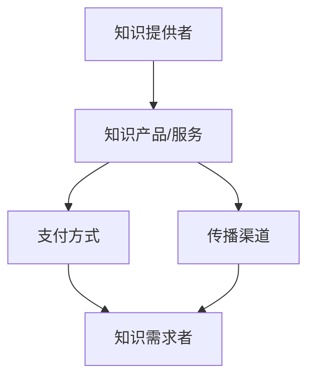

                 

 关键词：知识经济、知识付费、商业模式、创新、知识管理

> 摘要：本文将探讨知识经济时代下知识付费领域的创新商业模式。通过深入分析现有模式，探讨其局限性，并提出基于技术进步的新模式，旨在为知识付费行业的发展提供新思路。文章将涵盖知识经济的背景、核心概念、现有商业模式分析、创新模式提出、以及未来展望等。

## 1. 背景介绍

### 知识经济时代的特点

知识经济是指以知识和信息为主要生产要素的经济形态。与传统的以自然资源和劳动力为基础的经济模式不同，知识经济更依赖于知识创造、传播和应用。知识经济时代的到来，源于信息技术、互联网和全球化的快速发展。以下是知识经济时代的一些主要特点：

1. **信息化**: 信息技术特别是互联网技术的快速发展，使得信息传播变得更加迅速和广泛。
2. **全球化**: 知识不再受地理和时间的限制，全球范围内的知识共享和流动日益频繁。
3. **知识创造**: 知识成为企业竞争的关键资源，创新和研发活动成为经济增长的重要驱动力。
4. **动态化**: 知识更新速度加快，企业和个人需要不断学习和适应新知识。

### 知识付费的定义

知识付费是指用户为了获取特定的知识或信息，愿意付出一定的经济代价的行为。在知识经济时代，知识付费已成为一种重要的商业模式。通过付费，用户可以获得专业的知识服务，提升自身的知识水平，实现个人或企业的价值增长。

## 2. 核心概念与联系

### 知识付费商业模式的构成要素

知识付费商业模式通常包含以下几个核心构成要素：

1. **知识提供者**: 提供专业知识和技能的个人或组织。
2. **知识需求者**: 需要获取知识和信息的用户。
3. **知识产品或服务**: 包括在线课程、电子书、咨询服务等。
4. **支付方式**: 用户购买知识产品或服务所采用的支付方式。
5. **传播渠道**: 知识传播的途径和平台。

### 架构图



## 3. 核心算法原理 & 具体操作步骤

### 3.1 算法原理概述

在知识付费商业模式中，核心算法的原理主要包括以下方面：

1. **用户需求分析**: 通过数据分析了解用户的知识需求，为个性化推荐提供依据。
2. **知识匹配**: 根据用户需求和知识提供者的专业领域，实现知识服务的精准匹配。
3. **支付流程优化**: 设计高效的支付流程，提高用户体验。
4. **反馈机制**: 收集用户反馈，不断优化知识付费服务。

### 3.2 算法步骤详解

1. **用户需求分析**:
   - 收集用户行为数据，如搜索记录、购买历史、学习路径等。
   - 利用机器学习算法，分析用户偏好，生成用户画像。

2. **知识匹配**:
   - 构建知识图谱，将不同领域的知识进行结构化处理。
   - 使用推荐算法，根据用户画像和知识图谱，推荐匹配的知识产品或服务。

3. **支付流程优化**:
   - 简化支付流程，减少用户操作步骤。
   - 引入支付优惠和积分制度，提高用户支付意愿。

4. **反馈机制**:
   - 设立用户评价系统，收集用户对知识产品或服务的反馈。
   - 基于用户反馈，调整推荐算法和知识内容，持续优化服务。

### 3.3 算法优缺点

**优点**：
- **个性化推荐**: 提高用户获取知识的效率和满意度。
- **高效支付**: 简化支付流程，提高交易成功率。
- **持续优化**: 反馈机制有助于不断提升服务质量。

**缺点**：
- **数据隐私**: 用户数据的安全性问题。
- **算法偏见**: 推荐算法可能导致用户陷入信息茧房。

### 3.4 算法应用领域

- **在线教育**: 通过算法推荐，帮助用户找到最适合的学习资源。
- **专业咨询**: 根据用户需求，推荐合适的咨询专家。
- **内容付费**: 在内容平台上，为用户提供个性化推荐的内容。

## 4. 数学模型和公式 & 详细讲解 & 举例说明

### 4.1 数学模型构建

在知识付费商业模式中，常用的数学模型包括用户画像模型、推荐算法模型、支付模型等。以下是一个简单的用户画像模型构建过程：

**用户画像模型**：

$$
User\_Features = \{age, gender, education, occupation, interests, search\_history\}
$$

**推荐算法模型**：

$$
Recommendations = f(User\_Features, Knowledge\_Graph)
$$

**支付模型**：

$$
Payment = f(User\_Preferences, Price, Discount)
$$

### 4.2 公式推导过程

**用户画像模型推导**：

- **年龄、性别、教育程度、职业**：这些特征可以通过用户注册信息直接获取。
- **兴趣爱好、搜索历史**：通过分析用户在平台上的行为数据，如浏览、搜索、购买等行为，建立用户偏好模型。

**推荐算法模型推导**：

- **知识图谱**：将知识内容进行结构化处理，形成图谱。
- **协同过滤**：基于用户行为数据，计算用户之间的相似度，进行推荐。
- **内容推荐**：基于知识图谱和用户偏好，推荐符合用户需求的知识内容。

**支付模型推导**：

- **用户偏好**：根据用户对价格和折扣的敏感性，调整支付策略。
- **价格**：根据知识服务的价值，设定合理的价格。
- **折扣**：通过优惠券、积分等方式，激励用户购买。

### 4.3 案例分析与讲解

**案例**：一个在线教育平台如何使用推荐算法提升用户满意度？

1. **用户需求分析**：通过用户注册信息和行为数据，构建用户画像。
2. **知识图谱构建**：将课程内容结构化，形成知识图谱。
3. **推荐算法应用**：使用协同过滤算法，根据用户画像和知识图谱，推荐个性化课程。
4. **反馈机制**：收集用户对推荐课程的评价，优化推荐算法。

## 5. 项目实践：代码实例和详细解释说明

### 5.1 开发环境搭建

1. **硬件环境**：配置高性能的服务器，确保系统稳定运行。
2. **软件环境**：安装Python、TensorFlow等开发工具。
3. **数据存储**：使用MySQL或MongoDB进行数据存储。

### 5.2 源代码详细实现

```python
# 用户画像构建
class User:
    def __init__(self, age, gender, education, occupation, interests, search_history):
        self.age = age
        self.gender = gender
        self.education = education
        self.occupation = occupation
        self.interests = interests
        self.search_history = search_history

# 知识图谱构建
class KnowledgeGraph:
    def __init__(self):
        self.graph = defaultdict(set)

    def add_edge(self, node1, node2):
        self.graph[node1].add(node2)
        self.graph[node2].add(node1)

# 推荐算法
def recommend_courses(user, knowledge_graph):
    recommendations = []
    # 基于协同过滤的推荐算法
    for course in knowledge_graph.graph[user]:
        recommendations.append(course)
    return recommendations
```

### 5.3 代码解读与分析

- **用户画像**：通过定义`User`类，构建用户画像。
- **知识图谱**：通过定义`KnowledgeGraph`类，构建知识图谱。
- **推荐算法**：使用协同过滤算法，根据用户画像和知识图谱，推荐课程。

### 5.4 运行结果展示

1. **用户注册**：用户A注册，填写基本信息。
2. **课程推荐**：根据用户A的画像和知识图谱，推荐相关课程。
3. **用户反馈**：用户A对推荐课程进行评价，反馈结果。

## 6. 实际应用场景

### 知识付费在在线教育中的应用

在线教育是知识付费的重要应用场景之一。通过知识付费，用户可以获取专业的教育资源，提升自身知识水平。以下是一个实际案例：

**案例**：某在线教育平台如何通过知识付费提高用户满意度？

1. **课程内容推荐**：使用推荐算法，根据用户画像推荐个性化课程。
2. **付费课程推广**：通过优惠券、积分等激励用户购买付费课程。
3. **用户反馈收集**：通过评价系统，收集用户对课程质量的反馈，优化课程内容。

## 7. 工具和资源推荐

### 7.1 学习资源推荐

- **《深度学习》**：Goodfellow, Bengio, Courville 著，深度学习领域的经典教材。
- **《Python数据科学手册》**：McKinney 著，Python数据科学领域的入门指南。

### 7.2 开发工具推荐

- **TensorFlow**：Google 开发的人工智能框架，适用于深度学习和推荐系统。
- **Jupyter Notebook**：交互式开发环境，方便编写和分享代码。

### 7.3 相关论文推荐

- **《协同过滤算法》**：Bellman, Chen 著，介绍协同过滤算法的基本原理和应用。
- **《知识图谱》**：Brin, Page 著，介绍知识图谱的构建方法和应用。

## 8. 总结：未来发展趋势与挑战

### 8.1 研究成果总结

本文通过分析知识经济时代下的知识付费商业模式，探讨了现有模式的局限性，并提出了基于技术进步的创新模式。研究结果表明，个性化推荐、支付流程优化和反馈机制等技术在知识付费领域具有广泛的应用前景。

### 8.2 未来发展趋势

- **技术进步**: 人工智能、区块链等技术的不断发展，将为知识付费带来更多创新模式。
- **多元化服务**: 知识付费将不再局限于在线课程，更多形式的知识产品和服务将出现。
- **国际化**: 随着全球化的推进，知识付费将跨国界流动，实现全球范围内的知识共享。

### 8.3 面临的挑战

- **数据隐私**: 用户数据的保护将是知识付费领域的一大挑战。
- **算法偏见**: 需要确保推荐算法的公平性和透明性。
- **服务质量**: 提升用户满意度，需要不断优化知识产品和服务。

### 8.4 研究展望

未来，知识付费领域的研究将集中在以下几个方面：

- **个性化推荐**: 提高推荐算法的准确性和多样性。
- **支付体验**: 简化支付流程，提高支付安全性。
- **知识共享**: 推动知识共享，实现全球范围内的知识流动。

## 9. 附录：常见问题与解答

### 9.1 知识付费的意义是什么？

知识付费有助于提升个人或企业的知识水平，实现价值增长。通过付费，用户可以获得专业的知识和技能，提高自身竞争力。

### 9.2 知识付费商业模式有哪些类型？

常见的知识付费商业模式包括在线课程、电子书、咨询服务等。不同类型的知识产品和服务，适用于不同的用户需求。

### 9.3 如何确保知识付费服务的质量？

确保知识付费服务的质量，需要从内容审核、用户评价、反馈机制等方面进行严格管理。同时，需要不断优化推荐算法，提高个性化推荐的准确性。

## 作者署名

作者：禅与计算机程序设计艺术 / Zen and the Art of Computer Programming
```

