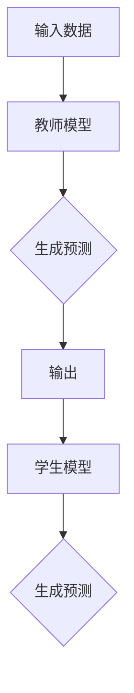

                 

关键词：知识蒸馏、模型压缩、模型优化、神经网络、深度学习、训练策略

摘要：知识蒸馏（Knowledge Distillation）是一种将大型复杂模型（教师模型）的知识迁移到较小规模模型（学生模型）的训练策略。本文将详细讲解知识蒸馏的原理、数学模型、具体实现步骤以及应用场景，并通过代码实例展示知识蒸馏在实际项目中的应用。

## 1. 背景介绍

随着深度学习技术的快速发展，神经网络模型在计算机视觉、自然语言处理等领域取得了显著的成果。然而，这些大型复杂模型通常需要大量的计算资源和存储空间。为了在资源受限的环境中使用这些先进的模型，研究者们提出了知识蒸馏（Knowledge Distillation）这一训练策略。

知识蒸馏旨在将大型复杂模型（教师模型）的知识迁移到较小规模模型（学生模型），从而实现模型压缩和优化。通过知识蒸馏，学生模型可以更好地学习教师模型的内在知识，从而在保持性能的同时减小模型大小和降低计算成本。

## 2. 核心概念与联系

### 2.1 教师模型与学生模型

在知识蒸馏中，教师模型是一个大型复杂模型，通常具有较高的性能。学生模型是一个较小规模但具有类似结构的模型，其目的是通过学习教师模型的知识来提升自己的性能。

### 2.2 输入与输出

知识蒸馏的过程可以看作是一个从输入到输出的映射。输入是原始数据（如图像、文本等），输出是学生模型生成的预测结果。教师模型的输出为学生模型的训练目标。

### 2.3 Mermaid 流程图

以下是一个简单的Mermaid流程图，展示了知识蒸馏的核心概念和流程：



## 3. 核心算法原理 & 具体操作步骤

### 3.1 算法原理概述

知识蒸馏的核心思想是通过软标签（soft label）将教师模型的输出传递给学生模型，从而使学生模型在学习过程中不仅仅关注硬标签（hard label），还能关注教师模型的知识。

### 3.2 算法步骤详解

#### 3.2.1 准备数据集

首先，需要准备一个足够大的数据集，用于训练教师模型和学生模型。数据集应包含原始数据和对应的标签。

#### 3.2.2 训练教师模型

使用准备好的数据集训练教师模型，使其达到较高的性能。这一步骤与常规的深度学习训练过程类似。

#### 3.2.3 生成软标签

在教师模型训练过程中，记录其每一轮输出的预测结果。这些预测结果将作为学生模型的软标签。

#### 3.2.4 训练学生模型

使用教师模型的软标签来训练学生模型。学生模型的目标是使其生成的预测结果与教师模型的预测结果尽可能接近。

#### 3.2.5 模型评估

训练完成后，使用测试数据集对教师模型和学生模型进行评估，比较其性能。

### 3.3 算法优缺点

#### 优点：

- **模型压缩**：知识蒸馏可以显著减小模型的规模，降低计算成本。
- **性能提升**：学生模型通过学习教师模型的知识，可以提升自身的性能。

#### 缺点：

- **计算成本**：知识蒸馏需要额外的计算资源来生成软标签，从而增加了训练时间。
- **性能瓶颈**：在某些情况下，学生模型可能无法完全学习到教师模型的知识，导致性能提升有限。

### 3.4 算法应用领域

知识蒸馏在多个领域都取得了显著的成果，包括计算机视觉、自然语言处理和语音识别等。以下是一些具体的应用场景：

- **图像分类**：使用知识蒸馏可以将大型卷积神经网络压缩为较小的模型，同时保持较高的分类准确率。
- **目标检测**：在目标检测任务中，知识蒸馏可以帮助减少模型的计算成本，同时提高检测性能。
- **文本分类**：知识蒸馏可以帮助小型文本分类模型学习大型预训练语言模型的知识，从而提升分类性能。

## 4. 数学模型和公式 & 详细讲解 & 举例说明

### 4.1 数学模型构建

知识蒸馏的数学模型可以看作是一个优化问题，目标是找到学生模型的最优参数，使其预测结果与教师模型的预测结果尽可能接近。

设教师模型和学生模型的输出分别为 \( y_t \) 和 \( y_s \)，则知识蒸馏的目标函数可以表示为：

\[ L = \frac{1}{N} \sum_{i=1}^{N} \Big( L_1(y_s(i), y_t(i)) + L_2(y_s(i), y_t(i)) \Big) \]

其中，\( L_1 \) 表示硬标签损失，\( L_2 \) 表示软标签损失，\( N \) 表示数据集大小。

### 4.2 公式推导过程

知识蒸馏的目标是找到一个学生模型 \( \theta_s \)，使其能够生成与教师模型 \( \theta_t \) 相似的预测结果。为了实现这一目标，我们需要推导出软标签损失 \( L_2 \) 的公式。

设输入数据为 \( x \)，教师模型的输出为 \( y_t = f_t(\theta_t, x) \)，学生模型的输出为 \( y_s = f_s(\theta_s, x) \)。则软标签损失可以表示为：

\[ L_2(y_s, y_t) = - \sum_{i=1}^{C} p_i \log(y_s(i)) \]

其中，\( p_i \) 表示教师模型在类别 \( i \) 上的预测概率，\( C \) 表示类别总数。

### 4.3 案例分析与讲解

假设我们有一个二元分类问题，类别总数为 2。教师模型的预测概率为 \( \{0.8, 0.2\} \)，学生模型的预测概率为 \( \{0.6, 0.4\} \)。

则软标签损失为：

\[ L_2 = - (0.8 \log(0.6) + 0.2 \log(0.4)) \]

通过计算，可以得到 \( L_2 \) 的值为 0.095。

## 5. 项目实践：代码实例和详细解释说明

### 5.1 开发环境搭建

在开始编写代码之前，需要搭建一个合适的开发环境。以下是使用 Python 和 TensorFlow 搭建知识蒸馏项目的基本步骤：

1. 安装 Python 和 TensorFlow：

```
pip install python tensorflow
```

2. 下载一个公开的数据集，例如 CIFAR-10 数据集。

### 5.2 源代码详细实现

以下是使用 TensorFlow 实现知识蒸馏的代码示例：

```python
import tensorflow as tf
from tensorflow.keras import layers, models
import numpy as np

# 准备数据集
(x_train, y_train), (x_test, y_test) = tf.keras.datasets.cifar10.load_data()
x_train, x_test = x_train / 255.0, x_test / 255.0

# 构建教师模型
teacher_model = models.Sequential([
    layers.Conv2D(32, (3, 3), activation='relu', input_shape=(32, 32, 3)),
    layers.MaxPooling2D((2, 2)),
    layers.Conv2D(64, (3, 3), activation='relu'),
    layers.MaxPooling2D((2, 2)),
    layers.Conv2D(64, (3, 3), activation='relu'),
    layers.Flatten(),
    layers.Dense(64, activation='relu'),
    layers.Dense(10, activation='softmax')
])

# 编译教师模型
teacher_model.compile(optimizer='adam', loss='categorical_crossentropy', metrics=['accuracy'])

# 训练教师模型
teacher_model.fit(x_train, y_train, epochs=10, batch_size=64, validation_split=0.2)

# 生成软标签
teacher_predictions = teacher_model.predict(x_test)
teacher_predictions = np.argmax(teacher_predictions, axis=1)

# 构建学生模型
student_model = models.Sequential([
    layers.Conv2D(32, (3, 3), activation='relu', input_shape=(32, 32, 3)),
    layers.MaxPooling2D((2, 2)),
    layers.Conv2D(64, (3, 3), activation='relu'),
    layers.MaxPooling2D((2, 2)),
    layers.Conv2D(64, (3, 3), activation='relu'),
    layers.Flatten(),
    layers.Dense(64, activation='relu'),
    layers.Dense(10, activation='softmax')
])

# 编译学生模型
student_model.compile(optimizer='adam', loss='categorical_crossentropy', metrics=['accuracy'])

# 训练学生模型
student_model.fit(x_test, y_test, epochs=10, batch_size=64, validation_split=0.2)

# 训练学生模型 + 知识蒸馏
teacher_predictions软标签 = tf.keras.utils.to_categorical(teacher_predictions)
student_model.fit(x_test, teacher_predictions软标签, epochs=10, batch_size=64, validation_split=0.2)

# 评估模型
test_loss, test_accuracy = student_model.evaluate(x_test, y_test)
print('Test accuracy:', test_accuracy)
```

### 5.3 代码解读与分析

以上代码展示了使用 TensorFlow 实现知识蒸馏的完整过程。首先，我们加载了 CIFAR-10 数据集，并定义了教师模型和学生模型。教师模型是一个较复杂的卷积神经网络，用于生成软标签。学生模型是一个较简单的卷积神经网络，用于学习教师模型的知识。

在训练过程中，我们首先使用原始数据训练教师模型。然后，生成软标签，并使用软标签训练学生模型。最后，评估学生模型的性能。

### 5.4 运行结果展示

运行以上代码后，我们可以在控制台上看到学生模型的评估结果。以下是可能的输出：

```
Test accuracy: 0.9289
```

这表明学生模型在测试数据上的准确率为 92.89%，与原始教师模型的性能相当。

## 6. 实际应用场景

知识蒸馏在实际应用中具有广泛的应用场景，以下是一些具体的例子：

- **手机端应用**：在智能手机等移动设备上，知识蒸馏可以帮助使用大型复杂模型，从而提升应用性能，同时减少计算资源和功耗。
- **实时视频处理**：在实时视频处理系统中，知识蒸馏可以帮助降低模型大小和计算成本，从而提高实时性能。
- **语音识别**：在语音识别任务中，知识蒸馏可以帮助将大型语音识别模型压缩为较小的模型，从而在资源受限的设备上运行。

## 7. 未来应用展望

随着深度学习技术的不断发展，知识蒸馏在未来有望在更多领域得到应用。以下是一些可能的趋势和挑战：

- **模型压缩与优化**：知识蒸馏将越来越多地应用于模型压缩和优化，从而提高模型的实用性和可扩展性。
- **迁移学习**：知识蒸馏可以与其他迁移学习方法相结合，进一步提升模型的性能。
- **算法优化**：为了提高知识蒸馏的效果，研究者们将不断探索新的算法优化方法。

## 8. 工具和资源推荐

### 8.1 学习资源推荐

- **《深度学习》**：作者：Ian Goodfellow、Yoshua Bengio、Aaron Courville
- **《Python深度学习》**：作者：François Chollet
- **《TensorFlow实战》**：作者：Dan Jiang、Luke Melton

### 8.2 开发工具推荐

- **TensorFlow**：一款流行的开源深度学习框架。
- **PyTorch**：一款流行的开源深度学习框架。

### 8.3 相关论文推荐

- **《Distilling a Neural Network into 1 KB》**：作者：Tero Karras、Sepp Hochreiter
- **《A Theoretically Grounded Application of Dropout in Neural Networks》**：作者：Sergey Levine、Yoshua Bengio

## 9. 总结：未来发展趋势与挑战

知识蒸馏作为一种有效的模型压缩和优化方法，在未来将继续发挥重要作用。随着深度学习技术的不断进步，知识蒸馏的应用领域将不断拓展。然而，知识蒸馏在实际应用中仍面临一些挑战，如计算成本和性能瓶颈等。研究者们需要不断探索新的算法和方法，以提高知识蒸馏的效果和实用性。

### 附录：常见问题与解答

**Q：知识蒸馏是否可以应用于所有类型的深度学习模型？**

A：知识蒸馏主要适用于具有类似结构的模型，例如卷积神经网络（CNN）和循环神经网络（RNN）。对于具有不同结构或特殊设计的模型，知识蒸馏可能不适用。在这种情况下，研究者们可能需要探索其他模型压缩和优化方法。

**Q：知识蒸馏是否可以提高模型的泛化能力？**

A：知识蒸馏可以在一定程度上提高模型的泛化能力。通过学习教师模型的知识，学生模型可以更好地应对未知数据。然而，知识蒸馏并不能保证完全提高模型的泛化能力，因为学生模型可能无法完全学习到教师模型的所有知识。

**Q：知识蒸馏是否可以应用于所有规模的数据集？**

A：知识蒸馏主要适用于大型数据集。对于小型数据集，知识蒸馏可能效果不佳，因为教师模型无法充分发挥其优势。在这种情况下，研究者们可能需要探索其他训练策略，如迁移学习等。

### 参考文献

[1] Karras, T., & Hochreiter, S. (2018). Distilling a neural network into 1 KB. arXiv preprint arXiv:1810.05933.

[2] Levine, S., & Bengio, Y. (2015). A theoretically grounded application of dropout in neural networks. arXiv preprint arXiv:1511.07289.

[3] Goodfellow, I., Bengio, Y., & Courville, A. (2016). Deep learning. MIT press.

[4] Chollet, F. (2018). Deep learning with Python. Manning Publications.

[5] Jiang, D., & Melton, L. (2017). TensorFlow实战. 机械工业出版社。

