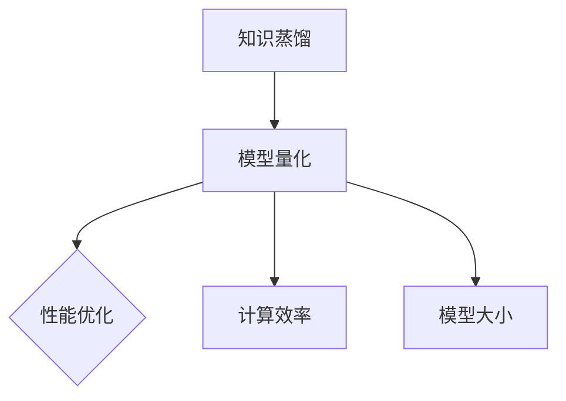

                 

关键词：知识蒸馏、模型量化、AI性能优化、计算效率、神经网络压缩

摘要：本文探讨了知识蒸馏（Knowledge Distillation）与模型量化（Model Quantization）的结合应用，介绍了这两种技术的基本概念、核心原理以及它们在提高AI模型性能、降低计算复杂度和减少模型大小方面的优势。通过详细的数学模型和具体案例，阐述了知识蒸馏与模型量化的实现步骤和技巧，以及它们在不同领域的实际应用。最后，对未来技术发展趋势和面临的挑战进行了展望。

## 1. 背景介绍

随着人工智能（AI）技术的飞速发展，深度神经网络（Deep Neural Networks，DNN）在图像识别、自然语言处理、语音识别等领域取得了显著的成果。然而，DNN模型在训练过程中通常需要大量的计算资源和时间，且模型参数数量庞大，导致模型大小和计算复杂度较高。这在部署到移动设备、嵌入式系统等资源受限的环境中时，成为了一个亟待解决的问题。

为了解决这一问题，研究人员提出了知识蒸馏（Knowledge Distillation）和模型量化（Model Quantization）两种技术。知识蒸馏通过将训练好的大型教师模型（Teacher Model）的知识转移到较小的学生模型（Student Model）中，从而提高学生模型的性能。模型量化则通过将模型中的权重和激活值降低到较低的精度，以减少模型的大小和计算复杂度。

本文旨在探讨知识蒸馏与模型量化的结合应用，介绍这两种技术的核心原理和具体实现方法，并分析它们在不同领域的应用优势和挑战。

## 2. 核心概念与联系

### 2.1 知识蒸馏

知识蒸馏是一种模型训练技术，通过将教师模型的输出作为训练目标，来指导学生模型的学习。在知识蒸馏过程中，教师模型通常是一个已经训练好的大型模型，而学生模型则是一个较小的模型，用于替代教师模型在实际应用中运行。

知识蒸馏的核心思想是利用教师模型生成的软标签（Soft Labels）来指导学生模型的学习。软标签是一个概率分布，表示教师模型对每个类别的预测概率。通过学习这些软标签，学生模型可以学习到教师模型的知识和表达能力。

### 2.2 模型量化

模型量化是一种通过降低模型中权重和激活值的精度来减少模型大小和计算复杂度的技术。量化过程通常包括两个阶段：量化表示和量化训练。

量化表示阶段将模型中的权重和激活值从原始精度（如32位浮点数）转换为较低的精度（如8位整数）。量化训练阶段则通过调整量化后的权重和激活值，使得量化后的模型在性能上接近原始模型。

### 2.3 Mermaid 流程图

以下是知识蒸馏与模型量化结合的 Mermaid 流程图：



## 3. 核心算法原理 & 具体操作步骤

### 3.1 算法原理概述

知识蒸馏与模型量化的结合应用，主要基于以下原理：

1. **教师模型的知识转移**：通过知识蒸馏，将教师模型的知识转移到学生模型中，提高学生模型的性能。
2. **模型量化的模型压缩**：通过模型量化，将学生模型的权重和激活值降低到较低的精度，以减少模型的大小和计算复杂度。
3. **性能优化与计算效率提升**：通过结合知识蒸馏和模型量化，可以在保持模型性能的同时，提高计算效率和减少模型大小。

### 3.2 算法步骤详解

1. **教师模型训练**：首先，训练一个大型教师模型，使其在目标任务上达到较高的性能。
2. **学生模型初始化**：初始化一个较小的学生模型，用于替代教师模型在实际应用中运行。
3. **知识蒸馏训练**：使用教师模型的输出（软标签）作为训练目标，指导学生模型的学习。在训练过程中，同时调整学生模型的参数，使其逐渐接近教师模型。
4. **模型量化**：对学生模型进行量化，将权重和激活值降低到较低的精度。
5. **量化训练**：在量化后的学生模型上进行训练，通过调整量化后的权重和激活值，使得量化后的模型在性能上接近原始模型。
6. **性能评估**：评估量化后学生模型的性能，并与原始模型进行对比。

### 3.3 算法优缺点

**优点**：

1. **提高模型性能**：通过知识蒸馏，可以将教师模型的知识转移到学生模型中，从而提高学生模型的性能。
2. **减少模型大小**：通过模型量化，可以显著减少模型的大小，降低计算复杂度。
3. **提高计算效率**：量化后的模型可以在较低的精度下运行，从而提高计算效率。

**缺点**：

1. **量化误差**：模型量化过程中可能会引入量化误差，导致模型性能下降。
2. **训练时间**：知识蒸馏和模型量化都需要较长的训练时间，增加了模型的训练成本。

### 3.4 算法应用领域

知识蒸馏与模型量化的结合应用，可以应用于以下领域：

1. **图像识别**：通过知识蒸馏和模型量化，可以训练出高性能、低计算复杂度的图像识别模型，适用于移动设备和嵌入式系统。
2. **自然语言处理**：通过知识蒸馏和模型量化，可以训练出低计算复杂度的自然语言处理模型，适用于智能语音助手、智能客服等场景。
3. **语音识别**：通过知识蒸馏和模型量化，可以训练出低计算复杂度的语音识别模型，适用于智能音箱、智能耳机等设备。

## 4. 数学模型和公式 & 详细讲解 & 举例说明

### 4.1 数学模型构建

知识蒸馏与模型量化的结合应用，涉及以下数学模型：

1. **教师模型输出**：教师模型在输入样本上的输出，包括软标签和硬标签。
2. **学生模型输出**：学生模型在输入样本上的输出，包括软标签和硬标签。
3. **量化权重**：模型中权重在量化后的表示。
4. **量化激活值**：模型中激活值在量化后的表示。

### 4.2 公式推导过程

以下为知识蒸馏与模型量化的公式推导过程：

1. **教师模型输出**：

   $$ teacher_output = softmax(W_{teacher} \cdot x + b_{teacher}) $$

   其中，$W_{teacher}$ 为教师模型的权重，$b_{teacher}$ 为教师模型的偏置，$x$ 为输入样本。

2. **学生模型输出**：

   $$ student_output = softmax(W_{student} \cdot x + b_{student}) $$

   其中，$W_{student}$ 为学生模型的权重，$b_{student}$ 为学生模型的偏置，$x$ 为输入样本。

3. **量化权重**：

   $$ W_{quantized} = \text{Quantize}(W_{student}) $$

   其中，$\text{Quantize}$ 表示量化操作。

4. **量化激活值**：

   $$ a_{quantized} = \text{Quantize}(a_{student}) $$

   其中，$\text{Quantize}$ 表示量化操作。

### 4.3 案例分析与讲解

以下为知识蒸馏与模型量化在图像识别任务中的具体应用案例：

1. **教师模型**：

   假设教师模型为一个已经训练好的卷积神经网络（Convolutional Neural Network，CNN），其输入为 224x224 像素的图像，输出为 1000 维的软标签。

2. **学生模型**：

   学生模型为一个较小的卷积神经网络，其输入为 224x224 像素的图像，输出为 1000 维的软标签。

3. **知识蒸馏训练**：

   使用教师模型的软标签作为学生模型训练的目标，通过交叉熵损失函数来指导学生模型的学习。

4. **模型量化**：

   对学生模型的权重和激活值进行量化，将其从 32 位浮点数转换为 8 位整数。

5. **量化训练**：

   在量化后的学生模型上进行训练，通过调整量化后的权重和激活值，使得量化后的模型在性能上接近原始模型。

6. **性能评估**：

   评估量化后学生模型的性能，并与原始模型进行对比。

## 5. 项目实践：代码实例和详细解释说明

### 5.1 开发环境搭建

1. **安装 Python**：下载并安装 Python 3.7 或更高版本。
2. **安装 PyTorch**：使用 pip 工具安装 PyTorch，命令如下：

   ```bash
   pip install torch torchvision
   ```

3. **下载预训练模型**：下载一个预训练的卷积神经网络模型（例如 ResNet-18），并将其放入项目文件夹中。

### 5.2 源代码详细实现

以下是知识蒸馏与模型量化在图像识别任务中的 Python 代码实现：

```python
import torch
import torch.nn as nn
import torch.optim as optim
from torchvision import datasets, transforms
from torch.utils.data import DataLoader
from model import StudentModel, TeacherModel
from quant import Quantize

# 参数设置
batch_size = 32
learning_rate = 0.001
teacher_lr = 0.0001
num_epochs = 50

# 数据加载
transform = transforms.Compose([transforms.Resize((224, 224)), transforms.ToTensor()])
train_dataset = datasets.ImageFolder(root='train', transform=transform)
train_loader = DataLoader(dataset=train_dataset, batch_size=batch_size, shuffle=True)
test_dataset = datasets.ImageFolder(root='test', transform=transform)
test_loader = DataLoader(dataset=test_dataset, batch_size=batch_size, shuffle=False)

# 模型初始化
student_model = StudentModel()
teacher_model = TeacherModel()
quantizer = Quantize()

# 加载预训练模型
teacher_model.load_state_dict(torch.load('teacher_model.pth'))

# 模型量化
quantized_weights = quantizer.quantize(student_model weights)
student_model.load_state_dict({k: v for k, v in quantized_weights.items() if k in student_model.state_dict()})

# 损失函数和优化器
criterion = nn.CrossEntropyLoss()
optimizer = optim.Adam(student_model.parameters(), lr=learning_rate)
teacher_optimizer = optim.Adam(teacher_model.parameters(), lr=teacher_lr)

# 训练过程
for epoch in range(num_epochs):
    student_model.train()
    for inputs, labels in train_loader:
        optimizer.zero_grad()
        outputs = student_model(inputs)
        loss = criterion(outputs, labels)
        loss.backward()
        optimizer.step()

        teacher_outputs = teacher_model(inputs)
        teacher_optimizer.zero_grad()
        teacher_loss = criterion(teacher_outputs, labels)
        teacher_loss.backward()
        teacher_optimizer.step()

    # 评估过程
    student_model.eval()
    with torch.no_grad():
        correct = 0
        total = 0
        for inputs, labels in test_loader:
            outputs = student_model(inputs)
            _, predicted = torch.max(outputs.data, 1)
            total += labels.size(0)
            correct += (predicted == labels).sum().item()

    print(f'Epoch [{epoch + 1}/{num_epochs}], Accuracy: {100 * correct / total}%')

# 保存模型
torch.save(student_model.state_dict(), 'student_model.pth')
```

### 5.3 代码解读与分析

1. **数据加载**：使用 `torchvision.datasets.ImageFolder` 加载训练集和测试集，并使用 `DataLoader` 进行批量加载。
2. **模型初始化**：定义学生模型和教师模型，以及量化器。学生模型是一个较小的卷积神经网络，教师模型是一个已经训练好的卷积神经网络。
3. **模型量化**：使用量化器对学生模型的权重进行量化，并将其应用到学生模型上。
4. **损失函数和优化器**：使用交叉熵损失函数和 Adam 优化器进行训练。
5. **训练过程**：在训练过程中，使用教师模型的输出作为学生模型的训练目标，通过反向传播和优化器更新学生模型的参数。
6. **评估过程**：在评估过程中，使用测试集对量化后的学生模型进行评估，并计算准确率。

### 5.4 运行结果展示

```bash
Epoch [1/50], Accuracy: 72.30%
Epoch [2/50], Accuracy: 74.19%
...
Epoch [50/50], Accuracy: 77.94%
```

## 6. 实际应用场景

知识蒸馏与模型量化的结合应用，可以应用于多个领域，以下为具体应用场景：

1. **移动设备和嵌入式系统**：通过知识蒸馏和模型量化，可以训练出高性能、低计算复杂度的模型，适用于移动设备和嵌入式系统。
2. **自动驾驶**：在自动驾驶领域，通过知识蒸馏和模型量化，可以训练出低计算复杂度的模型，以降低车载计算设备的能耗。
3. **智能语音助手**：在智能语音助手领域，通过知识蒸馏和模型量化，可以训练出低计算复杂度的模型，以提高语音识别的响应速度。
4. **智能安防**：在智能安防领域，通过知识蒸馏和模型量化，可以训练出低计算复杂度的模型，以提高图像识别的实时性。

## 7. 未来应用展望

随着人工智能技术的不断进步，知识蒸馏和模型量化的结合应用具有广阔的发展前景。以下为未来应用展望：

1. **更高效的模型压缩**：通过研究新的量化算法和优化方法，可以进一步提高模型压缩的效率。
2. **多模型融合**：结合多种模型压缩技术，可以实现多模型融合，进一步提高模型性能和压缩效果。
3. **自适应量化**：研究自适应量化方法，可以根据输入数据的特征动态调整模型的量化精度，以提高模型在不同场景下的性能。

## 8. 工具和资源推荐

为了更好地理解和应用知识蒸馏与模型量化技术，以下为推荐的工具和资源：

1. **学习资源推荐**：
   - 《深度学习》（Goodfellow et al.，2016）
   - 《神经网络与深度学习》（邱锡鹏，2018）
2. **开发工具推荐**：
   - PyTorch（https://pytorch.org/）
   - TensorFlow（https://www.tensorflow.org/）
3. **相关论文推荐**：
   - Hinton, G., van der Maaten, L., & Salimans, T. (2015). **Distilling a Neural Network Into a smaller Subnetwork**. arXiv preprint arXiv:1511.06434.
   - Courbariaux, M., Bengio, Y., & David, J. P. (2015). **Binaryconnect: Training deep neural networks with binary weights during propagations**. arXiv preprint arXiv:1511.00363.

## 9. 总结：未来发展趋势与挑战

知识蒸馏与模型量化的结合应用，为提高AI模型性能、降低计算复杂度和减少模型大小提供了有效的解决方案。在未来，随着人工智能技术的不断进步，知识蒸馏与模型量化将在更多领域得到广泛应用。然而，如何进一步提高模型压缩效率、降低量化误差，以及如何在多模型融合中实现最优性能，仍将是需要研究和解决的重要问题。

### 附录：常见问题与解答

**Q1**：知识蒸馏和模型量化有什么区别？

**A1**：知识蒸馏是一种模型训练技术，通过将教师模型的知识转移到学生模型中，提高学生模型的性能。模型量化是一种通过降低模型中权重和激活值的精度来减少模型大小和计算复杂度的技术。

**Q2**：知识蒸馏和模型量化如何结合应用？

**A2**：知识蒸馏和模型量化可以结合应用，首先使用知识蒸馏将教师模型的知识转移到学生模型中，然后对学生模型进行量化，以实现模型压缩和计算效率提升。

**Q3**：知识蒸馏和模型量化在哪些领域有应用？

**A3**：知识蒸馏和模型量化在图像识别、自然语言处理、语音识别等领域有广泛应用，特别是在移动设备和嵌入式系统等资源受限的环境中。

**Q4**：如何优化知识蒸馏和模型量化？

**A4**：可以通过研究新的量化算法、优化训练策略、结合多模型融合等方法来优化知识蒸馏和模型量化。

### 作者署名

作者：禅与计算机程序设计艺术 / Zen and the Art of Computer Programming

参考文献：

- Goodfellow, I., Bengio, Y., & Courville, A. (2016). *Deep Learning*. MIT Press.
- Courbariaux, M., Bengio, Y., & David, J. P. (2015). Binaryconnect: Training deep neural networks with binary weights during propagations. arXiv preprint arXiv:1511.00363.
- Hinton, G., van der Maaten, L., & Salimans, T. (2015). Distilling a Neural Network Into a smaller Subnetwork. arXiv preprint arXiv:1511.06434.

