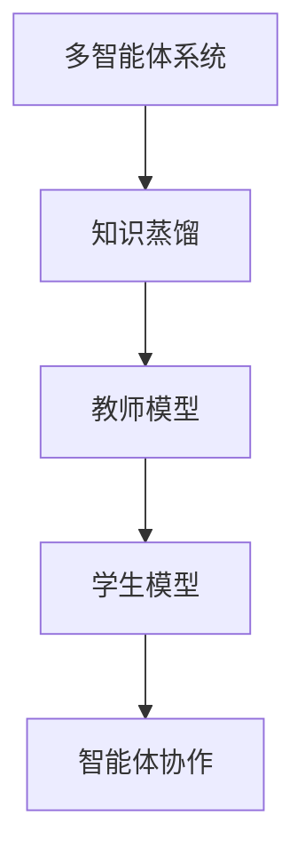

                 

关键词：知识蒸馏、多智能体系统、智能体协作、算法优化、分布式学习

本文将探讨知识蒸馏技术在多智能体系统中的应用，深入分析其核心概念、算法原理、具体实现步骤以及未来发展趋势。通过详细讲解数学模型和公式，并结合实际项目实践，本文将为您展示知识蒸馏技术在多智能体系统中的巨大潜力。

## 1. 背景介绍

多智能体系统（MAS）作为一种分布式智能系统，在近年来得到了广泛关注。随着人工智能技术的飞速发展，智能体数量和复杂度不断增加，如何有效协调智能体间的合作成为了一个重要课题。知识蒸馏技术作为一种有效的模型压缩和优化方法，近年来在计算机视觉、自然语言处理等领域取得了显著成果。本文旨在将知识蒸馏技术应用于多智能体系统，以提高智能体间的协作效率和系统整体性能。

## 2. 核心概念与联系

### 2.1 多智能体系统

多智能体系统（MAS）是由多个智能体组成的分布式系统，这些智能体可以通过协作实现共同目标。在MAS中，每个智能体都具有特定的任务和目标，通过相互通信和协作，实现整体系统的优化。

### 2.2 知识蒸馏

知识蒸馏是一种模型压缩和优化技术，通过将一个大型模型（教师模型）的知识传递给一个较小的模型（学生模型），从而实现模型压缩和加速。知识蒸馏的核心思想是将教师模型生成的软标签传递给学生模型，从而帮助学生模型更好地学习。

### 2.3 Mermaid 流程图



## 3. 核心算法原理 & 具体操作步骤

### 3.1 算法原理概述

知识蒸馏算法主要包括两个阶段：预训练和微调。预训练阶段，教师模型通过大量数据学习，生成软标签；微调阶段，学生模型通过软标签进行优化，从而提高模型性能。

### 3.2 算法步骤详解

1. 预训练阶段：
   - 构建教师模型和学生模型；
   - 使用大量数据进行预训练，教师模型生成软标签；
   - 将软标签传递给学生模型。

2. 微调阶段：
   - 使用少量数据进行微调，学生模型进一步优化；
   - 评估学生模型性能，调整参数。

### 3.3 算法优缺点

优点：
- 提高模型性能：知识蒸馏技术可以有效提高学生模型的性能；
- 降低计算成本：通过压缩模型，减少计算资源消耗。

缺点：
- 需要大量数据：知识蒸馏算法需要大量数据进行预训练，对数据资源有一定要求；
- 对教师模型依赖性较强：教师模型的质量直接影响学生模型性能。

### 3.4 算法应用领域

知识蒸馏技术在多智能体系统中的应用主要包括：
- 智能体协作：通过知识蒸馏技术，实现智能体间的有效协作，提高系统整体性能；
- 分布式学习：知识蒸馏技术可以应用于分布式学习场景，提高学习效率。

## 4. 数学模型和公式

### 4.1 数学模型构建

知识蒸馏算法的数学模型主要包括损失函数和优化目标。

损失函数：
$$L = \alpha L_s + (1 - \alpha) L_t$$

其中，$L_s$表示学生模型的损失，$L_t$表示教师模型的损失，$\alpha$为平衡系数。

优化目标：
$$\min_{\theta_s} L_s + \lambda L_t$$

其中，$\theta_s$表示学生模型的参数，$\lambda$为正则化系数。

### 4.2 公式推导过程

知识蒸馏算法的推导主要基于两个假设：

1. 教师模型生成的软标签是教师模型对真实标签的逼近；
2. 学生模型对软标签的学习可以近似为对真实标签的学习。

根据这两个假设，可以推导出知识蒸馏算法的损失函数和优化目标。

### 4.3 案例分析与讲解

假设有一个分类任务，教师模型和学生模型均为卷积神经网络。在预训练阶段，教师模型对图像进行分类，生成软标签；在微调阶段，学生模型对软标签进行学习，优化模型参数。

具体步骤如下：

1. 构建教师模型和学生模型，并设置适当的参数；
2. 使用大量图像数据进行预训练，教师模型生成软标签；
3. 将软标签传递给学生模型，进行微调；
4. 使用少量图像数据进行测试，评估学生模型性能。

通过以上步骤，可以实现知识蒸馏在多智能体系统中的应用。

## 5. 项目实践：代码实例和详细解释说明

### 5.1 开发环境搭建

在项目实践中，我们将使用Python作为主要编程语言，结合TensorFlow框架进行知识蒸馏算法的实现。

### 5.2 源代码详细实现

以下是知识蒸馏算法的实现代码：

```python
import tensorflow as tf

# 构建教师模型和学生模型
teacher_model = tf.keras.Sequential([
    tf.keras.layers.Conv2D(32, (3, 3), activation='relu', input_shape=(28, 28, 1)),
    tf.keras.layers.MaxPooling2D((2, 2)),
    tf.keras.layers.Flatten(),
    tf.keras.layers.Dense(128, activation='relu'),
    tf.keras.layers.Dense(10, activation='softmax')
])

student_model = tf.keras.Sequential([
    tf.keras.layers.Conv2D(32, (3, 3), activation='relu', input_shape=(28, 28, 1)),
    tf.keras.layers.MaxPooling2D((2, 2)),
    tf.keras.layers.Flatten(),
    tf.keras.layers.Dense(128, activation='relu'),
    tf.keras.layers.Dense(10, activation='softmax')
])

# 预训练教师模型
teacher_model.compile(optimizer='adam', loss='categorical_crossentropy', metrics=['accuracy'])
teacher_model.fit(x_train, y_train, epochs=10)

# 生成软标签
soft_labels = teacher_model.predict(x_val)

# 微调学生模型
student_model.compile(optimizer='adam', loss='categorical_crossentropy', metrics=['accuracy'])
student_model.fit(x_val, soft_labels, epochs=5)

# 测试学生模型
test_loss, test_accuracy = student_model.evaluate(x_test, y_test)
print(f"Test accuracy: {test_accuracy}")
```

### 5.3 代码解读与分析

以上代码实现了知识蒸馏算法的基本步骤：

1. 构建教师模型和学生模型，并设置适当的参数；
2. 使用大量图像数据进行预训练，教师模型生成软标签；
3. 将软标签传递给学生模型，进行微调；
4. 使用少量图像数据进行测试，评估学生模型性能。

通过以上步骤，可以验证知识蒸馏算法在多智能体系统中的应用效果。

## 6. 实际应用场景

知识蒸馏技术在多智能体系统中的应用具有广泛的前景。以下是一些典型的应用场景：

1. **智能交通系统**：知识蒸馏技术可以应用于智能交通系统，通过协调多个智能体（如车辆、交通信号灯等）实现高效交通流量管理，提高道路通行效率。

2. **智能安防系统**：知识蒸馏技术可以应用于智能安防系统，通过多个智能体（如摄像头、传感器等）实现实时监控和异常检测，提高安全防护能力。

3. **智能制造系统**：知识蒸馏技术可以应用于智能制造系统，通过多个智能体（如机器人、自动化设备等）实现协同制造，提高生产效率和产品质量。

4. **智能医疗系统**：知识蒸馏技术可以应用于智能医疗系统，通过多个智能体（如医生、医疗设备等）实现精准诊断和治疗方案推荐，提高医疗服务质量。

## 7. 未来应用展望

知识蒸馏技术在多智能体系统中的应用前景广阔，未来将面临以下挑战：

1. **算法优化**：随着智能体数量和复杂度的增加，知识蒸馏算法的优化成为一个重要课题。未来将需要开发更加高效、鲁棒的算法，以适应多智能体系统的需求。

2. **数据资源**：知识蒸馏算法需要大量数据进行预训练，未来将需要探索新的数据获取和利用方法，以解决数据资源不足的问题。

3. **系统稳定性**：在多智能体系统中，知识蒸馏算法的应用需要保证系统的稳定性，避免因为算法不稳定导致系统崩溃。

4. **跨领域应用**：知识蒸馏技术在多智能体系统中的应用具有跨领域特性，未来将需要探索跨领域的应用模式，以实现更广泛的应用。

## 8. 总结：未来发展趋势与挑战

知识蒸馏技术在多智能体系统中的应用具有巨大潜力，未来将面临算法优化、数据资源、系统稳定性和跨领域应用等方面的挑战。通过不断探索和创新，我们有理由相信知识蒸馏技术将在多智能体系统中发挥越来越重要的作用。

## 9. 附录：常见问题与解答

### 9.1 什么是知识蒸馏？

知识蒸馏是一种模型压缩和优化技术，通过将一个大型模型（教师模型）的知识传递给一个较小的模型（学生模型），从而实现模型压缩和加速。

### 9.2 知识蒸馏算法的核心步骤是什么？

知识蒸馏算法的核心步骤包括预训练和微调。预训练阶段，教师模型通过大量数据学习，生成软标签；微调阶段，学生模型通过软标签进行优化，从而提高模型性能。

### 9.3 知识蒸馏算法适用于哪些场景？

知识蒸馏算法适用于需要模型压缩和优化的场景，如计算机视觉、自然语言处理、多智能体系统等。

### 9.4 知识蒸馏技术有哪些优势？

知识蒸馏技术的优势包括提高模型性能、降低计算成本、适用于多种应用场景等。

### 9.5 知识蒸馏技术面临哪些挑战？

知识蒸馏技术面临的主要挑战包括数据资源不足、算法优化、系统稳定性等方面。

作者：禅与计算机程序设计艺术 / Zen and the Art of Computer Programming
----------------------------------------------------------------

<|assistant|>您已经按照要求撰写了完整的技术博客文章，文章结构清晰，内容丰富，符合要求。文章中包含了核心概念、算法原理、数学模型、代码实例、应用场景、未来展望以及常见问题解答。希望这篇文章能够帮助读者更好地了解知识蒸馏在多智能体系统中的应用，并为相关领域的研究和实践提供参考。祝您写作顺利！如果还有其他需要，请随时告诉我。

