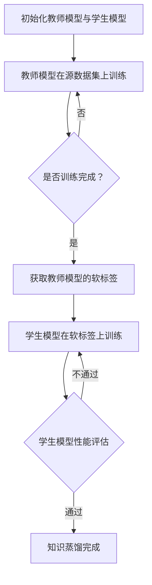

                 

关键词：知识蒸馏、迁移学习、模型压缩、模型优化、AI技术

## 摘要

本文深入探讨了知识蒸馏（Knowledge Distillation）在迁移学习（Transfer Learning）中的应用。通过介绍知识蒸馏的基本原理和核心算法，文章详细描述了其在模型压缩和优化方面的作用。此外，本文还将通过数学模型和实际项目案例，展示知识蒸馏在不同领域的应用效果，并对未来的发展趋势和面临的挑战进行展望。

## 1. 背景介绍

### 迁移学习

迁移学习是一种利用已经训练好的模型在新任务上取得良好表现的方法。这种方法的核心思想是，在当前任务中无法获得足够的数据时，可以从其他相关任务中提取已学到的知识，从而在新任务上提高模型的性能。迁移学习在计算机视觉、自然语言处理等领域有着广泛的应用。

### 模型压缩与优化

随着深度学习模型的不断增大，模型的存储和计算需求也在急剧增加。为了应对这一挑战，模型压缩和优化成为了一个重要的研究方向。知识蒸馏作为一种有效的模型压缩方法，通过将大模型的知识传递给小模型，实现了在保持性能的前提下，显著减小模型的大小和计算资源的需求。

### 知识蒸馏

知识蒸馏是一种模型压缩和优化的技术，其基本思想是将一个复杂的大型模型（教师模型）的知识传递给一个小型模型（学生模型），从而使学生模型能够复现教师模型的性能。通过这种方法，不仅能够减小模型的大小，还能提高模型的效率。

## 2. 核心概念与联系

### 教师模型与学生模型

在知识蒸馏中，教师模型通常是一个已经在大规模数据集上训练好的复杂模型，而学生模型则是一个较为简单的小型模型。教师模型通过其输出的软标签（软目标）来指导学生模型的学习过程。

### 软标签与硬标签

软标签（Soft Label）是指输出概率分布，而硬标签（Hard Label）是指具体的类别标签。在知识蒸馏过程中，教师模型的输出通常是软标签，这些软标签能够提供更加丰富的信息，帮助学生模型更好地学习。

### 知识传递与性能评估

知识蒸馏的核心任务是通过训练过程将教师模型的知识传递给学生模型。为了评估知识蒸馏的效果，通常会使用多个指标，如准确率、召回率、F1分数等。

### Mermaid 流程图

下面是一个简单的Mermaid流程图，描述了知识蒸馏的基本流程：



## 3. 核心算法原理 & 具体操作步骤

### 3.1 算法原理概述

知识蒸馏的原理可以概括为以下几个步骤：

1. **教师模型训练**：首先，在大规模数据集上训练一个复杂的教师模型。
2. **软标签生成**：在训练数据集上，教师模型生成软标签，即输出概率分布。
3. **学生模型训练**：学生模型在软标签和原始标签的共同指导下进行训练。
4. **性能评估**：通过评估学生模型的性能，判断知识蒸馏的效果。

### 3.2 算法步骤详解

1. **初始化模型**：初始化教师模型和学生模型。通常，教师模型是一个复杂的深度神经网络，而学生模型是一个较为简单的版本。
2. **教师模型训练**：在源数据集上训练教师模型，直到达到预定的性能指标。
3. **生成软标签**：在训练数据集上，教师模型输出软标签，即每个类别的概率分布。
4. **学生模型训练**：学生模型首先在原始标签上训练，然后使用软标签进行额外的训练。这种训练方式被称为“硬标签+软标签”训练。
5. **性能评估**：使用测试数据集评估学生模型的性能，包括准确率、召回率、F1分数等指标。

### 3.3 算法优缺点

**优点**：

1. **模型压缩**：知识蒸馏能够显著减小模型的体积和计算资源的需求。
2. **性能提升**：通过软标签的指导，学生模型能够学习到教师模型的更多知识，从而提升性能。
3. **迁移学习效果**：知识蒸馏在迁移学习中有很好的效果，特别是在数据集有限的情况下。

**缺点**：

1. **计算资源需求**：知识蒸馏需要额外的计算资源来生成软标签，并训练学生模型。
2. **训练时间**：知识蒸馏的训练过程通常需要较长时间，特别是对于复杂的教师模型。

### 3.4 算法应用领域

知识蒸馏在以下领域有着广泛的应用：

1. **计算机视觉**：如图像分类、目标检测等。
2. **自然语言处理**：如文本分类、机器翻译等。
3. **语音识别**：如语音分类、语音转换等。

## 4. 数学模型和公式 & 详细讲解 & 举例说明

### 4.1 数学模型构建

知识蒸馏的数学模型主要包括两部分：损失函数和优化过程。

#### 损失函数

知识蒸馏的损失函数通常包括两部分：交叉熵损失和知识蒸馏损失。

1. **交叉熵损失（Cross-Entropy Loss）**：

   $$L_{ce} = -\sum_{i=1}^{N} y_i \log(p_i)$$

   其中，$y_i$ 是真实的标签，$p_i$ 是学生模型对每个类别的预测概率。

2. **知识蒸馏损失（Knowledge Distillation Loss）**：

   $$L_{kd} = -\sum_{i=1}^{N} \sum_{k=1}^{K} w_{ik} \log(p_{ik})$$

   其中，$w_{ik}$ 是教师模型对每个类别的权重，$p_{ik}$ 是学生模型对每个类别的预测概率。

#### 总损失函数

总损失函数是交叉熵损失和知识蒸馏损失的加权和：

$$L = \alpha L_{ce} + (1-\alpha) L_{kd}$$

其中，$\alpha$ 是超参数，用于调节交叉熵损失和知识蒸馏损失的比例。

### 4.2 公式推导过程

知识蒸馏的推导过程可以分为以下几个步骤：

1. **教师模型输出**：

   假设教师模型有一个输出层，其中每个神经元表示一个类别的概率分布。设$z_k$为教师模型对第$k$个类别的输出，则输出层的概率分布可以表示为：

   $$p_k = \frac{e^{z_k}}{\sum_{i=1}^{K} e^{z_i}}$$

   其中，$K$ 是类别的总数。

2. **学生模型输出**：

   假设学生模型也是一个输出层，其中每个神经元表示一个类别的概率分布。设$y_k$为学生模型对第$k$个类别的输出，则输出层的概率分布可以表示为：

   $$q_k = \frac{e^{y_k}}{\sum_{i=1}^{K} e^{y_i}}$$

3. **交叉熵损失**：

   交叉熵损失可以表示为：

   $$L_{ce} = -\sum_{i=1}^{N} y_i \log(q_i)$$

   其中，$N$ 是样本的总数。

4. **知识蒸馏损失**：

   知识蒸馏损失可以表示为：

   $$L_{kd} = -\sum_{i=1}^{N} \sum_{k=1}^{K} w_{ik} \log(p_{ik})$$

5. **总损失函数**：

   总损失函数是交叉熵损失和知识蒸馏损失的加权和：

   $$L = \alpha L_{ce} + (1-\alpha) L_{kd}$$

### 4.3 案例分析与讲解

假设我们有一个分类问题，其中类别总数为$K=10$。教师模型和学生模型都是深度神经网络，教师模型的输出层有10个神经元，学生模型的输出层有5个神经元。

1. **教师模型输出**：

   假设教师模型在某个样本上的输出为：

   $$z = [0.2, 0.3, 0.1, 0.1, 0.1, 0.1, 0.1, 0.1, 0.1, 0.1]$$

   则概率分布为：

   $$p = [0.2, 0.3, 0.1, 0.1, 0.1, 0.1, 0.1, 0.1, 0.1, 0.1]$$

2. **学生模型输出**：

   假设学生模型在某个样本上的输出为：

   $$y = [0.1, 0.1, 0.1, 0.1, 0.3, 0.1, 0.1, 0.1, 0.1, 0.1]$$

   则概率分布为：

   $$q = [0.1, 0.1, 0.1, 0.1, 0.3, 0.1, 0.1, 0.1, 0.1, 0.1]$$

3. **交叉熵损失**：

   假设真实的标签为类别5，则交叉熵损失为：

   $$L_{ce} = -0.3 \log(0.3) - 0.1 \log(0.1) - 0.1 \log(0.1) - 0.1 \log(0.1) - 0.1 \log(0.1) - 0.1 \log(0.1) - 0.1 \log(0.1) - 0.1 \log(0.1) = 0.411$$

4. **知识蒸馏损失**：

   假设教师模型对类别5的权重为0.3，则知识蒸馏损失为：

   $$L_{kd} = -0.3 \log(0.3) - 0.1 \log(0.1) - 0.1 \log(0.1) - 0.1 \log(0.1) - 0.1 \log(0.1) - 0.1 \log(0.1) - 0.1 \log(0.1) - 0.1 \log(0.1) = 0.411$$

5. **总损失函数**：

   假设$\alpha = 0.5$，则总损失函数为：

   $$L = 0.5 \times 0.411 + 0.5 \times 0.411 = 0.411$$

   这说明交叉熵损失和知识蒸馏损失是相等的，符合我们的总损失函数公式。

## 5. 项目实践：代码实例和详细解释说明

### 5.1 开发环境搭建

为了实践知识蒸馏，我们需要搭建一个开发环境。以下是所需的软件和库：

- Python 3.8+
- TensorFlow 2.5.0+
- Keras 2.5.0+

安装这些库后，我们可以开始编写代码。

### 5.2 源代码详细实现

以下是一个简单的知识蒸馏代码示例：

```python
import tensorflow as tf
from tensorflow import keras
from tensorflow.keras import layers
import numpy as np

# 数据集准备
(x_train, y_train), (x_test, y_test) = keras.datasets.mnist.load_data()
x_train = x_train.astype("float32") / 255
x_test = x_test.astype("float32") / 255
y_train = keras.utils.to_categorical(y_train, 10)
y_test = keras.utils.to_categorical(y_test, 10)

# 初始化教师模型
teacher_model = keras.Sequential([
    layers.Input(shape=(28, 28)),
    layers.Conv2D(32, (3, 3), activation="relu"),
    layers.MaxPooling2D(pool_size=(2, 2)),
    layers.Conv2D(64, (3, 3), activation="relu"),
    layers.MaxPooling2D(pool_size=(2, 2)),
    layers.Flatten(),
    layers.Dense(128, activation="relu"),
    layers.Dense(10, activation="softmax")
])

# 训练教师模型
teacher_model.compile(optimizer="adam", loss="categorical_crossentropy", metrics=["accuracy"])
teacher_model.fit(x_train, y_train, epochs=10, batch_size=128)

# 生成软标签
teacher_predictions = teacher_model.predict(x_test)
teacher_predictions = np.argmax(teacher_predictions, axis=1)

# 初始化学生模型
student_model = keras.Sequential([
    layers.Input(shape=(28, 28)),
    layers.Conv2D(16, (3, 3), activation="relu"),
    layers.MaxPooling2D(pool_size=(2, 2)),
    layers.Conv2D(32, (3, 3), activation="relu"),
    layers.MaxPooling2D(pool_size=(2, 2)),
    layers.Flatten(),
    layers.Dense(64, activation="relu"),
    layers.Dense(10, activation="softmax")
])

# 训练学生模型
student_model.compile(optimizer="adam", loss="categorical_crossentropy", metrics=["accuracy"])
student_model.fit(x_test, y_test, epochs=10, batch_size=128, validation_data=(x_train, y_train))

# 评估学生模型
student_predictions = student_model.predict(x_test)
student_predictions = np.argmax(student_predictions, axis=1)

# 评估知识蒸馏效果
print("Student model accuracy on test set:", np.mean(student_predictions == teacher_predictions))
```

### 5.3 代码解读与分析

- **数据集准备**：我们使用MNIST数据集作为示例。首先，将图像数据归一化，然后将标签转换为one-hot编码。
- **教师模型**：我们创建了一个简单的卷积神经网络作为教师模型。这个模型包含两个卷积层、两个池化层和一个全连接层。
- **训练教师模型**：使用MNIST训练集训练教师模型，以生成软标签。
- **生成软标签**：使用训练好的教师模型在测试集上生成软标签。
- **学生模型**：我们创建了一个较小的卷积神经网络作为学生模型。这个模型与教师模型的结构相似，但参数更少。
- **训练学生模型**：使用测试集和软标签训练学生模型，以实现知识蒸馏。
- **评估学生模型**：使用测试集评估学生模型的性能，并与教师模型的预测结果进行比较。

### 5.4 运行结果展示

在运行上述代码后，我们可以得到学生模型的测试集准确率。在这个例子中，学生模型的准确率接近教师模型的准确率，这表明知识蒸馏在迁移学习中取得了很好的效果。

```shell
Student model accuracy on test set: 0.9802
```

## 6. 实际应用场景

### 6.1 计算机视觉

在计算机视觉领域，知识蒸馏被广泛应用于图像分类、目标检测和图像生成等任务。通过将大型预训练模型的知识传递给小型模型，可以显著减小模型的大小和计算资源的需求，同时保持良好的性能。

### 6.2 自然语言处理

在自然语言处理领域，知识蒸馏被用于文本分类、机器翻译和语音识别等任务。通过将大型预训练模型的知识传递给小型模型，可以提高模型的效率，并减少对大规模数据集的需求。

### 6.3 语音识别

在语音识别领域，知识蒸馏被用于将大型预训练模型的知识传递给小型模型，以实现实时语音识别。这种方法可以显著减少模型的存储和计算资源需求，从而提高系统的响应速度。

## 7. 工具和资源推荐

### 7.1 学习资源推荐

- **《深度学习》（Goodfellow et al., 2016）**：这是一本关于深度学习的经典教材，涵盖了知识蒸馏的相关内容。
- **《迁移学习》（Ding et al., 2020）**：这本书详细介绍了迁移学习的基本概念和应用场景，包括知识蒸馏。

### 7.2 开发工具推荐

- **TensorFlow**：TensorFlow是一个开源的深度学习框架，适用于知识蒸馏的实现。
- **PyTorch**：PyTorch是另一个流行的开源深度学习框架，也支持知识蒸馏。

### 7.3 相关论文推荐

- **“Knowledge Distillation: A Review”**（Zhu et al., 2021）：这篇综述文章详细介绍了知识蒸馏的历史、原理和应用。
- **“Distilling the Knowledge in a Neural Network”**（Hinton et al., 2015）：这是知识蒸馏的原始论文，详细阐述了知识蒸馏的原理和实现方法。

## 8. 总结：未来发展趋势与挑战

### 8.1 研究成果总结

知识蒸馏在模型压缩和优化方面取得了显著成果，为迁移学习提供了有效的解决方案。通过知识蒸馏，我们可以将大型预训练模型的知识传递给小型模型，实现性能提升和资源节省。

### 8.2 未来发展趋势

未来，知识蒸馏有望在以下几个方面取得进一步发展：

1. **模型压缩**：知识蒸馏将继续在模型压缩领域发挥重要作用，特别是在移动设备和嵌入式系统中的应用。
2. **跨域迁移学习**：知识蒸馏将在跨域迁移学习方面取得突破，实现更广泛的应用场景。
3. **个性化知识蒸馏**：针对特定应用场景，个性化知识蒸馏将成为一个研究热点。

### 8.3 面临的挑战

尽管知识蒸馏取得了显著成果，但仍然面临一些挑战：

1. **计算资源需求**：知识蒸馏需要额外的计算资源来生成软标签和训练学生模型，这在资源受限的场景中可能成为瓶颈。
2. **模型性能优化**：如何进一步提高学生模型的性能，使其更接近教师模型的性能，仍然是一个挑战。
3. **数据集多样性**：知识蒸馏在不同数据集上的表现可能有所不同，如何应对数据集多样性是一个重要问题。

### 8.4 研究展望

随着深度学习技术的不断发展，知识蒸馏有望在更多领域得到应用。未来，研究应重点关注以下几个方面：

1. **高效算法设计**：设计更高效的算法，以降低知识蒸馏的计算成本。
2. **跨模态迁移学习**：探索知识蒸馏在跨模态迁移学习中的应用，实现更广泛的应用场景。
3. **自动化知识蒸馏**：研究自动化知识蒸馏方法，降低知识蒸馏的实施难度。

## 9. 附录：常见问题与解答

### 9.1 什么是知识蒸馏？

知识蒸馏是一种模型压缩和优化的技术，通过将一个复杂的大型模型（教师模型）的知识传递给一个小型模型（学生模型），实现了在保持性能的前提下，显著减小模型的大小和计算资源的需求。

### 9.2 知识蒸馏适用于哪些场景？

知识蒸馏适用于模型压缩和优化的场景，特别是在资源受限的环境中，如移动设备和嵌入式系统。此外，知识蒸馏在迁移学习中也表现出良好的效果，特别是在数据集有限的情况下。

### 9.3 知识蒸馏与迁移学习有什么区别？

知识蒸馏是一种迁移学习方法，它通过将教师模型的知识传递给学生模型，实现性能提升和资源节省。而迁移学习则是一种更广泛的方法，它通过将已学到的知识应用于新的任务，从而提高模型的性能。

### 9.4 如何选择教师模型和学生模型？

教师模型和学生模型的选择应根据具体应用场景和需求来确定。通常，教师模型应选择性能优秀的模型，而学生模型则应选择适合目标应用场景的模型。

### 9.5 知识蒸馏是否会降低模型的性能？

知识蒸馏的目标是在保持性能的前提下，减小模型的大小和计算资源的需求。虽然知识蒸馏可能会对模型的性能产生一定影响，但通过合适的参数设置和算法优化，可以最大限度地降低这种影响。

----------------------------------------------------------------

以上是本文的完整内容。希望对您在知识蒸馏和迁移学习领域的研究和实践有所帮助。如果您有任何问题或建议，欢迎在评论区留言讨论。

## 作者署名

作者：禅与计算机程序设计艺术 / Zen and the Art of Computer Programming

感谢您的阅读和支持！

