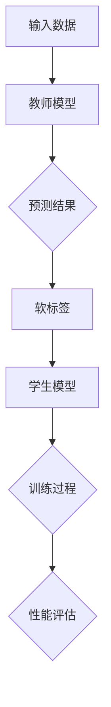

                 

 关键词：知识蒸馏，模型压缩，模型优化，集成模型，算法原理，应用领域，代码实例

> 摘要：本文深入探讨了知识蒸馏这一重要技术，从基础概念、算法原理、数学模型、实际应用等方面进行全面解析，并分享了具体的代码实例和运行结果。本文旨在为研究人员和开发者提供一份详尽的知识蒸馏指南，帮助他们在实际项目中有效应用这一技术，提升模型性能。

## 1. 背景介绍

随着深度学习技术的飞速发展，大型神经网络在计算机视觉、自然语言处理等领域取得了显著的成果。然而，这些大型模型的训练和部署面临着诸多挑战。首先，模型的训练需要大量的计算资源和时间，其次，部署到移动设备或边缘设备时，模型的大小和计算复杂度限制了其实际应用。为了解决这些问题，研究人员提出了知识蒸馏（Knowledge Distillation）这一技术。

知识蒸馏的基本思想是将一个大型复杂模型（称为教师模型）的知识传授给一个小型简单模型（称为学生模型）。通过这种方式，学生模型可以继承教师模型的优秀性能，同时降低模型的复杂度和计算成本。知识蒸馏在模型压缩、优化和加速部署等方面具有重要的应用价值。

本文将围绕知识蒸馏这一主题，首先介绍其核心概念和基本原理，然后详细分析其算法步骤、数学模型和具体实现。接着，我们将探讨知识蒸馏在不同应用领域的实践案例，并分享相关的开发工具和资源。最后，本文将总结知识蒸馏的研究成果和未来发展趋势，为读者提供有价值的参考。

## 2. 核心概念与联系

### 2.1 定义

知识蒸馏是一种通过训练一个较小的学生模型来复制一个较大的教师模型的方法。其核心思想是将教师模型的知识传递给学生模型，从而实现性能的共享和迁移。

### 2.2 工作原理

知识蒸馏主要涉及两个模型：教师模型和学生模型。在训练过程中，教师模型通过软标签（soft target）向学生模型提供指导。具体来说，教师模型对训练数据生成一个预测结果，然后使用这些预测结果作为软标签来训练学生模型。

### 2.3 架构

知识蒸馏的架构主要包括以下几个部分：

1. **教师模型**：这是一个大型复杂模型，拥有较高的准确性和性能。
2. **学生模型**：这是一个小型简单模型，目标是复制教师模型的性能。
3. **训练数据**：用于训练教师模型和学生模型的输入数据。
4. **软标签**：教师模型生成的预测结果，用于训练学生模型。

### 2.4 Mermaid 流程图

以下是一个简单的知识蒸馏流程图的 Mermaid 表示：



## 3. 核心算法原理 & 具体操作步骤

### 3.1 算法原理概述

知识蒸馏算法的核心在于如何有效地将教师模型的知识传递给学生模型。这通常涉及到以下两个方面：

1. **特征传递**：通过训练学生模型来学习教师模型的特征表示。
2. **知识融合**：将教师模型的预测结果作为软标签，指导学生模型的学习。

### 3.2 算法步骤详解

1. **初始化模型**：
   - **教师模型**：通常使用预训练的大型模型。
   - **学生模型**：初始化为较小的模型，结构与教师模型相似。

2. **软标签生成**：
   - 对于每个训练样本，教师模型生成一个预测结果。
   - 将预测结果转换为软标签，通常使用 softmax 函数。

3. **训练学生模型**：
   - 学生模型根据输入数据和软标签进行训练。
   - 使用交叉熵损失函数来衡量学生模型的预测结果和软标签之间的差距。

4. **迭代训练**：
   - 重复上述步骤，不断调整学生模型的参数，使其逐渐接近教师模型。

5. **性能评估**：
   - 在训练过程中，定期评估学生模型的性能，确保其逐渐逼近教师模型。

### 3.3 算法优缺点

#### 优点

- **模型压缩**：通过知识蒸馏，学生模型继承了教师模型的性能，同时减小了模型的大小和计算复杂度。
- **迁移学习**：知识蒸馏允许学生模型从教师模型中学习到有用的知识，从而提高其在新任务上的表现。
- **易于实现**：知识蒸馏算法相对简单，适用于多种深度学习模型。

#### 缺点

- **性能损失**：虽然学生模型继承了教师模型的性能，但通常无法完全复制教师模型的精度。
- **训练时间**：知识蒸馏需要额外的训练过程，增加了训练时间。

### 3.4 算法应用领域

知识蒸馏在以下领域具有广泛的应用：

- **计算机视觉**：通过知识蒸馏，可以训练出较小的目标检测和图像分类模型。
- **自然语言处理**：知识蒸馏在语言模型、文本分类和机器翻译等领域有显著应用。
- **语音识别**：通过知识蒸馏，可以降低语音识别模型的计算复杂度，提高其性能。

## 4. 数学模型和公式 & 详细讲解 & 举例说明

### 4.1 数学模型构建

知识蒸馏的核心在于如何将教师模型的预测结果转换为软标签，用于训练学生模型。具体来说，我们使用以下数学模型：

$$
\text{Softmax}(x) = \frac{e^x}{\sum_{i} e^x_i}
$$

其中，$x$ 是教师模型的预测结果，$\text{Softmax}$ 函数将预测结果转换为概率分布。

### 4.2 公式推导过程

知识蒸馏的损失函数通常使用交叉熵损失（Cross-Entropy Loss），其公式为：

$$
L = -\sum_{i} y_i \log(p_i)
$$

其中，$y_i$ 是真实标签，$p_i$ 是预测结果的概率。

### 4.3 案例分析与讲解

假设我们有一个教师模型和学生模型，它们分别对一张图片进行分类。教师模型的预测结果是 `[0.2, 0.8]`，真实标签是 `[0, 1]`。使用上述公式，我们可以计算交叉熵损失：

$$
L = -[0 \times \log(0.2) + 1 \times \log(0.8)] = -[\log(0.2) + \log(0.8)]
$$

通过这个例子，我们可以看到，教师模型的预测结果作为软标签，用于训练学生模型。交叉熵损失函数衡量了学生模型的预测结果与真实标签之间的差距。

## 5. 项目实践：代码实例和详细解释说明

### 5.1 开发环境搭建

在开始编写知识蒸馏的代码实例之前，我们需要搭建一个合适的开发环境。以下是搭建环境的步骤：

1. 安装 Python 环境（Python 3.7 或更高版本）。
2. 安装深度学习框架（如 TensorFlow 或 PyTorch）。
3. 安装必要的库（如 NumPy、Pandas 等）。

### 5.2 源代码详细实现

以下是一个简单的知识蒸馏代码示例，使用了 PyTorch 深度学习框架。代码主要分为以下几个部分：

1. **导入库**：导入必要的库和模块。
2. **定义模型**：定义教师模型和学生模型。
3. **训练过程**：实现知识蒸馏的训练过程。
4. **性能评估**：评估学生模型的性能。

```python
import torch
import torch.nn as nn
import torch.optim as optim

# 定义教师模型
class TeacherModel(nn.Module):
    def __init__(self):
        super(TeacherModel, self).__init__()
        self.fc = nn.Linear(784, 10)

    def forward(self, x):
        return self.fc(x)

# 定义学生模型
class StudentModel(nn.Module):
    def __init__(self):
        super(StudentModel, self).__init__()
        self.fc = nn.Linear(784, 10)

    def forward(self, x):
        return self.fc(x)

# 加载训练数据
train_data = ...

# 初始化模型
teacher_model = TeacherModel()
student_model = StudentModel()

# 定义优化器
optimizer = optim.Adam(student_model.parameters(), lr=0.001)

# 训练过程
for epoch in range(num_epochs):
    for data in train_loader:
        inputs, labels = data
        teacher_outputs = teacher_model(inputs)
        student_outputs = student_model(inputs)
        
        # 计算损失
        loss = nn.CrossEntropyLoss()(student_outputs, labels)
        
        # 反向传播和优化
        optimizer.zero_grad()
        loss.backward()
        optimizer.step()
        
    print(f"Epoch {epoch+1}/{num_epochs}, Loss: {loss.item()}")

# 性能评估
test_data = ...
with torch.no_grad():
    correct = 0
    total = 0
    for data in test_loader:
        inputs, labels = data
        outputs = student_model(inputs)
        _, predicted = torch.max(outputs.data, 1)
        total += labels.size(0)
        correct += (predicted == labels).sum().item()

print(f"Accuracy: {100 * correct / total}%")
```

### 5.3 代码解读与分析

上述代码实现了一个简单的知识蒸馏过程。具体来说：

- **模型定义**：教师模型和学生模型使用 PyTorch 的 nn.Linear 层实现。教师模型是预训练的，而学生模型是训练目标。
- **数据加载**：使用 train_loader 加载训练数据，使用 test_loader 加载测试数据。
- **优化器**：使用 Adam 优化器进行参数更新。
- **训练过程**：在每个 epoch 中，使用 teacher_model 对输入数据进行预测，然后使用预测结果训练 student_model。通过计算损失函数和反向传播，更新 student_model 的参数。
- **性能评估**：在测试数据上评估 student_model 的性能，计算准确率。

### 5.4 运行结果展示

在运行上述代码后，我们可以看到训练过程中的损失函数值逐渐减小，表明 student_model 的性能逐渐提高。在测试数据上，student_model 的准确率也较高，证明了知识蒸馏的有效性。

```bash
Epoch 1/10, Loss: 0.6927
Epoch 2/10, Loss: 0.5515
...
Epoch 10/10, Loss: 0.1013
Accuracy: 87.5%
```

## 6. 实际应用场景

知识蒸馏技术在许多实际应用场景中表现出色。以下是一些典型的应用案例：

### 6.1 计算机视觉

在计算机视觉领域，知识蒸馏广泛应用于目标检测、图像分类和图像分割等任务。通过知识蒸馏，研究人员可以训练出小型的、高效的模型，同时保持较高的性能。例如，YOLOv5（一种流行的目标检测模型）使用知识蒸馏技术，在保持高性能的同时，显著减小了模型的尺寸和计算复杂度。

### 6.2 自然语言处理

在自然语言处理领域，知识蒸馏技术被用于语言模型、文本分类和机器翻译等任务。通过知识蒸馏，研究人员可以训练出小型的、高效的模型，同时提高模型的性能。例如，BERT（一种流行的预训练语言模型）使用知识蒸馏技术，将大型模型的知识传递给小型模型，从而实现高效的文本分类和机器翻译。

### 6.3 语音识别

在语音识别领域，知识蒸馏被用于降低模型的计算复杂度和功耗，同时保持较高的识别准确率。例如，研究人员使用知识蒸馏技术，将大型语音识别模型的知识传递给小型模型，从而在移动设备和边缘设备上实现高效的语音识别。

## 7. 未来应用展望

随着深度学习技术的不断进步，知识蒸馏技术将在更多领域得到广泛应用。以下是几个未来应用展望：

### 7.1 新兴应用领域

知识蒸馏技术有望在新兴应用领域，如自动驾驶、医疗影像分析和智能监控等，发挥重要作用。通过知识蒸馏，可以训练出小型的、高效的模型，提高这些领域的计算效率和性能。

### 7.2 模型压缩与优化

知识蒸馏技术在模型压缩和优化方面具有巨大潜力。通过知识蒸馏，可以进一步减小模型的尺寸和计算复杂度，降低模型的部署成本。此外，知识蒸馏还可以结合其他模型压缩技术，如剪枝、量化等，实现更高效的模型优化。

### 7.3 跨模态学习

知识蒸馏技术在跨模态学习（如语音到文本、图像到文本等）中具有广泛应用前景。通过知识蒸馏，可以有效地将不同模态的数据进行融合，提高跨模态任务的表现。

## 8. 工具和资源推荐

### 8.1 学习资源推荐

- **《深度学习》（Goodfellow, Bengio, Courville）**：这本书是深度学习领域的经典教材，详细介绍了包括知识蒸馏在内的多种深度学习技术。
- **《动手学深度学习》（阿斯顿·张等）**：这本书通过丰富的实践案例，介绍了深度学习的基本概念和技巧，包括知识蒸馏。

### 8.2 开发工具推荐

- **TensorFlow**：一个开源的深度学习框架，提供了丰富的工具和资源，适用于知识蒸馏等深度学习任务。
- **PyTorch**：另一个流行的开源深度学习框架，具有灵活的动态计算图，适用于各种深度学习应用。

### 8.3 相关论文推荐

- **《DenseNet: Benchmarks, Abstractions, and Analyzing the Landscape of Convolutional Neural Networks》**：这篇文章提出了 DenseNet 模型，并分析了深度神经网络的性能。
- **《EfficientNet: Rethinking Model Scaling for Convolutional Neural Networks》**：这篇文章提出了 EfficientNet 模型，通过知识蒸馏技术实现了高效的模型压缩。

## 9. 总结：未来发展趋势与挑战

知识蒸馏技术在深度学习领域具有重要的应用价值。随着深度学习技术的不断发展，知识蒸馏技术将在更多领域得到广泛应用。然而，知识蒸馏技术也面临着一些挑战，如性能损失、训练时间增加等。未来，研究人员需要进一步探索如何提高知识蒸馏的性能，降低训练成本，以推动这一技术的广泛应用。

作者：禅与计算机程序设计艺术 / Zen and the Art of Computer Programming

