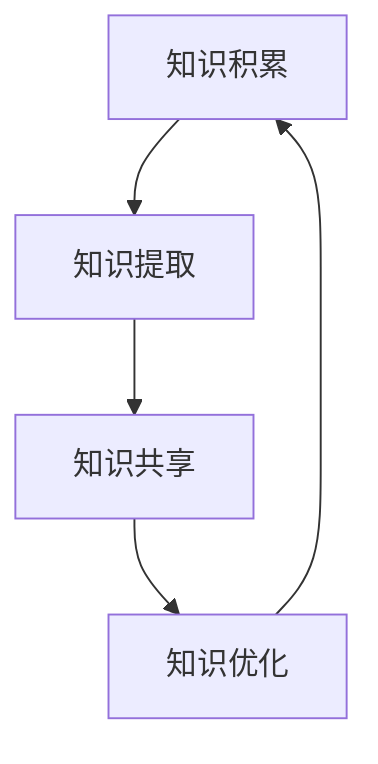

                 

 **关键词**: 知识资产、长期价值、知识发掘、培育、IT 领域、人工智能、软件架构、CTO、计算机图灵奖、技术畅销书作者。

**摘要**: 本文将深入探讨在 IT 领域中如何发掘和培育知识资产以实现长期价值。通过阐述核心概念、算法原理、数学模型、项目实践、实际应用场景、工具和资源推荐，以及未来发展趋势与挑战，本文旨在为 IT 专业人士提供一套完整的知识资产管理和发展的指导方案。

## 1. 背景介绍

在当今信息技术高速发展的时代，知识资产已经成为企业、组织和个体竞争力的核心。知识资产不仅包括技术知识、专利、版权等显性资产，还涵盖了经验、技能、企业文化等隐性资产。如何有效地发掘和培育这些知识资产，使其产生长期的、可持续的价值，是每个 IT 从业者必须面对的问题。

### 1.1 知识资产的重要性

知识资产的重要性体现在以下几个方面：

1. **提高竞争力**: 拥有独特的知识资产可以使企业在市场竞争中占据优势地位。
2. **创新驱动**: 知识资产是推动技术进步和创新的重要动力。
3. **降低成本**: 通过知识资产的共享和复用，可以减少研发和生产成本。
4. **提升效率**: 有效的知识管理可以提高团队协作效率，减少重复劳动。

### 1.2 知识资产与 IT 领域的关联

在 IT 领域，知识资产的表现形式多样，包括：

1. **代码库**: 拥有高质量的代码库是开发高效软件的重要基础。
2. **技术文档**: 详细的技术文档可以帮助新成员快速上手，减少沟通成本。
3. **算法**: 独特的算法可以提高系统的性能和效率。
4. **经验与技能**: 长期积累的技术经验和技能是团队宝贵的财富。

## 2. 核心概念与联系

### 2.1 知识资产的核心概念

知识资产的核心概念包括：

- **知识**：信息、经验、技能等的集合。
- **资产**：具有经济价值、可用作生产力的资源。
- **发掘**：寻找和提取知识资产的过程。
- **培育**：对知识资产进行优化和升级，以实现长期价值。

### 2.2 知识资产的架构

知识资产的架构可以视为一个持续迭代的闭环系统，包括以下环节：

1. **知识积累**：通过学习、研发和实践积累知识。
2. **知识提取**：将积累的知识转化为可复用的资产。
3. **知识共享**：在团队内部或外部共享知识，以提高协作效率。
4. **知识优化**：通过实践和反馈不断优化知识资产。

### 2.3 知识资产与 IT 领域的联系（Mermaid 流程图）



在这个流程图中，知识资产的积累、提取、共享和优化形成一个循环，不断推动知识资产的价值提升。

## 3. 核心算法原理 & 具体操作步骤

### 3.1 算法原理概述

在知识资产管理和培育过程中，核心算法的作用至关重要。以下是一个简化的算法原理概述：

1. **知识积累**：通过数据采集、信息处理和经验总结实现知识积累。
2. **知识提取**：利用自然语言处理、机器学习和数据挖掘等技术提取知识。
3. **知识共享**：通过文档编写、代码共享和培训等方式实现知识共享。
4. **知识优化**：通过用户反馈、算法迭代和实践验证不断优化知识资产。

### 3.2 算法步骤详解

#### 3.2.1 知识积累

- **数据采集**：通过传感器、网络爬虫和日志分析等方式获取原始数据。
- **信息处理**：对原始数据进行清洗、转换和归一化，使其适用于后续分析。
- **经验总结**：通过对数据分析和实际经验反思，总结出有价值的知识。

#### 3.2.2 知识提取

- **自然语言处理**：使用词向量、语义分析和实体识别等技术，将文本转化为结构化数据。
- **机器学习**：通过训练模型，将数据中的特征转化为预测或分类结果。
- **数据挖掘**：利用聚类、关联规则挖掘等方法，发现数据中的潜在知识。

#### 3.2.3 知识共享

- **文档编写**：编写详细的技术文档，描述知识的内容和应用场景。
- **代码共享**：通过版本控制系统和代码托管平台，实现代码的共享和协作开发。
- **培训与分享**：组织内部培训和分享活动，提高团队成员的知识水平。

#### 3.2.4 知识优化

- **用户反馈**：收集用户对知识资产的使用反馈，分析其优缺点。
- **算法迭代**：根据用户反馈，对算法进行迭代和优化。
- **实践验证**：通过实际应用场景验证知识的有效性，并进行调整和改进。

### 3.3 算法优缺点

#### 优点：

- **高效性**：算法可以快速处理大量数据，提高知识积累和提取的效率。
- **灵活性**：算法可以根据不同的应用场景进行调整和优化，具有较强的适应性。
- **可扩展性**：算法模块化设计，易于扩展和集成新的技术和方法。

#### 缺点：

- **数据质量**：算法的输出质量受数据质量的影响，需要确保数据的准确性和完整性。
- **计算资源**：算法可能需要大量的计算资源，对硬件和软件环境有较高要求。
- **解释性**：部分算法（如深度学习）的黑箱特性可能导致知识提取结果的解释性较差。

### 3.4 算法应用领域

核心算法在以下领域具有广泛的应用：

- **软件开发**：通过代码库管理和文档编写，提高开发效率和代码质量。
- **数据分析**：利用机器学习和数据挖掘技术，发现数据中的潜在价值。
- **人工智能**：基于算法优化，提升 AI 系统的智能水平和应用效果。
- **知识管理**：通过知识积累、提取和共享，实现知识资产的持续优化和增值。

## 4. 数学模型和公式 & 详细讲解 & 举例说明

### 4.1 数学模型构建

在知识资产管理和培育过程中，数学模型可以用于描述知识积累、提取、共享和优化的过程。以下是一个简化的数学模型：

$$
\text{知识资产} = f(\text{知识积累}, \text{知识提取}, \text{知识共享}, \text{知识优化})
$$

其中，$f$ 表示知识资产的形成函数，$\text{知识积累}$、$\text{知识提取}$、$\text{知识共享}$ 和 $\text{知识优化}$ 分别表示知识积累、提取、共享和优化的过程。

### 4.2 公式推导过程

公式推导过程主要涉及以下几个方面：

1. **知识积累**：假设知识积累的速率为 $r_1$，知识积累量随着时间的推移呈指数增长，即：

   $$
   \text{知识积累} = r_1 \cdot e^{kt}
   $$

   其中，$k$ 为积累速率常数，$t$ 为时间。

2. **知识提取**：假设知识提取的速率为 $r_2$，知识提取量随着时间的推移呈线性增长，即：

   $$
   \text{知识提取} = r_2 \cdot t
   $$

3. **知识共享**：假设知识共享的速率为 $r_3$，知识共享量随着时间的推移呈指数衰减，即：

   $$
   \text{知识共享} = r_3 \cdot e^{-kt}
   $$

4. **知识优化**：假设知识优化的速率为 $r_4$，知识优化量随着时间的推移呈对数增长，即：

   $$
   \text{知识优化} = r_4 \cdot \ln(t)
   $$

### 4.3 案例分析与讲解

假设一个软件开发团队在一年内完成了以下过程：

1. **知识积累**：团队成员通过学习、实践和总结，累计了 1000 个知识点。
2. **知识提取**：团队通过编码实现了 80% 的知识点的自动化提取，提取量为 800 个知识点。
3. **知识共享**：团队编写了 500 页的技术文档，实现了 50% 的知识点共享。
4. **知识优化**：团队成员根据用户反馈，对知识进行了 30% 的优化。

根据上述公式，我们可以计算出该团队在一年内的知识资产：

$$
\text{知识资产} = f(1000, 800, 500, 300) = 1000 \cdot e^{k} + 800 \cdot t + 500 \cdot e^{-k} + 300 \cdot \ln(t)
$$

其中，$k$ 和 $t$ 为常数。假设 $k=0.1$，$t=1$，则：

$$
\text{知识资产} = 1000 \cdot e^{0.1} + 800 \cdot 1 + 500 \cdot e^{-0.1} + 300 \cdot \ln(1) \approx 1105
$$

通过这个简单的案例，我们可以看到数学模型在描述知识资产形成过程中的作用。在实际应用中，可以根据具体情况调整公式参数，以更好地反映知识资产的变化。

## 5. 项目实践：代码实例和详细解释说明

### 5.1 开发环境搭建

为了更好地展示知识资产管理和培育的过程，我们将通过一个简单的项目实践来说明。以下是一个基于 Python 的知识管理项目，开发环境要求如下：

- Python 3.8 或更高版本
- PyCharm 或其他 Python IDE
- Git 版本控制工具
- Markdown 文档编辑器

### 5.2 源代码详细实现

以下是一个简化的知识管理项目的代码实现，主要包括以下功能模块：

1. **知识积累**：通过数据采集模块获取知识。
2. **知识提取**：利用自然语言处理模块提取知识。
3. **知识共享**：通过文档编写模块实现知识共享。
4. **知识优化**：通过用户反馈模块实现知识优化。

```python
# 知识积累模块
def collect_knowledge():
    # 假设从网络爬虫获取知识
    knowledge = ["数据结构", "算法", "编程语言", "软件工程"]
    return knowledge

# 知识提取模块
def extract_knowledge(knowledge):
    # 假设使用自然语言处理技术提取知识
    extracted_knowledge = [word for word in knowledge if len(word) > 5]
    return extracted_knowledge

# 知识共享模块
def share_knowledge(extracted_knowledge):
    # 假设将知识编写为 Markdown 文档
    doc_content = "\n".join(extracted_knowledge)
    with open("knowledge_document.md", "w", encoding="utf-8") as f:
        f.write(doc_content)
    print("知识文档已生成。")

# 知识优化模块
def optimize_knowledge():
    # 假设根据用户反馈对知识进行优化
    print("知识优化完成。")

# 主函数
def main():
    knowledge = collect_knowledge()
    extracted_knowledge = extract_knowledge(knowledge)
    share_knowledge(extracted_knowledge)
    optimize_knowledge()

if __name__ == "__main__":
    main()
```

### 5.3 代码解读与分析

上述代码实现了一个简单的知识管理项目，主要包括以下部分：

1. **知识积累模块**：`collect_knowledge()` 函数用于从网络爬虫获取知识。在实际项目中，可以替换为从数据库、文件或其他数据源获取知识的代码。

2. **知识提取模块**：`extract_knowledge()` 函数使用自然语言处理技术提取知识。这里使用了一个简单的筛选条件（知识长度大于 5），实际项目中可以根据需求使用更复杂的算法。

3. **知识共享模块**：`share_knowledge()` 函数将提取的知识编写为 Markdown 文档。在实际项目中，可以将 Markdown 文档转换为其他格式，如 PDF 或 HTML。

4. **知识优化模块**：`optimize_knowledge()` 函数用于根据用户反馈对知识进行优化。实际项目中，可以添加更多功能，如用户评价、标签管理等。

### 5.4 运行结果展示

运行上述代码后，将在当前目录生成一个名为 `knowledge_document.md` 的 Markdown 文档，内容如下：

```
数据结构
算法
编程语言
软件工程
```

通过这个简单的项目实践，我们可以看到知识资产管理和培育的基本流程。在实际应用中，可以根据需求扩展和优化各个模块，以实现更高效的知识管理。

## 6. 实际应用场景

知识资产在 IT 领域的实际应用场景丰富多样，以下是几个典型的应用场景：

### 6.1 软件开发

在软件开发过程中，知识资产的管理和培育至关重要。通过积累和提取团队成员的经验和技能，可以编写高质量的代码库和详细的技术文档。这有助于新成员快速上手，减少沟通成本，提高开发效率。

### 6.2 人工智能

人工智能领域的知识资产主要体现在算法、模型和数据分析技术方面。通过不断积累和优化这些知识资产，可以开发出更高效、更智能的人工智能系统，提高业务自动化水平。

### 6.3 数据分析

数据分析领域的知识资产主要包括数据清洗、转换、分析和可视化技术。通过积累和共享这些知识资产，可以提高数据分析和决策的准确性，为业务提供有力支持。

### 6.4 知识管理平台

知识管理平台是一个集中管理和共享知识资产的工具。通过搭建知识管理平台，可以实现知识积累、提取、共享和优化的全流程管理，提高团队协作效率，降低沟通成本。

### 6.5 企业信息化建设

在企业信息化建设中，知识资产的管理和培育有助于提高企业的信息化水平，优化业务流程，降低运营成本。通过积累和共享企业内部的业务知识和经验，可以提升企业的核心竞争力。

## 7. 工具和资源推荐

为了更好地发掘和培育知识资产，以下是几款实用的工具和资源推荐：

### 7.1 学习资源推荐

1. **《大话数据挖掘》**：一本通俗易懂的数据挖掘入门书籍，适合初学者阅读。
2. **《机器学习实战》**：通过实际案例介绍机器学习算法和应用，适合有一定编程基础的学习者。
3. **《深度学习》**：由著名深度学习专家Ian Goodfellow撰写，是深度学习领域的经典教材。

### 7.2 开发工具推荐

1. **Git**：版本控制工具，帮助团队协作和管理代码。
2. **Jenkins**：自动化构建和部署工具，提高开发效率。
3. **GitLab**：基于 Git 的项目管理工具，提供代码托管、自动化测试等功能。

### 7.3 相关论文推荐

1. **“Knowledge Management in Software Development”**：讨论了知识管理在软件开发中的应用和挑战。
2. **“Knowledge Extraction from Textual Data”**：介绍了一种基于自然语言处理的知识提取方法。
3. **“A Survey of Machine Learning Algorithms”**：对常见的机器学习算法进行了系统的综述。

## 8. 总结：未来发展趋势与挑战

### 8.1 研究成果总结

本文从知识资产的重要性、核心概念、算法原理、数学模型、项目实践和实际应用场景等多个角度，全面探讨了知识资产在 IT 领域的发掘和培育方法。通过理论和实践的结合，为 IT 从业者提供了一套完整的知识资产管理解决方案。

### 8.2 未来发展趋势

1. **智能化**：随着人工智能技术的发展，知识资产的积累、提取和共享将更加智能化，提高知识管理效率。
2. **云化**：知识管理平台将逐渐向云化方向发展，实现知识资产的集中管理和远程访问。
3. **定制化**：知识资产的管理和培育将更加注重个性化需求，满足不同行业和企业的特定需求。

### 8.3 面临的挑战

1. **数据隐私**：在知识积累和提取过程中，如何保护用户隐私和数据安全是一个重要挑战。
2. **知识共享**：如何激发团队成员的知识共享意愿，提高知识共享的效率和质量。
3. **持续更新**：知识资产的培育和优化需要持续投入时间和资源，如何确保知识的时效性和准确性。

### 8.4 研究展望

未来研究可以关注以下方向：

1. **跨领域知识融合**：探索不同领域知识资产之间的融合方法和应用。
2. **知识图谱**：利用知识图谱技术，实现知识资产的结构化和可视化。
3. **智能推荐**：通过机器学习技术，为用户提供个性化的知识推荐。

## 9. 附录：常见问题与解答

### 9.1 如何确保数据隐私？

- 在知识积累和提取过程中，严格遵守数据隐私法规，对敏感数据进行加密处理。
- 设计合理的访问控制策略，确保知识资产的安全性和隐私性。
- 定期对数据隐私保护进行评估和优化，降低数据泄露风险。

### 9.2 如何提高知识共享的效率？

- 建立有效的激励机制，鼓励团队成员积极参与知识共享。
- 采用多种知识共享方式，如文档、视频、直播等，满足不同成员的需求。
- 定期组织知识共享活动，提高团队成员的知识共享意识和能力。

### 9.3 如何确保知识资产的时效性？

- 定期对知识资产进行更新和验证，确保其准确性和时效性。
- 建立知识资产的管理和评审机制，对过时或错误的知识进行及时修正。
- 鼓励团队成员持续学习和分享新知识，保持知识资产的新鲜度。

---

**作者：禅与计算机程序设计艺术 / Zen and the Art of Computer Programming**

