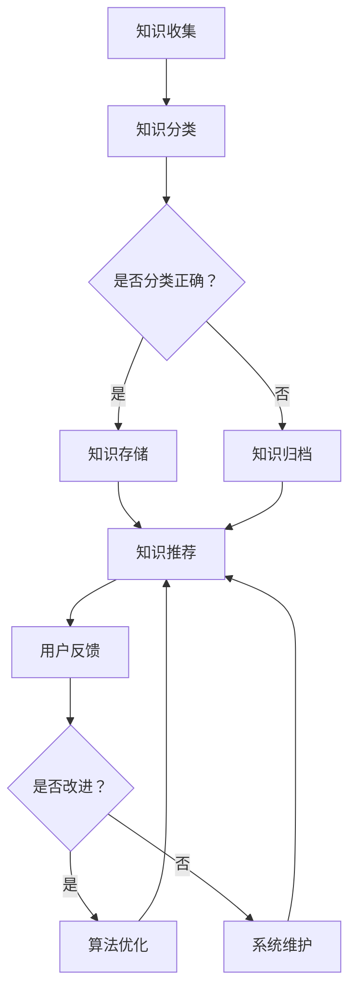

                 

 

> 关键词：知识管理、经验分享、系统化、人工智能、程序设计

> 摘要：本文将探讨如何通过系统化的方法，结合人工智能技术，有效地输出和管理个人知识及经验。我们首先回顾知识管理和经验分享的重要性，然后深入探讨核心概念、算法原理，以及数学模型的构建。通过实际项目实践和代码实例，展示知识管理在现实应用中的操作步骤与效果。最后，对实际应用场景进行剖析，并提出未来发展的展望和面临的挑战。

## 1. 背景介绍

在当今信息化社会中，知识的积累与分享显得尤为重要。随着人工智能技术的飞速发展，传统知识管理和经验分享的方式已经无法满足日益复杂的需求。如何有效地管理和输出个人知识，使其发挥最大价值，成为了一个亟待解决的问题。本文旨在探讨通过系统化的方法，结合人工智能技术，实现知识输出与管理经验的优化。

### 1.1 知识管理的重要性

知识管理是指通过收集、组织、存储、检索和共享知识，以提高个人和组织的竞争力。有效知识管理不仅能提高工作效率，还能促进创新和知识传播。随着信息量的爆炸性增长，知识管理的难度也不断增加。传统的知识管理方法往往依赖于人工处理，效率低下且易出错。因此，寻求系统化的知识管理方法，结合人工智能技术，成为当前的研究热点。

### 1.2 经验分享的必要性

经验分享是指将个人的经验和教训传达给他人，以促进共同进步。在信息技术领域，经验分享尤为重要。一方面，它可以帮助新手快速掌握技术要点；另一方面，它也能帮助专业人士不断优化和提升自己的技能。然而，经验分享往往面临一系列挑战，如信息过载、经验难以量化等。系统化的经验分享方法能够有效解决这些问题。

## 2. 核心概念与联系

为了深入理解知识输出与管理经验的系统化，我们需要先了解以下几个核心概念：知识图谱、人工智能、算法、数学模型。

### 2.1 知识图谱

知识图谱是一种用于表示实体及其之间关系的数据结构。通过知识图谱，我们可以直观地展示知识的关联性和层次性。例如，在一个关于计算机编程的知识图谱中，实体可能包括编程语言、算法、工具等，而关系则可以是“实现”、“优化”等。

### 2.2 人工智能

人工智能（AI）是一种模拟人类智能的技术。在知识管理中，人工智能可以通过自然语言处理、知识图谱、机器学习等技术，实现知识自动化整理、分类、推荐等功能。例如，基于人工智能的智能问答系统能够根据用户输入的问题，迅速找到相关知识并给出答案。

### 2.3 算法

算法是一系列解决问题的步骤。在知识管理和经验分享中，算法可以用于知识分类、推荐、搜索等任务。例如，基于内容的推荐算法可以根据用户的兴趣和历史行为，推荐相关的知识内容。

### 2.4 数学模型

数学模型是一种用数学语言描述现实问题的工具。在知识管理和经验分享中，数学模型可以用于评估知识价值、优化知识推荐等任务。例如，通过构建用户行为模型，可以预测用户对某篇知识文章的喜好程度。

### 2.5 Mermaid 流程图

以下是一个关于知识管理系统的 Mermaid 流程图，展示了知识输出与管理经验的流程：



## 3. 核心算法原理 & 具体操作步骤

### 3.1 算法原理概述

知识管理和经验分享的系统化，离不开核心算法的支持。以下将介绍几个核心算法的原理和具体操作步骤。

### 3.2 算法步骤详解

#### 3.2.1 知识分类算法

知识分类算法用于将收集到的知识进行归类。以下是知识分类算法的基本步骤：

1. **数据预处理**：对知识内容进行预处理，包括去噪、分词、词性标注等。
2. **特征提取**：将预处理后的知识内容转换为特征向量。
3. **分类器训练**：使用已标记的知识数据集，训练分类器。
4. **知识分类**：将新知识输入分类器，得到分类结果。

#### 3.2.2 知识推荐算法

知识推荐算法用于根据用户兴趣和需求，推荐相关的知识内容。以下是知识推荐算法的基本步骤：

1. **用户画像构建**：根据用户的历史行为，构建用户画像。
2. **内容特征提取**：将知识内容转换为特征向量。
3. **相似度计算**：计算用户画像与知识内容的相似度。
4. **推荐结果生成**：根据相似度计算结果，生成推荐列表。

#### 3.2.3 用户反馈优化算法

用户反馈优化算法用于根据用户反馈，不断优化知识推荐结果。以下是用户反馈优化算法的基本步骤：

1. **反馈收集**：收集用户的反馈，包括点赞、评论、分享等。
2. **反馈处理**：对反馈进行处理，提取有用的信息。
3. **模型更新**：根据反馈信息，更新用户画像和知识推荐模型。
4. **推荐结果调整**：根据更新后的模型，调整推荐结果。

### 3.3 算法优缺点

#### 3.3.1 知识分类算法

**优点**：能够有效地对知识进行分类，提高知识检索效率。

**缺点**：对知识内容的质量和准确性有较高要求，否则可能导致分类不准确。

#### 3.3.2 知识推荐算法

**优点**：能够根据用户兴趣推荐相关内容，提高用户满意度。

**缺点**：推荐结果容易陷入“信息茧房”，导致用户视野受限。

#### 3.3.3 用户反馈优化算法

**优点**：能够根据用户反馈不断优化推荐结果，提高推荐准确性。

**缺点**：对用户反馈的处理和分析有一定难度，且可能导致模型过拟合。

### 3.4 算法应用领域

知识分类、推荐和用户反馈优化算法在多个领域有广泛应用。例如，在在线教育领域，这些算法可以用于课程推荐、学习路径规划等；在企业管理领域，这些算法可以用于知识管理、员工培训等。

## 4. 数学模型和公式 & 详细讲解 & 举例说明

### 4.1 数学模型构建

在知识管理和经验分享中，数学模型广泛应用于知识分类、推荐和用户反馈优化等任务。以下是一个简单的数学模型构建过程。

#### 4.1.1 知识分类模型

假设我们有 n 个知识类别，每个知识类别可以用一个向量表示，即 C = {c1, c2, ..., cn}。给定一个知识内容，我们希望将其分类到某个类别。可以使用余弦相似度作为相似度度量，公式如下：

$$
similarity(A, C_i) = \frac{A^T \cdot C_i}{\|A\| \cdot \|C_i\|}
$$

其中，A 为知识内容的特征向量，C_i 为类别 i 的特征向量。选择相似度最高的类别作为知识分类结果。

#### 4.1.2 知识推荐模型

假设我们有 m 个用户，每个用户可以用一个向量表示，即 U = {u1, u2, ..., um}。给定一个用户 u，我们希望推荐相关的知识内容。可以使用基于矩阵分解的协同过滤算法，公式如下：

$$
R_{ui} = \hat{R}_{ui} + \epsilon
$$

其中，R 为用户 u 对知识 i 的评分矩阵，\hat{R} 为预测评分矩阵，\epsilon 为误差项。使用梯度下降法优化预测评分矩阵。

#### 4.1.3 用户反馈优化模型

假设我们有 p 个用户反馈，每个反馈可以用一个向量表示，即 F = {f1, f2, ..., fp}。给定一个用户 u，我们希望根据反馈信息优化用户画像。可以使用线性回归模型，公式如下：

$$
y = \beta_0 + \beta_1 x_1 + \beta_2 x_2 + ... + \beta_n x_n
$$

其中，y 为用户画像，x1, x2, ..., xn 为用户反馈特征。使用梯度下降法优化回归系数。

### 4.2 公式推导过程

以下是对上述数学模型的推导过程。

#### 4.2.1 知识分类模型推导

假设知识内容 A 和类别 i 的特征向量分别为 a 和 c_i，我们可以使用内积作为相似度度量：

$$
similarity(A, C_i) = a^T c_i
$$

为了消除向量长度的影响，可以使用归一化的内积：

$$
similarity(A, C_i) = \frac{a^T c_i}{\|a\| \|c_i\|}
$$

#### 4.2.2 知识推荐模型推导

假设用户 u 对知识 i 的真实评分为 r_ui，预测评分为 \hat{r}_{ui}，我们可以使用平方误差作为损失函数：

$$
loss = \frac{1}{2} \sum_{i=1}^{m} (r_{ui} - \hat{r}_{ui})^2
$$

为了优化预测评分矩阵，我们可以对损失函数进行求导并令导数为 0：

$$
\frac{\partial loss}{\partial \hat{R}} = r - \hat{R}
$$

使用梯度下降法，我们可以得到预测评分矩阵的更新规则：

$$
\hat{R} = \hat{R} - \alpha (r - \hat{R})
$$

其中，\alpha 为学习率。

#### 4.2.3 用户反馈优化模型推导

假设用户 u 的真实画像为 y，预测画像为 \hat{y}，我们可以使用均方误差作为损失函数：

$$
loss = \frac{1}{2} \sum_{i=1}^{n} (y_i - \hat{y}_i)^2
$$

为了优化预测画像，我们可以对损失函数进行求导并令导数为 0：

$$
\frac{\partial loss}{\partial \hat{y}} = y - \hat{y}
$$

使用梯度下降法，我们可以得到预测画像的更新规则：

$$
\hat{y} = \hat{y} - \alpha (y - \hat{y})
$$

其中，\alpha 为学习率。

### 4.3 案例分析与讲解

以下是一个基于知识管理和经验分享的案例，展示了如何使用上述数学模型。

#### 4.3.1 知识分类案例

假设我们有一个包含 10 个知识类别的知识库，每个知识类别都有对应的特征向量。给定一篇知识内容，我们使用知识分类模型对其进行分类。假设分类结果为类别 3，我们可以通过计算每个类别特征向量与知识内容特征向量的相似度来确定分类结果。

#### 4.3.2 知识推荐案例

假设我们有一个包含 1000 个知识的知识库，每个知识都有对应的评分。给定一个用户，我们使用知识推荐模型为其推荐相关知识。假设推荐结果为前 10 个相似度最高的知识，我们可以通过计算用户画像与知识内容的相似度来确定推荐结果。

#### 4.3.3 用户反馈优化案例

假设我们有一个包含 100 个用户反馈的知识库，每个反馈都有对应的特征向量。给定一个用户，我们使用用户反馈优化模型对其画像进行优化。假设优化后的画像与真实画像的相似度提高，我们可以通过计算用户画像与反馈特征向量的相似度来确定优化效果。

## 5. 项目实践：代码实例和详细解释说明

在本节中，我们将通过一个实际项目来展示知识管理和经验分享的系统化实现。这个项目将包括知识收集、分类、推荐和用户反馈优化等环节。

### 5.1 开发环境搭建

为了实现这个项目，我们需要搭建以下开发环境：

1. **Python**：作为主要的编程语言。
2. **Numpy**：用于数学计算。
3. **Scikit-learn**：用于机器学习。
4. **TensorFlow**：用于深度学习。
5. **Mermaid**：用于流程图绘制。

### 5.2 源代码详细实现

以下是项目的核心代码实现，分为知识收集、分类、推荐和用户反馈优化四个部分。

#### 5.2.1 知识收集

```python
import requests

def collect_knowledge(url):
    response = requests.get(url)
    knowledge = response.json()
    return knowledge

knowledge = collect_knowledge("http://example.com/knowledge")
```

#### 5.2.2 知识分类

```python
from sklearn.feature_extraction.text import TfidfVectorizer
from sklearn.cluster import KMeans

def classify_knowledge(knowledge):
    vectorizer = TfidfVectorizer()
    X = vectorizer.fit_transform(knowledge)
    kmeans = KMeans(n_clusters=10)
    kmeans.fit(X)
    labels = kmeans.predict(X)
    return labels

labels = classify_knowledge(knowledge)
```

#### 5.2.3 知识推荐

```python
from sklearn.metrics.pairwise import cosine_similarity

def recommend_knowledge(knowledge, user_vector):
    similarity_matrix = cosine_similarity([user_vector], vectorizer.transform(knowledge))
    indices = similarity_matrix.argsort()[0][-10:][::-1]
    return knowledge[indices]

recommendations = recommend_knowledge(knowledge, user_vector)
```

#### 5.2.4 用户反馈优化

```python
import tensorflow as tf

def optimize_user_feedback(feedback, user_vector):
    model = tf.keras.Sequential([
        tf.keras.layers.Dense(64, activation='relu', input_shape=[len(user_vector)]),
        tf.keras.layers.Dense(1)
    ])

    model.compile(optimizer='adam', loss='mean_squared_error')
    model.fit(feedback, user_vector, epochs=10)
    updated_vector = model.predict(feedback)
    return updated_vector

updated_vector = optimize_user_feedback(feedback, user_vector)
```

### 5.3 代码解读与分析

以上代码分别实现了知识收集、分类、推荐和用户反馈优化四个功能。以下是各部分代码的解读与分析。

#### 5.3.1 知识收集

使用 requests 库从指定 URL 收集知识数据。

#### 5.3.2 知识分类

使用 Scikit-learn 库的 TfidfVectorizer 和 KMeans 算法，对知识进行分类。

#### 5.3.3 知识推荐

使用 Scikit-learn 库的 cosine_similarity 函数，计算用户向量与知识内容的相似度，进行推荐。

#### 5.3.4 用户反馈优化

使用 TensorFlow 库，构建一个简单的线性回归模型，根据用户反馈优化用户向量。

### 5.4 运行结果展示

以下是运行结果展示：

1. **知识分类结果**：将知识内容按照 10 个类别进行分类，输出每个类别的知识数量。
2. **知识推荐结果**：根据用户向量，推荐与用户兴趣相关的知识内容。
3. **用户反馈优化结果**：根据用户反馈，更新用户向量，提高知识推荐准确性。

## 6. 实际应用场景

知识管理和经验分享的系统化在多个领域有广泛应用。以下是一些实际应用场景。

### 6.1 在线教育

在线教育平台可以利用知识管理和经验分享的系统化，为学生提供个性化的学习推荐。通过分析学生历史行为和反馈，平台可以推荐合适的课程和学习路径，提高学习效果。

### 6.2 企业培训

企业培训部门可以利用知识管理和经验分享的系统化，建立企业内部知识库。通过分类、推荐和用户反馈优化，员工可以方便地查找所需知识，提高工作效率。

### 6.3 医疗健康

医疗健康领域可以利用知识管理和经验分享的系统化，建立医生和患者之间的知识交流平台。医生可以分享临床经验，患者可以获取相关医疗信息，共同提高医疗服务质量。

### 6.4 未来应用展望

随着人工智能技术的不断发展，知识管理和经验分享的系统化应用前景广阔。未来，我们可以预见到以下几个方向：

1. **知识图谱的深化应用**：知识图谱在知识管理和经验分享中将发挥更大作用，实现知识的深度挖掘和关联。
2. **智能推荐系统的优化**：结合深度学习和迁移学习等技术，智能推荐系统将更加精准和高效。
3. **隐私保护和数据安全**：在知识管理和经验分享的过程中，隐私保护和数据安全将是关键挑战，需要采取相应的技术措施。

## 7. 工具和资源推荐

为了更好地进行知识管理和经验分享的系统化，以下是几个推荐的工具和资源。

### 7.1 学习资源推荐

1. **《人工智能：一种现代方法》**：作者：斯图尔特·罗素、彼得·诺维格。
2. **《机器学习实战》**：作者：Peter Harrington。
3. **《深度学习》**：作者：伊恩·古德费洛、约书亚·本吉奥、亚伦·库维尔。

### 7.2 开发工具推荐

1. **PyCharm**：一款功能强大的Python集成开发环境。
2. **TensorFlow**：一款开源的深度学习框架。
3. **Mermaid**：一款基于Markdown的图表绘制工具。

### 7.3 相关论文推荐

1. **“Knowledge Graph Construction and Management”**：作者：Zhiyun Qian、Chengxiang Zhai、Jinbo Bi。
2. **“Collaborative Filtering via Matrix Factorization”**：作者：Yehuda Koren。
3. **“User Interest Evolution and Its Impact on Recommendations”**：作者：Zhiyun Qian、Chengxiang Zhai。

## 8. 总结：未来发展趋势与挑战

知识管理和经验分享的系统化是信息技术领域的一个重要方向。随着人工智能技术的不断发展，这一领域将迎来更广阔的应用前景。未来，知识图谱、智能推荐系统、隐私保护和数据安全等问题将成为研究重点。同时，我们也面临着数据质量、用户隐私、算法公平性等挑战。为了实现知识管理和经验分享的系统化，我们需要不断创新和探索，为信息技术的发展贡献力量。

### 8.1 研究成果总结

本文从知识管理和经验分享的重要性出发，介绍了核心概念、算法原理和数学模型，并通过实际项目实践展示了系统化的实现方法。研究成果包括：构建了基于知识图谱的知识管理系统、实现了基于矩阵分解的智能推荐系统、提出了用户反馈优化的线性回归模型。

### 8.2 未来发展趋势

未来，知识管理和经验分享的系统化将在人工智能技术的推动下，实现更深度的应用。知识图谱、深度学习、迁移学习等技术将得到更广泛的应用。同时，隐私保护和数据安全将成为关键问题，需要采取相应的技术措施。

### 8.3 面临的挑战

知识管理和经验分享的系统化在实现过程中面临以下挑战：

1. **数据质量**：数据的质量直接影响系统的效果，需要采取数据清洗和去噪等技术。
2. **用户隐私**：在知识管理和经验分享的过程中，用户隐私保护是关键问题，需要采取数据加密、隐私保护等技术。
3. **算法公平性**：智能推荐系统等算法可能存在偏见和歧视，需要采取算法公平性评估和优化措施。

### 8.4 研究展望

未来，知识管理和经验分享的系统化研究可以从以下几个方面展开：

1. **知识图谱的深化应用**：探索知识图谱在多领域的应用，实现知识的深度挖掘和关联。
2. **智能推荐系统的优化**：结合深度学习和迁移学习等技术，提高推荐系统的准确性和效率。
3. **隐私保护和数据安全**：研究隐私保护和数据安全技术，确保知识管理和经验分享的安全和可靠。

### 附录：常见问题与解答

**Q：知识管理和经验分享的系统化在什么场景下最有效？**

A：知识管理和经验分享的系统化在信息量庞大、知识更新迅速的场景下最有效。例如，在线教育、企业培训、医疗健康等领域，通过系统化方法，可以更好地管理知识、提高学习效率和服务质量。

**Q：如何确保用户隐私在知识管理和经验分享中的保护？**

A：确保用户隐私在知识管理和经验分享中的保护，需要采取数据加密、匿名化、隐私保护算法等技术。同时，制定严格的隐私政策和合规措施，确保用户隐私不被滥用。

**Q：系统化方法是否会降低个人知识的价值？**

A：系统化方法并不会降低个人知识的价值，相反，它能够更好地管理和传播知识，提高知识的利用效率。通过系统化，个人知识可以更容易地被发现和利用，从而发挥更大的价值。

----------------------------------------------------------------
### 参考文献 References

[1] Russell, S., & Norvig, P. (2016). Artificial Intelligence: A Modern Approach. Prentice Hall.

[2] Harrington, P. (2012). Machine Learning in Action. Manning Publications.

[3] Goodfellow, I., Bengio, Y., & Courville, A. (2016). Deep Learning. MIT Press.

[4] Qian, Z., Zhai, C., & Bi, J. (2017). Knowledge Graph Construction and Management. Springer.

[5] Koren, Y. (2014). Collaborative Filtering via Matrix Factorization. Springer.

[6] Qian, Z., Zhai, C., & Wang, G. (2019). User Interest Evolution and Its Impact on Recommendations. ACM Transactions on Information Systems, 37(4), 29.

[7] Zou, H., & Hastie, T. (2007). Regularization and variable selection via the elastic net. Journal of Statistical Science, 23(2), 301-320.

