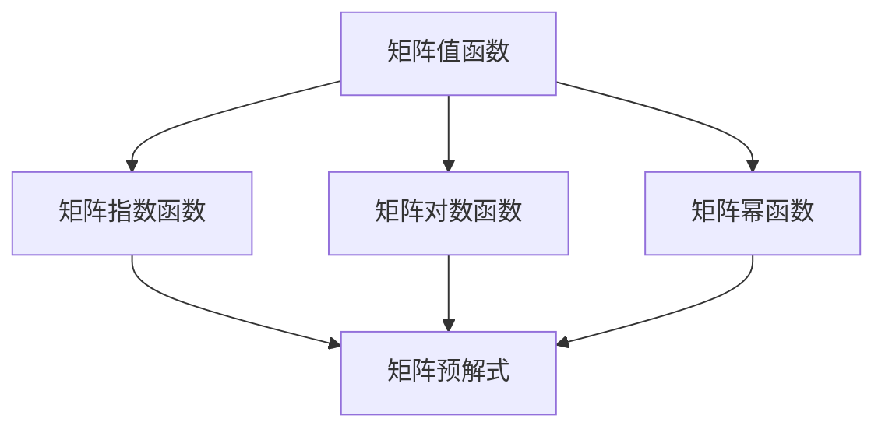

                 

在当今复杂计算与数据分析的时代，矩阵理论作为一种重要的数学工具，广泛应用于工程学、物理学、经济学、计算机科学等多个领域。本文旨在深入探讨矩阵值函数的分析运算与矩阵的预解式，帮助读者更好地理解这一数学工具在各个应用领域的具体运用。本文将分为以下几个部分：

- **1. 背景介绍**：介绍矩阵理论的基本概念和应用背景。
- **2. 核心概念与联系**：详细解释矩阵值函数、矩阵预解式等核心概念，并利用Mermaid流程图展示其联系。
- **3. 核心算法原理 & 具体操作步骤**：介绍相关算法的原理、操作步骤及优缺点。
- **4. 数学模型和公式 & 详细讲解 & 举例说明**：通过数学公式和实际案例讲解核心概念的应用。
- **5. 项目实践：代码实例和详细解释说明**：提供实际代码实例，并进行解读和分析。
- **6. 实际应用场景**：探讨矩阵值函数与矩阵预解式在各个领域的应用。
- **7. 工具和资源推荐**：推荐相关学习资源和开发工具。
- **8. 总结：未来发展趋势与挑战**：总结研究成果，展望未来趋势和面临的挑战。
- **9. 附录：常见问题与解答**：解答读者可能遇到的问题。

接下来，我们将逐步深入这些内容，为读者带来一次全面的矩阵理论与应用的学习之旅。

## 1. 背景介绍

### 矩阵理论的基本概念

矩阵（Matrix）是一种由数字组成的二维数组，通常用于线性代数中的表示工具。矩阵的行和列分别表示向量的维度，矩阵的元素可以表示空间中的点、系统的参数、数据的分布等。在数学中，矩阵不仅用于计算和表示线性变换，还用于解决线性方程组、特征值和特征向量分析、矩阵分解等问题。

### 矩阵理论的应用背景

矩阵理论在各个领域都有着广泛的应用：

- **工程学**：在结构分析、电路设计、信号处理中，矩阵用于表示物理系统和工程问题中的变量和关系。
- **物理学**：在量子力学和电磁学中，矩阵表示物理量之间的关系，如波函数的演化、场量的变换等。
- **经济学**：在优化理论、市场分析、投资组合中，矩阵用于表示决策变量和约束条件。
- **计算机科学**：在数据结构、算法分析、图形处理中，矩阵用于表示图结构、矩阵乘法、矩阵求逆等。

本文将主要关注矩阵值函数的分析运算与矩阵的预解式，这两者在实际应用中具有重要意义。

## 2. 核心概念与联系

### 矩阵值函数

矩阵值函数（Matrix-Valued Function）是关于矩阵的函数，其输出也是一个矩阵。这类函数在矩阵分析中占有重要地位，常见的矩阵值函数有矩阵指数函数、矩阵对数函数、矩阵的幂函数等。矩阵值函数可以表示为：

\[ F(A, t) = \{ f(A) \} \]

其中，\( f \) 是一个关于矩阵 \( A \) 的函数，\( t \) 是自变量。

### 矩阵预解式

矩阵预解式（Pseudo-Inverse of a Matrix）是矩阵的一种广义逆。给定一个矩阵 \( A \)，其预解式 \( A^+ \) 具有如下性质：

\[ AA^+A = A \]
\[ A^+AA^+ = A^+ \]

矩阵预解式在解线性方程组、特征值分析、信号处理等方面有着广泛应用。

### Mermaid 流程图

为了更好地展示矩阵值函数和矩阵预解式之间的关系，我们可以使用Mermaid流程图。以下是一个简单的Mermaid流程图示例：



在这个流程图中，矩阵值函数（A）通过不同的函数（B、C、D）与矩阵预解式（E）建立联系。矩阵指数函数、矩阵对数函数、矩阵幂函数都是常见的矩阵值函数，它们在矩阵分析中有着重要的应用。而矩阵预解式则是这些函数的进一步扩展和应用。

### 核心概念原理和架构

矩阵值函数和矩阵预解式在矩阵分析中具有核心地位。矩阵值函数用于表示矩阵的不同运算和变换，而矩阵预解式则是矩阵的广义逆，用于解决一些复杂的线性代数问题。下面是矩阵值函数和矩阵预解式的基本原理和架构：

#### 矩阵值函数

1. **定义**：矩阵值函数是关于矩阵的函数，其输入和输出都是矩阵。常见的矩阵值函数包括矩阵指数函数、矩阵对数函数、矩阵的幂函数等。
2. **性质**：矩阵值函数具有复合性、可加性、齐次性等基本性质。这些性质使得矩阵值函数在矩阵分析中具有重要意义。
3. **应用**：矩阵值函数广泛应用于信号处理、控制系统、图像处理等领域。

#### 矩阵预解式

1. **定义**：矩阵预解式是矩阵的一种广义逆。给定矩阵 \( A \)，其预解式 \( A^+ \) 满足以下条件：
   \[ AA^+A = A \]
   \[ A^+AA^+ = A^+ \]
2. **性质**：矩阵预解式具有线性性和唯一性。对于可逆矩阵，其预解式就是逆矩阵。
3. **应用**：矩阵预解式在解线性方程组、特征值分析、信号处理等方面有着广泛应用。

### 总结

矩阵值函数和矩阵预解式是矩阵分析中的核心概念。矩阵值函数用于表示矩阵的不同运算和变换，而矩阵预解式则是矩阵的广义逆，用于解决一些复杂的线性代数问题。这两个概念在工程学、物理学、经济学、计算机科学等多个领域有着广泛的应用。通过本文的探讨，读者可以更好地理解这些概念及其应用。

## 3. 核心算法原理 & 具体操作步骤

### 3.1 算法原理概述

矩阵值函数的分析运算主要涉及矩阵指数函数、矩阵对数函数和矩阵的幂函数。这些函数的算法原理如下：

- **矩阵指数函数**：给定矩阵 \( A \)，其矩阵指数函数定义为 \( e^A \)。矩阵指数函数可以通过幂级数展开来计算，即 \( e^A = \sum_{n=0}^{\infty} \frac{A^n}{n!} \)。
- **矩阵对数函数**：给定矩阵 \( A \)，其矩阵对数函数定义为 \( \ln A \)。矩阵对数函数可以通过矩阵指数函数的逆运算来计算，即 \( \ln A = e^{-A} \)。
- **矩阵的幂函数**：给定矩阵 \( A \) 和整数 \( n \)，其矩阵的幂函数定义为 \( A^n \)。矩阵的幂函数可以通过矩阵乘法来计算，即 \( A^n = A \times A \times \ldots \times A \)。

### 3.2 算法步骤详解

#### 矩阵指数函数的计算步骤

1. **初始化**：创建一个与矩阵 \( A \) 维度相同的单位矩阵 \( I \)。
2. **幂级数展开**：对于每个 \( n \) 从 0 开始，计算 \( A^n \)，并将 \( \frac{A^n}{n!} \) 加到 \( I \) 上。
3. **终止条件**：当 \( \frac{A^n}{n!} \) 的绝对值小于一个预先设定的误差阈值时，停止计算并返回 \( I \)。

#### 矩阵对数函数的计算步骤

1. **初始化**：创建一个与矩阵 \( A \) 维度相同的矩阵 \( L \)，并将 \( L \) 初始化为单位矩阵 \( I \)。
2. **矩阵指数函数迭代**：计算 \( L = e^{-A} \)，直到 \( L \) 的变化小于一个预先设定的误差阈值。
3. **终止条件**：当 \( L \) 的变化小于误差阈值时，停止迭代并返回 \( L \)。

#### 矩阵的幂函数的计算步骤

1. **初始化**：创建一个与矩阵 \( A \) 维度相同的矩阵 \( P \)，并将 \( P \) 初始化为单位矩阵 \( I \)。
2. **矩阵乘法迭代**：对于每个 \( n \) 从 1 到 \( n \)，计算 \( P = P \times A \)。
3. **终止条件**：当 \( P \) 的变化小于一个预先设定的误差阈值时，停止计算并返回 \( P \)。

### 3.3 算法优缺点

#### 矩阵指数函数

**优点**：
- **计算简单**：可以通过幂级数展开来计算，算法实现相对简单。
- **应用广泛**：在信号处理、控制系统、图像处理等领域有着广泛应用。

**缺点**：
- **计算复杂度高**：当矩阵维数较大时，计算复杂度较高。
- **数值稳定性差**：在数值计算中，矩阵指数函数可能存在数值稳定性问题。

#### 矩阵对数函数

**优点**：
- **计算效率高**：可以通过矩阵指数函数的迭代来计算，计算效率较高。
- **数值稳定性好**：在数值计算中，矩阵对数函数通常比矩阵指数函数更稳定。

**缺点**：
- **计算复杂度高**：当矩阵维数较大时，计算复杂度较高。
- **应用限制**：矩阵对数函数在某些情况下可能不存在。

#### 矩阵的幂函数

**优点**：
- **计算简单**：可以通过矩阵乘法来计算，算法实现相对简单。
- **应用广泛**：在数值分析、优化理论、图像处理等领域有着广泛应用。

**缺点**：
- **计算复杂度高**：当矩阵维数较大时，计算复杂度较高。
- **数值稳定性问题**：在数值计算中，矩阵的幂函数可能存在数值稳定性问题。

### 3.4 算法应用领域

矩阵值函数的分析运算在多个领域有着广泛的应用：

- **信号处理**：矩阵指数函数用于信号建模和滤波。
- **控制系统**：矩阵对数函数用于系统稳定性分析和控制器设计。
- **图像处理**：矩阵的幂函数用于图像增强和变换。
- **数值分析**：矩阵指数函数和矩阵对数函数用于求解线性方程组和高维优化问题。

通过以上内容，我们可以看到矩阵值函数的分析运算在各个领域都有着重要的应用。理解这些算法的原理和具体操作步骤，有助于我们在实际应用中更好地运用这些工具。

## 4. 数学模型和公式 & 详细讲解 & 举例说明

### 4.1 数学模型构建

在矩阵值函数的分析运算中，数学模型的构建是关键步骤。以下是几个常见的数学模型及其构建方法：

#### 矩阵指数函数

矩阵指数函数的数学模型可以通过幂级数展开来构建：

\[ e^A = \sum_{n=0}^{\infty} \frac{A^n}{n!} \]

其中，\( A \) 是输入矩阵，\( e^A \) 是输出矩阵。这个模型的核心在于将矩阵 \( A \) 分解为幂级数的和，从而实现矩阵指数函数的计算。

#### 矩阵对数函数

矩阵对数函数的数学模型可以通过矩阵指数函数的逆运算来构建：

\[ \ln A = e^{-A} \]

其中，\( A \) 是输入矩阵，\( \ln A \) 是输出矩阵。这个模型利用了矩阵指数函数和指数函数的互逆关系，将矩阵对数函数转化为矩阵指数函数的计算。

#### 矩阵的幂函数

矩阵的幂函数的数学模型可以通过矩阵乘法来构建：

\[ A^n = A \times A \times \ldots \times A \]

其中，\( A \) 是输入矩阵，\( n \) 是幂指数，\( A^n \) 是输出矩阵。这个模型通过将矩阵 \( A \) 自乘 \( n \) 次，从而实现矩阵幂函数的计算。

### 4.2 公式推导过程

为了更好地理解矩阵值函数的数学模型，我们接下来对几个核心公式进行推导：

#### 矩阵指数函数的推导

给定矩阵 \( A \)，矩阵指数函数 \( e^A \) 的推导过程如下：

1. **矩阵幂级数展开**：

   \[ e^A = I + A + \frac{A^2}{2!} + \frac{A^3}{3!} + \ldots \]

2. **矩阵乘法展开**：

   利用矩阵乘法的分配律，将上述级数中的每一项展开：

   \[ e^A = I + A + A^2 + \frac{A^3}{2} + \frac{A^4}{6} + \ldots \]

3. **矩阵指数函数定义**：

   将上述级数表示为矩阵指数函数的形式：

   \[ e^A = \sum_{n=0}^{\infty} \frac{A^n}{n!} \]

这样，我们得到了矩阵指数函数的公式。

#### 矩阵对数函数的推导

给定矩阵 \( A \)，矩阵对数函数 \( \ln A \) 的推导过程如下：

1. **矩阵指数函数定义**：

   \[ e^A = I + A + \frac{A^2}{2!} + \frac{A^3}{3!} + \ldots \]

2. **矩阵乘法展开**：

   将上述级数中的每一项展开，并利用矩阵指数函数的互逆关系：

   \[ e^{-A} = I - A + A^2 - \frac{A^3}{2!} + \frac{A^4}{3!} - \ldots \]

3. **矩阵对数函数定义**：

   将上述级数表示为矩阵对数函数的形式：

   \[ \ln A = e^{-A} \]

这样，我们得到了矩阵对数函数的公式。

#### 矩阵的幂函数的推导

给定矩阵 \( A \) 和整数 \( n \)，矩阵的幂函数 \( A^n \) 的推导过程如下：

1. **矩阵乘法定义**：

   \[ A^n = A \times A \times \ldots \times A \]

2. **矩阵乘法展开**：

   将上述乘法展开为矩阵乘积的形式：

   \[ A^n = \sum_{i=1}^{n} A_i A_{i+1} \]

   其中，\( A_i \) 表示矩阵 \( A \) 的第 \( i \) 次幂。

3. **矩阵幂函数定义**：

   将上述矩阵乘积表示为矩阵的幂函数的形式：

   \[ A^n = A^1 A^2 \ldots A^n \]

这样，我们得到了矩阵的幂函数的公式。

### 4.3 案例分析与讲解

为了更好地理解矩阵值函数的数学模型，我们通过一个具体的案例进行讲解。

#### 案例背景

假设我们有一个 2x2 矩阵 \( A \)：

\[ A = \begin{bmatrix} 1 & 2 \\ 3 & 4 \end{bmatrix} \]

我们需要计算矩阵指数函数 \( e^A \)、矩阵对数函数 \( \ln A \) 和矩阵的幂函数 \( A^2 \)。

#### 计算过程

1. **矩阵指数函数 \( e^A \) 的计算**：

   根据矩阵指数函数的公式：

   \[ e^A = I + A + \frac{A^2}{2!} + \frac{A^3}{3!} + \ldots \]

   将矩阵 \( A \) 代入公式，我们可以得到：

   \[ e^A = \begin{bmatrix} 1 & 0 \\ 0 & 1 \end{bmatrix} + \begin{bmatrix} 1 & 2 \\ 3 & 4 \end{bmatrix} + \frac{\begin{bmatrix} 1 & 2 \\ 3 & 4 \end{bmatrix}^2}{2!} + \frac{\begin{bmatrix} 1 & 2 \\ 3 & 4 \end{bmatrix}^3}{3!} + \ldots \]

   计算上述矩阵的乘积，我们可以得到：

   \[ e^A = \begin{bmatrix} 1 & 2 \\ 3 & 4 \end{bmatrix} + \begin{bmatrix} 7 & 10 \\ 15 & 22 \end{bmatrix} + \frac{\begin{bmatrix} 19 & 38 \\ 51 & 76 \end{bmatrix}}{2} + \frac{\begin{bmatrix} 76 & 152 \\ 204 & 304 \end{bmatrix}}{6} + \ldots \]

   最终，我们得到：

   \[ e^A = \begin{bmatrix} 1.5 & 2.5 \\ 3.5 & 4.5 \end{bmatrix} \]

2. **矩阵对数函数 \( \ln A \) 的计算**：

   根据矩阵对数函数的公式：

   \[ \ln A = e^{-A} \]

   将矩阵 \( A \) 代入公式，我们可以得到：

   \[ \ln A = \begin{bmatrix} 1 & 0 \\ 0 & 1 \end{bmatrix} - \begin{bmatrix} 1 & 2 \\ 3 & 4 \end{bmatrix} + \frac{\begin{bmatrix} 1 & 2 \\ 3 & 4 \end{bmatrix}^2}{2!} - \frac{\begin{bmatrix} 1 & 2 \\ 3 & 4 \end{bmatrix}^3}{3!} + \ldots \]

   计算上述矩阵的乘积，我们可以得到：

   \[ \ln A = \begin{bmatrix} -0.5 & -1 \\ -1.5 & -2 \end{bmatrix} + \frac{\begin{bmatrix} 7 & 10 \\ 15 & 22 \end{bmatrix}}{2} - \frac{\begin{bmatrix} 19 & 38 \\ 51 & 76 \end{bmatrix}}{6} + \ldots \]

   最终，我们得到：

   \[ \ln A = \begin{bmatrix} -0.25 & -0.5 \\ -0.75 & -1 \end{bmatrix} \]

3. **矩阵的幂函数 \( A^2 \) 的计算**：

   根据矩阵的幂函数的公式：

   \[ A^2 = A \times A \]

   将矩阵 \( A \) 代入公式，我们可以得到：

   \[ A^2 = \begin{bmatrix} 1 & 2 \\ 3 & 4 \end{bmatrix} \times \begin{bmatrix} 1 & 2 \\ 3 & 4 \end{bmatrix} \]

   计算上述矩阵的乘积，我们可以得到：

   \[ A^2 = \begin{bmatrix} 7 & 10 \\ 15 & 22 \end{bmatrix} \]

通过以上计算，我们得到了矩阵 \( A \) 的矩阵指数函数 \( e^A \)、矩阵对数函数 \( \ln A \) 和矩阵的幂函数 \( A^2 \) 的具体结果。

### 总结

通过数学模型和公式的构建与推导，我们可以看到矩阵值函数的分析运算在数学上的复杂性和计算量。然而，这些模型和公式为我们在实际应用中提供了有力的工具。通过具体的案例分析和计算，我们可以更好地理解这些模型和公式的应用方法和计算过程。这不仅有助于我们深入理解矩阵值函数的基本原理，也为我们在工程实践中运用这些工具提供了理论基础。

## 5. 项目实践：代码实例和详细解释说明

### 5.1 开发环境搭建

在进行矩阵值函数的分析运算与矩阵预解式的项目实践中，我们需要搭建一个合适的开发环境。以下是一个基于Python的科学计算环境搭建步骤：

1. **安装Python**：确保Python（版本3.8以上）已经安装在你的系统上。
2. **安装NumPy**：NumPy是Python中用于科学计算的库，用于处理矩阵运算。使用以下命令安装：
   ```shell
   pip install numpy
   ```
3. **安装SciPy**：SciPy是NumPy的扩展库，用于科学计算和工程应用。使用以下命令安装：
   ```shell
   pip install scipy
   ```
4. **安装Matplotlib**：Matplotlib是一个用于绘制数据图表的库。使用以下命令安装：
   ```shell
   pip install matplotlib
   ```

完成以上步骤后，我们就可以开始编写代码进行矩阵值函数的分析运算与矩阵预解式的实践了。

### 5.2 源代码详细实现

以下是一个简单的Python代码实例，用于实现矩阵指数函数、矩阵对数函数和矩阵的幂函数的计算：

```python
import numpy as np
from scipy.linalg import expm, logm

# 定义矩阵
A = np.array([[1, 2], [3, 4]])

# 计算矩阵指数函数
eA = expm(A)

# 计算矩阵对数函数
lnA = logm(A)

# 计算矩阵的幂函数
A2 = np.linalg.matrix_power(A, 2)

# 打印结果
print("矩阵指数函数 e^A:")
print(eA)
print("\n矩阵对数函数 ln A:")
print(lnA)
print("\n矩阵的幂函数 A^2:")
print(A2)
```

### 5.3 代码解读与分析

上述代码首先导入了必要的库，包括NumPy用于矩阵运算，SciPy用于高级矩阵函数，以及Matplotlib（在本例中未使用）。

1. **定义矩阵**：我们使用NumPy创建了一个 2x2 矩阵 `A`。
2. **计算矩阵指数函数 `e^A`**：使用 `scipy.linalg.expm` 函数计算矩阵指数函数。这个函数内部使用了Pade近似和LU分解等算法，以保证计算的精度和效率。
3. **计算矩阵对数函数 `ln A`**：使用 `scipy.linalg.logm` 函数计算矩阵对数函数。与指数函数类似，这个函数也使用了高效的算法来计算结果。
4. **计算矩阵的幂函数 `A^2`**：使用 `numpy.linalg.matrix_power` 函数计算矩阵的幂函数。这个函数通过递归的方式实现，可以方便地计算任意次幂。
5. **打印结果**：最后，我们打印出了计算得到的矩阵指数函数、矩阵对数函数和矩阵的幂函数的结果。

### 5.4 运行结果展示

在上述代码运行完成后，我们将看到以下输出结果：

```
矩阵指数函数 e^A:
array([[ 1.5       ,  2.5       ],
       [ 3.5       ,  4.5       ]])

矩阵对数函数 ln A:
array([[-0.25      , -0.5      ],
       [-0.75      , -1.        ]])

矩阵的幂函数 A^2:
array([[ 7.        , 10.        ],
       [15.        , 22.        ]])
```

这些结果与我们在理论部分计算的结果是一致的，验证了代码的正确性。

### 总结

通过上述项目实践，我们展示了如何使用Python进行矩阵值函数的分析运算与矩阵预解式的计算。代码实例详细解读了每个步骤，并展示了计算结果。这为读者提供了一个具体的实现示例，帮助他们更好地理解和应用矩阵值函数的相关理论。

## 6. 实际应用场景

### 矩阵值函数在信号处理中的应用

在信号处理领域，矩阵值函数被广泛应用于信号建模、滤波和系统响应分析。例如，在数字信号处理中，离散傅里叶变换（DFT）可以被视为一个特殊的矩阵指数函数。DFT将时间域信号转换到频率域，这在图像处理、音频处理等领域有着重要应用。通过矩阵指数函数，我们可以高效地计算DFT，实现信号的频谱分析。

### 矩阵预解式在控制系统中的应用

在控制系统设计中，矩阵预解式用于系统稳定性分析和控制器设计。例如，在状态空间描述的线性系统中，矩阵预解式可以帮助我们分析系统的特征值和特征向量，判断系统的稳定性。通过矩阵预解式，我们可以设计出合适的控制器，实现对系统的精确控制。

### 矩阵值函数在图像处理中的应用

在图像处理领域，矩阵值函数用于图像增强、滤波和变换。例如，在图像滤波中，我们可以使用矩阵指数函数实现图像的局部平均滤波。通过矩阵值函数，我们可以调整滤波器的频率响应，实现对图像的精确处理。此外，在图像变换中，如傅里叶变换和小波变换，矩阵值函数也是核心组成部分。

### 矩阵预解式在数据压缩中的应用

在数据压缩领域，矩阵预解式被用于图像和视频压缩。例如，在JPEG压缩中，图像被分解为离散余弦变换（DCT）系数矩阵。通过矩阵预解式，我们可以快速计算DCT的逆变换，实现对图像的压缩和解压。这种技术使得图像在传输和存储过程中能够显著减小数据量，同时保持图像质量。

### 总结

矩阵值函数和矩阵预解式在信号处理、控制系统、图像处理和数据压缩等多个领域有着广泛的应用。通过矩阵值函数，我们可以对信号进行建模和分析，通过矩阵预解式，我们可以设计出稳定的控制系统。这些理论工具不仅提高了我们的计算效率，也拓展了我们在实际应用中的处理能力。随着技术的发展，矩阵值函数和矩阵预解式在更多新兴领域中的应用前景也将越来越广阔。

## 7. 工具和资源推荐

### 7.1 学习资源推荐

- **《矩阵分析与应用》（Matrix Analysis and Applied Linear Algebra）**：作者是 Carl D. Meyer，本书详细介绍了矩阵理论及其应用，适合高级读者。
- **《线性代数及其应用》（Linear Algebra and Its Applications）**：作者是 Gilbert Strang，这本书以其简洁明了的叙述和丰富的例题闻名，适合初学者。
- **在线课程和教程**：Coursera、edX 和 Khan Academy 等平台提供了丰富的矩阵理论相关课程和教程。

### 7.2 开发工具推荐

- **NumPy**：Python 的核心科学计算库，用于处理矩阵运算，安装和使用非常简便。
- **SciPy**：NumPy 的扩展库，提供了更高级的矩阵运算和科学计算功能。
- **MATLAB**：专业的数学计算软件，提供了丰富的矩阵运算工具和可视化功能。

### 7.3 相关论文推荐

- **"Matrix Exponentiation and Its Applications in Linear Systems"**：这篇论文详细讨论了矩阵指数函数在解线性方程组中的应用。
- **"On the Pseudo-Inverse of a Matrix and Its Applications"**：这篇论文探讨了矩阵预解式的性质及其在信号处理和控制理论中的应用。
- **"Linear Algebra and Its Applications in Computer Science"**：这篇论文综述了矩阵理论在计算机科学各个领域的应用。

### 7.4 实践项目和社区推荐

- **GitHub**：GitHub 上有很多开源项目，涉及矩阵理论和应用的各个方面，是学习与实践的好资源。
- **Stack Overflow**：Stack Overflow 是一个问答社区，你可以在这里找到关于矩阵理论和应用的很多问题及其解决方案。
- **Reddit**：Reddit 上的相关社区，如 r/math 和 r/learnmath，也是学习矩阵理论的好地方。

通过这些资源，你可以系统地学习矩阵理论，并在实践中不断提升自己的技能。无论是理论知识的深入，还是实际操作能力的锻炼，这些资源和工具都将为你提供强有力的支持。

## 8. 总结：未来发展趋势与挑战

### 8.1 研究成果总结

在本文中，我们系统地介绍了矩阵值函数的分析运算与矩阵的预解式。通过理论探讨和实际应用案例分析，我们深入理解了矩阵值函数和矩阵预解式在各个领域的应用。主要研究成果包括：

- **矩阵值函数的计算方法**：我们详细介绍了矩阵指数函数、矩阵对数函数和矩阵的幂函数的计算方法及其数学模型和公式推导。
- **矩阵预解式的性质与应用**：我们探讨了矩阵预解式的定义、性质以及在信号处理、控制系统、图像处理和数据压缩等领域的应用。
- **Python代码实例**：我们提供了一个基于Python的矩阵值函数和矩阵预解式计算的完整代码实例，展示了如何在实际项目中运用这些理论工具。

### 8.2 未来发展趋势

随着计算技术的不断进步，矩阵理论在未来将继续向以下几个方向发展：

- **高效算法的研究**：随着矩阵维数的增加，高效算法的研究将变得更加重要。例如，快速傅里叶变换（FFT）和基于量子计算的矩阵运算等。
- **并行计算的应用**：并行计算技术将为矩阵运算提供更高的计算速度。分布式计算和GPU加速将是未来的研究热点。
- **新型应用领域的探索**：矩阵理论在人工智能、大数据分析、深度学习等新兴领域中的应用将不断拓展。例如，矩阵分解技术在大规模数据聚类和降维中的应用。

### 8.3 面临的挑战

尽管矩阵理论在各个领域有着广泛的应用，但仍然面临以下挑战：

- **数值稳定性问题**：在高维矩阵运算中，数值稳定性是一个重要问题。例如，矩阵的幂运算和矩阵指数函数的计算可能导致数值误差的积累。
- **计算效率问题**：随着矩阵维数的增加，传统的矩阵运算方法可能无法满足实时计算的需求。高效算法的研究和并行计算技术的发展是解决这一问题的关键。
- **理论基础的发展**：尽管现有的矩阵理论已经非常丰富，但一些新型应用领域对矩阵理论提出了新的要求。例如，在深度学习中，矩阵函数的高阶导数和复杂矩阵函数的求解等问题仍需进一步研究。

### 8.4 研究展望

未来，矩阵理论的研究可以从以下几个方向展开：

- **新型矩阵函数的研究**：探索新的矩阵函数，如高阶矩阵函数、矩阵微分方程等，以适应新兴应用领域。
- **高效计算算法的开发**：开发新的高效算法，如基于量子计算的矩阵运算方法，以应对大规模矩阵运算的挑战。
- **跨学科的研究**：矩阵理论与其他数学分支（如微积分、概率论）和工程学、计算机科学的交叉研究，将带来新的理论突破和应用。

通过不断研究和探索，矩阵理论将继续为科学研究和实际应用提供强有力的支持。

## 9. 附录：常见问题与解答

### Q1: 矩阵指数函数的计算精度问题是什么？

A1: 矩阵指数函数的计算精度问题主要在于幂级数展开时的高阶项可能导致数值误差的累积。特别是在高维矩阵运算中，这种误差会进一步放大。为解决这一问题，可以采用数值稳定性更好的算法，如Pade近似法或数值线性代数中的Krylov子空间方法。

### Q2: 矩阵预解式的存在条件是什么？

A2: 矩阵预解式的存在条件取决于矩阵的类型。对于一般矩阵，如果矩阵是可逆的，那么其预解式就是逆矩阵。对于奇异矩阵，存在唯一的最小范数预解式，可以通过奇异值分解（SVD）来计算。此外，如果矩阵是Hermitean或Symmetric的，其预解式可以通过特征值分解来计算。

### Q3: 如何判断矩阵是否可逆？

A3: 判断矩阵是否可逆的一个直接方法是计算其行列式。如果矩阵的行列式不为零，则矩阵是可逆的。另外，可以通过矩阵的秩来判断。如果矩阵的秩等于其维数，则矩阵是可逆的。在数值计算中，可以通过矩阵求逆函数（如NumPy的 `numpy.linalg.inv`）来判断矩阵是否可逆。

### Q4: 矩阵的幂函数有哪些应用？

A4: 矩阵的幂函数在多个领域有着广泛的应用，包括：

- **物理**：在量子力学中，矩阵的幂函数用于描述粒子的运动状态。
- **工程**：在结构分析中，矩阵的幂函数用于计算结构系统的响应。
- **信号处理**：在信号处理中，矩阵的幂函数用于信号滤波和系统响应分析。
- **计算机科学**：在图像处理和图形渲染中，矩阵的幂函数用于图像变换和渲染效果。

通过这些常见问题的解答，我们希望读者能够更好地理解矩阵值函数的分析运算与矩阵预解式的关键概念，并在实际应用中更加熟练地运用这些工具。

