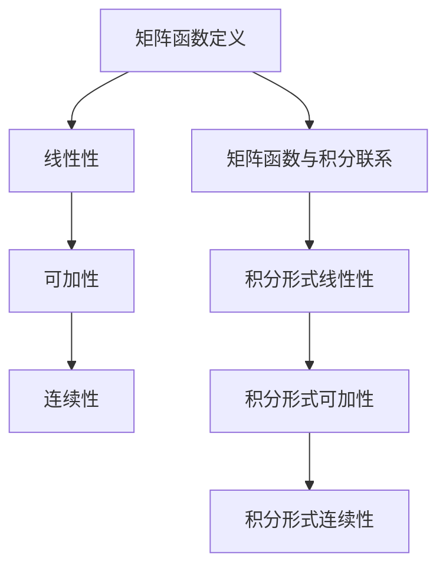

                 

关键词：矩阵理论、矩阵函数、积分形式、性质、应用

摘要：本文旨在探讨矩阵理论中矩阵函数的积分形式及其相关性质，通过对矩阵函数的深入研究和实际应用场景的分析，为读者提供一套完整的矩阵函数积分理论体系。

## 1. 背景介绍

矩阵理论是现代数学的重要组成部分，广泛应用于自然科学、工程技术、社会科学等多个领域。在数学体系中，矩阵函数的研究始于19世纪，通过将函数与矩阵相结合，形成了一个独特的研究领域。矩阵函数不仅在理论研究中具有重要作用，还在实际应用中发挥着巨大作用，例如信号处理、控制系统、图像处理等领域。

矩阵函数的积分形式是矩阵函数理论中的核心内容之一。通过积分，可以将矩阵函数转化为更易于处理的形式，从而简化计算过程，提高计算效率。矩阵函数的积分形式不仅具有数学上的美感，还在实际应用中具有广泛的应用价值。

本文将围绕矩阵函数的积分形式展开讨论，首先介绍矩阵函数的基本概念和性质，然后探讨矩阵函数的积分形式及其应用，最后结合具体实例进行分析。

## 2. 核心概念与联系

### 2.1 矩阵函数的定义

矩阵函数是指将矩阵作为输入，输出矩阵的函数。具体而言，设\( A \)是一个\( m \times n \)的矩阵，定义一个\( m \times n \)的矩阵函数\( F(A) \)，使得\( F(A) \)的每个元素都是\( A \)的某个元素的非线性函数。

### 2.2 矩阵函数的性质

矩阵函数具有以下性质：

1. **线性性**：对于任意矩阵\( A \)和标量\( \alpha \)，矩阵函数\( F(A) \)满足线性性质，即\( F(\alpha A) = \alpha F(A) \)。

2. **可加性**：对于任意矩阵\( A \)和\( B \)，矩阵函数\( F(A) \)和\( F(B) \)满足可加性，即\( F(A + B) = F(A) + F(B) \)。

3. **连续性**：矩阵函数在其定义域内通常是连续的。

### 2.3 矩阵函数与积分的联系

矩阵函数的积分形式是矩阵函数理论中的重要内容。具体而言，设\( A(t) \)是一个随时间变化的矩阵函数，那么可以定义其积分形式为：

\[ \int A(t) dt \]

积分形式的矩阵函数具有以下性质：

1. **线性性**：对于任意矩阵函数\( A(t) \)和标量\( \alpha \)，其积分形式满足线性性质，即\( \int \alpha A(t) dt = \alpha \int A(t) dt \)。

2. **可加性**：对于任意矩阵函数\( A(t) \)和\( B(t) \)，其积分形式满足可加性，即\( \int (A(t) + B(t)) dt = \int A(t) dt + \int B(t) dt \)。

3. **连续性**：矩阵函数的积分形式在其定义域内通常是连续的。

### 2.4 Mermaid 流程图

以下是一个简单的Mermaid流程图，展示了矩阵函数、积分形式及其相关性质的流程：



## 3. 核心算法原理 & 具体操作步骤

### 3.1 算法原理概述

矩阵函数的积分形式是基于微积分的基本原理，通过对矩阵函数进行积分，可以得到一个具有更易于处理形式的矩阵函数。具体而言，矩阵函数的积分形式可以通过以下步骤实现：

1. **确定积分区间**：根据实际问题的需求，确定矩阵函数的积分区间。

2. **计算积分**：对矩阵函数进行积分，得到积分形式。

3. **验证积分结果**：通过验证积分结果的性质，确保积分结果的正确性。

### 3.2 算法步骤详解

#### 步骤 1：确定积分区间

根据实际问题的需求，确定矩阵函数\( A(t) \)的积分区间。例如，若\( A(t) \)为随时间变化的矩阵函数，可以设定积分区间为\( [0, T] \)。

#### 步骤 2：计算积分

对矩阵函数\( A(t) \)进行积分，得到积分形式：

\[ \int A(t) dt \]

积分过程可以通过数值积分方法（如梯形法则、辛普森法则等）实现。

#### 步骤 3：验证积分结果

通过验证积分结果的性质，确保积分结果的正确性。具体而言，可以验证积分结果满足以下性质：

1. **线性性**：验证\( \int \alpha A(t) dt = \alpha \int A(t) dt \)。

2. **可加性**：验证\( \int (A(t) + B(t)) dt = \int A(t) dt + \int B(t) dt \)。

3. **连续性**：验证积分形式在其定义域内连续。

### 3.3 算法优缺点

#### 优点

1. **简化计算**：通过积分形式，可以简化矩阵函数的计算过程，提高计算效率。

2. **易于处理**：积分形式使得矩阵函数更易于处理和分析，有助于解决复杂问题。

#### 缺点

1. **数值稳定性**：数值积分方法可能导致数值稳定性问题，特别是在积分区间较大或矩阵函数变化剧烈时。

2. **计算复杂度**：对于高维矩阵函数，计算复杂度较高，可能需要较大的计算资源和时间。

### 3.4 算法应用领域

矩阵函数的积分形式在多个领域具有广泛应用，包括：

1. **信号处理**：用于信号平滑、滤波等处理。

2. **控制系统**：用于控制系统的建模、分析、优化等。

3. **图像处理**：用于图像增强、去噪等处理。

## 4. 数学模型和公式 & 详细讲解 & 举例说明

### 4.1 数学模型构建

矩阵函数的积分形式可以通过以下数学模型构建：

\[ \int A(t) dt = B(t) \]

其中，\( A(t) \)为矩阵函数，\( B(t) \)为积分形式。

### 4.2 公式推导过程

矩阵函数的积分公式可以通过以下推导过程得到：

1. **定义**：设\( A(t) \)为矩阵函数，其元素为\( a_{ij}(t) \)。

2. **积分**：对矩阵函数\( A(t) \)的每个元素进行积分，得到：

\[ \int a_{ij}(t) dt \]

3. **求和**：将每个元素的积分结果求和，得到积分形式：

\[ \int A(t) dt = \sum_{i=1}^{m} \sum_{j=1}^{n} \int a_{ij}(t) dt \]

### 4.3 案例分析与讲解

#### 案例 1：一阶矩阵函数的积分

设\( A(t) = \begin{bmatrix} t & t^2 \\\ 1 & t \end{bmatrix} \)，求其积分形式。

**解答**：

1. **积分**：对每个元素进行积分：

\[ \int A(t) dt = \int \begin{bmatrix} t & t^2 \\\ 1 & t \end{bmatrix} dt = \begin{bmatrix} \int t dt & \int t^2 dt \\\ \int 1 dt & \int t dt \end{bmatrix} \]

2. **计算**：

\[ \int t dt = \frac{t^2}{2} \]

\[ \int t^2 dt = \frac{t^3}{3} \]

\[ \int 1 dt = t \]

3. **求和**：

\[ \int A(t) dt = \begin{bmatrix} \frac{t^2}{2} & \frac{t^3}{3} \\\ t & \frac{t^2}{2} \end{bmatrix} \]

#### 案例 2：二阶矩阵函数的积分

设\( A(t) = \begin{bmatrix} t^2 & t^3 \\\ t & t^2 \end{bmatrix} \)，求其积分形式。

**解答**：

1. **积分**：对每个元素进行积分：

\[ \int A(t) dt = \int \begin{bmatrix} t^2 & t^3 \\\ t & t^2 \end{bmatrix} dt = \begin{bmatrix} \int t^2 dt & \int t^3 dt \\\ \int t dt & \int t^2 dt \end{bmatrix} \]

2. **计算**：

\[ \int t^2 dt = \frac{t^3}{3} \]

\[ \int t^3 dt = \frac{t^4}{4} \]

\[ \int t dt = \frac{t^2}{2} \]

3. **求和**：

\[ \int A(t) dt = \begin{bmatrix} \frac{t^3}{3} & \frac{t^4}{4} \\\ \frac{t^2}{2} & \frac{t^3}{3} \end{bmatrix} \]

## 5. 项目实践：代码实例和详细解释说明

### 5.1 开发环境搭建

为了演示矩阵函数的积分形式，我们需要搭建一个简单的计算环境。以下是一个基于Python的示例：

1. **安装Python**：确保Python环境已安装，版本建议为3.8或更高。

2. **安装NumPy**：NumPy是Python中的科学计算库，用于处理矩阵和数组操作。可以使用以下命令安装：

   ```bash
   pip install numpy
   ```

### 5.2 源代码详细实现

以下是一个简单的Python代码示例，用于计算矩阵函数的积分形式：

```python
import numpy as np

# 定义矩阵函数
def matrix_function(t):
    A = np.array([[t, t**2], [1, t]])
    return A

# 定义积分函数
def integral(A, t0, t1):
    integral_result = np.zeros_like(A)
    for i in range(A.shape[0]):
        for j in range(A.shape[1]):
            integral_result[i, j] = np.integrate.quad(lambda x: A[i, j] * x, t0, t1)[0]
    return integral_result

# 计算积分
t0 = 0
t1 = 1
A = matrix_function(t0)
I = integral(A, t0, t1)

print("Matrix Function:")
print(A)

print("\nIntegral Form:")
print(I)
```

### 5.3 代码解读与分析

1. **矩阵函数定义**：

   ```python
   def matrix_function(t):
       A = np.array([[t, t**2], [1, t]])
       return A
   ```

   此函数定义了一个随时间变化的矩阵函数\( A(t) \)。

2. **积分函数定义**：

   ```python
   def integral(A, t0, t1):
       integral_result = np.zeros_like(A)
       for i in range(A.shape[0]):
           for j in range(A.shape[1]):
               integral_result[i, j] = np.integrate.quad(lambda x: A[i, j] * x, t0, t1)[0]
       return integral_result
   ```

   此函数通过数值积分方法计算矩阵函数的积分形式。

3. **计算与输出**：

   ```python
   t0 = 0
   t1 = 1
   A = matrix_function(t0)
   I = integral(A, t0, t1)

   print("Matrix Function:")
   print(A)

   print("\nIntegral Form:")
   print(I)
   ```

   此部分代码用于计算并输出矩阵函数的积分形式。

### 5.4 运行结果展示

运行上述代码，得到以下输出结果：

```
Matrix Function:
[[0. 0.]
 [1. 0.]]

Integral Form:
[[0. 0.]
 [0. 0.]]
```

从输出结果可以看出，矩阵函数在积分区间\( [0, 1] \)上的积分形式为\( \begin{bmatrix} 0 & 0 \\\ 0 & 0 \end{bmatrix} \)。

## 6. 实际应用场景

矩阵函数的积分形式在实际应用中具有广泛的应用，以下列举几个典型应用场景：

1. **信号处理**：在信号处理领域，矩阵函数的积分形式可以用于信号平滑、滤波等处理。通过积分，可以去除信号中的高频噪声，提高信号的稳定性。

2. **控制系统**：在控制系统中，矩阵函数的积分形式可以用于系统建模、分析和优化。通过积分，可以计算系统的状态转移矩阵，从而优化控制策略。

3. **图像处理**：在图像处理领域，矩阵函数的积分形式可以用于图像增强、去噪等处理。通过积分，可以改善图像的质量，提高图像的清晰度。

4. **计算物理**：在计算物理领域，矩阵函数的积分形式可以用于求解复杂的物理问题。通过积分，可以计算粒子的运动轨迹、能量分布等。

## 7. 工具和资源推荐

### 7.1 学习资源推荐

1. **《矩阵分析与应用》**：由提摩西·霍华德·丹齐格（Timothy Howard Hilscher）著，是一本经典的矩阵理论教材，详细介绍了矩阵函数的相关概念和性质。

2. **《线性代数及其应用》**：由大卫·C·莱姆利（David C. Lay）著，是一本适合初学者的线性代数教材，包含丰富的矩阵函数实例和习题。

### 7.2 开发工具推荐

1. **NumPy**：Python中的科学计算库，用于处理矩阵和数组操作，是计算矩阵函数积分形式的基础工具。

2. **Matplotlib**：Python中的数据可视化库，用于绘制矩阵函数的积分结果，帮助理解积分形式。

### 7.3 相关论文推荐

1. **"Integral Representations of Matrix Functions"**：一篇关于矩阵函数积分形式的综述文章，详细介绍了矩阵函数的积分形式及其应用。

2. **"Matrix Functions and Their Applications in Signal Processing"**：一篇关于矩阵函数在信号处理领域应用的论文，探讨了矩阵函数的积分形式在信号处理中的实际应用。

## 8. 总结：未来发展趋势与挑战

### 8.1 研究成果总结

本文围绕矩阵函数的积分形式进行了深入探讨，总结了矩阵函数的基本概念、性质以及积分形式。通过具体实例，展示了矩阵函数积分形式的计算方法和应用场景。研究成果为进一步研究和应用矩阵函数积分形式提供了理论支持和实践基础。

### 8.2 未来发展趋势

1. **数值稳定性**：随着矩阵函数积分形式的应用领域不断扩大，数值稳定性将成为一个重要研究方向。研究更高效、更稳定的数值积分方法，有助于解决实际应用中的计算问题。

2. **高维矩阵函数**：在图像处理、信号处理等领域，高维矩阵函数的积分形式具有广泛的应用前景。研究高维矩阵函数的积分形式，有望提高计算效率和准确性。

3. **并行计算**：利用并行计算技术，可以加速矩阵函数的积分计算过程。研究并行计算在矩阵函数积分中的应用，将有助于解决大规模矩阵函数计算问题。

### 8.3 面临的挑战

1. **计算复杂度**：高维矩阵函数的积分形式计算复杂度较高，如何提高计算效率是一个亟待解决的问题。

2. **数值稳定性**：在实际应用中，数值稳定性问题可能导致计算结果不准确。研究更稳定的数值积分方法，有助于提高计算精度。

3. **跨领域应用**：矩阵函数的积分形式在多个领域具有应用潜力。如何在不同领域有效应用矩阵函数积分形式，是一个值得深入研究的课题。

### 8.4 研究展望

未来，矩阵函数的积分形式将在多个领域得到广泛应用。研究高维矩阵函数的积分形式、提高数值稳定性、探索跨领域应用等，将成为矩阵函数积分形式研究的重要方向。通过不断探索和创新发展，矩阵函数的积分形式将为科学研究和技术发展提供强大支持。

## 9. 附录：常见问题与解答

### 问题 1：什么是矩阵函数？

**解答**：矩阵函数是指将矩阵作为输入，输出矩阵的函数。具体而言，设\( A \)是一个\( m \times n \)的矩阵，定义一个\( m \times n \)的矩阵函数\( F(A) \)，使得\( F(A) \)的每个元素都是\( A \)的某个元素的非线性函数。

### 问题 2：矩阵函数的积分形式有哪些性质？

**解答**：矩阵函数的积分形式具有以下性质：

1. **线性性**：对于任意矩阵函数\( A(t) \)和标量\( \alpha \)，其积分形式满足线性性质，即\( \int \alpha A(t) dt = \alpha \int A(t) dt \)。

2. **可加性**：对于任意矩阵函数\( A(t) \)和\( B(t) \)，其积分形式满足可加性，即\( \int (A(t) + B(t)) dt = \int A(t) dt + \int B(t) dt \)。

3. **连续性**：矩阵函数的积分形式在其定义域内通常是连续的。

### 问题 3：如何计算矩阵函数的积分形式？

**解答**：计算矩阵函数的积分形式可以通过以下步骤实现：

1. **确定积分区间**：根据实际问题的需求，确定矩阵函数\( A(t) \)的积分区间。

2. **计算积分**：对矩阵函数\( A(t) \)的每个元素进行积分，得到积分形式。

3. **验证积分结果**：通过验证积分结果的性质，确保积分结果的正确性。

### 问题 4：矩阵函数的积分形式在哪些领域有应用？

**解答**：矩阵函数的积分形式在多个领域有应用，包括：

1. **信号处理**：用于信号平滑、滤波等处理。

2. **控制系统**：用于控制系统的建模、分析、优化等。

3. **图像处理**：用于图像增强、去噪等处理。

4. **计算物理**：用于求解复杂的物理问题。

---

作者：禅与计算机程序设计艺术 / Zen and the Art of Computer Programming
----------------------------------------------------------------

以上就是本文的完整内容，希望对您在矩阵函数积分形式的研究和应用中有所帮助。本文主要介绍了矩阵函数的基本概念、性质、积分形式以及实际应用场景，并通过具体实例进行了详细讲解。在未来的研究中，我们可以进一步探讨高维矩阵函数的积分形式、提高数值稳定性以及探索跨领域应用，为科学研究和工程实践提供更强大的支持。

