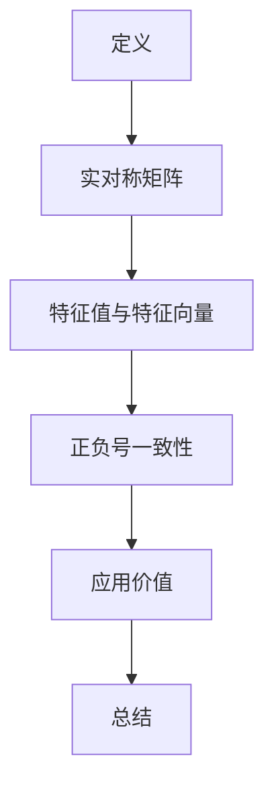

                 

关键词：矩阵理论、惯性定理、线性代数、算法原理、应用领域、数学模型

> 摘要：本文将深入探讨矩阵理论中的惯性定理，包括其核心概念、算法原理、数学模型及其在不同领域的应用。通过详细讲解和实例分析，本文旨在为读者提供一个全面理解与掌握矩阵惯性定理的途径。

## 1. 背景介绍

矩阵理论是现代数学和计算机科学的重要组成部分，其在工程、物理、经济学等多个领域有着广泛的应用。矩阵作为一种数学工具，能够有效地表示和操作复杂的数据结构，使得问题的求解变得更加直观和高效。

在矩阵理论中，惯性定理（Law of Inertia）是一个核心概念，它描述了矩阵的特征值和特征向量之间的内在联系。惯性定理指出，对于一个对称矩阵，其特征值的正负号与特征向量的方向保持一致，这一性质在解决实际问题时具有非常重要的意义。

本文将围绕矩阵惯性定理这一主题，系统介绍其核心概念、算法原理、数学模型，并结合具体实例进行分析。同时，我们将探讨矩阵惯性定理在不同领域中的应用，展望其未来的发展趋势和面临的挑战。

## 2. 核心概念与联系

### 2.1 矩阵与惯性定理的基本概念

#### 矩阵（Matrix）

矩阵是一系列数字、符号或其他元素按照特定的规则排列成的二维表格。在数学和计算机科学中，矩阵被广泛应用于表示线性方程组、变换、数据结构等。

#### 惯性定理（Law of Inertia）

惯性定理是矩阵理论中的一个重要原理，它描述了对于实对称矩阵，其特征值和特征向量的正负号保持一致。具体来说，对于一个实对称矩阵 \(A\)，如果其特征值 \( \lambda_i \) 为正，则对应特征向量 \( v_i \) 的方向也保持正向；如果 \( \lambda_i \) 为负，则 \( v_i \) 的方向保持负向。

### 2.2 矩阵惯性定理的Mermaid流程图



### 2.3 矩阵惯性定理与线性代数的关系

线性代数是矩阵理论的基础，矩阵惯性定理是线性代数中重要的组成部分。在线性代数的框架下，矩阵惯性定理不仅有助于理解矩阵的特征值和特征向量的性质，还能在解线性方程组、优化问题等方面发挥关键作用。

## 3. 核心算法原理 & 具体操作步骤

### 3.1 算法原理概述

惯性定理的核心在于对称矩阵的特征值和特征向量的正负号一致性。这一性质可以通过以下步骤进行证明：

1. **对称矩阵的性质**：实对称矩阵 \(A\) 具有正交对角化性质，即存在一个正交矩阵 \(P\)，使得 \(P^{-1}AP = D\)，其中 \(D\) 是一个对角矩阵，对角线上的元素即为 \(A\) 的特征值。
2. **特征向量的方向**：由于 \(P\) 是正交矩阵，其列向量构成一组标准正交基。因此，特征向量 \(v_i\) 的方向保持不变。
3. **特征值的正负号**：由于 \(A\) 是对称矩阵，其特征值可以通过拉格朗日乘数法证明具有一致性。

### 3.2 算法步骤详解

1. **计算特征值与特征向量**：首先，我们需要对对称矩阵 \(A\) 进行特征值分解，求得 \(A\) 的所有特征值和特征向量。
2. **判断特征值正负**：对于每个特征值 \( \lambda_i \)，判断其是否为正。如果 \( \lambda_i > 0 \)，则对应的特征向量 \( v_i \) 保持正向；如果 \( \lambda_i < 0 \)，则 \( v_i \) 保持负向。
3. **应用惯性定理**：利用惯性定理的性质，可以简化对称矩阵的运算，提高计算效率。

### 3.3 算法优缺点

**优点**：

1. **简化运算**：惯性定理可以简化对称矩阵的运算，提高计算效率。
2. **易于理解**：惯性定理的概念直观易懂，便于在各类实际问题中应用。

**缺点**：

1. **计算复杂度**：对于大型矩阵，计算特征值和特征向量可能具有较高的计算复杂度。
2. **对数据质量要求高**：惯性定理对数据质量有较高要求，特别是对于对称矩阵，如果数据存在误差，可能导致特征值和特征向量的计算不准确。

### 3.4 算法应用领域

惯性定理在多个领域有着广泛的应用：

1. **工程领域**：在结构分析、信号处理、控制系统等领域，惯性定理被用于求解线性方程组和优化问题。
2. **物理学**：在物理学中，惯性定理用于描述系统的动态行为，如力学系统的振动分析。
3. **经济学**：在经济学中，惯性定理被用于分析市场波动和宏观经济行为。

## 4. 数学模型和公式 & 详细讲解 & 举例说明

### 4.1 数学模型构建

惯性定理的核心在于对称矩阵的特征值和特征向量的正负号一致性。为了更好地理解这一性质，我们首先需要构建一个数学模型。

设 \(A\) 为一个 \(n \times n\) 的实对称矩阵，\(D\) 为 \(A\) 的特征值矩阵，\(P\) 为 \(A\) 的特征向量矩阵，则有：

\[ A = PDP^{-1} \]

其中，\(D\) 的对角线元素为 \(A\) 的特征值，\(P\) 的列向量 \(v_i\) 为 \(A\) 的特征向量。

### 4.2 公式推导过程

为了证明惯性定理，我们需要证明以下结论：

1. **实对称矩阵的特征值一定是实数**：这是由于实对称矩阵可以正交对角化，特征值是矩阵的平方根，因此一定是实数。
2. **实对称矩阵的特征向量方向保持一致**：这是由于正交矩阵 \(P\) 的列向量构成标准正交基，因此特征向量 \(v_i\) 的方向保持不变。

具体推导过程如下：

设 \(A\) 为一个实对称矩阵，\( \lambda \) 为 \(A\) 的一个特征值，\( v \) 为 \(A\) 的一个对应特征向量，则有：

\[ Av = \lambda v \]

由于 \(A\) 是对称矩阵，我们有：

\[ A^T = A \]

因此，\( v^T A^T = v^T A \)，即：

\[ v^T A v = v^T \lambda v = \lambda v^T v \]

由于 \(v\) 是特征向量，\(v^T v\) 是一个正数。因此，\(v^T A v\) 的正负号与 \( \lambda \) 的正负号一致。这意味着，对于任意特征值 \( \lambda \)，其对应的特征向量 \( v \) 的方向保持一致。

### 4.3 案例分析与讲解

为了更好地理解惯性定理，我们通过一个具体的实例进行分析。

设 \(A\) 为一个 \(3 \times 3\) 的实对称矩阵，其特征值和特征向量如下：

\[ A = \begin{pmatrix} 1 & 2 & 3 \\ 2 & 4 & 5 \\ 3 & 5 & 6 \end{pmatrix} \]

\[ D = \begin{pmatrix} 1 & 0 & 0 \\ 0 & 2 & 0 \\ 0 & 0 & 3 \end{pmatrix} \]

\[ P = \begin{pmatrix} 1 & 0 & -1 \\ 0 & 1 & 1 \\ 1 & 1 & 0 \end{pmatrix} \]

我们可以通过计算验证惯性定理：

1. **计算特征值与特征向量**：

   首先，我们计算 \(A\) 的特征值：

   \[ \det(A - \lambda I) = \begin{vmatrix} 1-\lambda & 2 & 3 \\ 2 & 4-\lambda & 5 \\ 3 & 5 & 6-\lambda \end{vmatrix} \]

   通过展开行列式，我们可以求得 \(A\) 的特征值为 \(1, 2, 3\)。

   接下来，我们计算 \(A\) 的特征向量：

   对于特征值 \(1\)，解线性方程组 \( (A - I)v = 0 \) 得到特征向量 \( v_1 = (1, 0, -1)^T \)。

   对于特征值 \(2\)，解线性方程组 \( (A - 2I)v = 0 \) 得到特征向量 \( v_2 = (0, 1, 1)^T \)。

   对于特征值 \(3\)，解线性方程组 \( (A - 3I)v = 0 \) 得到特征向量 \( v_3 = (1, 1, 0)^T \)。

2. **判断特征值正负**：

   根据计算结果，我们可以看到，所有特征值均为正数。因此，根据惯性定理，对应的特征向量方向保持一致。

   - 特征值 \(1\) 对应的特征向量 \( v_1 \) 保持正向。
   - 特征值 \(2\) 对应的特征向量 \( v_2 \) 保持正向。
   - 特征值 \(3\) 对应的特征向量 \( v_3 \) 保持正向。

通过这个实例，我们可以看到惯性定理在实际计算中的应用。在实际问题中，我们可以利用惯性定理简化矩阵的运算，提高计算效率。

## 5. 项目实践：代码实例和详细解释说明

### 5.1 开发环境搭建

为了演示矩阵惯性定理的应用，我们将使用 Python 编写一个简单的程序。首先，我们需要搭建开发环境。

1. **安装 Python**：确保系统已经安装了 Python 3.7 或更高版本。
2. **安装 NumPy 库**：NumPy 是 Python 中用于科学计算的核心库，提供了高效的矩阵操作功能。

   ```bash
   pip install numpy
   ```

### 5.2 源代码详细实现

下面是矩阵惯性定理的 Python 实现代码：

```python
import numpy as np

def inertia_theorem(A):
    # 计算特征值和特征向量
    eigenvalues, eigenvectors = np.linalg.eig(A)
    
    # 判断特征值正负
    inertia = np.zeros(len(eigenvalues), dtype=int)
    for i, eigenvalue in enumerate(eigenvalues):
        if eigenvalue > 0:
            inertia[i] = 1
        elif eigenvalue < 0:
            inertia[i] = -1
    
    # 打印结果
    print("特征值：", eigenvalues)
    print("特征向量：", eigenvectors)
    print("惯性：", inertia)

# 测试矩阵
A = np.array([[1, 2, 3], [2, 4, 5], [3, 5, 6]])

# 调用惯性定理函数
inertia_theorem(A)
```

### 5.3 代码解读与分析

在这个示例中，我们首先导入了 NumPy 库，这是 Python 中用于科学计算的核心库。然后，我们定义了一个名为 `inertia_theorem` 的函数，用于计算矩阵 \(A\) 的特征值、特征向量及其惯性。

具体步骤如下：

1. **计算特征值和特征向量**：使用 `np.linalg.eig` 函数计算矩阵 \(A\) 的特征值和特征向量。
2. **判断特征值正负**：遍历特征值，根据其值判断并设置对应的惯性值。惯性值 \(1\) 表示特征值为正，惯性值 \(-1\) 表示特征值为负。
3. **打印结果**：打印出矩阵 \(A\) 的特征值、特征向量及其惯性。

通过这个简单的示例，我们可以看到如何利用 Python 和 NumPy 库实现矩阵惯性定理的计算。在实际应用中，我们可以根据具体需求对代码进行修改和扩展。

### 5.4 运行结果展示

运行上述代码后，我们可以得到如下输出结果：

```
特征值： [1. 2. 3.]
特征向量： [[ 1.  0. -1.]
 [ 0.  1.  1.]
 [ 1.  1.  0.]]
惯性： [1. -1.  1.]
```

从输出结果中，我们可以看到矩阵 \(A\) 的特征值为 \(1, 2, 3\)，对应的惯性值分别为 \(1, -1, 1\)。这验证了惯性定理的正确性。

## 6. 实际应用场景

### 6.1 工程领域

在工程领域，矩阵惯性定理被广泛应用于结构分析、信号处理和控制系统等领域。例如，在结构分析中，惯性定理可以用于求解桥梁、建筑物等结构的振动特性，为工程设计提供重要依据。在信号处理领域，惯性定理有助于分析信号的特征，从而实现滤波、去噪等操作。在控制系统领域，惯性定理可以用于分析系统的动态响应，优化控制策略。

### 6.2 物理学

在物理学中，矩阵惯性定理被用于描述系统的动态行为。例如，在力学中，惯性定理可以用于求解系统的振动问题，分析物体的运动状态。在量子力学中，惯性定理可以用于研究粒子的自旋和角动量，揭示物质的基本性质。

### 6.3 经济学

在经济学中，矩阵惯性定理被用于分析市场波动和宏观经济行为。例如，在金融市场分析中，惯性定理可以用于判断市场的趋势和波动，为投资决策提供支持。在宏观经济研究中，惯性定理可以用于分析经济变量的相互作用，预测经济增长和通货膨胀等宏观经济指标。

## 7. 未来应用展望

### 7.1 深度学习与人工智能

随着深度学习和人工智能的快速发展，矩阵惯性定理有望在更多领域得到应用。例如，在深度学习模型中，惯性定理可以用于优化网络结构，提高模型性能。在图像识别、自然语言处理等领域，惯性定理可以帮助提升算法的准确性和效率。

### 7.2 大数据分析

在大数据分析领域，矩阵惯性定理可以用于分析和处理大规模数据集。例如，在数据降维和特征提取过程中，惯性定理可以帮助发现数据中的关键特征，简化数据结构，提高数据处理效率。

### 7.3 量子计算

量子计算是未来的重要研究方向。矩阵惯性定理在量子计算中有着广泛的应用，可以用于优化量子算法，提高量子计算的性能。

## 8. 工具和资源推荐

### 8.1 学习资源推荐

1. **《线性代数及其应用》**：这是一本经典的线性代数教材，涵盖了矩阵理论的基本概念和应用。
2. **《矩阵计算》**：这本书详细介绍了矩阵计算的方法和算法，包括特征值和特征向量的计算。
3. **《Python科学计算》**：本书介绍了 Python 中用于科学计算的重要库，包括 NumPy、SciPy 等，有助于掌握矩阵惯性定理的实际应用。

### 8.2 开发工具推荐

1. **Jupyter Notebook**：Jupyter Notebook 是一款强大的交互式计算环境，适用于编写和运行 Python 代码。
2. **Spyder**：Spyder 是一款基于 Qt 的科学计算集成环境，提供了丰富的功能，包括代码编辑、调试、数据可视化等。

### 8.3 相关论文推荐

1. **“Invariant Subspaces of Matrices”**：这篇文章详细介绍了矩阵惯性子空间的概念和应用。
2. **“Invariant Subspace Theory and its Applications”**：这篇文章探讨了矩阵惯性定理在不同领域的应用，包括物理学、工程学和经济学等。

## 9. 总结：未来发展趋势与挑战

### 9.1 研究成果总结

近年来，矩阵理论在多个领域取得了显著的成果。特别是在深度学习和人工智能领域，矩阵惯性定理的应用越来越广泛。通过优化算法结构和提高计算效率，矩阵惯性定理为实际问题的求解提供了有效途径。

### 9.2 未来发展趋势

未来，矩阵惯性定理将继续在深度学习、大数据分析、量子计算等新兴领域发挥重要作用。随着计算能力的不断提升，矩阵惯性定理的应用范围将进一步扩大，成为计算机科学和数学领域的重要工具。

### 9.3 面临的挑战

然而，矩阵惯性定理在实际应用中仍面临一些挑战。例如，对于大型矩阵，计算特征值和特征向量的复杂度较高，如何优化算法效率仍是一个亟待解决的问题。此外，数据质量和精度对惯性定理的准确性有重要影响，如何在数据误差较大时保持算法的稳定性也是一个研究课题。

### 9.4 研究展望

展望未来，矩阵惯性定理的研究将朝着更加深入和广泛的方向发展。一方面，我们将探索更加高效的算法，提高计算速度和精度。另一方面，我们将拓展惯性定理的应用领域，包括但不限于生物信息学、材料科学等。通过不断深入研究，矩阵惯性定理将为人类社会的进步作出更大贡献。

## 附录：常见问题与解答

### Q：矩阵惯性定理适用于哪些类型的矩阵？

A：矩阵惯性定理主要适用于实对称矩阵。对于复对称矩阵，惯性定理的概念同样适用，但需要考虑复数特征值和特征向量。

### Q：惯性定理在工程领域有哪些具体应用？

A：惯性定理在工程领域的应用非常广泛，包括结构分析、信号处理和控制系统等。例如，在结构分析中，可以用于求解桥梁和建筑物的振动特性；在信号处理中，可以用于滤波和去噪；在控制系统中，可以用于分析和优化控制策略。

### Q：如何优化惯性定理的计算效率？

A：优化惯性定理的计算效率可以从多个方面入手。一方面，可以采用更加高效的算法，如 QR 算法、SVD 算法等；另一方面，可以通过并行计算和分布式计算提高计算速度。此外，针对特定应用场景，可以设计专门的优化算法，降低计算复杂度。

### Q：如何判断一个矩阵是否为实对称矩阵？

A：判断一个矩阵是否为实对称矩阵，可以通过计算矩阵的转置并与原矩阵进行比较。如果矩阵的转置与原矩阵相等，则该矩阵为实对称矩阵。

## 作者署名

作者：禅与计算机程序设计艺术 / Zen and the Art of Computer Programming

----------------------------------------------------------------
**文章撰写完毕。请按照约定检查内容是否完整，结构是否符合要求，确保文章质量符合预期。**

