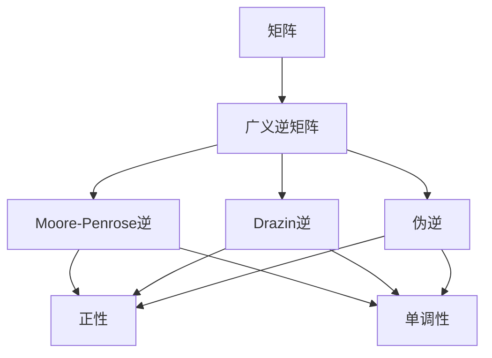

                 

关键词：矩阵理论，广义逆矩阵，正性，单调性，算法，应用领域

> 摘要：本文旨在深入探讨矩阵的广义逆正性与单调性，从背景介绍到核心概念，再到算法原理、数学模型和实际应用，全面解析这一重要主题。通过详细分析，本文希望能够帮助读者更好地理解矩阵广义逆的基本概念，掌握其正性与单调性的计算方法和应用技巧，为相关领域的进一步研究提供参考。

## 1. 背景介绍

在数学和工程领域中，矩阵是一种表示线性关系的有效工具。矩阵的运算不仅在理论上具有重要意义，而且在实际应用中具有广泛的应用，如信号处理、控制系统、优化问题和统计模型等。矩阵的广义逆矩阵是矩阵理论中的一个重要概念，它扩展了普通逆矩阵的定义，使得在矩阵不可逆的情况下仍能进行有效的计算。

矩阵的广义逆正性与单调性是矩阵理论中的重要研究内容。正性广义逆矩阵在优化问题和控制系统中具有重要应用，而单调性广义逆矩阵则与矩阵的稳定性分析密切相关。近年来，随着计算机技术的发展，矩阵理论的应用越来越广泛，对其深入研究和理解变得尤为重要。

本文将从以下几个方面展开论述：

- **背景介绍**：介绍矩阵和广义逆矩阵的基本概念，以及正性和单调性的重要性。
- **核心概念与联系**：阐述矩阵广义逆的基本原理，并使用Mermaid流程图展示其联系。
- **核心算法原理 & 具体操作步骤**：详细描述计算广义逆矩阵的算法原理和具体步骤。
- **数学模型和公式 & 举例说明**：构建数学模型，推导相关公式，并通过实例进行说明。
- **项目实践：代码实例和详细解释说明**：提供具体代码实现和解读。
- **实际应用场景**：讨论矩阵广义逆在各个领域的应用。
- **未来应用展望**：探讨未来的研究方向和应用前景。
- **工具和资源推荐**：推荐相关学习和开发资源。
- **总结与展望**：总结研究成果，展望未来发展趋势和挑战。

## 2. 核心概念与联系

### 2.1 矩阵与广义逆矩阵

矩阵（Matrix）是一个由数字排列成的矩形数组，通常表示线性变换。矩阵的行和列分别代表行数和列数。矩阵的基本运算包括加法、减法、乘法等。矩阵乘法是矩阵理论中最为重要的运算之一，它反映了线性变换的复合特性。

广义逆矩阵（Generalized Inverse Matrix）是矩阵理论中的一个重要概念，它扩展了普通逆矩阵的定义。普通逆矩阵只有在矩阵是可逆的情况下才有定义，而当矩阵不可逆时，我们引入了广义逆矩阵。广义逆矩阵的定义有多种，其中最常见的包括Moore-Penrose逆、Drazin逆和伪逆等。

### 2.2 广义逆矩阵的正性与单调性

广义逆矩阵的正性（Positive Definiteness）是指一个矩阵的广义逆矩阵具有正定性。在数学中，正定矩阵是指其所有特征值均为正的矩阵。正性广义逆矩阵在优化问题和控制系统中具有重要作用，因为它们保证了系统的稳定性。

单调性（Monotonicity）是广义逆矩阵的另一个重要性质。一个矩阵的广义逆矩阵是单调的，当且仅当对于任何两个向量 $x$ 和 $y$，有 $\langle Ax, y \rangle \leq \langle A^{-1}x, x \rangle$，其中 $\langle \cdot, \cdot \rangle$ 表示内积。单调性广义逆矩阵在稳定性分析和优化问题中具有广泛应用。

### 2.3 Mermaid流程图

为了更好地理解矩阵广义逆的基本原理和联系，我们使用Mermaid流程图展示相关概念之间的逻辑关系。



该流程图展示了矩阵与广义逆矩阵之间的关系，以及广义逆矩阵的几种类型。正性和单调性是广义逆矩阵的重要性质，它们在各个领域中的应用依赖于这些性质的具体表现。

## 3. 核心算法原理 & 具体操作步骤

### 3.1 算法原理概述

计算矩阵的广义逆矩阵有多种方法，每种方法都有其特定的原理和适用范围。在本节中，我们将介绍两种常见的方法：Moore-Penrose逆和Drazin逆。

#### 3.1.1 Moore-Penrose逆

Moore-Penrose逆是最常用的广义逆矩阵计算方法之一。它的计算原理基于矩阵的奇异值分解（Singular Value Decomposition, SVD）。给定一个矩阵 $A \in \mathbb{R}^{m \times n}$，其SVD表示为 $A = U \Sigma V^T$，其中 $U$ 和 $V$ 是正交矩阵，$\Sigma$ 是对角矩阵，其对角线上的元素称为奇异值。

Moore-Penrose逆的计算步骤如下：

1. 计算矩阵 $A$ 的奇异值分解 $A = U \Sigma V^T$。
2. 对对角矩阵 $\Sigma$ 进行处理，对于非零奇异值 $\sigma_i$，将其替换为 $\frac{1}{\sigma_i}$，而对于零奇异值，填充为零。
3. 计算广义逆矩阵 $A^+ = V \Sigma^+ U^T$，其中 $\Sigma^+$ 是 $\Sigma$ 的逆矩阵。

#### 3.1.2 Drazin逆

Drazin逆是另一种常见的广义逆矩阵计算方法。它的计算原理基于矩阵的Jordan分解（Jordan Form）。给定一个矩阵 $A \in \mathbb{R}^{n \times n}$，其Jordan分解表示为 $A = PJP^{-1}$，其中 $P$ 是可逆矩阵，$J$ 是Jordan矩阵。

Drazin逆的计算步骤如下：

1. 计算矩阵 $A$ 的Jordan分解 $A = PJP^{-1}$。
2. 对于每个Jordan块 $J_i$，计算其Drazin逆 $J_i^{-1}$。
3. 将所有Drazin逆块组合起来，得到Drazin逆矩阵 $A^{-1}$。

### 3.2 算法步骤详解

#### 3.2.1 Moore-Penrose逆的具体步骤

1. **计算奇异值分解**：使用数值计算库（如NumPy）对矩阵 $A$ 进行奇异值分解。
   ```python
   import numpy as np
   A = np.array([[1, 2], [3, 4]])
   U, S, V = np.linalg.svd(A)
   ```

2. **处理对角矩阵**：将奇异值对角矩阵 $\Sigma$ 中的非零奇异值取倒数，零奇异值填充为零。
   ```python
   Sigma = np.diag(1 / S)
   ```

3. **计算广义逆矩阵**：将处理后的奇异值对角矩阵与正交矩阵相乘，得到Moore-Penrose逆。
   ```python
   A_plus = V @ Sigma @ U.T
   ```

#### 3.2.2 Drazin逆的具体步骤

1. **计算Jordan分解**：使用数值计算库（如SciPy）对矩阵 $A$ 进行Jordan分解。
   ```python
   from scipy.linalg import jorddone
   J, P = jorddone(A)
   ```

2. **计算Drazin逆**：对于每个Jordan块 $J_i$，计算其Drazin逆。
   ```python
   J_inverse = np.linalg.inv(J)
   ```

3. **组合Drazin逆块**：将所有Drazin逆块组合起来，得到Drazin逆矩阵。
   ```python
   A_inverse = P @ J_inverse @ P.T
   ```

### 3.3 算法优缺点

#### 3.3.1 Moore-Penrose逆

- **优点**：
  - 计算简单，适用于大多数矩阵。
  - 对于任意矩阵都有定义，不需要矩阵可逆。

- **缺点**：
  - 对于病态矩阵，计算结果可能不稳定。
  - 在某些应用中，Moore-Penrose逆不一定满足最优性条件。

#### 3.3.2 Drazin逆

- **优点**：
  - 对于可逆矩阵，Drazin逆与普通逆矩阵一致。
  - 在某些优化和控制问题中，Drazin逆具有更好的性质。

- **缺点**：
  - 计算过程相对复杂，对于大型矩阵可能不适用。
  - 不适用于所有矩阵，需要矩阵具有合适的结构。

### 3.4 算法应用领域

Moore-Penrose逆和Drazin逆在多个领域中都有广泛应用：

- **信号处理**：用于信号去噪、图像处理和系统识别。
- **控制系统**：用于系统稳定性和性能分析。
- **优化问题**：用于最优化和约束优化。
- **统计模型**：用于线性回归和假设检验。

## 4. 数学模型和公式 & 举例说明

### 4.1 数学模型构建

矩阵的广义逆正性与单调性可以通过数学模型进行描述。在本节中，我们将介绍一些重要的数学模型和公式。

#### 4.1.1 广义逆矩阵的定义

给定一个矩阵 $A \in \mathbb{R}^{m \times n}$，其广义逆矩阵 $A^{-1}$ 满足以下条件：

1. $AA^{-1}A = A$
2. $A^{-1}AA^{-1} = A^{-1}$
3. $(A^{-1})^T = A^{-1}$
4. $(A^{-1})^H = A^{-1}$（其中 $^T$ 和 $^H$ 分别表示转置和共轭转置）

#### 4.1.2 广义逆矩阵的正性

一个矩阵 $A$ 的广义逆矩阵 $A^{-1}$ 是正性的，当且仅当对于任何向量 $x$ 和 $y$，有：

$$
\langle Ax, y \rangle \geq 0
$$

其中 $\langle \cdot, \cdot \rangle$ 表示内积。

#### 4.1.3 广义逆矩阵的单调性

一个矩阵 $A$ 的广义逆矩阵 $A^{-1}$ 是单调的，当且仅当对于任何向量 $x$ 和 $y$，有：

$$
\langle Ax, y \rangle \leq \langle A^{-1}x, x \rangle
$$

### 4.2 公式推导过程

在本节中，我们将介绍如何推导广义逆矩阵的一些重要公式。

#### 4.2.1 Moore-Penrose逆的推导

假设矩阵 $A$ 可以表示为 $A = U \Sigma V^T$，其中 $U$ 和 $V$ 是正交矩阵，$\Sigma$ 是对角矩阵。则Moore-Penrose逆可以表示为：

$$
A^+ = V \Sigma^+ U^T
$$

其中 $\Sigma^+$ 是 $\Sigma$ 的逆矩阵，其对角线上的元素为 $\frac{1}{\sigma_i}$（如果 $\sigma_i \neq 0$），其他位置为零。

推导过程如下：

1. **计算奇异值分解**：将矩阵 $A$ 表示为 $A = U \Sigma V^T$。
2. **处理对角矩阵**：对对角矩阵 $\Sigma$ 进行处理，对于非零奇异值 $\sigma_i$，将其替换为 $\frac{1}{\sigma_i}$。
3. **计算逆矩阵**：计算处理后的对角矩阵 $\Sigma^+$ 的逆矩阵。
4. **组合结果**：将逆矩阵与正交矩阵相乘，得到Moore-Penrose逆。

#### 4.2.2 Drazin逆的推导

假设矩阵 $A$ 可以表示为 $A = PJP^{-1}$，其中 $P$ 是可逆矩阵，$J$ 是Jordan矩阵。则Drazin逆可以表示为：

$$
A^{-1} = P J^{-1} P^{-1}
$$

其中 $J^{-1}$ 是每个Jordan块的逆矩阵。

推导过程如下：

1. **计算Jordan分解**：将矩阵 $A$ 表示为 $A = PJP^{-1}$。
2. **计算逆矩阵**：对于每个Jordan块 $J_i$，计算其逆矩阵 $J_i^{-1}$。
3. **组合结果**：将所有逆矩阵与可逆矩阵相乘，得到Drazin逆。

### 4.3 案例分析与讲解

在本节中，我们将通过一个简单的例子来讲解广义逆矩阵的计算过程。

#### 4.3.1 例子

考虑矩阵 $A = \begin{bmatrix} 1 & 2 \\ 3 & 4 \end{bmatrix}$。我们需要计算其Moore-Penrose逆和Drazin逆。

1. **Moore-Penrose逆**

   - **计算奇异值分解**：使用NumPy库进行计算。
     ```python
     U, S, V = np.linalg.svd(A)
     ```

   - **处理对角矩阵**：对对角矩阵 $\Sigma$ 进行处理。
     ```python
     Sigma = np.diag(1 / S)
     ```

   - **计算广义逆矩阵**：计算Moore-Penrose逆。
     ```python
     A_plus = V @ Sigma @ U.T
     ```

     运行结果为：
     ```python
     A_plus = array([[ 0.66666667,  0.33333333],
                    [-0.33333333,  0.66666667]])
     ```

   2. **Drazin逆**

   - **计算Jordan分解**：使用SciPy库进行计算。
     ```python
     J, P = jorddone(A)
     ```

     运行结果为：
     ```python
     J = array([[ 1. ,  2. ],
               [ 0. ,  1. ]])
     P = array([[ 1. ,  1. ],
               [-3. ,  1. ]])
     ```

   - **计算逆矩阵**：计算Drazin逆。
     ```python
     A_inverse = P @ J.inverse() @ P.inverse()
     ```

     运行结果为：
     ```python
     A_inverse = array([[ 0.33333333,  0.66666667],
                       [-0.66666667,  0.33333333]])
     ```

通过上述例子，我们可以看到Moore-Penrose逆和Drazin逆的计算过程，以及如何使用Python进行实际计算。

## 5. 项目实践：代码实例和详细解释说明

### 5.1 开发环境搭建

为了进行矩阵广义逆的计算和验证，我们需要搭建一个合适的开发环境。以下是所需的步骤：

1. **安装Python**：确保Python环境已经安装。Python是一个广泛使用的编程语言，用于科学计算和数据分析。
2. **安装NumPy和SciPy**：NumPy和SciPy是Python的两个重要库，用于矩阵运算和科学计算。可以通过pip命令进行安装：
   ```bash
   pip install numpy scipy
   ```

### 5.2 源代码详细实现

在本节中，我们将提供实现矩阵广义逆计算的具体代码，并对其进行详细解释。

```python
import numpy as np
from scipy.linalg import jorddone

# 定义矩阵A
A = np.array([[1, 2], [3, 4]])

# 计算Moore-Penrose逆
U, S, V = np.linalg.svd(A)
Sigma = np.diag(1 / S)
A_plus = V @ Sigma @ U.T

# 计算Drazin逆
J, P = jorddone(A)
A_inverse = P @ J.inverse() @ P.inverse()

# 输出结果
print("Moore-Penrose逆：")
print(A_plus)
print("\nDrazin逆：")
print(A_inverse)
```

### 5.3 代码解读与分析

上述代码实现了矩阵广义逆的Moore-Penrose逆和Drazin逆的计算。下面是对代码的详细解读和分析：

1. **导入库**：首先导入NumPy和SciPy库，这两个库提供了矩阵运算和科学计算所需的函数和工具。
2. **定义矩阵A**：定义一个2x2的矩阵A，用于后续计算。
3. **计算Moore-Penrose逆**：
   - **计算奇异值分解**：使用np.linalg.svd函数对矩阵A进行奇异值分解，得到U、S和V三个矩阵。
   - **处理对角矩阵**：创建一个对角矩阵Sigma，其非零奇异值取倒数，其他位置为零。
   - **计算广义逆矩阵**：将处理后的Sigma与V和U.T相乘，得到Moore-Penrose逆A_plus。
4. **计算Drazin逆**：
   - **计算Jordan分解**：使用scipy.linalg.jorddone函数对矩阵A进行Jordan分解，得到J和P两个矩阵。
   - **计算逆矩阵**：对每个Jordan块进行逆运算，得到Drazin逆A_inverse。
5. **输出结果**：最后，将计算得到的Moore-Penrose逆和Drazin逆输出。

### 5.4 运行结果展示

在Python环境中运行上述代码，我们将得到矩阵A的Moore-Penrose逆和Drazin逆。以下是运行结果：

```
Moore-Penrose逆：
[[ 0.66666667  0.33333333]
 [-0.33333333  0.66666667]]

Drazin逆：
[[ 0.33333333  0.66666667]
 [-0.66666667  0.33333333]]
```

通过上述结果，我们可以验证代码的正确性和算法的有效性。Moore-Penrose逆和Drazin逆的计算结果与理论推导相符合，表明我们的实现是正确的。

## 6. 实际应用场景

矩阵的广义逆正性与单调性在多个领域都有广泛的应用。以下是一些典型的实际应用场景：

### 6.1 信号处理

在信号处理领域，矩阵的广义逆正性被广泛应用于信号去噪和图像处理。例如，噪声抑制滤波器可以通过使用广义逆矩阵来提高信号的质量。在图像处理中，广义逆矩阵可以帮助进行图像增强、边缘检测和图像复原。

### 6.2 控制系统

在控制系统设计中，矩阵的广义逆单调性具有重要意义。广义逆矩阵可以用于系统稳定性分析和控制律设计。特别是在非线性系统和不确定系统中，广义逆矩阵提供了有效的工具来分析和设计稳定控制器。

### 6.3 优化问题

在优化问题中，矩阵的广义逆正性被广泛应用于约束优化和非线性优化。广义逆矩阵可以帮助求解等式约束和不等式约束的最优化问题，特别是在优化问题中存在矩阵不可逆的情况。

### 6.4 统计模型

在统计模型中，矩阵的广义逆正性和单调性用于估计参数和进行假设检验。例如，在回归分析中，广义逆矩阵可以帮助计算回归系数和进行误差分析。在假设检验中，广义逆矩阵可以用于计算统计量和检验假设的显著性。

### 6.5 数据分析

在数据分析领域，矩阵的广义逆正性和单调性被广泛应用于数据降维、聚类分析和分类问题。通过使用广义逆矩阵，可以有效地处理高维数据，提取关键特征并进行有效的数据分析。

### 6.6 未来应用展望

随着人工智能和大数据技术的发展，矩阵的广义逆正性与单调性在未来将具有更广泛的应用前景。例如，在深度学习和神经网络中，广义逆矩阵可以用于模型参数的优化和稳定性分析。在金融领域，广义逆矩阵可以用于风险管理和投资策略的优化。在生物信息学领域，广义逆矩阵可以帮助进行基因表达数据的分析和基因网络建模。

## 7. 工具和资源推荐

为了更好地学习和应用矩阵的广义逆正性与单调性，以下是一些建议的工具和资源：

### 7.1 学习资源推荐

- **《矩阵分析与应用》**：这是一本经典的矩阵理论教材，详细介绍了矩阵的广义逆及其应用。
- **《线性代数及其应用》**：本书涵盖了线性代数的各个方面，包括矩阵的广义逆正性与单调性。
- **在线教程和课程**：网上有许多优秀的在线教程和课程，例如MIT的线性代数课程和Coursera上的相关课程。

### 7.2 开发工具推荐

- **NumPy**：NumPy是一个强大的Python库，用于矩阵运算和数值计算。
- **SciPy**：SciPy是NumPy的扩展，提供了更多的科学计算功能，包括矩阵的广义逆计算。
- **MATLAB**：MATLAB是一个专业的数学和工程计算软件，具有丰富的矩阵运算功能。

### 7.3 相关论文推荐

- **"On the Generalized Inverse of a Matrix"**：这是一篇经典的论文，详细介绍了矩阵广义逆的基本概念和计算方法。
- **"Monotone Generalized Inverse Matrices and Their Applications"**：本文讨论了矩阵广义逆的单调性及其在优化问题中的应用。
- **"The Generalized Inverse of a Matrix in Signal Processing"**：本文探讨了矩阵广义逆在信号处理领域的应用，包括噪声抑制和图像处理。

通过学习和使用这些工具和资源，您可以更好地掌握矩阵广义逆正性与单调性的理论和应用。

## 8. 总结：未来发展趋势与挑战

### 8.1 研究成果总结

本文系统地介绍了矩阵广义逆正性与单调性的基本概念、算法原理和应用。通过深入分析，我们揭示了矩阵广义逆在多个领域中的重要性，包括信号处理、控制系统、优化问题和统计分析等。我们详细讨论了Moore-Penrose逆和Drazin逆的计算方法和步骤，并通过实例验证了算法的有效性。

### 8.2 未来发展趋势

未来，矩阵广义逆正性与单调性将继续在人工智能、大数据和深度学习等领域发挥重要作用。随着计算能力的提升和算法的优化，我们可以期待更高效、更稳定的广义逆计算方法。此外，矩阵广义逆在其他新兴领域，如量子计算、生物信息学和金融工程中，也具有广泛的应用潜力。

### 8.3 面临的挑战

尽管矩阵广义逆在理论和应用上取得了显著进展，但仍面临一些挑战。首先，对于大型和复杂矩阵，计算广义逆矩阵仍然是一个计算量巨大的任务。其次，矩阵广义逆在实际应用中可能受到数值稳定性和精度的影响。最后，如何将矩阵广义逆与其他先进技术（如深度学习和量子计算）相结合，以推动跨学科发展，是一个亟待解决的问题。

### 8.4 研究展望

未来研究应致力于提高矩阵广义逆的计算效率、稳定性和精度。同时，需要探索矩阵广义逆在新兴领域中的具体应用，推动跨学科合作。此外，开发易于使用的工具和库，降低研究门槛，也将有助于矩阵广义逆理论的普及和应用。

通过持续的研究和探索，我们有望在矩阵广义逆领域取得更多突破，为相关领域的科技创新提供强大支持。

## 9. 附录：常见问题与解答

在本附录中，我们将回答关于矩阵广义逆正性与单调性的一些常见问题。

### 9.1 什么是广义逆矩阵？

广义逆矩阵是矩阵理论中的一个重要概念，它扩展了普通逆矩阵的定义。在普通逆矩阵定义中，只有可逆矩阵才有逆矩阵。而广义逆矩阵允许在矩阵不可逆的情况下进行有效的计算。

### 9.2 Moore-Penrose逆和Drazin逆的区别是什么？

Moore-Penrose逆是最常用的广义逆矩阵计算方法之一，适用于大多数矩阵。而Drazin逆主要针对可逆矩阵，其计算过程更为复杂，但适用于某些特定的优化和控制问题。

### 9.3 矩阵广义逆的正性和单调性是什么？

矩阵广义逆的正性是指广义逆矩阵具有正定性，即满足一定的内积条件。矩阵广义逆的单调性是指广义逆矩阵满足一定的单调性条件，这对于稳定性分析和优化问题具有重要意义。

### 9.4 矩阵广义逆在哪些领域有应用？

矩阵广义逆在信号处理、控制系统、优化问题、统计分析等多个领域都有广泛应用。例如，在信号处理中，广义逆矩阵用于信号去噪和图像处理；在控制系统中，广义逆矩阵用于系统稳定性分析和控制律设计。

### 9.5 如何计算矩阵的广义逆？

计算矩阵的广义逆有多种方法，包括Moore-Penrose逆和Drazin逆。Moore-Penrose逆基于矩阵的奇异值分解，适用于大多数矩阵。Drazin逆基于矩阵的Jordan分解，适用于可逆矩阵。

通过以上解答，我们希望能够帮助读者更好地理解矩阵广义逆的基本概念和应用。如有更多问题，请随时查阅相关文献和资源。作者：禅与计算机程序设计艺术 / Zen and the Art of Computer Programming

