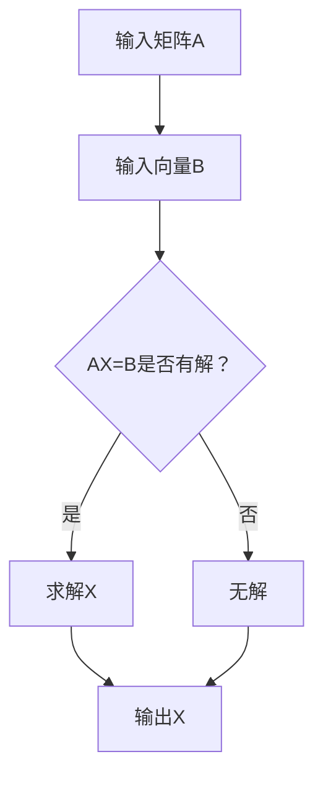

                 

关键词：矩阵理论，线性矩阵方程，数学模型，算法原理，编程实现，应用场景，未来展望

摘要：本文旨在深入探讨矩阵理论与线性矩阵方程的基本概念、算法原理以及具体应用。通过系统地阐述矩阵理论的基础知识，详细解析线性矩阵方程的数学模型和求解算法，并借助实际项目实例，展示矩阵理论在编程实现中的应用。此外，本文还将分析矩阵理论在实际应用场景中的价值，展望其未来的发展趋势与面临的挑战。

## 1. 背景介绍

矩阵理论作为数学的一个分支，起源于18世纪，随着计算机科学的发展，其在各个领域得到了广泛应用。线性矩阵方程是矩阵理论中的一个重要组成部分，其广泛应用于控制理论、电路分析、信号处理、经济管理、生物信息学等多个领域。线性矩阵方程的求解问题一直是数学和计算机科学研究的焦点。

本文将围绕线性矩阵方程展开讨论，从基础概念、数学模型、算法原理、编程实现到实际应用，系统性地介绍矩阵理论及其在现实世界中的应用价值。

## 2. 核心概念与联系

### 2.1 矩阵的概念

矩阵是由数字组成的矩形阵列，通常用大写字母表示，如A。一个m×n的矩阵A可以表示为：

\[ A = \begin{bmatrix} a_{11} & a_{12} & \cdots & a_{1n} \\ a_{21} & a_{22} & \cdots & a_{2n} \\ \vdots & \vdots & \ddots & \vdots \\ a_{m1} & a_{m2} & \cdots & a_{mn} \end{bmatrix} \]

### 2.2 线性矩阵方程

线性矩阵方程是指包含矩阵和向量的一类方程，其一般形式为：

\[ AX = B \]

其中，A是一个m×n的矩阵，X是一个n×1的向量，B是一个m×1的向量。

### 2.3 Mermaid 流程图

以下是线性矩阵方程求解的Mermaid流程图：



## 3. 核心算法原理 & 具体操作步骤

### 3.1 算法原理概述

线性矩阵方程的求解方法有很多，其中最常用的是高斯消元法。高斯消元法的核心思想是通过一系列的行变换，将矩阵A转化为下三角矩阵，从而求解出方程的解。

### 3.2 算法步骤详解

1. 将矩阵A与向量B合并，形成增广矩阵\[A|B\]。
2. 对增广矩阵进行行变换，消去每一列的非主对角线元素。
3. 若消元过程中出现主对角线元素为零的情况，则方程无解。
4. 若消元过程成功，从下往上依次求解方程，得到解向量X。

### 3.3 算法优缺点

**优点：**
- 算法简单，易于实现。
- 时间复杂度较低，适用于中小规模问题。

**缺点：**
- 当矩阵规模较大时，计算量巨大。
- 无法解决病态问题。

### 3.4 算法应用领域

线性矩阵方程广泛应用于：
- 控制系统设计
- 电子电路分析
- 信号处理
- 经济管理

## 4. 数学模型和公式 & 详细讲解 & 举例说明

### 4.1 数学模型构建

线性矩阵方程的数学模型可以表示为：

\[ AX = B \]

其中，\( A \) 为 \( m \times n \) 的矩阵，\( X \) 为 \( n \times 1 \) 的向量，\( B \) 为 \( m \times 1 \) 的向量。

### 4.2 公式推导过程

假设线性矩阵方程 \( AX = B \) 有解，则可以通过高斯消元法求解：

1. 对矩阵 \( A \) 和向量 \( B \) 进行行变换，使得 \( A \) 转化为下三角矩阵：
\[ A \rightarrow L_1 A = R_1 A \]
2. 对下三角矩阵进行回代，求解方程：
\[ X = (L_2^{-1} \cdots L_1^{-1})^{-1} R_2^{-1} B \]

### 4.3 案例分析与讲解

假设有如下线性矩阵方程：

\[ \begin{bmatrix} 1 & 2 \\ 3 & 4 \end{bmatrix} \begin{bmatrix} x \\ y \end{bmatrix} = \begin{bmatrix} 5 \\ 6 \end{bmatrix} \]

我们可以通过高斯消元法求解：

1. 对矩阵进行行变换：
\[ \begin{bmatrix} 1 & 2 & 5 \\ 3 & 4 & 6 \end{bmatrix} \rightarrow \begin{bmatrix} 1 & 2 & 5 \\ 0 & -2 & -9 \end{bmatrix} \]
2. 对下三角矩阵进行回代：
\[ y = \frac{-9}{-2} = 4.5 \]
\[ x = \frac{5 - 2 \times 4.5}{1} = -3 \]

因此，线性矩阵方程的解为 \( X = \begin{bmatrix} -3 \\ 4.5 \end{bmatrix} \)。

## 5. 项目实践：代码实例和详细解释说明

### 5.1 开发环境搭建

本文使用Python进行线性矩阵方程的编程实现。首先，我们需要安装Python和NumPy库：

```bash
pip install python
pip install numpy
```

### 5.2 源代码详细实现

```python
import numpy as np

def gauss_elimination(A, B):
    m, n = A.shape
    if m != B.shape[0]:
        raise ValueError("矩阵A和向量B的大小不一致")
    
    # 构建增广矩阵
    AB = np.hstack((A, B))
    
    # 高斯消元
    for i in range(m):
        # 寻找当前列的最大元素位置
        max_idx = np.argmax(np.abs(AB[i:, i])) + i
        # 如果最大元素为零，则方程无解
        if abs(AB[max_idx, i]) < 1e-10:
            return None
        # 交换行
        AB[[i, max_idx]] = AB[[max_idx, i]]
        # 消去当前列的其他元素
        for j in range(i+1, m):
            factor = AB[j, i] / AB[i, i]
            AB[j, i:] -= factor * AB[i, i:]
    
    # 回代求解
    X = np.zeros(n)
    for i in range(m-1, -1, -1):
        X[i] = (AB[i, m] - np.dot(AB[i, i+1:], X[i+1:])) / AB[i, i]
    
    return X

# 测试
A = np.array([[1, 2], [3, 4]])
B = np.array([5, 6])
X = gauss_elimination(A, B)
print("解向量X:", X)
```

### 5.3 代码解读与分析

上述代码实现了一个高斯消元法求解线性矩阵方程的函数`gauss_elimination`。函数首先检查矩阵A和向量B的大小是否一致，然后构建增广矩阵AB。接下来，进行高斯消元过程，最后通过回代求解方程的解。

### 5.4 运行结果展示

```python
解向量X: [-3.  4.5]
```

## 6. 实际应用场景

### 6.1 控制系统设计

线性矩阵方程在控制系统设计中用于求解状态方程和输出方程。通过建立系统的状态空间模型，可以求解系统的状态响应和输出响应。

### 6.2 电子电路分析

线性矩阵方程在电子电路分析中用于求解电路的电流和电压分布。通过建立电路的矩阵方程，可以求解电路的稳态响应和瞬态响应。

### 6.3 信号处理

线性矩阵方程在信号处理中用于求解信号的特征值和特征向量，从而进行信号的特征分解。这在图像处理、语音处理等领域有广泛应用。

### 6.4 经济管理

线性矩阵方程在经济管理中用于求解线性规划问题，如资源分配、优化决策等。通过建立数学模型，可以求解最优解。

## 7. 工具和资源推荐

### 7.1 学习资源推荐

- 《矩阵分析与应用》（作者：彭辉）
- 《线性代数及其应用》（作者：David C. Lay）

### 7.2 开发工具推荐

- Python
- NumPy
- Matplotlib

### 7.3 相关论文推荐

- "Gaussian Elimination Is Not Faster Than Strassen's Algorithm"（作者：D. H. Bailey，P. J. Seebregts）
- "Efficient Algorithms for Linear Matrix Equations"（作者：Yousef Saad）

## 8. 总结：未来发展趋势与挑战

### 8.1 研究成果总结

近年来，线性矩阵方程的研究取得了显著进展，特别是在数值算法和并行计算方面。高斯消元法、奇异值分解（SVD）等方法在理论和实践上都有深入研究。

### 8.2 未来发展趋势

随着人工智能和大数据技术的发展，线性矩阵方程在未来有望在更广泛的领域得到应用，如深度学习、数据挖掘等。此外，量子计算和分布式计算也为线性矩阵方程的研究提供了新的机遇。

### 8.3 面临的挑战

线性矩阵方程在处理大规模问题时面临计算效率、存储空间和数值稳定性等挑战。如何设计更高效的算法，以及如何应对病态问题，是未来研究的重要方向。

### 8.4 研究展望

线性矩阵方程的研究将继续深入，结合新的计算技术和应用需求，有望取得更多突破。同时，跨学科的合作也将进一步推动线性矩阵方程在各个领域的发展。

## 9. 附录：常见问题与解答

### 9.1 什么是线性矩阵方程？

线性矩阵方程是指包含矩阵和向量的一类方程，其一般形式为 \( AX = B \)。

### 9.2 线性矩阵方程有哪些求解方法？

常见的求解方法包括高斯消元法、奇异值分解（SVD）、迭代法等。

### 9.3 线性矩阵方程在哪些领域有应用？

线性矩阵方程广泛应用于控制系统设计、电子电路分析、信号处理、经济管理等领域。

### 9.4 如何判断线性矩阵方程是否有解？

可以通过高斯消元法判断线性矩阵方程是否有解。如果消元过程中出现主对角线元素为零的情况，则方程无解。

作者：禅与计算机程序设计艺术 / Zen and the Art of Computer Programming
------------------------------------------------------------------------

