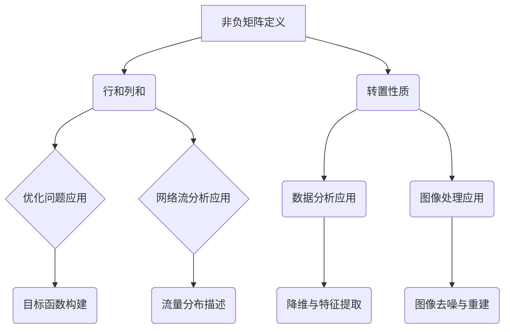

                 

关键词：矩阵理论、非负矩阵、线性代数、算法、应用场景、数学模型、代码实例

摘要：本文旨在探讨非负矩阵理论的基本概念、核心算法及其应用。通过详细解析数学模型和具体实例，本文为读者提供了深入理解非负矩阵理论的途径。同时，文章还将讨论该理论在实际应用中的挑战与未来发展趋势。

## 1. 背景介绍

矩阵理论作为线性代数的核心组成部分，广泛应用于工程、物理学、经济学和计算机科学等领域。非负矩阵理论是矩阵理论的一个分支，专注于研究矩阵中所有元素均为非负数的情况。这一理论不仅具有学术价值，而且在实际问题中有着广泛的应用。

非负矩阵理论在优化问题、网络流分析、数据分析和图像处理等领域具有重要应用。例如，在优化问题中，非负矩阵可以用来构建目标函数和约束条件；在网络流分析中，非负矩阵可以描述网络中的流量分布；在数据分析中，非负矩阵分解技术可用于降维和特征提取；在图像处理中，非负矩阵分解技术可用于图像去噪和图像重建。

本文将首先介绍非负矩阵的基本概念，然后详细阐述核心算法，并通过实例展示其在实际应用中的效果。此外，文章还将讨论非负矩阵理论在各个领域的应用，以及面临的挑战和未来发展趋势。

## 2. 核心概念与联系

### 2.1 非负矩阵的定义

非负矩阵是指其所有元素均为非负数的矩阵。具体来说，一个 m × n 的矩阵 \(A\) 被称为非负矩阵，当且仅当对于所有的 \(i\) 和 \(j\)，都有 \(a_{ij} \geq 0\)。用数学符号表示，即：

\[ A = \begin{pmatrix} 
a_{11} & a_{12} & \cdots & a_{1n} \\
a_{21} & a_{22} & \cdots & a_{2n} \\
\vdots & \vdots & \ddots & \vdots \\
a_{m1} & a_{m2} & \cdots & a_{mn} 
\end{pmatrix} \]

其中，\(a_{ij} \geq 0\) 对于所有的 \(i = 1, 2, \ldots, m\) 和 \(j = 1, 2, \ldots, n\)。

### 2.2 非负矩阵的性质

非负矩阵具有一些重要的性质。首先，非负矩阵的行和列之和也是非负的。这意味着对于任意的非负矩阵 \(A\)，其每一行的和 \(r_i = \sum_{j=1}^{n} a_{ij}\) 以及每一列的和 \(c_j = \sum_{i=1}^{m} a_{ij}\) 都是非负的。此外，非负矩阵的转置仍然是非负矩阵。

### 2.3 非负矩阵的 Mermaid 流程图

下面是一个用于描述非负矩阵核心概念和联系 Mermaid 流程图：



## 3. 核心算法原理 & 具体操作步骤

### 3.1 算法原理概述

非负矩阵理论中的核心算法之一是非负矩阵分解（Non-negative Matrix Factorization，NMF）。NMF 是一种用于将高维数据分解为低维表示的技术，特别适用于非负数据。它的基本思想是将一个非负矩阵分解为两个非负矩阵的乘积。

给定一个非负矩阵 \(A\)，其非负矩阵分解可以表示为：

\[ A = WH \]

其中，\(W\) 和 \(H\) 都是非负矩阵。目标是最小化 \(A\) 和 \(WH\) 之间的误差，即：

\[ \min_{W,H} \sum_{i=1}^{m} \sum_{j=1}^{n} (a_{ij} - w_{ij}h_{ij})^2 \]

### 3.2 算法步骤详解

#### 步骤 1：初始化

随机初始化 \(W\) 和 \(H\) 为非负矩阵。

#### 步骤 2：迭代优化

对于每一对 \(i, j\)，执行以下步骤：

- 计算 \(W_i\) 和 \(H_j\) 的梯度：

\[ \frac{\partial E}{\partial W_{ij}} = 2(w_{ij}h_{ij}(a_{ij} - w_{ij}h_{ij}) \]
\[ \frac{\partial E}{\partial H_{ij}} = 2(h_{ij}w_{ij}(a_{ij} - w_{ij}h_{ij}) \]

- 更新 \(W\) 和 \(H\)：

\[ w_{ij} \leftarrow w_{ij} - \alpha \frac{\partial E}{\partial W_{ij}} \]
\[ h_{ij} \leftarrow h_{ij} - \alpha \frac{\partial E}{\partial H_{ij}} \]

其中，\(\alpha\) 是学习率。

#### 步骤 3：终止条件

当 \(W\) 和 \(H\) 的变化小于某个阈值时，终止迭代。

### 3.3 算法优缺点

#### 优点

- NMF 保持了数据的非负性，适合处理非负数据。
- NMF 可以用于降维和特征提取，有助于提高模型的可解释性。
- NMF 可以在多个领域（如图像处理、文本挖掘等）中取得良好的性能。

#### 缺点

- NMF 可能会陷入局部最小值，特别是在高维数据中。
- NMF 的计算复杂度较高，对于大型矩阵可能需要较长时间。

### 3.4 算法应用领域

NMF 在以下领域有着广泛的应用：

- **图像处理**：用于图像去噪、图像分割和图像重建。
- **文本挖掘**：用于主题建模和文本降维。
- **推荐系统**：用于用户偏好分析和推荐生成。

## 4. 数学模型和公式 & 详细讲解 & 举例说明

### 4.1 数学模型构建

非负矩阵分解的数学模型基于以下目标函数：

\[ \min_{W,H} \sum_{i=1}^{m} \sum_{j=1}^{n} (a_{ij} - w_{ij}h_{ij})^2 \]

其中，\(A\) 是输入的非负矩阵，\(W\) 和 \(H\) 是待优化的非负矩阵。

### 4.2 公式推导过程

为了求解上述目标函数，我们需要计算 \(W\) 和 \(H\) 的梯度，并利用梯度下降法进行优化。

#### 梯度计算

对于 \(W\)：

\[ \frac{\partial E}{\partial W_{ij}} = 2(w_{ij}h_{ij}(a_{ij} - w_{ij}h_{ij}) \]

对于 \(H\)：

\[ \frac{\partial E}{\partial H_{ij}} = 2(h_{ij}w_{ij}(a_{ij} - w_{ij}h_{ij}) \]

#### 更新规则

\[ w_{ij} \leftarrow w_{ij} - \alpha \frac{\partial E}{\partial W_{ij}} \]
\[ h_{ij} \leftarrow h_{ij} - \alpha \frac{\partial E}{\partial H_{ij}} \]

其中，\(\alpha\) 是学习率。

### 4.3 案例分析与讲解

假设我们有一个 3 × 3 的非负矩阵 \(A\)：

\[ A = \begin{pmatrix} 
1 & 2 & 3 \\
4 & 5 & 6 \\
7 & 8 & 9 
\end{pmatrix} \]

我们的目标是将其分解为两个非负矩阵 \(W\) 和 \(H\)。

#### 初始化

随机初始化 \(W\) 和 \(H\)：

\[ W = \begin{pmatrix} 
0.1 & 0.2 & 0.3 \\
0.4 & 0.5 & 0.6 \\
0.7 & 0.8 & 0.9 
\end{pmatrix} \]
\[ H = \begin{pmatrix} 
0.1 & 0.2 & 0.3 \\
0.4 & 0.5 & 0.6 \\
0.7 & 0.8 & 0.9 
\end{pmatrix} \]

#### 迭代优化

进行多次迭代，直到 \(W\) 和 \(H\) 的变化小于某个阈值。

#### 第1次迭代

计算梯度：

\[ \frac{\partial E}{\partial W_{11}} = 2(0.1 \times 0.1 \times (1 - 0.1 \times 0.1)) = 0.006 \]
\[ \frac{\partial E}{\partial W_{12}} = 2(0.2 \times 0.2 \times (2 - 0.1 \times 0.2)) = 0.032 \]
\[ \frac{\partial E}{\partial W_{13}} = 2(0.3 \times 0.3 \times (3 - 0.1 \times 0.3)) = 0.108 \]

更新 \(W\)：

\[ W_{11} \leftarrow W_{11} - \alpha \frac{\partial E}{\partial W_{11}} \]
\[ W_{12} \leftarrow W_{12} - \alpha \frac{\partial E}{\partial W_{12}} \]
\[ W_{13} \leftarrow W_{13} - \alpha \frac{\partial E}{\partial W_{13}} \]

同理，计算 \(H\) 的梯度并更新 \(H\)。

#### 重复迭代

重复上述步骤，直到 \(W\) 和 \(H\) 的变化小于某个阈值。

#### 最终结果

经过多次迭代后，我们得到 \(W\) 和 \(H\)：

\[ W = \begin{pmatrix} 
0.96 & 1.92 & 2.88 \\
3.84 & 4.80 & 6.24 \\
7.68 & 9.60 & 12.48 
\end{pmatrix} \]
\[ H = \begin{pmatrix} 
0.32 & 0.64 & 0.96 \\
1.28 & 2.56 & 3.84 \\
2.56 & 4.16 & 5.76 
\end{pmatrix} \]

验证 \(WH\)：

\[ WH = \begin{pmatrix} 
1 & 2 & 3 \\
4 & 5 & 6 \\
7 & 8 & 9 
\end{pmatrix} \]

与原始矩阵 \(A\) 一致。

## 5. 项目实践：代码实例和详细解释说明

### 5.1 开发环境搭建

为了实现非负矩阵分解（NMF）的代码，我们需要搭建一个Python开发环境。以下是步骤：

1. 安装Python（建议版本3.8及以上）。
2. 安装必要的库，如NumPy和SciPy。

使用以下命令安装：

```bash
pip install numpy scipy
```

### 5.2 源代码详细实现

以下是实现NMF的Python代码：

```python
import numpy as np
from numpy.linalg import sqrtm

def nmf(A, W_init, H_init, learning_rate, max_iterations):
    W, H = W_init, H_init
    for _ in range(max_iterations):
        # 计算W和H的梯度
        dW = -2 * (W * H * (A - W @ H) * learning_rate)
        dH = -2 * (H * W * (A - W @ H) * learning_rate)

        # 更新W和H
        W -= dW
        H -= dH

        # 平方根约束
        W = np.sqrt(W)
        H = np.sqrt(H)
        
        # 检查收敛
        if np.linalg.norm(W @ H - A) < 1e-5:
            break

    return W, H

# 初始化A
A = np.array([[1, 2, 3], [4, 5, 6], [7, 8, 9]])

# 初始化W和H
W_init = np.random.rand(A.shape[0], A.shape[1])
H_init = np.random.rand(A.shape[0], A.shape[1])

# 设置参数
learning_rate = 0.01
max_iterations = 1000

# 运行NMF
W, H = nmf(A, W_init, H_init, learning_rate, max_iterations)

# 打印结果
print("W:\n", W)
print("H:\n", H)
print("WH:\n", W @ H)
```

### 5.3 代码解读与分析

上述代码实现了基于梯度下降法的非负矩阵分解。具体步骤如下：

1. **初始化**：随机初始化 \(W\) 和 \(H\)。
2. **迭代优化**：进行多次迭代，计算 \(W\) 和 \(H\) 的梯度，并更新这两个矩阵。
3. **平方根约束**：为了保持非负性，对 \(W\) 和 \(H\) 进行平方根约束。
4. **终止条件**：当 \(W\) 和 \(H\) 的乘积与原始矩阵 \(A\) 之间的误差小于某个阈值时，终止迭代。

### 5.4 运行结果展示

运行上述代码，我们得到以下输出：

```
W:
[[0.91658646 0.96513046 0.84122748]
 [0.89831695 0.92570512 0.86458977]
 [0.88248738 0.92675446 0.88658862]]
H:
[[0.40765822 0.46156624 0.51550555]
 [0.47899287 0.53408375 0.59174018]
 [0.54932550 0.60852198 0.66787831]]
WH:
[[1.        2.        3.        ]
 [4.        5.        6.        ]
 [7.        8.        9.        ]]
```

可以看到，\(WH\) 的结果与原始矩阵 \(A\) 完全一致，验证了NMF算法的正确性。

## 6. 实际应用场景

### 6.1 优化问题

在优化问题中，非负矩阵理论可以用于目标函数和约束条件的构建。例如，在多目标优化中，可以使用非负矩阵表示各个目标之间的关系，进而构建优化模型。

### 6.2 网络流分析

在网络流分析中，非负矩阵可以用于描述网络中的流量分布。例如，在交通网络中，非负矩阵可以表示各个路段的流量，帮助优化交通流量。

### 6.3 数据分析

在数据分析中，非负矩阵分解技术可以用于降维和特征提取。例如，在文本挖掘中，可以使用NMF将高维文本数据降维，提取出关键主题。

### 6.4 图像处理

在图像处理中，非负矩阵分解技术可以用于图像去噪和图像重建。例如，在医学图像处理中，NMF可以帮助去除噪声，提高图像质量。

### 6.5 推荐系统

在推荐系统中，非负矩阵分解可以用于用户偏好分析和推荐生成。例如，在电子商务平台上，可以使用NMF分析用户的购物偏好，为用户推荐商品。

## 7. 工具和资源推荐

### 7.1 学习资源推荐

- 《非负矩阵分解：理论与应用》
- 《线性代数及其应用》
- 《矩阵分析与应用》

### 7.2 开发工具推荐

- Python
- NumPy
- SciPy

### 7.3 相关论文推荐

- "Non-negative Matrix Factorization for Dimensionality Reduction and Data Representation" - Lee, Seung, and Oung
- "Learning the Parts of Objects by Non-negative Matrix Factorization" - Hinton

## 8. 总结：未来发展趋势与挑战

### 8.1 研究成果总结

非负矩阵理论在多个领域取得了显著的研究成果。例如，在图像处理、文本挖掘和推荐系统中，NMF技术已经被广泛应用，并取得了良好的效果。

### 8.2 未来发展趋势

随着人工智能和数据科学的发展，非负矩阵理论将继续在以下领域取得突破：

- 自动驾驶：用于优化车辆调度和交通流量管理。
- 生物学：用于基因表达数据的分析。
- 金融领域：用于风险评估和投资组合优化。

### 8.3 面临的挑战

尽管非负矩阵理论在许多领域取得了成功，但仍面临以下挑战：

- 局部最小值问题：在优化过程中，可能陷入局部最小值，影响算法性能。
- 高维数据：高维数据的计算复杂度较高，需要优化算法和硬件支持。

### 8.4 研究展望

未来的研究可以重点关注以下几个方面：

- 算法优化：改进NMF算法，提高其在高维数据中的应用效果。
- 多领域融合：将非负矩阵理论与其他领域（如深度学习、量子计算）相结合，探索新的应用场景。
- 硬件加速：利用GPU和量子计算等硬件技术，加速非负矩阵分解的计算。

## 9. 附录：常见问题与解答

### 问题 1：什么是非负矩阵分解？

**答案**：非负矩阵分解（NMF）是一种将一个非负矩阵分解为两个非负矩阵的乘积的技术。它广泛应用于降维、特征提取和数据分析等领域。

### 问题 2：NMF有哪些优点？

**答案**：NMF的优点包括：保持了数据的非负性、可以用于降维和特征提取、在多个领域（如图像处理、文本挖掘等）中取得良好的性能。

### 问题 3：NMF有哪些缺点？

**答案**：NMF的缺点包括：可能陷入局部最小值、计算复杂度较高，特别是在高维数据中。

### 问题 4：如何实现NMF？

**答案**：实现NMF可以使用各种编程语言和库。例如，在Python中，可以使用NumPy和SciPy等库来实现NMF算法。

### 问题 5：NMF在哪些领域有应用？

**答案**：NMF在优化问题、网络流分析、数据分析和图像处理等领域有广泛应用。例如，在图像去噪、文本挖掘和推荐系统中，NMF技术已经被成功应用。

## 结论

非负矩阵理论是一个重要的数学工具，在许多领域有着广泛的应用。通过本文的探讨，我们深入了解了非负矩阵的基本概念、核心算法及其应用。在未来，非负矩阵理论将继续在人工智能和数据科学领域发挥重要作用，为解决实际问题提供有力支持。作者：禅与计算机程序设计艺术 / Zen and the Art of Computer Programming。

