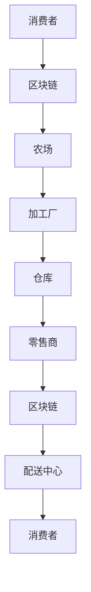
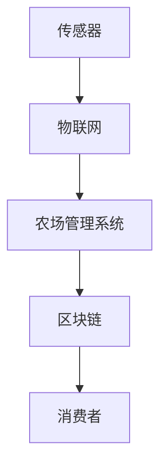
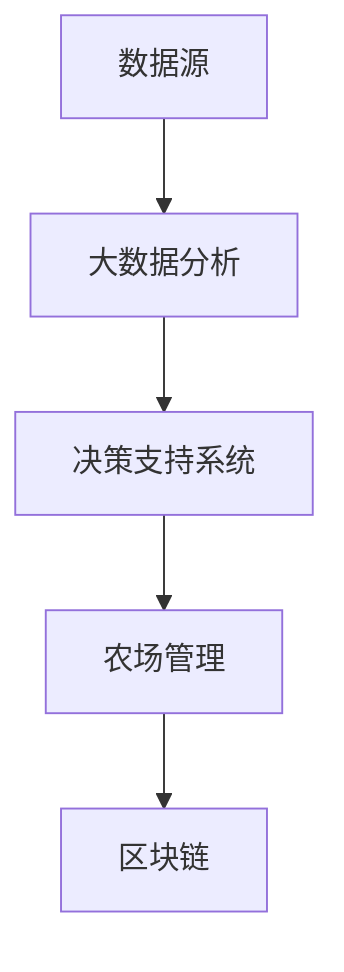

                 

关键词：硅谷，高科技农业，食品安全，可追溯，信息技术，区块链，物联网，大数据分析

> 摘要：随着科技的迅猛发展，硅谷的高科技农业正逐渐成为全球农业领域的重要趋势。本文旨在探讨如何利用信息技术，特别是区块链和物联网技术，实现食品安全和可追溯性的提升。通过分析现有的技术和解决方案，文章提出了未来发展的方向和面临的挑战。

## 1. 背景介绍

### 1.1 硅谷高科技农业的兴起

硅谷作为全球科技创新的摇篮，近年来在农业领域也展现出了强劲的活力。随着全球人口的增长和气候变化的影响，传统的农业模式难以满足日益增长的食品需求。而硅谷的高科技农业通过引入先进的科技手段，如人工智能、大数据、区块链等，正推动农业向智能化、可持续化方向发展。

### 1.2 食品安全与可追溯的重要性

食品安全是全球性的挑战，关系到公众健康和社会稳定。可追溯性则是确保食品安全的关键。通过可追溯系统，消费者可以了解食品的来源、生产过程和运输路径，从而提高对食品安全的信心。然而，传统的食品供应链往往复杂且分散，难以实现全面的可追溯。

## 2. 核心概念与联系

### 2.1 区块链技术

区块链是一种分布式数据库技术，具有去中心化、不可篡改和透明性等特点。在食品供应链中，区块链可以记录食品的每一个流转环节，实现信息的全程可追溯。



### 2.2 物联网技术

物联网（IoT）通过将传感器和设备连接到互联网，可以实时监测农业生产过程，如土壤湿度、温度、光照等。这些数据通过物联网平台传输，有助于优化农业生产和提高产量。



### 2.3 大数据分析

大数据分析可以处理和分析大量农业数据，提供决策支持。例如，通过对天气、土壤和农作物生长数据的分析，可以预测病虫害，调整农业策略。



## 3. 核心算法原理 & 具体操作步骤

### 3.1 算法原理概述

硅谷高科技农业中的核心技术包括区块链的智能合约、物联网的数据采集和大数据分析。智能合约可以自动化执行食品交易，物联网设备实时采集农业数据，大数据分析则提供数据洞察和预测。

### 3.2 算法步骤详解

1. **数据采集**：物联网传感器实时采集农业数据。
2. **数据传输**：数据通过物联网平台传输到中央数据库。
3. **数据分析**：大数据分析系统处理数据，提供决策支持。
4. **智能合约执行**：区块链上的智能合约根据分析结果执行农业交易。
5. **可追溯性**：区块链记录交易过程，实现食品全程可追溯。

### 3.3 算法优缺点

**优点**：提高食品安全和可追溯性，优化农业生产，减少中间环节，降低成本。

**缺点**：技术复杂，实施成本高，数据隐私和安全问题。

### 3.4 算法应用领域

算法主要应用于农业、食品加工、物流和零售等环节，有助于提升整个食品供应链的效率和透明度。

## 4. 数学模型和公式 & 详细讲解 & 举例说明

### 4.1 数学模型构建

食品安全风险评估模型：

$$
R = f(S, E, C)
$$

其中，$R$ 表示食品安全风险，$S$ 表示病原体暴露水平，$E$ 表示病原体侵入概率，$C$ 表示消费者抵抗力。

### 4.2 公式推导过程

食品安全风险评估模型基于以下假设：

1. 病原体在食品中的分布是均匀的。
2. 消费者的摄入量是固定的。
3. 病原体侵入概率与病原体暴露水平成正比。

根据以上假设，可以推导出：

$$
R = S \times E \times C
$$

### 4.3 案例分析与讲解

假设某批次蔬菜中的病原体暴露水平为 $S = 10$，病原体侵入概率为 $E = 0.5$，消费者抵抗力为 $C = 0.8$。则食品安全风险为：

$$
R = 10 \times 0.5 \times 0.8 = 4
$$

这意味着该批次蔬菜的食品安全风险为4，处于中等风险水平。针对这种情况，可以采取加强食品安全检测、改进生产过程等措施来降低风险。

## 5. 项目实践：代码实例和详细解释说明

### 5.1 开发环境搭建

开发环境包括Python、Node.js、MongoDB、Ethereum等工具。

### 5.2 源代码详细实现

以下是一个简单的区块链食品溯源系统的实现：

```python
# blockchain.py
class Block:
    def __init__(self, index, transactions, timestamp, previous_hash):
        self.index = index
        self.transactions = transactions
        self.timestamp = timestamp
        self.previous_hash = previous_hash
        self.hash = self.compute_hash()

    def compute_hash(self):
        block_string = str(self.index) + str(self.transactions) + str(self.timestamp) + str(self.previous_hash)
        return hashlib.sha256(block_string.encode()).hexdigest()

class Blockchain:
    def __init__(self):
        self.unconfirmed_transactions = []
        self.chain = []
        self.create_genesis_block()

    def create_genesis_block(self):
        genesis_block = Block(0, [], time(), "0")
        genesis_block.hash = genesis_block.compute_hash()
        self.chain.append(genesis_block)

    def add_new_transaction(self, transaction):
        self.unconfirmed_transactions.append(transaction)

    def mine(self):
        if not self.unconfirmed_transactions:
            return False
        last_block = self.chain[-1]
        new_block = Block(index=last_block.index + 1,
                          transactions=self.unconfirmed_transactions,
                          timestamp=time(),
                          previous_hash=last_block.hash)
        new_block.hash = new_block.compute_hash()
        self.chain.append(new_block)
        self.unconfirmed_transactions = []
        return new_block.index

    def is_chain_valid(self):
        for i in range(1, len(self.chain)):
            current = self.chain[i]
            previous = self.chain[i - 1]
            if current.hash != current.compute_hash():
                return False
            if current.previous_hash != previous.hash:
                return False
        return True
```

### 5.3 代码解读与分析

该代码实现了一个简单的区块链，包括区块（Block）和区块链（Blockchain）类。每个区块包含交易（transactions）、时间戳（timestamp）和前一个区块的哈希（previous_hash）。区块链通过验证链中每个区块的哈希值来确保数据的一致性和不可篡改性。

### 5.4 运行结果展示

运行该代码将创建一个初始区块，并可以添加新的交易和挖矿来生成新的区块。通过`is_chain_valid()`方法可以验证区块链的有效性。

## 6. 实际应用场景

### 6.1 农业生产

利用物联网技术，农民可以实时监测作物生长环境，优化灌溉和施肥，提高产量。

### 6.2 食品加工

在食品加工过程中，区块链技术可以实现原料的全程可追溯，确保食品的安全和质量。

### 6.3 物流配送

通过区块链和物联网技术，物流企业可以实时跟踪食品的运输过程，提高物流效率，降低物流成本。

### 6.4 零售业

零售商可以利用区块链技术为消费者提供食品的详细追溯信息，增强消费者对食品安全的信任。

## 7. 工具和资源推荐

### 7.1 学习资源推荐

- 《区块链技术指南》
- 《物联网应用与开发》
- 《大数据分析实践》

### 7.2 开发工具推荐

- Ethereum
- Arduino
- TensorFlow

### 7.3 相关论文推荐

- "Blockchain for Food Safety and Traceability"
- "IoT-based Smart Agriculture: A Comprehensive Review"
- "Big Data Analytics in Agriculture: A Survey"

## 8. 总结：未来发展趋势与挑战

### 8.1 研究成果总结

硅谷高科技农业在食品安全和可追溯性方面取得了显著成果，通过区块链、物联网和大数据技术的应用，实现了食品供应链的透明化和高效化。

### 8.2 未来发展趋势

未来，硅谷高科技农业将继续向智能化、数字化和可持续化方向发展，更多先进技术的融合将进一步提升农业的生产效率和食品安全性。

### 8.3 面临的挑战

尽管前景广阔，但硅谷高科技农业仍面临数据隐私、技术成本和标准化等挑战。需要政策支持、行业合作和公众教育来共同推动其发展。

### 8.4 研究展望

未来研究方向包括优化区块链和物联网技术的性能，开发更智能的农业数据分析算法，以及建立国际性的农业数据共享平台。

## 9. 附录：常见问题与解答

### 9.1 什么是区块链？

区块链是一种分布式数据库技术，通过加密算法和共识机制实现数据的不可篡改和透明性。

### 9.2 物联网和区块链有什么区别？

物联网主要关注设备连接和数据传输，而区块链则侧重于数据的存储和验证。

### 9.3 大数据如何提高食品安全？

大数据通过分析大量农业数据，提供决策支持，帮助农民优化生产过程，减少食品安全风险。

### 9.4 区块链技术是否能够完全解决食品安全问题？

区块链技术为食品安全提供了有力的保障，但需要结合物联网和大数据技术，才能实现全面的食品安全管理。

----------------------------------------------------------------

作者：禅与计算机程序设计艺术 / Zen and the Art of Computer Programming


