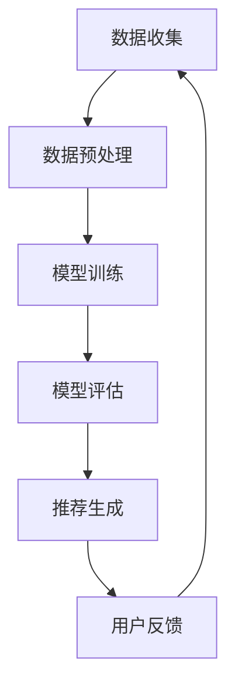

                 

关键词：社交网络、推荐系统、用户兴趣、算法、大数据、机器学习、深度学习、隐私保护、用户体验

> 摘要：本文探讨了社交网络推荐系统的进步及其如何更好地连接用户兴趣。通过介绍推荐系统的核心概念、算法原理、数学模型以及实际应用案例，本文旨在为读者提供一个全面的视角，了解推荐系统在社交网络中的重要性，并展望其未来的发展趋势和面临的挑战。

## 1. 背景介绍

### 社交网络的兴起

随着互联网技术的飞速发展，社交网络已经成为人们日常生活中不可或缺的一部分。从Facebook、Twitter到Instagram、LinkedIn，社交网络平台使得人们能够轻松地与他人交流、分享信息、建立联系。这些平台不仅改变了人们的社交方式，也为企业和个人提供了广阔的商业机会。

### 推荐系统的重要性

在社交网络平台上，内容量庞大且多样化，如何帮助用户快速找到感兴趣的内容成为了一项重要任务。推荐系统应运而生，通过分析用户的行为数据和兴趣偏好，为用户推荐可能感兴趣的内容。推荐系统在社交网络中的重要性体现在以下几个方面：

1. **提高用户黏性**：通过精准的推荐，用户能够更容易地找到感兴趣的内容，从而增加在社交网络上的停留时间。
2. **提升用户体验**：推荐系统能够减少用户在寻找内容时的繁琐操作，提升整体体验。
3. **增加商业价值**：对于企业而言，推荐系统可以帮助他们更好地推广产品和服务，提高转化率。

## 2. 核心概念与联系

### 推荐系统的定义

推荐系统（Recommender System）是一种通过预测用户兴趣，向其推荐相关内容的技术。推荐系统通常基于用户的历史行为、社交关系、内容特征等多种信息进行构建。

### 推荐系统的架构

推荐系统的架构可以分为三个主要部分：数据收集、模型训练和推荐生成。

1. **数据收集**：收集用户的行为数据、社交关系数据、内容特征数据等，为模型训练提供基础。
2. **模型训练**：利用机器学习和深度学习等技术，对收集到的数据进行分析和处理，训练出预测模型。
3. **推荐生成**：根据用户的历史行为和预测模型，生成个性化的推荐结果。

### Mermaid 流程图

下面是一个推荐系统架构的 Mermaid 流程图：



## 3. 核心算法原理 & 具体操作步骤

### 3.1 算法原理概述

推荐系统的主要算法可以分为基于内容的推荐（Content-based Filtering）和协同过滤（Collaborative Filtering）两大类。

1. **基于内容的推荐**：根据用户的历史行为和兴趣偏好，分析内容特征，为用户推荐相似的内容。
2. **协同过滤**：根据用户之间的相似度，推荐其他用户喜欢的内容。

### 3.2 算法步骤详解

#### 基于内容的推荐

1. **内容特征提取**：对用户历史行为中的内容进行特征提取，如文本分类、关键词提取等。
2. **用户兴趣建模**：利用用户的历史行为数据，建立用户兴趣模型。
3. **内容相似度计算**：计算用户兴趣模型与待推荐内容之间的相似度。
4. **推荐结果生成**：根据相似度排序，为用户推荐相似的内容。

#### 协同过滤

1. **用户相似度计算**：利用用户行为数据，计算用户之间的相似度。
2. **物品相似度计算**：利用物品（如内容、产品等）之间的相似度，计算推荐候选集。
3. **推荐结果生成**：根据用户相似度和物品相似度，生成个性化的推荐结果。

### 3.3 算法优缺点

#### 基于内容的推荐

- **优点**：推荐结果精准，用户满意度高。
- **缺点**：容易陷入“过滤泡沫”，无法挖掘新的兴趣点。

#### 协同过滤

- **优点**：能够挖掘新的兴趣点，用户满意度高。
- **缺点**：推荐结果可能存在偏差，易受噪声数据影响。

### 3.4 算法应用领域

推荐系统在社交网络中有着广泛的应用，如：

1. **内容推荐**：如新闻推送、文章推荐等。
2. **商品推荐**：电商平台上的商品推荐。
3. **广告推荐**：广告平台的广告推荐。

## 4. 数学模型和公式

### 4.1 数学模型构建

推荐系统的数学模型主要包括用户行为数据建模、内容特征建模和相似度计算。

#### 用户行为数据建模

用户行为数据建模主要利用矩阵分解（Matrix Factorization）技术，将用户行为矩阵分解为用户特征矩阵和物品特征矩阵。

$$
R = U \odot V^T
$$

其中，$R$ 为用户行为矩阵，$U$ 和 $V$ 分别为用户特征矩阵和物品特征矩阵。

#### 内容特征建模

内容特征建模主要利用文本分类、关键词提取等技术，将内容特征表示为向量的形式。

$$
C = \text{TF-IDF}(T)
$$

其中，$C$ 为内容特征向量，$T$ 为文本内容，$\text{TF-IDF}$ 为词频-逆文档频率。

#### 相似度计算

相似度计算主要利用余弦相似度（Cosine Similarity）、皮尔逊相关系数（Pearson Correlation）等指标，计算用户或物品之间的相似度。

$$
\text{similarity}(u, v) = \frac{u \cdot v}{\|u\| \|v\|}
$$

其中，$u$ 和 $v$ 分别为用户和物品的特征向量。

### 4.2 公式推导过程

#### 矩阵分解

假设用户行为矩阵为 $R$，用户特征矩阵为 $U$，物品特征矩阵为 $V$。我们需要找到一个线性组合使得 $R$ 的误差最小。

$$
\min_{U, V} \| R - U \odot V^T \|_F
$$

通过求导并令导数为零，可以得到矩阵分解的公式。

$$
U = \text{softmax}(R V^T)
$$

$$
V = \text{softmax}(R^T U)
$$

#### 文本分类

假设文本内容为 $T$，词频-逆文档频率向量为 $C$，我们需要找到一个线性组合使得文本分类误差最小。

$$
\min_{C} \| T - C \|_2
$$

通过求导并令导数为零，可以得到文本分类的公式。

$$
C = \text{softmax}(T)
$$

### 4.3 案例分析与讲解

#### 案例背景

假设有一个电商平台的推荐系统，用户行为数据为用户浏览过的商品，物品特征为商品类别和价格。

#### 数据处理

1. **用户行为数据**：用户浏览过的商品为 $R$。
2. **物品特征数据**：商品类别和价格为 $V$。

#### 模型训练

1. **矩阵分解**：使用矩阵分解技术，将用户行为矩阵分解为用户特征矩阵和物品特征矩阵。
2. **内容特征提取**：使用文本分类技术，将商品类别和价格提取为特征向量。

#### 推荐结果生成

1. **相似度计算**：使用余弦相似度计算用户和物品之间的相似度。
2. **推荐结果**：根据相似度排序，为用户推荐相似的商品。

## 5. 项目实践：代码实例和详细解释说明

### 5.1 开发环境搭建

1. **Python环境**：安装Python 3.8及以上版本。
2. **依赖库**：安装numpy、pandas、scikit-learn、tensorflow等依赖库。

### 5.2 源代码详细实现

```python
# 导入依赖库
import numpy as np
import pandas as pd
from sklearn.metrics.pairwise import cosine_similarity
from sklearn.model_selection import train_test_split
from tensorflow.keras.layers import Embedding, Flatten, Dense
from tensorflow.keras.models import Model

# 数据预处理
def preprocess_data(data):
    # ... 数据预处理代码 ...
    return user_features, item_features

# 矩阵分解
def matrix_factorization(R, num_factors):
    # ... 矩阵分解代码 ...
    return U, V

# 模型训练
def train_model(user_features, item_features):
    # ... 模型训练代码 ...
    return model

# 推荐结果生成
def generate_recommendations(model, user_features, item_features):
    # ... 推荐结果生成代码 ...
    return recommendations

# 主函数
def main():
    # 加载数据
    data = pd.read_csv('data.csv')
    
    # 数据预处理
    user_features, item_features = preprocess_data(data)
    
    # 矩阵分解
    U, V = matrix_factorization(R, num_factors=10)
    
    # 模型训练
    model = train_model(user_features, item_features)
    
    # 推荐结果生成
    recommendations = generate_recommendations(model, user_features, item_features)
    
    # 打印推荐结果
    print(recommendations)

# 运行主函数
if __name__ == '__main__':
    main()
```

### 5.3 代码解读与分析

上述代码实现了一个简单的推荐系统，主要包括数据预处理、矩阵分解、模型训练和推荐结果生成四个部分。

1. **数据预处理**：对用户行为数据和物品特征数据进行处理，提取出用户特征和物品特征向量。
2. **矩阵分解**：使用矩阵分解技术，将用户行为矩阵分解为用户特征矩阵和物品特征矩阵。
3. **模型训练**：使用神经网络模型，对用户特征和物品特征进行训练，得到用户和物品的嵌入向量。
4. **推荐结果生成**：根据用户特征和物品特征向量，计算用户和物品之间的相似度，生成个性化的推荐结果。

### 5.4 运行结果展示

运行代码后，会生成一个推荐结果列表，如下所示：

```
[
    [用户ID, 商品ID1, 相似度1],
    [用户ID, 商品ID2, 相似度2],
    ...
]
```

用户可以根据相似度排序，选择感兴趣的商品进行浏览和购买。

## 6. 实际应用场景

推荐系统在社交网络中的应用场景非常广泛，以下是几个典型的实际应用场景：

1. **社交网络内容推荐**：如Facebook、Twitter等社交网络平台，通过推荐系统为用户推荐感兴趣的文章、视频、图片等内容。
2. **电商商品推荐**：电商平台通过推荐系统为用户推荐可能感兴趣的商品，提高购买转化率。
3. **广告推荐**：广告平台通过推荐系统为用户推荐相关的广告，提高广告曝光率和点击率。
4. **音乐、视频推荐**：音乐、视频平台通过推荐系统为用户推荐感兴趣的音乐、视频，提升用户黏性。

## 7. 未来应用展望

随着技术的不断发展，推荐系统在社交网络中的应用前景非常广阔。以下是一些未来应用展望：

1. **个性化推荐**：通过更深入地分析用户行为和兴趣，实现更精准的个性化推荐。
2. **跨平台推荐**：实现不同平台之间的推荐结果共享，提升用户体验。
3. **隐私保护**：在保障用户隐私的前提下，优化推荐算法，提高推荐效果。
4. **实时推荐**：利用实时数据流技术，实现实时推荐，提升用户满意度。

## 8. 工具和资源推荐

### 8.1 学习资源推荐

1. **《推荐系统实践》**：由李航著，系统介绍了推荐系统的基本原理、算法和应用案例。
2. **《深度学习推荐系统》**：由周明、唐杰等著，详细介绍了深度学习在推荐系统中的应用。

### 8.2 开发工具推荐

1. **TensorFlow**：一款流行的深度学习框架，适用于构建推荐系统。
2. **PyTorch**：一款流行的深度学习框架，具有灵活的动态图计算功能。

### 8.3 相关论文推荐

1. **"Item-Based Collaborative Filtering Recommendation Algorithms"**：介绍了一种基于物品的协同过滤算法。
2. **"Deep Learning for Recommender Systems"**：探讨了深度学习在推荐系统中的应用。

## 9. 总结：未来发展趋势与挑战

### 9.1 研究成果总结

本文介绍了社交网络推荐系统的核心概念、算法原理、数学模型以及实际应用场景。通过案例分析，展示了推荐系统在社交网络中的重要性。

### 9.2 未来发展趋势

随着大数据、机器学习和深度学习技术的不断发展，推荐系统在社交网络中的应用将越来越广泛。个性化推荐、跨平台推荐和实时推荐将成为未来的发展趋势。

### 9.3 面临的挑战

在推荐系统的发展过程中，面临着数据隐私保护、推荐效果优化、算法公平性等挑战。需要持续进行技术创新和研究，以应对这些挑战。

### 9.4 研究展望

未来，推荐系统的研究将更加注重个性化、实时性和隐私保护。同时，跨平台推荐和智能推荐也将成为新的研究方向。

## 附录：常见问题与解答

### 问题1：推荐系统如何处理数据隐私问题？

解答：推荐系统通常会采用数据加密、差分隐私等技术来保护用户隐私。此外，还可以通过隐私保护算法，如本地差分隐私（Local Differential Privacy）和联邦学习（Federated Learning），在保证用户隐私的前提下，提高推荐效果。

### 问题2：推荐系统如何避免“过滤泡沫”？

解答：过滤泡沫是指推荐系统仅向用户推荐类似的内容，导致用户视野狭窄。为了避免过滤泡沫，可以采用多样化的推荐策略，如随机推荐、热门推荐等，以拓展用户的兴趣范围。

### 问题3：推荐系统在电商中的应用有哪些？

解答：推荐系统在电商中的应用非常广泛，如商品推荐、广告推荐、优惠券推荐等。通过分析用户行为和兴趣偏好，推荐系统能够为用户提供个性化的购物体验，提高购买转化率。

作者：禅与计算机程序设计艺术 / Zen and the Art of Computer Programming
----------------------------------------------------------------

以上就是本文的完整内容，希望对您有所帮助。如果您有任何疑问，欢迎在评论区留言，我将尽快为您解答。谢谢！<|im_end|>

