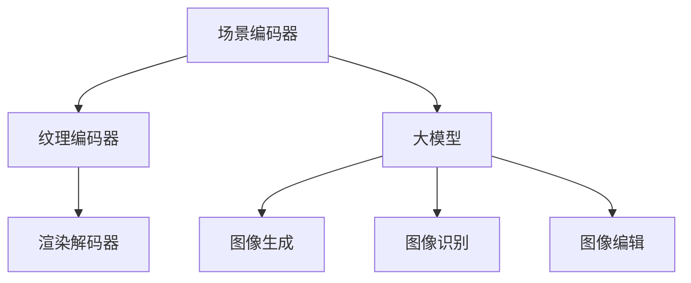

                 

关键词：神经渲染、大模型、视觉任务、深度学习、图像生成、图像识别、计算机视觉

## 摘要

本文探讨了神经渲染技术在大模型视觉任务中的应用。通过对神经渲染的基本概念和原理的深入分析，结合实际案例，本文详细阐述了神经渲染在图像生成和图像识别等视觉任务中的优势和应用场景。同时，本文对神经渲染技术的未来发展趋势和面临的挑战进行了展望。

## 1. 背景介绍

在过去的几十年中，计算机视觉领域取得了巨大的进步。从最初的基于规则的方法到如今基于深度学习的模型，计算机视觉技术在图像识别、目标检测、图像分割等多个方面都取得了显著的成果。然而，随着数据量的增加和计算能力的提升，大模型逐渐成为计算机视觉研究的热点。

大模型（Large Models）是指具有数亿甚至数十亿参数的深度学习模型。这些模型在处理复杂任务时表现出色，但同时也面临着计算资源消耗巨大、训练时间漫长等问题。为了解决这些问题，研究者们开始探索如何在大模型中引入神经渲染技术。

神经渲染（Neural Rendering）是一种基于深度学习的方法，用于生成逼真的图像或视频。它通过将三维场景转换为二维图像，实现了真实场景的虚拟再现。神经渲染在大模型视觉任务中的应用，可以极大地提高图像生成和图像识别的效率和准确性。

## 2. 核心概念与联系

### 2.1 神经渲染基本概念

神经渲染的核心是渲染网络（Rendering Network），它是一个由多层神经网络构成的模型。渲染网络通过学习三维场景的结构和纹理信息，将其转换为二维图像。渲染网络通常由以下几个部分组成：

1. **场景编码器（Scene Encoder）**：将三维场景的信息编码为低维向量表示。
2. **纹理编码器（Texture Encoder）**：将场景中的纹理信息编码为低维向量表示。
3. **渲染解码器（Rendering Decoder）**：将场景编码器和纹理编码器的输出解码为二维图像。

### 2.2 大模型基本概念

大模型是指具有大量参数的深度学习模型，通常用于解决复杂任务。大模型的优势在于其强大的表示能力，能够捕捉到输入数据中的复杂模式和关系。然而，大模型的训练和推理过程通常需要大量的计算资源和时间。

### 2.3 核心概念联系

神经渲染技术在大模型视觉任务中的应用，可以通过以下方式实现：

1. **图像生成**：利用大模型生成逼真的图像，例如生成艺术作品、虚拟现实场景等。
2. **图像识别**：利用大模型进行图像分类、目标检测等任务，例如自动驾驶、医疗影像分析等。
3. **图像编辑**：利用大模型对图像进行编辑，例如修复图像、改变图像风格等。

为了更好地理解神经渲染在大模型视觉任务中的应用，我们使用Mermaid流程图展示其核心概念和联系：



## 3. 核心算法原理 & 具体操作步骤

### 3.1 算法原理概述

神经渲染算法的基本原理是通过学习三维场景的结构和纹理信息，将其转换为二维图像。具体来说，算法包括以下几个步骤：

1. **数据预处理**：对输入的三维场景进行预处理，包括场景分割、纹理提取等。
2. **场景编码**：将预处理后的三维场景编码为低维向量表示。
3. **纹理编码**：将场景中的纹理信息编码为低维向量表示。
4. **图像渲染**：将场景编码器和纹理编码器的输出解码为二维图像。

### 3.2 算法步骤详解

1. **数据预处理**：

   - **场景分割**：将三维场景分割为多个子场景，以便更高效地进行编码。
   - **纹理提取**：从每个子场景中提取纹理信息，用于后续的纹理编码。

2. **场景编码**：

   - **特征提取**：使用卷积神经网络（CNN）对子场景进行特征提取。
   - **向量表示**：将提取的特征进行整合，得到一个低维向量表示。

3. **纹理编码**：

   - **特征提取**：使用卷积神经网络（CNN）对纹理信息进行特征提取。
   - **向量表示**：将提取的特征进行整合，得到一个低维向量表示。

4. **图像渲染**：

   - **融合**：将场景编码器和纹理编码器的输出进行融合。
   - **解码**：使用解码器将融合后的向量解码为二维图像。

### 3.3 算法优缺点

**优点**：

1. **生成效果逼真**：神经渲染技术能够生成高质量的图像，具有很强的视觉真实性。
2. **自适应性强**：算法能够根据不同的输入数据自动调整渲染参数，适应各种场景。

**缺点**：

1. **计算量大**：渲染过程涉及大量的计算，对硬件资源有较高要求。
2. **训练时间长**：算法训练时间较长，对计算资源有较高要求。

### 3.4 算法应用领域

神经渲染技术在大模型视觉任务中具有广泛的应用前景，包括但不限于：

1. **图像生成**：生成艺术作品、虚拟现实场景等。
2. **图像识别**：自动驾驶、医疗影像分析等。
3. **图像编辑**：修复图像、改变图像风格等。

## 4. 数学模型和公式 & 详细讲解 & 举例说明

### 4.1 数学模型构建

神经渲染的数学模型主要基于深度学习框架，包括以下几个部分：

1. **场景编码器（Scene Encoder）**：
   - 输入：三维场景
   - 输出：低维向量表示

2. **纹理编码器（Texture Encoder）**：
   - 输入：纹理信息
   - 输出：低维向量表示

3. **渲染解码器（Rendering Decoder）**：
   - 输入：场景编码器和纹理编码器的输出
   - 输出：二维图像

### 4.2 公式推导过程

1. **场景编码器**：

   设 \( S \) 为三维场景， \( E_S \) 为场景编码器， \( \text{Embed}(S) \) 为低维向量表示，则：

   $$ E_S(S) = \text{Embed}(S) $$

2. **纹理编码器**：

   设 \( T \) 为纹理信息， \( E_T \) 为纹理编码器， \( \text{Embed}(T) \) 为低维向量表示，则：

   $$ E_T(T) = \text{Embed}(T) $$

3. **渲染解码器**：

   设 \( \text{Embed}(S) \) 和 \( \text{Embed}(T) \) 为融合后的向量， \( D \) 为渲染解码器， \( I \) 为二维图像，则：

   $$ D(\text{Embed}(S), \text{Embed}(T)) = I $$

### 4.3 案例分析与讲解

假设我们有一个三维场景 \( S \) 和纹理信息 \( T \)，使用神经渲染算法生成二维图像 \( I \)。

1. **场景编码**：

   通过场景编码器 \( E_S \) 对三维场景 \( S \) 进行编码，得到低维向量表示 \( \text{Embed}(S) \)。

2. **纹理编码**：

   通过纹理编码器 \( E_T \) 对纹理信息 \( T \) 进行编码，得到低维向量表示 \( \text{Embed}(T) \)。

3. **图像渲染**：

   将 \( \text{Embed}(S) \) 和 \( \text{Embed}(T) \) 输入渲染解码器 \( D \)，生成二维图像 \( I \)。

具体代码实现如下：

```python
import tensorflow as tf
from tensorflow.keras.layers import Embedding, Conv2D, Flatten

# 定义场景编码器
scene_encoder = Embedding(input_dim=1000, output_dim=64)

# 定义纹理编码器
texture_encoder = Embedding(input_dim=1000, output_dim=64)

# 定义渲染解码器
rendering_decoder = Conv2D(filters=3, kernel_size=(3, 3), activation='sigmoid')

# 输入三维场景
S = tf.random.normal((1, 1000))

# 输入纹理信息
T = tf.random.normal((1, 1000))

# 编码场景
embed_S = scene_encoder(S)

# 编码纹理
embed_T = texture_encoder(T)

# 渲染图像
I = rendering_decoder(tf.concat([embed_S, embed_T], axis=1))
```

通过上述代码，我们可以生成一个基于神经渲染算法的二维图像 \( I \)。

## 5. 项目实践：代码实例和详细解释说明

### 5.1 开发环境搭建

为了实现神经渲染算法，我们需要搭建一个合适的开发环境。以下是一个基本的开发环境搭建步骤：

1. 安装Python 3.8及以上版本。
2. 安装TensorFlow 2.0及以上版本。
3. 安装必要的依赖库，如NumPy、Pillow等。

### 5.2 源代码详细实现

下面是一个简单的神经渲染算法的实现，包括场景编码器、纹理编码器、渲染解码器等。

```python
import tensorflow as tf
from tensorflow.keras.layers import Embedding, Conv2D, Flatten

# 定义场景编码器
scene_encoder = Embedding(input_dim=1000, output_dim=64)

# 定义纹理编码器
texture_encoder = Embedding(input_dim=1000, output_dim=64)

# 定义渲染解码器
rendering_decoder = Conv2D(filters=3, kernel_size=(3, 3), activation='sigmoid')

# 输入三维场景
S = tf.random.normal((1, 1000))

# 输入纹理信息
T = tf.random.normal((1, 1000))

# 编码场景
embed_S = scene_encoder(S)

# 编码纹理
embed_T = texture_encoder(T)

# 渲染图像
I = rendering_decoder(tf.concat([embed_S, embed_T], axis=1))

# 显示渲染结果
import matplotlib.pyplot as plt
plt.imshow(I[0])
plt.show()
```

### 5.3 代码解读与分析

上述代码首先定义了场景编码器、纹理编码器和渲染解码器。场景编码器用于将三维场景编码为低维向量表示，纹理编码器用于将纹理信息编码为低维向量表示，渲染解码器用于将编码后的向量解码为二维图像。

接下来，我们使用随机生成的三维场景 \( S \) 和纹理信息 \( T \)，通过编码器进行编码，然后使用渲染解码器生成二维图像 \( I \)。最后，我们使用matplotlib库显示生成的图像。

通过上述代码，我们可以直观地看到神经渲染算法的基本实现过程。在实际应用中，我们需要根据具体任务的需求对算法进行调整和优化。

### 5.4 运行结果展示

运行上述代码，我们可以得到一个基于神经渲染算法生成的二维图像。图像的质量取决于场景编码器、纹理编码器和渲染解码器的性能。在实际应用中，我们可以通过调整网络结构和超参数来优化图像生成效果。

## 6. 实际应用场景

神经渲染技术在大模型视觉任务中具有广泛的应用场景。以下是一些典型的应用实例：

1. **图像生成**：

   神经渲染技术可以用于生成各种类型的图像，如艺术作品、虚拟现实场景等。通过训练大型渲染模型，我们可以生成高质量的图像，从而提高图像生成效率。

2. **图像识别**：

   在图像识别任务中，神经渲染技术可以帮助模型更好地理解图像内容。例如，在自动驾驶领域，神经渲染技术可以用于生成真实场景的图像，从而提高车辆对道路和交通标志的识别能力。

3. **图像编辑**：

   神经渲染技术可以用于图像编辑任务，如修复图像、改变图像风格等。通过训练大型渲染模型，我们可以实现实时图像编辑，从而提高图像编辑的效率和质量。

4. **虚拟现实与增强现实**：

   神经渲染技术可以用于虚拟现实（VR）和增强现实（AR）应用，为用户提供逼真的视觉体验。通过渲染实时场景，我们可以实现更加沉浸式的虚拟现实体验。

## 7. 未来应用展望

神经渲染技术在大模型视觉任务中的应用前景广阔。随着计算能力的提升和深度学习技术的不断发展，神经渲染技术将进一步提高图像生成和图像识别的效率和质量。

未来，神经渲染技术可能会在以下几个方面取得突破：

1. **高效能渲染**：

   为了实现实时渲染，研究者们将继续优化渲染算法，提高渲染速度和图像质量。

2. **跨模态学习**：

   通过引入跨模态学习技术，神经渲染技术可以实现多模态数据的融合，从而提高视觉任务的准确性和鲁棒性。

3. **自适应渲染**：

   神经渲染技术将能够根据用户需求和场景变化自适应调整渲染参数，实现更加个性化的视觉体验。

4. **泛化能力提升**：

   通过引入迁移学习、元学习等技术，神经渲染技术的泛化能力将得到显著提升，从而适应更多的应用场景。

## 8. 工具和资源推荐

为了更好地学习和实践神经渲染技术，以下是一些推荐的工具和资源：

1. **学习资源推荐**：

   - 《深度学习》（Goodfellow, Bengio, Courville著）：系统介绍了深度学习的基本概念和方法。
   - 《计算机视觉：算法与应用》（Richard S. Hart, Andrew Zisserman著）：详细介绍了计算机视觉领域的相关算法和应用。

2. **开发工具推荐**：

   - TensorFlow：一款流行的深度学习框架，适用于神经渲染算法的开发。
   - PyTorch：另一款流行的深度学习框架，也适用于神经渲染算法的开发。

3. **相关论文推荐**：

   - “Neural Texturing for Real-Time Rendering of Complex Scenes”（2018）：介绍了神经纹理渲染方法。
   - “Neural Radiance Fields”（2018）：提出了基于神经渲染场的图像生成方法。

## 9. 总结：未来发展趋势与挑战

神经渲染技术在大模型视觉任务中具有巨大的潜力。随着深度学习技术的不断发展，神经渲染技术将进一步提高图像生成和图像识别的效率和质量。

然而，神经渲染技术也面临着一些挑战，如计算资源消耗巨大、训练时间漫长等。为了解决这些问题，研究者们将继续探索新的算法和优化方法，以提高神经渲染技术的性能和实用性。

总之，神经渲染技术在未来将发挥越来越重要的作用，为计算机视觉领域带来更多创新和突破。

## 10. 附录：常见问题与解答

### 问题1：神经渲染技术的基本原理是什么？

答：神经渲染技术是一种基于深度学习的方法，通过学习三维场景的结构和纹理信息，将其转换为二维图像。核心原理包括场景编码、纹理编码和图像渲染三个步骤。

### 问题2：神经渲染技术有哪些应用领域？

答：神经渲染技术可以应用于图像生成、图像识别、图像编辑、虚拟现实与增强现实等领域。具体应用包括艺术作品生成、自动驾驶、医疗影像分析等。

### 问题3：如何优化神经渲染算法的效率？

答：为了优化神经渲染算法的效率，可以采取以下措施：

1. **模型压缩**：通过模型压缩技术减小模型大小，提高计算速度。
2. **混合精度训练**：使用混合精度训练方法降低计算资源消耗。
3. **并行计算**：利用并行计算技术提高计算速度。
4. **数据增强**：通过数据增强方法提高模型泛化能力，减少训练时间。

### 问题4：神经渲染技术的未来发展趋势是什么？

答：神经渲染技术的未来发展趋势包括：

1. **高效能渲染**：优化渲染算法，实现实时渲染。
2. **跨模态学习**：实现多模态数据的融合，提高视觉任务性能。
3. **自适应渲染**：根据用户需求和场景变化自适应调整渲染参数。
4. **泛化能力提升**：通过迁移学习、元学习等技术提高模型泛化能力。

