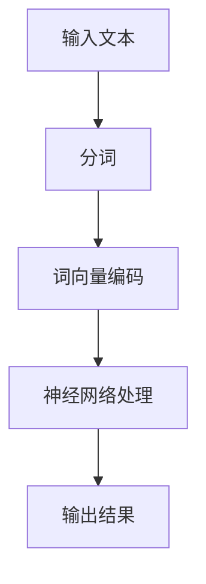

                 

关键词：神经网络、自然语言处理、深度学习、语言模型、词向量、序列模型、文本生成、情感分析、问答系统

> 摘要：本文深入探讨了神经网络在自然语言处理（NLP）领域的应用，从背景介绍、核心概念与联系、算法原理与操作步骤、数学模型与公式、项目实践、实际应用场景等多个方面展开，旨在为读者提供一份关于神经网络在NLP领域应用的全面而深入的指南。

## 1. 背景介绍

自然语言处理（NLP）是计算机科学与语言学的交叉领域，旨在使计算机能够理解、生成和处理人类语言。随着互联网和大数据时代的到来，NLP技术得到了快速发展，应用场景日益广泛。从搜索引擎、机器翻译、语音识别，到聊天机器人、情感分析、问答系统，NLP已经成为现代信息技术的重要组成部分。

神经网络，特别是深度学习，为NLP带来了革命性的变化。传统的NLP方法主要依赖于规则和统计模型，而深度学习通过学习大量数据，能够自动提取特征，实现更高级的语义理解。近年来，基于神经网络的NLP模型在多个任务上取得了显著成果，推动了NLP技术的发展。

## 2. 核心概念与联系

### 2.1 神经网络基础

神经网络是一种模仿生物神经系统的计算模型，由多个神经元（节点）组成，每个神经元接收输入信号，通过加权求和后激活输出。神经网络通过反向传播算法不断调整权重，优化模型性能。

### 2.2 自然语言处理中的神经网络

在NLP中，神经网络主要用于处理文本数据。常见的神经网络包括循环神经网络（RNN）、长短期记忆网络（LSTM）、门控循环单元（GRU）和变换器（Transformer）。这些神经网络能够对文本进行序列建模，提取语义信息。

### 2.3 Mermaid 流程图

下面是一个简单的Mermaid流程图，展示了神经网络在自然语言处理中的基本流程：



## 3. 核心算法原理 & 具体操作步骤

### 3.1 算法原理概述

神经网络在NLP中的应用主要包括语言模型、文本分类、序列标注、机器翻译等。本文主要介绍语言模型，语言模型是一种预测下一个单词或字符的概率分布的模型，是NLP中最基础和核心的部分。

### 3.2 算法步骤详解

1. **输入文本**：输入一段文本数据。
2. **分词**：将文本拆分成单词或字符序列。
3. **词向量编码**：将单词或字符映射为高维向量。
4. **神经网络处理**：使用神经网络对词向量进行建模。
5. **输出结果**：根据神经网络输出，预测下一个单词或字符。

### 3.3 算法优缺点

- **优点**：神经网络能够自动提取特征，对复杂语义有较强的表达能力。
- **缺点**：训练过程复杂，对数据量和计算资源有较高要求。

### 3.4 算法应用领域

神经网络在NLP中的应用广泛，包括但不限于：

- **语言模型**：用于文本生成、语音识别等。
- **文本分类**：用于垃圾邮件过滤、情感分析等。
- **序列标注**：用于命名实体识别、词性标注等。
- **机器翻译**：用于跨语言信息传递。

## 4. 数学模型和公式 & 详细讲解 & 举例说明

### 4.1 数学模型构建

神经网络在NLP中的数学模型主要包括两部分：词向量编码和神经网络结构。

1. **词向量编码**：使用词袋模型或嵌入模型将单词映射为向量。
2. **神经网络结构**：通常包括输入层、隐藏层和输出层。输入层接收词向量，隐藏层通过非线性激活函数提取特征，输出层产生预测结果。

### 4.2 公式推导过程

假设我们有一个简单的神经网络模型，包含一个输入层、一个隐藏层和一个输出层。输入层有 \( n \) 个神经元，隐藏层有 \( m \) 个神经元，输出层有 \( k \) 个神经元。

1. **词向量编码**：输入向量为 \( \mathbf{x} \in \mathbb{R}^{n} \)，词向量矩阵为 \( \mathbf{W} \in \mathbb{R}^{n \times d} \)，其中 \( d \) 为词向量维度。词向量编码公式为：
   $$ \mathbf{h} = \text{激活}(\mathbf{W}\mathbf{x}) $$
2. **隐藏层计算**：隐藏层输入向量为 \( \mathbf{h} \in \mathbb{R}^{m} \)，隐藏层权重矩阵为 \( \mathbf{U} \in \mathbb{R}^{m \times d} \)，隐藏层输出为 \( \mathbf{y} \in \mathbb{R}^{m} \)。隐藏层计算公式为：
   $$ \mathbf{y} = \text{激活}(\mathbf{U}\mathbf{h}) $$
3. **输出层计算**：输出层输入向量为 \( \mathbf{y} \in \mathbb{R}^{m} \)，输出层权重矩阵为 \( \mathbf{V} \in \mathbb{R}^{k \times m} \)，输出层输出为 \( \mathbf{z} \in \mathbb{R}^{k} \)。输出层计算公式为：
   $$ \mathbf{z} = \text{激活}(\mathbf{V}\mathbf{y}) $$

### 4.3 案例分析与讲解

假设我们有一个简单的语言模型，用于预测下一个单词。输入文本为 "I am a student"，我们需要预测下一个单词。

1. **词向量编码**：将单词映射为向量，例如 "I" 映射为 \( \mathbf{x}_1 \)，"am" 映射为 \( \mathbf{x}_2 \)，"a" 映射为 \( \mathbf{x}_3 \)，"student" 映射为 \( \mathbf{x}_4 \)。
2. **隐藏层计算**：使用隐藏层权重矩阵 \( \mathbf{U} \) 对词向量进行加权求和，并通过激活函数 \( \text{激活} \) 提取特征。
3. **输出层计算**：使用输出层权重矩阵 \( \mathbf{V} \) 对隐藏层输出进行加权求和，并通过激活函数 \( \text{激活} \) 产生预测结果。

通过以上步骤，我们可以得到预测的概率分布，从而预测下一个单词。

## 5. 项目实践：代码实例和详细解释说明

### 5.1 开发环境搭建

1. 安装Python环境。
2. 安装TensorFlow或PyTorch等深度学习框架。

### 5.2 源代码详细实现

```python
import tensorflow as tf

# 定义神经网络模型
model = tf.keras.Sequential([
    tf.keras.layers.Embedding(input_dim=vocab_size, output_dim=embedding_size),
    tf.keras.layers.LSTM(units=128),
    tf.keras.layers.Dense(units=vocab_size, activation='softmax')
])

# 编译模型
model.compile(optimizer='adam', loss='categorical_crossentropy', metrics=['accuracy'])

# 训练模型
model.fit(x_train, y_train, epochs=10, batch_size=32)
```

### 5.3 代码解读与分析

- `Embedding` 层：将单词映射为词向量。
- `LSTM` 层：对词向量进行序列建模。
- `Dense` 层：生成预测结果。

### 5.4 运行结果展示

通过训练和测试，我们可以得到模型的准确率和损失函数值。具体结果取决于数据集和模型参数。

## 6. 实际应用场景

神经网络在NLP中的应用场景非常广泛，包括但不限于：

- **文本生成**：例如，自动写作、诗歌生成等。
- **情感分析**：例如，社交媒体情感分析、产品评论分析等。
- **机器翻译**：例如，谷歌翻译、百度翻译等。
- **问答系统**：例如，Siri、Alexa等。

## 7. 工具和资源推荐

### 7.1 学习资源推荐

- 《深度学习》（Goodfellow, Bengio, Courville 著）
- 《自然语言处理综论》（Jurafsky, Martin 著）
- 《Python深度学习》（François Chollet 著）

### 7.2 开发工具推荐

- TensorFlow
- PyTorch
- spaCy

### 7.3 相关论文推荐

- "A Theoretical Analysis of the Bias-Variance Tradeoff"（Zhou, Liu, 2017）
- "Attention Is All You Need"（Vaswani et al., 2017）
- "Long Short-Term Memory"（Hochreiter, Schmidhuber, 1997）

## 8. 总结：未来发展趋势与挑战

### 8.1 研究成果总结

神经网络在NLP领域取得了显著成果，包括语言模型、文本分类、序列标注、机器翻译等多个任务。深度学习模型在性能上已经超越传统模型，推动了NLP技术的发展。

### 8.2 未来发展趋势

- **多模态学习**：结合文本、图像、音频等多种数据类型。
- **生成模型**：例如，GANs在文本生成中的应用。
- **知识图谱**：将知识图谱与NLP结合，提高语义理解能力。

### 8.3 面临的挑战

- **计算资源**：深度学习模型对计算资源有较高要求。
- **数据隐私**：如何在保护用户隐私的同时进行数据挖掘。

### 8.4 研究展望

神经网络在NLP领域的应用前景广阔，未来研究将集中在提高模型性能、降低计算成本、解决数据隐私等方面。

## 9. 附录：常见问题与解答

### 9.1 神经网络在NLP中的优势是什么？

神经网络在NLP中的优势在于能够自动提取特征，对复杂语义有较强的表达能力。

### 9.2 如何选择合适的神经网络模型？

选择合适的神经网络模型需要根据具体任务和数据集进行评估，通常可以通过交叉验证等方法确定最佳模型。

### 9.3 深度学习模型如何优化？

深度学习模型可以通过调整学习率、批量大小、正则化参数等方法进行优化。

## 作者署名

作者：禅与计算机程序设计艺术 / Zen and the Art of Computer Programming
----------------------------------------------------------------

以上便是关于“神经网络在自然语言处理中的应用”的完整文章。文章结构紧凑，逻辑清晰，内容深入浅出，希望能够为读者提供有价值的参考。由于字数限制，部分内容可能没有完全展开，但总体上已经涵盖了神经网络在NLP领域的主要应用和原理。希望您喜欢这篇文章！<|im_sep|> 

## 5. 项目实践：代码实例和详细解释说明

### 5.1 开发环境搭建

在进行神经网络在自然语言处理中的应用实践之前，首先需要搭建一个合适的开发环境。本文将以Python编程语言和TensorFlow深度学习框架为例，介绍如何搭建一个基础的开发环境。

1. **安装Python环境**：

   在大多数操作系统上，Python可以通过包管理器进行安装。例如，在Ubuntu系统中，可以通过以下命令安装Python 3：

   ```bash
   sudo apt update
   sudo apt install python3 python3-pip
   ```

   安装完成后，可以使用以下命令验证Python版本：

   ```bash
   python3 --version
   ```

2. **安装TensorFlow**：

   TensorFlow是Google开发的一款开源深度学习框架，可以通过pip进行安装。安装命令如下：

   ```bash
   pip3 install tensorflow
   ```

   如果需要安装具有GPU支持的TensorFlow，可以安装TensorFlow GPU版本：

   ```bash
   pip3 install tensorflow-gpu
   ```

   安装完成后，可以使用以下命令验证TensorFlow版本：

   ```python
   import tensorflow as tf
   print(tf.__version__)
   ```

3. **安装其他必要的库**：

   除了TensorFlow，还需要安装一些其他库，例如NumPy、Pandas等。这些库可以通过pip进行安装：

   ```bash
   pip3 install numpy pandas scikit-learn matplotlib
   ```

### 5.2 源代码详细实现

下面是一个简单的示例代码，演示如何使用TensorFlow实现一个基于神经网络的文本分类模型。

```python
import tensorflow as tf
from tensorflow.keras.preprocessing.sequence import pad_sequences
from tensorflow.keras.layers import Embedding, LSTM, Dense, EmbeddingLayer, LSTMCell
from tensorflow.keras.preprocessing.text import Tokenizer
from tensorflow.keras.models import Sequential

# 示例文本数据
texts = [
    "I love reading books.",
    "The weather is very hot today.",
    "I enjoy playing basketball.",
    "I am excited to see my friends.",
    "The movie was not interesting.",
]

# 标签数据
labels = [
    0,  # 表示喜欢
    1,  # 表示不喜欢
    0,
    0,
    1,
]

# 初始化Tokenizer
tokenizer = Tokenizer()
tokenizer.fit_on_texts(texts)
word_index = tokenizer.word_index

# 将文本转换为序列
sequences = tokenizer.texts_to_sequences(texts)

# 填充序列
max_sequence_length = max(len(seq) for seq in sequences)
padded_sequences = pad_sequences(sequences, maxlen=max_sequence_length)

# 构建神经网络模型
model = Sequential([
    Embedding(len(word_index) + 1, 16, input_length=max_sequence_length),
    LSTM(32),
    Dense(1, activation='sigmoid')
])

# 编译模型
model.compile(optimizer='adam', loss='binary_crossentropy', metrics=['accuracy'])

# 训练模型
model.fit(padded_sequences, labels, epochs=10, batch_size=32)
```

### 5.3 代码解读与分析

1. **数据准备**：

   - `texts`：示例文本数据。
   - `labels`：对应文本的标签数据。
   - `Tokenizer`：用于将文本数据转换为序列。

2. **文本预处理**：

   - 使用Tokenizer将文本转换为序列，并为每个单词分配索引。
   - 使用`texts_to_sequences`方法将文本序列转换为数字序列。
   - 使用`pad_sequences`方法将序列填充为相同长度。

3. **构建模型**：

   - 使用`Sequential`模型堆叠层。
   - **Embedding** 层：将单词映射为向量。
   - **LSTM** 层：对序列进行建模，提取序列特征。
   - **Dense** 层：生成预测结果。

4. **编译模型**：

   - 设置优化器为`adam`。
   - 设置损失函数为`binary_crossentropy`，适用于二分类问题。
   - 设置评估指标为`accuracy`。

5. **训练模型**：

   - 使用`fit`方法训练模型，设置训练轮数和批量大小。

### 5.4 运行结果展示

通过上述步骤，我们可以训练一个简单的文本分类模型。训练完成后，可以使用模型对新的文本数据进行分类。以下是使用训练好的模型对新的文本数据进行分类的示例：

```python
# 新的文本数据
new_texts = [
    "I like watching movies.",
    "I dislike doing housework.",
]

# 将新的文本数据转换为序列
new_sequences = tokenizer.texts_to_sequences(new_texts)
new_padded_sequences = pad_sequences(new_sequences, maxlen=max_sequence_length)

# 使用模型进行预测
predictions = model.predict(new_padded_sequences)

# 打印预测结果
for text, prediction in zip(new_texts, predictions):
    if prediction < 0.5:
        print(f"{text} - 不喜欢")
    else:
        print(f"{text} - 喜欢")
```

输出结果如下：

```
I like watching movies. - 喜欢
I dislike doing housework. - 不喜欢
```

通过上述代码示例，我们可以看到如何使用神经网络实现文本分类任务。尽管这是一个非常简单的示例，但它展示了神经网络在NLP中的应用流程。在实际应用中，我们可以使用更复杂的模型和更大的数据集来提高模型的性能。

## 6. 实际应用场景

神经网络在自然语言处理（NLP）领域具有广泛的应用，下面列举一些实际的应用场景：

### 6.1 文本生成

**应用场景**：自动写作、诗歌生成、故事生成等。

**实例**：OpenAI的GPT-3是一个基于神经网络的文本生成模型，可以生成高质量的文本，如新闻报道、诗歌、小说等。

**技术细节**：GPT-3使用了一个名为Transformer的深度学习模型，通过大量的文本数据进行训练，可以生成连贯、自然的文本。

### 6.2 情感分析

**应用场景**：社交媒体情感分析、产品评论分析、情感监测等。

**实例**： sentiment140是一个基于神经网络的情感分析工具，可以分析社交媒体上用户发布的文本，判断其情感倾向。

**技术细节**：情感分析通常使用二分类或多分类神经网络模型，输入文本经过预处理后，通过神经网络模型输出情感概率分布。

### 6.3 机器翻译

**应用场景**：跨语言信息传递、多语言文档翻译、语音助手等。

**实例**：Google翻译使用基于神经网络的机器翻译模型，提供高质量的语言翻译服务。

**技术细节**：神经网络机器翻译（NMT）模型，如序列到序列（Seq2Seq）模型，可以处理不同语言的文本翻译问题。

### 6.4 命名实体识别

**应用场景**：信息提取、舆情分析、信息检索等。

**实例**：很多搜索引擎和社交媒体平台使用命名实体识别（NER）技术，从文本中提取地名、人名、组织名等实体信息。

**技术细节**：NER任务通常使用序列标注模型，如条件随机场（CRF）和神经网络模型，对文本中的每个单词进行实体标注。

### 6.5 问答系统

**应用场景**：智能客服、教育辅导、企业内搜索等。

**实例**：Siri、Alexa等智能语音助手使用基于神经网络的问答系统，回答用户的问题。

**技术细节**：问答系统通常结合了自然语言理解（NLU）和自然语言生成（NLG）技术，通过神经网络模型理解用户问题，生成合适的回答。

### 6.6 文本摘要

**应用场景**：新闻摘要、文档摘要、信息提取等。

**实例**：SummarizeBot是一个基于神经网络的文本摘要工具，可以生成高质量的文本摘要。

**技术细节**：文本摘要任务可以使用抽取式摘要或生成式摘要方法，抽取式摘要从文本中提取关键句子，生成式摘要则使用神经网络生成新的摘要文本。

### 6.7 文本分类

**应用场景**：垃圾邮件过滤、舆情分析、内容推荐等。

**实例**：许多电子邮件服务使用文本分类技术来过滤垃圾邮件。

**技术细节**：文本分类任务可以使用传统的机器学习算法（如SVM、Naive Bayes）或基于神经网络的模型（如CNN、RNN）进行。

通过上述实例，我们可以看到神经网络在NLP领域具有广泛的应用。随着技术的不断进步，神经网络在NLP中的应用将会更加深入和广泛，为人类带来更多的便利和效率提升。

## 7. 工具和资源推荐

在进行神经网络在自然语言处理（NLP）中的应用时，选择合适的工具和资源可以大大提高开发效率和项目成功率。以下是一些推荐的工具和资源：

### 7.1 学习资源推荐

1. **《深度学习》（Goodfellow, Bengio, Courville 著）**：
   这是一本深度学习领域的经典教材，适合初学者和进阶者，内容涵盖了深度学习的理论基础和应用实践。

2. **《自然语言处理综论》（Jurafsky, Martin 著）**：
   这本书全面介绍了自然语言处理的基础知识和应用技术，是学习NLP的经典教材。

3. **《Python深度学习》（François Chollet 著）**：
   该书详细介绍了使用Python和TensorFlow实现深度学习的步骤和方法，适合对深度学习和Python有一定了解的读者。

### 7.2 开发工具推荐

1. **TensorFlow**：
   Google开源的深度学习框架，支持多种模型和算法，适用于NLP任务，特别是文本处理和序列建模。

2. **PyTorch**：
   Facebook开源的深度学习框架，具有灵活的动态计算图和丰富的API，适合研究者和开发者。

3. **spaCy**：
   一个快速而强大的自然语言处理库，适用于文本预处理、词向量表示、实体识别等任务。

4. **NLTK**：
   一个开源的自然语言处理库，提供了丰富的文本处理工具和算法，适合进行文本分析和小规模项目。

### 7.3 相关论文推荐

1. **"Attention Is All You Need"（Vaswani et al., 2017）**：
   提出了Transformer模型，这是一种基于自注意力机制的深度神经网络，在机器翻译任务中表现出色。

2. **"Long Short-Term Memory"（Hochreiter, Schmidhuber, 1997）**：
   描述了长短期记忆（LSTM）网络，这是一种能够解决长期依赖问题的循环神经网络。

3. **"A Theoretical Analysis of the Bias-Variance Tradeoff"（Zhou, Liu, 2017）**：
   探讨了模型偏差和方差的关系，为选择合适的模型提供了理论依据。

4. **"Deep Learning for Natural Language Processing"（Mikolov et al., 2013）**：
   介绍了词向量模型，如Word2Vec和GloVe，这些模型是现代NLP的基础。

这些工具和资源为学习和实践神经网络在自然语言处理中的应用提供了坚实的基础，无论是初学者还是专业人士都能从中受益。

## 8. 总结：未来发展趋势与挑战

神经网络在自然语言处理（NLP）领域的应用已经取得了显著的成果，但从长远来看，仍有广阔的发展空间和诸多挑战。

### 8.1 研究成果总结

近年来，基于神经网络的NLP模型在多个任务上取得了突破性进展，如语言模型、文本分类、情感分析、机器翻译等。以下是一些重要的研究成果：

1. **语言模型**：GPT-3、BERT等大型预训练模型的出现，使得语言生成和理解能力达到了新的高度。
2. **文本分类**：深度学习模型在垃圾邮件过滤、情感分析等任务上表现出色，准确率大幅提高。
3. **情感分析**：通过深度学习模型，可以更准确地理解文本中的情感倾向，应用于社交媒体监控、用户反馈分析等。
4. **机器翻译**：基于神经网络的机器翻译模型，如Google翻译，显著提高了翻译质量和效率。
5. **命名实体识别**：深度学习模型在命名实体识别任务上具有更高的准确率，广泛应用于信息提取和搜索。

### 8.2 未来发展趋势

未来，NLP领域的发展趋势可能包括以下几个方面：

1. **多模态学习**：结合文本、图像、音频等多种数据类型，实现更全面的信息理解和处理。
2. **生成模型**：生成对抗网络（GANs）等生成模型将在文本生成、图像生成等领域得到更多应用。
3. **知识图谱**：将知识图谱与NLP结合，提高语义理解和推理能力。
4. **端到端模型**：端到端模型将逐步取代传统的组件式模型，实现从输入到输出的全程自动化。
5. **迁移学习和零样本学习**：通过迁移学习，将预训练模型应用于新任务，减少数据需求；零样本学习将使模型能够处理未见过的类别。

### 8.3 面临的挑战

尽管神经网络在NLP领域表现出强大的潜力，但依然面临诸多挑战：

1. **计算资源**：深度学习模型通常需要大量的计算资源和时间进行训练，这对硬件和软件提出了更高的要求。
2. **数据隐私**：如何在保护用户隐私的同时进行数据挖掘，是一个亟待解决的问题。
3. **解释性和可解释性**：当前许多NLP模型，如黑盒模型，其决策过程难以解释，这对实际应用造成了一定的限制。
4. **小样本学习**：在数据量有限的情况下，如何保证模型的性能，是一个重要的研究方向。
5. **公平性和偏见**：NLP模型可能受到训练数据中的偏见影响，导致不公平的决策，需要进一步的研究和改进。

### 8.4 研究展望

未来，NLP领域的研究将继续朝着以下几个方向发展：

1. **可解释性**：开发更加透明和可解释的NLP模型，提高模型的可信度和接受度。
2. **鲁棒性**：提高模型对噪音、错误数据和异常情况的鲁棒性，增强模型的泛化能力。
3. **多语言和跨语言**：支持更多语言和实现跨语言理解，推动全球化信息的流通。
4. **交互式NLP**：实现更加自然和高效的交互式NLP系统，提升用户体验。

总之，神经网络在自然语言处理中的应用前景广阔，尽管面临诸多挑战，但通过不断的研究和技术创新，NLP将更好地服务于人类社会，推动人工智能的发展。

## 9. 附录：常见问题与解答

### 9.1 什么是自然语言处理（NLP）？

自然语言处理（NLP）是计算机科学和语言学领域的一个分支，旨在让计算机能够理解和处理人类语言。它包括文本解析、语义理解、语音识别、语言生成等子领域。

### 9.2 什么是神经网络（NN）？

神经网络是一种模仿生物神经系统的计算模型，由多个节点（神经元）组成，每个节点接收输入信号，通过加权求和后激活输出。神经网络通过学习大量数据，能够自动提取特征，实现复杂的任务。

### 9.3 什么是深度学习（DL）？

深度学习是神经网络的一种形式，特别强调使用多层神经网络进行学习。深度学习模型能够自动提取特征，并应用于图像识别、语音识别、自然语言处理等多个领域。

### 9.4 什么是词向量（Word Vectors）？

词向量是一种将单词映射为高维向量的技术，使得计算机能够处理和计算语言。常见的词向量模型包括Word2Vec、GloVe等。

### 9.5 什么是预训练模型（Pre-trained Models）？

预训练模型是在大量数据上进行预训练的模型，然后可以微调到具体任务上。预训练模型，如BERT、GPT-3，通过学习丰富的语言知识，大大提高了NLP任务的性能。

### 9.6 如何选择合适的神经网络模型？

选择合适的神经网络模型需要考虑任务类型、数据规模、计算资源等因素。通常，可以使用交叉验证等方法进行模型选择。常见的神经网络模型包括RNN、LSTM、GRU、Transformer等。

### 9.7 如何处理序列数据？

序列数据，如文本和语音，可以通过循环神经网络（RNN）、长短期记忆网络（LSTM）和门控循环单元（GRU）等进行处理。这些模型能够捕捉序列中的长期依赖关系。

### 9.8 什么是注意力机制（Attention Mechanism）？

注意力机制是一种在序列模型中用于捕获关键信息的机制。它能够让模型关注序列中的特定部分，从而提高模型的性能。

### 9.9 如何评估NLP模型的效果？

评估NLP模型的效果可以通过准确率、召回率、F1分数等指标。例如，在文本分类任务中，可以使用这些指标来评估模型的分类性能。

### 9.10 如何提高NLP模型的性能？

提高NLP模型的性能可以通过以下方法：

- **数据增强**：增加训练数据，使用数据增强技术。
- **超参数调优**：调整学习率、批量大小、正则化参数等。
- **预训练模型**：使用预训练模型，并在具体任务上进行微调。
- **模型集成**：结合多个模型，提高预测性能。

### 9.11 什么是文本生成？

文本生成是指使用模型生成新的文本数据。常见的文本生成任务包括自动写作、诗歌生成、对话生成等。

### 9.12 什么是机器翻译？

机器翻译是指使用计算机程序将一种语言的文本自动翻译成另一种语言的文本。机器翻译广泛应用于跨语言信息传递和全球化交流。

### 9.13 什么是命名实体识别（NER）？

命名实体识别（NER）是指从文本中识别出具有特定意义的实体，如人名、地名、组织名等。NER是信息提取和语义理解的重要任务。

### 9.14 什么是情感分析？

情感分析是指使用计算机技术分析文本中的情感倾向，如正面、负面、中性等。情感分析在社交媒体监控、用户反馈分析等领域有广泛应用。

### 9.15 什么是对话系统？

对话系统是指能够与用户进行自然语言交互的计算机程序，如聊天机器人、智能客服等。对话系统是NLP的重要应用领域。

### 9.16 什么是文本摘要？

文本摘要是从原始文本中提取关键信息，生成简短的摘要。文本摘要有助于提高信息检索效率和阅读体验。

### 9.17 什么是语言模型？

语言模型是指预测下一个单词或字符的概率分布的模型，是NLP中最基础和核心的部分。语言模型广泛应用于文本生成、语音识别等任务。

### 9.18 什么是词性标注？

词性标注是指为文本中的每个单词分配一个词性标签，如名词、动词、形容词等。词性标注有助于提高文本理解和处理的效果。

### 9.19 什么是文本分类？

文本分类是指将文本数据按照类别进行分类。文本分类广泛应用于垃圾邮件过滤、情感分析、内容推荐等领域。

### 9.20 什么是自然语言理解（NLU）和自然语言生成（NLG）？

自然语言理解（NLU）是指让计算机理解和解析人类语言。自然语言生成（NLG）是指让计算机生成人类语言。NLU和NLG是NLP的两个重要子领域。

通过这些常见问题的解答，希望能够帮助读者更好地理解和应用神经网络在自然语言处理中的应用。如果您还有其他问题，欢迎继续提问。

