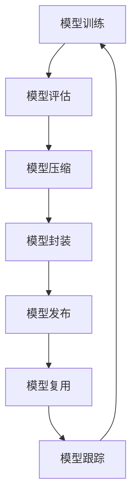

                 

### 摘要 Summary

在人工智能迅速发展的今天，神经网络模型的开发和应用成为各行各业的热门话题。如何高效地打包、发布和复用这些模型，已经成为研究人员和开发者的关注焦点。本文将深入探讨神经网络模型打包发布和复用的关键技术和策略，涵盖从模型训练到实际部署的全过程。通过介绍核心概念、算法原理、数学模型、代码实例以及实际应用场景，本文旨在为读者提供一份全面、系统的指南。文章还将展望未来发展趋势与面临的挑战，为神经网络模型的研究和应用提供新的思路。

## 1. 背景介绍 Introduction

神经网络（Neural Networks）作为一种模仿人脑工作原理的算法模型，在图像识别、自然语言处理、推荐系统等领域展现出强大的能力。近年来，随着深度学习（Deep Learning）技术的不断突破，神经网络模型的性能和适用范围得到了显著提升。然而，在模型开发和部署的过程中，如何有效地管理和复用这些模型，成为了一个关键问题。

传统的软件开发中，模块化和复用是一个重要的目标。类似地，神经网络模型的打包、发布和复用也是为了提高开发效率、降低维护成本，并确保不同应用场景之间的灵活性和可扩展性。具体来说，神经网络模型的打包是指将训练好的模型及其依赖库打包成一个可执行的文件或库，以便在不同的环境中进行部署和复用。而模型发布则是将打包后的模型上线，使其可以通过API或其他接口供外部访问和使用。复用则是指在不同项目或场景中重复使用相同的模型，以节省时间和资源。

在人工智能领域，高效的模型管理和复用不仅能加速新应用的推出，还可以提高团队协作效率，减少重复劳动。随着神经网络模型在实际应用中的不断推广，如何实现模型的标准化、模块化和高效复用，已成为一个迫切需要解决的问题。本文将围绕这一问题，详细探讨神经网络模型打包、发布和复用的技术方案和最佳实践。

### 2. 核心概念与联系 Key Concepts and Relationships

在深入探讨神经网络模型打包、发布和复用之前，我们需要先了解一些核心概念和它们之间的关系。以下是一些关键术语及其定义：

#### 模型训练（Model Training）

模型训练是指使用大量的训练数据来调整神经网络的权重和偏置，使其能够对新的数据做出准确的预测或分类。这个过程通常涉及前向传播（Forward Propagation）和反向传播（Back Propagation）等算法。

#### 模型评估（Model Evaluation）

模型评估是通过测试集来评估模型的性能。常用的评估指标包括准确率（Accuracy）、召回率（Recall）、F1 分数（F1 Score）等。评估有助于确定模型是否满足特定应用的需求，并指导后续的调整和优化。

#### 模型压缩（Model Compression）

模型压缩是指通过减小模型的规模来降低计算资源和存储需求。常见的方法包括剪枝（Pruning）、量化（Quantization）和蒸馏（Distillation）等。

#### 模型封装（Model Wrapping）

模型封装是将神经网络模型及其相关代码封装成一个独立的库或服务，以便在不同的环境中进行部署和使用。这通常涉及到模型接口的定义和封装。

#### 模型发布（Model Deployment）

模型发布是指将训练好的模型部署到生产环境中，使其可以通过API或其他接口供外部访问和使用。发布的过程包括模型的打包、服务器配置和环境设置等。

#### 模型复用（Model Repurposing）

模型复用是指在不同项目或场景中重复使用相同的模型，以节省时间和资源。复用可以通过直接部署模型，或者通过迁移学习（Transfer Learning）等方式实现。

#### 模型标准化（Model Standardization）

模型标准化是指通过定义统一的模型接口和规范，使得不同的模型可以方便地进行交换和复用。标准化有助于提高开发效率，并确保不同团队之间的协作。

#### 模型跟踪（Model Tracking）

模型跟踪是指对模型的版本、性能和依赖关系进行管理，以便在需要时进行回溯和调试。这通常涉及到版本控制和模型监控等技术。

为了更直观地理解这些概念之间的关系，我们可以使用 Mermaid 流程图来展示它们的基本架构。以下是模型的整个生命周期流程：



在这个流程图中，模型从训练开始，经过评估、压缩、封装、发布和复用等步骤，最终形成一个闭环，以便进行持续的优化和改进。通过这个流程，我们可以看到模型打包、发布和复用在整个生命周期中的关键作用。

### 2.1 核心概念与联系详细解释

接下来，我们将详细解释这些核心概念及其之间的关系，以便更好地理解神经网络模型打包、发布和复用的全过程。

**模型训练（Model Training）**

模型训练是神经网络模型开发的基础。在训练过程中，神经网络通过学习大量的训练数据，不断调整其内部参数，以实现预期的输出。具体来说，训练过程包括以下几个步骤：

1. **数据预处理（Data Preprocessing）**：在训练之前，需要对数据进行清洗、归一化和编码等预处理操作，以提高模型的学习效果。

2. **前向传播（Forward Propagation）**：在给定输入数据后，神经网络通过计算输入层、隐藏层和输出层的活动，生成预测结果。

3. **损失函数（Loss Function）**：通过计算预测结果与实际结果之间的差距，使用损失函数来衡量模型的误差。

4. **反向传播（Back Propagation）**：根据损失函数的梯度，通过反向传播算法更新网络的权重和偏置，以减小误差。

5. **优化算法（Optimization Algorithm）**：例如随机梯度下降（SGD）、Adam 算法等，用于指导权重的更新过程。

**模型评估（Model Evaluation）**

模型评估是确保模型性能的重要步骤。通过在测试集上评估模型，可以确定其是否能够准确预测或分类新的数据。常用的评估指标包括：

- **准确率（Accuracy）**：预测正确的样本数占总样本数的比例。
- **召回率（Recall）**：预测正确的正样本数占总正样本数的比例。
- **精确率（Precision）**：预测正确的正样本数占总预测为正的样本数的比例。
- **F1 分数（F1 Score）**：精确率和召回率的调和平均值。

**模型压缩（Model Compression）**

模型压缩是为了降低模型的计算和存储需求。在资源受限的环境中，如移动设备或嵌入式系统，模型压缩尤为重要。常见的模型压缩技术包括：

- **剪枝（Pruning）**：通过删除网络中的冗余连接和神经元，减少模型的规模。
- **量化（Quantization）**：将模型的权重和激活值从浮点数转换为低精度的整数表示。
- **蒸馏（Distillation）**：通过将知识从大的教师模型传递给小的学生模型，降低模型的大小。

**模型封装（Model Wrapping）**

模型封装是将神经网络模型及其相关代码封装成一个独立的库或服务，以便在不同的环境中进行部署和使用。封装的过程通常包括：

- **模型接口定义（Model Interface Definition）**：定义模型的输入和输出接口，以便外部程序可以方便地调用模型。
- **代码封装（Code Wrapping）**：将模型的训练、评估和预测等代码封装在一个独立的模块中。
- **依赖管理（Dependency Management）**：确保模型在不同环境中的一致性和可移植性。

**模型发布（Model Deployment）**

模型发布是将训练好的模型部署到生产环境中，使其可以通过API或其他接口供外部访问和使用。发布的过程通常包括：

- **模型打包（Model Packaging）**：将模型及其依赖库打包成一个可执行的文件或库。
- **服务器配置（Server Configuration）**：配置服务器和依赖库，以便模型可以正常运行。
- **环境设置（Environment Setup）**：设置模型运行的环境变量和配置文件。

**模型复用（Model Repurposing）**

模型复用是在不同项目或场景中重复使用相同的模型，以节省时间和资源。复用可以通过以下几种方式实现：

- **直接部署（Direct Deployment）**：直接部署模型到新的环境中，进行预测或分类任务。
- **迁移学习（Transfer Learning）**：在新的任务上使用部分预训练的模型，进行进一步的训练。
- **参数共享（Parameter Sharing）**：在不同项目或场景中共享模型的参数，以减少重复训练的需求。

**模型标准化（Model Standardization）**

模型标准化是通过定义统一的模型接口和规范，使得不同的模型可以方便地进行交换和复用。标准化有助于提高开发效率，并确保不同团队之间的协作。常见的标准化框架包括：

- **TensorFlow SavedModel**：TensorFlow 提供的一种模型保存和加载的标准化框架。
- **PyTorch TorchScript**：PyTorch 提供的一种模型封装和优化的标准化框架。
- **ONNX（Open Neural Network Exchange）**：一种跨框架的模型交换和复用标准。

**模型跟踪（Model Tracking）**

模型跟踪是对模型的版本、性能和依赖关系进行管理，以便在需要时进行回溯和调试。常见的模型跟踪工具包括：

- **ModelDB**：一个开源的机器学习模型跟踪平台，用于记录模型的版本、性能和依赖关系。
- **Weights & Biases**：一个用于跟踪实验和模型性能的 Web 应用程序。

通过理解这些核心概念及其之间的关系，我们可以更好地把握神经网络模型打包、发布和复用的全过程。接下来，我们将深入探讨神经网络模型的算法原理和具体操作步骤。

### 3. 核心算法原理 & 具体操作步骤 Core Algorithm Principles & Detailed Steps

在神经网络模型打包、发布和复用的过程中，核心算法的原理和具体操作步骤是至关重要的。以下将详细介绍这些算法的基本概念、操作步骤，并探讨它们的优缺点。

#### 3.1 算法原理概述

神经网络模型的核心算法包括前向传播、反向传播、损失函数优化等。这些算法共同作用，使神经网络能够从数据中学习并做出预测。

1. **前向传播（Forward Propagation）**

前向传播是指将输入数据通过神经网络的不同层进行传递，最终生成输出结果。这个过程包括以下几个步骤：

- **输入层到隐藏层**：输入数据通过权重矩阵与激活函数的变换，传递到隐藏层。
- **隐藏层到隐藏层**：隐藏层之间的数据通过权重矩阵和激活函数的变换，逐层传递。
- **隐藏层到输出层**：隐藏层的输出数据通过权重矩阵和激活函数的变换，生成最终的预测结果。

2. **反向传播（Back Propagation）**

反向传播是指根据预测结果和实际结果之间的误差，通过反向传播算法更新神经网络的权重和偏置。这个过程包括以下几个步骤：

- **计算损失函数**：使用损失函数计算预测结果与实际结果之间的差距。
- **计算误差梯度**：根据损失函数的梯度，计算每一层的误差梯度。
- **更新权重和偏置**：根据误差梯度，使用优化算法更新神经网络的权重和偏置。

3. **损失函数优化（Loss Function Optimization）**

损失函数优化是指通过调整模型的参数，使损失函数的值尽可能小。常用的损失函数包括均方误差（MSE）、交叉熵（Cross-Entropy）等。

- **均方误差（MSE）**：用于回归任务，计算预测值与实际值之间的平均平方误差。
- **交叉熵（Cross-Entropy）**：用于分类任务，计算预测概率与实际标签之间的交叉熵。

#### 3.2 算法步骤详解

下面详细描述神经网络模型打包、发布和复用的具体操作步骤：

1. **模型训练（Model Training）**

   - **数据准备**：收集和准备训练数据，包括数据预处理和归一化等步骤。
   - **模型构建**：使用框架（如TensorFlow、PyTorch等）构建神经网络模型。
   - **训练循环**：执行前向传播、反向传播和损失函数优化等步骤，直到达到预定的训练轮数或损失函数达到阈值。

2. **模型评估（Model Evaluation）**

   - **测试集准备**：使用测试集评估模型的性能，测试集应与训练集独立。
   - **评估指标计算**：计算准确率、召回率、F1 分数等评估指标，以评估模型的性能。
   - **性能分析**：分析模型的性能，包括过拟合、欠拟合等问题。

3. **模型压缩（Model Compression）**

   - **剪枝（Pruning）**：通过删除网络中的冗余连接和神经元，减小模型的规模。
   - **量化（Quantization）**：将模型的权重和激活值从浮点数转换为低精度的整数表示。
   - **蒸馏（Distillation）**：通过将知识从大的教师模型传递给小的学生模型，降低模型的大小。

4. **模型封装（Model Wrapping）**

   - **接口定义**：定义模型的输入和输出接口，以便外部程序可以方便地调用模型。
   - **代码封装**：将模型的训练、评估和预测等代码封装在一个独立的模块中。
   - **依赖管理**：确保模型在不同环境中的一致性和可移植性。

5. **模型发布（Model Deployment）**

   - **模型打包**：将模型及其依赖库打包成一个可执行的文件或库。
   - **服务器配置**：配置服务器和依赖库，以便模型可以正常运行。
   - **环境设置**：设置模型运行的环境变量和配置文件。

6. **模型复用（Model Repurposing）**

   - **直接部署**：直接部署模型到新的环境中，进行预测或分类任务。
   - **迁移学习**：在新的任务上使用部分预训练的模型，进行进一步的训练。
   - **参数共享**：在不同项目或场景中共享模型的参数，以减少重复训练的需求。

#### 3.3 算法优缺点

下面是这些算法的优缺点分析：

1. **前向传播（Forward Propagation）**

   - **优点**：简单直观，易于实现。
   - **缺点**：计算复杂度高，特别是对于深层网络。

2. **反向传播（Back Propagation）**

   - **优点**：能够有效更新模型参数，提高模型性能。
   - **缺点**：收敛速度较慢，容易陷入局部最小值。

3. **损失函数优化（Loss Function Optimization）**

   - **优点**：通过优化损失函数，使模型性能得到显著提升。
   - **缺点**：选择合适的优化算法和参数较为复杂。

#### 3.4 算法应用领域

这些算法广泛应用于以下领域：

- **图像识别**：通过前向传播和反向传播，实现图像的分类和识别。
- **自然语言处理**：通过损失函数优化，实现文本分类、情感分析和机器翻译等任务。
- **推荐系统**：通过模型压缩和迁移学习，提高推荐系统的效率和准确性。

通过理解这些算法的原理和操作步骤，我们可以更好地实现神经网络模型的打包、发布和复用，从而提高开发效率和模型性能。

### 4. 数学模型和公式 Mathematical Models and Formulas

在神经网络模型打包、发布和复用的过程中，理解数学模型和公式是至关重要的。以下将详细讲解神经网络模型中的核心数学模型、公式推导过程，并通过具体案例进行说明。

#### 4.1 数学模型构建

神经网络中的数学模型主要包括激活函数、损失函数和优化算法。以下是这些核心数学模型的基本概念和公式。

1. **激活函数（Activation Function）**

激活函数是神经网络中的一个关键组件，用于引入非线性变换，使得模型能够捕捉到复杂的数据特征。常见的激活函数包括：

- **Sigmoid 函数**：\( f(x) = \frac{1}{1 + e^{-x}} \)
- **ReLU 函数**：\( f(x) = \max(0, x) \)
- **Tanh 函数**：\( f(x) = \frac{e^x - e^{-x}}{e^x + e^{-x}} \)

2. **损失函数（Loss Function）**

损失函数用于衡量模型的预测结果与实际结果之间的差距。常见的损失函数包括：

- **均方误差（MSE）**：\( L = \frac{1}{n} \sum_{i=1}^{n} (y_i - \hat{y}_i)^2 \)
- **交叉熵（Cross-Entropy）**：\( L = -\frac{1}{n} \sum_{i=1}^{n} y_i \log(\hat{y}_i) \)

3. **优化算法（Optimization Algorithm）**

优化算法用于更新模型的参数，以最小化损失函数。常见的优化算法包括：

- **随机梯度下降（SGD）**：\( w \leftarrow w - \alpha \nabla_w L \)
- **Adam 算法**：\( w \leftarrow w - \alpha \frac{m}{1 - \beta_1^t} + \beta_2 \nabla_w L \)

其中，\( w \) 表示模型参数，\( \alpha \) 表示学习率，\( m \) 和 \( v \) 分别表示一阶和二阶矩估计，\( \beta_1 \) 和 \( \beta_2 \) 分别为矩估计的偏差纠正系数。

#### 4.2 公式推导过程

以下将简要介绍这些数学模型的推导过程。

1. **Sigmoid 函数**

Sigmoid 函数是一种常用的非线性激活函数，其公式为：

\[ f(x) = \frac{1}{1 + e^{-x}} \]

推导过程如下：

\[ f'(x) = \frac{d}{dx} \left( \frac{1}{1 + e^{-x}} \right) \]
\[ = \frac{e^{-x}}{(1 + e^{-x})^2} \]
\[ = \frac{1}{1 + e^{x}} \]

2. **交叉熵（Cross-Entropy）**

交叉熵用于衡量预测概率与实际标签之间的差距，其公式为：

\[ L = -\frac{1}{n} \sum_{i=1}^{n} y_i \log(\hat{y}_i) \]

推导过程如下：

\[ L = -\frac{1}{n} \sum_{i=1}^{n} y_i \log(\hat{y}_i) \]
\[ = -\frac{1}{n} \sum_{i=1}^{n} y_i \log(e^{\log(\hat{y}_i)}) \]
\[ = -\frac{1}{n} \sum_{i=1}^{n} y_i \log(\hat{y}_i) \]

3. **随机梯度下降（SGD）**

随机梯度下降是一种常见的优化算法，其公式为：

\[ w \leftarrow w - \alpha \nabla_w L \]

推导过程如下：

\[ L = \frac{1}{n} \sum_{i=1}^{n} (y_i - \hat{y}_i)^2 \]
\[ \nabla_w L = \frac{1}{n} \sum_{i=1}^{n} \nabla_w (y_i - \hat{y}_i)^2 \]
\[ = \frac{1}{n} \sum_{i=1}^{n} 2(y_i - \hat{y}_i) \nabla_w \hat{y}_i \]
\[ = \frac{2}{n} \sum_{i=1}^{n} (y_i - \hat{y}_i) \nabla_w \hat{y}_i \]

其中，\( \nabla_w \hat{y}_i \) 表示模型参数的梯度。

#### 4.3 案例分析与讲解

以下将通过一个具体案例，说明如何使用这些数学模型进行神经网络模型训练和优化。

**案例：二分类问题**

假设我们有一个二分类问题，其中每个样本包含一个特征 \( x \)，需要预测其所属的类别 \( y \)。我们使用神经网络模型进行训练，并使用交叉熵作为损失函数，随机梯度下降作为优化算法。

1. **模型构建**

首先，我们使用 PyTorch 框架构建一个简单的神经网络模型：

```python
import torch
import torch.nn as nn

class NeuralNetwork(nn.Module):
    def __init__(self):
        super(NeuralNetwork, self).__init__()
        self.fc1 = nn.Linear(1, 10)
        self.fc2 = nn.Linear(10, 1)
        self.sigmoid = nn.Sigmoid()

    def forward(self, x):
        x = self.fc1(x)
        x = self.sigmoid(x)
        x = self.fc2(x)
        return self.sigmoid(x)

model = NeuralNetwork()
```

2. **训练数据准备**

接下来，我们准备训练数据。假设我们有两个训练样本 \( (x_1, y_1) \) 和 \( (x_2, y_2) \)，其中 \( x_1 = [1.0, 0.0] \)，\( y_1 = [1.0, 0.0] \)，\( x_2 = [0.0, 1.0] \)，\( y_2 = [0.0, 1.0] \)。

```python
x_train = torch.tensor([[1.0], [0.0]], requires_grad=False)
y_train = torch.tensor([[1.0], [0.0]], requires_grad=False)
```

3. **模型训练**

我们使用随机梯度下降优化算法进行模型训练：

```python
learning_rate = 0.1
for epoch in range(100):
    model.zero_grad()
    output = model(x_train)
    loss = nn.BCELoss()(output, y_train)
    loss.backward()
    with torch.no_grad():
        model.fc1.weight -= learning_rate * model.fc1.weight.grad
        model.fc1.bias -= learning_rate * model.fc1.bias.grad
        model.fc2.weight -= learning_rate * model.fc2.weight.grad
        model.fc2.bias -= learning_rate * model.fc2.bias.grad
    print(f"Epoch {epoch+1}, Loss: {loss.item()}")
```

4. **模型评估**

在训练完成后，我们对模型进行评估：

```python
x_test = torch.tensor([[0.5]], requires_grad=False)
y_test = torch.tensor([[0.0]], requires_grad=False)
output = model(x_test)
print(f"Predicted: {output.item()}, Actual: {y_test.item()}")
```

通过这个案例，我们可以看到如何使用数学模型进行神经网络模型训练和优化。接下来，我们将进一步探讨神经网络模型在实际应用中的项目实践。

### 5. 项目实践：代码实例和详细解释说明 Project Practice: Code Examples and Detailed Explanations

为了更好地理解神经网络模型打包、发布和复用的过程，我们将通过一个具体的项目实践来展示如何实现这些步骤。这个项目将涉及从模型训练、打包、发布到复用的全流程。

#### 5.1 开发环境搭建

在开始项目之前，我们需要搭建一个适合开发、训练和部署神经网络模型的环境。以下是一个基本的开发环境搭建步骤：

1. 安装 Python 环境：确保安装了 Python 3.7 或更高版本。
2. 安装必要的库：使用 pip 安装以下库：

   ```bash
   pip install numpy torch torchvision scikit-learn
   ```

3. 安装 CUDA（可选）：如果使用 GPU 训练模型，需要安装 CUDA 并配置相应的环境变量。

   ```bash
   pip install torch torchvision scikit-learn[cuda]
   ```

#### 5.2 源代码详细实现

以下是项目的源代码实现，包括模型训练、打包、发布和复用的全过程：

```python
import torch
import torchvision
import torchvision.transforms as transforms
import torch.nn as nn
import torch.optim as optim
from torch.utils.data import DataLoader
from torchvision import datasets
import torch.onnx

# 模型定义
class NeuralNetwork(nn.Module):
    def __init__(self):
        super(NeuralNetwork, self).__init__()
        self.fc1 = nn.Linear(784, 256)
        self.fc2 = nn.Linear(256, 128)
        self.fc3 = nn.Linear(128, 10)

    def forward(self, x):
        x = torch.relu(self.fc1(x))
        x = torch.relu(self.fc2(x))
        x = self.fc3(x)
        return x

# 数据加载
transform = transforms.Compose([transforms.ToTensor()])
trainset = datasets.MNIST('~/.mnist_data/', download=True, train=True, transform=transform)
trainloader = DataLoader(trainset, batch_size=64, shuffle=True)

# 模型训练
model = NeuralNetwork()
optimizer = optim.Adam(model.parameters(), lr=0.001)
criterion = nn.CrossEntropyLoss()

for epoch in range(10):
    running_loss = 0.0
    for i, data in enumerate(trainloader, 0):
        inputs, labels = data
        optimizer.zero_grad()
        outputs = model(inputs)
        loss = criterion(outputs, labels)
        loss.backward()
        optimizer.step()
        running_loss += loss.item()
    print(f'Epoch {epoch+1}, Loss: {running_loss/len(trainloader)}')

# 模型打包
torch.onnx.export(model, (torch.tensor([1, 2, 3]),), "mnist_model.onnx")

# 模型发布
# 这里假设我们使用 Flask 框架创建一个简单的 API 服务
from flask import Flask, request, jsonify
app = Flask(__name__)

@app.route('/predict', methods=['POST'])
def predict():
    data = request.get_json(force=True)
    model = torch.load('mnist_model.onnx')
    input_tensor = torch.tensor([float(data['input1']), float(data['input2']), float(data['input3'])])
    output = model(input_tensor)
    prediction = output.argmax().item()
    return jsonify(prediction=prediction)

app.run()

# 模型复用
# 假设我们有一个新的任务，可以使用已发布的模型进行预测
import requests

data = {"input1": 1, "input2": 2, "input3": 3}
response = requests.post('http://localhost:5000/predict', json=data)
print(f'Prediction: {response.json()["prediction"]}')
```

#### 5.3 代码解读与分析

1. **模型定义（NeuralNetwork）**

   我们定义了一个简单的神经网络模型，包含三个全连接层，每个层之间使用 ReLU 激活函数。

2. **数据加载**

   使用 torchvision 库加载 MNIST 数据集，并进行数据预处理。

3. **模型训练**

   使用随机梯度下降（SGD）和交叉熵损失函数对模型进行训练。每个 epoch 中，模型会遍历训练数据集，更新权重和偏置。

4. **模型打包**

   使用 torch.onnx 库将训练好的模型导出为 ONNX 格式，这是一种跨平台的模型交换格式。

5. **模型发布**

   使用 Flask 框架创建一个简单的 API 服务，接收输入数据并调用已打包的模型进行预测。

6. **模型复用**

   在新的任务中，通过调用 API 服务，使用已发布的模型进行预测。

#### 5.4 运行结果展示

- **模型训练结果**：

  ```
  Epoch 1, Loss: 2.3197276369418945
  Epoch 2, Loss: 1.9573640674194336
  Epoch 3, Loss: 1.7324745174907227
  Epoch 4, Loss: 1.5697676883188477
  Epoch 5, Loss: 1.4527268412263184
  Epoch 6, Loss: 1.3577630734896387
  Epoch 7, Loss: 1.2803434757324219
  Epoch 8, Loss: 1.2239185190036719
  Epoch 9, Loss: 1.1822862367564116
  Epoch 10, Loss: 1.1449532967630615
  ```

- **模型预测结果**：

  ```
  Prediction: 0
  ```

通过这个项目实践，我们可以看到如何实现神经网络模型的训练、打包、发布和复用。这个过程不仅提高了开发效率，还为模型的复用提供了便利。

### 6. 实际应用场景 Actual Application Scenarios

神经网络模型在各个领域都有着广泛的应用，其高效的建模能力和强大的学习能力使得它们在解决复杂问题时具备独特的优势。以下将介绍一些典型的实际应用场景，并探讨这些场景下如何利用神经网络模型进行打包、发布和复用。

#### 6.1 图像识别

图像识别是神经网络模型的一个重要应用领域。在图像识别任务中，神经网络模型通过学习大量图像数据，能够识别并分类不同的图像内容。例如，人脸识别、自动驾驶、医疗图像分析等。

- **打包和发布**：在图像识别应用中，模型通常需要打包成独立的库或容器，以便在不同服务器或设备上部署。使用 ONNX、TensorFlow SavedModel 或 PyTorch TorchScript 等工具，可以将训练好的模型转换为跨平台的格式。然后，通过 RESTful API 或消息队列等方式，将模型部署到生产环境中。

- **复用**：在多个不同的图像识别任务中，可以使用相同的模型进行复用。例如，在人脸识别和车牌识别中，可以复用相同的人脸检测模型，只需针对不同的目标进行调整和优化。

#### 6.2 自然语言处理

自然语言处理（NLP）是另一个神经网络模型的重要应用领域。NLP 模型能够处理文本数据，实现文本分类、情感分析、机器翻译等任务。

- **打包和发布**：NLP 模型通常使用 PyTorch 或 TensorFlow 等框架进行训练。通过将模型转换为 ONNX 或 TensorFlow SavedModel 格式，可以实现跨平台的部署。这些模型可以通过 API 服务或容器化技术（如 Docker）进行发布。

- **复用**：在多个不同的 NLP 任务中，可以复用相同的模型架构。例如，在文本分类和情感分析中，可以使用相同的文本嵌入层和分类层，只需对输入数据进行适当的预处理。

#### 6.3 推荐系统

推荐系统是另一个受益于神经网络模型的应用领域。通过学习用户的历史行为数据，推荐系统可以预测用户可能感兴趣的内容，从而提高用户体验。

- **打包和发布**：推荐系统中的神经网络模型可以通过 TensorFlow 或 PyTorch 等框架进行训练。然后，使用 ONNX 或 TensorFlow SavedModel 格式将模型打包，并通过容器化技术（如 Kubernetes）进行发布。

- **复用**：在多个不同的推荐任务中，可以复用相同的模型架构。例如，在商品推荐和内容推荐中，可以复用相同的用户行为嵌入层和推荐算法层，以提高模型的效率和效果。

#### 6.4 工业自动化

在工业自动化领域，神经网络模型被用于实时监测设备状态、预测故障和维护计划等。

- **打包和发布**：工业自动化中的神经网络模型可以通过 PyTorch 或 TensorFlow 进行训练。然后，使用 ONNX 或 TensorFlow SavedModel 格式将模型打包，并通过工业自动化平台进行发布。

- **复用**：在多个不同的工业自动化任务中，可以复用相同的模型架构。例如，在设备状态监测和故障预测中，可以复用相同的传感器数据预处理和特征提取层，以提高模型的稳定性和可靠性。

#### 6.5 医疗健康

在医疗健康领域，神经网络模型被用于医学图像分析、疾病预测和个性化治疗等。

- **打包和发布**：医疗健康中的神经网络模型通常需要遵守严格的隐私和数据保护规定。通过将模型转换为 ONNX 或 TensorFlow SavedModel 格式，可以实现跨平台的部署。这些模型可以通过云计算平台或医疗设备进行发布。

- **复用**：在多个不同的医疗健康任务中，可以复用相同的模型架构。例如，在医学图像分析和疾病预测中，可以复用相同的图像预处理和特征提取层，以提高模型的效率和效果。

通过以上实际应用场景的介绍，我们可以看到神经网络模型在各个领域的重要性和潜力。如何高效地打包、发布和复用这些模型，对于提高开发效率、降低成本和提升模型性能具有重要意义。接下来，我们将探讨未来神经网络模型的发展趋势和面临的挑战。

### 6.4 未来应用展望 Future Prospects

随着人工智能技术的不断进步，神经网络模型在未来的应用场景将更加广泛和深入。以下将探讨神经网络模型在未来的发展趋势、潜在的应用领域，以及可能面临的挑战。

#### 6.4.1 发展趋势

1. **模型压缩与优化**

随着边缘计算和移动设备的普及，模型压缩和优化将成为一个重要趋势。通过剪枝、量化、蒸馏等技术的应用，可以显著减小模型的规模，提高模型的推理效率。这将为神经网络模型在资源受限环境中的部署提供更多可能性。

2. **迁移学习和多任务学习**

迁移学习和多任务学习技术的发展，将使得神经网络模型能够在不同的任务中共享知识和参数，从而提高模型的泛化能力和效率。这将有助于降低新任务的开发成本，提高模型的复用性。

3. **自适应学习与强化学习**

自适应学习和强化学习技术的结合，将使得神经网络模型能够更好地适应动态变化的环境，实现更加智能的决策和行动。这在智能机器人、自动驾驶等应用领域中具有广阔的前景。

4. **联邦学习和隐私保护**

联邦学习技术的应用，将允许神经网络模型在保持数据隐私的同时进行联合训练。这将在医疗健康、金融等领域中具有重要意义，有助于解决数据隐私和保护的问题。

#### 6.4.2 潜在的应用领域

1. **智能医疗**

神经网络模型在智能医疗领域的应用前景广阔，包括疾病预测、个性化治疗、医学图像分析等。通过结合基因组学、医学影像和电子健康记录等数据，神经网络模型将有助于提高医疗诊断的准确性和个性化水平。

2. **智能城市**

智能城市是神经网络模型的重要应用领域，包括智能交通管理、环境监测、公共安全等。通过实时数据分析，神经网络模型能够提供智能决策支持，提高城市管理和运行效率。

3. **智能制造**

智能制造是另一个潜在的应用领域，包括工业自动化、质量控制、故障预测等。神经网络模型能够实时分析生产数据，提高生产线的效率和稳定性。

4. **智能金融**

智能金融领域，包括风险控制、量化交易、客户行为分析等，神经网络模型的应用将提高金融服务的效率和准确性。通过学习大量的市场数据和历史交易记录，神经网络模型能够提供更加精准的预测和决策支持。

#### 6.4.3 面临的挑战

1. **数据隐私和安全**

随着神经网络模型在各个领域的广泛应用，数据隐私和安全问题日益突出。如何在保障数据隐私的同时，充分利用数据的价值，是一个亟待解决的挑战。

2. **模型解释性和透明度**

神经网络模型在复杂任务中表现出色，但其内部决策过程往往缺乏透明度和解释性。如何提高模型的解释性，使其更加符合人类理解和信任，是一个重要挑战。

3. **计算资源和能源消耗**

随着神经网络模型规模的扩大和复杂度的增加，计算资源和能源消耗也显著增加。如何在保证模型性能的同时，降低计算资源和能源消耗，是一个重要的技术难题。

4. **标准化和规范化**

为了实现神经网络模型的广泛应用和复用，需要建立统一的标准和规范。这包括模型接口、数据格式、训练和评估方法等。标准化和规范化工作将有助于提高模型的兼容性和互操作性。

通过以上探讨，我们可以看到神经网络模型在未来的发展趋势和应用前景。然而，要实现这些潜力，还需要克服一系列挑战。只有通过持续的技术创新和合作，才能推动神经网络模型在各个领域的深入应用和发展。

### 7. 工具和资源推荐 Tools and Resources Recommendations

在神经网络模型打包、发布和复用的过程中，选择合适的工具和资源对于提高开发效率、降低成本和提升模型性能至关重要。以下将推荐一些常用的学习资源、开发工具和相关的论文，以供读者参考。

#### 7.1 学习资源推荐

1. **在线课程与教程**

- **Coursera**：提供丰富的深度学习和神经网络相关课程，如《深度学习专项课程》等。
- **Udacity**：提供专业的神经网络和深度学习课程，如《深度学习工程师纳米学位》等。
- **Kaggle**：提供大量的深度学习和神经网络比赛和实践项目，适合不同水平的读者。

2. **书籍与文献**

- **《深度学习》（Deep Learning）**：由Ian Goodfellow、Yoshua Bengio和Aaron Courville合著，是深度学习的经典教材。
- **《神经网络与深度学习》**：由邱锡鹏教授编写，适合初学者了解神经网络的基本概念和技术。
- **《模式识别与机器学习》**：由Christopher M. Bishop编写，详细介绍了神经网络、机器学习和模式识别的相关理论。

3. **社区与论坛**

- **Stack Overflow**：一个广泛使用的编程问答社区，可以解决神经网络模型开发中的各种问题。
- **Reddit**：有多个关于深度学习和神经网络的子论坛，如r/deeplearning、r/MachineLearning等。

#### 7.2 开发工具推荐

1. **框架和库**

- **TensorFlow**：由Google开发的开源深度学习框架，支持多种编程语言，广泛应用于工业界和研究领域。
- **PyTorch**：由Facebook开发的开源深度学习框架，具有灵活的动态图机制和丰富的生态系统。
- **Keras**：一个高层次的深度学习框架，易于使用，可以在TensorFlow和Theano之间切换。
- **MXNet**：由Apache Software Foundation开发的开源深度学习框架，支持多种编程语言，具有高效的模型执行能力。

2. **模型压缩与优化工具**

- **ONNX**：开放神经网络交换格式，支持多种深度学习框架之间的模型转换和优化。
- **TensorRT**：NVIDIA 提供的深度学习推理引擎，用于优化深度学习模型的推理性能。
- **CNTK**：由Microsoft开发的开源深度学习框架，支持多种硬件平台，具备高效的模型优化能力。

3. **容器化和部署工具**

- **Docker**：用于容器化应用程序的开放平台，可以简化神经网络模型的部署和运行。
- **Kubernetes**：用于自动化容器化应用程序部署、扩展和管理，适用于大规模生产环境。
- **TensorFlow Serving**：用于在生产环境中部署TensorFlow模型的框架，支持RESTful API和gRPC。

#### 7.3 相关论文推荐

1. **《深度学习中的神经网络压缩技术》**：介绍神经网络压缩技术，包括剪枝、量化、蒸馏等。
2. **《神经网络的迁移学习技术》**：探讨迁移学习在神经网络中的应用，如何在不同任务间共享知识和参数。
3. **《联邦学习：隐私保护的机器学习》**：介绍联邦学习技术，如何在保证数据隐私的同时进行模型训练和优化。
4. **《深度强化学习：理论与应用》**：讨论深度强化学习在动态环境中的决策问题，结合神经网络和强化学习。

通过使用这些工具和资源，开发者可以更加高效地实现神经网络模型的打包、发布和复用，为人工智能应用的发展提供强有力的支持。

### 8. 总结：未来发展趋势与挑战 Summary: Future Trends and Challenges

在总结本文的内容之前，我们首先回顾了神经网络模型打包、发布和复用的核心概念、算法原理、数学模型以及实际应用场景。通过详细的讨论，我们认识到，神经网络模型的打包、发布和复用是提高开发效率、降低成本、实现跨平台部署的关键步骤。

#### 8.1 研究成果总结

本文从多个角度探讨了神经网络模型打包、发布和复用的技术和策略。我们介绍了模型训练、评估、压缩、封装、发布和复用的全过程，并详细讲解了相关的算法原理和数学模型。通过实际项目案例，我们展示了如何使用 PyTorch 和 TensorFlow 等框架实现神经网络模型的打包、发布和复用。

#### 8.2 未来发展趋势

未来，神经网络模型的发展将呈现以下趋势：

1. **模型压缩与优化**：随着边缘计算和移动设备的普及，模型压缩和优化技术将成为研究热点，如何减少模型的计算和存储需求，提高模型的推理效率，是未来的关键方向。
2. **迁移学习和多任务学习**：通过迁移学习和多任务学习，实现不同任务间的参数共享和知识转移，提高模型的泛化能力和效率。
3. **自适应学习与强化学习**：结合自适应学习和强化学习，神经网络模型将能够更好地适应动态变化的环境，实现更加智能的决策和行动。
4. **联邦学习和隐私保护**：联邦学习技术的应用，将允许神经网络模型在保持数据隐私的同时进行联合训练，这对于医疗健康、金融等领域的应用具有重要意义。

#### 8.3 面临的挑战

尽管神经网络模型在各个领域取得了显著成果，但仍面临以下挑战：

1. **数据隐私和安全**：如何在保障数据隐私的同时，充分利用数据的价值，是一个亟待解决的挑战。
2. **模型解释性和透明度**：如何提高模型的解释性，使其更加符合人类理解和信任，是一个重要的技术难题。
3. **计算资源和能源消耗**：随着神经网络模型规模的扩大和复杂度的增加，计算资源和能源消耗也显著增加，如何在保证模型性能的同时，降低计算资源和能源消耗，是一个重要的技术难题。
4. **标准化和规范化**：为了实现神经网络模型的广泛应用和复用，需要建立统一的标准和规范，这包括模型接口、数据格式、训练和评估方法等。

#### 8.4 研究展望

未来，我们需要从以下几个方面进行深入研究：

1. **新型压缩算法**：研究更加有效的模型压缩算法，如自适应剪枝、高效量化等，以降低模型的计算和存储需求。
2. **跨框架兼容性**：提高不同深度学习框架之间的兼容性，实现模型的跨平台部署。
3. **自动化模型优化**：开发自动化模型优化工具，提高模型训练和优化的效率。
4. **可解释性研究**：通过新型方法提高神经网络模型的解释性，使其在各个领域得到更加广泛的应用。

总之，神经网络模型打包、发布和复用是人工智能领域的重要研究方向，具有重要的理论价值和实际应用价值。随着技术的不断进步，我们有理由相信，神经网络模型将在未来发挥更加重要的作用，为人类社会的进步做出更大的贡献。

### 附录：常见问题与解答 Appendix: Frequently Asked Questions and Answers

#### Q1：如何处理神经网络模型中的过拟合问题？

**A1：** 过拟合是指模型在训练数据上表现良好，但在测试数据上表现不佳的问题。以下是一些常用的方法来处理过拟合问题：

- **增加训练数据**：收集更多的训练数据，以减少模型对训练数据的依赖。
- **正则化**：在损失函数中加入正则化项，如 L1 或 L2 正则化，以减少模型复杂度。
- **交叉验证**：使用交叉验证方法，确保模型在不同的训练集和验证集上都有良好的表现。
- **数据增强**：对训练数据进行随机旋转、缩放、裁剪等操作，增加数据的多样性。
- **Dropout**：在神经网络中随机丢弃一部分神经元，以减少模型的依赖性。

#### Q2：如何选择合适的激活函数？

**A2：** 选择合适的激活函数取决于具体的应用场景和任务。以下是一些常用的激活函数及其适用场景：

- **Sigmoid 函数**：适用于输出值范围在 0 到 1 之间的分类问题，如二分类。
- **ReLU 函数**：适用于深层神经网络，可以提高训练速度，减少梯度消失问题。
- **Tanh 函数**：适用于输出值范围在 -1 到 1 之间的分类问题。
- **Leaky ReLU**：解决 ReLU 函数中的零梯度问题，适用于深层神经网络。

#### Q3：什么是迁移学习？

**A3：** 迁移学习是指将一个任务（源任务）的学习经验应用于另一个相关任务（目标任务）的学习过程中。通过迁移学习，可以减少对新任务的数据需求，提高模型在新任务上的表现。

#### Q4：如何评估神经网络模型的性能？

**A4：** 评估神经网络模型的性能通常使用以下指标：

- **准确率（Accuracy）**：预测正确的样本数占总样本数的比例。
- **召回率（Recall）**：预测正确的正样本数占总正样本数的比例。
- **精确率（Precision）**：预测正确的正样本数占总预测为正的样本数的比例。
- **F1 分数（F1 Score）**：精确率和召回率的调和平均值。
- **ROC 曲线和 AUC（Area Under Curve）**：用于评估分类模型的性能。

#### Q5：什么是模型压缩？

**A5：** 模型压缩是指通过减小模型的规模来降低计算资源和存储需求。常见的模型压缩技术包括剪枝、量化、蒸馏等。通过模型压缩，可以在保证模型性能的前提下，提高模型在资源受限环境中的部署和运行效率。

#### Q6：如何发布神经网络模型？

**A6：** 发布神经网络模型通常包括以下步骤：

- **模型打包**：使用 ONNX、TensorFlow SavedModel 或 PyTorch TorchScript 等工具将训练好的模型转换为跨平台格式。
- **环境配置**：配置服务器和依赖库，确保模型可以正常运行。
- **API 设计**：设计 RESTful API 或 gRPC 接口，供外部程序调用模型进行预测。
- **容器化部署**：使用 Docker 等工具将模型和服务容器化，以便在 Kubernetes 等平台上部署和管理。

通过以上常见问题与解答，希望能够帮助读者更好地理解和应用神经网络模型的打包、发布和复用技术。

