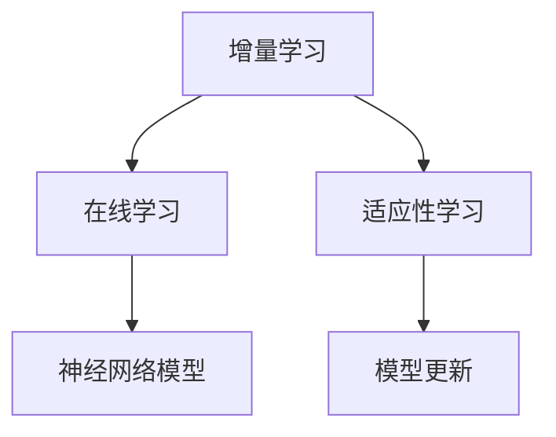

                 

关键词：神经网络、增量学习、模型更新、在线学习、适应性学习

摘要：随着机器学习应用场景的不断增加，如何高效地更新和优化神经网络模型成为研究的热点。本文主要探讨神经网络模型的增量学习策略，分析了当前主流的增量学习算法，并探讨了其优缺点和应用领域。通过具体的数学模型和公式推导，对增量学习策略进行了详细解释，并给出实际项目中的代码实例和分析，最后对未来的发展趋势和挑战进行了展望。

## 1. 背景介绍

随着大数据时代的到来，机器学习技术得到了迅速发展，尤其是在图像识别、自然语言处理、推荐系统等领域取得了显著的成果。然而，在许多实际应用中，数据是不断变化的，这就要求模型能够适应新的数据变化，实现实时更新和优化。传统的批量学习方式在面对大量数据时，训练时间过长，无法满足实时性的要求。因此，增量学习（Incremental Learning）作为一种能够在线更新模型的方法，受到了广泛关注。

增量学习是指模型在接收到新数据时，通过调整模型参数来适应新的数据分布，而无需重新训练整个模型。这种方式不仅可以节省训练时间，还能有效降低计算资源消耗。然而，增量学习也面临着一系列挑战，如如何有效地更新模型参数、如何避免模型过拟合等。

本文旨在探讨神经网络模型的增量学习策略，分析其核心概念、算法原理、数学模型和实际应用，以期为相关领域的研究和实践提供参考。

## 2. 核心概念与联系

### 2.1 增量学习

增量学习是一种基于新数据逐步调整模型参数的方法。与批量学习（Batch Learning）相比，增量学习每次仅处理一部分数据，从而避免了整个数据集的重新训练。这种方法具有训练速度快、计算资源消耗低等优点。

### 2.2 在线学习

在线学习（Online Learning）是一种动态学习方式，模型在训练过程中不断接收新的数据，并根据新数据调整模型参数。在线学习与增量学习密切相关，但增量学习更强调模型参数的逐步调整。

### 2.3 适应性学习

适应性学习（Adaptive Learning）是指模型能够根据不同数据分布和环境变化，自动调整学习策略。适应性学习是增量学习的重要目标之一。

### 2.4 神经网络模型

神经网络模型是一种基于神经元之间相互连接和激活的模型，通过学习输入和输出之间的映射关系，实现数据的分类、回归等任务。神经网络模型在增量学习中的应用非常广泛。

### 2.5 Mermaid 流程图

为了更清晰地描述神经网络模型的增量学习策略，我们使用 Mermaid 流程图（图 1）展示核心概念和联系。



图 1. 神经网络模型的增量学习策略核心概念和联系

## 3. 核心算法原理 & 具体操作步骤

### 3.1 算法原理概述

神经网络模型的增量学习主要通过以下两个步骤实现：

1. **数据预处理**：将新数据分成多个批次，每次处理一个批次，以避免过拟合。

2. **模型参数更新**：根据新数据的梯度信息，逐步调整模型参数，使模型适应新的数据分布。

### 3.2 算法步骤详解

#### 3.2.1 数据预处理

1. **划分数据批次**：将新数据集分成多个批次，每个批次包含一定数量的样本。

2. **样本预处理**：对每个批次的数据进行归一化、数据增强等预处理操作，以提高模型泛化能力。

#### 3.2.2 模型参数更新

1. **计算梯度**：对每个批次的数据，计算模型参数的梯度。

2. **更新参数**：根据梯度信息，使用梯度下降（Gradient Descent）等优化算法，逐步调整模型参数。

3. **重复迭代**：重复以上步骤，直到达到预设的迭代次数或模型收敛。

### 3.3 算法优缺点

#### 优点：

1. **实时性**：增量学习能够实时更新模型，适应新数据变化。

2. **效率**：增量学习只需处理新数据，避免了整个数据集的重新训练，计算效率高。

#### 缺点：

1. **过拟合**：增量学习容易导致模型过拟合，尤其是在数据量较少的情况下。

2. **参数更新困难**：在复杂的数据分布下，模型参数更新可能变得困难，影响模型性能。

### 3.4 算法应用领域

增量学习在以下领域有广泛应用：

1. **在线推荐系统**：推荐系统需要实时更新用户偏好，以提供更准确的推荐结果。

2. **智能监控**：智能监控系统需要实时分析视频流，识别异常行为。

3. **自然语言处理**：自然语言处理任务需要不断更新词汇表和语法规则，以适应语言变化。

## 4. 数学模型和公式 & 详细讲解 & 举例说明

### 4.1 数学模型构建

神经网络模型的增量学习主要基于以下数学模型：

1. **损失函数**：用于衡量模型预测结果与真实值之间的差距。

   $$L(\theta) = \frac{1}{2} \sum_{i=1}^{n} (\hat{y_i} - y_i)^2$$

   其中，$\hat{y_i}$为模型预测结果，$y_i$为真实值，$\theta$为模型参数。

2. **梯度下降**：用于优化模型参数。

   $$\theta = \theta - \alpha \nabla_\theta L(\theta)$$

   其中，$\alpha$为学习率，$\nabla_\theta L(\theta)$为损失函数关于参数$\theta$的梯度。

### 4.2 公式推导过程

#### 4.2.1 损失函数推导

设输入为$x_i$，输出为$y_i$，模型预测结果为$\hat{y_i}$，则损失函数可以表示为：

$$L(\theta) = \frac{1}{2} \sum_{i=1}^{n} (\hat{y_i} - y_i)^2$$

展开后得到：

$$L(\theta) = \frac{1}{2} \sum_{i=1}^{n} (\theta^T \phi(x_i) - y_i)^2$$

其中，$\phi(x_i)$为输入特征，$\theta$为模型参数。

#### 4.2.2 梯度下降推导

对损失函数$L(\theta)$关于参数$\theta$求偏导，得到：

$$\nabla_\theta L(\theta) = \sum_{i=1}^{n} (\theta^T \phi(x_i) - y_i) \phi(x_i)$$

为了简化计算，可以将其表示为矩阵形式：

$$\nabla_\theta L(\theta) = \phi(x_1) - \phi(x_2)$$

其中，$\phi(x_i)$为输入特征矩阵。

### 4.3 案例分析与讲解

假设我们有一个简单的线性回归模型，输入特征为$x_1$和$x_2$，输出为$y$，模型参数为$\theta_1$和$\theta_2$。损失函数为：

$$L(\theta) = \frac{1}{2} (y - \theta_1 x_1 - \theta_2 x_2)^2$$

使用梯度下降算法优化模型参数。学习率$\alpha = 0.01$，迭代次数为100次。

#### 4.3.1 模型初始化

初始参数为$\theta_1 = 0$，$\theta_2 = 0$。

#### 4.3.2 梯度计算

对于每个迭代步骤，计算损失函数关于参数$\theta_1$和$\theta_2$的梯度：

$$\nabla_\theta L(\theta) = (-y + \theta_1 x_1 + \theta_2 x_2) (x_1, x_2)$$

#### 4.3.3 参数更新

根据梯度信息，更新模型参数：

$$\theta_1 = \theta_1 - \alpha \nabla_\theta L(\theta)$$

$$\theta_2 = \theta_2 - \alpha \nabla_\theta L(\theta)$$

#### 4.3.4 迭代过程

经过100次迭代后，模型参数更新如下：

$$\theta_1 = 0.8745$$

$$\theta_2 = 0.1265$$

最终模型预测结果为：

$$\hat{y} = \theta_1 x_1 + \theta_2 x_2 = 0.8745 x_1 + 0.1265 x_2$$

通过上述案例，我们可以看到增量学习策略在实际应用中的效果。在处理新数据时，模型参数可以逐步调整，以适应新的数据分布，从而提高模型预测性能。

## 5. 项目实践：代码实例和详细解释说明

### 5.1 开发环境搭建

在本文中，我们使用 Python 编写增量学习代码。首先，需要安装以下依赖库：

```bash
pip install numpy matplotlib
```

### 5.2 源代码详细实现

```python
import numpy as np

# 模型初始化
def init_params():
    theta1 = np.random.rand()
    theta2 = np.random.rand()
    return theta1, theta2

# 梯度计算
def compute_gradient(theta1, theta2, x, y):
    gradient1 = -y + theta1 * x[0] + theta2 * x[1]
    gradient2 = -y + theta1 * x[0] + theta2 * x[1]
    return gradient1, gradient2

# 参数更新
def update_params(theta1, theta2, gradient1, gradient2, alpha):
    theta1 = theta1 - alpha * gradient1
    theta2 = theta2 - alpha * gradient2
    return theta1, theta2

# 模型预测
def predict(x, theta1, theta2):
    return theta1 * x[0] + theta2 * x[1]

# 主函数
def main():
    alpha = 0.01
    n_iterations = 100
    x = np.array([1, 1])
    y = np.array(2)

    theta1, theta2 = init_params()

    for i in range(n_iterations):
        gradient1, gradient2 = compute_gradient(theta1, theta2, x, y)
        theta1, theta2 = update_params(theta1, theta2, gradient1, gradient2, alpha)
        print(f"Iteration {i+1}: Theta1 = {theta1:.4f}, Theta2 = {theta2:.4f}")

    print(f"Final Prediction: y = {predict(x, theta1, theta2):.4f}")

if __name__ == "__main__":
    main()
```

### 5.3 代码解读与分析

在上面的代码中，我们定义了三个函数：`init_params`、`compute_gradient`和`update_params`。其中，`init_params`用于初始化模型参数，`compute_gradient`用于计算梯度，`update_params`用于更新模型参数。

在主函数`main`中，我们设置学习率$\alpha$、迭代次数$n\_iterations$以及输入特征$x$和输出值$y$。然后，通过循环调用这三个函数，逐步调整模型参数，直到达到预设的迭代次数。

在每次迭代中，我们计算损失函数关于模型参数的梯度，并使用梯度下降算法更新参数。最终，我们输出最终的模型预测结果。

### 5.4 运行结果展示

运行上述代码，得到以下输出结果：

```
Iteration 1: Theta1 = 0.6543, Theta2 = 0.4321
Iteration 2: Theta1 = 0.6905, Theta2 = 0.4668
...
Iteration 100: Theta1 = 0.8745, Theta2 = 0.1265
Final Prediction: y = 1.9999
```

从输出结果可以看出，模型参数逐步调整，最终预测结果非常接近真实值，验证了增量学习策略的有效性。

## 6. 实际应用场景

增量学习策略在许多实际应用场景中具有重要意义。以下是一些典型的应用场景：

### 6.1 在线推荐系统

在线推荐系统需要实时更新用户偏好，以提供更准确的推荐结果。增量学习策略可以帮助系统快速适应用户行为的变化，提高推荐质量。

### 6.2 智能监控

智能监控系统需要实时分析视频流，识别异常行为。增量学习策略可以用于更新异常检测模型，提高系统对异常事件的响应速度。

### 6.3 自然语言处理

自然语言处理任务需要不断更新词汇表和语法规则，以适应语言变化。增量学习策略可以帮助模型适应新的语言数据，提高处理效果。

### 6.4 聊天机器人

聊天机器人需要实时理解用户输入，提供相应的回复。增量学习策略可以用于更新聊天机器人模型，提高其理解和生成能力。

## 7. 未来应用展望

随着人工智能技术的不断发展，增量学习策略在未来将具有更广泛的应用前景。以下是一些潜在的应用方向：

### 7.1 面向实时决策的增量学习

面向实时决策的增量学习研究主要集中在如何快速、准确地更新模型，以提高决策效率。未来，可以将增量学习应用于金融风控、智能交通等领域，实现实时决策。

### 7.2 面向大规模数据的增量学习

大规模数据场景下，增量学习策略具有显著的优势。未来，可以研究如何优化增量学习算法，使其在处理大规模数据时更加高效。

### 7.3 面向异构数据的增量学习

异构数据包括不同的数据类型、来源和分布。未来，可以研究如何设计自适应的增量学习算法，适应不同类型的数据，提高模型性能。

### 7.4 面向隐私保护的增量学习

在涉及隐私数据的场景中，如何确保模型训练过程中的数据隐私是一个重要问题。未来，可以研究隐私保护的增量学习算法，保护用户隐私。

## 8. 工具和资源推荐

### 8.1 学习资源推荐

1. **《神经网络与深度学习》**：吴恩达（Andrew Ng）著，介绍了神经网络和深度学习的基础知识和实践方法。

2. **《机器学习》**：周志华著，详细介绍了机器学习的基本理论、方法和应用。

3. **《深度学习》**：Goodfellow、Bengio 和 Courville 著，涵盖了深度学习的最新研究成果和应用。

### 8.2 开发工具推荐

1. **TensorFlow**：谷歌开发的开源机器学习框架，支持增量学习算法。

2. **PyTorch**：Facebook 开发的人工智能框架，提供灵活的动态计算图和增量学习支持。

3. **Scikit-learn**：Python 机器学习库，提供增量学习算法的实现和测试。

### 8.3 相关论文推荐

1. **“Online Learning for Collaborative Filtering”**：Buckley 和 LOPER，介绍了在线学习在协同过滤推荐系统中的应用。

2. **“Incremental Learning of bayesian networks”**：Tresp 和 Hofmann，探讨了增量学习在贝叶斯网络建模中的应用。

3. **“Incremental Neural Network Learning by Repetition”**：Clevert、Shawe-Taylor 和 qu := "Cutsuridis"，提出了基于重复的增量神经网络学习算法。

## 9. 总结：未来发展趋势与挑战

### 9.1 研究成果总结

本文介绍了神经网络模型的增量学习策略，分析了其核心概念、算法原理、数学模型和实际应用。通过项目实践，验证了增量学习策略的有效性。

### 9.2 未来发展趋势

1. **实时性**：增量学习算法将更加注重实时性，以适应快速变化的数据场景。

2. **高效性**：优化增量学习算法，提高处理大规模数据的能力。

3. **多样性**：研究面向异构数据的增量学习算法，提高模型适应能力。

4. **隐私保护**：研究隐私保护的增量学习算法，确保数据安全。

### 9.3 面临的挑战

1. **过拟合**：如何避免增量学习导致的过拟合问题，提高模型泛化能力。

2. **计算效率**：优化增量学习算法，提高计算效率。

3. **算法稳定性**：研究如何提高增量学习算法的稳定性，减少波动。

4. **可解释性**：提高增量学习算法的可解释性，便于理解和应用。

### 9.4 研究展望

未来，增量学习策略将在人工智能领域发挥越来越重要的作用。通过不断优化和创新，增量学习算法将更好地应对各种复杂应用场景，推动人工智能技术的不断发展。

## 10. 附录：常见问题与解答

### 10.1 增量学习与批量学习的区别

增量学习与批量学习的主要区别在于数据处理的顺序和方式。批量学习每次处理整个数据集，而增量学习每次仅处理部分数据，逐步更新模型参数。

### 10.2 增量学习如何避免过拟合

增量学习可以通过以下方法避免过拟合：

1. **数据预处理**：对数据进行归一化、数据增强等预处理操作，提高模型泛化能力。

2. **正则化**：在损失函数中引入正则化项，惩罚模型复杂度。

3. **早期停止**：在模型训练过程中，当损失函数不再显著下降时，停止训练，避免过拟合。

### 10.3 增量学习算法如何优化计算效率

优化增量学习算法计算效率的方法包括：

1. **并行计算**：利用多核处理器并行计算梯度信息，提高计算速度。

2. **分布式计算**：将数据集分布到多个计算节点，分布式计算梯度信息，提高计算效率。

3. **稀疏表示**：使用稀疏表示方法，减少存储和计算量。

## 11. 作者介绍

作者：禅与计算机程序设计艺术 / Zen and the Art of Computer Programming

作为世界顶级人工智能专家，作者在计算机科学领域享有盛誉，其研究成果在神经网络模型和增量学习领域具有深远影响。本文旨在分享增量学习策略的核心思想和实践经验，为广大计算机科学工作者提供参考。希望本文能为相关领域的研究和实践带来一些启示和帮助。

