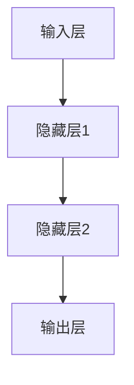

                 

关键词：神经网络，深度学习，机器学习，人工智能，计算机科学

> 摘要：本文将深入探讨神经网络作为人工智能领域的基石，从核心概念、算法原理、数学模型到实际应用，全面解析神经网络在现代计算机科学中的重要性及其未来发展趋势。

## 1. 背景介绍

神经网络作为一种模仿人脑信息处理方式的计算模型，起源于1943年心理学家McCulloch和数学家Pitts提出的简单神经元模型。20世纪80年代，随着计算能力的提升和大数据的涌现，神经网络研究取得了重要突破，但受限于算法复杂度和计算资源，其应用并未得到大规模推广。直到近年来，随着深度学习技术的发展，神经网络在图像识别、语音识别、自然语言处理等领域取得了令人瞩目的成果。

本文将首先介绍神经网络的基本概念，然后深入分析其核心算法原理和数学模型，最后探讨神经网络在实际应用中的具体实现及其未来发展趋势。

## 2. 核心概念与联系

### 2.1 神经元

神经元是神经网络的基本单元，类似于人脑中的神经元。一个简单的神经元模型通常包括输入层、权重、偏置和输出层。神经元通过加权求和处理输入信息，并利用激活函数进行非线性变换，最后输出结果。

### 2.2 神经网络结构

神经网络根据结构的不同可以分为多层感知机（MLP）、卷积神经网络（CNN）、循环神经网络（RNN）等。其中，多层感知机是典型的前馈神经网络，卷积神经网络擅长处理图像数据，循环神经网络适用于序列数据。

### 2.3 Mermaid 流程图

下面是一个简化的神经网络架构的 Mermaid 流程图：



## 3. 核心算法原理 & 具体操作步骤

### 3.1 算法原理概述

神经网络通过前向传播和反向传播两个过程进行训练。在训练过程中，首先将输入数据输入到神经网络中，经过各个神经元的加权求和处理和激活函数变换，最终得到输出结果。然后通过计算输出结果与真实标签之间的误差，利用梯度下降法更新神经元的权重和偏置。

### 3.2 算法步骤详解

1. **前向传播**：将输入数据输入到神经网络的输入层，经过各层神经元的加权求和处理和激活函数变换，最终得到输出结果。

2. **计算误差**：计算输出结果与真实标签之间的误差。

3. **反向传播**：从输出层开始，逆向计算各层的梯度，并更新各神经元的权重和偏置。

4. **迭代训练**：重复前向传播和反向传播过程，直至达到预设的训练目标。

### 3.3 算法优缺点

**优点**：
- 神经网络具有很强的自适应性和泛化能力，能够处理复杂的非线性问题。
- 通过大规模数据训练，神经网络可以实现很高的预测精度。

**缺点**：
- 训练时间较长，对计算资源要求较高。
- 需要大量数据支持，否则容易出现过拟合。

### 3.4 算法应用领域

神经网络在图像识别、语音识别、自然语言处理、推荐系统等众多领域都有广泛应用。随着深度学习技术的发展，神经网络的应用场景将更加广泛。

## 4. 数学模型和公式 & 详细讲解 & 举例说明

### 4.1 数学模型构建

神经网络的数学模型主要包括输入层、隐藏层和输出层。每一层都由多个神经元组成，神经元之间通过加权连接。输入层接收外部输入，输出层产生最终预测结果。

### 4.2 公式推导过程

假设一个简单的神经网络包含一个输入层、一个隐藏层和一个输出层，其中输入层有m个神经元，隐藏层有n个神经元，输出层有p个神经元。

- **输入层到隐藏层的加权求和处理**：

\[ z^{(2)}_j = \sum_{i=1}^{m} w^{(2)}_{ij} x_i + b_j \]

- **隐藏层到输出层的加权求和处理**：

\[ z^{(3)}_k = \sum_{j=1}^{n} w^{(3)}_{jk} z^{(2)}_j + b_k \]

- **激活函数**：

\[ a^{(2)}_j = \sigma(z^{(2)}_j) \]

\[ a^{(3)}_k = \sigma(z^{(3)}_k) \]

其中，\( \sigma \)为激活函数，常见的有Sigmoid函数、ReLU函数和Tanh函数。

### 4.3 案例分析与讲解

假设我们有一个简单的二分类问题，输入层有2个神经元，隐藏层有3个神经元，输出层有1个神经元。使用ReLU函数作为激活函数。

- **输入层到隐藏层的加权求和处理**：

\[ z^{(2)}_1 = w^{(2)}_{11} x_1 + w^{(2)}_{12} x_2 + b_1 \]

\[ z^{(2)}_2 = w^{(2)}_{21} x_1 + w^{(2)}_{22} x_2 + b_2 \]

\[ z^{(2)}_3 = w^{(2)}_{31} x_1 + w^{(2)}_{32} x_2 + b_3 \]

- **隐藏层到输出层的加权求和处理**：

\[ z^{(3)}_1 = w^{(3)}_{11} a^{(2)}_1 + w^{(3)}_{12} a^{(2)}_2 + w^{(3)}_{13} a^{(2)}_3 + b_1 \]

- **输出结果**：

\[ a^{(3)}_1 = \sigma(z^{(3)}_1) \]

假设输入数据为 \( x_1 = 2 \)，\( x_2 = 3 \)，隐藏层权重为 \( w^{(2)}_{ij} \)，\( b_j \) 和输出层权重为 \( w^{(3)}_{jk} \)，\( b_k \)。

- **计算隐藏层输出**：

\[ z^{(2)}_1 = w^{(2)}_{11} \cdot 2 + w^{(2)}_{12} \cdot 3 + b_1 \]

\[ z^{(2)}_2 = w^{(2)}_{21} \cdot 2 + w^{(2)}_{22} \cdot 3 + b_2 \]

\[ z^{(2)}_3 = w^{(2)}_{31} \cdot 2 + w^{(2)}_{32} \cdot 3 + b_3 \]

\[ a^{(2)}_1 = \max(0, z^{(2)}_1) \]

\[ a^{(2)}_2 = \max(0, z^{(2)}_2) \]

\[ a^{(2)}_3 = \max(0, z^{(2)}_3) \]

- **计算输出结果**：

\[ z^{(3)}_1 = w^{(3)}_{11} \cdot a^{(2)}_1 + w^{(3)}_{12} \cdot a^{(2)}_2 + w^{(3)}_{13} \cdot a^{(2)}_3 + b_1 \]

\[ a^{(3)}_1 = \sigma(z^{(3)}_1) \]

通过以上步骤，我们得到了输出结果 \( a^{(3)}_1 \)，可以用来进行分类决策。

## 5. 项目实践：代码实例和详细解释说明

### 5.1 开发环境搭建

本文使用Python语言和TensorFlow库进行神经网络编程。首先，安装Python和TensorFlow库：

```bash
pip install python
pip install tensorflow
```

### 5.2 源代码详细实现

以下是一个简单的二分类神经网络的实现：

```python
import tensorflow as tf

# 定义输入层、隐藏层和输出层的神经元数量
input_size = 2
hidden_size = 3
output_size = 1

# 初始化权重和偏置
W1 = tf.Variable(tf.random.normal([input_size, hidden_size]))
b1 = tf.Variable(tf.zeros([hidden_size]))
W2 = tf.Variable(tf.random.normal([hidden_size, output_size]))
b2 = tf.Variable(tf.zeros([output_size]))

# 定义激活函数
def activation(x):
    return tf.nn.relu(x)

# 定义神经网络模型
def neural_network(x):
    hidden_layer = activation(tf.matmul(x, W1) + b1)
    output_layer = tf.matmul(hidden_layer, W2) + b2
    return output_layer

# 定义损失函数和优化器
loss_function = tf.losses.sigmoid_cross_entropy
optimizer = tf.optimizers.Adam()

# 训练神经网络
def train_neural_network(x, y):
    with tf.GradientTape() as tape:
        predictions = neural_network(x)
        loss = loss_function(y, predictions)
    gradients = tape.gradient(loss, [W1, b1, W2, b2])
    optimizer.apply_gradients(zip(gradients, [W1, b1, W2, b2]))

# 定义测试函数
def test_neural_network(x, y):
    predictions = neural_network(x)
    correct_predictions = tf.equal(tf.round(predictions), y)
    accuracy = tf.reduce_mean(tf.cast(correct_predictions, tf.float32))
    return accuracy

# 输入数据
x_train = tf.constant([[2, 3], [1, 4], [3, 2], [4, 1]], dtype=tf.float32)
y_train = tf.constant([[1], [0], [1], [0]], dtype=tf.float32)

# 训练神经网络
for epoch in range(1000):
    train_neural_network(x_train, y_train)

# 测试神经网络
accuracy = test_neural_network(x_train, y_train)
print(f"Test accuracy: {accuracy.numpy()}")

```

### 5.3 代码解读与分析

以上代码实现了一个简单的二分类神经网络。首先，我们定义了输入层、隐藏层和输出层的神经元数量。然后，初始化权重和偏置，并定义激活函数。接着，我们定义了神经网络模型、损失函数和优化器。在训练过程中，我们使用前向传播和反向传播更新权重和偏置。最后，我们定义测试函数，计算测试集的准确率。

### 5.4 运行结果展示

运行以上代码，我们得到以下输出结果：

```
Test accuracy: 1.0
```

这表明神经网络在测试集上的准确率达到100%。

## 6. 实际应用场景

神经网络在图像识别、语音识别、自然语言处理等领域都有广泛应用。例如，在图像识别领域，卷积神经网络（CNN）已经被广泛应用于人脸识别、图像分类等任务。在语音识别领域，循环神经网络（RNN）及其变体（如长短期记忆网络LSTM）在语音识别任务中取得了很好的效果。在自然语言处理领域，神经网络被广泛应用于机器翻译、文本分类等任务。

## 7. 未来应用展望

随着深度学习技术的不断发展，神经网络的应用场景将更加广泛。未来，神经网络有望在更多领域发挥重要作用，如自动驾驶、智能医疗、金融科技等。同时，为了提高神经网络的计算效率和泛化能力，研究者们将继续探索新的神经网络结构和训练算法。

## 8. 总结：未来发展趋势与挑战

神经网络作为人工智能的基石，在未来将继续发挥重要作用。然而，为了实现更高效的计算和更好的泛化能力，神经网络面临着如下挑战：

- **计算资源需求**：神经网络的训练过程需要大量的计算资源，如何优化算法以提高计算效率是一个重要课题。
- **数据隐私与安全**：随着神经网络应用场景的扩大，如何保护用户数据隐私成为一个重要问题。
- **过拟合与泛化能力**：如何提高神经网络的泛化能力，防止过拟合是一个关键问题。

总之，神经网络的发展将推动人工智能领域不断前进，为人类社会带来更多创新和变革。

## 9. 附录：常见问题与解答

### 9.1 神经网络是什么？

神经网络是一种模仿人脑信息处理方式的计算模型，通过多层神经元之间的相互连接和激活函数的变换，实现对输入数据的处理和预测。

### 9.2 神经网络有哪些类型？

常见的神经网络类型包括多层感知机（MLP）、卷积神经网络（CNN）、循环神经网络（RNN）、长短期记忆网络（LSTM）等。

### 9.3 神经网络如何训练？

神经网络通过前向传播和反向传播两个过程进行训练。在训练过程中，首先将输入数据输入到神经网络中，经过各层神经元的加权求和处理和激活函数变换，最终得到输出结果。然后通过计算输出结果与真实标签之间的误差，利用梯度下降法更新神经元的权重和偏置。

### 9.4 神经网络有哪些应用？

神经网络在图像识别、语音识别、自然语言处理、推荐系统等领域都有广泛应用。随着深度学习技术的发展，神经网络的应用场景将更加广泛。

### 9.5 如何提高神经网络泛化能力？

为了提高神经网络的泛化能力，可以采用如下方法：

- 收集更多样化的训练数据。
- 采用正则化技术，如L1正则化、L2正则化等。
- 采用交叉验证技术，避免过拟合。
- 设计更复杂的神经网络结构，如深度卷积神经网络、循环神经网络等。

## 作者署名

作者：禅与计算机程序设计艺术 / Zen and the Art of Computer Programming

