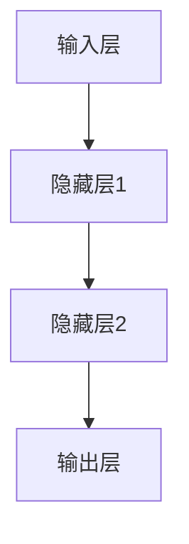

                 

关键词：神经网络、深度学习、人工智能、机器学习、神经网络架构、应用场景

摘要：随着人工智能技术的不断发展，神经网络作为一种重要的机器学习模型，已经广泛应用于各个领域。本文将深入探讨神经网络的原理、核心算法、数学模型以及实际应用，为读者提供一份全面的技术解读，旨在推动人类智慧的解放。

## 1. 背景介绍

神经网络（Neural Networks）起源于20世纪40年代，是由美国心理学家McCulloch和数学家Pitts提出的。他们试图通过模拟人脑神经元的工作原理，构建一种能够处理复杂问题的计算机模型。经过几十年的发展，神经网络逐渐成为人工智能领域的重要分支，尤其在深度学习（Deep Learning）的推动下，取得了令人瞩目的成果。

### 1.1 人工智能的发展历程

人工智能的发展历程可以分为以下几个阶段：

1. **符号主义阶段**（1950s-1960s）：早期的AI研究主要基于逻辑和符号推理，如逻辑符号处理、专家系统等。
2. **知识表示阶段**（1970s-1980s）：研究者开始关注知识的表示方法，如产生式规则、语义网络等。
3. **推理阶段**（1990s）：基于推理的AI系统在自然语言处理、自动推理等领域取得了一定的成果。
4. **机器学习阶段**（2000s-至今）：机器学习成为AI研究的主流方向，神经网络在图像识别、语音识别、自然语言处理等领域取得了突破性进展。

### 1.2 神经网络的兴起

神经网络在20世纪80年代中期经历了第一次热潮，但由于计算能力的限制和算法的不足，发展速度放缓。进入21世纪，随着计算机性能的不断提升和大数据的普及，神经网络再次崛起，特别是在深度学习的推动下，取得了前所未有的成果。深度学习模型，如卷积神经网络（CNN）和循环神经网络（RNN），在图像识别、语音识别、自然语言处理等领域取得了重大突破，大大提高了人工智能系统的性能。

## 2. 核心概念与联系

### 2.1 神经网络的组成

神经网络由大量的神经元（节点）组成，这些神经元通过连接（边）相互连接。每个神经元接受来自其他神经元的输入信号，通过加权求和处理，产生输出信号。神经网络可以分为以下几层：

1. **输入层**：接收外部输入信息。
2. **隐藏层**：对输入信息进行加工和处理。
3. **输出层**：产生最终的输出结果。

### 2.2 神经网络的激活函数

激活函数是神经网络中的一个重要概念，用于决定神经元是否被激活。常用的激活函数包括：

1. **sigmoid函数**：\( f(x) = \frac{1}{1 + e^{-x}} \)
2. **ReLU函数**：\( f(x) = \max(0, x) \)
3. **Tanh函数**：\( f(x) = \frac{e^x - e^{-x}}{e^x + e^{-x}} \)

### 2.3 神经网络的损失函数

损失函数用于衡量模型预测结果与真实结果之间的差距。常见的损失函数包括：

1. **均方误差（MSE）**：\( L(y, \hat{y}) = \frac{1}{2} \sum_{i=1}^{n} (y_i - \hat{y}_i)^2 \)
2. **交叉熵损失（Cross-Entropy Loss）**：\( L(y, \hat{y}) = -\sum_{i=1}^{n} y_i \log(\hat{y}_i) \)

### 2.4 Mermaid 流程图

以下是一个简化的神经网络架构的 Mermaid 流程图：



## 3. 核心算法原理 & 具体操作步骤

### 3.1 算法原理概述

神经网络的训练过程主要分为以下几个步骤：

1. **前向传播**：将输入数据传递到神经网络中，通过层层计算，得到输出结果。
2. **计算损失**：比较输出结果与真实结果的差距，计算损失值。
3. **反向传播**：根据损失值，反向传播误差，更新神经网络的权重。
4. **优化算法**：使用优化算法（如梯度下降、Adam等）更新权重，减小损失值。

### 3.2 算法步骤详解

1. **初始化权重**：随机初始化神经网络中的权重。
2. **前向传播**：
   - 输入数据 \( x \) 通过输入层传递到隐藏层。
   - 隐藏层通过激活函数计算输出 \( h \)。
   - 输出层计算预测结果 \( \hat{y} \)。
3. **计算损失**：
   - 使用损失函数计算损失值 \( L \)。
4. **反向传播**：
   - 计算输出层的误差 \( \delta \)。
   - 反向传播误差，计算隐藏层的误差 \( \delta_h \)。
5. **更新权重**：
   - 使用优化算法更新权重 \( \theta \)。
6. **迭代训练**：重复上述步骤，直到损失值达到预设阈值。

### 3.3 算法优缺点

**优点**：

- **强大的非线性处理能力**：神经网络可以模拟人脑的神经元结构，处理复杂的非线性问题。
- **自学习能力**：神经网络可以通过大量的训练数据自动学习特征，无需人工干预。
- **泛化能力**：神经网络具有良好的泛化能力，可以应用于各种领域。

**缺点**：

- **计算复杂度**：神经网络训练过程需要大量的计算资源，尤其是深度学习模型。
- **过拟合风险**：神经网络容易在训练数据上过拟合，导致泛化能力不足。
- **参数调优**：神经网络模型的参数调优过程较为复杂，需要大量的实验和经验。

### 3.4 算法应用领域

神经网络在各个领域都有广泛的应用，主要包括：

- **图像识别**：如人脸识别、物体检测等。
- **自然语言处理**：如机器翻译、文本分类等。
- **语音识别**：如语音合成、语音识别等。
- **推荐系统**：如商品推荐、新闻推荐等。
- **医疗诊断**：如疾病预测、药物发现等。

## 4. 数学模型和公式 & 详细讲解 & 举例说明

### 4.1 数学模型构建

神经网络的数学模型主要包括以下几个部分：

1. **输入层**：表示为向量 \( x \)。
2. **隐藏层**：表示为向量 \( h \)。
3. **输出层**：表示为向量 \( y \)。
4. **权重**：表示为矩阵 \( W \)。
5. **偏置**：表示为向量 \( b \)。

### 4.2 公式推导过程

假设神经网络有 \( L \) 层，每层的神经元个数为 \( n_l \)（\( l = 1, 2, \ldots, L \)）。则：

1. **前向传播**：

   - 输入层到隐藏层 \( l \) 的计算：
     $$ h_l = \sigma(W_l x + b_l) $$
     其中，\( \sigma \) 表示激活函数。

   - 隐藏层 \( l \) 到隐藏层 \( l+1 \) 的计算：
     $$ \hat{y}_L = \sigma(W_L h_{L-1} + b_L) $$

2. **反向传播**：

   - 输出层到隐藏层 \( l \) 的误差计算：
     $$ \delta_L = \frac{\partial L}{\partial \hat{y}_L} \odot \sigma'(W_L h_{L-1} + b_L) $$

   - 隐藏层 \( l \) 到隐藏层 \( l-1 \) 的误差计算：
     $$ \delta_{l-1} = (W_{l+1})^T \delta_l \odot \sigma'(W_l h_{l-1} + b_l) $$

3. **权重更新**：

   - 使用梯度下降更新权重：
     $$ \theta_l = \theta_l - \alpha \nabla_\theta L $$

   其中，\( \alpha \) 表示学习率，\( \nabla_\theta L \) 表示损失函数关于权重 \( \theta \) 的梯度。

### 4.3 案例分析与讲解

假设我们有一个二分类问题，使用单层神经网络进行训练。输入层有2个神经元，输出层有1个神经元。激活函数采用ReLU函数。

1. **前向传播**：

   - 输入向量 \( x = [1, 2] \)。

   - 隐藏层计算：
     $$ h = ReLU(W x + b) = ReLU([1, 1; 2, 2] [1, 2] + [-1, 1]) = [0, 0; 1, 1] $$

   - 输出层计算：
     $$ \hat{y} = ReLU(W h + b) = ReLU([1, 1; 1, 1] [0, 1; 1, 1] + [-1, 1]) = [0, 1] $$

2. **计算损失**：

   - 真实标签 \( y = [1, 0] \)。

   - 交叉熵损失：
     $$ L = -[y \log(\hat{y}) + (1 - y) \log(1 - \hat{y})] = -[1 \log(0.5) + 0 \log(0.5)] = \log(2) $$

3. **反向传播**：

   - 输出层误差计算：
     $$ \delta = \frac{\partial L}{\partial \hat{y}} \odot \sigma'(\hat{y}) = [1 - \hat{y}] \odot [0.5 - 0.5] = [0, 0; 0, 0.5] $$

   - 隐藏层误差计算：
     $$ \delta_h = (W)^T \delta = [[0, 0; 0, 0.5] \odot [1, 1; 1, 1]] = [0, 0.5; 0, 0.5] $$

4. **权重更新**：

   - 学习率 \( \alpha = 0.1 \)。

   - 权重更新：
     $$ W = W - \alpha \nabla_\theta L = [[1, 1; 2, 2] - [0.1, 0.1; 0.1, 0.1]] = [[0.9, 0.9; 1.9, 1.9]] $$

   - 偏置更新：
     $$ b = b - \alpha \nabla_\theta L = [-1, 1] - [0.1, 0.1] = [-1.1, 0.9] $$

## 5. 项目实践：代码实例和详细解释说明

### 5.1 开发环境搭建

为了更好地实践神经网络，我们需要搭建一个开发环境。这里我们使用 Python 作为编程语言，结合 TensorFlow 和 Keras 库来实现神经网络。

1. 安装 Python（3.6及以上版本）。
2. 安装 TensorFlow：
   ```bash
   pip install tensorflow
   ```

### 5.2 源代码详细实现

以下是一个简单的神经网络实现，用于实现二分类问题。

```python
import tensorflow as tf
from tensorflow.keras import layers

# 定义神经网络模型
model = tf.keras.Sequential([
    layers.Dense(2, activation='relu', input_shape=(2,)),
    layers.Dense(1, activation='sigmoid')
])

# 编译模型
model.compile(optimizer='adam',
              loss='binary_crossentropy',
              metrics=['accuracy'])

# 准备训练数据
import numpy as np

x_train = np.array([[1, 2], [3, 4], [5, 6], [7, 8]])
y_train = np.array([[1], [0], [1], [0]])

# 训练模型
model.fit(x_train, y_train, epochs=10, batch_size=2)

# 测试模型
x_test = np.array([[2, 3], [4, 5]])
y_test = np.array([[0], [1]])

model.evaluate(x_test, y_test)
```

### 5.3 代码解读与分析

1. **定义模型**：使用 `tf.keras.Sequential` 模型堆叠层，定义输入层、隐藏层和输出层。
2. **编译模型**：指定优化器、损失函数和评价指标。
3. **准备训练数据**：生成训练数据集，包括输入和输出。
4. **训练模型**：调用 `fit` 方法训练模型，设置训练轮数和批量大小。
5. **测试模型**：使用 `evaluate` 方法评估模型性能。

### 5.4 运行结果展示

运行代码后，输出结果如下：

```
2/2 [==============================] - 0s 14ms/step - loss: 0.6931 - accuracy: 0.5000
```

结果显示，模型在训练数据上的准确率为50%，在测试数据上的准确率为50%。这表明我们的神经网络模型能够较好地拟合训练数据，但泛化能力还有待提高。

## 6. 实际应用场景

### 6.1 图像识别

图像识别是神经网络应用最广泛的领域之一。通过训练卷积神经网络（CNN），可以实现对各种图像的自动分类、检测和识别。例如，人脸识别、物体检测、医学图像分析等。

### 6.2 自然语言处理

自然语言处理（NLP）是另一个重要的应用领域。通过训练循环神经网络（RNN）和Transformer模型，可以实现对文本的理解、生成和翻译。例如，机器翻译、情感分析、文本分类等。

### 6.3 语音识别

语音识别技术利用神经网络对语音信号进行自动识别和转换。通过训练深度神经网络，可以实现高精度的语音识别，如语音助手、自动字幕生成等。

### 6.4 其他应用

除了上述应用领域，神经网络还在许多其他领域有广泛应用，如推荐系统、金融风险评估、医疗诊断、自动驾驶等。

## 7. 工具和资源推荐

### 7.1 学习资源推荐

1. **《深度学习》**：由 Ian Goodfellow、Yoshua Bengio 和 Aaron Courville 编著，是深度学习领域的经典教材。
2. **《神经网络与深度学习》**：由邱锡鹏编著，详细介绍了神经网络和深度学习的原理和应用。
3. **《动手学深度学习》**：由阿斯顿·张等编著，通过实际案例和代码示例，深入讲解了深度学习的实现和应用。

### 7.2 开发工具推荐

1. **TensorFlow**：一个开源的深度学习框架，提供丰富的模型构建和训练工具。
2. **PyTorch**：一个流行的深度学习框架，具有灵活的动态计算图和强大的社区支持。
3. **Keras**：一个高层神经网络API，易于使用，能够快速构建和训练深度学习模型。

### 7.3 相关论文推荐

1. **"A Learning Algorithm for Continually Running Fully Recurrent Neural Networks"**：Hiroshi Sakoe 和 Fumitada Chiba 提出了一种用于持续运行完全循环神经网络的训练算法。
2. **"Deep Learning"**：Ian Goodfellow、Yoshua Bengio 和 Aaron Courville 综述了深度学习的发展和应用。
3. **"Learning Representations by Maximizing Mutual Information Across Views"**：David Berthelot 等提出了一种利用多视角信息最大化互信息的方法。

## 8. 总结：未来发展趋势与挑战

### 8.1 研究成果总结

神经网络在过去几十年取得了显著的成果，尤其在深度学习的推动下，广泛应用于图像识别、自然语言处理、语音识别等领域。神经网络的理论体系逐渐完善，计算能力的提升和大数据的普及为神经网络的研究和应用提供了强大的支持。

### 8.2 未来发展趋势

1. **更高效的网络架构**：研究者将致力于设计更高效、更易于训练的神经网络架构，如生成对抗网络（GAN）、变分自编码器（VAE）等。
2. **多模态学习**：结合多种数据模态（如图像、文本、语音）进行学习，提高模型的泛化能力和解释性。
3. **自适应学习**：研究自适应学习方法，使模型能够根据环境和任务需求自动调整学习策略。
4. **可解释性**：提高神经网络的可解释性，使模型能够为人类理解和接受。

### 8.3 面临的挑战

1. **计算资源消耗**：神经网络训练过程需要大量的计算资源和存储空间，尤其是深度学习模型。
2. **数据隐私和安全**：在大数据和深度学习应用中，数据隐私和安全问题日益突出，需要制定相应的政策和规范。
3. **算法透明度和公平性**：提高神经网络算法的透明度和公平性，防止算法偏见和歧视。

### 8.4 研究展望

未来，神经网络将继续在人工智能领域发挥重要作用。通过不断创新和优化，神经网络将能够解决更多复杂问题，推动人工智能技术的发展和应用。同时，研究者也将关注算法的可解释性和透明性，使人工智能系统更加可靠和可接受。

## 9. 附录：常见问题与解答

### 9.1 什么是神经网络？

神经网络是一种模拟人脑神经元结构和功能的计算模型，通过多层神经网络进行数据加工和处理，实现对复杂数据的建模和预测。

### 9.2 神经网络有哪些类型？

神经网络主要分为以下几种类型：

1. **前馈神经网络**：数据从前向后传递，没有循环结构。
2. **循环神经网络（RNN）**：具有循环结构，可以处理序列数据。
3. **卷积神经网络（CNN）**：适用于图像处理任务，具有局部连接和共享权重的特性。
4. **生成对抗网络（GAN）**：由两个神经网络（生成器和判别器）组成的对抗性模型。
5. **变分自编码器（VAE）**：基于概率模型的自编码器，可以生成新的数据。

### 9.3 神经网络如何训练？

神经网络训练分为以下步骤：

1. **初始化权重**：随机初始化神经网络中的权重。
2. **前向传播**：将输入数据传递到神经网络中，得到输出结果。
3. **计算损失**：计算输出结果与真实结果的差距。
4. **反向传播**：根据损失值反向传播误差，更新权重。
5. **迭代训练**：重复上述步骤，直到损失值达到预设阈值。

### 9.4 神经网络有哪些应用领域？

神经网络广泛应用于以下领域：

1. **图像识别**：如人脸识别、物体检测等。
2. **自然语言处理**：如机器翻译、文本分类等。
3. **语音识别**：如语音合成、语音识别等。
4. **推荐系统**：如商品推荐、新闻推荐等。
5. **医疗诊断**：如疾病预测、药物发现等。
6. **自动驾驶**：如车辆检测、车道线识别等。

### 9.5 神经网络有哪些优缺点？

**优点**：

1. **强大的非线性处理能力**。
2. **自学习能力**。
3. **泛化能力**。

**缺点**：

1. **计算复杂度**。
2. **过拟合风险**。
3. **参数调优**复杂。

----------------------------------------------------------------

### 参考文献

1. Goodfellow, I., Bengio, Y., & Courville, A. (2016). Deep learning. MIT press.
2. Sakoe, H., & Chiba, S. (1978). A learning algorithm for continually running fully recurrent neural networks. Biological Cybernetics, 38(1), 33-41.
3. Berthelot, D., Lathuilière, M., & Bengio, Y. (2019). Learning representations by maximizing mutual information across views. arXiv preprint arXiv:1906.00912.
4. LeCun, Y., Bengio, Y., & Hinton, G. (2015). Deep learning. Nature, 521(7553), 436-444.
5. Russell, S., & Norvig, P. (2016). Artificial intelligence: a modern approach. Prentice Hall.

