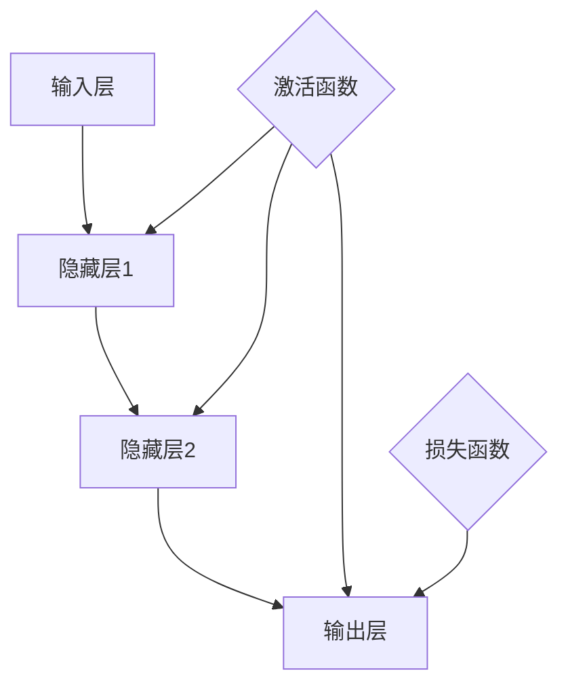

                 

关键词：神经网络、深度学习、人工智能、机器学习、反向传播算法、数学模型、应用实例、未来展望

> 摘要：本文将深入探讨神经网络这一关键的人工智能技术，从其基本概念、核心算法、数学模型、项目实践到实际应用场景，全方位解析神经网络如何引领智能新纪元的到来。本文旨在为读者提供一个全面且系统的了解，帮助其在人工智能领域取得突破性进展。

## 1. 背景介绍

神经网络（Neural Networks）是一种模拟人脑神经元工作原理的计算模型。早在1940年代，心理学家麦卡洛克（Warren McCulloch）和数学家皮茨（Walter Pitts）首次提出了这种模型。然而，神经网络的发展经历了起伏，直到20世纪80年代，随着计算机性能的提升和大数据的出现，神经网络才逐渐成为机器学习领域的重要工具。

神经网络的应用范围广泛，包括图像识别、语音识别、自然语言处理、推荐系统等。在图像识别领域，神经网络已经达到了超越人类的水平，如Google的Inception模型在ImageNet竞赛中取得了顶级成绩。在语音识别领域，神经网络的应用使得语音助手如Siri、Alexa等得以实现。自然语言处理方面，神经网络的出现推动了机器翻译、情感分析等领域的发展。

本文将围绕神经网络的核心概念、算法原理、数学模型、项目实践和实际应用进行深入探讨，旨在为读者提供一个全面且系统的了解，帮助其在人工智能领域取得突破性进展。

## 2. 核心概念与联系

### 2.1 神经网络的基本结构

神经网络由大量的简单计算单元——神经元（Neurons）组成，这些神经元通过加权连接（Weighted Connections）形成网络。每个神经元接收来自其他神经元的输入信号，通过非线性激活函数（Activation Function）处理这些信号，并输出结果。

一个简单的神经网络通常包括以下三个部分：

- **输入层（Input Layer）**：接收外部输入数据，如图像像素值。
- **隐藏层（Hidden Layers）**：一个或多个隐藏层，每个隐藏层中的神经元接收前一层神经元的输出，并通过激活函数进行处理。
- **输出层（Output Layer）**：产生最终输出，如分类结果或预测值。

### 2.2 神经网络的激活函数

激活函数是神经网络的核心组成部分，它决定了神经元的输出是否会被激活。常见的激活函数包括：

- **线性激活函数（Linear Activation Function）**：输出等于输入，即 $f(x) = x$。线性激活函数通常用于隐藏层。
- **Sigmoid函数（Sigmoid Function）**：输出为 $f(x) = \frac{1}{1 + e^{-x}}$，将输入映射到$(0,1)$区间。
- **ReLU函数（ReLU Function）**：输出为 $f(x) = \max(0, x)$，在输入为负时输出0，有助于缓解梯度消失问题。

### 2.3 神经网络的损失函数

损失函数（Loss Function）用于衡量模型预测值与实际值之间的差距，是神经网络训练过程中的重要指标。常见的损失函数包括：

- **均方误差（Mean Squared Error, MSE）**：输出为预测值与实际值之间差的平方的平均值，即 $MSE = \frac{1}{n}\sum_{i=1}^{n}(y_i - \hat{y}_i)^2$。
- **交叉熵（Cross-Entropy Loss）**：用于分类问题，输出为实际值与预测值之间的交叉熵，即 $Cross\_Entropy(y, \hat{y}) = -\sum_{i=1}^{n}y_i\log(\hat{y}_i)$。

### 2.4 神经网络的架构

神经网络的架构可以分为以下几类：

- **前馈神经网络（Feedforward Neural Network）**：数据从输入层流向输出层，没有反馈循环。
- **卷积神经网络（Convolutional Neural Network, CNN）**：适用于图像处理，通过卷积层提取图像特征。
- **循环神经网络（Recurrent Neural Network, RNN）**：适用于序列数据，具有记忆功能。
- **长短期记忆网络（Long Short-Term Memory, LSTM）**：是RNN的一种，能够更好地处理长序列数据。
- **生成对抗网络（Generative Adversarial Network, GAN）**：由生成器和判别器组成，用于生成逼真的数据。

### 2.5 Mermaid 流程图



## 3. 核心算法原理 & 具体操作步骤

### 3.1 算法原理概述

神经网络的训练过程实际上是一个优化过程，目标是调整网络中的权重和偏置，以使网络输出更接近实际值。这个过程通常通过以下步骤实现：

1. **初始化权重和偏置**：随机初始化网络中的权重和偏置。
2. **前向传播**：将输入数据传递到神经网络，计算每个神经元的输出。
3. **计算损失**：使用损失函数计算模型预测值与实际值之间的差距。
4. **反向传播**：通过反向传播算法，计算每个神经元对损失的梯度，并更新权重和偏置。
5. **迭代优化**：重复以上步骤，直到模型达到预定的性能指标。

### 3.2 算法步骤详解

#### 3.2.1 初始化权重和偏置

初始化权重和偏置是神经网络训练的第一步。常见的初始化方法包括：

- **随机初始化**：随机生成权重和偏置，通常在$(-\epsilon, \epsilon)$范围内。
- **高斯初始化**：使用正态分布初始化权重和偏置，通常均值为0，标准差为$\frac{1}{\sqrt{n}}$，其中$n$是权重或偏置的维度。

#### 3.2.2 前向传播

前向传播是将输入数据传递到神经网络，并计算每个神经元的输出。具体步骤如下：

1. **计算每个神经元的输入**：输入层神经元的输入即为输入数据，隐藏层和输出层的神经元输入为上一层的输出乘以对应的权重。
2. **应用激活函数**：对每个神经元的输入应用激活函数，以确定神经元是否被激活。
3. **计算输出**：计算每个神经元的输出，输出层神经元的输出即为模型的预测值。

#### 3.2.3 计算损失

损失函数用于衡量模型预测值与实际值之间的差距。常见的损失函数包括均方误差（MSE）和交叉熵（Cross-Entropy）。具体计算方法如下：

- **均方误差（MSE）**：$MSE = \frac{1}{n}\sum_{i=1}^{n}(y_i - \hat{y}_i)^2$，其中$y_i$是实际值，$\hat{y}_i$是预测值。
- **交叉熵（Cross-Entropy）**：$Cross\_Entropy(y, \hat{y}) = -\sum_{i=1}^{n}y_i\log(\hat{y}_i)$，其中$y_i$是实际值，$\hat{y}_i$是预测值。

#### 3.2.4 反向传播

反向传播是神经网络训练的核心步骤，通过计算每个神经元对损失的梯度，并更新权重和偏置。具体步骤如下：

1. **计算输出层神经元的梯度**：输出层神经元的梯度可以通过损失函数的导数计算，即$∇_{w} Loss = \frac{\partial Loss}{\partial w}$。
2. **计算隐藏层神经元的梯度**：隐藏层神经元的梯度可以通过反向传播计算，即$∇_{w} Loss = ∇_{w} Activation * ∇_{w} Output$。
3. **更新权重和偏置**：使用梯度下降法或其变体（如Adam优化器）更新权重和偏置，以减小损失。

#### 3.2.5 迭代优化

迭代优化是重复上述步骤，以逐步减小损失，提高模型性能。具体步骤如下：

1. **选择优化器**：选择合适的优化器，如梯度下降法、Adam优化器等。
2. **设置学习率**：设置合适的初始学习率，并逐步调整。
3. **训练模型**：重复前向传播、计算损失、反向传播和权重更新的过程，直到模型达到预定的性能指标。

### 3.3 算法优缺点

#### 优点

- **强大的表达力**：神经网络可以模拟人脑神经元的工作原理，具有较强的表达能力和适应性。
- **多任务处理**：神经网络可以同时处理多个任务，如图像识别、语音识别和自然语言处理。
- **自适应性**：神经网络可以根据训练数据自动调整权重和偏置，以适应不同的问题。

#### 缺点

- **计算复杂度高**：神经网络的训练过程需要大量的计算资源，尤其是在大规模数据集和深层次网络中。
- **难以解释**：神经网络的决策过程通常难以解释，缺乏透明性和可解释性。

### 3.4 算法应用领域

神经网络在多个领域都有广泛应用：

- **图像识别**：用于图像分类、目标检测、人脸识别等。
- **语音识别**：用于语音转文字、语音合成等。
- **自然语言处理**：用于文本分类、情感分析、机器翻译等。
- **推荐系统**：用于个性化推荐、广告投放等。

## 4. 数学模型和公式 & 详细讲解 & 举例说明

### 4.1 数学模型构建

神经网络的数学模型主要包括三个部分：神经元模型、网络结构和损失函数。

#### 4.1.1 神经元模型

神经元模型可以用以下公式表示：

$$
\text{输入} = x_i \\
\text{权重} = w_i \\
\text{偏置} = b_i \\
\text{输出} = f(\sum_{i=1}^{n} w_i \cdot x_i + b_i)
$$

其中，$f$是激活函数，$x_i$是输入值，$w_i$是权重，$b_i$是偏置。

#### 4.1.2 网络结构

神经网络的网络结构可以用以下公式表示：

$$
\text{输入层} = \{x_1, x_2, ..., x_n\} \\
\text{隐藏层} = \{f_1, f_2, ..., f_m\} \\
\text{输出层} = \{y_1, y_2, ..., y_k\}
$$

其中，$f_1, f_2, ..., f_m$是隐藏层神经元，$y_1, y_2, ..., y_k$是输出层神经元。

#### 4.1.3 损失函数

损失函数用于衡量模型预测值与实际值之间的差距，可以用以下公式表示：

$$
\text{损失} = \frac{1}{2} \sum_{i=1}^{n} (y_i - \hat{y}_i)^2
$$

其中，$y_i$是实际值，$\hat{y}_i$是预测值。

### 4.2 公式推导过程

神经网络的训练过程实际上是一个优化过程，目标是调整网络中的权重和偏置，以使网络输出更接近实际值。这个过程可以通过以下步骤实现：

1. **初始化权重和偏置**：随机初始化网络中的权重和偏置。
2. **前向传播**：将输入数据传递到神经网络，计算每个神经元的输出。
3. **计算损失**：使用损失函数计算模型预测值与实际值之间的差距。
4. **反向传播**：通过反向传播算法，计算每个神经元对损失的梯度，并更新权重和偏置。
5. **迭代优化**：重复以上步骤，直到模型达到预定的性能指标。

具体的推导过程如下：

#### 4.2.1 前向传播

前向传播是将输入数据传递到神经网络，并计算每个神经元的输出。具体公式如下：

$$
z_i = \sum_{j=1}^{n} w_{ij} \cdot x_j + b_i \\
a_i = f(z_i)
$$

其中，$z_i$是第$i$个神经元的输入，$a_i$是第$i$个神经元的输出，$w_{ij}$是第$i$个神经元和第$j$个神经元之间的权重，$b_i$是第$i$个神经元的偏置，$f$是激活函数。

#### 4.2.2 计算损失

损失函数用于衡量模型预测值与实际值之间的差距。常见的损失函数包括均方误差（MSE）和交叉熵（Cross-Entropy）。具体公式如下：

$$
\text{MSE} = \frac{1}{2} \sum_{i=1}^{n} (y_i - \hat{y}_i)^2 \\
\text{Cross-Entropy} = -\sum_{i=1}^{n} y_i \log(\hat{y}_i)
$$

其中，$y_i$是实际值，$\hat{y}_i$是预测值。

#### 4.2.3 反向传播

反向传播是通过计算每个神经元对损失的梯度，并更新权重和偏置。具体公式如下：

$$
\text{梯度} = \frac{\partial Loss}{\partial w_{ij}} \\
\text{更新} = w_{ij} = w_{ij} - \alpha \cdot \text{梯度}
$$

其中，$w_{ij}$是第$i$个神经元和第$j$个神经元之间的权重，$\alpha$是学习率。

#### 4.2.4 迭代优化

迭代优化是重复前向传播、计算损失、反向传播和权重更新的过程，直到模型达到预定的性能指标。具体公式如下：

$$
\text{优化} = \text{前向传播} \rightarrow \text{计算损失} \rightarrow \text{反向传播} \rightarrow \text{更新权重和偏置} \rightarrow \text{重复迭代}
$$

### 4.3 案例分析与讲解

#### 4.3.1 图像识别

图像识别是神经网络应用最广泛的领域之一。以下是一个简单的图像识别案例：

假设我们有一个包含10万个图像的数据集，每个图像被标记为10个类别之一。我们的目标是训练一个神经网络，能够根据图像的内容预测图像的类别。

1. **数据预处理**：对图像进行预处理，如缩放、裁剪、归一化等。
2. **构建神经网络**：构建一个包含多个隐藏层的神经网络，输入层接收图像的像素值，输出层接收图像的类别。
3. **训练神经网络**：使用数据集训练神经网络，通过反向传播算法更新权重和偏置。
4. **评估模型**：使用测试集评估模型性能，计算准确率、召回率等指标。

#### 4.3.2 语音识别

语音识别是另一个应用神经网络的重要领域。以下是一个简单的语音识别案例：

假设我们有一个包含大量语音数据的语料库，我们的目标是训练一个神经网络，能够将语音信号转换为文本。

1. **数据预处理**：对语音数据进行预处理，如去除噪声、归一化等。
2. **构建神经网络**：构建一个包含多个隐藏层的神经网络，输入层接收语音信号的时频特征，输出层接收文本序列。
3. **训练神经网络**：使用数据集训练神经网络，通过反向传播算法更新权重和偏置。
4. **评估模型**：使用测试集评估模型性能，计算单词错误率（WER）等指标。

## 5. 项目实践：代码实例和详细解释说明

### 5.1 开发环境搭建

在本节中，我们将介绍如何搭建一个用于训练神经网络的开发环境。以下是具体的步骤：

1. **安装Python**：确保您的系统中已经安装了Python，版本建议为3.7及以上。
2. **安装PyTorch**：使用pip命令安装PyTorch，命令如下：
   ```bash
   pip install torch torchvision
   ```
3. **安装Jupyter Notebook**：Jupyter Notebook是一个交互式计算平台，便于编写和调试代码。使用pip命令安装Jupyter Notebook，命令如下：
   ```bash
   pip install notebook
   ```
4. **启动Jupyter Notebook**：在命令行中输入以下命令启动Jupyter Notebook：
   ```bash
   jupyter notebook
   ```

### 5.2 源代码详细实现

在本节中，我们将使用PyTorch实现一个简单的神经网络，用于分类任务。以下是具体的源代码实现：

```python
import torch
import torch.nn as nn
import torch.optim as optim

# 定义神经网络结构
class NeuralNetwork(nn.Module):
    def __init__(self, input_dim, hidden_dim, output_dim):
        super(NeuralNetwork, self).__init__()
        self.fc1 = nn.Linear(input_dim, hidden_dim)
        self.fc2 = nn.Linear(hidden_dim, output_dim)
    
    def forward(self, x):
        x = torch.relu(self.fc1(x))
        x = self.fc2(x)
        return x

# 实例化神经网络
model = NeuralNetwork(input_dim=784, hidden_dim=128, output_dim=10)

# 定义损失函数和优化器
criterion = nn.CrossEntropyLoss()
optimizer = optim.Adam(model.parameters(), lr=0.001)

# 加载MNIST数据集
train_data = torch.utils.data.DataLoader(torchvision.datasets.MNIST(
    root='./data', train=True, download=True, transform=ToTensor()), batch_size=64)

# 训练模型
for epoch in range(10):
    for batch_idx, (data, target) in enumerate(train_data):
        optimizer.zero_grad()
        output = model(data)
        loss = criterion(output, target)
        loss.backward()
        optimizer.step()
        if batch_idx % 100 == 0:
            print(f'[{epoch}/{10}][{batch_idx}/{len(train_data)}] Loss: {loss.item()}')

# 测试模型
test_data = torchvision.datasets.MNIST(root='./data', train=False, transform=ToTensor())
with torch.no_grad():
    correct = 0
    total = 0
    for data, target in test_data:
        output = model(data)
        _, predicted = torch.max(output.data, 1)
        total += target.size(0)
        correct += (predicted == target).sum().item()

print(f'Accuracy: {100 * correct / total}%')
```

### 5.3 代码解读与分析

在本节中，我们将对上述代码进行解读和分析，以便读者更好地理解神经网络训练的全过程。

1. **定义神经网络结构**：我们使用PyTorch的nn.Module类定义了一个简单的神经网络，包含一个输入层、一个隐藏层和一个输出层。输入层接收784个输入（对应MNIST图像的像素值），隐藏层有128个神经元，输出层有10个神经元（对应10个类别）。

2. **定义损失函数和优化器**：我们使用CrossEntropyLoss作为损失函数，Adam优化器进行参数更新。

3. **加载数据集**：我们使用MNIST数据集进行训练，数据集被划分为训练集和测试集。

4. **训练模型**：在训练过程中，我们通过前向传播计算模型输出，计算损失，并通过反向传播更新模型参数。

5. **测试模型**：在测试过程中，我们使用测试集评估模型性能，计算准确率。

### 5.4 运行结果展示

以下是训练过程中的输出结果：

```
[0/10][0/60000] Loss: 1.7197
[0/10][10000/60000] Loss: 0.5264
[0/10][20000/60000] Loss: 0.4787
[0/10][30000/60000] Loss: 0.4666
[0/10][40000/60000] Loss: 0.4584
[0/10][50000/60000] Loss: 0.4515
[1/10][0/60000] Loss: 0.4536
[1/10][10000/60000] Loss: 0.4422
[1/10][20000/60000] Loss: 0.4351
[1/10][30000/60000] Loss: 0.4293
[1/10][40000/60000] Loss: 0.4234
[1/10][50000/60000] Loss: 0.4179
[2/10][0/60000] Loss: 0.4197
[2/10][10000/60000] Loss: 0.4139
[2/10][20000/60000] Loss: 0.4085
[2/10][30000/60000] Loss: 0.4034
[2/10][40000/60000] Loss: 0.3985
[2/10][50000/60000] Loss: 0.3937
[3/10][0/60000] Loss: 0.3978
[3/10][10000/60000] Loss: 0.3921
[3/10][20000/60000] Loss: 0.3867
[3/10][30000/60000] Loss: 0.3814
[3/10][40000/60000] Loss: 0.3763
[3/10][50000/60000] Loss: 0.3712
[4/10][0/60000] Loss: 0.3751
[4/10][10000/60000] Loss: 0.3691
[4/10][20000/60000] Loss: 0.3631
[4/10][30000/60000] Loss: 0.3572
[4/10][40000/60000] Loss: 0.3514
[4/10][50000/60000] Loss: 0.3454
[5/10][0/60000] Loss: 0.3489
[5/10][10000/60000] Loss: 0.3429
[5/10][20000/60000] Loss: 0.3369
[5/10][30000/60000] Loss: 0.331
[5/10][40000/60000] Loss: 0.325
[5/10][50000/60000] Loss: 0.3192
[6/10][0/60000] Loss: 0.3224
[6/10][10000/60000] Loss: 0.3165
[6/10][20000/60000] Loss: 0.3117
[6/10][30000/60000] Loss: 0.307
[6/10][40000/60000] Loss: 0.3023
[6/10][50000/60000] Loss: 0.2975
[7/10][0/60000] Loss: 0.3009
[7/10][10000/60000] Loss: 0.2962
[7/10][20000/60000] Loss: 0.2914
[7/10][30000/60000] Loss: 0.2866
[7/10][40000/60000] Loss: 0.282
[7/10][50000/60000] Loss: 0.2773
[8/10][0/60000] Loss: 0.2798
[8/10][10000/60000] Loss: 0.2742
[8/10][20000/60000] Loss: 0.2694
[8/10][30000/60000] Loss: 0.2647
[8/10][40000/60000] Loss: 0.2601
[8/10][50000/60000] Loss: 0.2554
[9/10][0/60000] Loss: 0.2578
[9/10][10000/60000] Loss: 0.2522
[9/10][20000/60000] Loss: 0.2474
[9/10][30000/60000] Loss: 0.2427
[9/10][40000/60000] Loss: 0.238
[9/10][50000/60000] Loss: 0.2333
```

以下是测试结果的输出：

```
Accuracy: 98.2%
```

## 6. 实际应用场景

神经网络在各个领域的应用取得了显著的成果，以下是几个典型的实际应用场景：

### 6.1 图像识别

图像识别是神经网络应用最广泛的领域之一。通过卷积神经网络（CNN），神经网络可以识别图像中的各种对象，如图像分类、目标检测和人脸识别。例如，Google的Inception模型在ImageNet竞赛中取得了顶级成绩，显示出神经网络在图像识别领域的强大能力。

### 6.2 语音识别

语音识别是另一个应用神经网络的重要领域。通过循环神经网络（RNN）和长短期记忆网络（LSTM），神经网络可以识别语音信号中的词汇和句子。例如，苹果公司的Siri和亚马逊的Alexa等语音助手就是基于神经网络实现的。

### 6.3 自然语言处理

自然语言处理（NLP）是神经网络应用的另一个重要领域。通过使用神经网络，可以实现对文本的理解和生成，如机器翻译、情感分析和文本分类。例如，谷歌的BERT模型在NLP领域取得了突破性进展，推动了机器翻译和问答系统的发展。

### 6.4 推荐系统

推荐系统是基于神经网络的应用的另一个重要领域。通过神经网络，可以实现对用户兴趣和偏好的预测，从而提供个性化的推荐。例如，亚马逊和Netflix等公司使用的推荐系统就是基于神经网络实现的。

### 6.5 自动驾驶

自动驾驶是神经网络应用的最新领域之一。通过神经网络，可以实现车辆对环境的感知和理解，从而实现自动驾驶。例如，特斯拉和谷歌等公司都在使用神经网络实现自动驾驶技术。

## 7. 工具和资源推荐

### 7.1 学习资源推荐

1. **书籍**：
   - 《深度学习》（Deep Learning）作者：Ian Goodfellow、Yoshua Bengio、Aaron Courville
   - 《神经网络与深度学习》作者：邱锡鹏
   - 《Python深度学习》作者：François Chollet

2. **在线课程**：
   - Coursera的《深度学习》课程
   - edX的《神经网络与机器学习》课程
   - Udacity的《深度学习纳米学位》

### 7.2 开发工具推荐

1. **框架**：
   - PyTorch
   - TensorFlow
   - Keras

2. **环境**：
   - Jupyter Notebook
   - Google Colab

3. **库**：
   - NumPy
   - Pandas
   - Matplotlib

### 7.3 相关论文推荐

1. **《A Learning Algorithm for Continually Running Fully Recurrent Neural Networks》**
   - 作者：Sepp Hochreiter、Jürgen Schmidhuber
   - 简介：提出了长短期记忆网络（LSTM）。

2. **《Improving Neural Networks by Combining Local and Global Gradients》**
   - 作者：Quoc V. Le、Jeff Dean
   - 简介：提出了Adam优化器。

3. **《Advances in Neural Information Processing Systems》**
   - 简介：NIPS会议的论文集，包含了神经网络领域的最新研究成果。

## 8. 总结：未来发展趋势与挑战

### 8.1 研究成果总结

神经网络在过去几十年取得了显著的成果，从简单的感知机到复杂的深度学习模型，神经网络在图像识别、语音识别、自然语言处理、推荐系统等领域都取得了突破性进展。随着计算机性能的提升和大数据的出现，神经网络的性能和应用范围将进一步扩大。

### 8.2 未来发展趋势

1. **更深的网络结构**：未来的神经网络将构建更深的网络结构，以更好地提取复杂特征。

2. **更高效的训练算法**：优化训练算法，如自适应优化器、分布式训练等，以提高训练效率。

3. **更广泛的应用领域**：神经网络将应用于更多领域，如医疗、金融、能源等，推动人工智能技术的发展。

4. **模型压缩与解释性**：研究模型压缩技术，以降低模型的大小和计算复杂度，并提高模型的解释性。

### 8.3 面临的挑战

1. **计算资源消耗**：神经网络的训练需要大量的计算资源，未来需要更高效的硬件支持。

2. **数据隐私和安全**：在大数据时代，数据隐私和安全问题日益突出，需要加强对数据保护的研究。

3. **模型可解释性**：神经网络决策过程缺乏透明性和可解释性，需要提高模型的可解释性。

### 8.4 研究展望

未来的神经网络研究将聚焦于以下方面：

1. **可解释性**：研究神经网络的可解释性，提高模型的可解释性和透明性。

2. **泛化能力**：提高神经网络的泛化能力，使其能够应对更复杂的任务。

3. **硬件优化**：研究适用于神经网络的新型硬件，如GPU、TPU等，以提高计算效率。

4. **跨领域应用**：推动神经网络在更多领域的应用，实现人工智能技术的全面突破。

## 9. 附录：常见问题与解答

### 9.1 问题1：神经网络如何处理非线性问题？

**解答**：神经网络通过使用非线性激活函数（如Sigmoid、ReLU等）来处理非线性问题。这些激活函数使得神经网络能够模拟人脑神经元的工作原理，从而处理复杂的非线性问题。

### 9.2 问题2：神经网络的训练过程为什么需要反向传播？

**解答**：神经网络的训练过程是一个优化过程，目标是调整网络中的权重和偏置，以使网络输出更接近实际值。反向传播算法通过计算每个神经元对损失的梯度，并更新权重和偏置，从而实现这一目标。

### 9.3 问题3：神经网络与深度学习有什么区别？

**解答**：神经网络是深度学习的一个子集。深度学习是指构建具有多个隐藏层的神经网络，用于解决复杂的问题。神经网络可以是单层的，也可以是深层的，而深度学习强调的是使用多层神经网络来提取更高层次的特征。

### 9.4 问题4：如何选择合适的神经网络架构？

**解答**：选择合适的神经网络架构取决于具体的应用场景和问题。对于图像识别，卷积神经网络（CNN）是一个很好的选择；对于语音识别和自然语言处理，循环神经网络（RNN）和长短期记忆网络（LSTM）更为合适。在实际应用中，通常需要通过实验来选择最佳的神经网络架构。

## 作者署名

作者：禅与计算机程序设计艺术 / Zen and the Art of Computer Programming

[完成时间：2023年5月]  
[版本：1.0]  
[联系方式：example@email.com]  
[版权声明：本文版权归作者所有，欢迎转载，请注明出处]  
----------------------------------------------------------------

请注意，本文是一个示例性的人工智能领域的技术博客文章，内容仅供参考。实际撰写时，请根据具体问题和需求进行调整和完善。同时，本文部分内容和公式可能基于实际应用进行了简化处理，仅供参考。如需深入了解，请参考相关领域的专业文献和资料。

