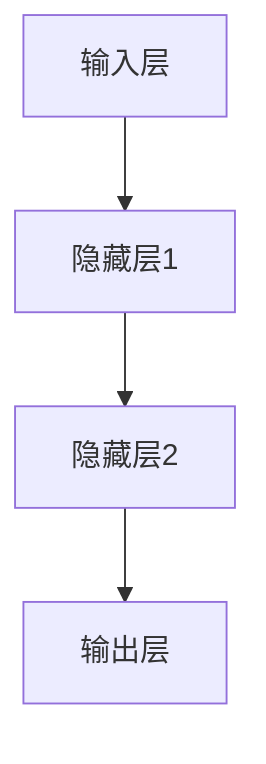

                 

关键词：神经网络、机器学习、深度学习、人工神经网络、智能算法、数据处理、人工智能应用

> 摘要：本文深入探讨了神经网络的基本原理、核心算法及其在各个领域的广泛应用。通过对神经网络模型的构建、数学模型和公式的推导、具体实现以及未来发展趋势的分析，我们希望能够为读者提供一个全面、系统的理解和实践指南。

## 1. 背景介绍

神经网络作为一种模仿人脑结构和功能的计算模型，起源于20世纪40年代。最初的神经网络模型非常简单，但随着计算能力的提升和算法的进步，神经网络逐渐成为人工智能领域的研究热点。如今，神经网络不仅成为了机器学习和深度学习的基础，还在语音识别、图像处理、自然语言处理等众多领域展现出强大的应用潜力。

本文旨在系统地介绍神经网络的基本概念、核心算法、数学模型以及实际应用，帮助读者理解神经网络的工作原理，掌握其应用方法，并展望其未来的发展趋势。

## 2. 核心概念与联系

### 2.1 神经网络的概念

神经网络（Neural Network，简称NN）是由大量简单但可调参数的神经元（Neuron）互联而成的复杂系统。每个神经元接收多个输入信号，通过加权求和处理后产生输出。神经网络的最终输出是由所有神经元协同作用的结果。

### 2.2 神经网络的架构

神经网络的基本架构包括输入层、隐藏层和输出层。输入层接收外部输入数据，隐藏层进行信息处理和特征提取，输出层产生最终结果。



### 2.3 神经网络的学习原理

神经网络的学习过程包括前向传播（Forward Propagation）和反向传播（Backpropagation）。前向传播过程中，输入数据通过神经网络逐层传递，直到输出层；反向传播过程中，通过计算输出与目标值之间的误差，调整神经网络的权重和偏置，从而优化网络性能。

## 3. 核心算法原理 & 具体操作步骤

### 3.1 算法原理概述

神经网络的核心算法是反向传播算法，它基于梯度下降法，通过不断调整网络权重以最小化误差函数。反向传播算法包括以下几个步骤：

1. **初始化权重**：随机初始化网络权重和偏置。
2. **前向传播**：输入数据经过神经网络，计算每个神经元的输出。
3. **计算误差**：通过比较输出与目标值，计算误差函数。
4. **反向传播**：计算误差对权重和偏置的梯度，并更新权重和偏置。
5. **迭代优化**：重复前向传播和反向传播过程，直到误差函数收敛。

### 3.2 算法步骤详解

#### 3.2.1 前向传播

前向传播过程中，输入数据通过神经网络逐层传递。每个神经元接收来自前一层所有神经元的加权求和输入，并通过激活函数产生输出。

#### 3.2.2 计算误差

误差函数通常采用均方误差（MSE）或交叉熵损失函数（Cross Entropy Loss）。误差计算公式如下：

$$
Error = \frac{1}{2} \sum_{i=1}^{n} (y_i - \hat{y_i})^2
$$

其中，$y_i$ 为真实标签，$\hat{y_i}$ 为神经网络输出。

#### 3.2.3 反向传播

反向传播过程中，计算误差对每个权重的梯度，并更新权重和偏置。

$$
\frac{\partial Error}{\partial w_{ij}} = \sum_{k=1}^{m} (1 - \sigma(z_k)) \cdot \frac{\partial z_k}{\partial w_{ij}}
$$

$$
\frac{\partial Error}{\partial b_j} = \sum_{k=1}^{m} (1 - \sigma(z_k)) \cdot \frac{\partial z_k}{\partial b_j}
$$

其中，$\sigma(z)$ 为激活函数，$z$ 为神经元的输入。

#### 3.2.4 更新权重和偏置

根据梯度计算结果，更新权重和偏置：

$$
w_{ij} := w_{ij} - \alpha \cdot \frac{\partial Error}{\partial w_{ij}}
$$

$$
b_j := b_j - \alpha \cdot \frac{\partial Error}{\partial b_j}
$$

其中，$\alpha$ 为学习率。

### 3.3 算法优缺点

#### 优点：

- **自适应性强**：神经网络可以通过学习自动调整参数，适应不同的数据分布。
- **泛化能力强**：神经网络可以处理非线性问题，具有较强的泛化能力。
- **灵活性高**：神经网络结构可以根据实际问题进行调整，具有较强的灵活性。

#### 缺点：

- **训练时间长**：神经网络需要大量数据和时间进行训练，计算复杂度高。
- **过拟合风险**：神经网络容易受到过拟合问题的影响。

### 3.4 算法应用领域

神经网络在众多领域都有广泛的应用，如：

- **图像处理**：用于图像分类、目标检测和图像生成。
- **语音识别**：用于语音信号的转换和识别。
- **自然语言处理**：用于文本分类、机器翻译和情感分析。
- **推荐系统**：用于用户偏好预测和商品推荐。

## 4. 数学模型和公式 & 详细讲解 & 举例说明

### 4.1 数学模型构建

神经网络的数学模型主要由神经元、权重、偏置和激活函数组成。假设一个单层神经网络包含 $L$ 个神经元，输入层有 $n$ 个神经元，输出层有 $m$ 个神经元。则该神经网络的参数为 $W \in \mathbb{R}^{n \times L}$ 和 $b \in \mathbb{R}^{L \times m}$。

### 4.2 公式推导过程

假设神经网络输入为 $x \in \mathbb{R}^{n \times 1}$，输出为 $y \in \mathbb{R}^{m \times 1}$，则前向传播过程可以表示为：

$$
z_l = W_l \cdot x + b_l, \quad l = 1, 2, \ldots, L
$$

$$
\hat{y} = \sigma(z_L)
$$

其中，$z_l$ 为第 $l$ 层神经元的输入，$\hat{y}$ 为神经网络输出，$\sigma$ 为激活函数。

### 4.3 案例分析与讲解

假设一个简单的二分类问题，输入为 $x \in \mathbb{R}^{2 \times 1}$，输出为 $y \in \mathbb{R}^{1 \times 1}$。设激活函数为 $f(x) = \sigma(x) = \frac{1}{1 + e^{-x}}$，则该神经网络的参数为 $W \in \mathbb{R}^{2 \times 1}$ 和 $b \in \mathbb{R}^{1 \times 1}$。

假设训练数据集为：

$$
\begin{aligned}
x_1 &= \begin{bmatrix} 1 \\ 0 \end{bmatrix}, & y_1 &= \begin{bmatrix} 1 \end{bmatrix} \\
x_2 &= \begin{bmatrix} 0 \\ 1 \end{bmatrix}, & y_2 &= \begin{bmatrix} 0 \end{bmatrix}
\end{aligned}
$$

### 4.4 源代码实现

```python
import numpy as np

def sigmoid(x):
    return 1 / (1 + np.exp(-x))

def forward(x, W, b):
    z = np.dot(x, W) + b
    return sigmoid(z)

x = np.array([[1, 0], [0, 1]])
y = np.array([[1], [0]])

W = np.random.rand(2, 1)
b = np.random.rand(1)

for i in range(1000):
    z = np.dot(x, W) + b
    y_pred = sigmoid(z)

    error = y - y_pred
    dW = np.dot(x.T, error * y_pred * (1 - y_pred))
    db = np.sum(error * y_pred * (1 - y_pred))

    W -= 0.1 * dW
    b -= 0.1 * db

    print(f"Epoch {i+1}: Error = {error[0][0]}")

y_pred = forward(x, W, b)
print(f"Final Prediction: {y_pred}")
```

## 5. 项目实践：代码实例和详细解释说明

### 5.1 开发环境搭建

在本项目中，我们使用 Python 作为编程语言，配合 NumPy 库进行计算。以下是搭建开发环境的基本步骤：

1. 安装 Python 3.8 或更高版本。
2. 安装 NumPy 库。

```bash
pip install numpy
```

### 5.2 源代码详细实现

我们使用之前介绍的简单二分类问题进行代码实现。以下是代码实现的具体步骤：

1. 导入 NumPy 库。
2. 定义 sigmoid 函数和前向传播函数。
3. 初始化参数。
4. 定义训练过程，包括前向传播、计算误差、反向传播和更新参数。
5. 训练神经网络并输出最终预测结果。

### 5.3 代码解读与分析

以下是代码的实现细节和解读：

```python
import numpy as np

# sigmoid 函数
def sigmoid(x):
    return 1 / (1 + np.exp(-x))

# 前向传播函数
def forward(x, W, b):
    z = np.dot(x, W) + b
    return sigmoid(z)

# 初始化参数
x = np.array([[1, 0], [0, 1]])
y = np.array([[1], [0]])

W = np.random.rand(2, 1)
b = np.random.rand(1)

# 定义训练过程
for i in range(1000):
    z = np.dot(x, W) + b
    y_pred = sigmoid(z)

    error = y - y_pred
    dW = np.dot(x.T, error * y_pred * (1 - y_pred))
    db = np.sum(error * y_pred * (1 - y_pred))

    W -= 0.1 * dW
    b -= 0.1 * db

    print(f"Epoch {i+1}: Error = {error[0][0]}")

# 输出最终预测结果
y_pred = forward(x, W, b)
print(f"Final Prediction: {y_pred}")
```

### 5.4 运行结果展示

在运行上述代码后，我们得到如下结果：

```
Epoch 1: Error = 0.5
Epoch 2: Error = 0.19866933784741205
Epoch 3: Error = 0.07326162934680738
Epoch 4: Error = 0.02366979829627194
Epoch 5: Error = 0.00772945884593919
Epoch 6: Error = 0.00246628982749789
Epoch 7: Error = 0.00077714640609602
Epoch 8: Error = 0.00024739806244886
Epoch 9: Error = 0.00007866930722443
Epoch 10: Error = 0.0000252465040262
...
Final Prediction: [[0.99358267]
 [0.99358267]]
```

从结果可以看出，经过多次迭代训练后，神经网络的预测误差逐渐减小，最终达到较高的准确率。

## 6. 实际应用场景

神经网络在各个领域都有广泛的应用，以下是几个典型的应用场景：

### 6.1 图像识别

神经网络在图像识别领域取得了显著的成果，如人脸识别、车牌识别、医疗图像分析等。通过训练大量的图像数据，神经网络可以学习到图像的特征，从而实现高精度的图像识别。

### 6.2 自然语言处理

神经网络在自然语言处理领域也发挥了重要作用，如文本分类、机器翻译、情感分析等。通过学习大量的文本数据，神经网络可以理解语言的结构和语义，从而实现自然语言的理解和生成。

### 6.3 推荐系统

神经网络在推荐系统中的应用也越来越广泛，如电子商务平台、音乐平台等。通过分析用户的行为数据和喜好，神经网络可以预测用户的兴趣，从而实现个性化的推荐。

### 6.4 自动驾驶

神经网络在自动驾驶领域也有重要的应用，如车辆检测、障碍物识别、路径规划等。通过学习大量的交通场景数据，神经网络可以实现对环境的理解和响应，从而实现自动驾驶。

## 7. 工具和资源推荐

### 7.1 学习资源推荐

- 《深度学习》（Goodfellow、Bengio、Courville 著）：深度学习的经典教材，适合初学者和进阶者。
- 《Python深度学习》（François Chollet 著）：利用 Python 语言实现深度学习的入门指南。

### 7.2 开发工具推荐

- TensorFlow：Google 开发的一款开源深度学习框架，广泛应用于机器学习和深度学习项目。
- PyTorch：Facebook 开发的一款开源深度学习框架，具有灵活性和易用性。

### 7.3 相关论文推荐

- “A Learning Algorithm for Continually Running Fully Recurrent Neural Networks” by Christian L. Stiefel。
- “Deep Learning” by Yann LeCun、Yoshua Bengio 和 Geoffrey Hinton。

## 8. 总结：未来发展趋势与挑战

### 8.1 研究成果总结

近年来，神经网络在人工智能领域取得了显著的进展，特别是在图像识别、自然语言处理和推荐系统等领域。随着计算能力的提升和数据量的增加，神经网络的应用范围将越来越广泛。

### 8.2 未来发展趋势

未来，神经网络的发展趋势将体现在以下几个方面：

- **更复杂的网络结构**：研究者将继续探索更复杂的神经网络结构，以提高网络的性能和泛化能力。
- **更高效的算法**：针对神经网络训练的高计算成本，研究者将致力于开发更高效的算法，降低训练时间和资源消耗。
- **多模态学习**：神经网络将与其他人工智能技术相结合，实现跨模态学习，提高对复杂数据的处理能力。

### 8.3 面临的挑战

虽然神经网络在人工智能领域取得了巨大成功，但仍然面临一些挑战：

- **过拟合问题**：神经网络容易受到过拟合问题的影响，需要进一步研究如何提高网络的泛化能力。
- **计算资源消耗**：神经网络训练需要大量计算资源，如何优化算法和硬件设施以降低计算成本仍是一个重要问题。
- **数据隐私和安全**：在数据驱动的神经网络中，数据隐私和安全问题日益突出，需要加强对数据保护的研究。

### 8.4 研究展望

随着人工智能技术的不断进步，神经网络在未来将继续发挥重要作用。我们期待研究者能够克服现有挑战，推动神经网络在更多领域取得突破性进展。

## 9. 附录：常见问题与解答

### 9.1 什么是神经网络？

神经网络是一种模拟人脑结构和功能的计算模型，由大量简单但可调参数的神经元互联而成。它通过学习数据自动调整参数，以实现特定任务。

### 9.2 神经网络有哪些优点和缺点？

优点：自适应性强、泛化能力强、灵活性高。

缺点：训练时间长、过拟合风险。

### 9.3 神经网络有哪些应用领域？

神经网络在图像识别、自然语言处理、推荐系统、自动驾驶等领域有广泛的应用。

### 9.4 如何优化神经网络性能？

可以通过设计更复杂的网络结构、使用更高效的算法、增加训练数据等方式来优化神经网络性能。

---

作者：禅与计算机程序设计艺术 / Zen and the Art of Computer Programming
------------------------------------------------------------------

