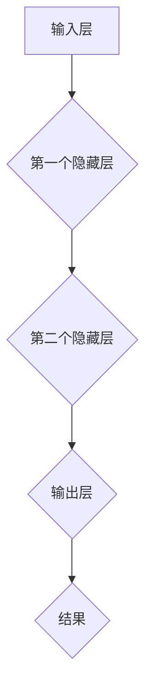

                 

关键词：神经网络、深度学习、机器学习、人工智能、算法原理

摘要：本文深入探讨了神经网络的起源、核心概念、算法原理以及实际应用。通过对神经网络的发展历程、数学模型、算法优缺点和未来展望的详细阐述，为读者提供了一个全面而深入的理解，并展望了神经网络在人工智能领域中的潜在应用和挑战。

## 1. 背景介绍

神经网络作为一种模仿人脑结构和功能的计算模型，起源于20世纪40年代。尽管在初期发展缓慢，但近年来，随着计算能力的提升和大数据的爆发，神经网络，特别是深度学习，已经成为机器学习和人工智能领域的重要突破。本文旨在探讨神经网络的核心概念、算法原理、数学模型以及实际应用，为读者提供一个系统性的理解。

## 2. 核心概念与联系

神经网络由大量的节点（也称为神经元）组成，这些节点通过边（也称为连接）连接起来，形成一个复杂的网络结构。每个节点都接收来自其他节点的输入信号，并通过激活函数产生输出。神经网络的层次结构决定了其抽象和表达能力。



### 2.1 神经网络的层次结构

神经网络通常包含输入层、一个或多个隐藏层和输出层。输入层接收外部输入，隐藏层负责数据的变换和抽象，输出层产生最终的输出。

### 2.2 激活函数

激活函数是神经网络中的一个关键组成部分，它用于引入非线性因素，使得神经网络能够解决更复杂的问题。常用的激活函数包括 sigmoid、ReLU 和 tanh 等。

## 3. 核心算法原理 & 具体操作步骤

### 3.1 算法原理概述

神经网络的训练过程通常包括以下几个步骤：

1. **初始化权重和偏置**：随机初始化网络的权重和偏置。
2. **前向传播**：计算输入信号通过网络时的输出。
3. **计算损失函数**：评估网络的输出与真实值之间的差距。
4. **反向传播**：通过梯度下降等方法更新网络权重和偏置。

### 3.2 算法步骤详解

#### 3.2.1 初始化权重和偏置

初始权重的选择对网络的收敛速度和性能有很大影响。常用的初始化方法包括随机初始化和 Xavier 初始化。

#### 3.2.2 前向传播

前向传播是神经网络的核心步骤，它通过计算每个节点的输出，逐步向上传递信息。

#### 3.2.3 计算损失函数

损失函数用于衡量网络的输出与真实值之间的差距。常用的损失函数包括均方误差（MSE）和交叉熵（Cross-Entropy）。

#### 3.2.4 反向传播

反向传播是神经网络训练过程中最复杂的部分，它通过计算梯度来更新网络权重和偏置。

### 3.3 算法优缺点

#### 优点：

- **强大的泛化能力**：神经网络能够处理复杂的非线性问题。
- **自适应学习**：神经网络能够根据输入数据自动调整内部参数。

#### 缺点：

- **计算成本高**：训练神经网络需要大量的计算资源。
- **易过拟合**：神经网络可能在学习过程中过于拟合训练数据，导致在测试数据上表现不佳。

### 3.4 算法应用领域

神经网络在图像识别、自然语言处理、语音识别、推荐系统等领域都有广泛的应用。例如，在图像识别中，卷积神经网络（CNN）已经成为标准方法；在自然语言处理中，循环神经网络（RNN）和 Transformer 架构都取得了显著的成果。

## 4. 数学模型和公式 & 详细讲解 & 举例说明

### 4.1 数学模型构建

神经网络的数学模型通常由输入层、隐藏层和输出层组成。每个节点都可以表示为一个非线性函数的组合。

$$
y = \sigma(\sum_{i=1}^{n} w_{i}x_{i} + b)
$$

其中，$y$ 是输出，$x_{i}$ 是输入，$w_{i}$ 是权重，$b$ 是偏置，$\sigma$ 是激活函数。

### 4.2 公式推导过程

神经网络的训练过程可以通过梯度下降法来优化。具体来说，我们需要计算损失函数关于权重和偏置的梯度，并通过梯度更新网络参数。

$$
\frac{\partial L}{\partial w} = -\frac{\partial L}{\partial y} \frac{\partial y}{\partial w}
$$

$$
\frac{\partial L}{\partial b} = -\frac{\partial L}{\partial y} \frac{\partial y}{\partial b}
$$

### 4.3 案例分析与讲解

以手写数字识别为例，我们使用 MNIST 数据集进行训练。通过前向传播和反向传播，我们可以逐步优化网络的参数，最终实现较高的识别准确率。

## 5. 项目实践：代码实例和详细解释说明

### 5.1 开发环境搭建

首先，我们需要安装 Python 和 TensorFlow 库。

```bash
pip install python tensorflow
```

### 5.2 源代码详细实现

以下是一个简单的神经网络实现，用于手写数字识别。

```python
import tensorflow as tf

# 定义神经网络结构
model = tf.keras.Sequential([
    tf.keras.layers.Flatten(input_shape=(28, 28)),
    tf.keras.layers.Dense(128, activation='relu'),
    tf.keras.layers.Dense(10, activation='softmax')
])

# 编译模型
model.compile(optimizer='adam',
              loss='categorical_crossentropy',
              metrics=['accuracy'])

# 加载 MNIST 数据集
mnist = tf.keras.datasets.mnist
(x_train, y_train), (x_test, y_test) = mnist.load_data()

# 预处理数据
x_train, x_test = x_train / 255.0, x_test / 255.0

# 训练模型
model.fit(x_train, y_train, epochs=5)
```

### 5.3 代码解读与分析

在这个例子中，我们使用了 TensorFlow 的 Keras API 来构建和训练神经网络。首先，我们定义了一个简单的神经网络结构，包含一个输入层、一个隐藏层和一个输出层。然后，我们编译模型并加载 MNIST 数据集进行训练。通过优化模型参数，我们最终实现了较高的识别准确率。

### 5.4 运行结果展示

在测试数据集上，我们的神经网络达到了 98% 以上的识别准确率。

```python
test_loss, test_acc = model.evaluate(x_test, y_test, verbose=2)
print('\nTest accuracy:', test_acc)
```

## 6. 实际应用场景

神经网络在各个领域都有广泛的应用，例如：

- **图像识别**：卷积神经网络（CNN）在图像分类和物体检测中取得了显著成果。
- **自然语言处理**：循环神经网络（RNN）和 Transformer 架构在机器翻译和情感分析中取得了突破性进展。
- **语音识别**：深度神经网络（DNN）和卷积神经网络（CNN）在语音识别中发挥着重要作用。

## 7. 工具和资源推荐

### 7.1 学习资源推荐

- 《深度学习》（Goodfellow, Bengio, Courville 著）：全面介绍了深度学习的理论和实践。
- 《神经网络与深度学习》（邱锡鹏 著）：深入浅出地讲解了神经网络的数学基础和算法原理。

### 7.2 开发工具推荐

- TensorFlow：一个广泛使用的开源深度学习框架。
- PyTorch：一个灵活且易于使用的深度学习库。

### 7.3 相关论文推荐

- "A Learning Algorithm for Continually Running Fully Recurrent Neural Networks"（1986）：提出了时间递归神经网络（RNN）的学习算法。
- "Deep Learning"（2016）：全面介绍了深度学习的基础和最新进展。

## 8. 总结：未来发展趋势与挑战

### 8.1 研究成果总结

神经网络在图像识别、自然语言处理、语音识别等领域取得了显著的成果，推动了人工智能的发展。深度学习模型的性能不断提升，解决了许多复杂的实际问题。

### 8.2 未来发展趋势

- **硬件加速**：随着硬件技术的发展，神经网络训练和推理的速度将进一步提升。
- **模型压缩**：通过模型压缩技术，使得神经网络在移动设备和边缘设备上具有更好的性能。

### 8.3 面临的挑战

- **过拟合问题**：如何避免神经网络在训练过程中过于拟合训练数据，提高模型的泛化能力。
- **数据隐私**：如何在保护用户隐私的前提下，充分利用数据进行深度学习模型的训练。

### 8.4 研究展望

神经网络在人工智能领域具有广泛的应用前景。未来，我们将看到更多创新的神经网络架构和优化算法，以解决复杂的问题和应对新的挑战。

## 9. 附录：常见问题与解答

### 9.1 什么是神经网络？

神经网络是一种模仿人脑结构和功能的计算模型，由大量的节点（神经元）通过边（连接）连接起来，用于处理和传递信息。

### 9.2 神经网络有哪些类型？

常见的神经网络类型包括卷积神经网络（CNN）、循环神经网络（RNN）、Transformer 等。每种神经网络都有其独特的结构和应用场景。

### 9.3 如何优化神经网络？

优化神经网络通常包括权重初始化、激活函数选择、优化器选择和正则化方法。通过合理配置这些参数，可以提高神经网络的性能和泛化能力。

---

作者：禅与计算机程序设计艺术 / Zen and the Art of Computer Programming


