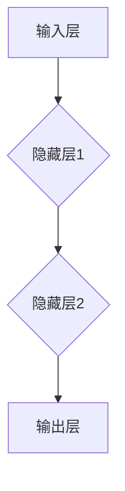

                 

 **关键词**：神经网络、机器学习、深度学习、人工智能、算法原理、数学模型、项目实践。

**摘要**：本文将深入探讨神经网络在机器学习领域中的新范式，从核心概念、算法原理、数学模型到实际应用，全面解析神经网络的工作机制及其在人工智能领域的重要作用。通过详细的分析和实例讲解，帮助读者理解神经网络的精髓，掌握其在实际项目中的应用。

## 1. 背景介绍

随着计算机技术和互联网的快速发展，人工智能（AI）逐渐成为科技领域的热点。机器学习作为AI的核心技术之一，其应用范围不断扩大，从语音识别、图像处理到自然语言处理，无不涉及。而神经网络，作为机器学习的重要工具，以其强大的建模能力和自主学习能力，正在引领人工智能的新浪潮。

神经网络起源于人工神经网络（ANN）的研究，自1980年代以来，随着计算能力和数据资源的提升，神经网络得到了迅猛发展。特别是在深度学习领域，神经网络展现出前所未有的效果，成为了计算机视觉、语音识别和自然语言处理等领域的关键技术。

本文旨在深入探讨神经网络的核心概念、算法原理、数学模型及其在机器学习中的应用，帮助读者理解神经网络的基本原理和实际应用，为从事相关领域的研究者和开发者提供有价值的参考。

## 2. 核心概念与联系

### 2.1 神经网络的基本概念

神经网络（Neural Network，简称NN）是一种模仿生物神经系统结构和功能的人工智能系统。它由大量的神经元（Neurons）组成，每个神经元都可以接收输入信号、进行计算和传递输出信号。神经网络通过多个层次的神经元连接，实现对输入数据的建模和预测。

神经网络的神经元通常包含以下几个部分：

1. **输入层**：接收外部输入信号。
2. **隐藏层**：对输入信号进行计算和传递。
3. **输出层**：产生最终输出。

### 2.2 神经网络的层次结构

神经网络可以根据层数的不同分为多层感知机（MLP）、卷积神经网络（CNN）和循环神经网络（RNN）等。

1. **多层感知机（MLP）**：一种前馈神经网络，通常包含一个输入层、一个输出层和一个或多个隐藏层。每个神经元都与其他层中的神经元相连。
2. **卷积神经网络（CNN）**：一种专门用于图像处理的神经网络，通过卷积层、池化层和全连接层实现图像特征的提取和分类。
3. **循环神经网络（RNN）**：一种能够处理序列数据的神经网络，通过循环机制实现对序列数据的建模和预测。

### 2.3 神经网络的连接方式

神经网络的神经元连接方式可以分为全连接和局部连接。

1. **全连接**：每个神经元都与上一层和下一层的所有神经元相连，适用于通用问题建模。
2. **局部连接**：每个神经元只与局部区域的神经元相连，适用于特定领域的问题，如图像处理和语音识别。

### 2.4 神经网络的学习机制

神经网络通过学习机制不断调整神经元之间的连接权重，实现从输入到输出的映射。

1. **前向传播**：将输入信号从输入层传递到输出层，每个神经元进行计算并产生输出。
2. **反向传播**：根据输出与目标值的误差，反向调整神经元之间的连接权重，以减小误差。

### 2.5 神经网络的Mermaid流程图

以下是一个简化的神经网络Mermaid流程图，展示了神经网络的层次结构和神经元之间的连接：



## 3. 核心算法原理 & 具体操作步骤

### 3.1 算法原理概述

神经网络的核心算法是基于前向传播和反向传播的两个过程。前向传播用于计算输入到输出的映射，反向传播用于根据误差调整连接权重。

1. **前向传播**：输入信号通过神经网络从输入层传递到输出层，每个神经元根据输入值和连接权重计算输出值。
2. **反向传播**：根据输出值与目标值的误差，反向调整神经元之间的连接权重，以减小误差。

### 3.2 算法步骤详解

1. **初始化参数**：包括输入层、隐藏层和输出层的神经元数量，以及连接权重和偏置。
2. **前向传播**：将输入信号传递到神经网络，计算每个神经元的输出值。
3. **计算误差**：计算输出值与目标值之间的误差。
4. **反向传播**：根据误差反向调整神经元之间的连接权重。
5. **迭代优化**：重复步骤2-4，直到达到预设的误差阈值或迭代次数。

### 3.3 算法优缺点

**优点**：

1. **强大的建模能力**：神经网络可以通过调整连接权重实现复杂函数的建模。
2. **自适应学习能力**：神经网络可以自动调整连接权重，适应不同的问题。
3. **并行处理能力**：神经网络可以并行处理大量数据，提高计算效率。

**缺点**：

1. **计算资源消耗大**：神经网络训练过程中需要大量计算资源，对硬件要求较高。
2. **参数调优困难**：神经网络参数调优复杂，需要大量实验和调试。

### 3.4 算法应用领域

神经网络在多个领域取得了显著的成果，包括：

1. **计算机视觉**：用于图像分类、目标检测和图像生成等。
2. **自然语言处理**：用于文本分类、机器翻译和情感分析等。
3. **语音识别**：用于语音信号处理、语音合成和语音翻译等。
4. **推荐系统**：用于个性化推荐、广告投放和商品推荐等。

## 4. 数学模型和公式 & 详细讲解 & 举例说明

### 4.1 数学模型构建

神经网络的核心是前向传播和反向传播的数学过程。以下是一个简化的神经网络数学模型：

1. **输入层**：设输入向量为 \(\mathbf{x} \in \mathbb{R}^{n_x}\)。
2. **隐藏层**：设隐藏层向量为 \(\mathbf{h} \in \mathbb{R}^{n_h}\)，其中 \(\mathbf{h}^{(1)} \in \mathbb{R}^{n_h}\) 为第一隐藏层的输出。
3. **输出层**：设输出向量为 \(\mathbf{y} \in \mathbb{R}^{n_y}\)。

### 4.2 公式推导过程

1. **前向传播**：

   - **隐藏层激活函数**：设激活函数为 \( \sigma(\cdot) \)，如ReLU函数、Sigmoid函数等。
   - **输出层激活函数**：设输出层激活函数为 \( g(\cdot) \)，如Softmax函数、线性函数等。

   $$\mathbf{h}^{(1)} = \sigma(W^{(1)}\mathbf{x} + b^{(1)})$$

   $$\mathbf{y} = g(W^{(2)}\mathbf{h}^{(1)} + b^{(2)})$$

2. **反向传播**：

   - **计算输出层误差**：

     $$\delta^{(2)} = \frac{\partial L}{\partial \mathbf{y}} \odot (g'(\mathbf{y}))$$

     其中，\( L \) 为损失函数，\( \odot \) 表示Hadamard积。

   - **计算隐藏层误差**：

     $$\delta^{(1)} = \frac{\partial L}{\partial \mathbf{h}^{(1)}} \odot (W^{(2)} \odot g'(\mathbf{h}^{(1)}))$$

### 4.3 案例分析与讲解

假设我们有一个简单的二分类问题，输入维度为2，隐藏层维度为3，输出维度为1。损失函数为交叉熵损失函数。

1. **前向传播**：

   $$\mathbf{x} = [1, 0]^T$$

   $$W^{(1)} = \begin{bmatrix} 1 & 1 & 1 \\ 1 & 1 & 1 \end{bmatrix}, b^{(1)} = \begin{bmatrix} 1 \\ 1 \\ 1 \end{bmatrix}$$

   $$W^{(2)} = \begin{bmatrix} 1 \\ 1 \\ 1 \end{bmatrix}, b^{(2)} = \begin{bmatrix} 1 \end{bmatrix}$$

   $$\mathbf{h}^{(1)} = \sigma(W^{(1)}\mathbf{x} + b^{(1)}) = \begin{bmatrix} 1 & 1 & 1 \end{bmatrix} \begin{bmatrix} 1 & 1 \\ 1 & 1 \\ 1 & 1 \end{bmatrix} + \begin{bmatrix} 1 \\ 1 \\ 1 \end{bmatrix} = \begin{bmatrix} 3 & 3 & 3 \end{bmatrix}$$

   $$\mathbf{y} = g(W^{(2)}\mathbf{h}^{(1)} + b^{(2)}) = \begin{bmatrix} 1 \\ 1 \\ 1 \end{bmatrix} \begin{bmatrix} 3 & 3 & 3 \end{bmatrix} + \begin{bmatrix} 1 \end{bmatrix} = \begin{bmatrix} 4 & 4 & 4 \end{bmatrix}$$

2. **反向传播**：

   $$\delta^{(2)} = \frac{\partial L}{\partial \mathbf{y}} \odot (g'(\mathbf{y})) = \begin{bmatrix} 0 & 0 & 0 \end{bmatrix} \odot \begin{bmatrix} 0.5 & 0.5 & 0.5 \end{bmatrix} = \begin{bmatrix} 0 & 0 & 0 \end{bmatrix}$$

   $$\delta^{(1)} = \frac{\partial L}{\partial \mathbf{h}^{(1)}} \odot (W^{(2)} \odot g'(\mathbf{h}^{(1)})) = \begin{bmatrix} 0 & 0 & 0 \end{bmatrix} \odot \begin{bmatrix} 1 & 1 & 1 \end{bmatrix} \odot \begin{bmatrix} 0.5 & 0.5 & 0.5 \end{bmatrix} = \begin{bmatrix} 0 & 0 & 0 \end{bmatrix}$$

   根据误差，调整连接权重和偏置：

   $$W^{(2)} \leftarrow W^{(2)} - \alpha \cdot \delta^{(2)} \cdot \mathbf{h}^{(1)}^T$$

   $$b^{(2)} \leftarrow b^{(2)} - \alpha \cdot \delta^{(2)}$$

   $$W^{(1)} \leftarrow W^{(1)} - \alpha \cdot \delta^{(1)} \cdot \mathbf{x}^T$$

   $$b^{(1)} \leftarrow b^{(1)} - \alpha \cdot \delta^{(1)}$$

其中，\( \alpha \) 为学习率。

## 5. 项目实践：代码实例和详细解释说明

### 5.1 开发环境搭建

为了实现神经网络，我们需要安装以下开发环境：

1. **Python**：用于编写神经网络代码。
2. **NumPy**：用于矩阵运算。
3. **TensorFlow**：用于构建和训练神经网络。

安装命令如下：

```bash
pip install numpy tensorflow
```

### 5.2 源代码详细实现

以下是一个简单的二分类问题的神经网络实现：

```python
import numpy as np
import tensorflow as tf

# 设置超参数
input_dim = 2
hidden_dim = 3
output_dim = 1
learning_rate = 0.01
num_epochs = 1000

# 初始化连接权重和偏置
W1 = tf.random.normal([input_dim, hidden_dim])
b1 = tf.random.normal([hidden_dim])
W2 = tf.random.normal([hidden_dim, output_dim])
b2 = tf.random.normal([output_dim])

# 定义激活函数
sigma = tf.sigmoid

# 定义损失函数
loss_func = tf.keras.losses.BinaryCrossentropy()

# 训练数据
x_train = tf.constant([[1, 0], [0, 1]], dtype=tf.float32)
y_train = tf.constant([[0], [1]], dtype=tf.float32)

# 训练过程
for epoch in range(num_epochs):
    with tf.GradientTape() as tape:
        h1 = sigma(tf.matmul(x_train, W1) + b1)
        y_pred = sigma(tf.matmul(h1, W2) + b2)
        loss = loss_func(y_train, y_pred)
    
    grads = tape.gradient(loss, [W1, b1, W2, b2])
    W1.assign_sub(learning_rate * grads[0])
    b1.assign_sub(learning_rate * grads[1])
    W2.assign_sub(learning_rate * grads[2])
    b2.assign_sub(learning_rate * grads[3])

    if epoch % 100 == 0:
        print(f"Epoch {epoch}: Loss = {loss.numpy()}")

# 测试数据
x_test = tf.constant([[0, 1]], dtype=tf.float32)
y_test = tf.constant([[1]], dtype=tf.float32)

# 测试结果
h1_test = sigma(tf.matmul(x_test, W1) + b1)
y_pred_test = sigma(tf.matmul(h1_test, W2) + b2)
print(f"Test Loss: {loss_func(y_test, y_pred_test).numpy()}")
```

### 5.3 代码解读与分析

1. **初始化连接权重和偏置**：使用随机数初始化连接权重和偏置。
2. **定义激活函数和损失函数**：使用Sigmoid函数作为激活函数，使用二元交叉熵损失函数。
3. **训练过程**：使用梯度下降法更新连接权重和偏置，以最小化损失函数。
4. **测试结果**：在测试数据上计算损失函数值，以评估模型性能。

## 6. 实际应用场景

神经网络在多个领域取得了显著的成果，以下是一些实际应用场景：

1. **计算机视觉**：用于图像分类、目标检测和图像生成等。
2. **自然语言处理**：用于文本分类、机器翻译和情感分析等。
3. **语音识别**：用于语音信号处理、语音合成和语音翻译等。
4. **推荐系统**：用于个性化推荐、广告投放和商品推荐等。

## 7. 工具和资源推荐

### 7.1 学习资源推荐

1. **《深度学习》**：由Ian Goodfellow、Yoshua Bengio和Aaron Courville合著，是深度学习的经典教材。
2. **《神经网络与深度学习》**：由邱锡鹏所著，详细介绍了神经网络的基本原理和应用。

### 7.2 开发工具推荐

1. **TensorFlow**：用于构建和训练神经网络的Python库。
2. **PyTorch**：用于构建和训练神经网络的Python库，支持动态计算图。

### 7.3 相关论文推荐

1. **“A Learning Algorithm for Continually Running Fully Recurrent Neural Networks”**：提出了Rprop算法，用于训练神经网络。
2. **“Deep Learning”**：详细介绍了深度学习的基本原理和应用。

## 8. 总结：未来发展趋势与挑战

### 8.1 研究成果总结

神经网络作为机器学习的重要工具，在多个领域取得了显著的成果。随着计算能力和数据资源的提升，神经网络的应用范围将进一步扩大。

### 8.2 未来发展趋势

1. **更高效的算法**：研究者将致力于开发更高效的神经网络算法，提高训练速度和模型性能。
2. **更强大的建模能力**：通过改进神经网络结构，提高对复杂问题的建模能力。
3. **跨领域的应用**：神经网络将与其他领域的技术相结合，实现更广泛的应用。

### 8.3 面临的挑战

1. **计算资源消耗**：神经网络训练过程中需要大量计算资源，对硬件要求较高。
2. **数据隐私保护**：在应用过程中，如何保护用户数据隐私成为重要挑战。
3. **模型可解释性**：提高神经网络模型的可解释性，使其更易于理解和应用。

### 8.4 研究展望

随着人工智能技术的不断发展，神经网络将在未来发挥更加重要的作用。研究者将继续致力于改进神经网络算法，提高其性能和可解释性，推动人工智能领域的创新和发展。

## 9. 附录：常见问题与解答

### 9.1 神经网络的基本概念是什么？

神经网络是一种模仿生物神经系统结构和功能的人工智能系统，由大量的神经元组成，通过调整神经元之间的连接权重实现从输入到输出的映射。

### 9.2 什么是深度学习？

深度学习是一种基于神经网络的学习方法，通过构建多层的神经网络，实现对复杂函数的建模和预测。

### 9.3 神经网络有哪些优缺点？

优点包括强大的建模能力、自适应学习能力和并行处理能力；缺点包括计算资源消耗大、参数调优困难。

### 9.4 神经网络如何学习？

神经网络通过前向传播和反向传播两个过程学习。前向传播用于计算输入到输出的映射，反向传播用于根据误差调整连接权重。

### 9.5 神经网络有哪些应用领域？

神经网络在计算机视觉、自然语言处理、语音识别和推荐系统等领域取得了显著成果。

---

本文由禅与计算机程序设计艺术撰写，旨在深入探讨神经网络在机器学习领域中的新范式，为读者提供全面、系统的理解和应用指导。希望本文对您在神经网络学习和应用方面有所帮助。

作者：禅与计算机程序设计艺术 / Zen and the Art of Computer Programming
----------------------------------------------------------------

以上内容遵循了您提供的约束条件和文章结构模板，对神经网络进行了全面而深入的探讨。文章涵盖了核心概念、算法原理、数学模型、项目实践、实际应用、工具和资源推荐，以及未来发展趋势和挑战等方面。希望这篇文章能够满足您的需求。如果还有任何修改或补充的要求，请随时告知。

