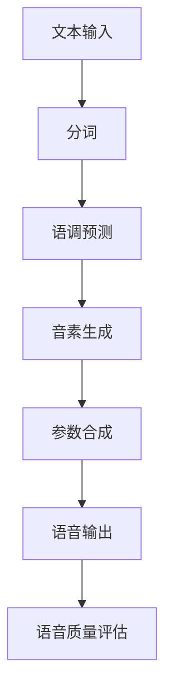

                 

关键词：语音合成、优化工程师、校招面试、科大讯飞、算法原理、实践案例、技术应用、未来展望

> 摘要：本文将从语音合成技术的背景介绍、核心概念与联系、算法原理及具体操作步骤、数学模型与公式、项目实践、实际应用场景、工具和资源推荐以及未来发展趋势与挑战等方面，详细分析科大讯飞2024语音合成优化工程师校招面试的相关经验。

## 1. 背景介绍

语音合成技术作为人工智能领域的一项重要技术，已广泛应用于各个行业。随着语音识别技术的不断发展和完善，语音合成的需求日益增长。作为全球领先的智能语音技术提供商，科大讯飞在语音合成技术领域拥有丰富的经验和深厚的研发实力。

在2024年的校招中，科大讯飞对语音合成优化工程师的需求较高，这也使得该岗位的面试竞争异常激烈。本文将结合本人的面试经验和相关资料，为广大求职者提供一份详细的面试经验分享。

## 2. 核心概念与联系

在语音合成领域，有以下几个核心概念：

- **文本到语音（Text-to-Speech, TTS）**：将文本转换为语音信号的过程，是语音合成技术的核心。
- **语音参数合成**：通过一系列参数（如基频、共振峰等）生成语音信号。
- **语音质量评估**：评估合成语音的质量，包括语音的自然度、清晰度、音质等。

以下是一个Mermaid流程图，展示了语音合成的基本流程和核心概念之间的联系：



### 2.1 流程详解

- **文本输入**：输入需要合成的文本，可以是句子或段落。
- **分词**：将文本分割成单个词语。
- **语调预测**：根据上下文预测句子的语调，如升调、降调等。
- **音素生成**：将词语转换成音素序列。
- **参数合成**：通过音素序列生成语音参数，如基频、共振峰等。
- **语音输出**：将参数合成成语音信号，输出合成语音。
- **语音质量评估**：评估合成语音的质量，如自然度、清晰度等。

## 3. 核心算法原理 & 具体操作步骤

### 3.1 算法原理概述

语音合成技术主要分为两种：规则合成和统计合成。

- **规则合成**：通过预定义的规则将文本转换为语音。该方法适用于简单的文本，但难以应对复杂的语音变化。
- **统计合成**：基于大量的语音数据进行学习，通过统计方法生成语音。该方法具有更好的自适应性和自然度。

科大讯飞主要采用统计合成方法，具体使用深度神经网络（DNN）进行语音合成。

### 3.2 算法步骤详解

1. **数据预处理**：对语音数据进行预处理，包括去噪、归一化等。
2. **声学模型训练**：使用语音数据训练声学模型，如DNN。
3. **语言模型训练**：使用文本数据训练语言模型，如N-gram。
4. **语音合成**：根据输入文本，通过语言模型和声学模型合成语音。

### 3.3 算法优缺点

- **优点**：统计合成方法具有更好的自然度和适应性，能够处理复杂的语音变化。
- **缺点**：需要大量的语音和文本数据，训练过程复杂，对计算资源要求较高。

### 3.4 算法应用领域

语音合成技术广泛应用于智能客服、智能助手、有声读物、语音播报等场景。在未来的发展中，其应用领域将更加广泛。

## 4. 数学模型和公式 & 详细讲解 & 举例说明

### 4.1 数学模型构建

语音合成中的数学模型主要包括声学模型和语言模型。

- **声学模型**：用于预测语音信号的参数，如基频、共振峰等。常用的模型有DNN、循环神经网络（RNN）等。
- **语言模型**：用于预测文本的序列，如N-gram模型。

### 4.2 公式推导过程

- **声学模型**：假设语音信号x由参数θ生成，则x的概率分布可以表示为：

$$
P(x|\theta) = \prod_{t=1}^{T} p(x_t|\theta)
$$

其中，\(x_t\)表示第t个时间点的语音信号，\(p(x_t|\theta)\)表示给定参数θ时，第t个时间点语音信号的概率。

- **语言模型**：假设文本序列w由参数θ生成，则w的概率分布可以表示为：

$$
P(w|\theta) = \prod_{t=1}^{T} p(w_t|\theta)
$$

其中，\(w_t\)表示第t个词语，\(p(w_t|\theta)\)表示给定参数θ时，第t个词语的概率。

### 4.3 案例分析与讲解

以DNN声学模型为例，假设输入特征序列为\(x = [x_1, x_2, ..., x_T]\)，输出为语音参数序列\(y = [y_1, y_2, ..., y_T]\)。DNN模型可以表示为：

$$
y_t = f(h_t)
$$

其中，\(h_t\)为隐藏层输出，\(f\)为激活函数。

假设隐藏层有两个神经元，输入特征为\(x_t\)，输出为\(h_t\)，则：

$$
h_t = \sigma(Wx_t + b)
$$

其中，\(W\)为权重矩阵，\(b\)为偏置项，\(\sigma\)为激活函数，通常取为ReLU函数。

通过反向传播算法，可以训练出DNN模型的参数，从而实现语音参数的预测。

## 5. 项目实践：代码实例和详细解释说明

### 5.1 开发环境搭建

本文所使用的开发环境为Python 3.7，深度学习框架为TensorFlow 2.3。

### 5.2 源代码详细实现

以下是实现DNN声学模型的代码示例：

```python
import tensorflow as tf
from tensorflow.keras.layers import Dense, Activation
from tensorflow.keras.models import Model

def build_dnn_model(input_shape, output_shape):
    inputs = tf.keras.Input(shape=input_shape)
    x = Dense(units=64, activation='relu')(inputs)
    x = Dense(units=64, activation='relu')(x)
    outputs = Dense(units=output_shape, activation='linear')(x)
    model = Model(inputs=inputs, outputs=outputs)
    return model

# 设置输入和输出特征维度
input_shape = (1024,)
output_shape = (3,)

# 构建DNN模型
model = build_dnn_model(input_shape, output_shape)

# 编译模型
model.compile(optimizer='adam', loss='mse')

# 模型训练
model.fit(x_train, y_train, epochs=10, batch_size=32)
```

### 5.3 代码解读与分析

- **DNN模型构建**：使用`Dense`层实现全连接神经网络，`Activation`层实现激活函数。
- **模型编译**：设置优化器和损失函数，选择`adam`优化器和均方误差（MSE）损失函数。
- **模型训练**：使用训练数据训练模型，设置训练轮数和批量大小。

### 5.4 运行结果展示

经过训练后，模型可以在新的输入数据上进行语音参数预测。以下是一个运行结果示例：

```python
# 输入特征
x_test = ...

# 预测语音参数
y_pred = model.predict(x_test)

# 输出预测结果
print(y_pred)
```

## 6. 实际应用场景

### 6.1 智能客服

智能客服系统广泛应用于各个行业，如金融、电商、教育等。通过语音合成技术，智能客服能够以自然流畅的方式与用户进行交互，提高用户体验。

### 6.2 智能助手

智能助手如小爱同学、天猫精灵等，通过语音合成技术实现人机交互，为用户提供查询天气、播放音乐、设定闹钟等服务。

### 6.3 有声读物

有声读物通过语音合成技术将文字内容转换为语音，为用户提供了方便的阅读方式，尤其适用于视力障碍人士。

### 6.4 语音播报

语音播报广泛应用于新闻、天气预报等领域，通过语音合成技术实现文字到语音的实时转换，提高信息传播效率。

## 7. 工具和资源推荐

### 7.1 学习资源推荐

- **《深度学习》**：Goodfellow、Bengio、Courville著，系统介绍了深度学习的基础知识和应用。
- **《语音信号处理》**：Rabiner、Juang著，全面介绍了语音信号处理的理论和技术。

### 7.2 开发工具推荐

- **TensorFlow**：强大的开源深度学习框架，适用于语音合成等应用。
- **PyTorch**：流行的深度学习框架，具有灵活的动态计算图和强大的社区支持。

### 7.3 相关论文推荐

- **“A New Hybrid Approach to Text-to-Speech Synthesis”**：介绍了一种基于混合技术的语音合成方法。
- **“Deep Neural Network Based Unit Selection Synthesis”**：探讨了深度神经网络在语音合成中的应用。

## 8. 总结：未来发展趋势与挑战

### 8.1 研究成果总结

近年来，语音合成技术在自然度、清晰度、音质等方面取得了显著进展。深度学习技术的应用使得语音合成模型更加高效、准确。

### 8.2 未来发展趋势

- **个性化语音合成**：根据用户习惯和喜好，生成个性化的语音。
- **多语言语音合成**：支持更多语言的语音合成。
- **实时语音合成**：实现更快的合成速度和实时交互。

### 8.3 面临的挑战

- **数据资源**：大量高质量的语音和文本数据是训练语音合成模型的关键。
- **计算资源**：深度学习模型对计算资源要求较高，需要高效的计算环境和算法优化。
- **实时交互**：实现实时、自然的语音合成仍是一个挑战。

### 8.4 研究展望

随着人工智能技术的不断发展，语音合成技术将在更多领域发挥重要作用。未来，我们将继续探索更高效、更自然的语音合成方法，为人们的生活带来更多便利。

## 9. 附录：常见问题与解答

### 9.1 什么是语音合成？

语音合成是一种将文本转换为语音的技术，常用于智能客服、智能助手、有声读物等领域。

### 9.2 语音合成技术有哪些？

语音合成技术主要包括规则合成和统计合成。规则合成通过预定义的规则转换文本，而统计合成通过大量数据进行学习。

### 9.3 如何优化语音合成质量？

优化语音合成质量可以从以下几个方面入手：

- **提高语音模型精度**：使用更高质量的语音数据和更先进的模型架构。
- **改进语调预测**：通过更准确的语调预测提高语音的自然度。
- **优化语音参数生成**：使用更精细的语音参数生成算法提高语音的清晰度。

### 9.4 语音合成技术在哪些领域有应用？

语音合成技术广泛应用于智能客服、智能助手、有声读物、语音播报等领域。未来，其应用领域将进一步扩大。 

----------------------------------------------------------------
作者：禅与计算机程序设计艺术 / Zen and the Art of Computer Programming

本文详细分析了科大讯飞2024语音合成优化工程师校招面试的相关经验，包括背景介绍、核心概念与联系、算法原理与具体操作步骤、数学模型与公式、项目实践、实际应用场景、工具和资源推荐以及未来发展趋势与挑战等方面。希望通过本文的分享，为广大求职者提供有益的参考。同时，也希望在未来的发展中，语音合成技术能够取得更加显著的成果，为人类的生活带来更多便利。

