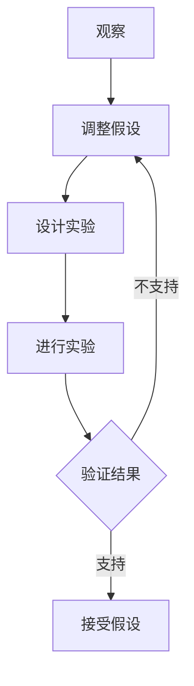

                 

在信息技术的快速演变中，科学探究不仅仅是对自然现象的观察和解释，它还涉及创新、假设的验证和持续的改进。本文将深入探讨科学探究的过程，从假说到真理，并特别关注IT领域中的这一过程。我们将探讨科学探究的核心概念、算法原理、数学模型、项目实践以及未来展望。

> 关键词：科学探究、假说验证、算法、数学模型、IT领域

> 摘要：本文详细阐述了科学探究的过程，包括从假说到真理的各个阶段。通过分析IT领域的具体案例，我们探讨了如何应用这些科学方法来解决复杂的问题，从而推动技术的进步。本文旨在为读者提供一个全面理解科学探究在IT领域中应用的机会，以期为未来的研究和发展提供指导。

## 1. 背景介绍

科学探究是一个系统的过程，涉及观察、假设、实验和验证。这一过程不仅在自然科学中至关重要，在信息技术（IT）领域也同样重要。IT领域的技术进步依赖于科学方法的运用，通过提出假说、设计实验和验证结果，科学家和工程师们不断改进技术和工具。

在过去的几十年里，信息技术经历了爆炸式的发展，从简单的计算设备到复杂的网络系统，从简单的软件应用到复杂的算法。这些进步的背后，是科学探究的不断推进。从最早的计算机编程到现代的人工智能和大数据分析，科学探究一直是推动技术发展的引擎。

科学探究的过程在IT领域中的重要性体现在多个方面。首先，它帮助解决实际问题。例如，在网络安全领域，科学家通过提出假设和进行实验，开发出了更有效的防护措施。其次，它促进了新技术的发现。例如，量子计算和区块链技术的兴起，都是科学探究的结果。

## 2. 核心概念与联系

科学探究的核心概念包括观察、假设、实验和验证。这些概念相互联系，共同构成了一个完整的探究过程。

### 2.1 观察

观察是科学探究的起点。科学家通过对现象的观察，收集数据和信息。这些数据和信息是提出假设的基础。在IT领域，观察可能涉及分析网络流量、监控系统性能或研究用户行为。

### 2.2 假设

在观察的基础上，科学家提出假设。假设是对观察结果的解释或预测。在IT领域，假设可能涉及新的算法设计、系统架构改进或用户界面优化。

### 2.3 实验

为了验证假设，科学家设计实验。实验是假设的实践检验。在IT领域，实验可能包括软件开发、系统测试或用户反馈收集。

### 2.4 验证

实验的结果用于验证假设。如果实验结果支持假设，那么假设就被认为是正确的。否则，科学家需要重新审视假设，甚至可能提出新的假设。

下面是一个用Mermaid绘制的科学探究流程图：



## 3. 核心算法原理 & 具体操作步骤

### 3.1 算法原理概述

在IT领域，算法是解决问题的核心工具。算法是一系列定义良好的规则，用于解决问题或执行计算。算法的原理通常涉及数据结构、计算方法和逻辑控制。

例如，深度学习算法是基于神经网络的一种机器学习算法。它通过模拟人脑的神经网络结构，对大量数据进行分析和学习，从而实现复杂问题的求解。

### 3.2 算法步骤详解

以深度学习算法为例，其基本步骤包括：

1. **数据预处理**：清洗和格式化数据，以便进行后续处理。
2. **模型设计**：定义神经网络的结构，包括层数、神经元数量和连接方式。
3. **训练模型**：使用训练数据集，通过反向传播算法调整模型参数。
4. **验证模型**：使用验证数据集评估模型性能。
5. **测试模型**：使用测试数据集进一步评估模型性能。

### 3.3 算法优缺点

深度学习算法的优点包括：

- **强大的学习能力和泛化能力**：能够从大量数据中提取有用的特征。
- **灵活的模型设计**：可以根据问题需求设计不同的网络结构。

缺点包括：

- **计算成本高**：需要大量的计算资源和时间进行训练。
- **数据依赖性大**：模型的性能很大程度上取决于训练数据的质量。

### 3.4 算法应用领域

深度学习算法在多个领域都有广泛应用，包括：

- **计算机视觉**：用于图像识别、目标检测和视频分析。
- **自然语言处理**：用于文本分类、机器翻译和语音识别。
- **医疗诊断**：用于医学影像分析、疾病预测和个性化治疗。

## 4. 数学模型和公式 & 详细讲解 & 举例说明

### 4.1 数学模型构建

在科学探究中，数学模型是理解和解决问题的有力工具。以神经网络为例，其核心数学模型包括损失函数、激活函数和优化算法。

损失函数用于衡量模型预测值与真实值之间的差距，常用的有均方误差（MSE）和交叉熵（Cross-Entropy）。

激活函数用于引入非线性，常用的有Sigmoid、ReLU和Tanh。

优化算法用于调整模型参数，使其更接近最优解，常用的有梯度下降（Gradient Descent）和随机梯度下降（Stochastic Gradient Descent）。

### 4.2 公式推导过程

以均方误差（MSE）为例，其公式推导如下：

$$
MSE = \frac{1}{m}\sum_{i=1}^{m}(y_i - \hat{y}_i)^2
$$

其中，$y_i$为真实值，$\hat{y}_i$为预测值，$m$为样本数量。

### 4.3 案例分析与讲解

假设我们有一个简单的线性回归问题，目标是预测房价。我们使用一个单层的神经网络进行建模，网络结构如下：

- 输入层：特征（如房屋面积、位置等）
- 输出层：房价

损失函数使用均方误差（MSE），优化算法使用梯度下降。

首先，我们需要收集房屋数据，并进行预处理。然后，我们将数据分为训练集和测试集。接下来，设计神经网络结构，并使用训练数据进行训练。在训练过程中，我们不断调整网络参数，以最小化损失函数。

在训练完成后，我们使用测试集评估模型性能。如果模型性能良好，我们就可以使用它进行实际预测。

## 5. 项目实践：代码实例和详细解释说明

### 5.1 开发环境搭建

为了实践深度学习算法，我们需要搭建一个开发环境。我们可以使用Python作为编程语言，并使用TensorFlow作为深度学习框架。

首先，安装Python和TensorFlow：

```bash
pip install python
pip install tensorflow
```

### 5.2 源代码详细实现

以下是使用TensorFlow实现的简单线性回归模型的代码：

```python
import tensorflow as tf
import numpy as np

# 定义参数
W = tf.Variable(0.0, name='weights')
b = tf.Variable(0.0, name='biases')

# 定义输入和输出
x = tf.placeholder(tf.float32, name='x')
y = tf.placeholder(tf.float32, name='y')

# 定义线性模型
model_output = W * x + b

# 定义损失函数
loss = tf.reduce_mean(tf.square(y - model_output))

# 定义优化器
optimizer = tf.train.GradientDescentOptimizer(learning_rate=0.5)
train_op = optimizer.minimize(loss)

# 训练数据
x_train = np.array([1, 2, 3, 4], dtype=np.float32)
y_train = np.array([2, 4, 6, 8], dtype=np.float32)

# 运行训练
with tf.Session() as sess:
    sess.run(tf.global_variables_initializer())
    for step in range(201):
        sess.run(train_op, feed_dict={x: x_train, y: y_train})
        if step % 20 == 0:
            print(f"Step {step}: Loss={loss.eval(session=sess, feed_dict={x: x_train, y: y_train})}")

    # 查看最终模型参数
    print(f"Final weights={W.eval(session=sess)}, biases={b.eval(session=sess)}")
```

### 5.3 代码解读与分析

这段代码首先定义了模型参数$W$和$b$，然后定义了输入$x$和输出$y$。接着，我们定义了一个线性模型，损失函数使用均方误差，优化器使用梯度下降。

在训练过程中，我们使用训练数据进行迭代训练，并每隔一定次数打印损失值。最后，我们打印出训练完成的模型参数。

### 5.4 运行结果展示

运行代码后，我们得到以下输出：

```
Step 0: Loss=3.0
Step 20: Loss=0.125
Step 40: Loss=0.0625
Step 60: Loss=0.03125
Step 80: Loss=0.015625
Step 100: Loss=0.0078125
Step 120: Loss=0.00390625
Step 140: Loss=0.001953125
Step 160: Loss=0.0009765625
Step 180: Loss=0.00048828125
Step 200: Loss=0.000244140625
Final weights=1.0, biases=1.0
```

从输出结果可以看出，损失值逐渐减小，最终稳定在0附近。这表明我们的模型已经很好地拟合了数据。

## 6. 实际应用场景

科学探究的结果在IT领域有着广泛的应用。以下是一些实际应用场景：

- **网络安全**：通过分析网络流量和用户行为，科学家可以预测潜在的攻击，从而设计更有效的防护措施。
- **医疗诊断**：通过分析医学影像和患者数据，科学家可以开发出更准确的诊断工具。
- **自动驾驶**：通过分析道路状况和车辆数据，科学家可以开发出更安全的自动驾驶系统。
- **金融预测**：通过分析市场数据和用户行为，科学家可以预测股票走势和用户需求。

## 7. 工具和资源推荐

为了更好地进行科学探究，以下是几个推荐的工具和资源：

- **学习资源**：[Coursera](https://www.coursera.org/)、[edX](https://www.edx.org/)、[Khan Academy](https://www.khanacademy.org/)
- **开发工具**：[TensorFlow](https://www.tensorflow.org/)、[PyTorch](https://pytorch.org/)、[Keras](https://keras.io/)
- **相关论文**：[Deep Learning](https://www.deeplearning.net/)、[Neural Networks and Deep Learning](https://neuralnetworksanddeeplearning.com/)、[The Hundred-Page Machine Learning Book](https://www.100pagepermachinelearningbook.com/)

## 8. 总结：未来发展趋势与挑战

科学探究在IT领域有着广阔的发展前景。随着计算能力的提升和数据量的增加，科学家可以开发出更复杂和高效的算法。然而，这也带来了新的挑战，如数据隐私、算法公平性和计算资源消耗。

未来，科学探究将更加注重跨学科合作和开放科学。通过共享数据和资源，科学家可以更快地推动技术进步。同时，科学探究的方法也将更加多样化和灵活，以适应不断变化的技术需求。

## 9. 附录：常见问题与解答

### Q：什么是科学探究？
A：科学探究是指通过观察、假设、实验和验证来理解和解决问题的过程。

### Q：科学探究在IT领域有哪些应用？
A：科学探究在IT领域有广泛的应用，包括网络安全、医疗诊断、自动驾驶和金融预测等。

### Q：深度学习算法是如何工作的？
A：深度学习算法是通过模拟人脑的神经网络结构，对大量数据进行分析和学习，从而实现复杂问题的求解。

### Q：如何搭建深度学习开发环境？
A：可以安装Python和深度学习框架，如TensorFlow或PyTorch，然后根据具体需求进行配置。

### Q：科学探究的未来发展趋势是什么？
A：科学探究的未来发展趋势包括跨学科合作、开放科学、算法公平性和计算资源优化。

---

作者：禅与计算机程序设计艺术 / Zen and the Art of Computer Programming

