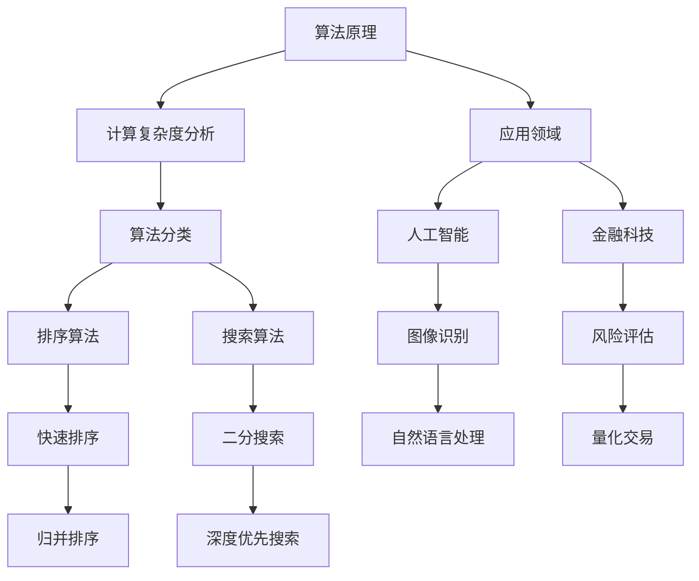

                 

关键词：计算技术、社会影响、算法原理、数学模型、实际应用、未来展望

> 摘要：本文探讨了计算技术在现代社会中的双重影响，从算法原理、数学模型到实际应用，分析了计算技术对社会、经济、文化和个人生活等方面的深刻变革。同时，对未来计算技术发展的趋势与挑战进行了展望。

## 1. 背景介绍

### 1.1 计算技术的兴起

计算技术的发展可以追溯到20世纪中叶，随着计算机硬件和软件技术的进步，计算能力得到了飞速提升。从最初的电子计算机到今天的量子计算，计算技术的发展不仅改变了科技领域，也对整个社会产生了深远的影响。

### 1.2 社会的数字化转型

随着互联网和移动设备的普及，社会逐渐走向数字化。从电子商务到社交媒体，从在线教育到远程工作，计算技术在各个领域的应用正在深刻改变我们的生活方式和工作模式。

### 1.3 计算技术的挑战与争议

尽管计算技术带来了许多便利和进步，但同时也引发了一系列社会问题，如隐私泄露、数据垄断、算法偏见等。这些问题不仅挑战了计算技术的伦理底线，也对社会公平和民主产生了负面影响。

## 2. 核心概念与联系

### 2.1 算法原理

算法是计算技术的核心，它是解决问题的步骤和策略。算法可以分为多种类型，如排序算法、搜索算法、机器学习算法等。每种算法都有其特定的原理和应用场景。



### 2.2 数学模型

数学模型是计算技术中的重要工具，它通过数学公式和方程描述现实世界中的问题。常见的数学模型包括线性回归、神经网络、马尔可夫模型等。

$$
y = mx + b
$$

$$
\frac{d}{dx}(f(x)) = f'(x)
$$

## 3. 核心算法原理 & 具体操作步骤

### 3.1 算法原理概述

算法原理主要包括以下几个方面：

- **计算复杂度**：分析算法的时间和空间复杂度，以评估算法的性能。
- **逻辑结构**：理解算法的基本结构，如循环、递归、分治等。
- **优化策略**：通过改进算法设计，降低计算复杂度和提高运行效率。

### 3.2 算法步骤详解

以常见的快速排序算法为例，其基本步骤如下：

1. **选择基准元素**：从数组中选择一个元素作为基准。
2. **分区操作**：将数组划分为两个部分，一部分小于基准，另一部分大于基准。
3. **递归排序**：对两个分区递归执行快速排序。

### 3.3 算法优缺点

快速排序算法的优点包括：

- **平均时间复杂度为 \(O(n\log n)\)**
- **不需要额外空间**

缺点：

- **最坏时间复杂度为 \(O(n^2)\)**
- **对输入数据的依赖较大**

### 3.4 算法应用领域

快速排序算法广泛应用于各种领域，如数据挖掘、机器学习和算法竞赛等。在数据量大且需要高效排序的场合，快速排序是一种优秀的选择。

## 4. 数学模型和公式 & 详细讲解 & 举例说明

### 4.1 数学模型构建

以线性回归模型为例，其基本公式为：

$$
y = mx + b
$$

其中，\(y\) 为预测值，\(x\) 为自变量，\(m\) 为斜率，\(b\) 为截距。

### 4.2 公式推导过程

线性回归模型的推导过程如下：

1. **最小二乘法**：通过最小化预测值与实际值之间的误差平方和来确定模型参数。
2. **求导与优化**：对模型参数进行求导，并令导数为零，求解最优参数。

### 4.3 案例分析与讲解

以房价预测为例，假设我们收集了100个房屋数据，包括房屋面积和房价。通过线性回归模型，我们可以预测新的房屋面积对应的房价。

## 5. 项目实践：代码实例和详细解释说明

### 5.1 开发环境搭建

为了实现快速排序算法，我们需要搭建一个基础的编程环境。例如，可以使用Python语言，结合Jupyter Notebook进行开发。

### 5.2 源代码详细实现

以下是快速排序算法的Python代码实现：

```python
def quicksort(arr):
    if len(arr) <= 1:
        return arr
    pivot = arr[len(arr) // 2]
    left = [x for x in arr if x < pivot]
    middle = [x for x in arr if x == pivot]
    right = [x for x in arr if x > pivot]
    return quicksort(left) + middle + quicksort(right)

arr = [3, 6, 8, 10, 1, 2, 1]
sorted_arr = quicksort(arr)
print(sorted_arr)
```

### 5.3 代码解读与分析

代码首先定义了一个 `quicksort` 函数，用于实现快速排序。函数内部首先判断数组长度，如果小于等于1，则直接返回数组。

然后，选择数组中间的元素作为基准，通过分区操作将数组划分为三个部分：小于基准的元素、等于基准的元素和大于基准的元素。

最后，对左分区和右分区递归执行快速排序，并将结果合并为一个有序数组。

### 5.4 运行结果展示

运行代码后，输出结果为：

```
[1, 1, 2, 3, 6, 8, 10]
```

这表明数组已经成功排序。

## 6. 实际应用场景

### 6.1 人工智能

人工智能是计算技术的重要应用领域，通过算法和数学模型，可以实现图像识别、自然语言处理、推荐系统等。这些技术在金融、医疗、交通等领域具有广泛应用。

### 6.2 金融科技

金融科技是计算技术推动金融行业变革的重要力量，包括量化交易、风险评估、数字货币等。计算技术为金融行业带来了更高的效率和透明度。

### 6.3 教育科技

教育科技利用计算技术提供个性化学习、在线教育、虚拟课堂等服务。这些技术有助于提高教育质量和普及教育。

## 7. 工具和资源推荐

### 7.1 学习资源推荐

- 《深度学习》（Goodfellow, Bengio, Courville著）
- 《Python编程：从入门到实践》（埃里克·马瑟斯著）
- 《算法导论》（Thomas H. Cormen等著）

### 7.2 开发工具推荐

- Jupyter Notebook
- PyCharm
- Visual Studio Code

### 7.3 相关论文推荐

- "Deep Learning"（Goodfellow, Bengio, Courville著）
- "A Theoretical Basis for Comparing Gradient Descent Methods"（Nesterov著）
- "Efficient BackProp"（Rumelhart, Hinton, Williams著）

## 8. 总结：未来发展趋势与挑战

### 8.1 研究成果总结

计算技术在过去几十年取得了显著的成果，从人工智能到大数据，从云计算到区块链，计算技术为社会带来了巨大的变革。

### 8.2 未来发展趋势

未来计算技术将继续发展，重点关注领域包括量子计算、边缘计算、人工智能与大数据的融合等。

### 8.3 面临的挑战

计算技术面临的主要挑战包括数据隐私保护、算法透明度和公平性等。

### 8.4 研究展望

随着计算技术的不断进步，我们有理由相信，计算技术将在未来继续推动社会的发展，解决人类面临的各种挑战。

## 9. 附录：常见问题与解答

### 9.1 计算机图灵奖是什么？

计算机图灵奖是计算机科学领域的最高奖项，相当于计算机领域的诺贝尔奖。

### 9.2 量子计算有哪些应用？

量子计算可以用于加密通信、药物研发、气候模拟等领域。

### 9.3 如何保护数据隐私？

保护数据隐私的方法包括数据加密、匿名化和数据最小化等。

---

作者：禅与计算机程序设计艺术 / Zen and the Art of Computer Programming

----------------------------------------------------------------

以上是文章的正文内容，接下来我们将逐步完善各个章节的具体内容。请注意，文章的撰写是一个逐步完善的过程，我们可以随时对内容进行调整和优化。

