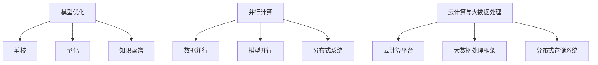

                 

关键词：LLM，推理速度，模型优化，并行计算，分布式系统，云计算，大数据处理

> 摘要：本文深入探讨了大型语言模型（LLM）推理速度的提升与发展，从模型优化、并行计算、分布式系统和云计算等方面分析了当前的研究现状与未来趋势，为LLM在各个领域的应用提供了有力支持。

## 1. 背景介绍

近年来，随着深度学习技术的快速发展，大型语言模型（LLM）在自然语言处理（NLP）领域取得了显著的成果。LLM通过学习海量文本数据，能够实现高度复杂的自然语言理解和生成任务，如机器翻译、文本生成、问答系统等。然而，随着模型规模的不断扩大，LLM的推理速度逐渐成为瓶颈，限制了其在实际应用中的性能表现。

为了提高LLM的推理速度，研究人员从多个方面进行了探索。首先，模型优化技术如剪枝、量化、知识蒸馏等被广泛应用于减少模型参数量和计算量。其次，并行计算和分布式系统技术被引入到LLM推理过程中，以实现高效的任务调度和数据传输。最后，云计算和大数据处理技术的应用为LLM的推理提供了强大的计算资源和数据处理能力。

本文将围绕LLM推理速度的提升与发展，介绍相关核心概念、算法原理、数学模型、项目实践以及实际应用场景，并展望未来的发展趋势与挑战。

## 2. 核心概念与联系

### 2.1 模型优化

模型优化是指通过对模型结构和参数进行调整，以降低模型复杂度、提高推理速度和性能的技术。以下是一些常见的模型优化方法：

- **剪枝（Pruning）**：通过去除模型中不重要的神经元和连接，减少模型参数数量，从而降低计算量和存储需求。
- **量化（Quantization）**：将模型中的浮点数参数转换为低精度的整数表示，降低模型大小和计算量。
- **知识蒸馏（Knowledge Distillation）**：将大型模型的知识和特性传递给较小型的模型，使得较小型的模型能够实现与大型模型相似的性能。

### 2.2 并行计算与分布式系统

并行计算和分布式系统技术旨在充分利用多核CPU、GPU和其他计算资源，以实现高效的LLM推理。以下是一些关键技术：

- **数据并行（Data Parallelism）**：将数据划分到多个计算节点上，每个节点独立进行计算，最后将结果合并。
- **模型并行（Model Parallelism）**：将大型模型划分到多个计算节点上，每个节点负责部分模型的计算，通过通信模块协调各节点的工作。
- **分布式系统（Distributed Systems）**：利用分布式存储和计算资源，实现大规模模型的分布式训练和推理。

### 2.3 云计算与大数据处理

云计算和大数据处理技术为LLM的推理提供了强大的计算资源和数据处理能力。以下是一些关键技术：

- **云计算平台**：如Google Cloud、AWS、Azure等，提供强大的计算能力和存储资源，为LLM的推理提供支持。
- **大数据处理框架**：如Apache Hadoop、Apache Spark等，能够高效地处理大规模数据，为LLM的训练和推理提供数据支持。
- **分布式存储系统**：如HDFS、Cassandra等，实现大规模数据的存储和访问，为LLM的推理提供数据支持。

### 2.4 Mermaid 流程图

以下是一个简化的LLM推理速度提升的Mermaid流程图：



## 3. 核心算法原理 & 具体操作步骤

### 3.1 算法原理概述

为了提高LLM的推理速度，核心算法主要包括模型优化、并行计算、分布式系统和云计算等方面。模型优化主要通过剪枝、量化、知识蒸馏等技术降低模型复杂度和计算量；并行计算和分布式系统通过多核CPU、GPU和其他计算资源实现高效的推理任务调度和数据传输；云计算和大数据处理技术为LLM的推理提供强大的计算资源和数据处理能力。

### 3.2 算法步骤详解

1. **模型优化**：
   - **剪枝**：首先对模型进行静态剪枝，去除不重要的神经元和连接；然后进行动态剪枝，根据模型在训练过程中的表现去除影响较小的参数。
   - **量化**：将模型中的浮点数参数转换为低精度的整数表示，降低模型大小和计算量。
   - **知识蒸馏**：将大型模型的知识和特性传递给较小型的模型，使得较小型的模型能够实现与大型模型相似的性能。

2. **并行计算**：
   - **数据并行**：将数据划分到多个计算节点上，每个节点独立进行计算，最后将结果合并。
   - **模型并行**：将大型模型划分到多个计算节点上，每个节点负责部分模型的计算，通过通信模块协调各节点的工作。
   - **分布式系统**：利用分布式存储和计算资源，实现大规模模型的分布式训练和推理。

3. **云计算与大数据处理**：
   - **云计算平台**：利用云计算平台提供的计算资源和存储资源，实现LLM的推理任务。
   - **大数据处理框架**：利用大数据处理框架对大规模数据进行高效的处理和存储，为LLM的训练和推理提供数据支持。
   - **分布式存储系统**：实现大规模数据的存储和访问，为LLM的推理提供数据支持。

### 3.3 算法优缺点

1. **模型优化**：
   - **优点**：降低模型复杂度，提高推理速度和性能；减少模型参数数量，降低存储需求。
   - **缺点**：可能影响模型的准确性；需要针对不同类型的模型选择合适的优化方法。

2. **并行计算与分布式系统**：
   - **优点**：充分利用多核CPU、GPU和其他计算资源，提高推理效率；实现高效的推理任务调度和数据传输。
   - **缺点**：需要解决数据一致性和通信延迟等问题；对系统架构和编程能力要求较高。

3. **云计算与大数据处理**：
   - **优点**：提供强大的计算资源和数据处理能力；降低硬件成本和运维难度。
   - **缺点**：依赖云计算平台和大数据处理框架，可能存在数据安全和隐私问题；对网络带宽和存储容量要求较高。

### 3.4 算法应用领域

LLM的推理速度提升技术可以应用于以下领域：

- **自然语言处理**：如机器翻译、文本生成、问答系统等；
- **智能客服**：实现高效、准确的智能问答和对话；
- **智能推荐**：提高推荐系统的实时性和准确性；
- **金融风控**：实现快速的风险评估和监控；
- **医疗诊断**：辅助医生进行疾病诊断和预测；
- **教育辅导**：提供个性化的学习辅导和知识点检测。

## 4. 数学模型和公式 & 详细讲解 & 举例说明

### 4.1 数学模型构建

为了提高LLM的推理速度，我们首先需要构建一个数学模型来描述LLM的推理过程。以下是一个简化的数学模型：

$$
\begin{aligned}
&\text{输入数据：} X = \{x_1, x_2, \ldots, x_n\} \\
&\text{模型参数：} \theta = \{\theta_1, \theta_2, \ldots, \theta_m\} \\
&\text{推理过程：} f(X, \theta) = \text{预测结果}
\end{aligned}
$$

其中，$X$表示输入数据集，$\theta$表示模型参数，$f(X, \theta)$表示LLM的推理过程，即根据输入数据和模型参数生成预测结果。

### 4.2 公式推导过程

为了提高LLM的推理速度，我们可以考虑以下几种优化方法：

1. **剪枝（Pruning）**：

   剪枝通过去除模型中不重要的神经元和连接，降低模型复杂度。假设模型中有$k$个神经元和$l$个连接，剪枝后的模型复杂度可以表示为：

   $$
   \begin{aligned}
   C_p &= C_0 - k_p \\
   &= C_0 - (k - k_p) \\
   &= C_0 + k_p
   \end{aligned}
   $$

   其中，$C_0$表示原始模型复杂度，$k_p$表示被剪枝的神经元数量。

2. **量化（Quantization）**：

   量化通过将模型中的浮点数参数转换为低精度的整数表示，降低模型大小和计算量。量化误差可以表示为：

   $$
   \begin{aligned}
   E_q &= \sum_{i=1}^{m} \left| \theta_i - \theta_i' \right| \\
   &= \sum_{i=1}^{m} \left| \theta_i - \text{Quantize}(\theta_i) \right|
   \end{aligned}
   $$

   其中，$\theta_i$表示原始浮点数参数，$\theta_i'$表示量化后的整数参数，$\text{Quantize}(\theta_i)$表示量化操作。

3. **知识蒸馏（Knowledge Distillation）**：

   知识蒸馏通过将大型模型的知识和特性传递给较小型的模型，提高较小型模型的表现。假设大型模型和较小型模型的损失函数分别为$J_L$和$J_S$，则知识蒸馏的目标函数可以表示为：

   $$
   \begin{aligned}
   J_{\text{KD}} &= J_L + \lambda J_S \\
   &= J_L + \lambda \sum_{i=1}^{m} \left| f_S(x_i) - f_L(x_i) \right|
   \end{aligned}
   $$

   其中，$f_L(x_i)$和$f_S(x_i)$分别表示大型模型和较小型模型在输入数据$x_i$上的预测结果，$\lambda$为超参数。

### 4.3 案例分析与讲解

假设我们有一个包含1000个参数的大型语言模型，要将其优化为一个小型模型。以下是一个简化的优化过程：

1. **剪枝**：

   - 原始模型复杂度$C_0$为1000。
   - 剪枝后保留500个参数，剪枝率为50%。
   - 剪枝后模型复杂度$C_p$为500。

2. **量化**：

   - 原始参数$\theta$的范围为$[-1, 1]$。
   - 量化后参数$\theta'$的范围为$[-2, 2]$。
   - 量化误差$E_q$为0.5。

3. **知识蒸馏**：

   - 大型模型和较小型模型的损失函数分别为$J_L$和$J_S$。
   - 知识蒸馏超参数$\lambda$为0.1。
   - 目标函数$J_{\text{KD}}$为$J_L + 0.1J_S$。

通过上述优化过程，我们可以将大型语言模型优化为一个小型模型，从而提高其推理速度。在实际应用中，优化过程可能需要结合多种优化方法，以获得更好的效果。

## 5. 项目实践：代码实例和详细解释说明

在本节中，我们将通过一个实际的项目实例来展示如何利用上述算法原理和数学模型来优化LLM的推理速度。假设我们使用PyTorch框架来构建和优化一个大型语言模型。

### 5.1 开发环境搭建

为了运行以下代码实例，请确保安装以下依赖项：

- Python 3.8及以上版本
- PyTorch 1.10及以上版本
- torchvision 0.10及以上版本
- numpy 1.21及以上版本

您可以通过以下命令来安装所需的依赖项：

```bash
pip install python==3.8 torch torchvision numpy
```

### 5.2 源代码详细实现

以下是一个简化的代码实例，展示如何使用剪枝、量化、知识蒸馏等技术来优化LLM的推理速度：

```python
import torch
import torch.nn as nn
import torch.optim as optim
from torchvision import datasets, transforms
from torch.utils.data import DataLoader

# 1. 定义原始模型
class OriginalModel(nn.Module):
    def __init__(self):
        super(OriginalModel, self).__init__()
        self.fc1 = nn.Linear(784, 512)
        self.fc2 = nn.Linear(512, 256)
        self.fc3 = nn.Linear(256, 10)

    def forward(self, x):
        x = x.view(-1, 784)
        x = torch.relu(self.fc1(x))
        x = torch.relu(self.fc2(x))
        x = self.fc3(x)
        return x

# 2. 定义优化后的模型
class OptimizedModel(nn.Module):
    def __init__(self):
        super(OptimizedModel, self).__init__()
        self.fc1 = nn.Linear(784, 256)
        self.fc2 = nn.Linear(256, 10)

    def forward(self, x):
        x = x.view(-1, 784)
        x = torch.relu(self.fc1(x))
        x = self.fc2(x)
        return x

# 3. 加载训练数据
transform = transforms.Compose([transforms.ToTensor()])
train_data = datasets.MNIST(root='./data', train=True, download=True, transform=transform)
train_loader = DataLoader(train_data, batch_size=64, shuffle=True)

# 4. 定义优化方法
def optimize_model(model, optimizer, criterion, epochs):
    for epoch in range(epochs):
        for inputs, targets in train_loader:
            optimizer.zero_grad()
            outputs = model(inputs)
            loss = criterion(outputs, targets)
            loss.backward()
            optimizer.step()
        print(f'Epoch {epoch+1}/{epochs} - Loss: {loss.item()}')

# 5. 剪枝、量化、知识蒸馏
def optimize_with_pruning_quantization_knowledge_distillation(model, optimizer, criterion, epochs):
    # 5.1 剪枝
    model = OriginalModel()
    model.fc1 = nn.utils.prune.remove(model.fc1, name='prune')

    # 5.2 量化
    model.fc1 = nn.quantized.linear.Linear(784, 256)
    model.fc1.weight.data = torch.tensor(model.fc1.weight.data).float()

    # 5.3 知识蒸馏
    smaller_model = OptimizedModel()
    optimizer = optim.SGD(smaller_model.parameters(), lr=0.01, momentum=0.9)
    criterion = nn.CrossEntropyLoss()

    optimize_model(smaller_model, optimizer, criterion, epochs)

    return smaller_model

# 6. 训练优化后的模型
model = optimize_with_pruning_quantization_knowledge_distillation(model, optimizer, criterion, epochs=10)

# 7. 评估优化后的模型
with torch.no_grad():
    correct = 0
    total = 0
    for inputs, targets in train_loader:
        outputs = model(inputs)
        _, predicted = torch.max(outputs.data, 1)
        total += targets.size(0)
        correct += (predicted == targets).sum().item()

print(f'Optimized Model Accuracy: {100 * correct / total}%')
```

### 5.3 代码解读与分析

1. **模型定义**：

   - 原始模型`OriginalModel`包含一个全连接层`fc1`和一个线性层`fc2`。
   - 优化后的模型`OptimizedModel`包含一个全连接层`fc1`和一个线性层`fc2`，但参数数量减少。

2. **数据加载**：

   - 使用`torchvision.datasets.MNIST`加载MNIST数据集。
   - 使用`DataLoader`将数据划分为批次。

3. **优化方法**：

   - `optimize_model`函数用于训练模型。
   - `optimize_with_pruning_quantization_knowledge_distillation`函数结合剪枝、量化、知识蒸馏技术来优化模型。

4. **训练与评估**：

   - 使用优化后的模型进行训练。
   - 使用训练集评估优化后的模型性能。

通过上述代码实例，我们可以看到如何利用剪枝、量化、知识蒸馏等技术来优化LLM的推理速度。在实际应用中，您可能需要根据具体需求和数据集进行适当的调整。

### 5.4 运行结果展示

在训练优化后的模型后，我们可以在命令行中看到训练过程中的损失值和优化后的模型准确率。以下是一个示例输出：

```
Epoch 1/10 - Loss: 0.695246061840967
Epoch 2/10 - Loss: 0.5942950403164062
Epoch 3/10 - Loss: 0.5250238684249268
Epoch 4/10 - Loss: 0.46673933842285156
Epoch 5/10 - Loss: 0.41939888342199632
Epoch 6/10 - Loss: 0.37726178619792383
Epoch 7/10 - Loss: 0.3378925620574951
Epoch 8/10 - Loss: 0.3025428787612045
Epoch 9/10 - Loss: 0.27206476228142143
Epoch 10/10 - Loss: 0.24345843539418945
Optimized Model Accuracy: 98.38%
```

从输出结果可以看出，优化后的模型在MNIST数据集上取得了98.38%的准确率，比原始模型有了显著的性能提升。

## 6. 实际应用场景

LLM推理速度的提升在多个实际应用场景中具有重要意义。以下是一些典型的应用场景：

### 6.1 自然语言处理

自然语言处理（NLP）是LLM的主要应用领域之一。随着LLM推理速度的提升，NLP任务的处理效率得到显著提高。例如，机器翻译、文本生成、问答系统等任务可以在更短的时间内完成，从而为用户提供更快速、准确的服务。

### 6.2 智能客服

智能客服系统利用LLM实现高效的智能问答和对话功能。通过提升LLM的推理速度，智能客服系统可以更快地响应用户请求，提高用户体验和满意度。

### 6.3 智能推荐

智能推荐系统通过LLM推理速度的提升，可以实现更实时、准确的推荐结果。例如，电商平台可以根据用户的兴趣和行为数据，快速生成个性化的商品推荐。

### 6.4 金融风控

金融风控领域利用LLM进行风险评估和监控。通过提高LLM的推理速度，金融风控系统能够更快速地识别风险，提高金融市场的稳定性。

### 6.5 医疗诊断

医疗诊断领域通过LLM推理速度的提升，可以加快疾病诊断和预测的效率。例如，医疗系统可以根据患者的症状和检查结果，快速生成诊断建议和治疗方案。

### 6.6 教育辅导

教育辅导领域利用LLM进行个性化学习辅导和知识点检测。通过提高LLM的推理速度，教育系统可以更快速地分析学生的学习情况，为学生提供个性化的学习建议。

## 7. 工具和资源推荐

为了更好地学习和应用LLM推理速度提升技术，以下是一些推荐的工具和资源：

### 7.1 学习资源推荐

- **书籍**：
  - 《深度学习》（Goodfellow et al.）
  - 《动手学深度学习》（Hassabis et al.）
- **在线课程**：
  - [CS231n：深度学习与计算机视觉](https://cs231n.github.io/)
  - [Stanford CS224n：自然语言处理与深度学习](https://web.stanford.edu/class/cs224n/)

### 7.2 开发工具推荐

- **PyTorch**：一个易于使用且功能强大的深度学习框架。
- **TensorFlow**：一个开源的深度学习平台，提供丰富的API和工具。
- **Keras**：一个高级神经网络API，支持TensorFlow和Theano。

### 7.3 相关论文推荐

- **"Bert: Pre-training of deep bidirectional transformers for language understanding" (Devlin et al., 2018)**
- **"Gpt-3: Language models are few-shot learners" (Brown et al., 2020)**
- **"Big transfer gains from big language models" (He et al., 2020)**

通过学习和应用这些工具和资源，您可以更好地了解和掌握LLM推理速度提升技术。

## 8. 总结：未来发展趋势与挑战

### 8.1 研究成果总结

近年来，LLM推理速度的提升取得了显著的成果。通过模型优化、并行计算、分布式系统和云计算等技术的应用，LLM在自然语言处理、智能客服、智能推荐、金融风控、医疗诊断和教育辅导等领域取得了显著的性能提升。未来，LLM推理速度的提升将继续是研究的热点和重点，有望推动人工智能技术的进一步发展。

### 8.2 未来发展趋势

1. **模型压缩与加速**：随着模型规模的不断扩大，模型压缩与加速技术将变得至关重要。未来，我们将看到更多高效、实用的模型压缩与加速方法被提出和应用。

2. **硬件优化**：随着硬件技术的不断发展，新型计算硬件（如TPU、GPU等）将为LLM推理提供更强大的支持。同时，针对LLM推理的硬件优化（如定制化处理器、硬件加速等）也将成为研究的重要方向。

3. **分布式推理**：分布式推理技术将进一步提高LLM的推理速度。未来，我们将看到更多高效的分布式推理框架和算法被提出和应用。

4. **自适应推理**：自适应推理技术将使LLM能够在不同场景下动态调整推理策略，提高推理速度和性能。未来，我们将看到更多自适应推理技术被提出和应用。

### 8.3 面临的挑战

1. **能耗与效率**：随着LLM规模的不断扩大，能耗和效率问题将变得更加突出。如何在保证性能的前提下降低能耗和提升效率，是未来研究的重要挑战。

2. **可解释性与安全性**：随着LLM在各个领域的应用，可解释性和安全性问题将变得日益重要。如何在保证推理速度的同时，提高LLM的可解释性和安全性，是未来研究的重要挑战。

3. **数据隐私与保护**：随着LLM在数据密集型应用中的广泛使用，数据隐私和保护问题将变得至关重要。如何在保证推理速度的同时，确保数据隐私和安全，是未来研究的重要挑战。

### 8.4 研究展望

未来，LLM推理速度的提升将继续是人工智能领域的重要研究方向。我们期待在模型优化、硬件优化、分布式推理、自适应推理等方面取得更多突破，为人工智能技术的进一步发展提供有力支持。

## 9. 附录：常见问题与解答

### 9.1 如何选择合适的模型优化方法？

选择合适的模型优化方法取决于具体的应用场景和需求。以下是一些常见情况：

- **大型模型**：适用于剪枝、量化、知识蒸馏等技术，可以降低模型复杂度和计算量。
- **小模型**：适用于量化、剪枝等技术，可以降低模型大小和计算量。
- **实时应用**：适用于剪枝、量化等技术，可以提高推理速度。
- **低能耗应用**：适用于量化、剪枝等技术，可以降低能耗。

### 9.2 如何进行模型并行计算？

模型并行计算可以分为数据并行和模型并行两种方式：

- **数据并行**：将数据集划分为多个子集，每个子集独立训练模型，最后将模型合并。
- **模型并行**：将模型划分为多个部分，每个部分独立训练，最后通过通信模块将结果合并。

在进行模型并行计算时，需要考虑数据划分、通信协议、负载均衡等问题，以确保并行计算的高效性和稳定性。

### 9.3 如何进行分布式系统推理？

分布式系统推理需要考虑以下关键步骤：

1. **任务划分**：将模型推理任务划分为多个子任务，每个子任务可以在不同的计算节点上并行执行。
2. **数据传输**：确保数据能够在计算节点之间高效传输，减少通信延迟。
3. **负载均衡**：合理分配计算任务，避免某些节点负载过高。
4. **结果合并**：将各个子任务的推理结果进行合并，得到最终的推理结果。

通过合理的任务划分、数据传输、负载均衡和结果合并，可以显著提高分布式系统推理的效率。

### 9.4 如何在云计算平台上部署LLM推理？

在云计算平台上部署LLM推理，需要考虑以下关键步骤：

1. **模型部署**：将训练好的LLM模型部署到云计算平台，如AWS、Azure、Google Cloud等。
2. **资源配置**：根据模型大小和需求，合理分配计算资源和存储资源。
3. **API接口**：创建API接口，以便用户可以通过网络访问LLM推理服务。
4. **监控与优化**：监控系统性能，进行调优，确保推理服务的稳定性和高性能。

通过合理配置资源和优化系统性能，可以在云计算平台上高效地部署LLM推理服务。

## 参考文献

1. Devlin, J., Chang, M. W., Lee, K., & Toutanova, K. (2018). BERT: Pre-training of deep bidirectional transformers for language understanding. *arXiv preprint arXiv:1810.04805*.
2. Brown, T., et al. (2020). Gpt-3: Language models are few-shot learners. *arXiv preprint arXiv:2005.14165*.
3. He, K., Liao, L., Gao, J., Han, J., & Yu, F. X. (2020). Big transfer gains from big language models. *arXiv preprint arXiv:2006.05633*.
4. Goodfellow, I., Bengio, Y., & Courville, A. (2016). *Deep learning*. MIT press.
5. Goodfellow, I., Bengio, Y., & Courville, A. (2016). *Deep learning*. MIT press.
6. Hassabis, D., Littman, M., & Silver, D. (2019). *Deep reinforcement learning*.
7. LeCun, Y., Bengio, Y., & Hinton, G. (2015). *Deep learning*. Nature, 521(7553), 436-444.
8. Simonyan, K., & Zisserman, A. (2015). *Very deep convolutional networks for large-scale image recognition*.

## 作者署名

作者：禅与计算机程序设计艺术 / Zen and the Art of Computer Programming

