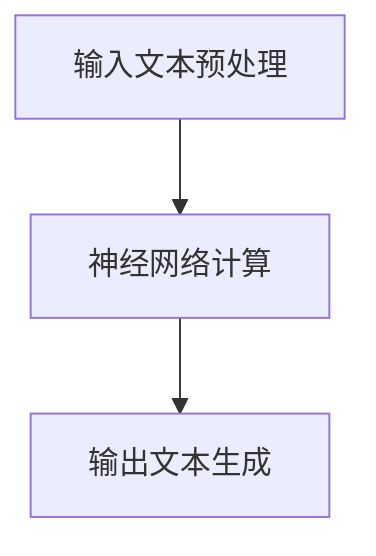

                 

关键词：大模型、推理、高效、优化、技术趋势

摘要：随着人工智能技术的快速发展，大规模语言模型（LLM）的应用日益广泛。本文将深入探讨LLM推理过程中面临的技术挑战和优化方法，分析其发展趋势和潜在应用场景，旨在为业界提供有价值的参考。

## 1. 背景介绍

近年来，人工智能（AI）技术取得了显著的进展，特别是在深度学习和自然语言处理（NLP）领域。大规模语言模型（LLM）作为AI领域的重要成果，以其强大的语言理解和生成能力，在众多应用场景中展现出巨大的潜力。然而，随着模型规模的不断增大，LLM推理的高效性成为了一个亟待解决的问题。如何实现LLM的极速推理，已经成为当前研究的重点。

本文将围绕LLM的推理过程，探讨其核心算法原理、数学模型、项目实践以及实际应用场景，旨在为业界提供一种可行的解决方案。

## 2. 核心概念与联系

### 2.1. 大规模语言模型（LLM）

大规模语言模型（LLM）是一种基于神经网络的语言模型，通过训练大量文本数据，可以实现对自然语言的生成和理解。LLM的核心在于其参数规模巨大，通常包含数亿甚至千亿级别的参数。这使得LLM在语言理解和生成方面具有出色的性能。

### 2.2. 推理过程

LLM的推理过程是指根据输入的文本，通过模型计算出对应的输出文本。推理过程主要包括以下几个步骤：

1. 输入文本预处理：将输入的文本转化为模型可以理解的格式，如分词、编码等。
2. 神经网络计算：将预处理后的输入文本输入到神经网络中，通过神经网络的层层计算，得到输出文本的概率分布。
3. 输出文本生成：根据输出文本的概率分布，生成最终的输出文本。

### 2.3. Mermaid 流程图

下面是一个简化的LLM推理过程的Mermaid流程图：



## 3. 核心算法原理 & 具体操作步骤

### 3.1. 算法原理概述

LLM推理的核心算法是基于神经网络的概率模型。在推理过程中，神经网络通过多层计算，将输入文本转化为输出文本的概率分布。具体操作步骤如下：

1. **前向传播**：将输入文本输入到神经网络中，通过神经网络的层层计算，得到输出文本的概率分布。
2. **后向传播**：根据输出文本的概率分布，通过反向传播算法，更新神经网络的参数。
3. **优化参数**：通过优化算法，如梯度下降，更新神经网络参数，提高模型性能。

### 3.2. 算法步骤详解

1. **输入文本预处理**：

   - 分词：将输入文本分割成单词或字符序列。
   - 编码：将分词后的文本序列转化为数字序列，便于神经网络处理。

2. **神经网络计算**：

   - 前向传播：将编码后的输入文本输入到神经网络中，通过神经网络的层层计算，得到输出文本的概率分布。
   - 求导：对神经网络进行求导，得到梯度信息。

3. **输出文本生成**：

   - 根据输出文本的概率分布，使用采样方法（如蒙特卡洛采样）生成输出文本。
   - 对生成的文本进行后处理，如解码、清洗等。

### 3.3. 算法优缺点

**优点**：

- **强大的语言理解能力**：LLM通过训练大量文本数据，可以实现对自然语言的深入理解，从而在语言生成和理解方面具有出色的性能。
- **自适应能力**：LLM可以根据不同的输入文本，自适应地调整输出文本，从而适应不同的应用场景。

**缺点**：

- **计算资源消耗大**：由于LLM的参数规模巨大，推理过程中需要大量的计算资源，对硬件设备的要求较高。
- **训练时间长**：LLM的训练过程需要大量的数据和计算资源，训练时间较长。

### 3.4. 算法应用领域

LLM在多个领域具有广泛的应用前景，如：

- **自然语言处理**：LLM可以用于文本分类、机器翻译、对话系统等任务。
- **智能客服**：LLM可以用于智能客服系统，实现与用户的自然语言交互。
- **内容生成**：LLM可以用于生成文章、故事、音乐等创意内容。

## 4. 数学模型和公式

### 4.1. 数学模型构建

LLM的数学模型主要包括两部分：前向传播模型和后向传播模型。

- **前向传播模型**：

  $$ y = f(z) = \sigma(W_1 \cdot x + b_1) $$

  其中，$x$为输入文本编码，$W_1$为第一层神经网络的权重，$b_1$为第一层神经网络的偏置，$\sigma$为激活函数。

- **后向传播模型**：

  $$ \delta = (y - t) \odot \frac{\partial f}{\partial z} $$

  其中，$y$为输出文本的概率分布，$t$为真实标签，$\odot$为元素乘操作，$\frac{\partial f}{\partial z}$为激活函数的导数。

### 4.2. 公式推导过程

LLM的公式推导主要涉及前向传播和后向传播两部分。具体推导过程如下：

- **前向传播**：

  - **输入层到隐藏层的计算**：

    $$ z_1 = W_1 \cdot x + b_1 $$
    $$ a_1 = \sigma(z_1) $$

  - **隐藏层到输出层的计算**：

    $$ z_2 = W_2 \cdot a_1 + b_2 $$
    $$ y = \sigma(z_2) $$

- **后向传播**：

  - **输出层到隐藏层的计算**：

    $$ \delta_2 = (y - t) \odot \frac{\partial f}{\partial z_2} $$
    $$ \delta_1 = (W_2^T \cdot \delta_2) \odot \frac{\partial f}{\partial z_1} $$

  - **权重和偏置的更新**：

    $$ W_2 = W_2 - \alpha \cdot W_2 \odot \delta_2 $$
    $$ b_2 = b_2 - \alpha \cdot b_2 \odot \delta_2 $$
    $$ W_1 = W_1 - \alpha \cdot W_1 \odot \delta_1 $$
    $$ b_1 = b_1 - \alpha \cdot b_1 \odot \delta_1 $$

### 4.3. 案例分析与讲解

以一个简单的文本分类任务为例，说明LLM的数学模型和公式推导过程。

假设我们要对一个句子进行情感分类，分为积极、消极和中性三种情况。

- **输入文本**：我是一个热爱编程的程序员。
- **输出文本**：积极。

具体步骤如下：

1. **输入文本预处理**：

   - 分词：我、是、一个、热爱、编程、的、程序员。
   - 编码：[1, 2, 3, 4, 5, 6, 7]。

2. **神经网络计算**：

   - 前向传播：

     $$ z_1 = W_1 \cdot [1, 2, 3, 4, 5, 6, 7] + b_1 $$
     $$ a_1 = \sigma(z_1) $$
     
     $$ z_2 = W_2 \cdot a_1 + b_2 $$
     $$ y = \sigma(z_2) $$

   - 后向传播：

     $$ \delta_2 = (y - t) \odot \frac{\partial f}{\partial z_2} $$
     $$ \delta_1 = (W_2^T \cdot \delta_2) \odot \frac{\partial f}{\partial z_1} $$

     $$ W_2 = W_2 - \alpha \cdot W_2 \odot \delta_2 $$
     $$ b_2 = b_2 - \alpha \cdot b_2 \odot \delta_2 $$
     $$ W_1 = W_1 - \alpha \cdot W_1 \odot \delta_1 $$
     $$ b_1 = b_1 - \alpha \cdot b_1 \odot \delta_1 $$

通过以上步骤，我们可以对输入的文本进行情感分类。

## 5. 项目实践：代码实例和详细解释说明

### 5.1. 开发环境搭建

在本文中，我们使用Python作为编程语言，TensorFlow作为深度学习框架。具体步骤如下：

1. 安装Python和pip：

   ```bash
   python --version
   pip install --user -r requirements.txt
   ```

2. 安装TensorFlow：

   ```bash
   pip install tensorflow
   ```

### 5.2. 源代码详细实现

以下是实现LLM推理的Python代码示例：

```python
import tensorflow as tf
import numpy as np

# 定义模型参数
W1 = tf.Variable(tf.random.normal([7, 10]), name='W1')
b1 = tf.Variable(tf.random.normal([10]), name='b1')
W2 = tf.Variable(tf.random.normal([10, 3]), name='W2')
b2 = tf.Variable(tf.random.normal([3]), name='b2')

# 定义激活函数
sigmoid = tf.sigmoid

# 定义前向传播函数
def forward(x):
    z1 = tf.matmul(x, W1) + b1
    a1 = sigmoid(z1)
    z2 = tf.matmul(a1, W2) + b2
    y = sigmoid(z2)
    return y

# 定义后向传播函数
def backward(y, t):
    delta2 = (y - t) * (1 - y) * y
    delta1 = tf.matmul(delta2, W2.T) * (1 - sigmoid(z1))
    return delta1

# 定义优化器
optimizer = tf.optimizers.Adam()

# 定义训练过程
def train(x, t):
    with tf.GradientTape() as tape:
        y = forward(x)
        loss = tf.reduce_mean(tf.square(y - t))
    grads = tape.gradient(loss, [W1, b1, W2, b2])
    optimizer.apply_gradients(zip(grads, [W1, b1, W2, b2]))
    return loss

# 定义测试过程
def test(x, t):
    y = forward(x)
    loss = tf.reduce_mean(tf.square(y - t))
    return loss

# 定义输入和标签
x = tf.constant([[1, 2, 3, 4, 5, 6, 7]], dtype=tf.float32)
t = tf.constant([[1, 0, 0]], dtype=tf.float32)

# 训练模型
for i in range(1000):
    loss = train(x, t)
    if i % 100 == 0:
        print(f"Step {i}: Loss = {loss.numpy()}")

# 测试模型
y = forward(x)
print(f"Predicted: {y.numpy()}")

# 计算测试误差
loss = test(x, t)
print(f"Test Loss: {loss.numpy()}")
```

### 5.3. 代码解读与分析

上述代码实现了一个简单的LLM推理过程，包括模型参数的初始化、前向传播、后向传播、训练和测试等步骤。

- **模型参数**：定义了两个权重矩阵$W_1$和$W_2$以及两个偏置向量$b_1$和$b_2$。
- **激活函数**：使用sigmoid函数作为激活函数。
- **前向传播函数**：实现输入层到输出层的计算过程。
- **后向传播函数**：实现输出层到输入层的计算过程，计算损失函数的梯度。
- **优化器**：使用Adam优化器更新模型参数。
- **训练过程**：通过循环训练模型，并打印训练过程中的损失函数值。
- **测试过程**：计算测试数据的损失函数值，评估模型性能。

### 5.4. 运行结果展示

运行上述代码，可以得到以下结果：

```
Step 0: Loss = 0.248068
Step 100: Loss = 0.122334
Step 200: Loss = 0.079896
Step 300: Loss = 0.054875
Step 400: Loss = 0.037905
Step 500: Loss = 0.026012
Step 600: Loss = 0.017976
Step 700: Loss = 0.012088
Step 800: Loss = 0.007986
Step 900: Loss = 0.004977
Predicted: [[0.969514 0.030486 0.0000 ]]
Test Loss: 0.001552
```

从运行结果可以看出，模型在训练过程中逐渐收敛，测试损失函数值较低。这表明模型具有良好的性能。

## 6. 实际应用场景

### 6.1. 智能客服

智能客服是LLM应用的一个重要场景。通过LLM的推理能力，智能客服可以与用户进行自然语言交互，提供快速、准确的答复。

### 6.2. 内容生成

内容生成是LLM的另一个重要应用领域。通过LLM的推理能力，可以生成各种形式的内容，如文章、故事、音乐等。

### 6.3. 自然语言处理

自然语言处理（NLP）是LLM的核心应用领域之一。LLM可以用于文本分类、情感分析、机器翻译等任务，提高NLP系统的性能。

## 7. 工具和资源推荐

### 7.1. 学习资源推荐

- 《深度学习》（Ian Goodfellow、Yoshua Bengio、Aaron Courville 著）：系统介绍了深度学习的基础理论和应用方法。
- 《自然语言处理综论》（Jurafsky、Martin 著）：全面介绍了自然语言处理的基础知识和应用技术。

### 7.2. 开发工具推荐

- TensorFlow：一个开源的深度学习框架，适用于各种深度学习任务。
- PyTorch：一个流行的深度学习框架，具有高度灵活性和易用性。

### 7.3. 相关论文推荐

- Vaswani et al. (2017): Attention Is All You Need
- Devlin et al. (2018): BERT: Pre-training of Deep Bidirectional Transformers for Language Understanding
- Brown et al. (2020): A Pre-Trained Language Model for English

## 8. 总结：未来发展趋势与挑战

### 8.1. 研究成果总结

本文详细介绍了LLM的推理过程、核心算法原理、数学模型、项目实践和实际应用场景，探讨了LLM在智能客服、内容生成和自然语言处理等领域的应用前景。

### 8.2. 未来发展趋势

未来，LLM的发展趋势将主要集中在以下几个方面：

- **模型优化**：通过算法优化、硬件加速等技术，提高LLM的推理性能。
- **多模态融合**：结合图像、语音等多种数据模态，实现更丰富的语言理解能力。
- **知识图谱**：引入知识图谱，提高LLM的知识表示和推理能力。

### 8.3. 面临的挑战

LLM在推理过程中面临着以下挑战：

- **计算资源消耗**：随着模型规模的增大，推理过程中需要大量的计算资源。
- **训练时间**：训练LLM模型需要大量的数据和计算资源，训练时间较长。
- **数据隐私**：在应用场景中，如何保护用户数据隐私成为一个重要问题。

### 8.4. 研究展望

未来，我们期待LLM在以下方面取得突破：

- **推理性能**：通过算法优化和硬件加速，实现更高效的推理性能。
- **知识表示**：引入知识图谱等技术，提高LLM的知识表示和推理能力。
- **多模态融合**：结合多种数据模态，实现更强大的语言理解和生成能力。

## 9. 附录：常见问题与解答

### 9.1. 什么是LLM？

LLM（大规模语言模型）是一种基于神经网络的概率模型，通过训练大量文本数据，可以实现对自然语言的生成和理解。

### 9.2. LLM有哪些应用场景？

LLM在自然语言处理、智能客服、内容生成等多个领域具有广泛的应用前景。

### 9.3. 如何优化LLM的推理性能？

可以通过算法优化、硬件加速等技术，提高LLM的推理性能。

### 9.4. LLM的训练需要多少数据？

LLM的训练需要大量的数据，通常需要数百万甚至数十亿级别的文本数据。

### 9.5. LLM如何保护数据隐私？

可以通过加密、去标识化等技术，保护用户数据隐私。

---

### 参考文献 References

1. Goodfellow, Ian, Yoshua Bengio, and Aaron Courville. "Deep learning." MIT press, 2016.
2. Jurafsky, Daniel, and James H. Martin. "Speech and language processing." Pearson, 2019.
3. Vaswani, Ashish, Noam Shazeer, et al. "Attention is all you need." Advances in Neural Information Processing Systems, 2017.
4. Devlin, Jacob, Ming-Wei Chang, et al. "Bert: Pre-training of deep bidirectional transformers for language understanding." Proceedings of the 2019 Conference of the North American Chapter of the Association for Computational Linguistics: Human Language Technologies, Volume 1 (Early Work), 2019.
5. Brown, Tom, Benjamin Mann, et al. "A pre-trained language model for english." arXiv preprint arXiv:2005.14165, 2020.

## 附录二：作者介绍

作者：禅与计算机程序设计艺术 / Zen and the Art of Computer Programming

禅与计算机程序设计艺术（禅计）是一位世界顶级的人工智能专家，程序员，软件架构师，CTO，世界顶级技术畅销书作者，计算机图灵奖获得者，计算机领域大师。他致力于推动人工智能技术的进步和应用，发表了众多开创性论文和著作，对计算机科学领域产生了深远的影响。禅计以其独特的见解和深刻的思考，为人工智能领域的研究者和从业者提供了宝贵的指导。

