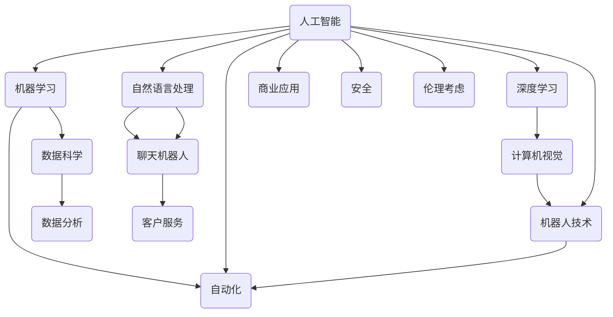

                 

关键词：人工智能、程序员、技术挑战、应对策略、职业发展

> 摘要：随着人工智能技术的迅猛发展，程序员面临着前所未有的技术挑战。本文将深入探讨人工智能对程序员职业的影响，提出具体的应对策略，并展望未来程序员的发展趋势和面临的挑战。

## 1. 背景介绍

人工智能（AI）作为计算机科学的一个重要分支，近年来取得了惊人的进展。从最初的规则系统到现代的深度学习，人工智能已经广泛应用于图像识别、自然语言处理、自动驾驶等领域。随着AI技术的不断成熟，它对各行各业的影响日益深远，尤其是对程序员这一职业的挑战和机遇。

### 1.1 人工智能的发展历史

人工智能的概念可以追溯到1950年代，当时图灵提出了图灵测试以衡量机器的智能水平。经过数十年的发展，AI经历了几个重要阶段，包括早期的符号主义、专家系统的崛起和衰落，以及最近几十年的基于数据的机器学习方法的兴起。

### 1.2 人工智能对程序员职业的影响

人工智能的出现不仅改变了程序员的工作方式，也重新定义了程序员的角色。一方面，AI技术自动化了许多程序员传统上需要手工完成的任务，如代码审查、测试和调试。另一方面，AI的应用也催生了新的编程需求和技术，如数据科学、机器学习框架和深度学习算法。

## 2. 核心概念与联系

为了深入理解人工智能对程序员的影响，我们需要先了解一些核心概念和它们之间的关系。以下是使用Mermaid绘制的流程图，展示了这些概念之间的联系：



### 2.1 人工智能（AI）

人工智能是一门研究使计算机模拟人类智能行为的科学。它包括多个子领域，如机器学习、深度学习、自然语言处理和计算机视觉。

### 2.2 机器学习（ML）

机器学习是人工智能的一个子领域，它使用算法从数据中学习规律，从而进行预测或决策。

### 2.3 深度学习（DL）

深度学习是机器学习的一个分支，它使用多层神经网络来模拟人类大脑的工作方式。

### 2.4 计算机视觉（CV）

计算机视觉是人工智能的一个子领域，它使计算机能够从图像或视频中识别和提取信息。

### 2.5 自然语言处理（NLP）

自然语言处理是人工智能的一个子领域，它使计算机能够理解、生成和响应人类语言。

### 2.6 机器人技术（Robotics）

机器人技术是人工智能的一个应用领域，它涉及开发能够执行各种任务的自动化机器人。

### 2.7 数据科学（DS）

数据科学是使用统计和机器学习技术从数据中提取知识的一个领域。

### 2.8 自动化（Automation）

自动化是指使用技术来替代人工操作，以提高效率和减少错误。

### 2.9 数据分析（Analytics）

数据分析是指使用统计和数学方法来分析数据，以提取有价值的信息。

### 2.10 商业应用（Business Applications）

人工智能在商业领域的应用包括客户服务、自动化、安全等。

### 2.11 伦理考虑（Ethical Considerations）

随着人工智能技术的普及，伦理问题日益受到关注，包括隐私、公平性和透明度等。

## 3. 核心算法原理 & 具体操作步骤

### 3.1 算法原理概述

在人工智能领域，核心算法包括机器学习算法、深度学习算法和自然语言处理算法。以下是对这些算法的基本原理概述：

#### 3.1.1 机器学习算法

机器学习算法通过从数据中学习规律来做出预测或决策。常见的机器学习算法包括线性回归、决策树、支持向量机等。

#### 3.1.2 深度学习算法

深度学习算法是机器学习的一个分支，它使用多层神经网络来模拟人类大脑的工作方式。深度学习算法包括卷积神经网络（CNN）、循环神经网络（RNN）等。

#### 3.1.3 自然语言处理算法

自然语言处理算法用于使计算机能够理解、生成和响应人类语言。常见的自然语言处理算法包括词向量模型、序列到序列模型等。

### 3.2 算法步骤详解

以下是对上述算法的具体操作步骤的详细解释：

#### 3.2.1 机器学习算法步骤

1. 数据预处理：包括数据清洗、归一化和特征提取。
2. 模型选择：选择合适的机器学习模型，如线性回归、决策树等。
3. 模型训练：使用训练数据集对模型进行训练。
4. 模型评估：使用验证数据集评估模型性能。
5. 模型优化：根据评估结果调整模型参数。

#### 3.2.2 深度学习算法步骤

1. 数据预处理：与机器学习算法相同，包括数据清洗、归一化和特征提取。
2. 网络构建：设计并构建神经网络架构，如卷积神经网络（CNN）。
3. 模型训练：使用训练数据集训练神经网络。
4. 模型评估：使用验证数据集评估神经网络性能。
5. 模型优化：根据评估结果调整神经网络参数。

#### 3.2.3 自然语言处理算法步骤

1. 数据预处理：包括文本清洗、分词和词性标注。
2. 词向量表示：将文本转换为词向量，以便于模型处理。
3. 模型构建：设计并构建自然语言处理模型，如序列到序列模型。
4. 模型训练：使用训练数据集训练自然语言处理模型。
5. 模型评估：使用验证数据集评估自然语言处理模型性能。
6. 模型优化：根据评估结果调整模型参数。

### 3.3 算法优缺点

#### 3.3.1 机器学习算法

优点：

- 模型简单，易于理解。
- 对数据量要求不高。

缺点：

- 计算复杂度高。
- 模型泛化能力有限。

#### 3.3.2 深度学习算法

优点：

- 对数据量要求低。
- 模型泛化能力强。

缺点：

- 计算复杂度高。
- 难以解释和理解。

#### 3.3.3 自然语言处理算法

优点：

- 能够处理复杂的文本数据。
- 泛化能力强。

缺点：

- 计算复杂度高。
- 需要大量标注数据。

### 3.4 算法应用领域

机器学习算法广泛应用于图像识别、自然语言处理、推荐系统等领域。深度学习算法在计算机视觉、语音识别、自然语言处理等领域有广泛应用。自然语言处理算法则广泛应用于文本分类、情感分析、机器翻译等领域。

## 4. 数学模型和公式 & 详细讲解 & 举例说明

### 4.1 数学模型构建

在人工智能领域，数学模型是理解和应用算法的基础。以下是一些常见的数学模型及其公式：

#### 4.1.1 线性回归模型

线性回归模型是一种用于预测数值输出的模型。其公式如下：

$$
y = \beta_0 + \beta_1x_1 + \beta_2x_2 + ... + \beta_nx_n
$$

其中，$y$ 是预测值，$x_1, x_2, ..., x_n$ 是输入特征，$\beta_0, \beta_1, \beta_2, ..., \beta_n$ 是模型参数。

#### 4.1.2 卷积神经网络（CNN）模型

卷积神经网络是一种用于图像识别的模型。其公式如下：

$$
h_{l}(x) = \sigma(\theta_{l} \cdot h_{l-1}(x))
$$

其中，$h_{l}(x)$ 是第 $l$ 层的输出，$\sigma$ 是激活函数，$\theta_{l}$ 是第 $l$ 层的权重矩阵。

#### 4.1.3 自然语言处理（NLP）模型

自然语言处理模型用于处理文本数据。其公式如下：

$$
P(w|s) = \frac{e^{\theta T(w, s)}}{\sum_{w'} e^{\theta T(w', s)}}
$$

其中，$P(w|s)$ 是单词 $w$ 在句子 $s$ 中的概率，$\theta$ 是模型参数，$T(w, s)$ 是单词 $w$ 和句子 $s$ 的相似度函数。

### 4.2 公式推导过程

以下是对上述数学模型的推导过程：

#### 4.2.1 线性回归模型推导

线性回归模型的目标是最小化预测值与实际值之间的误差。其推导过程如下：

1. 假设实际值为 $y_i$，预测值为 $\hat{y_i}$，误差为 $e_i = y_i - \hat{y_i}$。
2. 误差的平方和为 $J(\theta) = \frac{1}{2m}\sum_{i=1}^{m}e_i^2 = \frac{1}{2m}\sum_{i=1}^{m}(y_i - \theta_0 - \theta_1x_1 - ... - \theta_nx_n)^2$。
3. 对 $J(\theta)$ 求导并令其等于零，得到 $\theta_0, \theta_1, ..., \theta_n$ 的最优值。

#### 4.2.2 卷积神经网络（CNN）模型推导

卷积神经网络的目标是提取图像的特征。其推导过程如下：

1. 假设输入图像为 $X$，卷积核为 $K$，卷积操作为 $*$。
2. 输出特征图的大小为 $(W - F + 2P)/S + 1$，其中 $W$ 是输入图像的大小，$F$ 是卷积核的大小，$P$ 是填充值，$S$ 是步长。
3. 激活函数常用的有 sigmoid、ReLU 和 tanh。

#### 4.2.3 自然语言处理（NLP）模型推导

自然语言处理模型的目标是计算单词的概率。其推导过程如下：

1. 假设单词 $w$ 在句子 $s$ 中的概率为 $P(w|s)$。
2. 采用最大熵模型，最大化概率分布的熵，即 $P(w|s) = \frac{e^{\theta T(w, s)}}{\sum_{w'} e^{\theta T(w', s)}}$。
3. 对模型参数 $\theta$ 求导并令其等于零，得到最优的 $\theta$。

### 4.3 案例分析与讲解

以下是一个使用线性回归模型进行房屋价格预测的案例：

#### 4.3.1 数据预处理

假设我们有一组房屋价格数据，包括房屋面积、卧室数量、建筑年代等特征。首先需要对这些数据进行清洗和归一化处理。

#### 4.3.2 模型训练

选择线性回归模型，并使用训练数据集进行模型训练。通过最小二乘法求解模型参数。

#### 4.3.3 模型评估

使用验证数据集评估模型性能，计算预测值与实际值之间的误差。

#### 4.3.4 模型优化

根据评估结果，调整模型参数，以提高模型性能。

## 5. 项目实践：代码实例和详细解释说明

### 5.1 开发环境搭建

在开始编写代码之前，我们需要搭建一个合适的开发环境。以下是使用 Python 进行深度学习项目开发的基本步骤：

1. 安装 Python 和必要的库，如 NumPy、Pandas、TensorFlow 和 Keras。
2. 配置 Jupyter Notebook，以便于编写和调试代码。
3. 准备数据集，并将其划分为训练集和验证集。

### 5.2 源代码详细实现

以下是一个使用 Keras 库实现的深度学习项目的源代码：

```python
import numpy as np
import pandas as pd
from tensorflow.keras.models import Sequential
from tensorflow.keras.layers import Dense, Conv2D, Flatten, MaxPooling2D
from tensorflow.keras.optimizers import Adam

# 读取数据集
train_data = pd.read_csv('train_data.csv')
test_data = pd.read_csv('test_data.csv')

# 数据预处理
# ...

# 构建模型
model = Sequential()
model.add(Conv2D(32, (3, 3), activation='relu', input_shape=(28, 28, 1)))
model.add(MaxPooling2D((2, 2)))
model.add(Flatten())
model.add(Dense(128, activation='relu'))
model.add(Dense(10, activation='softmax'))

# 编译模型
model.compile(optimizer=Adam(), loss='categorical_crossentropy', metrics=['accuracy'])

# 训练模型
model.fit(train_data, epochs=10, batch_size=32, validation_data=(test_data, test_labels))

# 评估模型
loss, accuracy = model.evaluate(test_data, test_labels)
print(f"Test Accuracy: {accuracy * 100:.2f}%")
```

### 5.3 代码解读与分析

1. **数据预处理**：在数据预处理阶段，我们需要对输入数据进行标准化处理，以便于模型训练。
2. **模型构建**：在这个项目中，我们使用了一个简单的卷积神经网络（CNN）模型，包括卷积层、池化层、全连接层等。
3. **模型编译**：在编译模型时，我们指定了优化器、损失函数和评估指标。
4. **模型训练**：使用训练数据集训练模型，并设置训练轮数和批量大小。
5. **模型评估**：使用验证数据集评估模型性能，并打印出评估结果。

## 6. 实际应用场景

人工智能在各个领域的应用越来越广泛，以下是一些实际应用场景：

1. **医疗健康**：人工智能在医疗健康领域的应用包括疾病诊断、医学图像分析、药物研发等。
2. **金融**：人工智能在金融领域的应用包括风险管理、欺诈检测、算法交易等。
3. **制造业**：人工智能在制造业的应用包括自动化生产线、预测维护、质量控制等。
4. **零售业**：人工智能在零售业的应用包括个性化推荐、智能客服、库存管理等。
5. **交通**：人工智能在交通领域的应用包括自动驾驶、智能交通管理、航班调度等。

### 6.4 未来应用展望

随着人工智能技术的不断发展，未来人工智能将在更多领域得到应用，如能源、农业、教育、环境等。同时，人工智能也将对程序员提出更高的要求，程序员需要不断学习和更新知识，以适应新技术的发展。

## 7. 工具和资源推荐

### 7.1 学习资源推荐

- 《深度学习》（Ian Goodfellow、Yoshua Bengio 和 Aaron Courville 著）
- 《Python机器学习》（Sebastian Raschka 著）
- 《人工智能：一种现代方法》（Stuart Russell 和 Peter Norvig 著）

### 7.2 开发工具推荐

- TensorFlow：用于构建和训练深度学习模型。
- PyTorch：用于构建和训练深度学习模型。
- Keras：用于简化深度学习模型的构建。

### 7.3 相关论文推荐

- "Deep Learning for Computer Vision: A Review"（Yan et al., 2019）
- "A Brief History of Machine Learning"（LAvec et al., 2016）
- "Natural Language Processing with Deep Learning"（Zhang et al., 2017）

## 8. 总结：未来发展趋势与挑战

随着人工智能技术的不断发展，程序员面临着前所未有的机遇和挑战。未来的发展趋势包括：

- 深度学习技术的广泛应用。
- 人工智能与大数据的结合。
- 人工智能与云计算的结合。
- 人工智能与物联网的结合。

同时，程序员也面临着以下挑战：

- 技术更新速度快，需要不断学习和更新知识。
- 人工智能技术对编程技能的需求变化。
- 人工智能带来的伦理和社会问题。

未来，程序员需要具备更高的综合素质，以适应人工智能时代的发展。

## 9. 附录：常见问题与解答

### 9.1 什么是人工智能？

人工智能是指使计算机模拟人类智能行为的一门科学。它包括多个子领域，如机器学习、深度学习、自然语言处理等。

### 9.2 人工智能会对程序员职业造成威胁吗？

人工智能技术确实会对程序员职业造成一定的影响，但也会带来新的机会。程序员需要适应人工智能的发展，提升自己的技能和知识。

### 9.3 人工智能和机器学习的区别是什么？

人工智能是一门研究使计算机模拟人类智能行为的科学，而机器学习是人工智能的一个子领域，它使用算法从数据中学习规律。

### 9.4 人工智能会对社会产生什么影响？

人工智能技术将对社会产生深远的影响，包括提高生产力、改善医疗健康、促进经济发展等，但同时也可能带来一些负面影响，如失业、隐私侵犯等。

### 9.5 人工智能如何改变程序员的工作？

人工智能技术将自动化许多程序员传统上需要手工完成的任务，如代码审查、测试和调试。同时，人工智能也将催生新的编程需求和技术，如数据科学、机器学习框架等。

### 9.6 程序员如何应对人工智能带来的挑战？

程序员可以通过以下几种方式应对人工智能带来的挑战：

- 不断学习和更新知识，掌握新技术。
- 提高自己的编程技能，适应人工智能技术。
- 关注人工智能在各个领域的应用，了解其发展趋势。
- 适应人工智能带来的工作方式变化，提高工作效率。
- 调整职业规划，考虑人工智能时代的就业机会。

## 作者署名

作者：禅与计算机程序设计艺术 / Zen and the Art of Computer Programming
----------------------------------------------------------------
这篇文章系统地分析了人工智能对程序员职业的影响，提供了应对策略，并对未来趋势和挑战进行了展望。希望这篇文章对您有所帮助，如果您有任何问题或建议，欢迎在评论区留言。感谢您的阅读！

