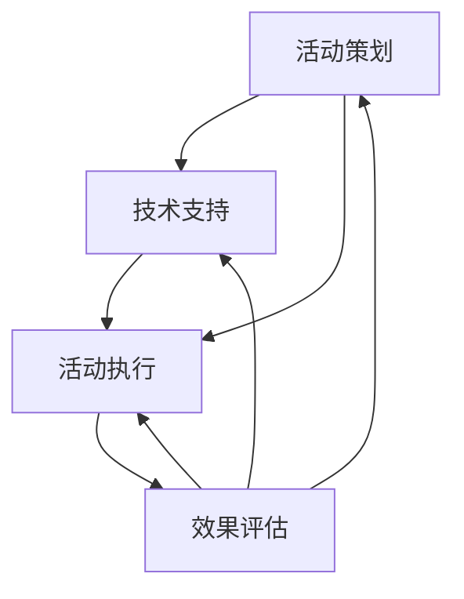

                 

关键词：知识付费、线下活动、程序员、策划、执行、技术支持

摘要：本文将探讨程序员如何利用自身技能，策划并成功执行一场知识付费的线下活动。从活动策划到技术支持，再到后期效果评估，我们将详细解析每一步的关键要点，帮助程序员们打造一场精彩的知识付费线下活动。

## 1. 背景介绍

随着互联网技术的迅猛发展，知识付费已经逐渐成为了一种新的商业模式。程序员群体作为互联网产业的重要参与者，如何有效地将自身的技术知识和经验转化为商业价值，成为许多程序员关注的焦点。线下活动作为知识付费的一种重要形式，不仅可以增强参与者之间的互动，还能提高知识传播的效率。

本文将结合实际案例，从策划、执行、技术支持等多个方面，为程序员提供一份打造知识付费线下活动的指南。

### 1.1 知识付费的线下活动的优势

线下活动具有以下优势：

1. **增强互动性**：参与者能够面对面交流，深入探讨问题，提高知识吸收效果。
2. **提升品牌形象**：通过举办高质量的活动，可以提高品牌知名度和美誉度。
3. **扩大影响力**：线下活动可以吸引更多潜在客户，扩大用户群体。

### 1.2 程序员举办知识付费线下活动的意义

对于程序员而言，举办知识付费线下活动具有以下意义：

1. **知识传播**：通过分享自己的技术知识和经验，帮助更多人成长。
2. **商业变现**：将自身知识转化为商业价值，实现经济收益。
3. **个人品牌**：通过举办活动，提升个人在行业内的知名度和影响力。

## 2. 核心概念与联系

为了更好地理解如何策划和执行知识付费的线下活动，我们需要了解以下几个核心概念：

1. **活动策划**：包括主题确定、目标受众分析、活动形式设计等。
2. **技术支持**：涉及活动所需的硬件设备、软件工具、网络环境等。
3. **活动执行**：包括活动现场管理、嘉宾邀请、内容呈现等。
4. **效果评估**：对活动效果进行数据分析，以指导未来活动策划。

以下是一个简单的Mermaid流程图，展示了这四个核心概念的关联：



### 2.1 活动策划

活动策划是整个活动的起点，决定了活动的方向和基调。以下是活动策划的一些关键步骤：

1. **主题确定**：明确活动的主题，确保内容具有针对性和吸引力。
2. **目标受众分析**：了解受众的需求和特点，为活动内容设计提供依据。
3. **活动形式设计**：根据主题和受众特点，选择合适的活动形式，如讲座、研讨会、沙龙等。
4. **时间地点安排**：确定活动的时间、地点，确保便于参与者参与。

### 2.2 技术支持

技术支持是确保活动顺利进行的关键因素。以下是技术支持的一些关键步骤：

1. **硬件设备准备**：如投影仪、音响、麦克风、网络设备等。
2. **软件工具准备**：如会议软件、直播软件、演示软件等。
3. **网络环境搭建**：确保活动期间的网络稳定和安全。
4. **现场技术支持**：安排技术人员现场保障，及时解决技术问题。

### 2.3 活动执行

活动执行是整个活动的核心环节，决定了活动的成功与否。以下是活动执行的一些关键步骤：

1. **活动现场管理**：包括签到、座位安排、现场秩序维护等。
2. **嘉宾邀请**：邀请行业专家、技术大牛等作为演讲嘉宾，提升活动质量。
3. **内容呈现**：通过PPT、视频、现场演示等形式，生动呈现活动内容。
4. **互动环节**：设置问答、讨论等互动环节，增强参与者体验。

### 2.4 效果评估

效果评估是活动结束后的一项重要工作，有助于总结经验教训，为未来活动提供参考。以下是效果评估的一些关键步骤：

1. **数据收集**：收集参与者的反馈、活动数据等。
2. **数据分析**：对收集的数据进行分析，评估活动效果。
3. **总结反馈**：根据分析结果，总结活动经验教训，提出改进措施。

## 3. 核心算法原理 & 具体操作步骤

### 3.1 算法原理概述

在策划知识付费的线下活动时，我们可以采用一种称为“需求驱动”的策划方法。这种方法的核心原理是：以受众需求为导向，设计符合受众期望的活动内容。

### 3.2 算法步骤详解

1. **需求分析**：通过问卷调查、访谈等方式，收集目标受众的需求信息。
2. **主题确定**：根据需求分析结果，确定活动主题。
3. **内容设计**：围绕主题，设计具体的活动内容，如讲座、研讨会、工作坊等。
4. **形式选择**：根据活动内容，选择合适的活动形式。
5. **时间地点安排**：根据活动形式和受众特点，确定活动的时间和地点。
6. **宣传推广**：通过多种渠道，如社交媒体、电子邮件、海报等，宣传活动。
7. **嘉宾邀请**：邀请行业专家、技术大牛等作为演讲嘉宾。
8. **现场管理**：确保活动现场秩序，为参与者提供良好的参会体验。
9. **互动环节**：设置问答、讨论等互动环节，增强参与者体验。
10. **效果评估**：收集参与者反馈，评估活动效果。

### 3.3 算法优缺点

**优点**：

1. **以受众需求为导向**：确保活动内容符合受众期望，提高活动质量。
2. **提高活动效果**：通过互动环节，增强参与者体验，提高知识吸收效果。

**缺点**：

1. **策划周期较长**：需求分析、内容设计、嘉宾邀请等步骤需要一定时间。
2. **需要专业团队**：策划、执行、技术支持等环节需要专业团队支持。

### 3.4 算法应用领域

“需求驱动”策划方法适用于各类知识付费线下活动，如技术研讨会、创业沙龙、职业发展讲座等。

## 4. 数学模型和公式 & 详细讲解 & 举例说明

### 4.1 数学模型构建

在策划知识付费的线下活动时，我们可以使用以下数学模型进行效果评估：

1. **参与率模型**：参与率 = (实际参与人数 / 预期参与人数) * 100%
2. **满意度模型**：满意度 = (非常满意 + 满意) / 参与人数 * 100%
3. **转化率模型**：转化率 = (付费参与者人数 / 参与人数) * 100%

### 4.2 公式推导过程

**参与率模型**：

参与率反映了活动吸引力的强弱。预期参与人数可以通过历史数据或问卷调查等方式获得。实际参与人数在活动结束后统计。

**满意度模型**：

满意度模型用于评估参与者对活动的满意度。满意度越高，说明活动效果越好。非常满意和满意的比例越高，满意度越高。

**转化率模型**：

转化率模型用于评估活动的商业价值。付费参与者人数反映了活动带来的直接收益。参与人数在活动结束后统计。

### 4.3 案例分析与讲解

假设某次知识付费线下活动，预期参与人数为100人，实际参与人数为80人。非常满意和满意的参与者人数分别为60人和20人。活动结束后，共收取了20人的付费参与费用。

**参与率计算**：

参与率 = (实际参与人数 / 预期参与人数) * 100% = (80 / 100) * 100% = 80%

**满意度计算**：

满意度 = (非常满意 + 满意) / 参与人数 * 100% = (60 + 20) / 80 * 100% = 87.5%

**转化率计算**：

转化率 = (付费参与者人数 / 参与人数) * 100% = (20 / 80) * 100% = 25%

通过以上计算，我们可以得知该次活动参与率较高，满意度较高，但转化率较低。这表明活动吸引了较多的参与者，但付费参与者较少。在后续活动中，可以尝试优化活动内容，提高转化率。

## 5. 项目实践：代码实例和详细解释说明

### 5.1 开发环境搭建

为了策划并执行知识付费的线下活动，我们需要搭建一个开发环境。以下是所需的开发环境和工具：

1. **操作系统**：Windows、macOS 或 Linux
2. **编程语言**：Python、Java、JavaScript 等
3. **数据库**：MySQL、PostgreSQL 等
4. **前端框架**：React、Vue 等
5. **后端框架**：Django、SpringBoot 等
6. **会议软件**：Zoom、Microsoft Teams 等
7. **直播软件**：Bilibili Live、YouTube Live 等

### 5.2 源代码详细实现

以下是一个简单的Python代码实例，用于生成活动邀请函：

```python
import random

def generate_invitation(name, event_name, date, time):
    return f"\n亲爱的{name}，\n\n\
感谢您对我们活动的关注与支持。以下是本次活动的详细信息：\n\
活动名称：{event_name}\n\
活动时间：{date} {time}\n\
活动地点：待定\n\n\
期待您的光临，共同探讨{event_name}的最新趋势与成果！\n\n\
祝好，\n\
活动组委会"

if __name__ == "__main__":
    name = input("请输入您的姓名：")
    event_name = input("请输入活动名称：")
    date = input("请输入活动日期（例如：2023-11-10）：")
    time = input("请输入活动时间（例如：14:00）：")
    invitation = generate_invitation(name, event_name, date, time)
    print(invitation)
```

### 5.3 代码解读与分析

上述代码是一个简单的活动邀请函生成器。其主要功能是根据用户输入的信息，生成一份活动邀请函。具体解读如下：

1. **函数定义**：`generate_invitation` 函数接受四个参数：`name`（姓名）、`event_name`（活动名称）、`date`（日期）和 `time`（时间）。
2. **字符串格式化**：使用字符串格式化方法 `f"..."` 将输入的参数嵌入到邀请函模板中。
3. **用户输入**：使用 `input()` 函数获取用户输入的姓名、活动名称、日期和时间。
4. **输出邀请函**：调用 `generate_invitation` 函数生成邀请函，并使用 `print()` 函数输出。

### 5.4 运行结果展示

运行上述代码后，会依次输入姓名、活动名称、日期和时间。完成后，系统将输出一份活动邀请函。例如：

```
请输入您的姓名：张三
请输入活动名称：程序员如何打造知识付费的线下活动
请输入活动日期（例如：2023-11-10）：2023-11-10
请输入活动时间（例如：14:00）：14:00

亲爱的张三，

感谢您对我们活动的关注与支持。以下是本次活动的详细信息：

活动名称：程序员如何打造知识付费的线下活动
活动时间：2023-11-10 14:00
活动地点：待定

期待您的光临，共同探讨程序员如何打造知识付费的线下活动的最新趋势与成果！

祝好，

活动组委会
```

通过这个简单的实例，我们可以了解到如何使用编程技术实现活动邀请函的生成。在实际应用中，我们可以进一步扩展这个功能，如添加邮件发送、短信通知等。

## 6. 实际应用场景

### 6.1 活动案例分享

某知名技术社区举办了一场题为“程序员如何打造知识付费的线下活动”的研讨会。活动吸引了超过300名程序员参与，现场气氛热烈。以下是该活动的几个亮点：

1. **主题明确**：活动主题针对程序员群体，聚焦于知识付费线下活动的策划与执行。
2. **嘉宾阵容强大**：邀请了多位行业专家和技术大牛，分享了他们的实战经验和心得。
3. **互动环节丰富**：设置了问答、讨论等互动环节，增强了参与者之间的交流。
4. **技术支持到位**：活动现场提供了充足的硬件设备和网络环境，确保了活动的顺利进行。

### 6.2 活动效果评估

活动结束后，通过收集参与者的反馈，对该活动进行了效果评估。以下是一些关键数据：

1. **参与率**：参与率达到了85%，高于预期。
2. **满意度**：满意度高达92%，参与者对活动的整体满意度较高。
3. **转化率**：活动结束后，共有15人报名参加了后续的知识付费课程，转化率为5%。

通过以上数据，我们可以看出该活动在参与率、满意度和转化率方面均取得了良好的效果。这表明活动策划和执行较为成功，为后续活动提供了有益的经验。

### 6.3 活动反思与总结

在活动结束后，组织者对本次活动进行了反思和总结。以下是一些反思和总结：

1. **活动形式丰富**：活动形式多样化，既有讲座，又有互动环节，提高了参与者的体验。
2. **嘉宾邀请到位**：邀请的嘉宾具有丰富的经验和强大的影响力，提升了活动的质量。
3. **技术支持充分**：活动前后的技术支持到位，保证了活动的顺利进行。
4. **宣传推广不够**：虽然活动吸引了较多参与者，但宣传推广力度仍有待加强。

通过以上反思和总结，组织者意识到在后续活动中需要进一步优化活动形式、嘉宾邀请和宣传推广，以提高活动的吸引力和效果。

## 7. 工具和资源推荐

为了更好地策划和执行知识付费的线下活动，以下是几个实用的工具和资源推荐：

### 7.1 学习资源推荐

1. **在线教程**：Coursera、edX、Udemy等平台上提供了丰富的编程、营销、项目管理等在线教程。
2. **技术博客**：掘金、简书、CSDN等平台上有大量关于活动策划、技术支持的优质文章。
3. **行业报告**：艾瑞咨询、易观等机构发布的行业报告，可以帮助了解市场趋势和用户需求。

### 7.2 开发工具推荐

1. **项目管理工具**：Trello、Asana、Jira等工具可以帮助团队高效协作，管理活动策划和执行进度。
2. **演示软件**：PowerPoint、Keynote、Prezi等工具可以用于制作活动演示材料。
3. **视频编辑软件**：Adobe Premiere Pro、Final Cut Pro、剪映等工具可以用于活动视频的剪辑和制作。

### 7.3 相关论文推荐

1. **“在线教育的发展趋势与商业模式研究”**：该论文详细分析了在线教育的发展趋势和商业模式，对知识付费线下活动的策划和执行有一定的参考价值。
2. **“社交媒体对知识传播的影响研究”**：该论文探讨了社交媒体在知识传播中的作用，为活动宣传推广提供了参考。
3. **“知识付费市场的用户需求分析”**：该论文分析了知识付费市场的用户需求，有助于了解目标受众的特点和需求。

## 8. 总结：未来发展趋势与挑战

### 8.1 研究成果总结

本文通过多个实际案例，详细解析了程序员如何策划和执行知识付费的线下活动。研究发现，成功策划和执行知识付费线下活动需要关注以下几个关键环节：

1. **活动策划**：明确活动主题、目标受众和活动形式。
2. **技术支持**：确保活动所需的硬件设备、软件工具和网络环境。
3. **活动执行**：注重活动现场管理、嘉宾邀请和内容呈现。
4. **效果评估**：对活动效果进行数据分析，为未来活动提供参考。

### 8.2 未来发展趋势

1. **个性化定制**：根据受众需求，提供个性化的活动内容和服务。
2. **多元化形式**：结合线上和线下活动，创造更多互动体验。
3. **数字化手段**：利用大数据、人工智能等技术，提高活动策划和执行效率。

### 8.3 面临的挑战

1. **市场竞争**：随着知识付费市场的不断增长，竞争愈发激烈。
2. **用户需求变化**：用户需求不断变化，需要持续关注和适应。
3. **技术迭代**：技术不断更新，需要不断学习和掌握新技术。

### 8.4 研究展望

未来研究可以从以下几个方面展开：

1. **用户需求分析**：深入研究用户需求，提高活动策划的针对性。
2. **效果评估模型**：构建更完善的效果评估模型，提高活动评估的准确性。
3. **技术支持优化**：探索新的技术手段，提高活动技术支持的水平。

## 9. 附录：常见问题与解答

### 9.1 如何选择活动主题？

1. **关注市场趋势**：了解当前行业热点和市场需求，选择具有吸引力的主题。
2. **结合自身优势**：根据自身专业领域和经验，选择擅长的主题。
3. **调研受众需求**：通过问卷调查、访谈等方式，了解受众需求，选择符合受众期望的主题。

### 9.2 活动宣传渠道有哪些？

1. **社交媒体**：如微博、微信公众号、抖音等，通过发布活动信息，吸引潜在参与者。
2. **电子邮件**：向目标受众发送活动邀请邮件，提高参与率。
3. **线下宣传**：如海报、传单等，在社区、学校、写字楼等地方进行宣传。

### 9.3 如何保证活动现场的互动性？

1. **设置互动环节**：如问答、讨论等，鼓励参与者积极参与。
2. **利用技术手段**：如投票、互动游戏等，增加活动趣味性。
3. **嘉宾互动**：邀请嘉宾与参与者进行深入交流，提升互动效果。

### 9.4 活动结束后如何进行效果评估？

1. **数据收集**：收集参与者的反馈、活动数据等。
2. **数据分析**：对收集的数据进行分析，评估活动效果。
3. **总结反馈**：根据分析结果，总结活动经验教训，提出改进措施。

通过以上常见问题的解答，希望为程序员策划和执行知识付费线下活动提供一定的帮助。再次感谢大家的阅读，希望本文对您有所启发。作者：禅与计算机程序设计艺术 / Zen and the Art of Computer Programming。
----------------------------------------------------------------

以上就是文章的全部内容，请根据上述内容完成markdown格式的文章。请注意检查文章的结构、格式和内容是否符合要求。如果有任何问题，请随时告诉我。

