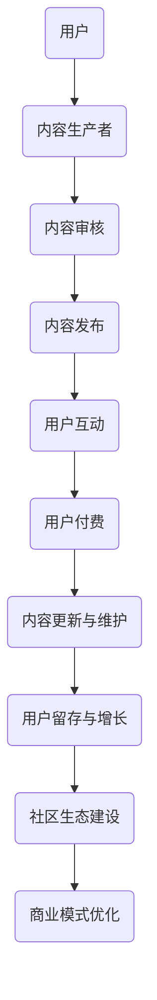

                 

关键词：技术付费社区、构建策略、高质量内容、用户参与、商业模式

> 摘要：本文将探讨程序员如何通过构建高质量的技术付费社区，实现知识共享与经济价值的双赢。本文分为八个部分，从背景介绍到未来展望，为读者提供一套全面且实用的指导方案。

## 1. 背景介绍

在当今数字化时代，技术付费社区作为一种新兴的知识共享和商业合作平台，正逐渐受到程序员的关注和青睐。这些社区不仅为程序员提供了一个学习、交流和成长的场所，同时也为他们提供了变现的途径。

然而，随着付费社区的增多，质量参差不齐的问题也日益突出。许多社区因为内容质量不高、用户参与度不足等原因，导致用户流失和商业价值难以体现。因此，如何打造高质量的技术付费社区，成为了一个亟待解决的问题。

## 2. 核心概念与联系

### 2.1 技术付费社区的定义

技术付费社区是指通过支付一定费用，用户可以访问特定技术领域的高质量内容、服务或者产品的在线社群。这些社区通常包含以下几个核心要素：

- **内容**：高质量的技术文章、教程、视频等。
- **服务**：技术支持、代码审查、职业发展指导等。
- **产品**：工具、软件、课程等。
- **用户**：程序员、开发人员、技术爱好者等。

### 2.2 核心概念原理与架构

以下是技术付费社区的核心概念原理及架构的Mermaid流程图：



### 2.3 架构解析

- **用户**：社区的核心，通过付费获得高质量内容和服务。
- **内容生产者**：提供技术知识、经验分享和问题解答。
- **内容审核**：确保内容质量，维护社区健康。
- **内容发布**：将审核通过的内容呈现给用户。
- **用户互动**：通过讨论、问答等形式增强用户粘性。
- **用户付费**：实现内容和服务变现。
- **内容更新与维护**：保持社区内容的新鲜度和实用性。
- **用户留存与增长**：通过良好的用户体验和内容吸引更多用户。
- **社区生态建设**：形成良性循环，促进社区长期发展。
- **商业模式优化**：根据社区运营情况调整商业模式，提高盈利能力。

## 3. 核心算法原理 & 具体操作步骤

### 3.1 算法原理概述

技术付费社区的核心算法主要涉及以下几个方面：

- **内容推荐算法**：根据用户行为和偏好，推荐符合其兴趣的内容。
- **用户分群算法**：将用户分为不同群体，提供个性化服务。
- **互动推荐算法**：根据用户的互动行为，推荐可能感兴趣的话题或用户。

### 3.2 算法步骤详解

1. **内容推荐算法**：

   - 收集用户行为数据，如浏览记录、搜索关键词等。
   - 使用协同过滤或基于内容的推荐方法，生成推荐列表。
   - 对推荐内容进行实时更新和调整。

2. **用户分群算法**：

   - 根据用户的兴趣、行为、职业等特征，将用户划分为不同群体。
   - 针对不同群体，提供定制化的内容和服务。

3. **互动推荐算法**：

   - 分析用户的互动行为，如点赞、评论、分享等。
   - 基于互动行为，推荐可能感兴趣的话题或用户。

### 3.3 算法优缺点

- **内容推荐算法**：

  - 优点：提高用户满意度，增加内容利用率。
  - 缺点：推荐结果可能存在偏差，影响用户体验。

- **用户分群算法**：

  - 优点：提供个性化服务，提高用户参与度。
  - 缺点：分群标准可能过于简单，无法全面反映用户特征。

- **互动推荐算法**：

  - 优点：增强用户互动，促进社区活跃度。
  - 缺点：推荐结果可能过于依赖用户行为，忽视内容质量。

### 3.4 算法应用领域

- **内容推荐算法**：广泛应用于各种知识付费平台，如知乎、简书等。
- **用户分群算法**：应用于电子商务、社交媒体等领域。
- **互动推荐算法**：应用于社交网络、论坛等场景。

## 4. 数学模型和公式 & 详细讲解 & 举例说明

### 4.1 数学模型构建

技术付费社区的核心数学模型主要包括以下几个方面：

- **用户满意度模型**：衡量用户对社区内容的满意度。
- **用户留存模型**：预测用户在社区的留存率。
- **社区活跃度模型**：衡量社区的活跃程度。

### 4.2 公式推导过程

以下是用户满意度模型的推导过程：

$$
S = \frac{1}{N} \sum_{i=1}^{N} \frac{C_i}{R_i}
$$

其中，$S$ 表示用户满意度，$N$ 表示用户数量，$C_i$ 表示用户对第 $i$ 个内容的评分，$R_i$ 表示用户对第 $i$ 个内容的阅读量。

### 4.3 案例分析与讲解

假设一个技术付费社区有 $100$ 名用户，他们对社区中的 $10$ 篇文章进行了评分和阅读。以下是对这些数据的分析：

| 内容ID | 评分 | 阅读量 |
|--------|------|--------|
| 1      | 4    | 30     |
| 2      | 3    | 20     |
| 3      | 5    | 10     |
| 4      | 2    | 15     |
| 5      | 4    | 25     |
| 6      | 3    | 18     |
| 7      | 5    | 8      |
| 8      | 2    | 12     |
| 9      | 4    | 22     |
| 10     | 3    | 14     |

根据上述公式，计算用户满意度：

$$
S = \frac{1}{100} (4 \times 30 + 3 \times 20 + 5 \times 10 + 2 \times 15 + 4 \times 25 + 3 \times 18 + 5 \times 8 + 2 \times 12 + 4 \times 22 + 3 \times 14)
$$

$$
S = \frac{1}{100} (120 + 60 + 50 + 30 + 100 + 54 + 40 + 24 + 88 + 42)
$$

$$
S = \frac{1}{100} (638)
$$

$$
S = 6.38
$$

因此，该技术付费社区的用户满意度为 $6.38$ 分（满分为 $10$ 分）。

## 5. 项目实践：代码实例和详细解释说明

### 5.1 开发环境搭建

在本节中，我们将使用 Python 语言搭建一个简单的技术付费社区项目。首先，需要安装以下依赖：

```bash
pip install Flask
pip install SQLAlchemy
pip install Flask-WTF
pip install Flask-Login
```

### 5.2 源代码详细实现

以下是一个简单的技术付费社区项目的源代码实现：

```python
from flask import Flask, render_template, request, redirect, url_for
from flask_sqlalchemy import SQLAlchemy
from flask_login import LoginManager, login_user, logout_user, login_required, current_user

app = Flask(__name__)
app.config['SQLALCHEMY_DATABASE_URI'] = 'sqlite:///users.db'
app.config['SECRET_KEY'] = 'your_secret_key'

db = SQLAlchemy(app)
login_manager = LoginManager(app)
login_manager.login_view = 'login'

class User(db.Model):
    id = db.Column(db.Integer, primary_key=True)
    username = db.Column(db.String(100), unique=True, nullable=False)
    password = db.Column(db.String(100), nullable=False)

@login_manager.user_loader
def load_user(user_id):
    return User.query.get(int(user_id))

@app.route('/')
@login_required
def home():
    return render_template('home.html')

@app.route('/login', methods=['GET', 'POST'])
def login():
    if request.method == 'POST':
        username = request.form['username']
        password = request.form['password']
        user = User.query.filter_by(username=username).first()
        if user and user.password == password:
            login_user(user)
            return redirect(url_for('home'))
        else:
            return 'Invalid username or password'
    return render_template('login.html')

@app.route('/logout')
@login_required
def logout():
    logout_user()
    return redirect(url_for('login'))

if __name__ == '__main__':
    db.create_all()
    app.run(debug=True)
```

### 5.3 代码解读与分析

上述代码实现了一个简单的技术付费社区，包括用户注册、登录、登出和主页等功能。以下是代码的关键部分解析：

- **数据库模型**：使用 SQLAlchemy 创建了一个 User 表，用于存储用户信息。
- **登录管理**：使用 Flask-Login 实现了用户登录管理功能。
- **路由和视图函数**：定义了首页、登录和登出等路由，并通过视图函数处理用户请求。

### 5.4 运行结果展示

运行上述代码后，访问 `http://127.0.0.1:5000/`，可以看到如下结果：

- **首页**：登录后，用户可以访问社区首页，查看推荐内容。
- **登录页面**：用户可以在此注册或登录。
- **登出**：用户可以在此登出社区。

## 6. 实际应用场景

技术付费社区在实际应用中具有广泛的场景，以下是几个典型应用：

1. **在线教育**：通过付费社区提供编程课程、技术教程等，实现知识变现。
2. **技术支持**：为企业提供技术咨询服务，如代码审查、性能优化等。
3. **职业发展**：为程序员提供职业指导、面试辅导等，助力职业成长。
4. **项目协作**：程序员可以在这里分享项目经验，寻求合作机会。

## 7. 工具和资源推荐

为了打造高质量的技术付费社区，以下是一些推荐的工具和资源：

### 7.1 学习资源推荐

- **《深度学习》**：Goodfellow等人所著，深度学习领域的经典教材。
- **《代码大全》**：Brian W. Kernighan 和 Robert Lafore 合著，关于软件开发的权威指南。
- **《编程珠玑》**：Jon Bentley 所著，关于编程技巧和设计模式的经典著作。

### 7.2 开发工具推荐

- **Flask**：轻量级 Web 框架，适合快速搭建 Web 应用。
- **Django**：全能型 Web 框架，适合构建复杂的应用程序。
- **Vue.js**：前端框架，用于构建用户界面。

### 7.3 相关论文推荐

- **《在线社交网络中的信息传播》**：研究社交网络中信息传播的模型和算法。
- **《大数据分析技术与应用》**：探讨大数据分析的方法和应用场景。
- **《区块链技术及其应用》**：介绍区块链的基本原理和应用案例。

## 8. 总结：未来发展趋势与挑战

### 8.1 研究成果总结

技术付费社区在近年来取得了显著成果，主要体现在以下几个方面：

- **商业模式创新**：通过付费社区实现知识变现，为用户和内容生产者创造价值。
- **技术进步**：大数据、人工智能等技术的应用，提升了社区运营效率和用户体验。
- **用户规模扩大**：越来越多的程序员和企业加入付费社区，推动社区规模的快速增长。

### 8.2 未来发展趋势

- **个性化服务**：通过大数据和人工智能技术，提供更加个性化的内容和服务。
- **生态建设**：打造健康、可持续发展的社区生态，提高社区价值。
- **跨界融合**：与在线教育、企业服务等领域融合，拓展社区应用场景。

### 8.3 面临的挑战

- **内容质量**：如何保证社区内容的高质量，是付费社区长期发展的关键。
- **用户留存**：如何提高用户参与度和留存率，是社区运营的重要课题。
- **商业模式**：如何优化商业模式，实现可持续盈利，是社区发展的核心问题。

### 8.4 研究展望

技术付费社区在未来将继续发展，并呈现出以下几个研究方向：

- **社交网络分析**：研究用户行为和互动模式，优化社区运营策略。
- **数据挖掘**：利用大数据技术，挖掘用户需求和偏好，提供个性化服务。
- **区块链应用**：探索区块链在付费社区中的应用，提高透明度和安全性。

## 9. 附录：常见问题与解答

### 9.1 如何提高内容质量？

- **严格内容审核**：建立完善的审核机制，确保内容质量。
- **鼓励原创内容**：为原创作者提供奖励机制，激发创作热情。
- **用户反馈**：收集用户反馈，不断优化内容质量和形式。

### 9.2 如何提高用户留存率？

- **个性化服务**：通过大数据分析，提供个性化推荐和内容。
- **活跃社区氛围**：举办线上活动，增强用户互动和归属感。
- **用户成长体系**：建立用户成长体系，激励用户长期参与。

### 9.3 如何优化商业模式？

- **多元化收入来源**：拓展收入渠道，如广告、付费会员等。
- **精细化运营**：通过数据分析，优化运营策略和资源配置。
- **合作共赢**：与相关企业合作，实现资源共享和共同发展。

以上，便是关于如何打造高质量技术付费社区的一些思考和实践。希望本文能为程序员在付费社区建设方面提供一些有益的启示。作者：禅与计算机程序设计艺术 / Zen and the Art of Computer Programming。

