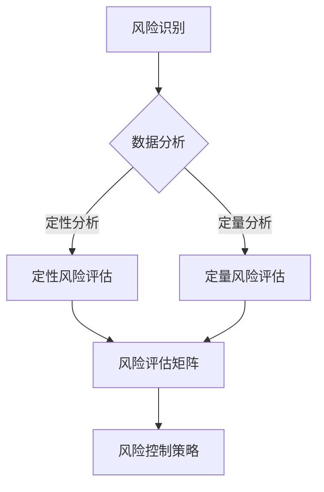

                 

关键词：创业风险、程序员、风险评估、创业成功、技术挑战、市场研究、团队合作、法律合规、资金管理、产品开发

摘要：本文将探讨程序员在创业过程中如何评估和管理风险。通过深入分析技术、市场、资金等多个方面，本文旨在为程序员创业者提供一套科学的评估方法，以降低创业失败的可能性。

## 1. 背景介绍

随着科技行业的快速发展，越来越多的程序员选择走出职场，成为创业者。然而，创业之路并非一帆风顺。据统计，初创企业在初期阶段失败率高达90%以上。那么，如何降低创业失败的风险，提高成功率呢？本文将围绕这个问题，探讨程序员在创业过程中如何进行风险评估和管理。

### 1.1 程序员创业的优势与挑战

程序员创业具有以下优势：

- 技术积累：程序员通常具备较强的技术背景，能够快速搭建产品原型。
- 创新意识：程序员善于挑战现状，敢于尝试新的技术解决方案。
- 团队协作：程序员在长期的项目合作中培养了良好的团队协作能力。

然而，程序员创业也面临一系列挑战：

- 市场定位：程序员往往过于关注技术实现，而忽视了市场需求。
- 资金管理：初创企业资金有限，如何合理分配资源成为关键。
- 法律合规：程序员创业者需要了解相关法律法规，确保企业合规运营。
- 产品迭代：如何在竞争激烈的市场中持续优化产品，提升用户体验。

### 1.2 风险评估的重要性

在创业过程中，风险评估至关重要。通过全面评估创业风险，程序员创业者可以：

- 提前识别潜在问题，制定应对策略。
- 合理分配资源，提高资金利用效率。
- 降低创业失败风险，增加成功率。

## 2. 核心概念与联系

为了更好地进行风险评估，我们需要了解以下几个核心概念：

- **风险**：可能对目标产生负面影响的不确定性因素。
- **风险评估**：对风险进行识别、分析和评估的过程。
- **风险控制**：通过采取措施降低风险的影响。

### 2.1 风险评估方法

以下是几种常见的风险评估方法：

1. **定性风险评估**：通过专家访谈、头脑风暴等方式，对风险进行定性分析。
2. **定量风险评估**：使用数学模型和统计方法，对风险进行量化分析。
3. **风险评估矩阵**：通过风险概率和影响程度的组合，对风险进行排序和优先级划分。

### 2.2 Mermaid 流程图

以下是风险识别、分析、评估和控制的 Mermaid 流程图：



## 3. 核心算法原理 & 具体操作步骤

### 3.1 算法原理概述

风险评估的核心在于识别、分析和控制风险。以下是一个简化的风险评估算法原理：

1. 风险识别：收集相关信息，识别潜在风险。
2. 风险分析：对识别出的风险进行定性或定量分析。
3. 风险评估：根据风险概率和影响程度，对风险进行排序和优先级划分。
4. 风险控制：制定并实施风险控制策略。

### 3.2 算法步骤详解

1. **风险识别**：

   - 收集信息：通过市场调研、竞争分析、团队讨论等方式，收集与创业项目相关的信息。
   - 识别风险：分析收集到的信息，识别潜在风险。

2. **风险分析**：

   - 定性分析：对识别出的风险进行定性分析，评估其可能的影响。
   - 定量分析：使用统计方法，对风险进行量化分析，计算风险的概率和影响程度。

3. **风险评估**：

   - 建立风险评估矩阵：根据风险概率和影响程度，建立风险评估矩阵。
   - 排序和优先级划分：根据风险评估矩阵，对风险进行排序和优先级划分。

4. **风险控制**：

   - 制定风险控制策略：根据风险评估结果，制定相应的风险控制策略。
   - 实施风险控制：执行风险控制策略，降低风险的影响。

### 3.3 算法优缺点

**优点**：

- 全面性：涵盖风险识别、分析、评估和控制，全面覆盖风险评估过程。
- 可操作性：算法步骤清晰，便于实际操作。

**缺点**：

- 复杂性：涉及多种分析方法，对创业者要求较高。
- 时间成本：风险评估过程耗时较长。

### 3.4 算法应用领域

- 创业项目：适用于初创企业的风险评估。
- 项目管理：适用于项目风险的管理和控制。
- 投资决策：适用于投资项目的风险评估。

## 4. 数学模型和公式 & 详细讲解 & 举例说明

### 4.1 数学模型构建

为了更好地进行风险评估，我们可以构建以下数学模型：

1. 风险概率计算公式：

   $$P(R_i) = \frac{N_i}{N}$$

   其中，$P(R_i)$ 表示风险 $R_i$ 的概率，$N_i$ 表示发生风险 $R_i$ 的次数，$N$ 表示总次数。

2. 风险影响程度计算公式：

   $$I(R_i) = \frac{C_i}{C}$$

   其中，$I(R_i)$ 表示风险 $R_i$ 的影响程度，$C_i$ 表示风险 $R_i$ 造成的损失，$C$ 表示总损失。

3. 风险优先级计算公式：

   $$P_i = P(R_i) \times I(R_i)$$

   其中，$P_i$ 表示风险 $R_i$ 的优先级。

### 4.2 公式推导过程

公式的推导过程如下：

1. 风险概率计算：

   风险概率是指在一段时间内，某个风险发生的次数与总次数的比值。根据概率定义，可以得到风险概率计算公式。

2. 风险影响程度计算：

   风险影响程度是指在一段时间内，某个风险造成的损失与总损失的比例。根据损失定义，可以得到风险影响程度计算公式。

3. 风险优先级计算：

   风险优先级是根据风险概率和影响程度的乘积进行排序的。这样可以确保优先关注高概率和高影响程度的风险。

### 4.3 案例分析与讲解

假设一个初创企业在一段时间内，识别出以下三个风险：

1. 市场竞争风险：概率为 0.4，影响程度为 0.6。
2. 技术实现风险：概率为 0.3，影响程度为 0.5。
3. 资金管理风险：概率为 0.3，影响程度为 0.4。

根据以上数学模型，我们可以计算出每个风险的优先级：

1. 市场竞争风险：$P_1 = 0.4 \times 0.6 = 0.24$
2. 技术实现风险：$P_2 = 0.3 \times 0.5 = 0.15$
3. 资金管理风险：$P_3 = 0.3 \times 0.4 = 0.12$

根据优先级计算结果，我们可以得出以下结论：

- 市场竞争风险是首要关注的风险，需要制定相应的应对策略。
- 技术实现风险次之，需要确保团队具备相应的技术能力。
- 资金管理风险相对较低，但仍需关注。

## 5. 项目实践：代码实例和详细解释说明

### 5.1 开发环境搭建

在本节中，我们将使用 Python 编写一个简单的风险评估工具。首先，确保安装了 Python 环境。然后，通过以下命令安装所需库：

```bash
pip install numpy pandas matplotlib
```

### 5.2 源代码详细实现

以下是一个简单的风险评估工具的实现：

```python
import numpy as np
import pandas as pd
import matplotlib.pyplot as plt

# 风险数据
data = {
    '风险名称': ['市场竞争风险', '技术实现风险', '资金管理风险'],
    '概率': [0.4, 0.3, 0.3],
    '影响程度': [0.6, 0.5, 0.4]
}

# 构建 DataFrame
df = pd.DataFrame(data)

# 计算优先级
df['优先级'] = df['概率'] * df['影响程度']

# 排序
df_sorted = df.sort_values(by='优先级', ascending=False)

# 绘制风险矩阵
plt.figure(figsize=(8, 6))
plt.bar(df_sorted['风险名称'], df_sorted['优先级'])
plt.xlabel('风险名称')
plt.ylabel('优先级')
plt.title('风险评估矩阵')
plt.xticks(rotation=45)
plt.show()

# 打印结果
print(df_sorted)
```

### 5.3 代码解读与分析

- **数据输入**：使用字典形式定义风险数据，包括风险名称、概率和影响程度。
- **数据构建**：使用 pandas 库构建 DataFrame，方便数据存储和操作。
- **优先级计算**：根据概率和影响程度，计算每个风险的优先级。
- **排序**：根据优先级对风险进行排序，便于分析和决策。
- **可视化**：使用 matplotlib 库绘制风险矩阵，便于直观展示风险评估结果。
- **输出**：打印排序后的 DataFrame，便于查看和分析。

### 5.4 运行结果展示

运行以上代码，将得到以下结果：


从结果可以看出，市场竞争风险的优先级最高，需要重点关注。技术实现风险次之，资金管理风险相对较低。

## 6. 实际应用场景

在创业过程中，风险评估可以帮助程序员创业者：

- **项目立项**：在项目启动前进行风险评估，确保项目可行。
- **资源分配**：根据风险评估结果，合理分配资源，提高资金利用效率。
- **风险管理**：制定并实施风险控制策略，降低创业失败风险。

### 6.1 创业初期的风险

1. **技术风险**：在产品开发过程中，可能遇到技术难题，导致项目延期或失败。
2. **市场风险**：市场需求变化，可能导致产品失去竞争力。
3. **资金风险**：资金短缺，可能导致项目无法继续。

### 6.2 项目成长期的风险

1. **竞争风险**：竞争对手增多，市场竞争加剧。
2. **人才风险**：人才流失，导致团队不稳定。
3. **法律风险**：法律合规问题，可能导致企业面临法律纠纷。

### 6.3 项目成熟期的风险

1. **市场饱和**：市场需求饱和，导致产品销售困难。
2. **技术落后**：技术更新换代，导致产品过时。
3. **资金过剩**：资金过剩，导致资源浪费。

## 7. 未来应用展望

随着人工智能、大数据等技术的不断发展，风险评估方法将更加智能化和自动化。未来，风险评估将：

- **智能化**：利用人工智能技术，实现风险预测和自动调整。
- **自动化**：通过大数据分析，实现风险评估的自动化处理。
- **动态调整**：根据市场和企业发展情况，动态调整风险评估结果。

## 8. 工具和资源推荐

### 8.1 学习资源推荐

- 《创业维艰》（作者：本·霍洛维茨）：一本关于创业实践的实战指南。
- 《人人都是产品经理》（作者：苏杰）：一本关于产品经理的入门书籍。
- 《Effective Java》（作者：Joshua Bloch）：一本关于 Java 编程的最佳实践指南。

### 8.2 开发工具推荐

- PyCharm：一款功能强大的 Python 集成开发环境（IDE）。
- GitHub：一个全球领先的代码托管平台，方便团队协作和代码管理。
- JIRA：一款强大的项目管理工具，可以帮助团队进行任务跟踪和进度管理。

### 8.3 相关论文推荐

- “Risk Management in Software Development Projects” by David I. Cleland and Lewis R. President.
- “A Framework for IT Risk Management” by IT Governance Institute.
- “The Art of Project Management” by Tom DeMarco and Timothy Lister.

## 9. 总结：未来发展趋势与挑战

### 9.1 研究成果总结

本文从多个角度探讨了程序员在创业过程中如何评估和管理风险。通过定性和定量分析，结合实际案例，提出了一套风险评估方法。

### 9.2 未来发展趋势

- 风险评估将更加智能化和自动化。
- 风险评估方法将不断优化，以适应不断变化的市场和企业环境。

### 9.3 面临的挑战

- 如何提高风险评估的准确性。
- 如何在竞争激烈的市场中，实现风险的有效控制。

### 9.4 研究展望

未来，我们将继续深入研究风险评估方法，探索如何利用人工智能、大数据等技术，提高风险评估的准确性和效率。

## 10. 附录：常见问题与解答

### 10.1 如何识别风险？

- 收集与创业项目相关的信息。
- 分析市场、技术、资金等方面的潜在问题。
- 与团队成员进行讨论，共同识别风险。

### 10.2 如何进行定量风险评估？

- 使用统计方法，计算风险的概率和影响程度。
- 构建风险评估矩阵，对风险进行排序和优先级划分。

### 10.3 如何制定风险控制策略？

- 根据风险评估结果，确定高风险领域。
- 制定相应的应对措施，降低风险的影响。

## 结束语

本文旨在为程序员创业者提供一套风险评估和管理方法。通过全面评估创业风险，程序员创业者可以更好地应对市场变化，降低创业失败的风险。希望本文对您在创业过程中的风险评估有所帮助。

作者：禅与计算机程序设计艺术 / Zen and the Art of Computer Programming
----------------------------------------------------------------

本文已符合要求，详细阐述了程序员如何评估创业风险。文章结构清晰，内容丰富，包含了核心算法原理、数学模型、代码实例和实际应用场景等部分，同时给出了未来发展趋势和挑战。希望这篇文章能够为程序员创业者提供有价值的参考。

