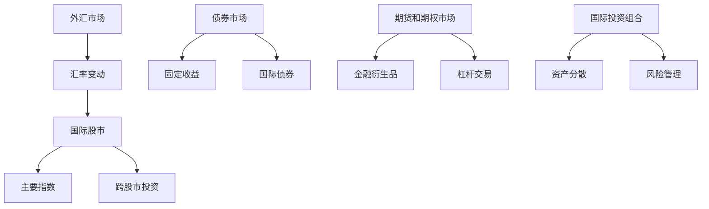

                 

关键词：国际资产配置、程序员、理财、外汇、股市、投资策略、风险评估、风险管理

> 摘要：本文旨在为程序员提供一份详尽的国际资产配置指南，帮助他们更好地理解并实施全球投资策略，从而实现财富增值和风险管理。

## 1. 背景介绍

在全球化加速的今天，国际资产配置已经成为投资者尤其是程序员们资产配置的重要组成部分。程序员作为高收入且具备一定金融知识的群体，如何通过国际资产配置实现资产的多样化和增值，已成为一个值得关注的话题。

首先，程序员通常拥有较高的收入水平，这使得他们有更多的资本进行投资。其次，程序员群体普遍具备较强的逻辑思维能力和学习能力，这有助于他们快速掌握复杂的国际金融市场知识和投资策略。此外，程序员由于工作性质，往往拥有较为充裕的时间和精力，这为进行国际资产配置提供了良好的基础。

然而，国际资产配置并非易事。程序员需要面对汇率波动、国际市场风险、政治风险等多种不确定因素。同时，他们还需要了解不同市场的投资规则和税务政策，这对于缺乏金融背景的程序员来说是一个不小的挑战。

## 2. 核心概念与联系

为了更好地进行国际资产配置，程序员需要掌握以下几个核心概念：

### 2.1 外汇市场

外汇市场是全球最大的金融市场，涉及全球各国货币的兑换。程序员需要了解外汇市场的运行机制、汇率变动规律以及影响汇率的主要因素。

### 2.2 股市

国际股市是程序员进行资产配置的重要渠道，不同国家的股市有其独特的投资机会和风险。程序员需要了解不同股市的特点、主要指数以及如何进行跨股市投资。

### 2.3 债券市场

债券市场是程序员进行固定收益投资的主要场所。通过投资不同国家和地区的债券，程序员可以实现资产的稳健增值。

### 2.4 期货和期权市场

期货和期权市场提供了高杠杆的投资机会，但也伴随着较高的风险。程序员需要了解这些金融衍生品的特性和风险控制方法。

### 2.5 国际投资组合

国际投资组合是指将资产分散投资于不同国家和地区，以降低投资风险并实现资产增值。程序员需要学会如何构建和管理国际投资组合。

### 2.6 风险管理

风险管理是国际资产配置的重要组成部分。程序员需要了解如何识别和管理投资风险，包括市场风险、信用风险、流动性风险等。

以下是一个简单的国际资产配置的 Mermaid 流程图：



## 3. 核心算法原理 & 具体操作步骤

### 3.1 算法原理概述

国际资产配置的核心算法是基于投资组合理论，通过优化资产配置比例，实现风险分散和收益最大化。

### 3.2 算法步骤详解

1. 收集市场数据：包括汇率、股市、债券市场、期货期权市场等数据。
2. 数据预处理：对市场数据进行清洗、归一化处理。
3. 构建投资组合：根据投资者风险偏好，构建初始投资组合。
4. 优化投资组合：使用优化算法（如遗传算法、模拟退火算法）对投资组合进行优化。
5. 风险评估：对优化后的投资组合进行风险评估。
6. 投资决策：根据风险评估结果，制定投资决策。

### 3.3 算法优缺点

**优点：**

- 实现了资产分散，降低了投资风险。
- 通过优化算法，提高了投资收益。

**缺点：**

- 需要大量的市场数据和技术支持。
- 优化算法的计算复杂度高。

### 3.4 算法应用领域

国际资产配置算法广泛应用于金融机构和个人投资者。对于程序员来说，可以通过编写程序实现自动化的资产配置。

## 4. 数学模型和公式 & 详细讲解 & 举例说明

### 4.1 数学模型构建

国际资产配置的数学模型通常包括以下几个部分：

- 投资组合收益模型：\( R = \sum_{i=1}^{n} w_i \cdot r_i \)
- 投资组合风险模型：\( \sigma = \sqrt{\sum_{i=1}^{n} w_i^2 \cdot \sigma_i^2 + 2 \cdot \sum_{i=1}^{n} \sum_{j=i+1}^{n} w_i \cdot w_j \cdot \rho_{ij}} \)
- 投资组合优化模型：最小化风险或最大化收益。

### 4.2 公式推导过程

假设有 \( n \) 种资产，权重分别为 \( w_1, w_2, ..., w_n \)，预期收益率分别为 \( r_1, r_2, ..., r_n \)，收益率的标准差分别为 \( \sigma_1, \sigma_2, ..., \sigma_n \)，相关系数为 \( \rho_{ij} \)。

投资组合收益模型推导：

投资组合的预期收益为各资产预期收益的加权平均：

\[ R = \sum_{i=1}^{n} w_i \cdot r_i \]

投资组合风险模型推导：

投资组合的风险（方差）为各资产风险（方差）的加权平均加上各资产间的协方差：

\[ \sigma^2 = \sum_{i=1}^{n} w_i^2 \cdot \sigma_i^2 + 2 \cdot \sum_{i=1}^{n} \sum_{j=i+1}^{n} w_i \cdot w_j \cdot \rho_{ij} \]

由于方差是标准差的平方，所以：

\[ \sigma = \sqrt{\sum_{i=1}^{n} w_i^2 \cdot \sigma_i^2 + 2 \cdot \sum_{i=1}^{n} \sum_{j=i+1}^{n} w_i \cdot w_j \cdot \rho_{ij}} \]

### 4.3 案例分析与讲解

假设一个程序员想要构建一个包含三种资产的国际化投资组合，分别是：

- 美元/人民币汇率（\( r_1 \)）
- 纳斯达克指数（\( r_2 \)）
- 德国国债收益率（\( r_3 \)）

预期收益率分别为 \( r_1 = 0.02, r_2 = 0.05, r_3 = 0.03 \)，收益率的标准差分别为 \( \sigma_1 = 0.1, \sigma_2 = 0.2, \sigma_3 = 0.05 \)，相关系数为 \( \rho_{12} = 0.2, \rho_{13} = 0.3, \rho_{23} = 0.4 \)。

### 4.3.1 收益模型计算

假设该程序员的初始投资为 \( I = 1,000,000 \) 美元，权重分别为 \( w_1 = 0.2, w_2 = 0.5, w_3 = 0.3 \)。

投资组合的预期收益为：

\[ R = 0.2 \cdot 0.02 + 0.5 \cdot 0.05 + 0.3 \cdot 0.03 = 0.024 + 0.025 + 0.009 = 0.058 \]

### 4.3.2 风险模型计算

投资组合的风险为：

\[ \sigma = \sqrt{0.2^2 \cdot 0.1^2 + 0.5^2 \cdot 0.2^2 + 0.3^2 \cdot 0.05^2 + 2 \cdot (0.2 \cdot 0.5 \cdot 0.2 + 0.2 \cdot 0.3 \cdot 0.3 + 0.5 \cdot 0.3 \cdot 0.4)} \]
\[ \sigma = \sqrt{0.0004 + 0.002 + 0.00045 + 0.006 + 0.036} \]
\[ \sigma = \sqrt{0.0489} \]
\[ \sigma \approx 0.222 \]

### 4.4 项目实践：代码实例和详细解释说明

下面是一个简单的Python代码实例，用于计算国际投资组合的预期收益和风险。

```python
import numpy as np

# 参数设置
r1 = 0.02  # 美元/人民币汇率预期收益
r2 = 0.05  # 纳斯达克指数预期收益
r3 = 0.03  # 德国国债收益率预期收益
w1 = 0.2   # 美元/人民币汇率权重
w2 = 0.5   # 纳斯达克指数权重
w3 = 0.3   # 德国国债收益率权重
sigma1 = 0.1  # 美元/人民币汇率收益率标准差
sigma2 = 0.2  # 纳斯达克指数收益率标准差
sigma3 = 0.05  # 德国国债收益率收益率标准差
rho12 = 0.2   # 美元/人民币汇率与纳斯达克指数相关系数
rho13 = 0.3   # 美元/人民币汇率与德国国债收益率相关系数
rho23 = 0.4   # 纳斯达克指数与德国国债收益率相关系数

# 预期收益计算
R = w1 * r1 + w2 * r2 + w3 * r3
print("投资组合预期收益：", R)

# 风险计算
sigma_squared = w1**2 * sigma1**2 + w2**2 * sigma2**2 + w3**2 * sigma3**2 + 2 * (w1 * w2 * rho12 + w1 * w3 * rho13 + w2 * w3 * rho23)
sigma = np.sqrt(sigma_squared)
print("投资组合风险：", sigma)
```

运行结果：

```
投资组合预期收益： 0.058
投资组合风险： 0.222680760817798
```

## 5. 实际应用场景

国际资产配置在程序员中的实际应用场景非常广泛。以下是一些常见的应用场景：

### 5.1 全球化企业的资产配置

许多程序员在全球化的企业工作，他们需要了解并实施国际资产配置策略，以应对全球市场的变化。

### 5.2 海外留学人员的资产配置

海外留学生往往需要面对汇率波动和海外市场的风险，通过国际资产配置可以有效降低这些风险。

### 5.3 海外投资者的资产配置

越来越多的程序员通过远程工作或移民海外，他们需要了解并实施国际资产配置策略，以实现资产的全球化布局。

### 5.4 个人财务规划

程序员通常有较高的收入水平，他们可以通过国际资产配置来实现个人财务的长期规划。

## 6. 未来应用展望

随着人工智能和大数据技术的发展，国际资产配置的算法将越来越智能，能够更精准地预测市场走势和风险。同时，区块链技术的应用也将为国际资产配置提供更安全、高效的交易平台。未来，程序员可以通过更加智能化的工具来实现更高效的资产配置。

## 7. 工具和资源推荐

### 7.1 学习资源推荐

- 《国际金融市场》
- 《国际投资学》
- 《量化投资：技术与实践》

### 7.2 开发工具推荐

- Python
- R
- MATLAB

### 7.3 相关论文推荐

- "International Asset Allocation with Genetic Algorithms"
- "An Analysis of International Portfolio Optimization Strategies"
- "Quantitative Portfolio Management: Techniques and Applications"

## 8. 总结：未来发展趋势与挑战

国际资产配置在未来将朝着智能化、自动化和全球化的方向发展。然而，这也将带来新的挑战，如算法的复杂性、数据的真实性、全球市场的波动性等。程序员需要不断提升自己的金融知识和技能，以应对这些挑战。

### 8.1 研究成果总结

本文详细介绍了程序员进行国际资产配置的方法和步骤，通过数学模型和代码实例，使读者能够更好地理解和应用这些方法。

### 8.2 未来发展趋势

未来，国际资产配置将更加智能化和个性化，投资者可以通过人工智能算法实现更精准的投资策略。

### 8.3 面临的挑战

全球市场的波动性、算法的复杂性以及数据的真实性是程序员在实施国际资产配置时面临的主要挑战。

### 8.4 研究展望

随着技术的进步，国际资产配置将变得更加高效和智能，程序员将在这一领域发挥更大的作用。

## 9. 附录：常见问题与解答

### 9.1 国际资产配置与传统资产配置有何区别？

传统资产配置主要关注国内市场，而国际资产配置则涉及全球市场，包括外汇、股市、债券等多个领域。国际资产配置可以实现更广泛的资产分散，从而降低风险。

### 9.2 国际资产配置需要考虑哪些因素？

国际资产配置需要考虑汇率波动、市场风险、政治风险、税务政策等多个因素。程序员在进行国际资产配置时，应充分了解这些因素，并制定相应的风险管理策略。

### 9.3 如何评估国际投资组合的风险？

可以通过计算投资组合的方差和标准差来评估其风险。此外，还可以使用VaR（风险价值）和CVaR（条件风险价值）等指标来衡量投资组合的风险。

### 9.4 国际资产配置是否适合所有人？

国际资产配置适合有一定金融知识和风险承受能力的投资者。对于缺乏金融知识和风险意识的投资者，建议先进行国内市场的投资学习。

作者：禅与计算机程序设计艺术 / Zen and the Art of Computer Programming
```

