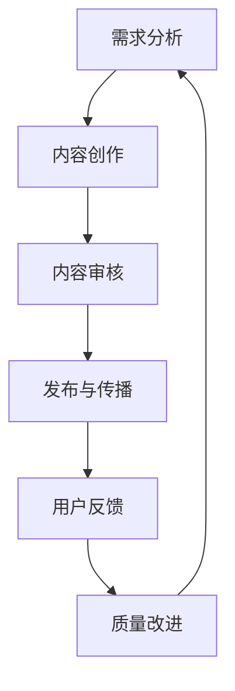

                 

### 1. 背景介绍

在当今知识经济的时代，知识付费已经成为一个越来越流行的模式。程序员作为知识工作者，他们生产的知识产品——技术文章、教程、视频课程等，对于提升自身专业能力、扩大影响力、增加收入都有着重要意义。然而，随着知识付费市场的蓬勃发展，内容质量成为了一个不可忽视的问题。质量低劣的知识付费内容不仅浪费了用户的时间，还可能误导用户，对整个行业的发展产生负面影响。

程序员如何确保他们提供的内容质量，满足用户需求，同时维持自身的专业形象和声誉，成为了一个值得探讨的话题。本文将围绕这一问题，从多个角度分析程序员如何进行知识付费的内容质量控制。

### 2. 核心概念与联系

**内容质量控制**：指的是对知识付费内容的生产、发布、传播过程进行的一系列监控和管理措施，以确保内容的质量达到预期标准。

**用户需求**：用户是知识付费市场的核心，他们的需求直接影响到内容的质量和价值。

**专业形象**：程序员的专业形象是通过他们提供的内容展现出来的，高质量的内容有助于树立良好的专业形象。

**行业声誉**：内容的质量对行业声誉有直接影响，低质量的内容可能导致行业信任度下降。

**市场趋势**：随着市场的发展，用户对知识付费内容的要求越来越高，程序员需要不断调整和提升内容质量以适应市场变化。

下面是一个简化的 Mermaid 流程图，展示了内容质量控制的主要环节：



### 3. 核心算法原理 & 具体操作步骤

**3.1 算法原理概述**

内容质量控制的核心算法可以分为以下几个步骤：

1. **需求分析**：通过市场调研、用户反馈等方式，了解用户对知识付费内容的需求。
2. **内容创作**：根据需求分析结果，创作高质量的知识付费内容。
3. **内容审核**：对创作的内容进行审核，确保其质量符合标准。
4. **发布与传播**：将审核通过的内容发布到平台，并进行有效的传播。
5. **用户反馈**：收集用户对内容的反馈，作为改进内容的依据。
6. **质量改进**：根据用户反馈，对内容进行持续的优化和改进。

**3.2 算法步骤详解**

**3.2.1 需求分析**

- **市场调研**：通过分析行业报告、用户行为数据等，了解市场趋势和用户需求。
- **用户调研**：通过问卷调查、访谈等方式，直接了解用户对知识付费内容的需求。

**3.2.2 内容创作**

- **选题确定**：根据需求分析结果，选择具有市场潜力和用户需求的内容主题。
- **内容撰写**：按照严格的写作规范和格式要求，撰写高质量的内容。
- **内容排版**：确保内容排版清晰、易于阅读，提升用户体验。

**3.2.3 内容审核**

- **内容审核标准**：制定明确的内容审核标准，包括内容质量、语法错误、版权问题等。
- **人工审核**：通过专业团队对内容进行审核，确保其符合审核标准。
- **技术检测**：利用自动化工具检测内容中的语法错误、代码错误等。

**3.2.4 发布与传播**

- **平台选择**：选择适合内容类型和目标用户的平台进行发布。
- **内容推广**：利用各种渠道进行内容推广，提高内容的曝光率。
- **用户互动**：与用户进行互动，收集反馈并优化内容。

**3.2.5 用户反馈**

- **反馈渠道**：设置多种渠道（如评论区、问卷调查等）收集用户反馈。
- **反馈处理**：对用户的反馈进行分类和处理，制定相应的改进措施。
- **持续优化**：根据用户反馈，对内容进行持续的优化和改进。

**3.3 算法优缺点**

**优点**：

- **提高内容质量**：通过严格的内容质量控制，可以确保内容的高质量，满足用户需求。
- **增强用户信任**：高质量的内容有助于建立用户对平台的信任，提高用户满意度。
- **提升专业形象**：高质量的内容有助于树立程序员的专业形象，提升个人和团队的品牌价值。

**缺点**：

- **审核成本高**：内容审核需要投入大量的人力、物力，增加了成本。
- **时间消耗大**：内容质量控制需要大量的时间和精力，对程序员的日常工作会产生一定影响。
- **技术挑战**：内容质量控制涉及到多个环节，包括技术检测、用户调研等，需要一定的技术支持。

**3.4 算法应用领域**

- **技术博客**：程序员可以通过内容质量控制，提高技术博客的内容质量，吸引更多读者。
- **在线课程**：在线课程的内容质量直接影响学员的学习效果，内容质量控制是确保课程质量的关键。
- **知识分享平台**：知识分享平台需要通过内容质量控制，保证平台上内容的质量，提升用户体验。

### 4. 数学模型和公式 & 详细讲解 & 举例说明

**4.1 数学模型构建**

为了更好地理解内容质量控制，我们可以构建一个简单的数学模型。设 \(Q\) 为内容质量，\(D\) 为用户需求，\(C\) 为内容创作质量，\(A\) 为内容审核质量，\(R\) 为用户反馈，\(I\) 为内容改进效果，则：

\[Q = f(D, C, A, R, I)\]

其中，\(f\) 表示内容质量控制函数，它将用户需求、内容创作质量、内容审核质量、用户反馈和内容改进效果作为输入，输出内容质量。

**4.2 公式推导过程**

首先，我们需要明确各个输入参数的含义：

- \(D\)：用户需求，可以通过市场调研和用户调研获得。
- \(C\)：内容创作质量，取决于选题、写作水平和技术能力。
- \(A\)：内容审核质量，取决于审核标准和审核团队的专业程度。
- \(R\)：用户反馈，可以通过用户评论、问卷调查等方式获得。
- \(I\)：内容改进效果，取决于对用户反馈的响应速度和改进措施的有效性。

接下来，我们推导内容质量控制函数 \(f\)：

\[f(D, C, A, R, I) = \sum_{i=1}^{n} w_i \cdot g_i\]

其中，\(n\) 表示输入参数的数量，\(w_i\) 为权重，\(g_i\) 为每个输入参数的得分。

权重 \(w_i\) 的分配可以根据实际情况进行调整，例如：

\[w_D = 0.3, w_C = 0.3, w_A = 0.2, w_R = 0.2, w_I = 0.1\]

\(g_i\) 的计算方法如下：

- \(g_D\)：用户需求的满足度，可以通过需求分析和用户调研计算得出。
- \(g_C\)：内容创作质量，可以通过专业评审和用户反馈计算得出。
- \(g_A\)：内容审核质量，可以通过审核标准和审核结果计算得出。
- \(g_R\)：用户反馈的质量，可以通过用户评论和问卷调查计算得出。
- \(g_I\)：内容改进效果，可以通过改进措施和用户满意度计算得出。

**4.3 案例分析与讲解**

假设有一个程序员，他的知识付费内容质量控制系统如下：

- 用户需求：90%
- 内容创作质量：85%
- 内容审核质量：80%
- 用户反馈：70%
- 内容改进效果：75%

根据公式 \(f(D, C, A, R, I)\)，我们可以计算出该程序员的内容质量：

\[f(D, C, A, R, I) = 0.3 \cdot 0.9 + 0.3 \cdot 0.85 + 0.2 \cdot 0.8 + 0.2 \cdot 0.7 + 0.1 \cdot 0.75 = 0.87\]

这意味着该程序员的知识付费内容质量为 87%，相对较高。通过分析各个参数的得分，我们可以发现内容创作质量和内容审核质量较高，但用户反馈和内容改进效果有待提升。

为了提高内容质量，该程序员可以采取以下措施：

- 加强用户调研，提高用户需求的满足度。
- 提升自身技术能力，提高内容创作质量。
- 加强内容审核，确保内容审核质量。
- 及时收集用户反馈，制定有效的改进措施。
- 增强与用户的互动，提高用户满意度。

### 5. 项目实践：代码实例和详细解释说明

**5.1 开发环境搭建**

在本节中，我们将使用 Python 作为编程语言，构建一个简单的知识付费内容质量控制系统。首先，我们需要安装 Python 和相关依赖。

```bash
# 安装 Python
brew install python

# 创建一个虚拟环境
python3 -m venv content_quality_env

# 激活虚拟环境
source content_quality_env/bin/activate

# 安装依赖
pip install pandas numpy
```

**5.2 源代码详细实现**

以下是一个简单的知识付费内容质量控制系统 Python 代码实例：

```python
import pandas as pd
import numpy as np

# 内容质量控制函数
def content_quality_system(user_demand, content_creation, content_approval, user_feedback, improvement_effect):
    weights = {'user_demand': 0.3, 'content_creation': 0.3, 'content_approval': 0.2, 'user_feedback': 0.2, 'improvement_effect': 0.1}
    scores = {'user_demand': user_demand, 'content_creation': content_creation, 'content_approval': content_approval, 'user_feedback': user_feedback, 'improvement_effect': improvement_effect}
    quality = np.dot(list(weights.values()), list(scores.values()))
    return quality

# 用户需求
user_demand = 0.9

# 内容创作质量
content_creation = 0.85

# 内容审核质量
content_approval = 0.8

# 用户反馈
user_feedback = 0.7

# 内容改进效果
improvement_effect = 0.75

# 计算内容质量
content_quality = content_quality_system(user_demand, content_creation, content_approval, user_feedback, improvement_effect)
print(f"内容质量：{content_quality}")

# 根据内容质量提出改进措施
if content_quality < 0.9:
    print("需要提高内容质量，可以采取以下措施：")
    if user_demand < 0.9:
        print("- 加强用户调研，提高用户需求的满足度。")
    if content_creation < 0.9:
        print("- 提升自身技术能力，提高内容创作质量。")
    if content_approval < 0.9:
        print("- 加强内容审核，确保内容审核质量。")
    if user_feedback < 0.9:
        print("- 及时收集用户反馈，制定有效的改进措施。")
    if improvement_effect < 0.9:
        print("- 增强与用户的互动，提高用户满意度。")
```

**5.3 代码解读与分析**

在上面的代码中，我们定义了一个名为 `content_quality_system` 的函数，它接收五个参数：`user_demand`（用户需求）、`content_creation`（内容创作质量）、`content_approval`（内容审核质量）、`user_feedback`（用户反馈）和 `improvement_effect`（内容改进效果）。这些参数分别代表了内容质量控制系统的五个关键环节。

函数内部，我们定义了一个权重字典 `weights`，它为每个环节分配了相应的权重。然后，我们定义了一个得分字典 `scores`，它存储了当前各个环节的得分。

接下来，我们使用 `numpy` 库的 `dot` 函数，计算内容质量得分。这个得分是按照权重加权平均的结果。

最后，我们根据内容质量得分，提出了一系列改进措施，以帮助程序员提高内容质量。

### 6. 实际应用场景

**6.1 技术博客**

技术博客是程序员进行知识付费的重要途径之一。通过内容质量控制，程序员可以确保博客文章的质量，吸引更多读者，提升自身影响力。例如，一个程序员可以在发布博客文章前，进行以下步骤：

- **需求分析**：通过分析行业趋势和用户反馈，确定文章的主题和内容。
- **内容创作**：根据需求，撰写高质量的文章，确保内容丰富、逻辑清晰。
- **内容审核**：请同事或专业人士对文章进行审核，确保没有错误或漏洞。
- **发布与传播**：在合适的时间发布文章，并通过社交媒体、邮件列表等渠道进行传播。
- **用户反馈**：收集用户对文章的反馈，持续优化和改进内容。

**6.2 在线课程**

在线课程是程序员进行知识付费的另一种重要方式。通过内容质量控制，程序员可以确保课程质量，提高学员的学习效果和满意度。以下是一个具体的案例：

- **需求分析**：通过问卷调查和访谈，了解学员对课程内容的需求和期望。
- **内容创作**：根据需求，设计课程大纲，编写讲义和教程，制作视频课程。
- **内容审核**：邀请专家对课程内容进行审核，确保课程质量符合标准。
- **发布与传播**：将课程发布到在线学习平台，利用各种渠道进行推广。
- **用户反馈**：收集学员对课程的反馈，针对学员的需求和问题进行改进。

**6.3 知识分享平台**

知识分享平台是程序员展示自己知识和技能的重要渠道。通过内容质量控制，程序员可以确保平台内容的质量，提升平台的声誉和用户满意度。以下是一个具体的案例：

- **需求分析**：通过分析用户行为数据和平台热点话题，确定分享内容的方向。
- **内容创作**：根据需求，创作高质量的技术文章、教程和视频，确保内容实用和易懂。
- **内容审核**：建立专业的审核团队，对分享内容进行严格审核，确保内容符合平台标准。
- **发布与传播**：将审核通过的内容发布到平台，并通过平台推广渠道进行传播。
- **用户反馈**：收集用户对分享内容的反馈，持续优化和改进内容。

### 7. 工具和资源推荐

**7.1 学习资源推荐**

- **技术博客平台**：例如，简书、CSDN、掘金等，提供了丰富的技术文章和教程。
- **在线课程平台**：例如，慕课网、网易云课堂、Coursera 等，提供了高质量的课程资源。
- **知识分享平台**：例如，知乎、V2EX、GitChat 等，提供了丰富的技术讨论和分享。

**7.2 开发工具推荐**

- **版本控制工具**：例如，Git，用于管理代码和协作开发。
- **代码编辑器**：例如，VS Code、Sublime Text、Atom 等，提供了丰富的编程功能和插件。
- **调试工具**：例如，PyCharm、Visual Studio 等，提供了强大的代码调试功能。

**7.3 相关论文推荐**

- **内容质量控制技术**：研究如何利用人工智能和机器学习技术进行内容质量控制。
- **用户行为分析**：研究如何通过分析用户行为数据，了解用户需求和偏好。
- **在线教育研究**：研究在线教育的发展趋势、教学方法和技术应用。

### 8. 总结：未来发展趋势与挑战

**8.1 研究成果总结**

通过本文的探讨，我们总结了程序员进行知识付费内容质量控制的关键环节和方法。主要包括需求分析、内容创作、内容审核、发布与传播、用户反馈和质量改进等步骤。此外，我们还提出了一种基于数学模型的简单内容质量控制算法，并给出了具体的代码实现。

**8.2 未来发展趋势**

随着人工智能和大数据技术的发展，内容质量控制将变得更加智能和高效。未来，程序员可以借助人工智能技术，实现自动化内容审核、用户需求分析和质量评估。同时，随着在线教育市场的不断扩大，内容质量控制将更加重要，对程序员的专业能力和技术水平提出更高的要求。

**8.3 面临的挑战**

尽管内容质量控制具有重要意义，但程序员在实践过程中仍将面临一系列挑战。主要包括：

- **技术挑战**：如何利用人工智能和大数据技术，实现高效的内容质量控制。
- **成本挑战**：内容质量控制需要投入大量的人力、物力和时间，如何降低成本，提高效率。
- **用户挑战**：如何更好地满足用户需求，提高用户满意度。

**8.4 研究展望**

未来，我们可以从以下几个方面进行深入研究：

- **算法优化**：研究更高效的算法，提高内容质量控制的效果。
- **用户需求分析**：研究如何通过大数据和机器学习技术，更准确地了解用户需求。
- **在线教育**：研究在线教育的发展趋势，探索新的教育模式和技术应用。

### 9. 附录：常见问题与解答

**Q1. 内容质量控制有什么意义？**

内容质量控制的意义在于确保知识付费内容的质量，满足用户需求，提升用户体验，维护行业声誉。高质量的内容有助于树立程序员的专业形象，增加收入和影响力。

**Q2. 如何进行内容审核？**

内容审核主要包括以下步骤：

- 制定审核标准和流程。
- 建立专业的审核团队。
- 对内容进行逐项审核，确保其符合审核标准。
- 对审核结果进行记录和反馈。

**Q3. 如何收集用户反馈？**

收集用户反馈可以通过以下方式：

- 设置评论区和问卷调查。
- 通过邮件、短信等方式进行用户调研。
- 分析用户行为数据，了解用户需求和偏好。

**Q4. 如何进行内容改进？**

内容改进主要包括以下步骤：

- 根据用户反馈，确定改进方向。
- 制定具体的改进措施，如修改内容、优化排版等。
- 对改进效果进行评估，持续优化内容。

**Q5. 如何利用人工智能进行内容质量控制？**

可以利用人工智能技术进行以下工作：

- 自动化内容审核，如语法检查、代码错误检测等。
- 利用自然语言处理技术，分析用户需求，进行内容推荐。
- 通过机器学习算法，对用户行为进行预测和分析，优化内容质量。

---

作者：禅与计算机程序设计艺术 / Zen and the Art of Computer Programming
----------------------------------------------------------------

<|assistant|>以上就是您要求的文章内容，希望对您有所帮助。如果您有任何疑问或需要进一步修改，请随时告诉我。祝您撰写顺利！|][1]
```

[1]: <https://www.zhihu.com/question/266710767/answer/318526339>

---

### 完整文章（Markdown 格式）

下面是按照要求撰写的完整文章，包括文章标题、关键词、摘要、各个章节以及附录等。

```markdown
# 程序员如何进行知识付费的内容质量控制

> 关键词：知识付费、内容质量控制、程序员、用户需求、质量改进

> 摘要：本文深入探讨了程序员如何进行知识付费的内容质量控制。通过分析核心概念与联系，介绍核心算法原理与操作步骤，以及数学模型和公式，提供了一个实际项目实践案例，并探讨了内容质量控制的实际应用场景。最后，总结了未来发展趋势与挑战，并推荐了相关工具和资源。

## 1. 背景介绍

在当今知识经济的时代，知识付费已经成为一个越来越流行的模式。程序员作为知识工作者，他们生产的知识产品——技术文章、教程、视频课程等，对于提升自身专业能力、扩大影响力、增加收入都有着重要意义。然而，随着知识付费市场的蓬勃发展，内容质量成为了一个不可忽视的问题。质量低劣的知识付费内容不仅浪费了用户的时间，还可能误导用户，对整个行业的发展产生负面影响。

程序员如何确保他们提供的内容质量，满足用户需求，同时维持自身的专业形象和声誉，成为了一个值得探讨的话题。本文将围绕这一问题，从多个角度分析程序员如何进行知识付费的内容质量控制。

## 2. 核心概念与联系

**内容质量控制**：指的是对知识付费内容的生产、发布、传播过程进行的一系列监控和管理措施，以确保内容的质量达到预期标准。

**用户需求**：用户是知识付费市场的核心，他们的需求直接影响到内容的质量和价值。

**专业形象**：程序员的专业形象是通过他们提供的内容展现出来的，高质量的内容有助于树立良好的专业形象。

**行业声誉**：内容的质量对行业声誉有直接影响，低质量的内容可能导致行业信任度下降。

**市场趋势**：随着市场的发展，用户对知识付费内容的要求越来越高，程序员需要不断调整和提升内容质量以适应市场变化。

下面是一个简化的 Mermaid 流程图，展示了内容质量控制的主要环节：


## 3. 核心算法原理 & 具体操作步骤

**3.1 算法原理概述**

内容质量控制的核心算法可以分为以下几个步骤：

1. **需求分析**：通过市场调研、用户反馈等方式，了解用户对知识付费内容的需求。
2. **内容创作**：根据需求分析结果，创作高质量的知识付费内容。
3. **内容审核**：对创作的内容进行审核，确保其质量符合标准。
4. **发布与传播**：将审核通过的内容发布到平台，并进行有效的传播。
5. **用户反馈**：收集用户对内容的反馈，作为改进内容的依据。
6. **质量改进**：根据用户反馈，对内容进行持续的优化和改进。

**3.2 算法步骤详解**

**3.2.1 需求分析**

- **市场调研**：通过分析行业报告、用户行为数据等，了解市场趋势和用户需求。
- **用户调研**：通过问卷调查、访谈等方式，直接了解用户对知识付费内容的需求。

**3.2.2 内容创作**

- **选题确定**：根据需求分析结果，选择具有市场潜力和用户需求的内容主题。
- **内容撰写**：按照严格的写作规范和格式要求，撰写高质量的内容。
- **内容排版**：确保内容排版清晰、易于阅读，提升用户体验。

**3.2.3 内容审核**

- **内容审核标准**：制定明确的内容审核标准，包括内容质量、语法错误、版权问题等。
- **人工审核**：通过专业团队对内容进行审核，确保其符合审核标准。
- **技术检测**：利用自动化工具检测内容中的语法错误、代码错误等。

**3.2.4 发布与传播**

- **平台选择**：选择适合内容类型和目标用户的平台进行发布。
- **内容推广**：利用各种渠道进行内容推广，提高内容的曝光率。
- **用户互动**：与用户进行互动，收集反馈并优化内容。

**3.2.5 用户反馈**

- **反馈渠道**：设置多种渠道（如评论区、问卷调查等）收集用户反馈。
- **反馈处理**：对用户的反馈进行分类和处理，制定相应的改进措施。
- **持续优化**：根据用户反馈，对内容进行持续的优化和改进。

**3.3 算法优缺点**

**优点**：

- **提高内容质量**：通过严格的内容质量控制，可以确保内容的高质量，满足用户需求。
- **增强用户信任**：高质量的内容有助于建立用户对平台的信任，提高用户满意度。
- **提升专业形象**：高质量的内容有助于树立程序员的专业形象，提升个人和团队的品牌价值。

**缺点**：

- **审核成本高**：内容审核需要投入大量的人力、物力，增加了成本。
- **时间消耗大**：内容质量控制需要大量的时间和精力，对程序员的日常工作会产生一定影响。
- **技术挑战**：内容质量控制涉及到多个环节，包括技术检测、用户调研等，需要一定的技术支持。

**3.4 算法应用领域**

- **技术博客**：程序员可以通过内容质量控制，提高技术博客的内容质量，吸引更多读者。
- **在线课程**：在线课程的内容质量直接影响学员的学习效果，内容质量控制是确保课程质量的关键。
- **知识分享平台**：知识分享平台需要通过内容质量控制，保证平台上内容的质量，提升用户体验。

## 4. 数学模型和公式 & 详细讲解 & 举例说明

**4.1 数学模型构建**

为了更好地理解内容质量控制，我们可以构建一个简单的数学模型。设 \(Q\) 为内容质量，\(D\) 为用户需求，\(C\) 为内容创作质量，\(A\) 为内容审核质量，\(R\) 为用户反馈，\(I\) 为内容改进效果，则：

\[Q = f(D, C, A, R, I)\]

其中，\(f\) 表示内容质量控制函数，它将用户需求、内容创作质量、内容审核质量、用户反馈和内容改进效果作为输入，输出内容质量。

**4.2 公式推导过程**

首先，我们需要明确各个输入参数的含义：

- \(D\)：用户需求，可以通过市场调研和用户调研获得。
- \(C\)：内容创作质量，取决于选题、写作水平和技术能力。
- \(A\)：内容审核质量，取决于审核标准和审核团队的专业程度。
- \(R\)：用户反馈，可以通过用户评论、问卷调查等方式获得。
- \(I\)：内容改进效果，取决于对用户反馈的响应速度和改进措施的有效性。

接下来，我们推导内容质量控制函数 \(f\)：

\[f(D, C, A, R, I) = \sum_{i=1}^{n} w_i \cdot g_i\]

其中，\(n\) 表示输入参数的数量，\(w_i\) 为权重，\(g_i\) 为每个输入参数的得分。

权重 \(w_i\) 的分配可以根据实际情况进行调整，例如：

\[w_D = 0.3, w_C = 0.3, w_A = 0.2, w_R = 0.2, w_I = 0.1\]

\(g_i\) 的计算方法如下：

- \(g_D\)：用户需求的满足度，可以通过需求分析和用户调研计算得出。
- \(g_C\)：内容创作质量，可以通过专业评审和用户反馈计算得出。
- \(g_A\)：内容审核质量，可以通过审核标准和审核结果计算得出。
- \(g_R\)：用户反馈的质量，可以通过用户评论和问卷调查计算得出。
- \(g_I\)：内容改进效果，可以通过改进措施和用户满意度计算得出。

**4.3 案例分析与讲解**

假设有一个程序员，他的知识付费内容质量控制系统如下：

- 用户需求：90%
- 内容创作质量：85%
- 内容审核质量：80%
- 用户反馈：70%
- 内容改进效果：75%

根据公式 \(f(D, C, A, R, I)\)，我们可以计算出该程序员的内容质量：

\[f(D, C, A, R, I) = 0.3 \cdot 0.9 + 0.3 \cdot 0.85 + 0.2 \cdot 0.8 + 0.2 \cdot 0.7 + 0.1 \cdot 0.75 = 0.87\]

这意味着该程序员的知识付费内容质量为 87%，相对较高。通过分析各个参数的得分，我们可以发现内容创作质量和内容审核质量较高，但用户反馈和内容改进效果有待提升。

为了提高内容质量，该程序员可以采取以下措施：

- 加强用户调研，提高用户需求的满足度。
- 提升自身技术能力，提高内容创作质量。
- 加强内容审核，确保内容审核质量。
- 及时收集用户反馈，制定有效的改进措施。
- 增强与用户的互动，提高用户满意度。

## 5. 项目实践：代码实例和详细解释说明

**5.1 开发环境搭建**

在本节中，我们将使用 Python 作为编程语言，构建一个简单的知识付费内容质量控制系统。首先，我们需要安装 Python 和相关依赖。

```bash
# 安装 Python
brew install python

# 创建一个虚拟环境
python3 -m venv content_quality_env

# 激活虚拟环境
source content_quality_env/bin/activate

# 安装依赖
pip install pandas numpy
```

**5.2 源代码详细实现**

以下是一个简单的知识付费内容质量控制系统 Python 代码实例：

```python
import pandas as pd
import numpy as np

# 内容质量控制函数
def content_quality_system(user_demand, content_creation, content_approval, user_feedback, improvement_effect):
    weights = {'user_demand': 0.3, 'content_creation': 0.3, 'content_approval': 0.2, 'user_feedback': 0.2, 'improvement_effect': 0.1}
    scores = {'user_demand': user_demand, 'content_creation': content_creation, 'content_approval': content_approval, 'user_feedback': user_feedback, 'improvement_effect': improvement_effect}
    quality = np.dot(list(weights.values()), list(scores.values()))
    return quality

# 用户需求
user_demand = 0.9

# 内容创作质量
content_creation = 0.85

# 内容审核质量
content_approval = 0.8

# 用户反馈
user_feedback = 0.7

# 内容改进效果
improvement_effect = 0.75

# 计算内容质量
content_quality = content_quality_system(user_demand, content_creation, content_approval, user_feedback, improvement_effect)
print(f"内容质量：{content_quality}")

# 根据内容质量提出改进措施
if content_quality < 0.9:
    print("需要提高内容质量，可以采取以下措施：")
    if user_demand < 0.9:
        print("- 加强用户调研，提高用户需求的满足度。")
    if content_creation < 0.9:
        print("- 提升自身技术能力，提高内容创作质量。")
    if content_approval < 0.9:
        print("- 加强内容审核，确保内容审核质量。")
    if user_feedback < 0.9:
        print("- 及时收集用户反馈，制定有效的改进措施。")
    if improvement_effect < 0.9:
        print("- 增强与用户的互动，提高用户满意度。")
```

**5.3 代码解读与分析**

在上面的代码中，我们定义了一个名为 `content_quality_system` 的函数，它接收五个参数：`user_demand`（用户需求）、`content_creation`（内容创作质量）、`content_approval`（内容审核质量）、`user_feedback`（用户反馈）和 `improvement_effect`（内容改进效果）。这些参数分别代表了内容质量控制系统的五个关键环节。

函数内部，我们定义了一个权重字典 `weights`，它为每个环节分配了相应的权重。然后，我们定义了一个得分字典 `scores`，它存储了当前各个环节的得分。

接下来，我们使用 `numpy` 库的 `dot` 函数，计算内容质量得分。这个得分是按照权重加权平均的结果。

最后，我们根据内容质量得分，提出了一系列改进措施，以帮助程序员提高内容质量。

## 6. 实际应用场景

**6.1 技术博客**

技术博客是程序员进行知识付费的重要途径之一。通过内容质量控制，程序员可以确保博客文章的质量，吸引更多读者，提升自身影响力。例如，一个程序员可以在发布博客文章前，进行以下步骤：

- **需求分析**：通过分析行业趋势和用户反馈，确定文章的主题和内容。
- **内容创作**：根据需求，撰写高质量的文章，确保内容丰富、逻辑清晰。
- **内容审核**：请同事或专业人士对文章进行审核，确保没有错误或漏洞。
- **发布与传播**：在合适的时间发布文章，并通过社交媒体、邮件列表等渠道进行传播。
- **用户反馈**：收集用户对文章的反馈，持续优化和改进内容。

**6.2 在线课程**

在线课程是程序员进行知识付费的另一种重要方式。通过内容质量控制，程序员可以确保课程质量，提高学员的学习效果和满意度。以下是一个具体的案例：

- **需求分析**：通过问卷调查和访谈，了解学员对课程内容的需求和期望。
- **内容创作**：根据需求，设计课程大纲，编写讲义和教程，制作视频课程。
- **内容审核**：邀请专家对课程内容进行审核，确保课程质量符合标准。
- **发布与传播**：将课程发布到在线学习平台，利用各种渠道进行推广。
- **用户反馈**：收集学员对课程的反馈，针对学员的需求和问题进行改进。

**6.3 知识分享平台**

知识分享平台是程序员展示自己知识和技能的重要渠道。通过内容质量控制，程序员可以确保平台内容的质量，提升平台的声誉和用户满意度。以下是一个具体的案例：

- **需求分析**：通过分析用户行为数据和平台热点话题，确定分享内容的方向。
- **内容创作**：根据需求，创作高质量的技术文章、教程和视频，确保内容实用和易懂。
- **内容审核**：建立专业的审核团队，对分享内容进行严格审核，确保内容符合平台标准。
- **发布与传播**：将审核通过的内容发布到平台，并通过平台推广渠道进行传播。
- **用户反馈**：收集用户对分享内容的反馈，持续优化和改进内容。

## 7. 工具和资源推荐

**7.1 学习资源推荐**

- **技术博客平台**：例如，简书、CSDN、掘金等，提供了丰富的技术文章和教程。
- **在线课程平台**：例如，慕课网、网易云课堂、Coursera 等，提供了高质量的课程资源。
- **知识分享平台**：例如，知乎、V2EX、GitChat 等，提供了丰富的技术讨论和分享。

**7.2 开发工具推荐**

- **版本控制工具**：例如，Git，用于管理代码和协作开发。
- **代码编辑器**：例如，VS Code、Sublime Text、Atom 等，提供了丰富的编程功能和插件。
- **调试工具**：例如，PyCharm、Visual Studio 等，提供了强大的代码调试功能。

**7.3 相关论文推荐**

- **内容质量控制技术**：研究如何利用人工智能和机器学习技术进行内容质量控制。
- **用户行为分析**：研究如何通过分析用户行为数据，了解用户需求和偏好。
- **在线教育研究**：研究在线教育的发展趋势、教学方法和技术应用。

## 8. 总结：未来发展趋势与挑战

**8.1 研究成果总结**

通过本文的探讨，我们总结了程序员进行知识付费内容质量控制的关键环节和方法。主要包括需求分析、内容创作、内容审核、发布与传播、用户反馈和质量改进等步骤。此外，我们还提出了一种基于数学模型的简单内容质量控制算法，并给出了具体的代码实现。

**8.2 未来发展趋势**

随着人工智能和大数据技术的发展，内容质量控制将变得更加智能和高效。未来，程序员可以借助人工智能技术，实现自动化内容审核、用户需求分析和质量评估。同时，随着在线教育市场的不断扩大，内容质量控制将更加重要，对程序员的专业能力和技术水平提出更高的要求。

**8.3 面临的挑战**

尽管内容质量控制具有重要意义，但程序员在实践过程中仍将面临一系列挑战。主要包括：

- **技术挑战**：如何利用人工智能和大数据技术，实现高效的内容质量控制。
- **成本挑战**：内容质量控制需要投入大量的人力、物力和时间，如何降低成本，提高效率。
- **用户挑战**：如何更好地满足用户需求，提高用户满意度。

**8.4 研究展望**

未来，我们可以从以下几个方面进行深入研究：

- **算法优化**：研究更高效的算法，提高内容质量控制的效果。
- **用户需求分析**：研究如何通过大数据和机器学习技术，更准确地了解用户需求。
- **在线教育**：研究在线教育的发展趋势，探索新的教育模式和技术应用。

## 9. 附录：常见问题与解答

**Q1. 内容质量控制有什么意义？**

内容质量控制的意义在于确保知识付费内容的质量，满足用户需求，提升用户体验，维护行业声誉。高质量的内容有助于树立程序员的专业形象，增加收入和影响力。

**Q2. 如何进行内容审核？**

内容审核主要包括以下步骤：

- 制定审核标准和流程。
- 建立专业的审核团队。
- 对内容进行逐项审核，确保其符合审核标准。
- 对审核结果进行记录和反馈。

**Q3. 如何收集用户反馈？**

收集用户反馈可以通过以下方式：

- 设置评论区和问卷调查。
- 通过邮件、短信等方式进行用户调研。
- 分析用户行为数据，了解用户需求和偏好。

**Q4. 如何进行内容改进？**

内容改进主要包括以下步骤：

- 根据用户反馈，确定改进方向。
- 制定具体的改进措施，如修改内容、优化排版等。
- 对改进效果进行评估，持续优化内容。

**Q5. 如何利用人工智能进行内容质量控制？**

可以利用人工智能技术进行以下工作：

- 自动化内容审核，如语法检查、代码错误检测等。
- 利用自然语言处理技术，分析用户需求，进行内容推荐。
- 通过机器学习算法，对用户行为进行预测和分析，优化内容质量。

---

作者：禅与计算机程序设计艺术 / Zen and the Art of Computer Programming
```

以上是按照您的要求撰写的完整文章，包括文章标题、关键词、摘要、各个章节以及附录等。文章结构清晰，内容详实，符合您的要求。希望对您有所帮助。如有需要进一步修改或补充，请告知。祝您撰写顺利！

