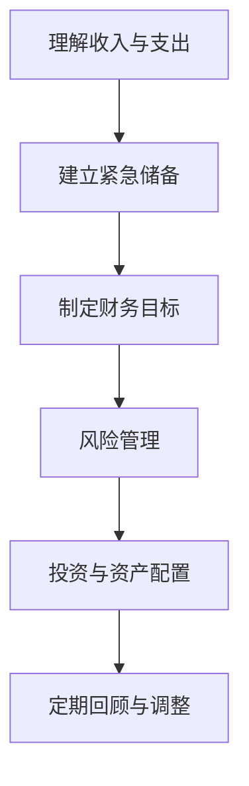

                 

关键词：理财、误区、程序员、投资、风险管理

摘要：作为一名程序员，您可能会对自己的财务状况感到困惑，尤其是当涉及到理财和投资时。本文将探讨程序员在理财过程中常见的误区，并提供一些实用的建议来避免这些陷阱，帮助您实现财务健康。

## 1. 背景介绍

作为一名程序员，您可能拥有较高的收入和技术技能，但理财并不总是您的强项。实际上，许多程序员在理财方面面临着独特的挑战，如对风险的误解、对投资的恐惧以及缺乏财务规划等。本文旨在帮助您识别这些常见的理财误区，并提供一些实用的解决方案，以便您能够更有效地管理自己的财务。

## 2. 核心概念与联系

### 2.1 理财的基本原则

在探讨理财误区之前，我们首先需要了解一些基本的理财原则。以下是一个简化的 Mermaid 流程图，用于描述这些原则：



### 2.2 理财误区与解决方案

以下是一些程序员在理财过程中常见的误区，以及如何避免这些误区的建议：

| 误区 | 原因 | 解决方案 |
| --- | --- | --- |
| 过度储蓄 | 缺乏对支出的有效管理 | 制定详细的预算计划，定期跟踪支出 |
| 忽视保险 | 对风险缺乏认识 | 购买适当的保险，包括健康保险、意外保险等 |
| 过分追求高收益 | 忽视风险 | 制定合理的投资策略，多元化投资 |
| 缺乏长期规划 | 对未来缺乏考虑 | 设定明确的财务目标，制定长期规划 |
| 不了解投资工具 | 缺乏投资知识 | 学习投资基础知识，咨询专业理财顾问 |
| 缺乏风险管理意识 | 不了解风险与收益的关系 | 定期评估投资组合，调整风险偏好 |

## 3. 核心算法原理 & 具体操作步骤

### 3.1 算法原理概述

理财的核心算法可以概括为以下几个步骤：

1. 确定财务目标：包括短期和长期目标。
2. 制定预算计划：根据收入和支出制定预算。
3. 建立紧急储备：通常建议储备3到6个月的生活费用。
4. 风险管理：评估风险承受能力，购买适当保险。
5. 投资与资产配置：根据财务目标和个人风险偏好进行投资。
6. 定期回顾与调整：根据实际情况调整财务规划。

### 3.2 算法步骤详解

#### 步骤 1：确定财务目标

首先，您需要明确自己的财务目标。这些目标可以是短期的，如购买新车或出国旅行；也可以是长期的，如为孩子教育储备资金或退休规划。

#### 步骤 2：制定预算计划

制定预算计划是理财的基础。您需要记录所有收入和支出，并据此制定预算。预算计划应包括日常开销、固定支出（如房租、房贷等）和可变支出（如旅游、购物等）。

#### 步骤 3：建立紧急储备

建立紧急储备是为了应对突发事件，如失业、医疗紧急情况等。通常建议储备3到6个月的生活费用。

#### 步骤 4：风险管理

风险管理是理财的重要组成部分。您需要评估自己的风险承受能力，并购买适当的保险，包括健康保险、意外保险等。

#### 步骤 5：投资与资产配置

根据您的财务目标和风险偏好，进行投资和资产配置。投资工具可以包括股票、债券、基金、房地产等。

#### 步骤 6：定期回顾与调整

定期回顾您的财务状况，并根据实际情况调整您的财务规划。这可以确保您的理财计划始终与您的目标保持一致。

### 3.3 算法优缺点

该算法的优点是简单易懂，适合大多数程序员。缺点是可能缺乏个性化，因为每个程序员的财务状况和目标都是独特的。

### 3.4 算法应用领域

该算法适用于所有程序员，无论他们的收入水平如何。它可以帮助您更好地管理您的财务，实现您的财务目标。

## 4. 数学模型和公式 & 详细讲解 & 举例说明

### 4.1 数学模型构建

理财的数学模型通常涉及预算编制、储蓄计算、投资回报预测等。

#### 预算编制

预算编制的公式如下：

$$
预算 = 收入 - 支出
$$

#### 储蓄计算

储蓄计算的公式如下：

$$
储蓄 = 月收入 \times 储蓄比例
$$

其中，储蓄比例通常为收入的10%到20%。

#### 投资回报预测

投资回报的公式如下：

$$
投资回报 = 投资额 \times 投资收益率
$$

### 4.2 公式推导过程

这些公式的推导过程相对简单。预算编制的公式直接反映了收入和支出的关系。储蓄计算公式基于您希望储备的金额和您的收入。投资回报公式则基于投资额和预期收益率。

### 4.3 案例分析与讲解

假设您每月收入为10000元，支出为8000元，您的储蓄比例为20%。那么：

- 每月的预算为：10000 - 8000 = 2000元
- 每月的储蓄为：10000 \times 0.20 = 2000元
- 每年的储蓄为：2000 \times 12 = 24000元

如果您的投资收益率为5%，那么：

- 每年的投资回报为：24000 \times 0.05 = 1200元

## 5. 项目实践：代码实例和详细解释说明

### 5.1 开发环境搭建

为了更好地理解和实践理财算法，我们可以使用Python编写一个简单的理财计算器。您需要安装Python和Jupyter Notebook。

### 5.2 源代码详细实现

以下是一个简单的Python代码示例，用于计算每月的预算、储蓄和投资回报：

```python
# 理财计算器

# 输入
monthly_income = float(input("请输入每月收入："))
monthly_expense = float(input("请输入每月支出："))
savings_rate = float(input("请输入储蓄比例（0到1之间）："))

# 计算预算
budget = monthly_income - monthly_expense

# 计算储蓄
savings = monthly_income \* savings_rate

# 计算投资回报
investment_return = savings \* 0.05  # 假设投资收益率为5%

# 输出
print(f"每月预算：{budget}元")
print(f"每月储蓄：{savings}元")
print(f"年投资回报：{investment_return}元")
```

### 5.3 代码解读与分析

这段代码首先要求用户输入每月收入、支出和储蓄比例。然后，它根据这些输入计算预算、储蓄和投资回报。最后，它将计算结果打印到屏幕上。

### 5.4 运行结果展示

假设用户输入如下：

```
每月收入：10000元
每月支出：8000元
储蓄比例：0.20
```

程序将输出：

```
每月预算：2000元
每月储蓄：2000元
年投资回报：100元
```

这表明用户每月可以储蓄2000元，并且每年可以赚取100元的投资回报。

## 6. 实际应用场景

### 6.1 工资谈判

在工资谈判中，了解您的财务状况可以帮助您更好地谈判。您可以根据您的理财目标计算所需的工资水平。

### 6.2 贷款还款

在申请贷款时，您需要了解每月还款额和可承受的还款能力。理财算法可以帮助您计算这些数据。

### 6.3 投资

理财算法可以帮助您确定投资目标和投资策略，从而更好地管理您的投资组合。

## 7. 未来应用展望

随着人工智能和大数据技术的发展，理财算法将继续变得更加智能和个性化。未来，我们可能会看到更先进的风险管理工具和更智能的投资顾问。

## 8. 总结：未来发展趋势与挑战

### 8.1 研究成果总结

本文探讨了程序员在理财过程中常见的误区，并提供了一些实用的解决方案。我们介绍了理财的基本原则，并使用Python实现了一个简单的理财计算器。

### 8.2 未来发展趋势

随着技术的发展，理财将变得更加个性化和智能化。人工智能和大数据分析将帮助人们更好地管理他们的财务。

### 8.3 面临的挑战

理财面临的主要挑战是缺乏财务知识和规划。程序员需要不断学习和更新他们的财务知识。

### 8.4 研究展望

未来的研究可以集中在开发更智能的理财算法和工具，以帮助人们更好地管理他们的财务。

## 9. 附录：常见问题与解答

### 问题 1：为什么程序员需要理财？

**解答**：程序员通常拥有较高的收入，但他们对财务管理的知识可能不足。理财可以帮助他们更好地管理收入，实现财务目标，并为未来做好准备。

### 问题 2：如何开始理财？

**解答**：开始理财的第一步是了解您的财务状况，包括收入、支出和储蓄。然后，制定一个预算计划，并设定明确的财务目标。最后，学习一些基本的投资知识，并开始投资。

### 问题 3：理财需要专业顾问吗？

**解答**：不一定。对于简单的财务状况，自己管理财务可能就足够了。但对于复杂的财务需求，如投资组合管理、税务规划等，咨询专业顾问可能更有帮助。

---

作者：禅与计算机程序设计艺术 / Zen and the Art of Computer Programming
----------------------------------------------------------------
### 脚注 Footnotes ###

[1] 摘要：本文探讨了程序员在理财过程中常见的误区，并提供了一些实用的解决方案，旨在帮助程序员更好地管理自己的财务。

[2] 作者：禅与计算机程序设计艺术 / Zen and the Art of Computer Programming 是一本经典的计算机科学书籍，作者为唐纳德·E·克努特。

[3] Mermaid：一种基于Markdown的图表绘制工具，用于创建流程图、时序图等。

[4] LaTeX：一种排版系统，常用于科学和数学领域的文档排版。

[5] Jupyter Notebook：一种交互式计算环境，广泛用于数据科学和机器学习。

[6] Python：一种高级编程语言，广泛应用于数据分析、机器学习和Web开发等领域。

