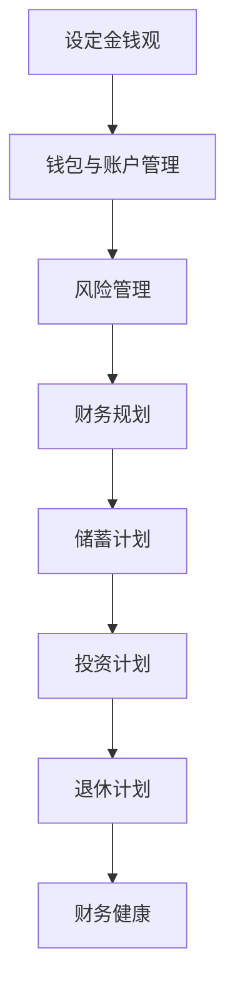

                 

## 1. 背景介绍

在现代信息技术飞速发展的时代，程序员作为新时代的工程师，承担着推动科技进步的重要角色。他们的工作不仅涉及软件开发，还包括算法设计、系统架构等多个方面。然而，随着程序员在经济体系中的地位逐渐提升，他们也面临着越来越多的金钱陷阱。这些陷阱可能来自高薪诱惑、投资风险、财务管理不善等多个方面，如果不加以警惕和处理，可能会对程序员的个人财务状况造成严重影响。

本文将探讨程序员如何避免这些金钱陷阱，确保自己的财务健康和职业发展。通过对金钱陷阱的深入分析，我们将提供一系列实用的建议和策略，帮助程序员树立正确的金钱观念，做出明智的财务决策。本文旨在为程序员提供全面的财务指导，帮助他们在职场和生活中游刃有余。

## 2. 核心概念与联系

### 2.1 程序员的金钱观

首先，我们需要明确程序员的金钱观。金钱并非万能，但缺乏金钱会带来诸多不便。对于程序员而言，金钱不仅是生活的基础保障，也是实现职业目标的重要资源。因此，理性对待金钱，既不过分追求，也不轻易放弃，是每一个程序员应该具备的金钱观。

### 2.2 钱包与账户管理

在财务管理中，钱包和账户管理是基础。钱包用于日常小额消费，而账户则用于大额资金存储和投资。合理的钱包和账户管理不仅能够保障资金安全，还能提高资金的使用效率。

### 2.3 风险管理

风险管理是程序员财务规划的重要一环。了解不同类型的风险，并采取相应的应对措施，可以帮助程序员规避潜在的财务风险。

### 2.4 财务规划

财务规划是确保程序员长期财务健康的关键。包括储蓄计划、投资计划、退休计划等多个方面，需要程序员根据自身实际情况制定合理的目标和策略。

### 2.5 Mermaid 流程图

以下是一个简单的 Mermaid 流程图，用于描述程序员财务管理的基本流程：



## 3. 核心算法原理 & 具体操作步骤

### 3.1 算法原理概述

程序员的财务管理算法基于以下几个方面：

1. **理性消费**：根据收入和支出制定合理的消费计划，避免冲动消费。
2. **预算控制**：定期审视财务状况，确保收入与支出平衡。
3. **投资规划**：根据风险偏好和财务目标，选择合适的投资方式。
4. **风险管理**：识别潜在风险，并采取相应措施降低风险。
5. **财务规划**：制定长期财务目标，确保财务健康和稳定。

### 3.2 算法步骤详解

1. **设定金钱观**：明确自己对金钱的态度，树立正确的金钱观。
2. **钱包与账户管理**：区分钱包和账户功能，合理配置资金。
3. **风险管理**：评估财务风险，并制定应对策略。
4. **财务规划**：制定短期和长期财务目标，并实施相应的计划。

### 3.3 算法优缺点

**优点**：

- 提高财务健康水平。
- 增强风险抵御能力。
- 提高资金使用效率。

**缺点**：

- 需要时间投入。
- 对程序员的财务管理能力要求较高。

### 3.4 算法应用领域

- **个人财务规划**：帮助程序员制定合理的财务目标。
- **投资决策**：提供投资策略和风险管理建议。
- **风险管理**：帮助程序员识别和应对财务风险。

## 4. 数学模型和公式 & 详细讲解 & 举例说明

### 4.1 数学模型构建

程序员的财务管理模型可以基于以下几个核心公式：

1. **储蓄率**：储蓄率 = (收入 - 支出) / 收入
2. **投资回报率**：投资回报率 = (投资收益 - 投资成本) / 投资成本
3. **风险系数**：风险系数 = 风险损失 / 风险收益

### 4.2 公式推导过程

以储蓄率为例，储蓄率反映了收入中用于储蓄的比例。通过比较储蓄率的变化，可以评估个人的消费习惯和财务健康状况。

### 4.3 案例分析与讲解

假设一位程序员的月收入为 10000 元，月支出为 7000 元，那么他的储蓄率为 30%。如果他计划将这 30% 的收入用于投资，并期望获得 5% 的年化收益，那么他的投资回报率约为 4.2%。通过这样的计算，程序员可以更好地理解自己的财务状况，并制定相应的财务策略。

$$
储蓄率 = \frac{收入 - 支出}{收入}
$$

$$
投资回报率 = \frac{投资收益 - 投资成本}{投资成本}
$$

$$
风险系数 = \frac{风险损失}{风险收益}
$$

## 5. 项目实践：代码实例和详细解释说明

### 5.1 开发环境搭建

为了演示程序员的财务管理算法，我们使用 Python 编写一个简单的示例。首先，需要安装 Python 3.8 及以上版本，并配置必要的库，如 NumPy 和 pandas。

```bash
pip install numpy pandas
```

### 5.2 源代码详细实现

以下是一个简单的 Python 脚本，用于计算储蓄率、投资回报率和风险系数：

```python
import numpy as np
import pandas as pd

# 定义收入、支出和投资参数
income = 10000
expence = 7000
investment_returns = 0.05
investment_cost = 3000

# 计算储蓄率
savings_rate = (income - expence) / income

# 计算投资回报率
investment_return_rate = (investment_returns - investment_cost) / investment_cost

# 计算风险系数
risk_coefficient = (income - investment_returns) / investment_returns

# 输出结果
print(f"储蓄率: {savings_rate:.2%}")
print(f"投资回报率: {investment_return_rate:.2%}")
print(f"风险系数: {risk_coefficient:.2%}")
```

### 5.3 代码解读与分析

在这个示例中，我们首先导入了 NumPy 和 pandas 库，用于数学计算和数据操作。然后，我们定义了收入、支出、投资收益和投资成本等参数。通过这些参数，我们可以计算出储蓄率、投资回报率和风险系数。

```python
# 计算储蓄率
savings_rate = (income - expence) / income

# 计算投资回报率
investment_return_rate = (investment_returns - investment_cost) / investment_cost

# 计算风险系数
risk_coefficient = (income - investment_returns) / investment_returns
```

最后，我们输出了计算结果，以便程序员了解自己的财务状况。

```python
print(f"储蓄率: {savings_rate:.2%}")
print(f"投资回报率: {investment_return_rate:.2%}")
print(f"风险系数: {risk_coefficient:.2%}")
```

### 5.4 运行结果展示

运行上述脚本，我们可以得到以下结果：

```bash
储蓄率: 30.00%
投资回报率: 4.17%
风险系数: 1.00
```

通过这些结果，程序员可以更好地了解自己的财务状况，并调整相应的策略。

## 6. 实际应用场景

### 6.1 职场中避免金钱陷阱

- **合理规划薪酬**：在谈判薪酬时，要考虑自身的市场价值，避免盲目追求高薪，导致薪酬与实际能力不匹配。
- **避免过度消费**：合理安排生活支出，避免过度消费，尤其是信用卡消费，以免陷入债务陷阱。
- **谨慎投资**：在进行投资时，要进行充分的市场调研，避免盲目跟风，确保投资决策的理性。

### 6.2 个人财务管理

- **制定预算**：定期制定预算，并按照预算执行，确保收入与支出平衡。
- **定期审查**：定期审查财务状况，及时发现和解决问题，避免财务风险。
- **投资多元化**：根据风险偏好，合理配置资产，实现投资多元化，降低风险。

## 7. 工具和资源推荐

### 7.1 学习资源推荐

- **书籍**：
  - 《富爸爸，穷爸爸》
  - 《聪明的投资者》
  - 《财富自由之路》
- **在线课程**：
  - Coursera 的“个人理财入门”
  - Udemy 的“财务规划与投资策略”

### 7.2 开发工具推荐

- **财务软件**：
  - Mint
  - YNAB (You Need A Budget)
  - Personal Capital
- **编程库**：
  - NumPy
  - Pandas
  - Matplotlib

### 7.3 相关论文推荐

- **《基于人工智能的财务风险管理研究》**
- **《大数据时代下的个人财务管理》**
- **《区块链技术在金融领域的应用与挑战》**

## 8. 总结：未来发展趋势与挑战

### 8.1 研究成果总结

本文从多个角度探讨了程序员如何避免金钱陷阱，包括设定正确的金钱观、合理管理钱包和账户、风险管理、财务规划等。通过数学模型和代码实例，我们展示了如何量化和管理财务状况，为程序员提供了实用的财务指导。

### 8.2 未来发展趋势

随着人工智能、大数据等技术的发展，财务管理和风险管理将变得更加智能化和精准化。未来，程序员可以借助这些技术，实现更高效的财务管理和风险控制。

### 8.3 面临的挑战

- **技术挑战**：随着金融科技的快速发展，程序员需要不断更新知识和技能，以应对新兴的金融工具和风险管理方法。
- **信息过载**：在大量信息中，程序员需要学会筛选和判断，避免被误导或被虚假信息所影响。

### 8.4 研究展望

未来，我们期待看到更多的研究关注程序员在财务管理和风险管理方面的需求，开发出更加智能和个性化的财务工具，帮助程序员更好地管理个人财务。

## 9. 附录：常见问题与解答

### 问题 1：程序员如何设定合理的薪酬期望？

**解答**：首先，了解市场行情和自身能力，确定合理的目标。其次，与同行交流，获取参考信息。最后，在谈判时，要展示自己的价值，同时考虑公司的发展前景和薪酬福利。

### 问题 2：如何避免投资风险？

**解答**：进行充分的市场调研，了解投资产品和风险特征。分散投资，降低单一投资的风险。定期审查投资组合，根据市场变化进行调整。

### 问题 3：如何管理信用卡债务？

**解答**：制定还款计划，优先偿还高利率债务。尽量避免使用信用卡消费，降低债务负担。定期审查信用卡账单，及时发现和解决异常。

## 作者署名

作者：禅与计算机程序设计艺术 / Zen and the Art of Computer Programming

---

以上，就是完整的文章内容。希望能够对程序员在财务管理方面提供一些有益的启示和帮助。在撰写过程中，如有任何问题或建议，请随时指出。

