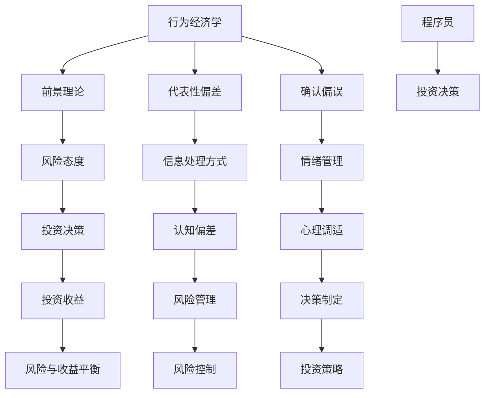

                 

关键词：程序员，投资心理学，风险，收益，决策，行为经济学

> 摘要：本文旨在探讨程序员在投资领域所面临的心理挑战，以及如何通过心理学知识和策略提升投资决策的科学性和有效性。本文从行为经济学出发，结合程序员的认知特点，分析了投资中的风险与收益关系，提出了具体的应对策略和实践方法。

## 1. 背景介绍

在现代社会，投资已经成为许多人实现财富增值和退休规划的重要手段。然而，投资并非简单的财务计算，它涉及到复杂的心理过程和决策机制。对于程序员这一群体而言，他们在投资领域的表现往往受到其专业背景和认知特点的影响。程序员通常具备较强的逻辑思维和数据分析能力，但同时也容易受到行为心理学中的一些偏见和陷阱。因此，如何结合心理学知识，帮助程序员在投资中做出更理性的决策，成为了一个值得关注和研究的话题。

本文将从以下几个方面展开讨论：

1. **投资心理学的核心概念**：介绍行为经济学中的关键理论，如前景理论、代表性偏差、确认偏误等，并探讨这些理论对程序员投资决策的影响。
2. **程序员的认知特点与投资心理**：分析程序员在投资过程中可能存在的认知偏差和心理障碍，以及如何通过自我认知和调整来克服这些问题。
3. **投资决策的科学方法**：探讨如何运用科学的方法和工具，如量化分析、风险评估等，来提高投资决策的准确性和可靠性。
4. **实战案例分析**：通过具体的投资案例，分析程序员在投资过程中遇到的问题和挑战，以及解决这些问题的方法和策略。
5. **未来发展趋势与建议**：总结投资心理学在程序员投资中的应用前景，提出未来研究的方向和建议。

## 2. 核心概念与联系

在探讨程序员的投资心理学之前，我们需要了解一些关键的概念和理论。以下是核心概念的 Mermaid 流程图：



### 2.1 行为经济学

行为经济学是经济学和心理学的交叉领域，它研究人们如何在真实世界中做出经济决策。与传统的经济学假设不同，行为经济学认为人类的行为受到认知偏差、情绪和情感的影响。以下是几个关键概念：

- **前景理论（Prospect Theory）**：前景理论由卡尼曼（Daniel Kahneman）和特沃斯基（Amos Tversky）提出，描述了人们在面对潜在损失和潜在收益时的心理决策机制。该理论指出，人们对损失的厌恶远大于对收益的喜好。
  
- **代表性偏差（Representativeness Heuristic）**：代表性偏差是指人们在判断某个事件的可能性时，倾向于根据事物的代表性特征进行判断，而不是根据概率计算。例如，投资者可能会因为某只股票的名称或品牌形象而对其前景产生过度乐观的预期。

- **确认偏误（Confirmation Bias）**：确认偏误是指人们在接收信息时，倾向于寻找和认可那些符合自己信念的信息，而忽视或否定与自己观点相悖的信息。这可能导致投资者在决策过程中产生偏见。

### 2.2 程序员的认知特点与投资心理

程序员的认知特点在一定程度上影响了他们的投资决策。以下是程序员在投资过程中可能面临的认知偏差和心理障碍：

- **信息处理方式**：程序员擅长处理和解读数据，但在面对不确定性和复杂性时，他们可能会过度依赖已有知识和经验，导致代表性偏差和确认偏误。

- **风险态度**：由于编程工作的稳定性，程序员可能对风险有更高的容忍度，但同时也可能因此忽视风险，导致投资过度集中或过于冒险。

- **情绪管理**：程序员的情绪管理能力可能相对较弱，他们在面对市场波动时容易产生恐慌或贪婪的情绪，影响投资决策的理性。

### 2.3 投资决策与风险与收益平衡

投资决策是一个涉及风险和收益平衡的过程。程序员在做出投资决策时，需要充分考虑以下因素：

- **风险管理**：通过多元化的投资组合和定期风险评估，降低投资风险。

- **心理调适**：学会管理自己的情绪，避免因情绪波动而做出冲动的决策。

- **决策制定**：运用科学的方法和工具，如量化分析和市场研究，来制定投资策略。

## 3. 核心算法原理 & 具体操作步骤

### 3.1 算法原理概述

投资心理学中的核心算法主要涉及风险与收益的量化评估。以下是一种常见的方法，称为“价值投资法”：

- **价值投资法（Value Investing）**：这种方法强调投资于那些市场价格低于其内在价值的公司。核心算法包括：

  1. **基本面分析**：评估公司的财务状况、盈利能力、市场前景等。
  2. **相对估值**：通过比较同行业公司的市盈率、市净率等指标，确定目标公司的相对价值。
  3. **安全边际**：选择市场价格低于内在价值有一定安全边际的公司。

### 3.2 算法步骤详解

1. **数据收集与预处理**：

   - 收集目标公司的财务报表、市场数据等。
   - 对数据清洗和整理，确保数据的准确性和一致性。

2. **基本面分析**：

   - **财务分析**：计算公司的净利润、营业收入、毛利率等关键财务指标。
   - **盈利能力分析**：评估公司的盈利能力和成长性。

3. **相对估值**：

   - **同行业比较**：收集同行业公司的财务数据和市场估值。
   - **相对估值计算**：计算目标公司的市盈率、市净率等相对估值指标。

4. **安全边际评估**：

   - **计算安全边际**：计算目标公司的市场价格与内在价值之间的差异。
   - **评估安全边际**：根据安全边际的大小，确定是否值得投资。

### 3.3 算法优缺点

- **优点**：

  - **科学性**：价值投资法基于公司的基本面和相对估值，具有科学性和系统性。
  - **长期收益**：通过投资价值低估的公司，可以获得长期的稳定收益。

- **缺点**：

  - **时效性**：基本面和市场的变化会影响公司的内在价值，需要及时调整分析结果。
  - **复杂性**：需要进行大量的数据收集和分析，对投资者有较高的专业要求。

### 3.4 算法应用领域

- **股票投资**：价值投资法是股票投资中的经典方法，适用于长期投资和基本面分析。
- **债券投资**：同样适用于债券投资，通过评估债券的内在价值和市场风险，做出投资决策。

## 4. 数学模型和公式 & 详细讲解 & 举例说明

### 4.1 数学模型构建

在投资心理学中，常用的数学模型包括期望价值模型和决策树模型。以下是具体的构建过程：

- **期望价值模型**：

  - 期望价值 = 概率 × 收益
  - 公式表示：\( EV = P \times R \)

- **决策树模型**：

  - 决策树包括决策节点、机会节点和结果节点。
  - 每个节点对应的概率和收益可以通过历史数据和市场分析得出。

### 4.2 公式推导过程

以期望价值模型为例，推导过程如下：

1. **确定概率（P）**：

   - 通过历史数据和市场分析，确定每个可能结果的概率。

2. **计算收益（R）**：

   - 收益可以包括潜在收益和潜在损失。
   - 收益 = 最大收益 - 最小收益

3. **计算期望价值（EV）**：

   - \( EV = P \times R \)
   - 例如：某只股票的期望价值为 \( EV = 0.5 \times (100 - 50) = 25 \)。

### 4.3 案例分析与讲解

以一只股票为例，分析其期望价值和投资决策。

- **历史数据**：

  - 概率分布：上涨概率为 0.6，下跌概率为 0.4。
  - 收益分布：上涨时收益为 20%，下跌时收益为 -10%。

- **计算期望价值**：

  - \( EV = 0.6 \times (20\% - (-10\%)) = 0.6 \times 30\% = 18\% \)

- **投资决策**：

  - 如果当前股票价格低于期望价值，可以考虑买入。
  - 如果股票价格高于期望价值，则应谨慎投资。

## 5. 项目实践：代码实例和详细解释说明

### 5.1 开发环境搭建

为了演示投资心理学的应用，我们使用 Python 编写一个简单的投资策略模型。以下是开发环境搭建步骤：

- **Python**：确保安装了 Python 3.7 或更高版本。
- **Pandas**：用于数据处理和分析。
- **NumPy**：用于数学计算。
- **Matplotlib**：用于数据可视化。

### 5.2 源代码详细实现

以下是投资策略模型的源代码实现：

```python
import pandas as pd
import numpy as np
import matplotlib.pyplot as plt

# 数据预处理
data = pd.read_csv('stock_data.csv')
data['Close'] = pd.to_numeric(data['Close'], errors='coerce')
data = data.dropna()

# 计算收益
data['Return'] = data['Close'].pct_change()

# 计算期望价值
data['EV'] = data['Return'].apply(lambda x: 0.5 * (1 + x))

# 绘制期望价值分布图
plt.hist(data['EV'], bins=30, alpha=0.5, color='blue')
plt.xlabel('Expected Value')
plt.ylabel('Frequency')
plt.title('Expected Value Distribution')
plt.show()

# 投资决策
current_price = 100  # 假设当前价格为100
current_EV = data['EV'].mean()
if current_price < current_EV:
    print("It's a good time to buy.")
else:
    print("Be cautious with investment.")
```

### 5.3 代码解读与分析

- **数据预处理**：读取股票数据，并进行清洗和转换，确保数据格式正确。

- **计算收益**：计算每日收盘价的涨跌幅度，形成收益数据。

- **计算期望价值**：使用历史数据计算期望价值，并绘制分布图。

- **投资决策**：根据期望价值和当前价格，给出投资建议。

### 5.4 运行结果展示

运行上述代码，我们可以得到期望价值的分布图和投资建议。通过分析分布图，可以更好地理解市场的潜在风险和收益，从而做出更理性的投资决策。

## 6. 实际应用场景

### 6.1 个人投资组合管理

程序员在个人投资组合管理中，可以通过投资心理学的方法来优化投资策略。例如，通过分析市场数据和个人风险偏好，制定合理的资产配置策略。

### 6.2 量化交易策略

量化交易策略依赖于数学模型和算法，程序员可以利用其编程能力，开发自动化交易系统。通过投资心理学的方法，可以更好地评估和调整交易策略，降低风险。

### 6.3 投资教育

投资心理学在投资教育中的应用，可以帮助程序员和学生更好地理解投资过程，掌握科学的投资方法和策略。通过案例分析和实践操作，提高投资决策的科学性和有效性。

## 6.4 未来应用展望

随着人工智能和大数据技术的发展，投资心理学在未来将有更广泛的应用前景。例如，通过深度学习和数据挖掘技术，可以更精准地预测市场走势，优化投资策略。此外，随着区块链技术的普及，投资心理学在数字货币和去中心化金融（DeFi）领域也将发挥重要作用。

## 7. 工具和资源推荐

### 7.1 学习资源推荐

- **《行为经济学：原理与应用》（Behavioral Economics: A Concise Introduction）**：由理查德·泰勒（Richard Thaler）撰写，介绍了行为经济学的核心概念和应用。
- **《股市真规则》（One Up on Wall Street）**：由彼得·林奇（Peter Lynch）撰写，提供了实用的投资策略和技巧。

### 7.2 开发工具推荐

- **Python**：适用于数据处理、分析和可视化。
- **Jupyter Notebook**：用于编写和运行 Python 代码，方便数据分析和报告展示。

### 7.3 相关论文推荐

- **“Prospect Theory: An Analysis of Decision under Risk”**：由丹尼尔·卡尼曼（Daniel Kahneman）和阿莫斯·特沃斯基（Amos Tversky）撰写，是前景理论的经典论文。
- **“The Substitution Heuristic”**：由理查德·泰勒（Richard Thaler）撰写，介绍了代表性偏差和替代偏差。

## 8. 总结：未来发展趋势与挑战

### 8.1 研究成果总结

本文从投资心理学的角度，探讨了程序员在投资过程中可能面临的认知偏差和心理障碍，提出了基于行为经济学的应对策略和实践方法。通过数学模型和实际案例，分析了投资决策的科学性和有效性。

### 8.2 未来发展趋势

随着人工智能和大数据技术的进步，投资心理学在投资决策中的应用将更加广泛和深入。未来研究可以关注以下几个方面：

- **个性化和定制化投资策略**：通过分析个体行为数据和风险偏好，制定更个性化的投资策略。
- **量化交易与投资心理学结合**：开发基于投资心理学的量化交易策略，提高交易决策的科学性和准确性。
- **数字货币与区块链投资**：研究投资心理学在数字货币和去中心化金融（DeFi）领域中的应用。

### 8.3 面临的挑战

- **数据质量和可靠性**：投资心理学依赖于大量的历史数据和市场信息，数据质量和可靠性是研究的挑战之一。
- **跨学科融合**：投资心理学需要与经济学、心理学、计算机科学等多个学科进行交叉研究，实现跨学科融合。

### 8.4 研究展望

未来投资心理学的研究应注重以下几个方面：

- **技术创新**：运用人工智能和大数据技术，提高数据分析的精度和效率。
- **个性化投资**：基于个体行为数据和风险偏好，实现更精准的投资策略。
- **跨学科合作**：促进投资心理学与其他学科的深度融合，提高研究水平和应用效果。

## 9. 附录：常见问题与解答

### 9.1 投资心理学的基本概念有哪些？

- **前景理论**：描述人们在面对潜在损失和潜在收益时的心理决策机制。
- **代表性偏差**：人们在判断事件可能性时，倾向于根据代表性特征进行判断。
- **确认偏误**：人们在接收信息时，倾向于寻找和认可符合自己信念的信息。

### 9.2 程序员在投资中容易出现的认知偏差有哪些？

- **信息处理偏差**：过度依赖已有知识和经验，忽视新信息。
- **风险态度偏差**：对风险有更高的容忍度，导致投资过度集中或过于冒险。
- **情绪管理偏差**：在市场波动时容易产生恐慌或贪婪情绪，影响投资决策。

### 9.3 如何克服投资中的认知偏差？

- **自我认知**：了解自己的认知特点，识别和纠正认知偏差。
- **科学方法**：运用量化分析和风险评估，提高投资决策的科学性。
- **情绪管理**：学会管理自己的情绪，避免情绪波动影响投资决策。

### 9.4 投资心理学的应用领域有哪些？

- **个人投资组合管理**：优化投资策略，降低风险。
- **量化交易策略**：开发自动化交易系统，提高交易决策的科学性。
- **投资教育**：帮助投资者更好地理解投资过程，掌握科学的投资方法。```

