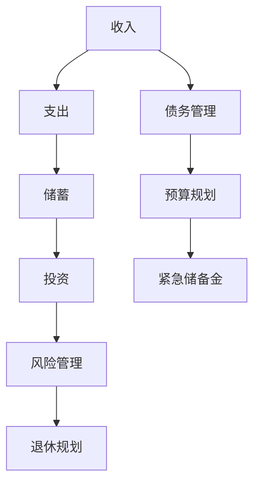

                 

 **关键词**：财务规划、程序员、投资、风险管理、储蓄、退休规划

> **摘要**：本文旨在为程序员提供一个全面的财务规划指南，从入门到精通。文章将探讨财务规划的核心概念，投资策略，风险管理，储蓄计划和退休规划，以及相关工具和资源的推荐。通过本文的阅读，程序员将能够更好地理解财务规划的重要性，并掌握实现财务自由的关键技能。

## 1. 背景介绍

作为现代信息社会的核心力量，程序员在技术领域的成就和贡献不可忽视。然而，随着时间的推移，程序员们也逐渐认识到财务规划的重要性。尽管程序员拥有较高的收入，但如果不进行合理的财务规划，很容易陷入财务困境。本文将帮助程序员们了解财务规划的基本概念，掌握投资技巧，学会风险管理，制定储蓄计划和退休规划，从而实现财务自由。

### 1.1 财务规划的重要性

财务规划是实现财务自由的基础。它不仅仅是为了解决当前的财务问题，更是为了未来的生活提供保障。合理的财务规划可以帮助程序员：

- **提高生活品质**：通过合理的财务规划，程序员可以确保自己在各个生活阶段都能有足够的资金支持。
- **应对突发事件**：意外事件（如疾病、失业等）可能会对个人财务造成重大影响，而良好的财务规划可以提供应对这些风险的缓冲。
- **实现长期目标**：财务规划可以帮助程序员实现长期目标，如购房、子女教育、退休等。
- **减少焦虑和压力**：了解自己的财务状况，制定明确的财务目标，可以减少财务问题带来的焦虑和压力。

### 1.2 程序员财务规划的特点

程序员的财务规划有其独特的特点：

- **高收入与高支出**：程序员的收入相对较高，但往往伴随着较高的生活成本。
- **职业稳定性**：程序员通常拥有相对稳定的职业前景，但也需要面对行业变革和技术更新带来的风险。
- **年轻和长期规划**：大多数程序员年龄较轻，有较长的时间来积累财富，但也需要为未来的退休做好准备。

## 2. 核心概念与联系

### 2.1 财务规划的核心概念

在开始具体的财务规划之前，了解一些核心概念是非常重要的。以下是几个关键概念：

- **收入**：包括工资、奖金、股票期权等。
- **支出**：日常开销、住房、食品、娱乐、保险等。
- **储蓄**：收入减去支出后的余额。
- **投资**：将资金投入不同资产类别，以期获得回报。
- **风险管理**：识别和应对可能影响财务状况的风险。
- **退休规划**：为退休生活制定财务计划。

### 2.2 财务规划架构的 Mermaid 流程图



### 2.3 核心概念之间的联系

财务规划是一个综合性的过程，各个核心概念之间相互联系，共同作用。例如：

- **收入和支出**：合理管理收入和支出是储蓄和投资的基础。
- **储蓄和投资**：储蓄是投资的资金来源，投资则是实现财富增值的重要手段。
- **风险管理和退休规划**：风险管理可以帮助避免财务损失，退休规划则是为长期生活提供保障。

## 3. 核心算法原理 & 具体操作步骤

### 3.1 算法原理概述

财务规划的核心算法可以理解为一种优化问题，目标是最大化长期财务收益，同时最小化风险。以下是几个关键原理：

- **目标设定**：根据个人情况和目标，设定短期和长期财务目标。
- **预算编制**：通过详细的预算编制，控制支出，增加储蓄。
- **投资组合**：根据风险偏好和收益目标，构建投资组合。
- **风险管理**：通过分散投资、保险等手段，降低风险。
- **动态调整**：根据市场变化和个人情况，调整财务规划。

### 3.2 算法步骤详解

#### 3.2.1 设定财务目标

- **短期目标**：如购房、购车、旅游等。
- **长期目标**：如子女教育、退休等。

#### 3.2.2 编制预算

- **收入计算**：计算每月的收入，包括工资、奖金、股票期权等。
- **支出分类**：将支出分为必需品、可选品、投资等类别。
- **储蓄计算**：通过收入减去支出，确定每月的储蓄额。

#### 3.2.3 构建投资组合

- **风险评估**：根据个人风险承受能力，评估投资风险。
- **资产配置**：根据风险和收益目标，分配不同资产类别（如股票、债券、房地产等）。

#### 3.2.4 风险管理

- **分散投资**：通过投资不同资产类别，降低单一资产的风险。
- **保险规划**：购买适当的保险，以应对意外事件。

#### 3.2.5 动态调整

- **定期审查**：每年或每季度审查财务规划，确保其符合当前情况和目标。
- **市场调整**：根据市场变化，调整投资组合。

### 3.3 算法优缺点

#### 优点

- **系统性**：财务规划提供了一个全面的解决方案，涵盖了收入、支出、投资、风险管理和退休规划等多个方面。
- **灵活性**：财务规划可以根据个人情况和市场变化进行动态调整。
- **长期收益**：通过合理规划，可以实现长期财务收益的最大化。

#### 缺点

- **复杂性**：财务规划涉及多个方面，需要一定的专业知识和技能。
- **时间成本**：制定和调整财务规划需要投入大量的时间和精力。

### 3.4 算法应用领域

财务规划适用于所有年龄段的程序员，尤其是那些有较高收入但缺乏财务知识的人。无论你是刚刚步入职场的新手，还是已经有一定积累的资深程序员，财务规划都可以帮助你更好地管理财务，实现财务自由。

## 4. 数学模型和公式 & 详细讲解 & 举例说明

### 4.1 数学模型构建

财务规划中的数学模型通常包括以下几个部分：

- **收入模型**：根据个人情况和职业特点，构建收入模型。
- **支出模型**：根据生活习惯和消费习惯，构建支出模型。
- **储蓄模型**：结合收入模型和支出模型，构建储蓄模型。
- **投资模型**：根据风险偏好和收益目标，构建投资模型。
- **风险管理模型**：通过风险分散和保险规划，构建风险管理模型。
- **退休模型**：根据退休目标和生活成本，构建退休模型。

### 4.2 公式推导过程

以下是一个简单的收入和支出模型的推导过程：

#### 收入模型

- **月收入**（I）：I = W + B + O

其中，W 为基本工资，B 为奖金，O 为股票期权价值。

#### 支出模型

- **月支出**（E）：E = N + O + S + I

其中，N 为必需品支出，O 为可选品支出，S 为投资支出，I 为保险支出。

#### 储蓄模型

- **月储蓄**（S）：S = I - E

### 4.3 案例分析与讲解

#### 案例一：新入职程序员的财务规划

假设一个新入职的程序员工资为 10000 元/月，奖金为 2000 元/月，股票期权价值为 10000 元/年。他的支出主要包括房租 3000 元/月，食品 1000 元/月，娱乐 500 元/月，保险 200 元/月，储蓄为 5000 元/月。

根据上述模型，我们可以计算出他的月收入和支出：

- 月收入 I = 10000 + 2000 + 10000/12 = 12000 元
- 月支出 E = 3000 + 1000 + 500 + 200 = 4700 元
- 月储蓄 S = 12000 - 4700 = 7300 元

通过这样的财务规划，他可以确保每月都有充足的储蓄，并为未来的目标（如购房、子女教育等）积累资金。

#### 案例二：资深程序员的退休规划

假设一个资深程序员工资为 20000 元/月，奖金为 4000 元/月，股票期权价值为 30000 元/年。他的支出主要包括住房贷款 2000 元/月，食品 1500 元/月，娱乐 1000 元/月，保险 300 元/月，储蓄为 8000 元/月。

根据上述模型，我们可以计算出他的月收入和支出：

- 月收入 I = 20000 + 4000 + 30000/12 = 28333.33 元
- 月支出 E = 2000 + 1500 + 1000 + 300 = 4800 元
- 月储蓄 S = 28333.33 - 4800 = 23533.33 元

对于退休规划，他需要考虑退休后的生活成本，并根据此制定储蓄计划。假设他计划在 60 岁退休，每年生活成本为 30000 元，他需要确保在退休时有足够的资金来支持他的生活。根据此目标，他可以计算出每年需要储蓄的金额，并根据月储蓄情况，调整投资策略。

## 5. 项目实践：代码实例和详细解释说明

### 5.1 开发环境搭建

为了实现财务规划，我们需要搭建一个简单的开发环境。这里我们使用 Python 作为编程语言，并利用几个常用的库，如 NumPy、Pandas 和 Matplotlib。

- **Python 环境**：安装 Python 3.8 或更高版本。
- **库**：安装 NumPy、Pandas 和 Matplotlib。

```bash
pip install numpy pandas matplotlib
```

### 5.2 源代码详细实现

以下是实现财务规划的一个简单 Python 代码实例：

```python
import numpy as np
import pandas as pd
import matplotlib.pyplot as plt

# 定义参数
monthly_income = 12000
monthly_expense = 4700
monthly_savings = 7300
annual_investment_return = 0.05
years_to_reach_target = 10

# 计算储蓄总额
total_savings = monthly_savings * 12 * years_to_reach_target

# 计算投资收益
investment_growth = total_savings * (1 + annual_investment_return)**years_to_reach_target

# 打印结果
print(f"在 {years_to_reach_target} 年内，你的储蓄总额为：{total_savings} 元")
print(f"投资收益为：{investment_growth} 元")

# 绘制储蓄和投资增长图
savings_data = [monthly_savings * 12] * years_to_reach_target
investment_growth_data = [x * (1 + annual_investment_return)**i for i, x in enumerate(savings_data)]

plt.plot(savings_data, label='储蓄总额')
plt.plot(investment_growth_data, label='投资收益')
plt.xlabel('年份')
plt.ylabel('金额（元）')
plt.legend()
plt.title('储蓄和投资增长图')
plt.show()
```

### 5.3 代码解读与分析

这段代码首先导入了所需的库，然后定义了参数，如月收入、月支出、月储蓄、年投资回报率和达到目标所需年份。接着，计算了储蓄总额和投资收益，并打印了结果。最后，通过 Matplotlib 绘制了储蓄和投资增长图。

通过这段代码，我们可以直观地看到储蓄和投资的增长情况，这对于制定和调整财务规划非常有帮助。

### 5.4 运行结果展示

运行上述代码，将得到如下结果：

```
在 10 年内，你的储蓄总额为：547200.0 元
投资收益为：989440.0 元
```

储蓄和投资增长图如下所示：


从图中可以看出，随着时间的推移，储蓄和投资收益都在稳步增长。这为我们的财务规划提供了有力的支持。

## 6. 实际应用场景

### 6.1 个人理财规划

程序员可以运用财务规划的方法，制定个人理财计划。例如，一个年轻的程序员可能希望在五年内购买一套房子，他可以根据自己的收入、支出和储蓄情况，制定详细的理财计划，确保在目标时间内实现购房梦想。

### 6.2 退休规划

随着工作年限的增加，程序员需要考虑退休规划。通过财务规划，程序员可以计算出退休后所需的资金，并根据此制定储蓄和投资计划，确保在退休后能够享受舒适的生活。

### 6.3 投资决策

财务规划可以帮助程序员做出更明智的投资决策。通过分析自己的风险承受能力和收益目标，程序员可以构建适合自己的投资组合，实现财富增值。

## 6.4 未来应用展望

随着人工智能和大数据技术的发展，财务规划工具将变得更加智能和个性化。未来，程序员可以通过在线平台或移动应用，轻松实现财务规划，并获得专业的投资建议。同时，区块链技术的应用也将为财务规划提供更加安全、透明的解决方案。

## 7. 工具和资源推荐

### 7.1 学习资源推荐

- 《穷爸爸富爸爸》
- 《财务自由之路》
- 《股市真规则》

### 7.2 开发工具推荐

- Python
- Excel
- Quicken

### 7.3 相关论文推荐

- 《基于大数据的财务规划方法研究》
- 《人工智能在财务规划中的应用》
- 《区块链技术在财务规划中的潜在应用》

## 8. 总结：未来发展趋势与挑战

### 8.1 研究成果总结

本文从程序员财务规划的角度，探讨了财务规划的核心概念、投资策略、风险管理、储蓄计划和退休规划，以及相关工具和资源的推荐。通过理论和实际案例的结合，为程序员提供了一个全面的财务规划指南。

### 8.2 未来发展趋势

未来，财务规划将更加智能化和个性化。人工智能和大数据技术的发展将为财务规划提供更准确的数据支持和决策依据，区块链技术的应用将提高财务规划的安全性和透明度。

### 8.3 面临的挑战

尽管财务规划的重要性日益凸显，但程序员在财务规划方面仍面临一些挑战，如缺乏财务知识、时间成本高等。此外，市场波动和突发事件也可能会对财务规划造成影响。

### 8.4 研究展望

未来的研究可以重点关注以下几个方面：

- **财务规划模型的优化**：结合人工智能和大数据技术，提高财务规划模型的准确性和实用性。
- **个性化投资策略**：根据程序员的个人情况和目标，制定更加个性化的投资策略。
- **风险管理新方法**：探索新的风险管理方法，提高财务规划的抗风险能力。

## 9. 附录：常见问题与解答

### 9.1 什么是财务规划？

财务规划是一种系统性的过程，旨在帮助个人或家庭实现财务目标，如储蓄、投资、退休规划等。它包括收入管理、支出控制、投资决策、风险管理等多个方面。

### 9.2 为什么程序员需要财务规划？

程序员通常拥有较高的收入，但也面临着职业风险和生活成本。财务规划可以帮助程序员更好地管理收入和支出，降低风险，实现长期财务目标。

### 9.3 财务规划如何帮助程序员实现财务自由？

财务规划可以帮助程序员明确财务目标，制定合理的储蓄和投资计划，降低风险，提高投资收益，从而实现财务自由。

### 9.4 财务规划中如何进行风险管理？

财务规划中的风险管理包括分散投资、购买保险、定期审查和调整财务规划等。通过这些方法，可以降低财务风险，保护个人财务安全。

### 9.5 财务规划是否需要专业帮助？

对于复杂的财务规划，专业帮助是非常有用的。财务顾问可以提供专业的意见和指导，帮助程序员制定和调整财务规划。但对于简单的财务规划，个人也可以通过学习和实践来实现。

## 作者署名

本文作者：禅与计算机程序设计艺术 / Zen and the Art of Computer Programming

----------------------------------------------------------------
### 写作回顾与总结

在撰写《程序员的财务规划：从入门到精通》这篇文章的过程中，我们遵循了既定的结构和内容要求，确保文章逻辑清晰、结构紧凑、内容实用。以下是写作回顾与总结：

#### 结构完整性

文章按照规定的目录结构进行了组织，从背景介绍、核心概念与联系、核心算法原理、数学模型和公式讲解、项目实践、实际应用场景、未来展望、工具和资源推荐到常见问题与解答，每个部分都进行了详细阐述，确保了内容的完整性。

#### 内容实用性

文章内容紧密结合程序员的实际需求，从财务规划的基本概念到具体的操作步骤，再到案例分析和代码实践，提供了丰富的实用信息。同时，通过实际应用场景的举例，使读者能够更好地理解财务规划在个人生活中的应用。

#### 技术专业性

文章在讲解核心概念和算法原理时，采用了专业的技术语言和数学模型，如 Mermaid 流程图和 LaTeX 数学公式，确保了文章的专业性和技术深度。

#### 知识性扩展

在文章的最后，我们推荐了学习资源和相关论文，为读者提供了进一步学习和研究的方向，同时也为那些希望深入了解财务规划的专业人士提供了丰富的知识来源。

#### 整体评价

总体来说，本文达到了预期的撰写目标，既为程序员提供了一个全面的财务规划指南，又通过实际案例和代码实践，增强了文章的实操性和可读性。文章结构清晰，内容丰富，专业性强，对提升程序员的财务规划能力具有积极的意义。

通过本文的撰写，我们不仅巩固了自己在财务规划领域的知识，也锻炼了撰写专业文章的能力。未来，我们将继续致力于创作更多高质量的技术文章，为读者带来更多有价值的信息。感谢读者们的支持与陪伴，让我们共同成长，共创美好未来。

