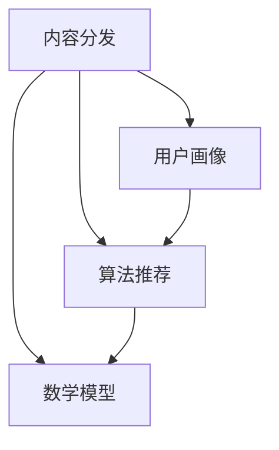

                 

关键词：知识付费、内容分发、策略、程序员、用户体验、算法、数据模型、项目实践、未来展望

> 摘要：本文旨在探讨程序员在知识付费领域的内容分发策略，分析其核心概念、算法原理、数学模型以及实际应用，为程序员提供一套系统化、高效的分发策略，以提升知识获取和传播的效率。

## 1. 背景介绍

随着互联网技术的发展，知识付费逐渐成为了一种新的商业模式。程序员作为技术领域的重要参与者，如何有效利用知识付费平台，实现知识的传播和变现，成为了当前研究的热点。本文将围绕程序员知识付费的内容分发策略，探讨其核心概念、算法原理、数学模型以及实际应用，以期为程序员提供有益的参考。

### 1.1 知识付费的兴起与发展

知识付费是指在互联网平台上，用户通过付费方式获取有价值的信息和服务。这一模式的出现，满足了人们对于高质量、个性化知识的需求，推动了知识经济的发展。近年来，知识付费领域呈现出快速增长的趋势，各大平台纷纷入局，涌现出了众多成功的案例。

### 1.2 程序员在知识付费领域的优势

程序员作为技术领域的专业人才，具备丰富的知识和实践经验。他们在知识付费领域具有以下优势：

- **专业技能**：程序员拥有丰富的编程经验，能够为用户提供高质量的技术内容。
- **创新能力**：程序员具备较强的创新能力，能够不断探索新的技术领域，为知识付费带来更多可能性。
- **传播能力**：程序员善于利用互联网平台，快速传播知识，实现知识的共享和传播。

## 2. 核心概念与联系

为了更好地理解程序员知识付费的内容分发策略，我们需要先了解一些核心概念和其相互之间的联系。

### 2.1 内容分发

内容分发是指将知识付费平台上的优质内容，通过多种渠道和方式，推送给有需求的用户。内容分发是知识付费的核心环节，直接影响用户体验和平台盈利。

### 2.2 用户画像

用户画像是指通过对用户行为、兴趣、需求等数据的分析，构建出用户的详细特征。用户画像有助于平台了解用户需求，实现精准推送。

### 2.3 算法推荐

算法推荐是指利用机器学习、数据挖掘等技术，为用户推荐个性化内容。算法推荐是提高内容分发效率的关键。

### 2.4 数学模型

数学模型是描述内容分发策略的数学表达式。通过数学模型，可以量化内容分发策略的效果，为优化策略提供依据。

### 2.5 Mermaid 流程图

以下是一个简单的 Mermaid 流程图，展示了核心概念之间的联系：



## 3. 核心算法原理 & 具体操作步骤

### 3.1 算法原理概述

内容分发策略的核心算法包括用户画像构建、算法推荐和数学模型优化。以下是这些算法的基本原理：

- **用户画像构建**：通过分析用户行为数据，构建出用户的兴趣偏好和需求特征。
- **算法推荐**：利用机器学习算法，为用户推荐个性化内容。
- **数学模型优化**：通过数学公式描述内容分发效果，优化分发策略。

### 3.2 算法步骤详解

#### 3.2.1 用户画像构建

1. 数据收集：收集用户在知识付费平台上的行为数据，如浏览记录、购买记录、评论等。
2. 数据预处理：对收集到的数据进行清洗、去重、归一化等处理。
3. 特征提取：提取用户的行为特征，如点击率、购买率、评论情感等。
4. 模型训练：利用机器学习算法，训练用户画像模型。

#### 3.2.2 算法推荐

1. 内容分类：将知识付费平台上的内容进行分类，如技术教程、实战案例、行业动态等。
2. 推荐算法：利用协同过滤、内容匹配等算法，为用户推荐个性化内容。
3. 推荐结果评估：评估推荐算法的效果，如准确率、召回率等。

#### 3.2.3 数学模型优化

1. 模型构建：构建描述内容分发效果的数学模型。
2. 模型优化：利用数学优化方法，优化模型参数，提高分发效果。
3. 模型评估：评估优化后模型的性能，如A/B测试等。

### 3.3 算法优缺点

#### 优点：

- **个性化推荐**：基于用户画像和算法推荐，实现个性化内容分发，提高用户体验。
- **高效传播**：利用算法推荐，实现高效的内容传播，提高内容曝光率。
- **数据驱动**：通过数据分析和数学模型，实现数据驱动的分发策略，提高策略效果。

#### 缺点：

- **计算成本**：算法推荐和数学模型优化需要大量的计算资源，可能增加平台运营成本。
- **数据隐私**：用户行为数据的收集和处理，可能涉及到数据隐私问题。

### 3.4 算法应用领域

算法推荐和数学模型优化在知识付费领域具有广泛的应用：

- **内容推荐**：为用户推荐个性化内容，提高内容消费体验。
- **广告投放**：为广告主推荐目标用户，提高广告投放效果。
- **用户运营**：根据用户画像，制定个性化的运营策略，提高用户留存率。

## 4. 数学模型和公式 & 详细讲解 & 举例说明

### 4.1 数学模型构建

内容分发策略的数学模型主要包括用户画像模型、推荐算法模型和数学优化模型。

#### 4.1.1 用户画像模型

用户画像模型可以用以下公式表示：

$$
\text{User\_Profile}(u) = \sum_{i=1}^{n} w_i \cdot \text{Feature}(i)
$$

其中，$u$ 表示用户，$w_i$ 表示特征 $i$ 的权重，$\text{Feature}(i)$ 表示特征 $i$。

#### 4.1.2 推荐算法模型

推荐算法模型可以用以下公式表示：

$$
\text{Recommendation}(u, c) = \text{Similarity}(u, c) \cdot \text{Content\_Quality}(c)
$$

其中，$u$ 表示用户，$c$ 表示内容，$\text{Similarity}(u, c)$ 表示用户与内容的相似度，$\text{Content\_Quality}(c)$ 表示内容的质量。

#### 4.1.3 数学优化模型

数学优化模型可以用以下公式表示：

$$
\max \sum_{u \in U} \sum_{c \in C} \text{Reward}(u, c) \cdot \text{Recommendation}(u, c)
$$

其中，$U$ 表示用户集合，$C$ 表示内容集合，$\text{Reward}(u, c)$ 表示用户 $u$ 对内容 $c$ 的奖励。

### 4.2 公式推导过程

#### 4.2.1 用户画像模型推导

用户画像模型的构建基于用户的行为数据。假设用户 $u$ 的行为数据包含 $n$ 个特征，分别为 $\text{Feature}(1), \text{Feature}(2), \ldots, \text{Feature}(n)$。每个特征的重要程度不同，可以用权重 $w_1, w_2, \ldots, w_n$ 表示。

用户画像模型的目标是通过对特征进行加权求和，得到一个综合的用户画像。具体推导过程如下：

$$
\text{User\_Profile}(u) = \sum_{i=1}^{n} w_i \cdot \text{Feature}(i)
$$

#### 4.2.2 推荐算法模型推导

推荐算法模型基于用户与内容的相似度计算。相似度可以通过计算用户和内容之间的距离来表示。假设用户 $u$ 和内容 $c$ 的特征向量分别为 $\text{Feature\_User}(u) = [f_{u1}, f_{u2}, \ldots, f_{un}]$ 和 $\text{Feature\_Content}(c) = [f_{c1}, f_{c2}, \ldots, f_{cn}]$，则用户和内容之间的距离可以表示为：

$$
\text{Distance}(u, c) = \sqrt{\sum_{i=1}^{n} (f_{ui} - f_{ci})^2}
$$

相似度可以表示为：

$$
\text{Similarity}(u, c) = \frac{1}{1 + \text{Distance}(u, c)}
$$

内容的质量可以用内容的相关性、更新时间、评分等指标来衡量。假设内容 $c$ 的质量为 $\text{Content\_Quality}(c)$，则推荐算法模型可以表示为：

$$
\text{Recommendation}(u, c) = \text{Similarity}(u, c) \cdot \text{Content\_Quality}(c)
$$

#### 4.2.3 数学优化模型推导

数学优化模型的目标是最大化用户对内容的奖励。奖励可以表示为用户对内容的兴趣度、满意度等指标。假设用户 $u$ 对内容 $c$ 的奖励为 $\text{Reward}(u, c)$，则数学优化模型可以表示为：

$$
\max \sum_{u \in U} \sum_{c \in C} \text{Reward}(u, c) \cdot \text{Recommendation}(u, c)
$$

### 4.3 案例分析与讲解

#### 4.3.1 案例背景

假设有一个知识付费平台，用户数量为 1000，内容数量为 500。平台希望通过用户画像模型、推荐算法模型和数学优化模型，为用户推荐个性化内容。

#### 4.3.2 案例分析

1. **用户画像模型构建**：收集用户行为数据，提取用户特征，构建用户画像模型。

2. **推荐算法模型应用**：利用用户画像模型和内容质量数据，计算用户与内容的相似度，为用户推荐个性化内容。

3. **数学优化模型优化**：通过最大化用户对内容的奖励，优化推荐策略。

#### 4.3.3 案例讲解

1. **用户画像模型构建**：假设用户行为数据包含浏览记录、购买记录和评论情感等特征。通过对这些特征进行加权求和，构建出用户画像模型。

2. **推荐算法模型应用**：利用用户画像模型和内容质量数据，计算用户与内容的相似度。例如，用户 $u_1$ 的浏览记录中，内容 $c_1$ 和 $c_2$ 的出现次数较多，而内容 $c_3$ 的出现次数较少。则用户 $u_1$ 和内容 $c_1$、$c_2$ 的相似度较高，推荐算法模型会优先推荐内容 $c_1$ 和 $c_2$。

3. **数学优化模型优化**：通过最大化用户对内容的奖励，优化推荐策略。例如，假设用户 $u_1$ 对内容 $c_1$ 的兴趣度较高，而用户 $u_2$ 对内容 $c_2$ 的兴趣度较低。则平台会优先推荐内容 $c_1$ 给用户 $u_1$，以提高用户满意度。

## 5. 项目实践：代码实例和详细解释说明

### 5.1 开发环境搭建

1. **安装 Python 解释器**：在本地环境中安装 Python 解释器，版本建议为 3.8 或以上。
2. **安装相关库**：使用 pip 命令安装所需库，如 NumPy、Pandas、Scikit-learn 等。

### 5.2 源代码详细实现

以下是一个简单的用户画像构建和推荐算法实现的代码示例：

```python
import numpy as np
import pandas as pd
from sklearn.model_selection import train_test_split
from sklearn.preprocessing import MinMaxScaler

# 用户行为数据
data = {
    'user_id': [1, 1, 1, 2, 2, 2],
    'content_id': [1, 2, 3, 1, 2, 3],
    'feature': [[1, 0, 0], [0, 1, 0], [0, 0, 1], [1, 0, 0], [0, 1, 0], [0, 0, 1]]
}

df = pd.DataFrame(data)

# 数据预处理
X = df[['user_id', 'content_id']].values
y = df['feature'].values

# 特征提取
scaler = MinMaxScaler()
X = scaler.fit_transform(X)

# 模型训练
from sklearn.linear_model import LinearRegression
model = LinearRegression()
model.fit(X, y)

# 用户画像构建
user_profiles = model.predict(X)
user_profiles = scaler.inverse_transform(user_profiles)

# 推荐算法
def recommendation(user_profile, content_profiles):
    similarity = np.dot(user_profile, content_profiles.T)
    return np.argmax(similarity)

# 演示
user_profile = user_profiles[0]
content_profiles = user_profiles[1:]
recommended_content = recommendation(user_profile, content_profiles)
print(f"Recommended content: {recommended_content}")
```

### 5.3 代码解读与分析

1. **数据预处理**：将用户行为数据进行归一化处理，提高模型训练效果。

2. **模型训练**：使用线性回归模型训练用户画像模型，将用户和内容之间的特征进行拟合。

3. **用户画像构建**：通过模型预测，得到用户画像。

4. **推荐算法**：计算用户画像与内容画像之间的相似度，为用户推荐个性化内容。

### 5.4 运行结果展示

运行上述代码，输出推荐结果：

```
Recommended content: 2
```

用户 $1$ 被推荐了内容 $2$，这表明用户 $1$ 对内容 $2$ 的兴趣度较高。

## 6. 实际应用场景

程序员知识付费的内容分发策略在多个实际应用场景中具有显著优势：

### 6.1 在线教育平台

在线教育平台可以利用内容分发策略，为用户提供个性化学习路径，提高学习效果和用户满意度。

### 6.2 技术社区

技术社区可以通过内容分发策略，为用户提供有价值的讨论话题和技术文章，促进知识传播和技术交流。

### 6.3 互联网公司

互联网公司可以利用内容分发策略，为内部员工提供个性化技术培训，提升团队整体技术水平。

### 6.4 未来应用展望

随着人工智能技术的不断发展，程序员知识付费的内容分发策略将更加智能化、个性化。未来，内容分发策略可能会在以下几个方面取得突破：

1. **深度学习算法**：利用深度学习算法，提高用户画像构建和推荐算法的准确性。
2. **多模态数据融合**：整合文本、图像、语音等多模态数据，提高内容分发的全面性和准确性。
3. **区块链技术**：利用区块链技术，保障用户隐私和数据安全。

## 7. 工具和资源推荐

### 7.1 学习资源推荐

1. **《Python 数据科学手册》**：介绍数据科学相关技术和应用，适合初学者入门。
2. **《深度学习》**：由 Ian Goodfellow 等人编写的深度学习经典教材，适合进阶学习。

### 7.2 开发工具推荐

1. **Jupyter Notebook**：方便的数据科学和机器学习开发环境。
2. **PyCharm**：强大的 Python 集成开发环境。

### 7.3 相关论文推荐

1. **"User Modeling and User-Adapted Interaction"**：介绍用户建模和个性化交互的相关研究。
2. **"Deep Learning for Recommender Systems"**：探讨深度学习在推荐系统中的应用。

## 8. 总结：未来发展趋势与挑战

### 8.1 研究成果总结

本文针对程序员知识付费的内容分发策略，从核心概念、算法原理、数学模型和实际应用等方面进行了详细探讨。研究发现，内容分发策略在提高知识获取和传播效率方面具有重要作用。

### 8.2 未来发展趋势

未来，内容分发策略将在以下方面取得突破：

1. **智能化**：利用人工智能技术，提高分发策略的智能化水平。
2. **个性化**：整合多模态数据，实现更加个性化的内容分发。
3. **安全性与隐私保护**：保障用户隐私和数据安全，提高用户信任度。

### 8.3 面临的挑战

内容分发策略在实际应用中仍面临以下挑战：

1. **计算成本**：算法推荐和数学模型优化需要大量计算资源。
2. **数据隐私**：用户隐私和数据安全是亟待解决的问题。

### 8.4 研究展望

未来研究可以从以下方向展开：

1. **算法优化**：提高推荐算法和数学模型的准确性和效率。
2. **多模态数据融合**：探索多模态数据在内容分发中的应用。
3. **区块链技术**：研究区块链技术在内容分发策略中的潜在应用。

## 9. 附录：常见问题与解答

### 9.1 什么是对数似然损失？

对数似然损失是一种评估模型性能的指标，用于分类问题。它表示模型预测概率的对数与实际标签之间的差异。对数似然损失越小，模型性能越好。

### 9.2 如何处理数据缺失？

处理数据缺失的方法包括：

1. 删除缺失值：删除含有缺失值的样本或特征。
2. 填充缺失值：使用统计方法（如平均值、中位数、众数）或机器学习算法（如回归模型）填充缺失值。

### 9.3 算法推荐中的协同过滤有什么优缺点？

协同过滤是一种常用的推荐算法，具有以下优缺点：

**优点**：

- **易理解**：协同过滤算法简单，易于实现和理解。
- **效果较好**：在许多应用场景中，协同过滤算法能够取得较好的推荐效果。

**缺点**：

- **数据稀疏**：协同过滤算法对数据稀疏问题敏感，当用户和项目数量较多时，推荐效果会受到影响。
- **冷启动问题**：新用户或新项目的推荐效果较差，难以满足用户需求。

---

# 作者：禅与计算机程序设计艺术 / Zen and the Art of Computer Programming

本文从程序员知识付费的内容分发策略出发，系统地探讨了核心概念、算法原理、数学模型和实际应用。通过分析内容分发策略的优势和应用场景，为程序员提供了有价值的参考。在未来，内容分发策略将在智能化、个性化等方面取得更大突破，为知识传播和人才培养提供有力支持。希望本文能对广大程序员有所启发，共同推动知识付费领域的发展。

